# Host碰撞，从此成功隐藏资产挖掘机！！！-先知社区

> **来源**: https://xz.aliyun.com/news/16167  
> **文章ID**: 16167

---

# Host碰撞

什么? 师傅没听过Host碰撞!!!那不知道会错过多少隐藏资产，呜呜呜！！！

## 反向代理

顺口提一嘴...正向代理：代理服务器代理客户端，例如我们搭建代理科学上网

反向代理：代理服务器代理服务端，测试网站时我们常常使用浏览器插件<--Wappalyzer-->，有时候就会看到Nginx反向代理。反向代理就是有一台代理服务器代理网站站点，例如网站真实站点的ip为101.131.20.162，其代理服务器IP就是121.161.241.36，我们访问时只能访问到121.161.241.36，而不能知道其真实ip。这里也是反向代理的一个目的之一，隐藏真实。

反向代理如何实现？

准备：

1、一台有nginx的服务器

2、一个域名，该域名DNS解析到我们的nginx服务器代理

此处我们就不使用https了，只是做个小实验

```
//安装并启动nginx
sudo apt install nginx
sudo systemctl start nginx
sudo systemctl enable nginx


//配置企业常用的反向代理配置：只能用域名访问代理服务器才能访问到内容，否则返回其他页面：包括404
sudo vim /etc/nginx/sites-available/default

修改上述文件内容为下述 
server {
    listen 80;  # 监听 HTTP 请求，也就是通过访问80端口即可访问到后端服务器
    server_name xxx.com; # 替换为你的域名

    if ($host != 'xxx.xxx.com') {
        return 404;  # 如果不是预期域名，返回 404
    }
    # 反向代理到后端服务
    location / {
        proxy_pass https://xxx.xxx.xxx.5:5003/login;  # 替换为你的后端服务地址和端口
        proxy_set_header Host $host;
        proxy_set_header X-Real-IP $remote_addr;
        proxy_set_header X-Forwarded-For $proxy_add_x_forwarded_for;
        proxy_http_version 1.1;
        proxy_set_header Connection "upgrade";
    }
    # 默认的 404 页面
    error_page 404 /404.html;
    location = /404.html {
        root /var/www/html;  # 替换为你的静态文件目录
    }

    # 默认的 50x 页面
    error_page 500 502 503 504 /50x.html;
    location = /50x.html {
        root /var/www/html;  # 替换为你的静态文件目录
    }
}
```

然后访问域名www.xxx.com就会成功代理上后端服务器<https://xxx.xxx.xxx.5:5003/login>

下图为“后端服务器”

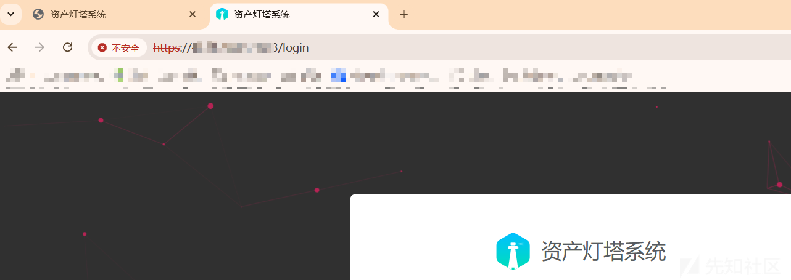

下图为反向代理服务器的效果，大概由于ssl证书、以及我的域名未备案的原因导致了无法完整显示页面，这里不重要，只是展示一个效果而已，有个标题证明代理成功即可。

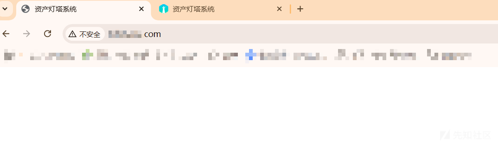

直接用ip访问80端口就不行，就会返回404，因为上面的配置。


直接通过IP访问不行，也就是我们有时候在渗透时，会存在一些IP形式的url，访问会发现返回502、403、404、nginx默认页面、centos默认页面等，这种多半就是代理服务器，它有可能规定了只能使用域名访问，不能直接通过ip访问，这种我们就必须要把这种奇怪的ip保存下来，下面会有用。

还有一种情况就是我们访问一个由域名组成的url，结果啥也没有。但是这个url不能来着这么无缘无故，其实导致这个的原因就是域名被“废弃”，未解析到任何IP，其中就又存在一种可能，就是使用者一开始把这个域名解析到了代理服务器，不过之后又可能某种原因，废除了这域名。**既然之前解析到过代理服务器并且代理服务器使用过，代理服务器的代理配置就极有可能没有被删除。**在上面的基础上，我们就做个实验，模拟上述情况，展示其利用方式。

1、删除域名DNS解析代理服务器

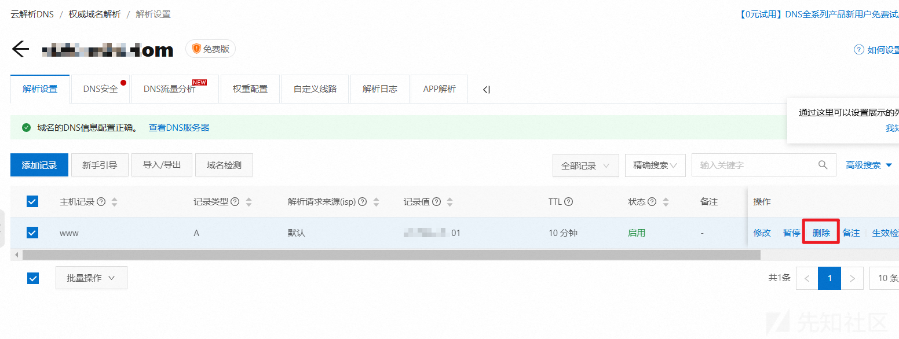

2、静候其失效，就相当于废除了该域名。好了！成功返回502，说明该域名没有解析到任何一个IP

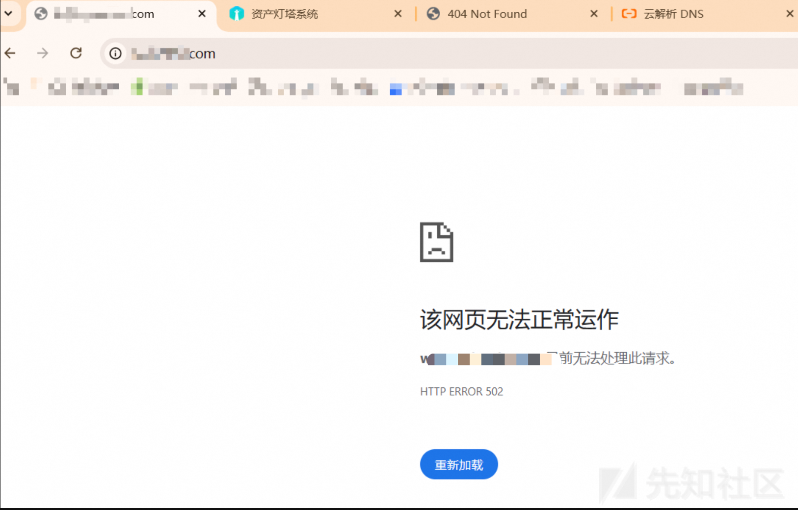

我们重新访问代理服务器的80端口，并抓包，把请求头host修改为之前代理服务器配置的域名，发包

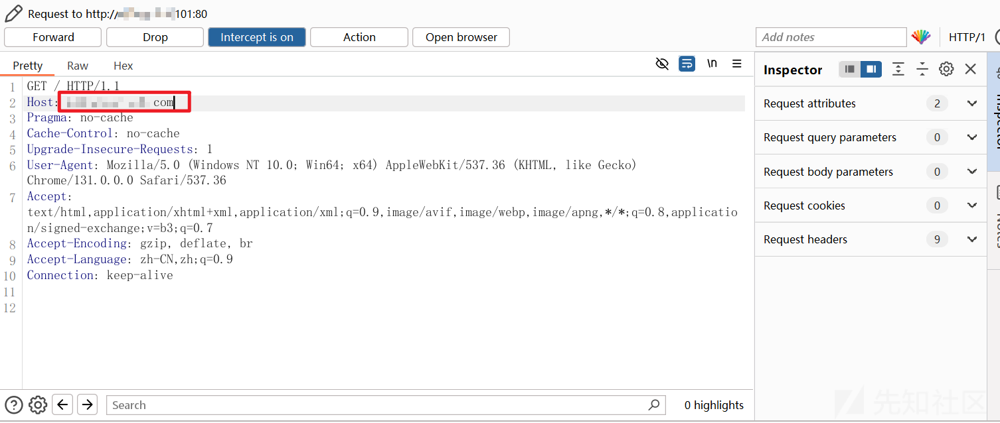

行咯！发现单独使用ip或者域名访问啥也没有，结果两者适当结合一下，却能访问一些不能直接访问的页面。

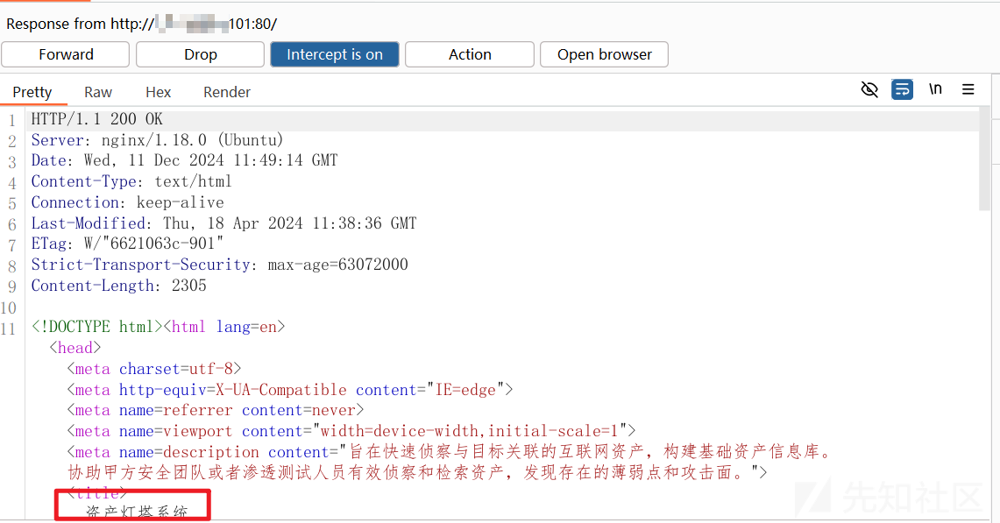

导致这个的原因就是上述提到的**“代理服务器上的配置未删除”**

也就是host碰撞这一技术诞生的根本原因。

## 何为host碰撞？

host碰撞就是通过IP（用作请求url）和域名（用作请求头中的Host）两者的搭配发包，访问到代理服务器，从而访问到可能被隐藏的后端服务器资产的一个信息收集技术。

## host碰撞的作用？

在信息收集收集资产时，发现可能被废弃的代理服务器，从而发现隐藏的后端服务器。所以该操作可以直接在收集c段、ip、域名之后直接做。

## 如何实现host碰撞？

在我们资产收集后，肯定就会存在有些资产不能直接访问的情况，很有可能就是上述实验中的情况，需要host碰撞。而且这样的资产在一些大型的攻防演练、src中**绝对不会少**。所以我们在拿到比较全的 域名资产、ip资产的时候就可以测测活，记录下回显不是200的资产，并分装到**ip.txt、domain.txt**文件中，先解决一部分回显不正常的，然后在指纹识别的时候，可以看到一些标题如：**Centos欢迎页面、nginx页面、其他欢迎页面这种没有实质内容的标题**，我们也可以进一步把他们添加在之前收集的ip.txt、domain.txt文件中。然后直接上工具。

[HostCollision-2.2.9](https://github.com/pmiaowu/HostCollision)

工具功能查看：

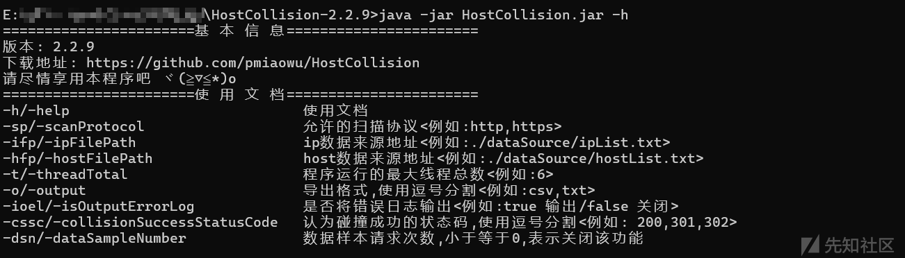

把上述得到的ip.txt、domain.txt扔在该工具目录下

运行以下命令：

```
java -jar HostCollision.jar -ifp ip.txt -hfp domain.txt
```

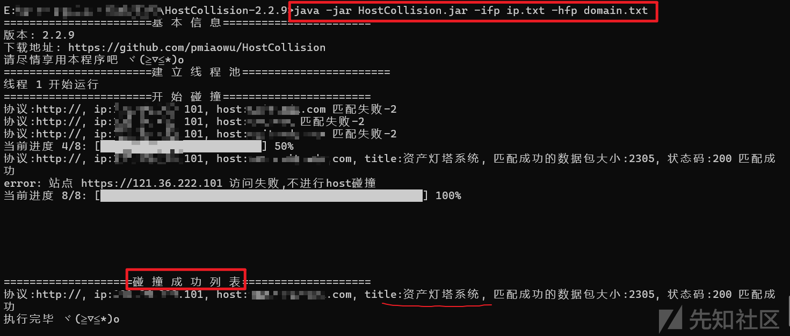

然后得到碰撞成功的列表，我们正常测试站点时肯定不能一直手动切换host，于是下面就推荐两个方法

1、burp（match and replace rules）

方便我们直接抓包测试。

2、浏览器插件：[ModHeader](https://chromewebstore.google.com/detail/modheader-modify-http-hea/idgpnmonknjnojddfkpgkljpfnnfcklj?hl=en)

这个我更为推荐，因为有时候不知道怎么回事，burp的那个匹配替换功能会失效，但是用了插件就可以很好的解决这个问题，它可以自动锁定我们自定义的请求头。

点击Mod，并选择request header

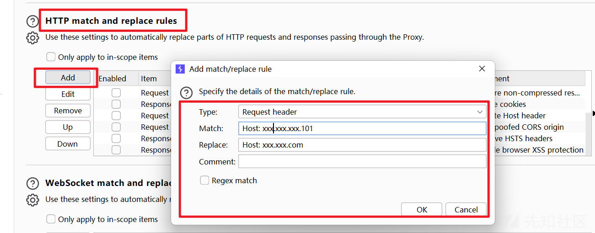

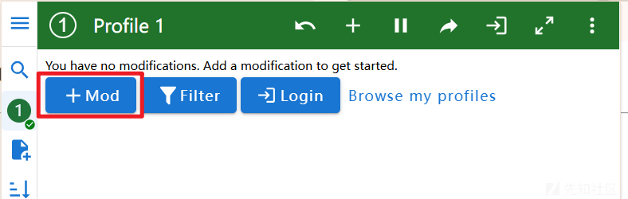

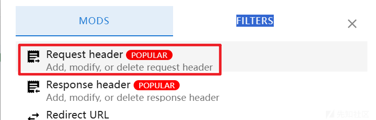

然后填写我们的host及其值即可，就可以不管了，直接刷新网页就行了。

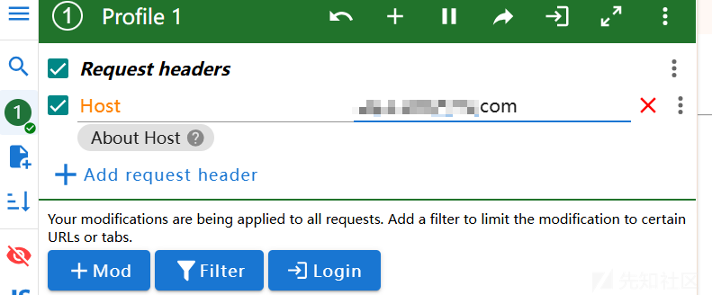

但是这个设置会影响其他网页的正常访问，所以设置只在我们当前测试站点使用，右键扩展图标，然后如下图勾选即可。

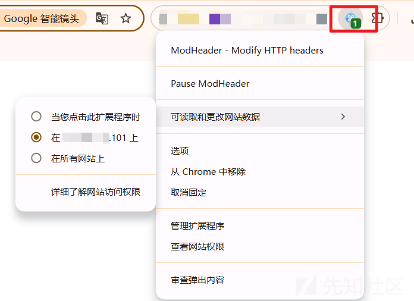

即可正常测试了。
