# 某次证书站的渗透测试经历-先知社区

> **来源**: https://xz.aliyun.com/news/16173  
> **文章ID**: 16173

---

> 文章首发于先知社区，转载请申明来源先知社区
>
> 前言：有了第一次的证书站的渗透经历，让我相信证书站没有那么难挖掘，于是有了下文
>
> 主要分享内容：js敏感信息收集分享、子域名字典收集分享

# 信息收集

> 大部分步骤和我上一篇的文章类似：<https://xz.aliyun.com/t/15998>
>
> ## 子域名收集

和我的上一篇文章一样，我使用subfinder、amass、assetfinder等工具进行收集

```
subfinder -d **.edu.cn -all -o subdomains.txt

amass enum -d **.edu.cn -dir amass4owasp
./oam_subs -names -d **.edu.cn -dir amass4owasp | ./anew subdomains.txt

assetfinder | ./anew subdomains.txt
```

敏感信息收集、ip段收集、然后整理归类

> 每次收集完的子域名就没有价值了吗？之前收集的子域名确实就是这样丢掉了，然而后来我开始收集子域名字典，然后爆破子域名，以下是我推荐的一个子域名字典收集并且爆破的方法

假设我希望收集`baidu.com`的子域名成字典，经过上面的步骤后我已经得到了很多的baudu.com的子域名在我的`subdomains.txt`文件中

* 执行下面的命令将`baidu.com`替换成`FUZZ`

```
sed -r 's/baidu\.com/FUZZ/g' subdomains.txt | tee sub-baidu-dic.txt
```

* 生成字典内容如下

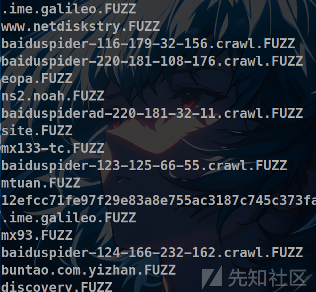

* 然后将这次收集到的不重复的添加到你收集的总字典中

```
cat sub-baidu-dic | ./anew ./dic/自用字典/edu-subdomain-dic.txt
```

* 使用字典爆破你想要爆破的域名
  > 我这里还是以baidu.com为例

```
cat sub-baidu-dic.txt | sed 's/FUZZ/baidu\.com/g' | ./httpx -sc -title -td -location -t 100
```

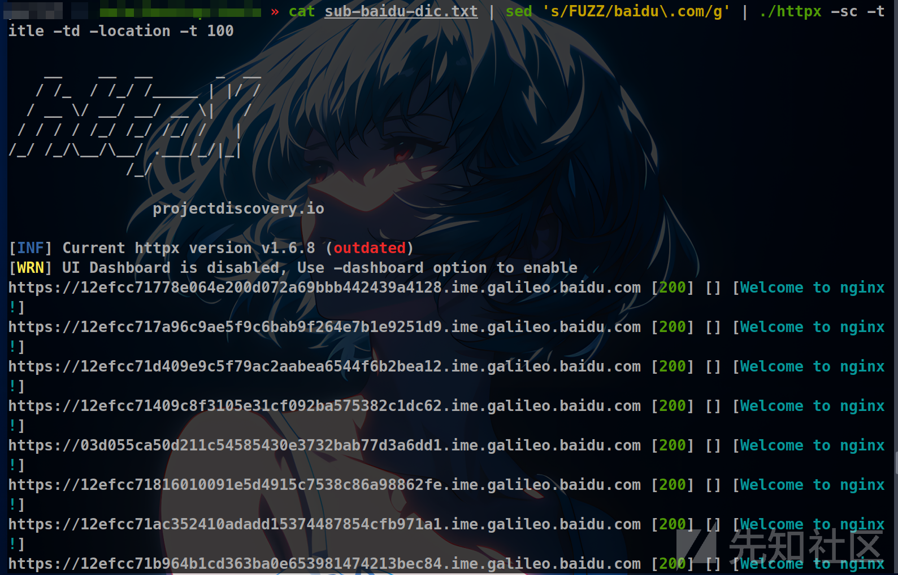

* 或者使用ffuf进行爆破

先将子域名给替换生成完整的域名

```
cat sub-baidu-dic.txt | sed 's/FUZZ/baidu\.com/g' | tee baidu-urls.txt
```

然后使用ffuf进行爆破

```
ffuf -u http://FUZZ -w baidu-urls.txt -c -H "User-Agent: Mozilla/5.0 Windows NT 10.0 Win64 AppleWebKit/537.36 Chrome/69.0.3497.100"
```

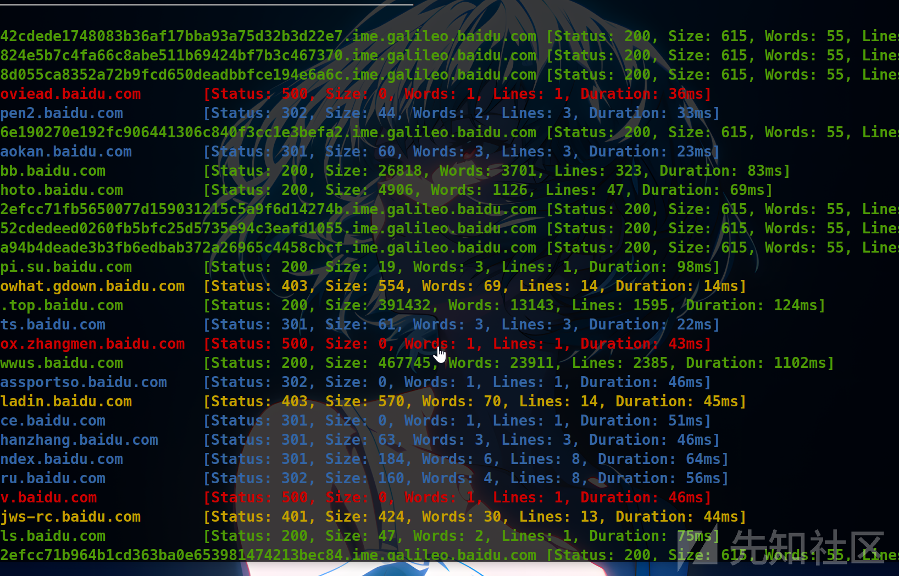

通过上面的流程我可以将所有收集到的渗透测试edu资产储存到我的字典中，供下次的爆破使用

> 这是域名的收集，类似的路由的字典收集，密码的收集，指纹的收集等等平时渗透的时候也可以做一下，积少成多

以上不是本篇文章的重点，经过种种收集以及测试后发现了几个低危漏洞，就不写了，主要写一下发现一个高危漏洞的过程

因为这次没有找到账号密码，所以这一次并不是很顺利，经历了2-3天终于让我在一个api测试的时候发现了敏感信息泄露，并且成功获得严重的9分评分

> 一般那种302直接转到统一身份认证的资产我都是会直接跳过的，但是实在是没有思路了，于是扫描了一下302的资产的目录

* 发现一个如上所述的资产

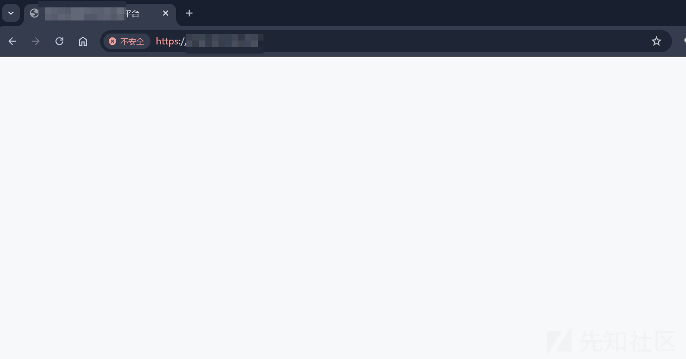

> 我手动让他停止加载了，继续加载的话就会跳转到统一身份认证，如下

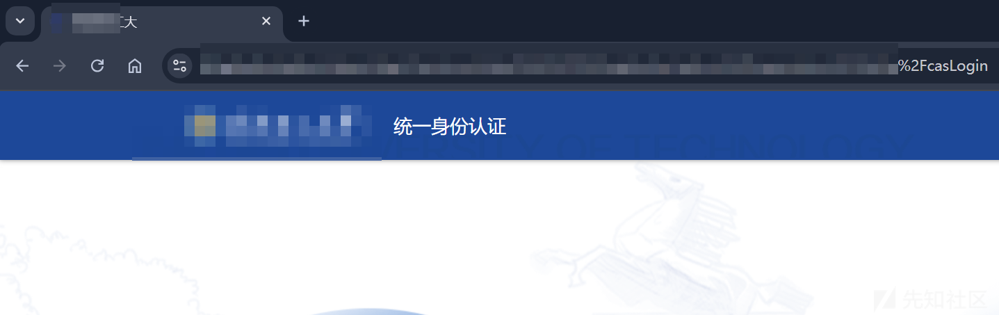

然后我是用如下命令扫描目录

```
./feroxbuster --scan-limit 2 -t 10 --filter-status 404 -x jsp -A -u https://you-url -k --proxy http://ip:10809
```

发现了几个可疑的目录，将他们提取出来，然后使用`katana`爬取所有的链接到指定文件中

```
./katana -list urls.txt -o allurls.txt -proxy socks5://ip:10808
```

如果网站的指纹能够识别的的话，比如说我的这个资产是xx平台，根据这个信息去zoomeye寻找相似的网站，寻找不用统一身份认证的，然后将路由添加到`urls.txt`文件中

* 扫描出来的结果全部储存在allurls.txt文件中，我们需要将所有的js文件的路由提取到js-urls.txt

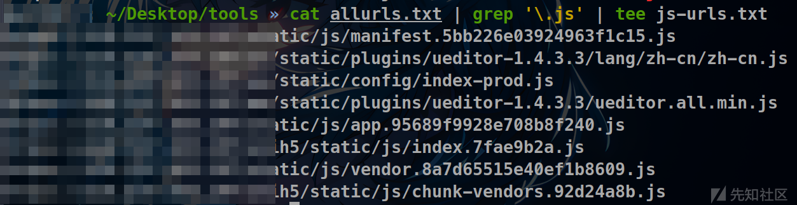

* 然后使用`SecretFinder`扫描js文件，并且将结果放到result.txt文件中

  ```
  cat ../js-urls.txt | while read url; do python3 SecretFinder.py -i $url -o cli; done | tee result.txt
  ```

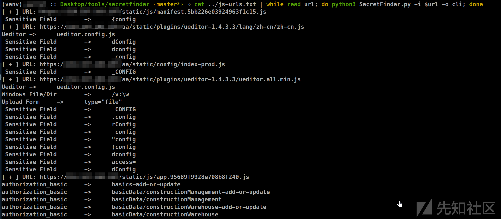

可以自行修改正则匹配，修改SecretFinder.py文件即可

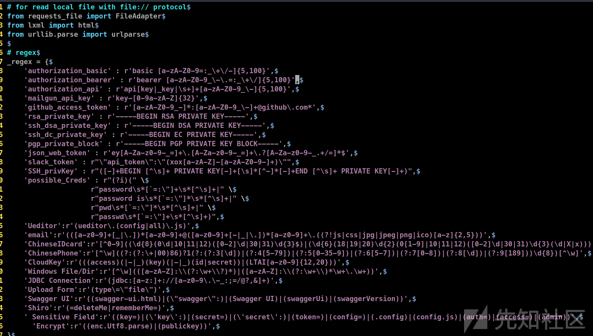

> 将里面的没必要的正则删除了，然后添加觉得有必要的正则，可以使用burp插件hae的正则

既然使用了HaE插件了，那还不如直接使用burpsuite来提取敏感信息

使用`burpsuite`开启代理8090，然后使用`ffuf`使用burp的代理访问`js-urls.txt`文件中的js的地址

```
ffuf -u FUZZ -w js-urls.txt -c -H "User-Agent: Mozilla/5.0 Windows NT 10.0 Win64 AppleWebKit/537.36 Chrome/69.0.3497.100" -x http://ip:8090
```

然后就可以在burp中查看到了hae给我们标出来的重点信息

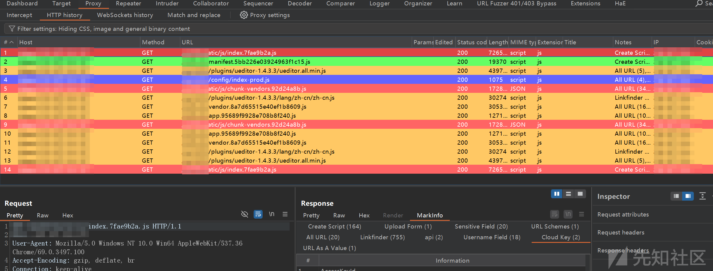

发现泄露了阿里云的accesskey

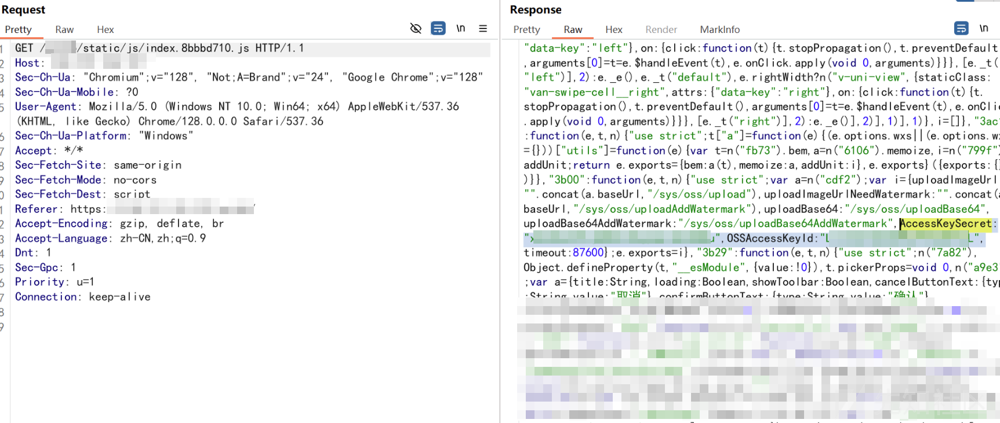  
发现可以接管oss服务

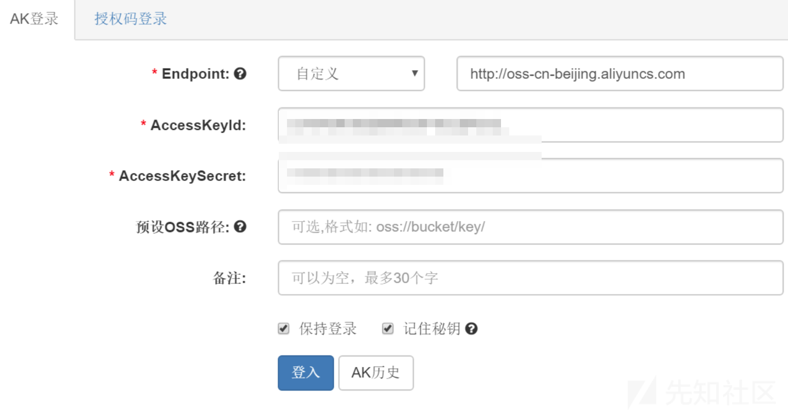

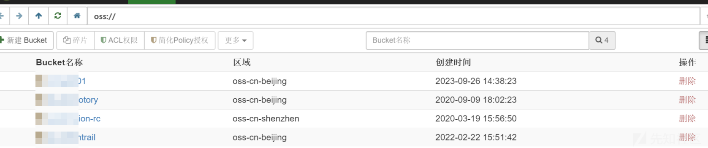

感觉权限挺高，看一下能不能接管主机

使用以下网站进行接管查询

<https://yun.cloudbility.com/>

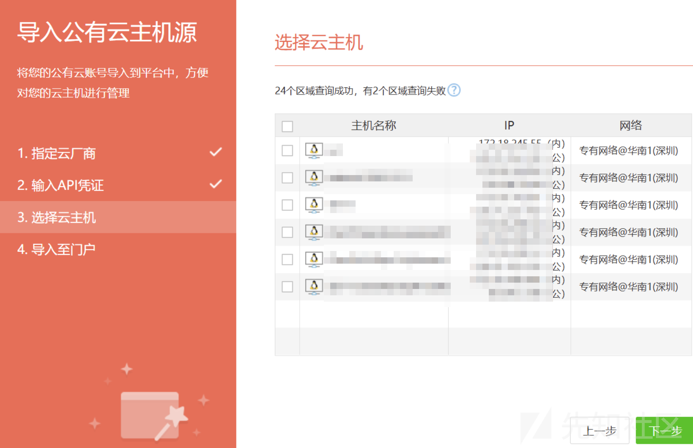

这里随便导入几台试一下

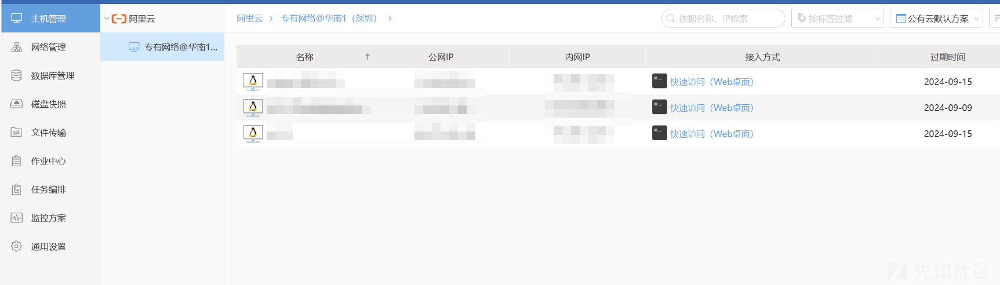

如上图，成功导入主机

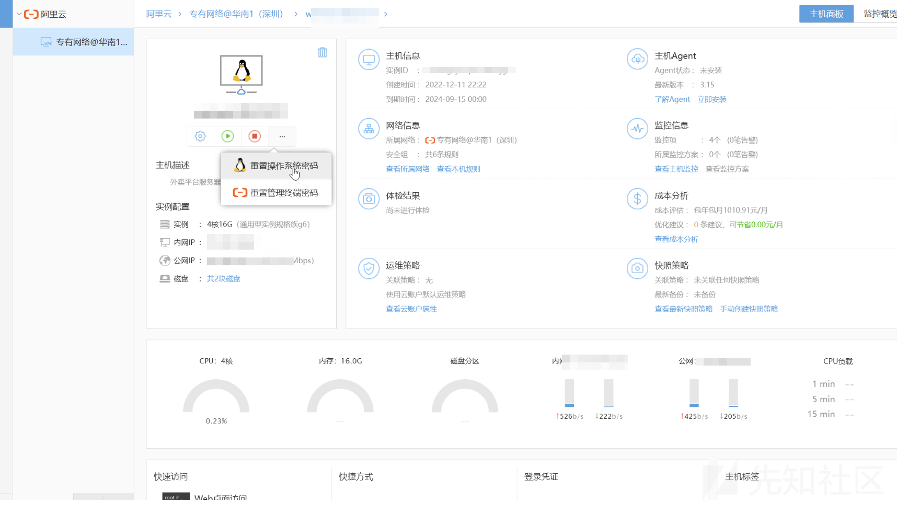

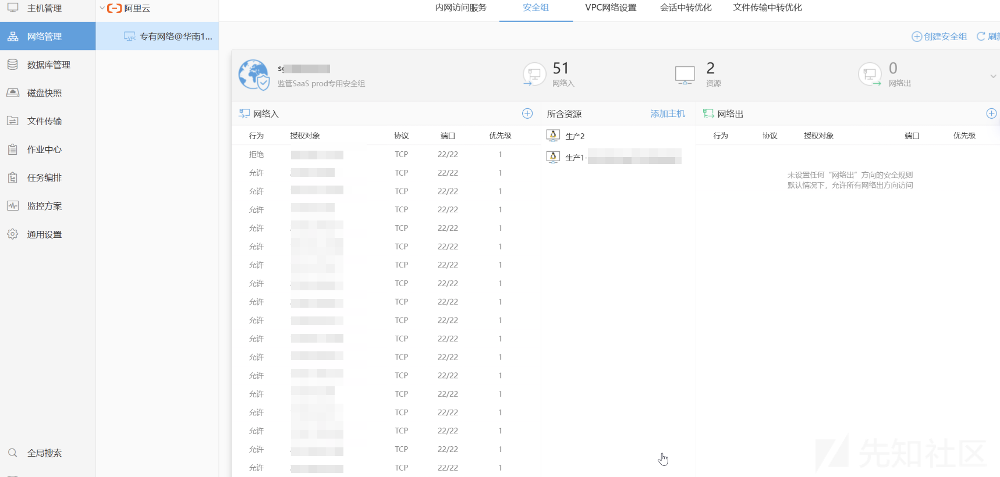

如上图，可以重置密码，配置规则，然后登陆该服务器，因为危害太大我就不操作了，如此可以直接接管并且控制上面的6台主机

然后就这样挖到了一个严重的漏洞，把阿里云的accesskey放在js文件中的我也遇到过几次了，一般都是临时的权限，或者只有oss的权限，第一次遇到这么大的权限的

# 最后

以后发现这种直接跳转的资产也加入测试的行列，可以测一下js是否泄露敏感信息，测试一下api是否存在权限配置不当。最后将子域名、指纹、常见的目录等等整理归纳。

以上是我的渗透测试分享，如果你有什么更好的方法欢迎交流分享
