# 2024金盾信安杯线下赛数据安全部分WP-先知社区

> **来源**: https://xz.aliyun.com/news/16174  
> **文章ID**: 16174

---

# 金盾信安杯线下赛数据安全部分WP

## 1.高频访问识别分析

### 题目描述

在企业排查过程当中，企业运维人员发现了流向大数据平台的业务流量，给出了数据泄露涉事时间段内流入到大数据平台的镜像流量。经过企业初步分析，怀疑大数据能力开放平台的数据库登录界面被高频访问，数据窃取者进一步进行了某非法操作窃取数据库密码，造成了大规模的数据泄露。现给出A企业内部大数据平台被攻击的流量，请选手帮助企业数据安全运维人员找出企业被高频访问的页面IP以及被泄露的数据库密码，并将IP+密码对应的小写32位md5值提交到平台进行评分。

例：IP为127.0.0.1,密码为123456，则flag为flag{md5(127.0.0.1+123456)} ->flag{136f6f35e0e56a7b79e9a67c2ec040e7}

### 题解

查看流量包可以看到流量很多，我们先从`http` 的流量看起，发现访问`i.php` 的流量很多

随便看一个我们能发现这是一个有关于`mysql`登录的界面，且密码作了`AES`加密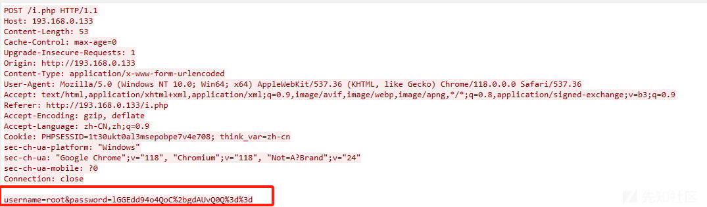

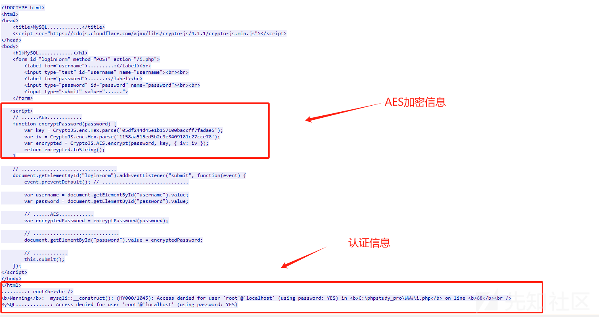

最后这里我们可以看到`mysql`登录的返回信息所以高频访问的`ip` 肯定是`193.168.0.133`至于密码，我们可以看到这是一个登录失败的的信息

所以我们可以筛选出访问`i.php`页面的流量并且不数据包中不含关键字`denied`

```
http.request.uri contains "i.php" and http.response and not frame contains "denied"

```

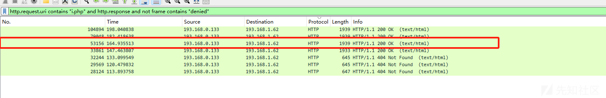

发现这个数据包的内容是登录成功的内容

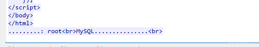

按照JS写的加密逻辑去写解密密码的脚本

```
from Crypto.Cipher import AES
from Crypto.Util.Padding import unpad
from Crypto.Hash import SHA256
import binascii

def decrypt_password(encrypted_password):
    # AES解密需要的密钥和IV
    key = binascii.unhexlify('05df244d45e1b157100baccff7fadae5')
    iv = binascii.unhexlify('1158aa515ed5b2c9e3409181c27cce78')

    # 将加密后的密码从base64解码
    encrypted_password_bytes = binascii.a2b_base64(encrypted_password)

    # 使用AES解密
    cipher = AES.new(key, AES.MODE_CBC, iv)
    decrypted = unpad(cipher.decrypt(encrypted_password_bytes), AES.block_size)

    # 解码并返回解密后的密码
    return decrypted.decode('utf-8')

# 测试
encrypted_password = "cOMb/w12MUUCZQdVdB1cXQ=="  # 替换为你通过JS加密后得到的密码
decrypted_password = decrypt_password(encrypted_password)
print(f"解密后的密码: {decrypted_password}")

```

运行结果

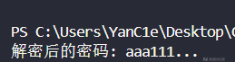

故解密密码为`aaa111...`所以`flag`为`flag{md5(193.168.0.133+aaa111...)}`

`flag{2d8c55e0c3b7577fb40f1e345628eb85}`

## 2.批量访问识别分析

### 题目描述

经对发起高频访问的源IP对应的相关流量进行排查，未发现数据提取和访问行为，随即企业运维人员对题目一中的镜像流量进行分析，请选手找到涉及大量查询的攻击源IP地址，并将IP地址对应的小写32位md5值提交到平台进行评分。

答题格式:flag{md5(ip)}

### 题解

首先添加过滤规则，过滤出`mysql`的查询的流量

```
mysql.query

```

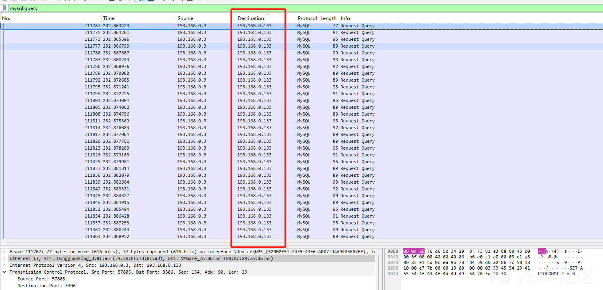

`flag{md5(193.168.0.133)}`

`flag{409fa47b8e075177ad3c16e12877ef0b}`

## 3.数据解析与还原

### 题目描述

在溯源分析的过程中，为了进一步分析企业泄露了哪些类型数据，请选手根据给出的流量包，识别出泄露敏感个人信息字段名称？现给出个人信息编码对照表，请根据泄露的信息与个人信息类型表格进行对照，提交对应序号的md5的32位小写值，如泄露真实姓名及个人电话号码，则提交flag{md5(A+B)}，flag{470c3f34cde50a8a7c4ed8f3926033af}。

| 个人信息 | 真实姓名 | 个人电话号码 | 工作单位 | 学历 | 银行账户 | 身份证 | 护照 | 生日 | 设备信息 |
| --- | --- | --- | --- | --- | --- | --- | --- | --- | --- |
| 序号 | A | B | C | D | E | F | G | H | I |
| **社保卡号** | **IP地址** | **病历** | **住址** | **职位** | **密码** | **民族** | **邮箱** | **口令保护答案** | **交易记录** |
| J | K | L | M | N | O | P | Q | R | S |

### 题解

对于此题我们要重点关注user和info关键词

首先看`fa_user`表

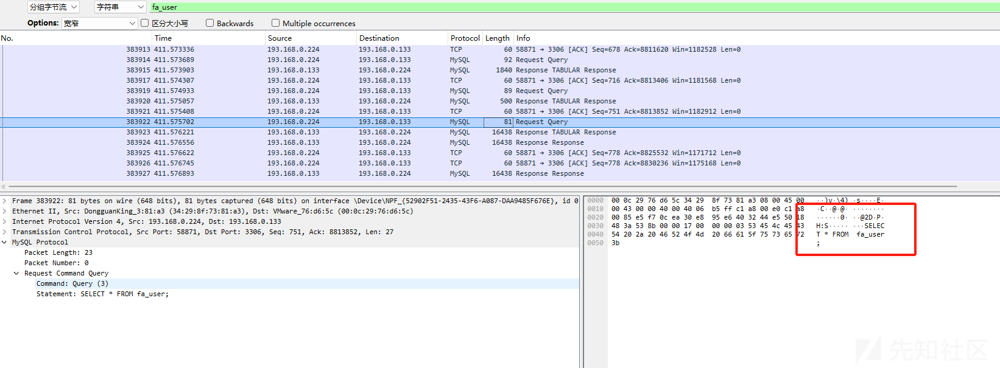

看一下返回的数据

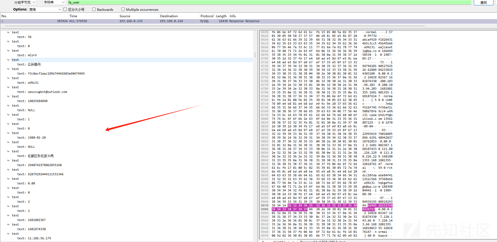

可以看到泄露了姓名 密码 手机号 邮箱 `IP`地址 住址 生日 身份证 银行账户

我们再来看`fa_info`表

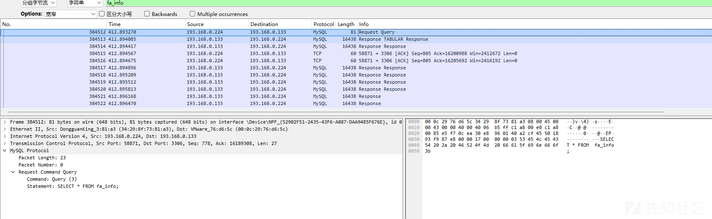

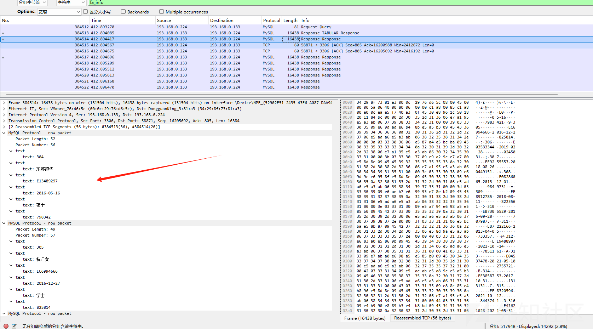

可以看到泄露了学历和护照

所以`flag{md5(A+B+D+E+F+G+H+K+M+O+Q)}`

`flag{9991d1d88648004883d6e12522e35c14}`

## 4.加解密识别和分析

### 题目描述

经分析该大数据平台网络无外联情况，通过溯源锁定了公司内部某位员工的办公电脑，现给出该员工上网的部分流量以及办公电脑系统内存镜像，请选手根据给出的信息找到泄露的网络拓扑图。将图内含有flag的字符提交平台进行评分。

（提示：了解到内部员工具备一定安全意识，重要的文件采取了加密措施）

压缩包密码：ea20f8e5e6bf1105ffeef3d7f300fb84

### 题解

我们使用`vol`进行取证分析

首先分析镜像信息

```
vola -f .\Mem.raw imageinfo

```

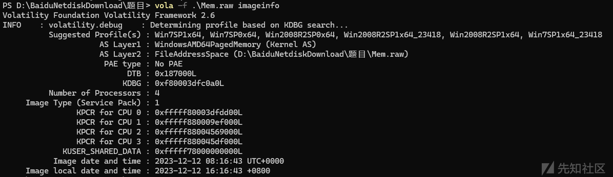

接着我们把镜像中的存在的文件列表重定向到`txt`文件中

```
vola -f .\Mem.raw --profile=Win7SP1x64 filescan > files.txt

```

发现有个`zip`

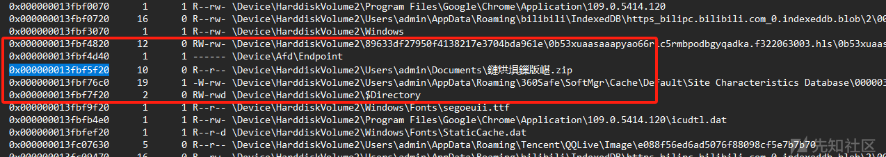

创建一个`output`文件夹，然后把文件`dump`下来

```
vola -f .\Mem.raw --profile=Win7SP1x64 dumpfiles -Q 0x000000013fbf5f20 -D ./output/

```

把第一个文件修改为`zip`

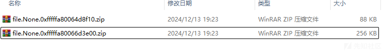

打开发现了拓扑图但是有密码

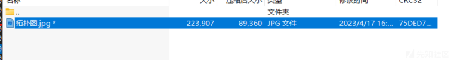

我们再来看数据包发现很多`http`数据包直接导`http`对象

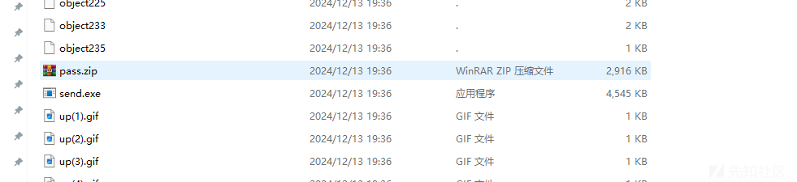

有个`pass.zip`看了内容一眼盲水印

[项目首页 - BlindWaterMark:盲水印 by python - GitCode](https://gitcode.com/gh_mirrors/bli/BlindWaterMark/overview)

```
python bwmforpy3.py decode 1.png 2.png 3.png

```


可以看到密码为`ffzx1f90`解压压缩包发现`flag`

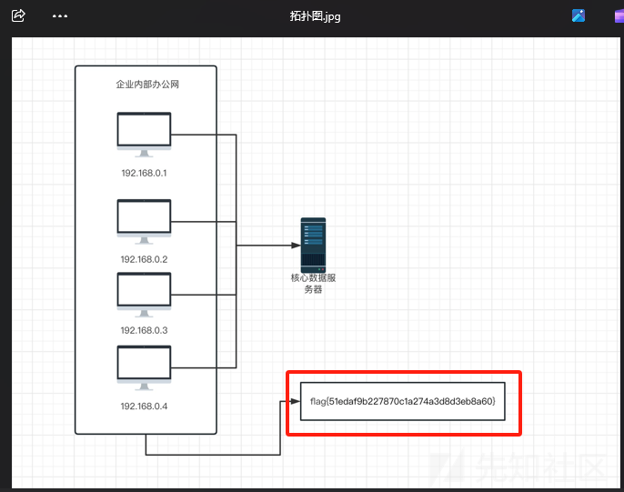

`flag{51edaf9b227870c1a274a3d8d3eb8a60}`

## 5.恶意处理行为分析

### 题目描述

请选手根据该员工办公电脑系统内存镜像进行分析溯源，识别出数据窃取者的恶意进程与外联的恶意ip，按照flag{md5(进程名+恶意ip)}进行提交平台评分。

### 题解

```
vola -f .\Mem.raw --profile=Win7SP1x64 netscan

```

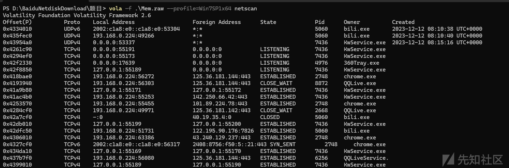

进程比较多不太好分析，经过我手动排查发现`Mfpmp.exe`的文件位置不太对

正常来说此文件应该存在于

```
c:\windows\system32\mfpmp.exe

```

从刚才的`filescan`的结果来

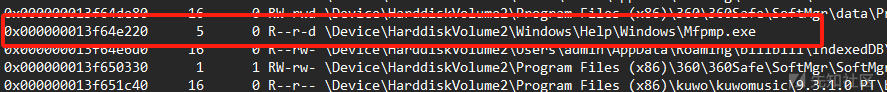

很明显不正确

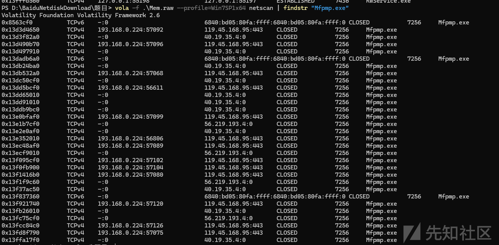

ip就这几个，没环境了尝试提交就好
