# 某次大学的渗透测试经历-先知社区

> **来源**: https://xz.aliyun.com/news/16182  
> **文章ID**: 16182

---

> 文章首发于先知社区，转载请申明来源先知社区
>
> 重点内容：java代码审计分享
>
> 前言：每次渗透测试都要进步一点点，欢迎交流学习

# 信息收集

> 信息收集和我前面文章的步骤差不多，这里就不细写了

之前的文章：<https://xz.aliyun.com/t/15998>

# 源码泄露漏洞

一个个测试找到的可能出现漏洞的资产的时候发现了如下的资产有如下的情况

发现如下的网址会返回文件的路径  
<http://xxx.xxx.edu.cn/trp/file/desc?fileId=438>

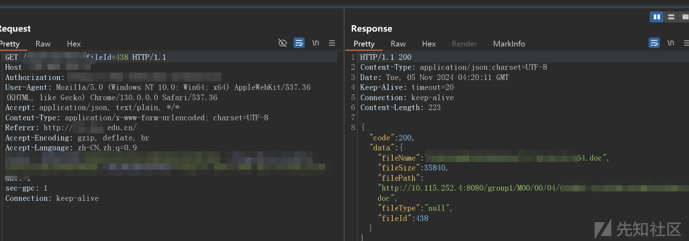

> 返回一个文件下载的地址，但是是内网地址

查看网络，发现了和那个内网地址很像的路由

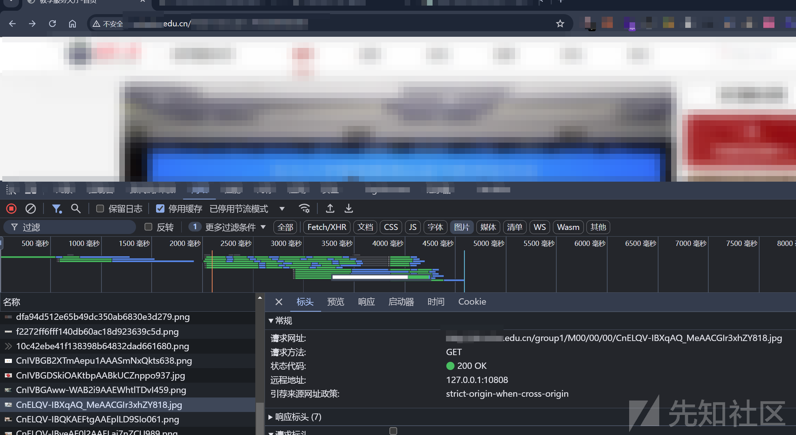

> 试了一下就是这个地址

一帮来说是不会出现什么漏洞的吧，顶多只能下载一些没用的表格、文档、图片之类的，但是万一真的有漏洞呢？于是就顺手爆破了一下参数，从000-999

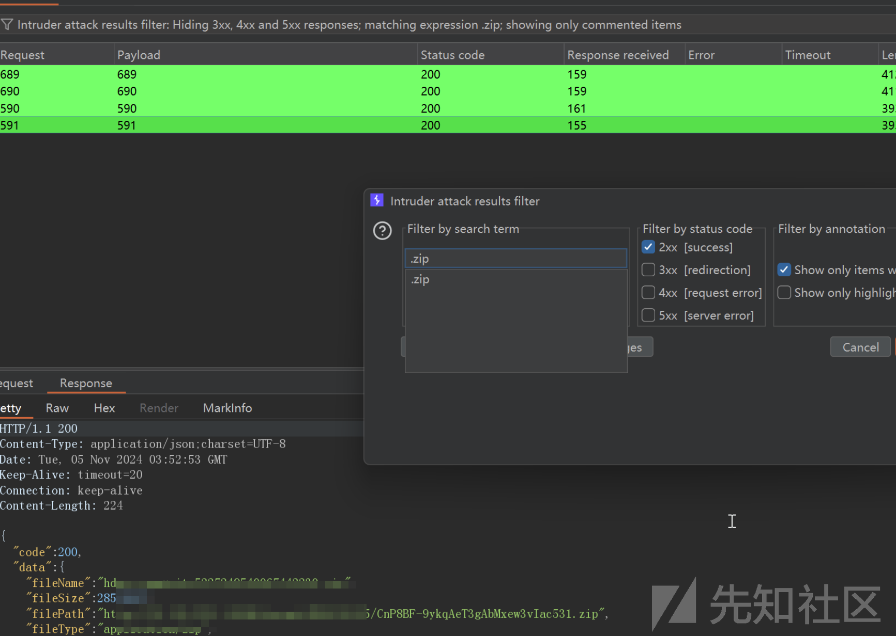

爆破完后搜索一下含有`.zip`的

> 还真的找到一个源码，但是是一个公开的源码，审计了一下并没有发现什么漏洞

* 然后搜索了一下含有`.rar`的

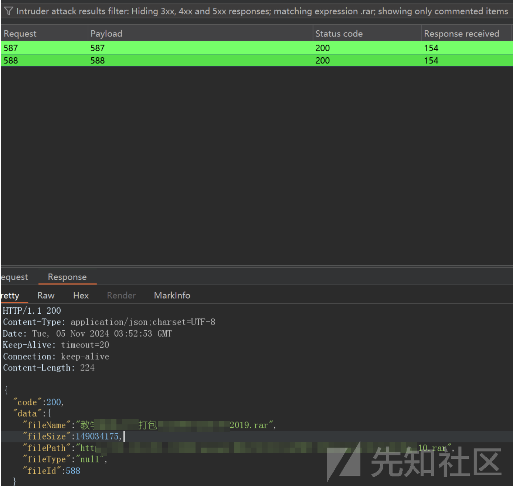

> 不得不说运气不错，真的泄露了源码

# 代码审计找漏洞

> 首先下载解压后就是一个war包，先使用JD\_GUI查看，然后按住ctrl+alt+s保存所有反编译的源码

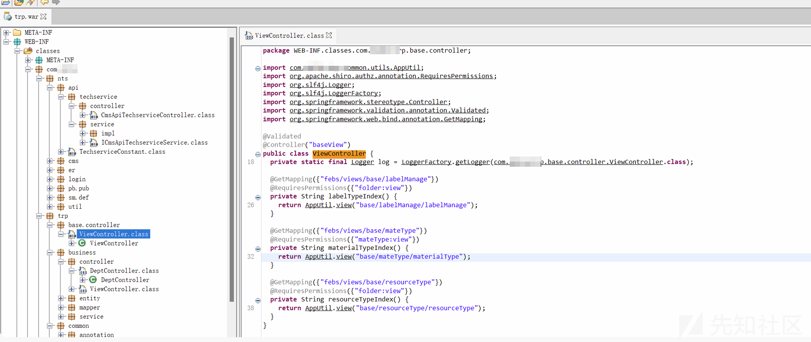

> 像这样可以跳转到指定的类还是挺方便的，但是搜索功能有点不太好，很难快速的定位路由的位置，还是在vscode中查看搜索吧
>
> 因为技术不高，就看了一下sql注入、权限配置、ssrf、第三方依赖、密码配置等

* 首先查看配置文件  
  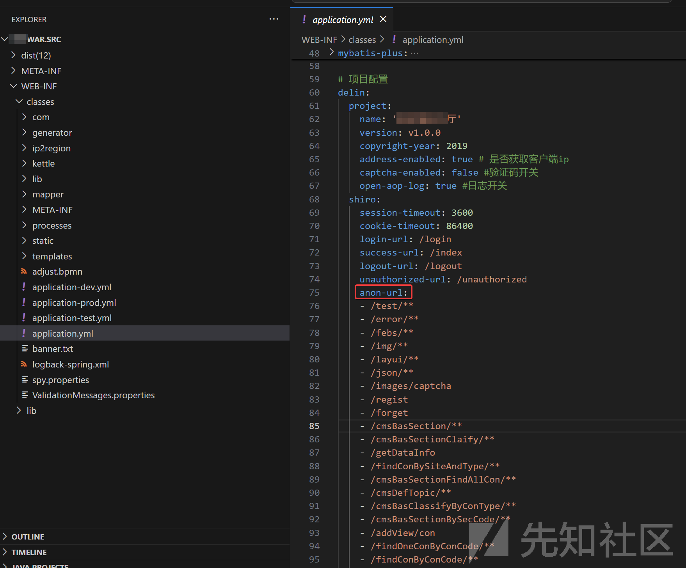

> 可以看到很多框架，mybatis-plus、shiro、jackson、thymeleaf等

如配置文件所示，项目是由shiro控制访问权限，ano-url表示可以匿名访问，我先看了一下有没有未授权的敏感信息泄露

后端地址就直接去网页看一下就知道了

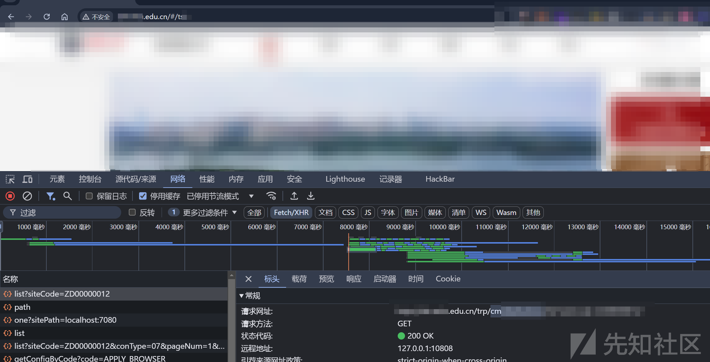

> 后端路由在根目录加一个trp就行了

然后就寻找泄露敏感信息的路由，找到一个地址泄露了老师的姓名、工号和出生日期等  
`/trp/getTeacher`

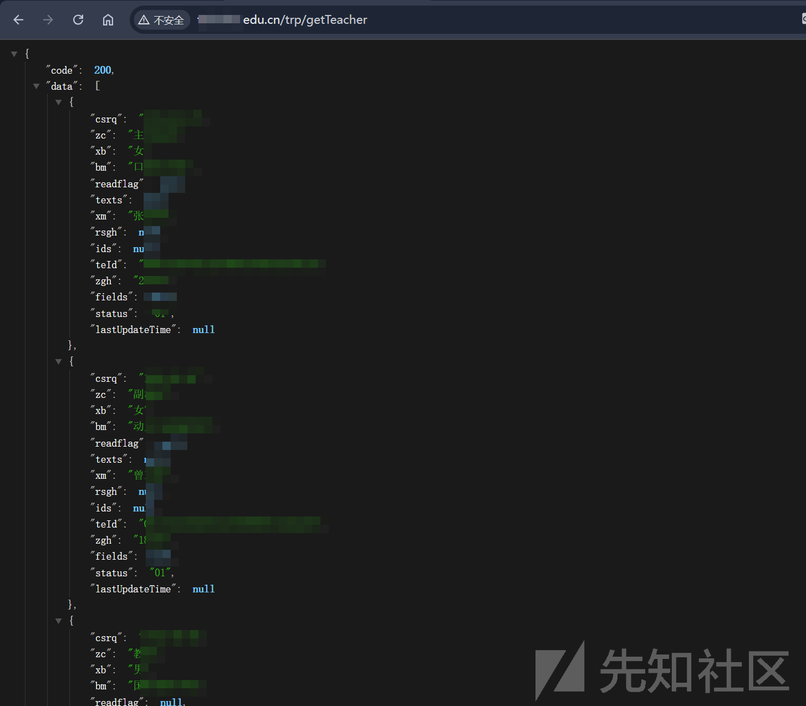

> 总共有8000多条，如果知道学校哪个网站的默认密码的话，使用收集到的工号应该可以爆破来获得账号

另外还有很多的可以直接对网站内容进行操作的路由

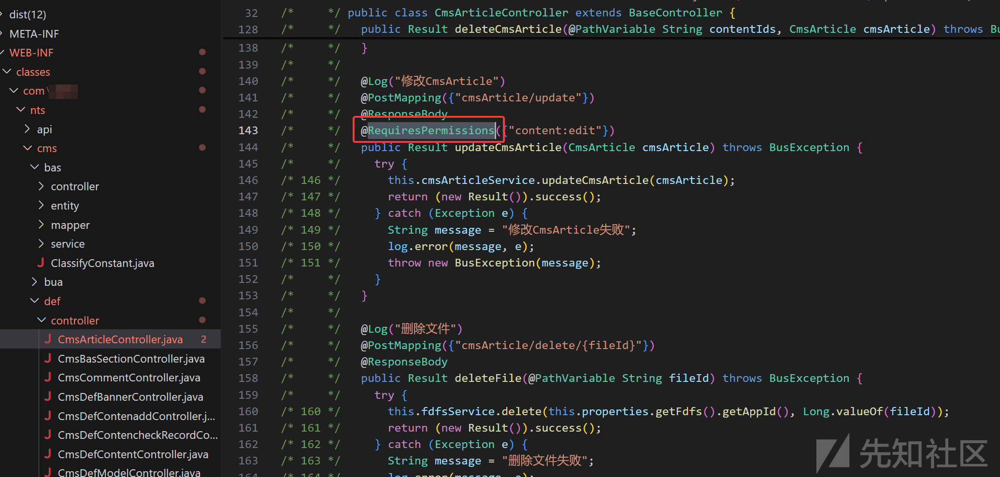

> 像这种有`@RequiresPermissions`就是需要权限的，没有这个的话就能够匿名访问，也就是说虽然不能修改CmsArticle，但是能直接删掉，权限没有配置好，危害还是很大的

可以收集搜索所有的controller文件中的路由，查看是否有权限配置，我这里找到许多位置权限配置不当，就不全列出来了

* 然后寻找sql注入漏洞

因为持久化框架使用的是`mybatis plus`，所以直接全局搜索 `${` ，只发现 `mapper.xml`的一个地方出现

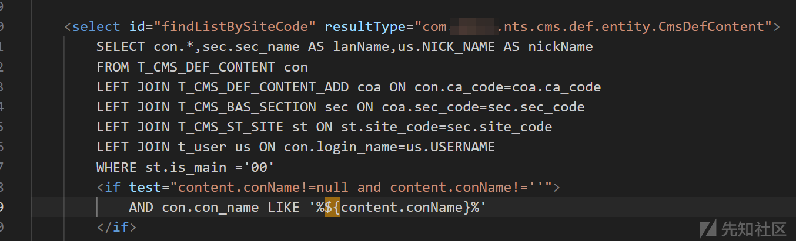

> 如果我们可以控制`content.conName`的值就能够造成sql注入

* 全局搜索`findListBySiteCode`查找该方法的实现类

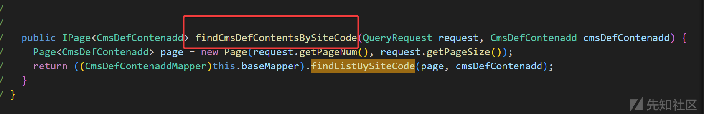

> 可以看到实现类中`findCmsDefContentsBySiteCode`方法调用了`findListBySiteCode`

* 全局搜索`findCmsDefContentsBySiteCode`，在controller中查找

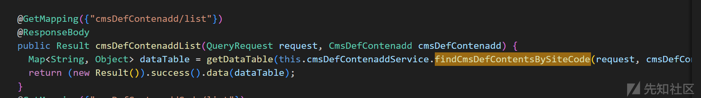

> 都看了一下，全是在响应中调用这个，不能传参控制

* 寻找`conName`是啥，全局搜索`conName`

> 因为想要控制这个参数的值，得先知道这是啥吧

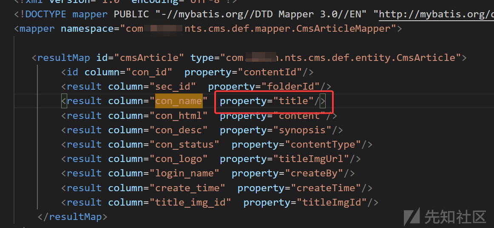

> 在一个配置文件中发现它就是文章的标题

那也就是说只要能创建文件或者修改文章的标题，然后访问`/trp/cmsDefContenadd/list`就能造成sql注入了

但是修改和新增的操作设置了`@RequiresPermissions`都没有权限操作

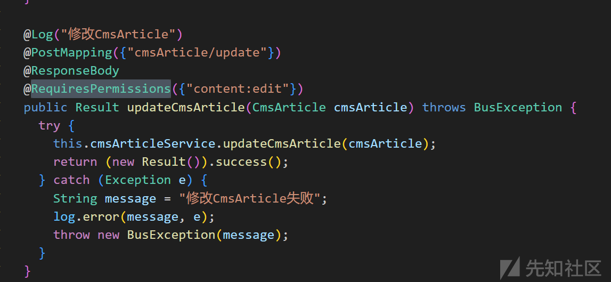

> sql注入漏洞没有找到，还是太菜了（；´д｀）ゞ

然后就看一下第三方依赖漏洞

* 之前提到了shiro，先查看版本，全局搜索shiro

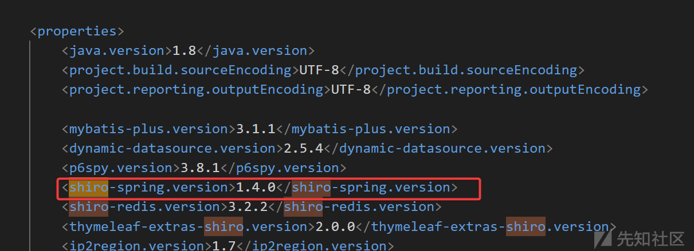

> 版本1.4.0，密钥自动生成，大概率没有漏洞

* 全局搜索`cipherKey`

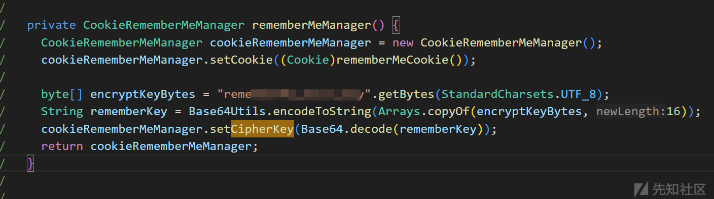

> 竟然配置了默认密钥

将shiroKey根据配置中的方法改成base64加密的格式

```
import java.util.Arrays;
import java.nio.charset.StandardCharsets;
import java.util.Base64;
import org.apache.shiro.crypto.AesCipherService;  
import org.apache.shiro.util.ByteSource;
public class ShiroAESencode {  
    public static void main(String[] args) throws Exception {
        byte[] encryptKeyBytes = "rememberMe_shiro_key".getBytes(StandardCharsets.UTF_8);  
        String rememberKey = Base64.getEncoder().encodeToString(Arrays.copyOf(encryptKeyBytes, 16));
        System.out.println(rememberKey);
    }
}
```

* 使用工具直接利用

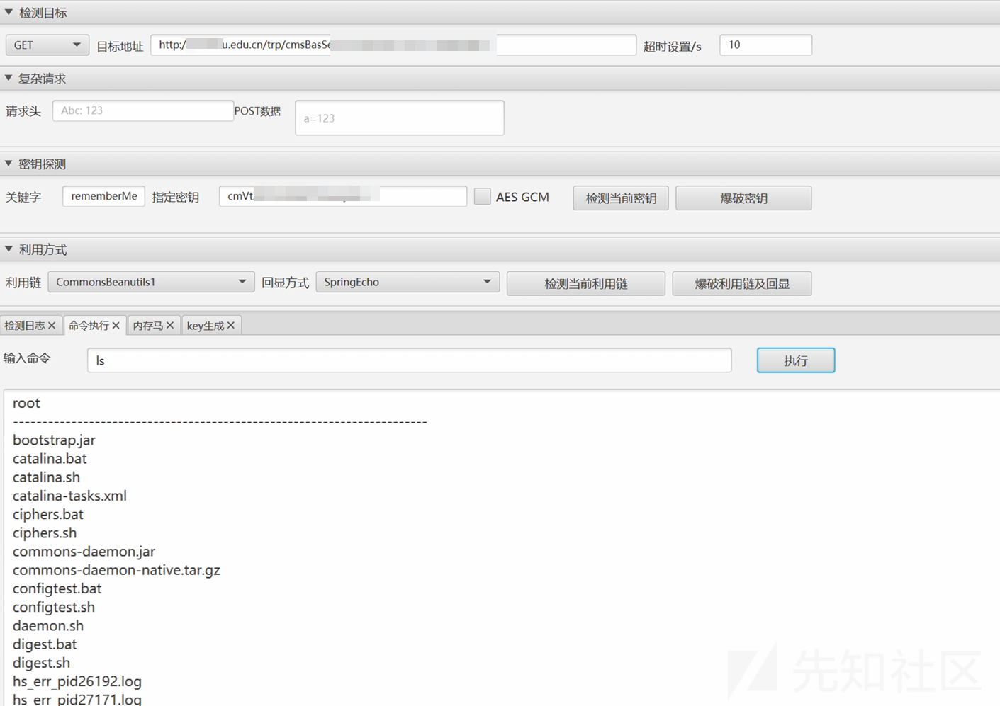

> 利用成功，到此结束了

# 最后

平时渗透时还得细心，不要放过任何一个可能出现漏洞的地方。  
欢迎交流学习，文章有问题的地方欢迎批评指正。
