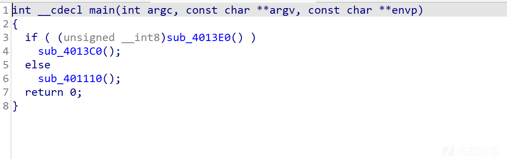
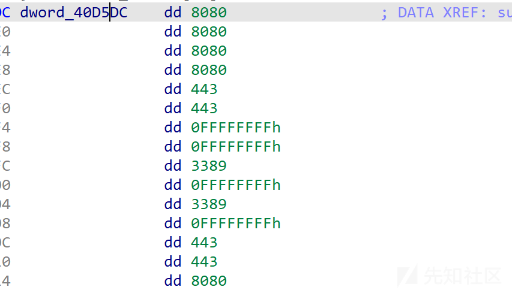
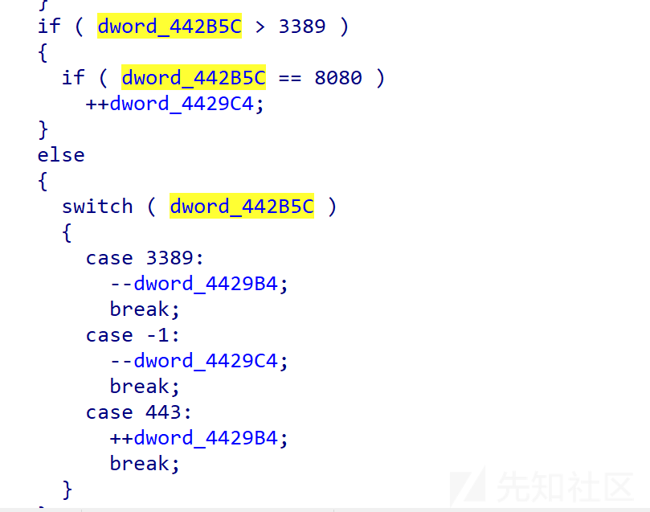
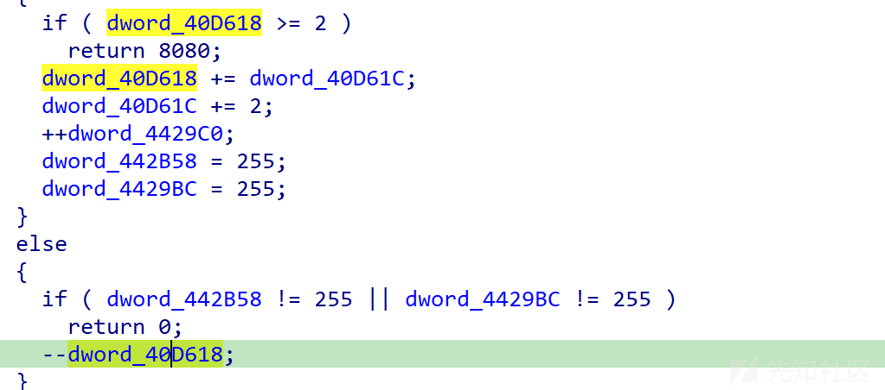

# HITCTF pipe_snake详解-先知社区

> **来源**: https://xz.aliyun.com/news/16185  
> **文章ID**: 16185

---

首先拖入ida查看，可以看到main函数  
  
动调发现先进入sub\_401110函数  
继续动调(一直f7就好了，只是需要点耐心)可以发现进入一个check函数

```
void __cdecl __security_check_cookie()
{
  int v0; // eax
  int v1; // eax
  const char *v2; // eax
  int v3; // eax
  int v4; // eax
  char v5; // [esp+38h] [ebp-18h]
  char v6; // [esp+3Ch] [ebp-14h]
  int i; // [esp+48h] [ebp-8h]

  v0 = sub_3D1520(&unk_40D59C, 28);
  sub_3D1020(v0);
  sub_3D1520(&unk_40D59C, 28);
  v1 = sub_3D1520(&unk_3F6968, 4);
  sub_3D1080(v1, Str1, 100);
  if ( strlen(Str1) != 36 || (v2 = (const char *)sub_3D1520(&unk_40D594, 7), strncmp(Str1, v2, 5u)) || Str1[35] != 125 )
  {
    v3 = sub_3D1520(&unk_3F6954, 19);
    sub_3D1020(v3);
    sub_3D1520(&unk_3F6954, 19);
    sub_3D1520(&unk_40D594, 7);
    _loaddll((char *)1);
  }
  for ( i = 0; i < 15; ++i )
  {
    if ( (unsigned __int8)sub_3D17C0(*((_BYTE *)&dword_40E134 + 2 * i + 1))
      && (unsigned __int8)sub_3D17C0(*((_BYTE *)&dword_40E134 + 2 * i + 2)) )
    {
      if ( *((char *)&dword_40E134 + 2 * i + 1) <= 57 )
        v6 = *((_BYTE *)&dword_40E134 + 2 * i + 1) - 48;
      else
        v6 = *((_BYTE *)&dword_40E134 + 2 * i + 1) - 87;
      Str1[i] = 16 * v6;
      if ( *((char *)&dword_40E134 + 2 * i + 2) <= 57 )
        v5 = *((_BYTE *)&dword_40E134 + 2 * i + 2) - 48;
      else
        v5 = *((_BYTE *)&dword_40E134 + 2 * i + 2) - 87;
      Str1[i] |= v5;
      Str1[i] = Str1[i];
    }
    else
    {
      v4 = sub_3D1520(&unk_3F6954, 19);
      sub_3D1020(v4);
      sub_3D1520(&unk_3F6954, 19);
      _loaddll((char *)1);
    }
  }
}
```

```
BYTE *__cdecl sub_3D1520(BYTE *a1, int a2)//字符串加密函数，最后一个字节是密钥
{
  unsigned int i; // [esp+0h] [ebp-4h]

  for ( i = 0; i < a2 - 1; ++i )
    a1[i] ^= a1[a2 - 2];
  return a1;
}//hint:刚刚用ida进入查看没有这么好看，把int a1改成BYTE *a1即可得到如上代码
```

其中str1是输入，动调得到unk\_43D594是flag{，最后一位是}，unk\_426954是you lost the game(游戏失败)  
即这个函数就是比较这几位，符合即进行接下来的操作  
把dword\_40E134类型改成char

```
for ( i = 0; i < 15; ++i )
  {
    if ( sub_3D17C0(dword_40E134[2 * i + 1]) && sub_3D17C0(dword_40E134[2 * i + 2]) )
    {
      if ( dword_40E134[2 * i + 1] <= 57 )//<='9'
        v6 = dword_40E134[2 * i + 1] - 48;//-'0'
      else
        v6 = dword_40E134[2 * i + 1] - 87;
      Str1[i] = 16 * v6;
      if ( dword_40E134[2 * i + 2] <= 57 )
        v5 = dword_40E134[2 * i + 2] - 48;
      else
        v5 = dword_40E134[2 * i + 2] - 87;
      Str1[i] |= v5;
      Str1[i] = Str1[i];
    }
```

{}中间的30给hex转换成15个字节  
然后会进入

```
char *__cdecl sub_3D1980(unsigned __int8 a1)
{
  _DWORD *v1; // edx
  char *result; // eax
  _DWORD v3[3]; // [esp+0h] [ebp-24h] BYREF
  __int16 v4; // [esp+Ch] [ebp-18h]
  char v5; // [esp+Eh] [ebp-16h]
  unsigned __int8 v6; // [esp+Fh] [ebp-15h]
  _BYTE Source[16]; // [esp+10h] [ebp-14h] BYREF
  char *v8; // [esp+20h] [ebp-4h]

  v8 = (char *)&unk_40E238 + 8232 * a1;
  sub_3D1940(v8 + 24, Source, 16);
  if ( Source[0] == 255 )
  {
    v3[0] = *(_DWORD *)Str1;
    v3[1] = *(_DWORD *)dword_40E134;
    v3[2] = dword_40E138;
    v4 = word_40E13C;
    v5 = byte_40E13E;
    v6 = a1;
    sub_3D1900(v3, Source, 16);
    memcpy_s(v8 + 4124, 0x1000u, Source, 0x10u);
  }
  else
  {
    if ( Source[0] != 15 )
    {
      dword_40E194[Source[0]] = Source[1];
      dword_442648[Source[0]] = Source[2];
    }
    v1 = v8 + 4124;
    *((_DWORD *)v8 + 1031) = -1;
    v1[1] = -1;
    v1[2] = -1;
    v1[3] = -1;
  }
  result = v8;
  *((_DWORD *)v8 + 2055) = 16;
  return result;
}
```

这个sub\_3D1940(解密)和sub\_3D1900(加密)是一个很标准的SM4，没有进行任何魔改，是用于数据传输的  
明显看到如果接收到Source[0] ！=15那么接收数据的2，3字节就会写到数组[第一字节做下标]里  
然后我们查看一下贪吃蛇代码

```
int sub_3D43D0()
{
  int v1; // [esp+0h] [ebp-1Ch]
  int v2; // [esp+4h] [ebp-18h]
  int v3; // [esp+8h] [ebp-14h]
  int v4; // [esp+Ch] [ebp-10h]
  int j; // [esp+10h] [ebp-Ch]
  int i; // [esp+18h] [ebp-4h]

  while ( (unsigned int)dword_4429B8 < 0xF )
  {
    dword_442B58 = dword_40E194[dword_4429B8];
    dword_4429BC = dword_442648[dword_4429B8];
    dword_442B5C = dword_40D5DC[dword_4429B8++];
    v4 = dword_442B60[0];
    v3 = dword_4429C8[0];
    dword_442B60[0] = dword_4429B4;
    dword_4429C8[0] = dword_4429C4;
    for ( i = 1; i < dword_4429C0; ++i )
    {
      v2 = dword_442B60[i];
      v1 = dword_4429C8[i];
      dword_442B60[i] = v4;
      dword_4429C8[i] = v3;
      v4 = v2;
      v3 = v1;
    }
    if ( dword_442B5C > 3389 )
    {
      if ( dword_442B5C == 8080 )
        ++dword_4429C4;
    }
    else
    {
      switch ( dword_442B5C )
      {
        case 3389:
          --dword_4429B4;
          break;
        case -1:
          --dword_4429C4;
          break;
        case 443:
          ++dword_4429B4;
          break;
      }
    }
    if ( (unsigned int)dword_4429B4 > 4 || (unsigned int)dword_4429C4 > 4 )
      return 53;
    for ( j = 0; j < dword_4429C0; ++j )
    {
      if ( dword_442B60[j] == dword_4429B4 && dword_4429C8[j] == dword_4429C4 )
        return 53;
    }
    if ( dword_4429B4 == dword_442B58 && dword_4429C4 == dword_4429BC )
    {
      if ( dword_40D618 >= 2 )
        return 8080;
      dword_40D618 += dword_40D61C;
      dword_40D61C += 2;
      ++dword_4429C0;
      dword_442B58 = 255;
      dword_4429BC = 255;
    }
    else
    {
      if ( dword_442B58 != 255 || dword_4429BC != 255 )
        return 0;
      --dword_40D618;
    }
    if ( dword_40D618 <= 0 )
      return 3306;
    if ( dword_40D618 > 8 )
      return 25565;
    if ( dword_40D618 == 8 )
      return -1;
  }
  return 3306;
}
```

如果dword\_40D618==8,那么flag就是正确的，我们来分析一下代码  
把每个dword都双击进入一下，发现dword\_40D5DC是这样的  
  
然后对dword\_442B5C进行赋值，后面也有多处对dword\_442B5C进行比较然后贪吃蛇进行移动  
  
dword\_40D618代表分数，初始分是五分，dword\_40D61C代表吃食物加的分数（初始值为3），每吃到一次dword\_40D61C+2  
  
如果dword\_40D618>1不会进入食物加分阶段，且每移动一次分数-1，所以分数应该是这样  
5-4-3-2-1-(4)-3-2-1-(6)-5-4-3-2-1-(8)  
在括号的地方投喂食物  
然后我们返回main函数查看，发现sub\_4013C0双击进入有MZ文件头，把数据导出成一个新的文件

```
#include <idc.idc>
static main(){
    auto i,fp;
    fp=fopen("dump","wb");
    for(i=0x426980;i<=0x43D57F;i++){
        fputc(Byte(i),fp);
        }
}
```

把dump出来的文件拖入ida，发现关键函数

```
for ( i = 0; i < 15u; ++i )
  {
    if ( v4[i] == (unsigned __int8)byte_414D18[v11] )
    {
      LOBYTE(v6[0]) = i;
      if ( v11 == 25 )
      {
        *(_WORD *)((char *)v6 + 1) = -1;
      }
      else
      {
        BYTE1(v6[0]) = v11 % 5;
        BYTE2(v6[0]) = v11 / 5;
      }
      sub_401220(hNamedPipe, (int)v6, 0x10u, 0);
    }
  }
```

v4是输入的flag，与byte\_414D18比较，最后输出食物的位置是v11%5,v11/5  
v11==25时不下发食物  
把对应贪吃蛇路径画下来，再找到分发食物的时候的坐标(除了规定的三步不用分发食物，即v11为25)  
flag{b3b3b3b340b3b3b3cfb3b3b3b3b3fd}
