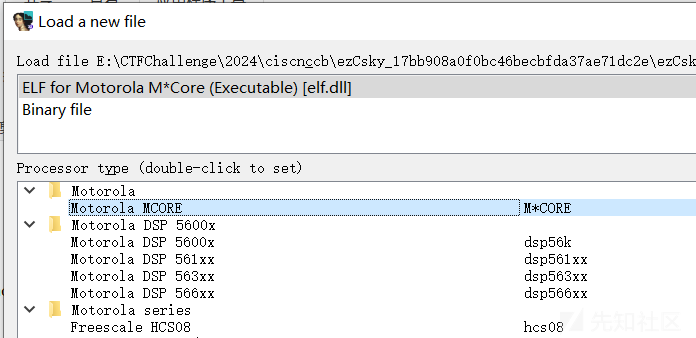
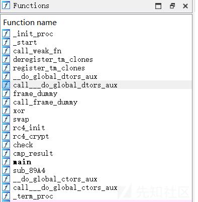
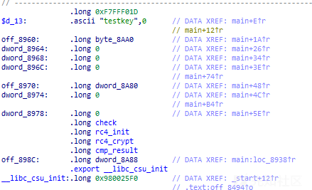
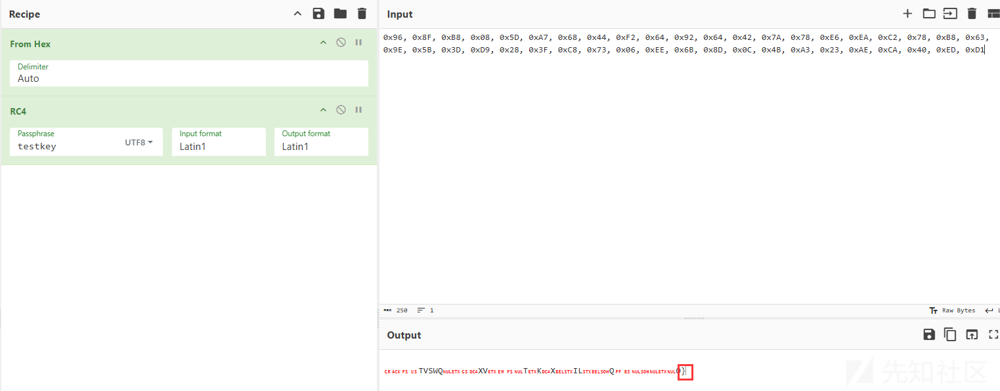

# 第十八届信息安全大赛 && 第二届长城杯 - re-先知社区

> **来源**: https://xz.aliyun.com/news/16203  
> **文章ID**: 16203

---

# ezCsky

找半天，找到个[M-CORE\_IDA-Pro/mcore.dll at master · MotoFanRu/M-CORE\_IDA-Pro](https://github.com/MotoFanRu/M-CORE_IDA-Pro/blob/master/mcore.dll)  
  
能瞅瞅逻辑了。  
看到 `rc4` 等函数：  
  
再看到这些变量：  
  
猜测 `testkey` 是密钥， `byte_8AA0` 是结果。  
  
最后一个大括号，直接猜测相邻的异或。

```
from Crypto.Cipher import ARC4

data = [0x96, 0x8F, 0xB8, 0x08, 0x5D, 0xA7, 0x68, 0x44, 0xF2, 0x64, 0x92, 0x64, 0x42, 0x7A, 0x78, 0xE6, 0xEA, 0xC2, 0x78, 0xB8, 0x63, 0x9E, 0x5B, 0x3D, 0xD9, 0x28, 0x3F, 0xC8, 0x73, 0x06, 0xEE, 0x6B, 0x8D, 0x0C, 0x4B, 0xA3, 0x23, 0xAE, 0xCA, 0x40, 0xED, 0xD1]
key = b"testkey"
cipher = ARC4.new(key)
data = cipher.decrypt(bytes(data))
data = bytearray(data)
for i in range(len(data) - 2, -1, -1):
    data[i] ^= data[i + 1]
print(bytearray(data).decode())

```

# dump

有提示：

> 字符编码算法
>
> 注意：正确的flag长度为22，第13位为4

通过尝试，发现是单字节加密，且位置无关：

```
.\re.exe flag
23291e24

.\re.exe fla1
23291e1c
```

直接开始爆破：

```
import subprocess
exe_path = './re.exe'
table = {}
chartable = "0123456789abcdefghijklmnopqrstuvwxyzABCDEFGHIJKLMNOPQRSTUVWXYZ{}="
for i in chartable:
    process = subprocess.Popen(f"{exe_path} flag{i}", stdout=subprocess.PIPE, stderr=subprocess.PIPE)
    stdout, stderr = process.communicate()
    out = stdout.decode()
    # print(f"{exe_path} flag{i} -> {out}")
    if out[8:] == '':
        print("No output")
        continue
    v = int(out[8:], 16)
    if v in table:
        print(f"Duplicate value {v} for {i}")
    table[v] = i
with open('flag', 'rb') as f:
    data = f.read()
flag = ''
for i in data:
    flag += table[i]
print(f"final {flag}")

```

有几个重复的：

```
python .\exp.py
Duplicate value 0 for 3
Duplicate value 0 for 4
Duplicate value 0 for 5
Duplicate value 0 for 6
Duplicate value 0 for 7
Duplicate value 0 for 8
Duplicate value 0 for 9
final flag{MTczMDc9MzQ2Ng==}
```

根据提示，flag 为 `flag{MTczMDc4MzQ2Ng==}`

# rand0m

先 help 看看：

```
>>> import rand0m
>>> help(rand0m)
Help on module rand0m:
NAME
    rand0m
FUNCTIONS
    check(flag)
    rand0m(x)
DATA
    __test__ = {}
FILE
    e:\ctfchallenge\2024\ciscn&ccb\rand0m_84de0f4fbc09d405e40850e97a05765f\rand0m.pyd
```

hook 一下：

```
class Symbol:
    def __init__(self, name):
        self.name = name

    def __eq__(self, other):
        print(f"Comparing {self.name} and {other:08x}")
        if isinstance(other, Symbol):
            return self.name == other.name
        return self.name == other

import rand0m
tempcheck = rand0m.check
temprand0m = rand0m.rand0m

def mycheck(flag):
    print("Checking flag: ", flag, end=" ->\n")
    result = tempcheck(flag)
    print("Result: ", result)
    return result

def myrand0m(x):
    print("\tRandom: ", x, end=" -> ")
    result = temprand0m(x)
    print(f"\tResult: ({result[0]:08x}, {result[1]:08x})")
    result = (Symbol(f"{result[0]:x}"), Symbol(f"{result[1]:x}"))
    return result

rand0m.check = mycheck
rand0m.rand0m = myrand0m
flag = "1234567890abcdef1234567890abcdef"
print(rand0m.check(flag))

```

得到输出：

```
Checking flag:  1234567890abcdef1234567890abcdef ->
        Random:  12345678 ->    Result: (8c219e43, 22006781)
Comparing 22006781 and 12287f38
        Random:  90abcdef ->    Result: (cd1312bc, 0a38def9)
Comparing a38def9 and 4a30f74d
        Random:  12345678 ->    Result: (8c219e43, 22006781)
Comparing 22006781 and 023a1268
        Random:  90abcdef ->    Result: (cd1312bc, 0a38def9)
Comparing a38def9 and 88108807
Result:  False
False
```

输出变一下，可以判断 check 把每8个hex字符放到 rand0m，然后得到两个结果。  
通过自定义的 Symbol Class，可以知道返回结果的第二个与数据进行比较。  
去看 pyd：  
通过字符串 `rand0m.rand0m` 来找到 `sub_7FF885D712B0`，分析一下可以得到逻辑：

```
def myrand0m(x):
    x = int(x, 16)
    t2 = x >> 5
    x1 = x << 4
    t4 = x1 &  
    t5 = t2 >> 23
    t6 = t4 + t5
    t1 = x ^ 
    t1 = t1 >> 11
    t8 = t1 ** 
    t9 = t8 % 
    return (t9, t6)

```

空着的操作数我没找到。  
首先看 `t6`，其左移和右移其实没损失信息，主要需要看 `&` 的参数，直接输入 `x` 为 `0xFFFFFFFF`，这样 `&` 之后哪里为0，则 `&` 的参数哪里为 `0`。  
输入 `FFFFFFFF`，得到 `fa3affff`，则 `&` 的参数为 `0xFA3AFFFF`：

```
def myrand0m1(x):
    x = int(x, 16)
    x1 = x << 4
    # 0xA3A -> 1010 0011 1010
    t4 = x1 & 0xFA3AFFFF
    t5 = x >> 28
    t6 = t4 | t5
    return t6
```

由于 `myrand0m1` 包含 `&`，有信息损失，`6` 个bit，所以会有 `2**6` 个结果可以得到答案。  
这里遍历 `2**6` 个结果，然后通过 `rand0m.rand0m` 的第一个结果来筛选。  
通过 `rand0m.rand0m` 的第一个结果通过选择一个符合第二个结果验证的输入来得到。  
爆破脚本：  
脚本有点bug，但还是能出结果

```
final2 = [0x98d24b3a, 0xe0f1db77, 0xadf38403, 0xd8499bb6]
flag = [0x812287f3, 0xd4a30f74, 0x8023a126, 0x78810880]

# # 0xA3A -> 1010 0011 1010
# 0xFFA3AFFF
base = "101000111010"
idx = [1, 3, 4, 5, 9, 11]
flag_str = [[] for i in range(4)]
for z in range(4):
    for i in range(2 ** 6):
        test = flag[z]
        i_str_bin = format(i, '06b')
        for j in range(6):
            test = test | (int(i_str_bin[j]) << (23 - idx[j]))
            r = rand0m.rand0m(f"{test:08x}")
            if r[0] == final2[z]:
                print(f"idx: {z} Testing: {i_str_bin} -> {test:08x}: {test:032b}")
                flag_str[z].append(f"{test:08x}")

print(flag_str)

```
