# 实战演示 BurpSuite 插件 SignMe 安装和使用，有签名的接口也可以爆破了-先知社区

> **来源**: https://xz.aliyun.com/news/16217  
> **文章ID**: 16217

---

话说，为了防止爆破、爬虫、自动化扫描器，现在几乎所有的 API 接口都加上了“签名认证”。

> 你猜我为什么这里给“签名认证”带引号？

### 什么是签名？

签名，是一种加密技术，通常是使用消息摘要算法 + 非对称加密方式，用来确保数据来源准确且数据完整性。  
简单来说，签名认证的基本步骤分以下 4 步：

1. 消息摘要：对消息内容进行 Hash 运算（比如：`SHA-256`、`SHA-1`、`MD5` 等），生成唯一标识。
2. 私钥签名：发送者使用私钥，对 Hash 值进行加密，生成数字签名。此时，签名是唯一且保密的，因为只有拥有私钥的人才能生成。
3. 发送消息：将原消息与数字签名一同发送给接收者。
4. 验证签名：接收者收到消息，使用同样的 Hash 算法，计算原消息的 Hash 值，然后再用公钥对数字签名解密，与计算的 Hash 值对比，如果一致，则说明消息来源是拥有正确私钥的人且消息在传输过程中未被篡改。

### 签名的特点

签名认证的主要优点：

1. 身份认证：只有拥有正确私钥的人才能签名，验签者使用公钥能正确解密，则可以确认签名来源于拥有私钥的人。
2. 消息完整性：消息的 Hash 值是唯一的，哪怕发生极小的变动，Hash 值也会完全不同，所以签名可以保证数据传输中不被篡改。
3. 不可否认性：发送者一旦签名，便无法否认发送过此消息，因为只有拥有正确私钥的人才能签名。

### 真实案例，签名破解

本文的重点是分享 `SignMe` 插件，而不是破解签名，所以这一步不会特别详细。  
这是一个真实的支付场景，所以会有比较厚的码，页面就不截图了，直接从请求包开始，见谅...

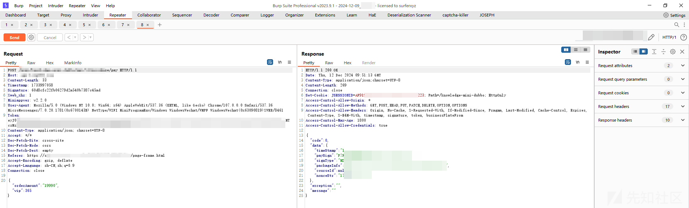

这是个支付请求，`orderAmount` 订单支付为 `19990` 元，VIP 为 `365` 天，箭头指向位置有个 `Signature` 签名，是个 `Hash` 值，这是抓取到的正常请求包，所以成功的返回了 `paySign` 等信息。

尝试修改一下 `orderAmount` 的值，再次发包

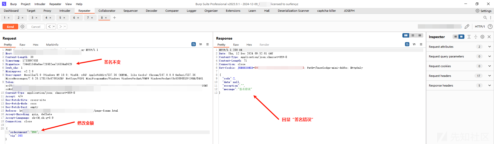

回显“签名错误”。

在 `DevTools` 中，找到签名算法的相关代码

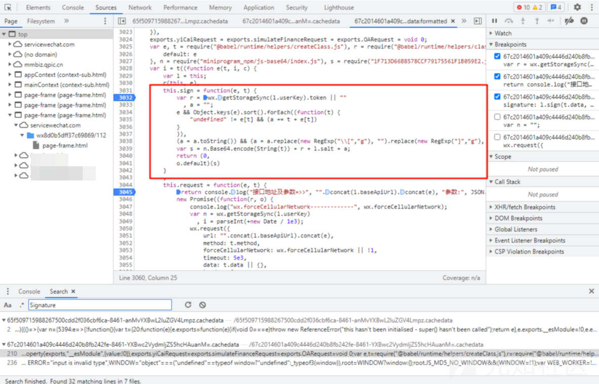

大概可以看到，`sign` 方法就是签名算法的核心，两个入参 `e`、`t` 分别是请求参数和时间戳（这一点忘了截图，上图中体现不到这一点）

`sign` 方法内，先获取了 `Token`，紧接着，对参数 e 进行了基于 `key` 的排序，去除括号引号等操作，然后将时间戳的 `Base64` 编码、`Token`、盐值、经过处理的请求参数拼接到一起，最后调用了 `o.defult` 方法处理。

`o` 经过查找，是 `js-md5` 工具类的引用，所以 `o.default` 调用的应该是 `md5` 算法。

> 到这里，能猜到我很么最开始给“签名认证”带引号了吗？  
> 因为，从严格意义上来讲，这种处理方式并不是完整的“签名认证”。上例中对入参进行了一些常规处理，然后结合时间戳、Token、Salt 等因素，进行 MD5 Hash 算法，这种操作，是一种 Hash 验证，可以保障数据传递过程中的完整性，但并不能满足签名认证的另外两个特点：身份认证、不可否认性。  
> 其实有很多的应用都是如此进行签名的，站在开发人员的角度上，也可以理解，毕竟这类应用的用户目标都是全网用户，换句话来说，即使使用完整的签名认证，那私钥也是需要发放给目标用户（全网用户）的，也就相当于私钥公开，起到的作用并不是很大，仅仅是增加一些破解的难度而已。

言归正传，将这段 `sign` 代码提取出来，略做修改后，参数与上面的包相同，在 vscode 中运行试图获取正确的签名。

> 这里说明一下，sign 方法中的 salt 是一个盐值，在 js 中是一个常量，这里截图没有截取到

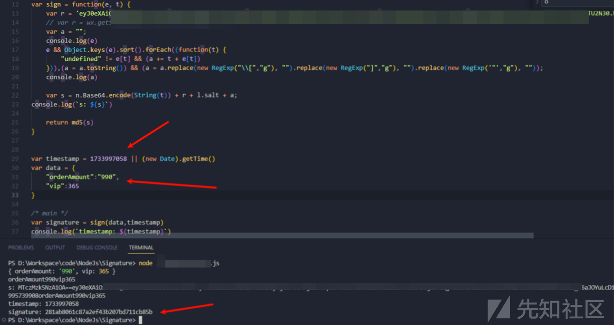

获取成功，在 BP 中修改 `Signature` 的值，再次发包

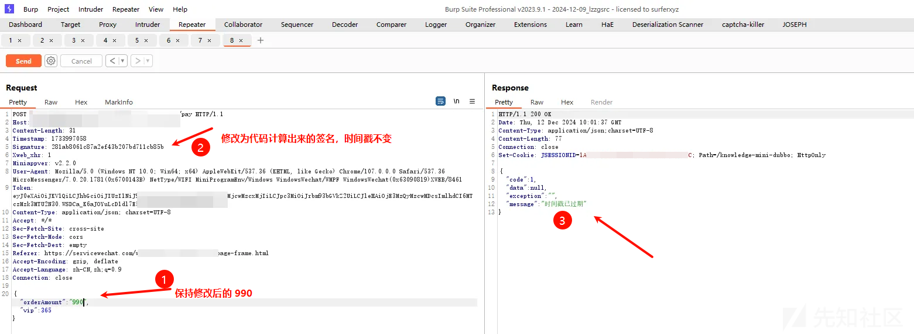

提示从“签名错误”变成了“时间戳过期”，看来签名有可能是正确了，但是破解签名用的时间比较长导致时间戳过期了

修改一下 js 代码，不指定时间戳，获取当前的时间戳，并打印出来

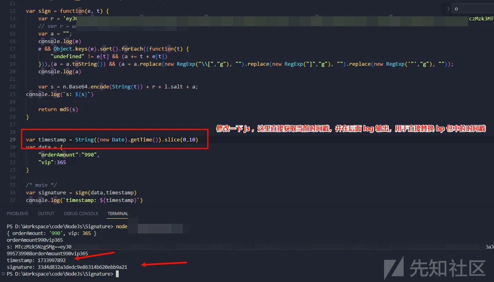

然后同时修改 `Repeater` 包中的 `Timestamp` 和 `Signature`，再次发包

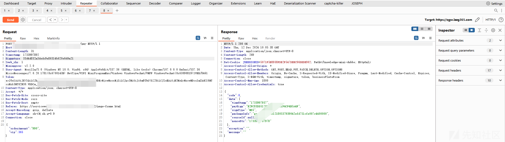

请求成功了。

一般，到这里也就结束了，毕竟这只是个支付接口。

但是，作为懒人代表，让我改一次参数，就运行一次代码去获取签名，这种重复性的工作，是我最反感的，更何况，万一以后碰到一个登录接口、遍历接口之类需要爆破的，岂不是要抓耳挠腮了。

于是，本文的重头戏终于到了...

### SignMe 插件

> 吃水不忘挖井人，`SignMe` 插件的 GitHub 如下，感谢作者的开源精神~  
> <https://github.com/lightless233/sign-me-2>

至于插件如何安装、如何使用，原作者在 GitHub 的文档中写的已经很详细了，十分简单，直接下载 `jar` 包然后导入就可以，此处就不赘述了，本文还是主要分享一下我的使用过程。

插件安装完成之后，访问 <http://localhost:3336/rule-manager> 进入管理页面。

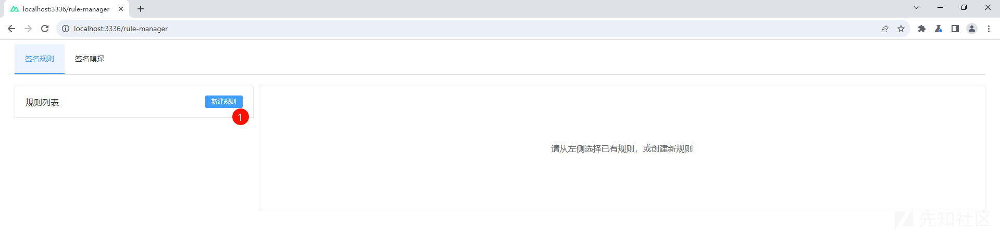

点击“新建规则”，取个名字

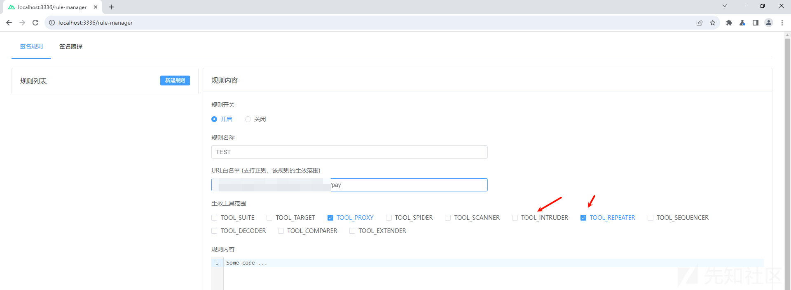

填入 URL 白名单，就是你希望运用到这个自定义签名规则的 URL，勾选生效范围，生效范围就是在 BP 中那些模块生效，通常 Proxy 和 Repeater 模块就足够了，如果要用到爆破，就再勾选上 `Intruder` 模块。然后，就可以尽情地编写 JS 代码，实现自定义签名规则了。

到这里，我觉得有必要简单补充一下 `SignMe` 插件的基本工作流程，否则很多朋友可能并不知道 JS 里面该写些什么内容。

这款插件会先识别经过 BP 的 `HTTP` 请求包，然后根据创建规则时填写的白名单，过滤出符合白名单的 URL，对于这些 `URL`，会执行 `SignMe` 插件的 `main` 方法，并且可以获取到 Request 包（换言之，你可以在 `main` 方法中，获取到请求包，并对其进行修改）然后通过 `return` 方法，再返回一个对象数组，这个返回的对象数组中，可以声明要将 Request 包中的什么位置的什么属性以什么样的方式（覆盖、新增、删除、修改）变更为什么内容。

所以，我现在要做的事情可以分为以下几个步骤：

1. URL 过滤这个支付请求（新建规则时已经完成）
2. 编写 `main` 方法
3. `main` 方法中，从 `request` 请求中获取签名所需要的变量：请求参数、`Token`，并获取当前时间戳。
4. 根据之前获取到的 `sign` 函数，提取签名所需要的常量 `salt`，并对上一步获取到的请求参数做同样的排序、过滤符号等处理
5. 参照原 `sign` 签名方法，对处理结果做 `md5` 算法
6. 返回对象数组，声明两个参数处理方式：①. 覆盖`（OVERRIDE）Header` 中的 `Signature` 属性，值为计算出来的 `signature`；②. 覆盖 `Header` 中的 `Timestamp` 属性，值为代码中获取到的 `ts` 的值

完整的代码如下，其中盐值做了脱敏处理，`utils` 是插件自带的工具库：

```
/* 内置方法查看文档：https://github.com/lightless233/sign-me-2 */
/**
 * utils.base64encode(xxx)
 * utils.md5(xxx)
 */
/**
 * 入口函数
 */

let salt = 'xxx';

function main(){
  // log(`request: ${request}`);
  const method = request['HTTPMethod'];
  // log(`method: ${method}`)
  if(method == 'GET'){
    return []
  }
  if(method == 'POST'){
    let token = request.headers['Token']
    // log(`token: ${token}`)
    let ts = utils.getTimestamp(); // 精确到 13 位。文档说参数为 1 时精确到 10 位，但是实测时发现不生效，于是保留 13 位在后面截取一下
    log(`ts: ${ts}`)
    let params = utils.getParametersByType(ParameterType.PARAM_JSON)
    // 直接 get 到的是这种格式，所以还得处理一下：{name=orderAmount, value=990, location=6},{name=vip, value=7, location=6}
    let e = {}
    utils.sortParameters(params, SortType.ASC).forEach(it => {
        e[it.name] = it.value
    });
    // log(`params: ${JSON.stringify(e)}`)

    /* 这些是从 js 文件中复制出来的 */ /* GraalVM 不支持 RegExp 正则表达式语法，需要变更为 replace 方法 */
    var a = "";
    // e && Object.keys(e).sort().forEach((function(t) {
    //     "undefined" != e[t] && (a += t + e[t])
    // })),(a = a.toString()) && (a = a.replace(new RegExp("\\[","g"), "").replace(new RegExp("]","g"), "").replace(new RegExp('"',"g"), ""))
    e && Object.keys(e).sort().forEach((function(t) {
       "undefined" != e[t] && (a += t + e[t])
    }));
    // a = a.toString().replace(/[\\[\]"]/g, "");

    // 时间戳截取前 10 位
    var s = utils.base64encode(String(ts).slice(0, 10)) + token + salt + a;
    log(`s: ${s}`)
    /* end */
    var signature = utils.md5(s)
    log(`signature: ${signature}`)
    return [
      {name: "Signature", value: signature, location: ParameterType.HEADER, action: EditAction.OVERRIDE},
      {name: "Timestamp", value: ts, location: ParameterType.HEADER, action: EditAction.OVERRIDE}
    ]
  }
}

```

编写 JS 代码过程中，有以下几点需要留意：

1. 插件是基于 `GraalVM` 语法的，所以不直接支持正则表达式 `RegExp` 处理，所以原 `sign` 方法中关于正则表达式的部分可以修改为 `replace` 方法；
2. 插件自带的 `utils.getTimestamp()` 方法，文档中描述参数为 1 时，会去 10 位精度，否则 13 位，但我使用参数 1 时没有成功，我也并未深入研究，直接替换成了 `slice` 方法截取 10 位。
3. 插件自带的 `utils.getParameterByType(ParameterType.JSON)` 方法获取到的参数格式和 BP 请求包中的格式略有区别，需要单独处理一下，具体参照上面的代码或者官方文档。

OK，编写完成后保存规则

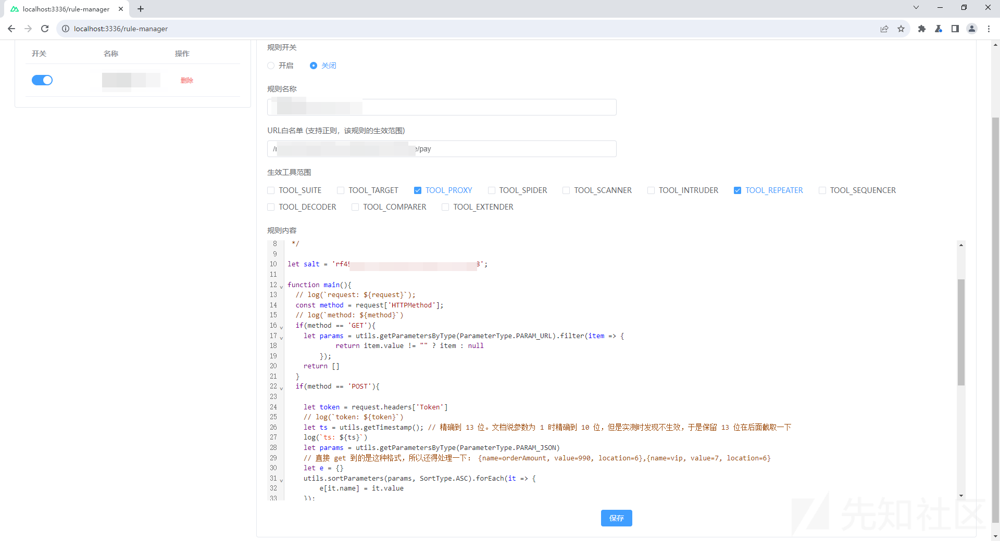

进入 BP 的 `Repeater` 模块，保留修改过的参数 `orderAmount` 为 990，其他如 `TimeStamp` 和 `Signature`都不需要修改，直接 `Send`

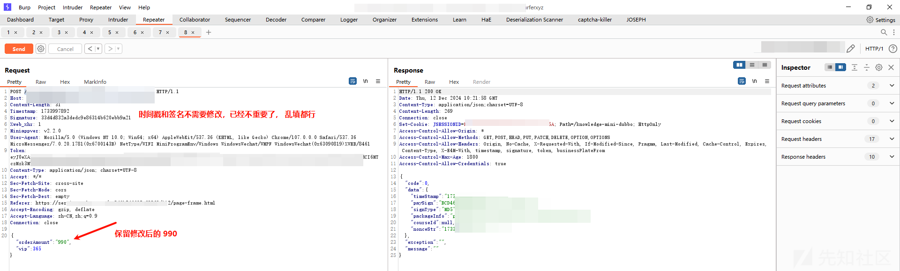

请求成功，返回了 `paySign` 等参数。

进入 BP 的 `Extensions`模块，查看 `SignMe` 插件的控制台日志

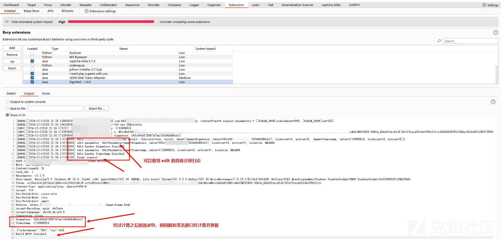

可以看到，`Edit header Signature finished`、`Edit header Timestamp finished`，并且输出了重新构建之后的 `Request` 包。

随便再改动一下参数，将 `orderAmount` 修改为 10， `Send` 验证一下效果

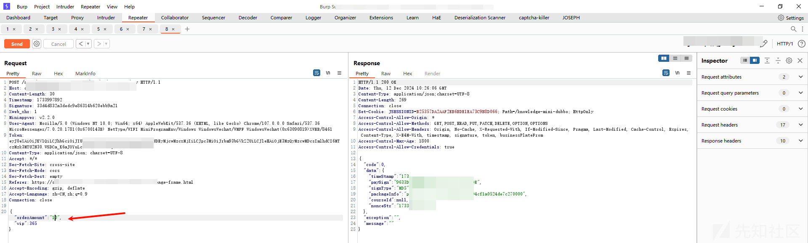

成功返回 `paySign`。

多尝试几次，完美，再也不用一次一次计算签名了。

如果需要爆破场景，记得勾选上 SignMe 规则中的 Intruder 模块即可，我这里由于是个真是的业务场景，为了不影响业务运行，就不做爆破演示了。
