# oppo a53 5g unlocktool 强解bl锁，magisk工具root [小白避坑篇]-先知社区

> **来源**: https://xz.aliyun.com/news/16233  
> **文章ID**: 16233

---

在学习app渗透时，需要一个已经root的手机，刚好有一台旧手机但是还没root但是在网上并没有搜到有太多的文章，没有找对方向自己捣鼓了很久，浪费太多时间，所以在这里记录一下，希望可以帮到刚入坑的师傅们避避坑。

  用到的手机是oppo a53 5g ，安卓版本12，系统版本是colors12.1  
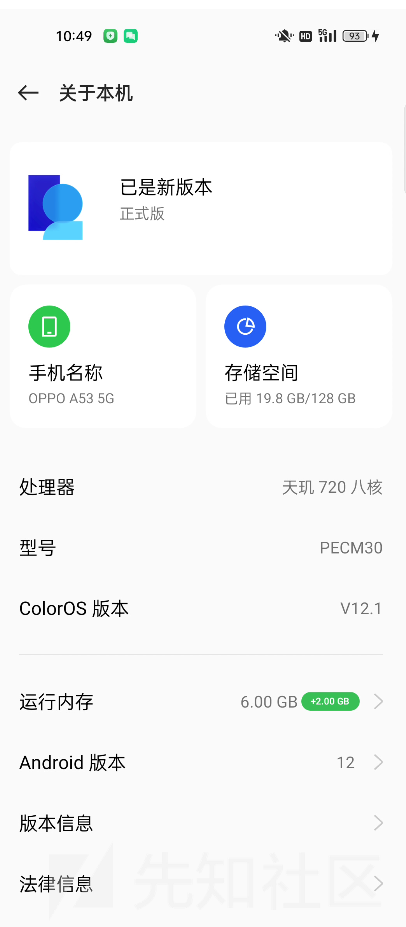

  网上搜的大多是关于mtk强解的，但是不知道什么原因，试了n多次，都无法进入fastboot模式，这里强烈建议直接去ctf一把梭平台租一个unlocktool的账号，就3块钱而已，6个小时的使用时间，用这个工具可以省去很多时间。

  有个up主分享了关于这个工具的使用，还挺详细的，在后面我也会说一下这个视频中没说明的问题以及我遇到的一些坑，可以参考一下：<https://www.bilibili.com/video/BV1X7421o7iB/?spm_id_from=333.337.search-card.all.click&vd_source=e5033a65bafebc3772fe08d8317527fc>

在使用unlocktool之前，需要先安装好驱动，以免后面手机无法连接到电脑  
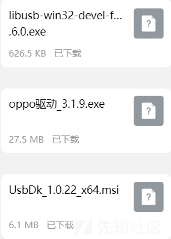

使用这个工具需要下最新版的，而且打开前需要魔法上网，如果一直登录不进去，换节点就好了。

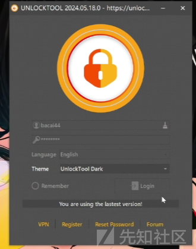

登录进去了可能会遇到白屏，我当时就遇到这个问题，还卡了我很久，问了很多师傅，都说是要关杀软。但是后面即使关掉杀软还是如此，后面就自己百度搜到了个新方法

```
打开注册表编辑器 -搜索 HKEY_LOCAL_MACHINE\SYSTEM\CurrentControlSet\Control\Class\{36fc9e60-c465-11cf-8056-444553540000} 删除 UpperFilters，然后重启电脑，就ok了。
```

登录成功后就进入下面这个界面，因为我的手机芯片是联发科的天玑，所以上面选择mediatek，然后勾选PRELOADER AUTH，选择oppo，基本就跟着我上面推荐的b站视频来就好

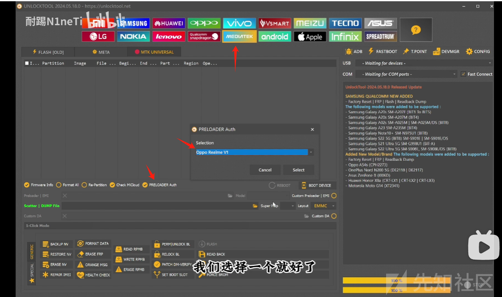

在进行解bl锁时有一个关键点，需要将手机关机，然后按住音量上+下+电源键，等到这边的端口有变化你就可以松手了

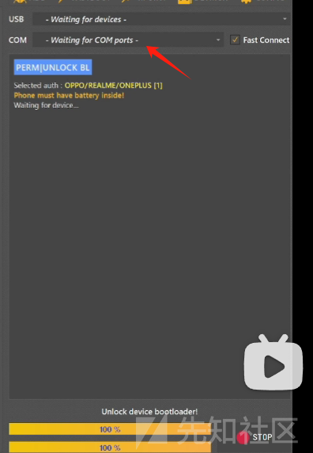

解释bl锁后会出现下面的界面

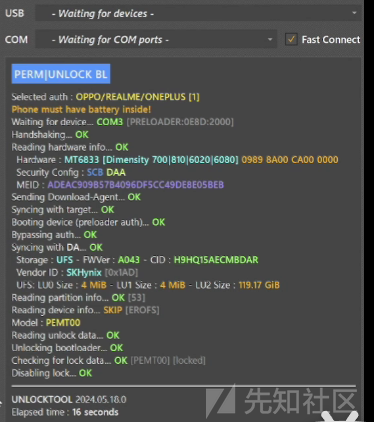

手机开机时会是这个界面

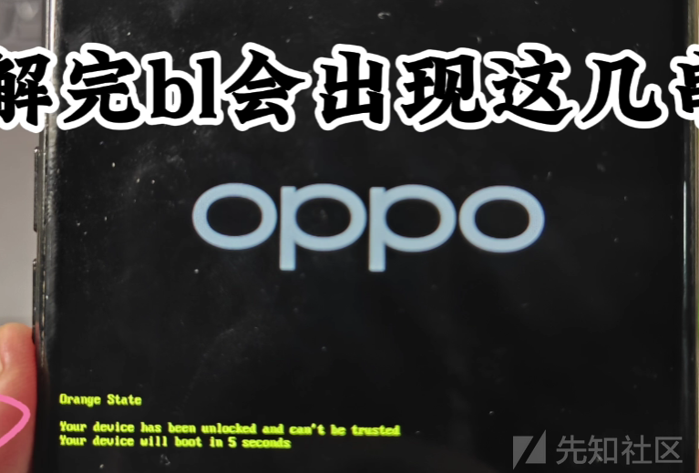

如果手机一直没有正常进入桌面就进行格式化

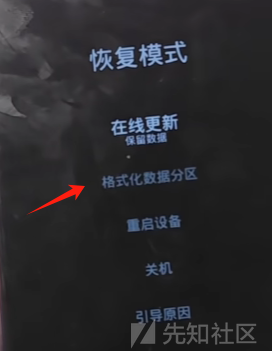

后面就跟着视频做，这里贴一个magisk的链接  
<https://github.com/topjohnwu/Magisk/releases>

最后的最后，就是证明你的手机有没有真正的root成功了  
方法一：  
打开magisk，Ramdisk为是，说明root成功

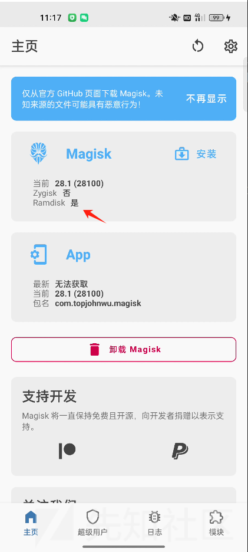

方法二:  
有的师傅说有的手机可能没有这个Ramdisk，可以下载一个MT管理工具，进入终端模拟器，执行su，然后再执行whoami，查看当前用户是否为root

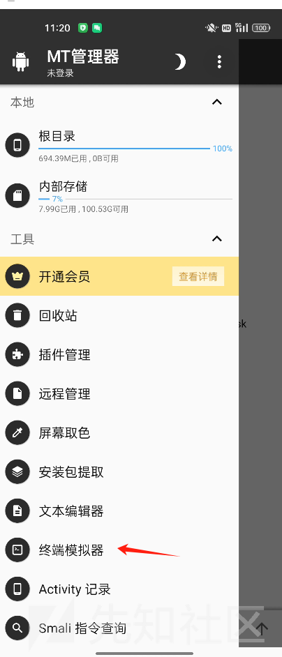

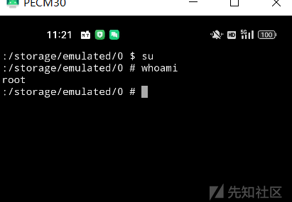

第一次写文章记录，第一次root手机，有错误欢迎评论指出。  
很多年前还在小学的时候，当时用手机玩破解版游戏都是用葫芦侠，在葫芦侠里一键就可以进行root，如今科技不断进步，变化太多了。
