# PE文件代码注入-先知社区

> **来源**: https://xz.aliyun.com/news/16252  
> **文章ID**: 16252

---

## 前言

本文的目标是通过 PE 文件注入实现点击扫雷程序弹出 PE injected 窗口，与参考文章的区别在于：本文使用的程序是 64 位并且开了地址随机化，所以注入的方式有所不同

文章示例程序下载地址：<https://github.com/chengsluo/Mine-Sweeper/blob/master/%E6%89%AB%E9%9B%B7.exe>

## 前置基础

在Windows 64位（Win64）系统中，函数参数传递的方法遵循类似于fastcall的调用约定：

1. **寄存器传参**：前四个整数或指针类型的参数通过RCX、RDX、R8和R9这四个寄存器传递。对于浮点数参数，前四个浮点参数会通过XMM0、XMM1、XMM2和XMM3寄存器传递。
2. **栈传参**：超过四个的参数通过栈传递，从右至左依次入栈。
3. **Shadow Space**：调用者需要在栈上为前四个参数预留32字节的空间，称为shadow space或spill slot，即使被调用函数的参数少于四个，这个空间仍然需要预留。
4. **返回值处理**：小于等于64位的整型或指针类型返回值通过RAX寄存器返回，浮点返回值通过XMM0寄存器返回。
5. **更大的返回值**：对于更大的返回值（如结构体），调用方在栈上分配空间，并通过RCX寄存器传递该空间的指针给被调用函数。此时，整型参数使用的寄存器会右移一位，实际只能利用RDX、R8、R9三个寄存器，其余参数通过栈传递。函数调用结束后，RAX返回该空间的指针（即函数调用开始时的RCX值）。
6. **寄存器保护**：非易失性寄存器（如RBX、RBP、RDI、RSI、R12-R15）在使用时必须进行保护。
7. **参数对齐**：寄存器中的所有整型参数都是右对齐的，因此被调用方可以忽略寄存器的高位，只访问所需的寄存器部分。
8. **栈管理**：调用者负责清理调用栈，被调用者不用清栈。

## 注入过程

\*改之前记得先备份一份

### 总体思路

弹出窗口用到了`MessageBoxA`函数，用法如下

```
int __stdcall MessageBoxA(HWND hWnd, LPCSTR lpText, LPCSTR lpCaption, UINT uType)

```

该函数的二参是弹窗内容，三参是弹窗标题，本文最终目标就是构造出：

```
MessageBoxA(0LL, "You are injected!", "PE injected", 0x1040u);

```

弹出标题为 PE injected 内容为 You are injected！，所以总体思路就是先写入标题和内容的字符串，再将参数传递给对应寄存器，最后调用 MessageBoxA 函数

### 写入字符串

向 rdata 段末尾写入 PE injected 和 You are injected!，这里直接用 ida 修改可能会无法保存，需要用 010 editor 写入字符串，具体方法如下：

先在 ida 中找到 rdata 末尾位置  
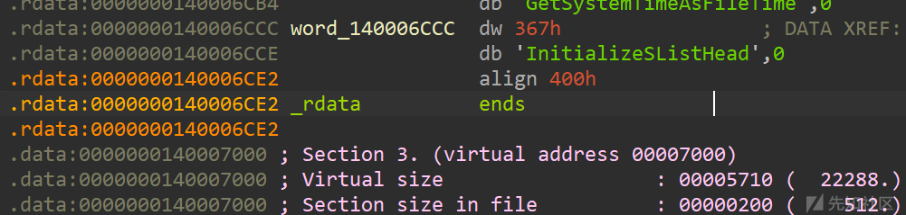

在 010 editor 中直接搜索字符串 InitializeSListHead

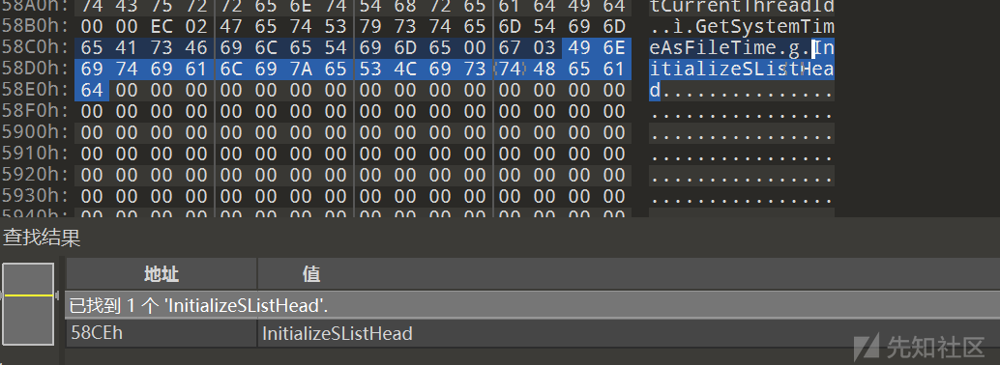

定位到 rdata 段末尾，在后面添加 PE injected 和 You are injected!

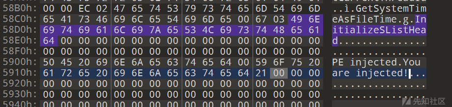

再用 ida 打开就能在 rdata 段末尾看到写入的字符串

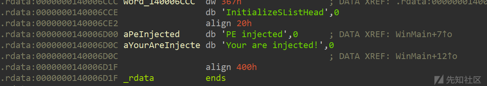

### 确定字符串偏移

由于程序开了地址随机化，所以不能直接根据地址获取字符串的位置，这里可以参考原程序中字符串是如何获取地址的，例如 19 行的 xmmword\_140005820 就是 rdata 段的一个变量  
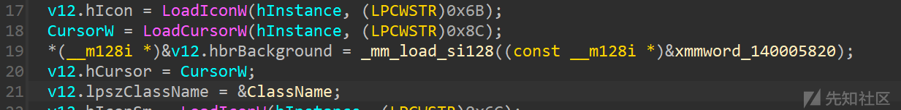

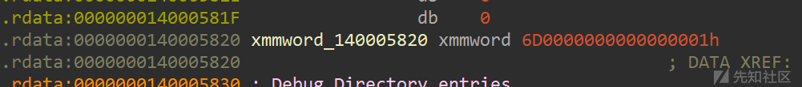

程序中获取地址的相关代码如下：

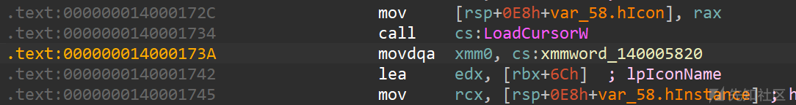

直接看`movdqa xmm0, cs:xmmword_140005820`对应的字节码是`66 0F 6F 05 DE 40 00 00`

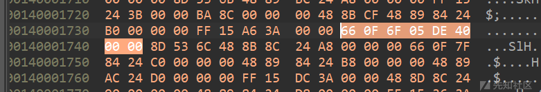

反编译结果如下，也就是使用 rip 加偏移获取的相对地址

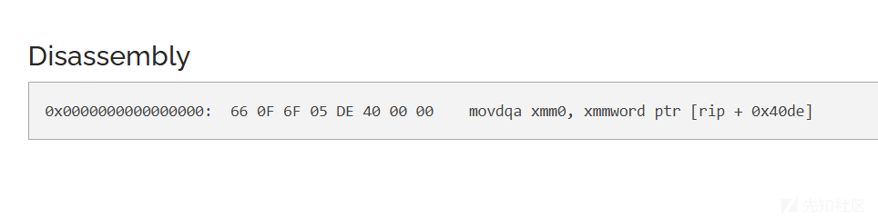

而这里的 xmmword\_140005820 在 ida 中的地址是 0x140005820，上面 010 editor 写入的字符串地址是 0x140006D00，但是由于指令位置不同，同一个变量对应于 rip 的偏移也不同，所以需要结合指令地址去计算字符串的地址，或者直接填一个 rdata 段的地址再根据得到的位置多减少补

### 添加 MessageBoxA 函数

程序中原本是没有 MessageBoxA 函数的，但是在 idata 段有 MessageBoxA 外部函数

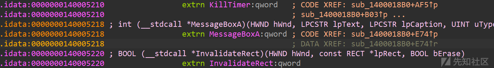

所以不能直接通过`call MessageBoxA`去调用这个函数，需要手动添加`MessageBoxA`函数，添加内容可以参考`exit`函数，函数的功能是跳转到 idata 段的对应函数

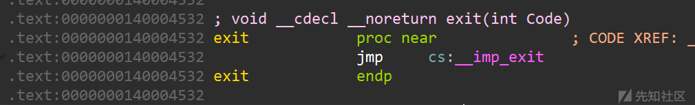

对应字节码如下

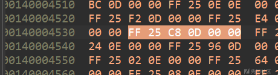

同样也是通过 rip 进行相对寻址

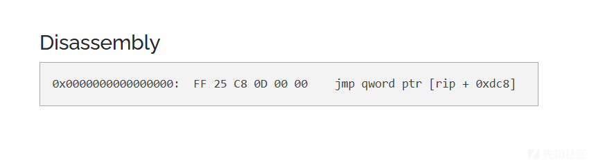

所以添加 MessageBoxA 函数的方式也类似，需要向 text 段末尾添加跳转函数，这里和添加字符串一样，直接用 ida 添加可能会保存失败，需要先用 010 editor写入一段跳转代码的字节码，添加完成后再用 ida 修改是可以正常保存的，所以偏移不确定可以先随机添加一个地址（参考其他函数中使用的地址确保添加的地址位于 idata 段的范围方便后续计算调试），再用 ida 根据添加的函数地址和 MessageBoxA 的相对位置用 Change Byte 去调整具体地址即可

最终构造如下函数：

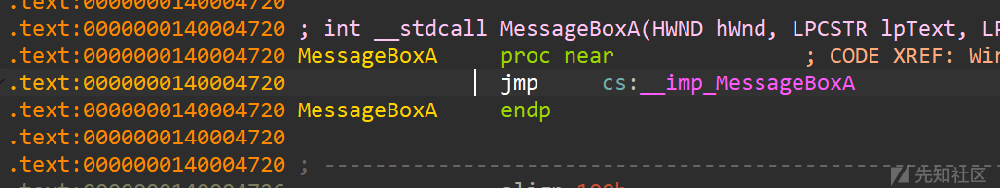

这样就可以直接`call MessageBoxA`调用该函数

### 注入代码

将代码写到开栈操作`sub rsp, 0E0h`的后面，否则会堆栈不平衡

* 将汇编翻译成字节码，这里字符串的相对地址是根据上述方式大致确定的地址，将字节码通过 Change Byte 修改(用 ida 的 assembly 修改会报 Invalid operand

  ```
  mov     r9, 1040h
  lea     r8, [rip + 0x5662]
  lea     rdx, [rip + 0x5663]
  mov     rcx, 0
  ```

  得到字节码：`49 c7 c1 40 10 00 00 4c 8d 05 62 56 00 00 48 8d 15 63 56 00 00 48 c7 c1 00 00 00 00`
* 根据得到的字符串位置和实际写入的字符串位置在 ida 中使用 Change Byte 对地址进行微调直到找到正确地址
* 在添加的汇编代码最后使用 ida 的 assemble 添加`call MessageBoxA`
* 按 tab 确认反编译结果是不是`MessageBoxA(0LL, "You are injected!", "PE injected", 0x1040u);`

### 最终效果

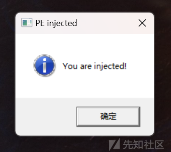

## 相关文章

<https://xz.aliyun.com/t/16622>

<https://wizardforcel.gitbooks.io/re-for-beginners/content/Part-VI/Chapter-64.html>
