# 记一次5000万资产的渗透测试-先知社区

> **来源**: https://xz.aliyun.com/news/16264  
> **文章ID**: 16264

---

# 1、资产收集

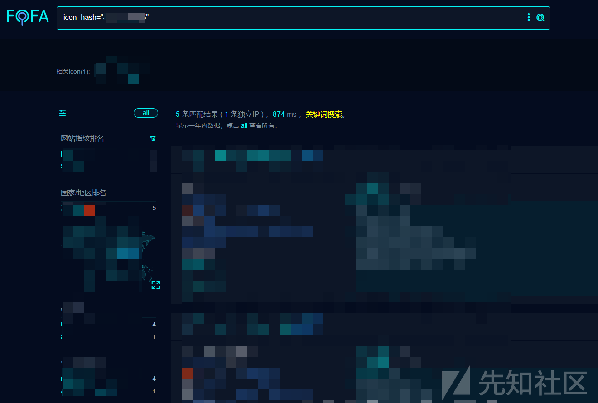

这里我是根据图标去搜集的，然后也可以根据域名等其他信息去收集

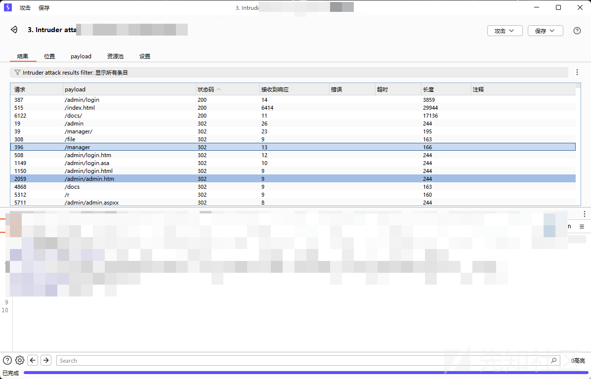

我拿了某个域名去进行扫描，然后有这几个路由是可以访问的，先看/admin

# 2、弱口令

访问/admin路由

账号：admin

密码：123

登陆成功

# 3、命令执行

想要修改文件但是都是报500

发现在发布新闻上面有个文件上传点

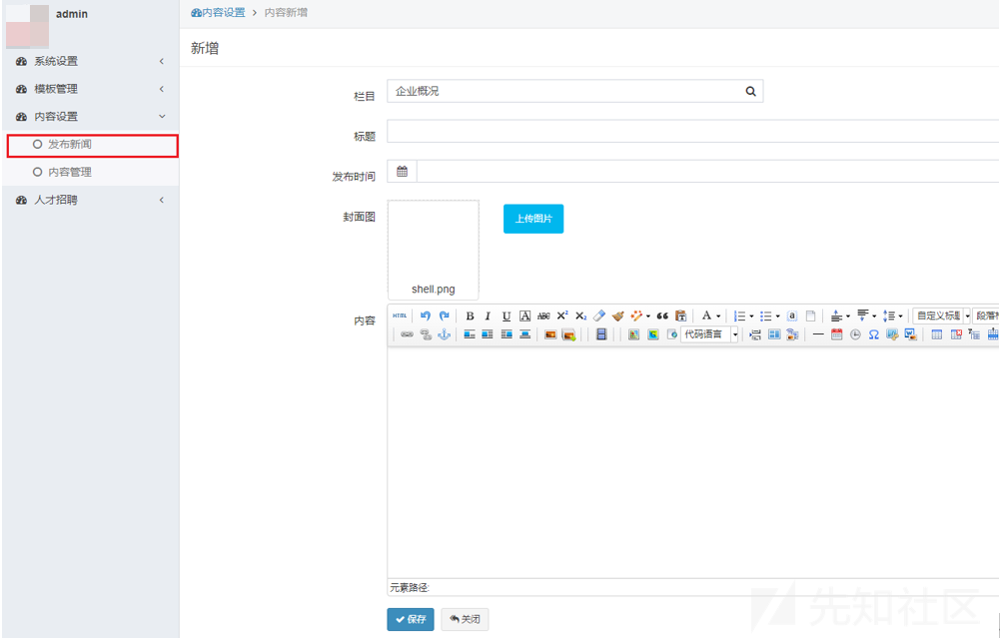

于是我先上传png进行测试，发现可以上传，然后又上传jsp，发现并没有过滤，可以直接传

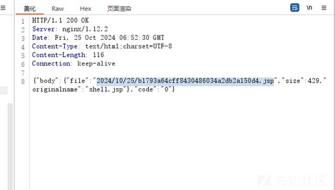

上传成功，但是具体的路径在哪找呢？

在首页某张图片前面解析一个img

拼接刚刚的路径

解析成功了，上传一句话木马命令执行成功

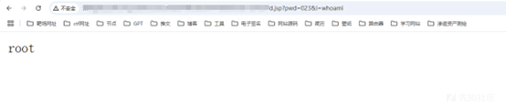

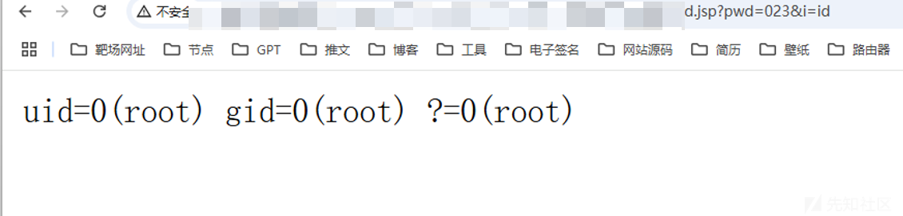

# 4、内网渗透

上传了一个fscan去扫描

发现扫描不出来什么，就是多了另外一个站，但是其实也是在我们开始资产收集的那个资产范围内

检索目录发现8080端口部署了一个web管理服务，就是上面能getshell的，还有另外一个web服务在8900，我们把两个源码都下载下来

查看jdbc配置文件，可以找到数据库密码

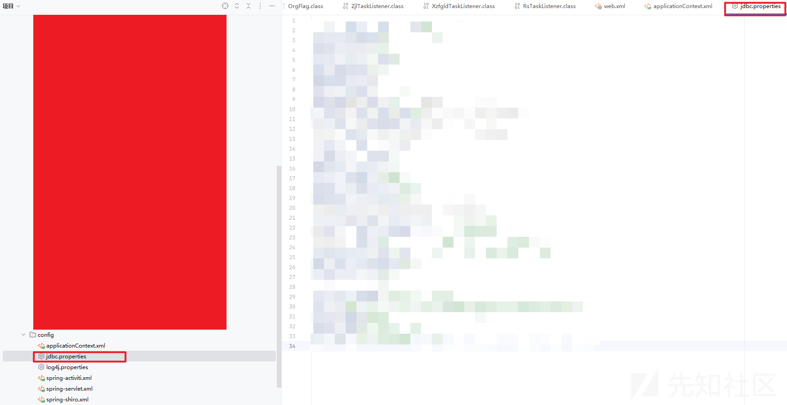

连接成功

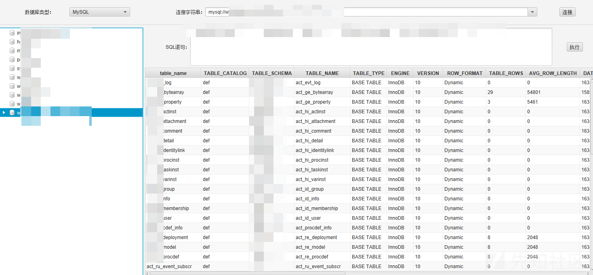

然后在对应的web服务的mysql中找到了对应的管理员密码和账号

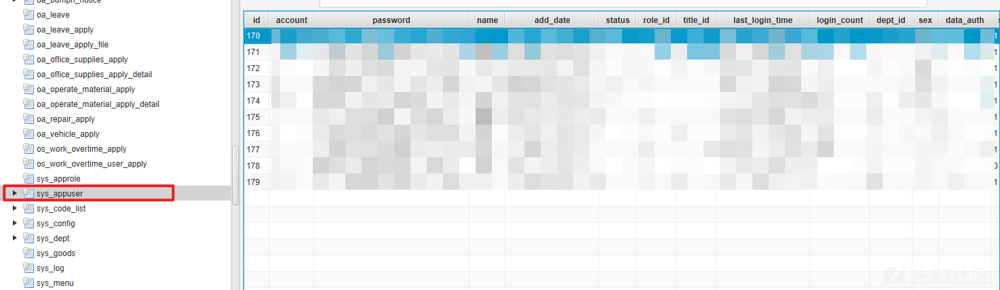  
md5解密一下发现是弱口令

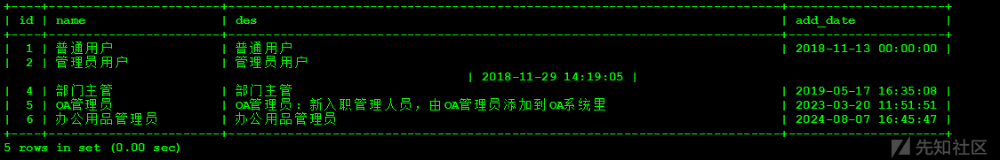

发现他的权限是这样的，找一个管理员的登陆

登陆成功

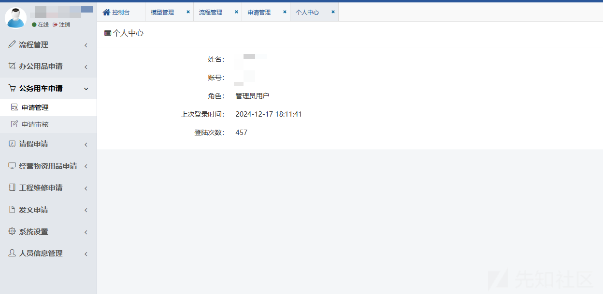

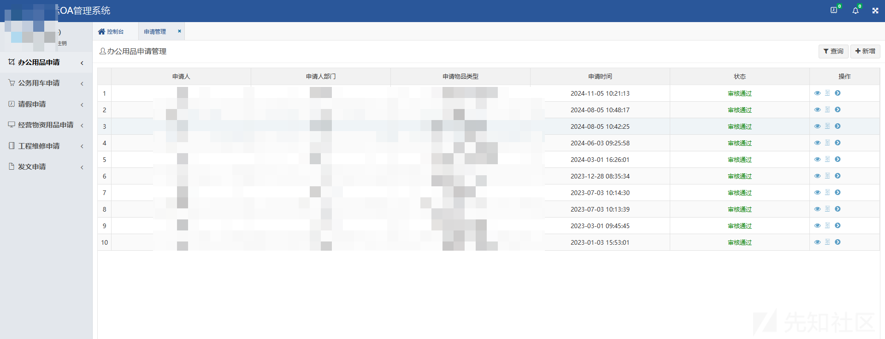

到这里我们就已经拿到两个web服务的后台了

然后又是一个文件上传直接getshell了

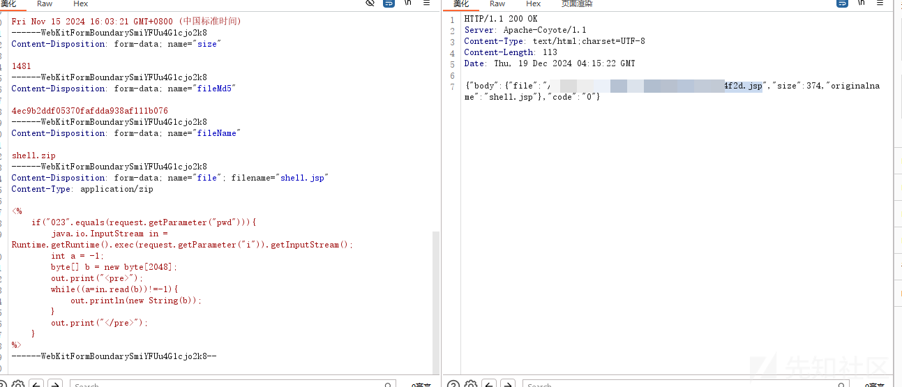  
命令执行

# 5、总结

getshell之后查了一下这家公司，刚好5000万资产，但是不是通用。

后面就是可以进行内网的渗透利用了，但是点到为止，事后也是将所有后门木马删掉，也是通过这次记录，能给新手一点渗透的灵感吧
