# 万字长文窥探信息收集真正的艺术-先知社区

> **来源**: https://xz.aliyun.com/news/16265  
> **文章ID**: 16265

---

## 前言

信息搜集真的就只是找找子域名，扫扫目录和端口这么简单吗？万字长文带你窥探信息收集真正的艺术！

## 收集流程概述

```
[0]自动化信息收集阶段
    1.--工具自动化信息收集
[1]资产发现阶段
    1.--组织信息收集
    2.--主域名收集
    3.--子域名收集
[2]资产扩展阶段
    1.--端口收集
    2.--C段收集
[3]资产梳理阶段
    1.--测活+指纹识别
[4]自动化扫描阶段
    1.--漏洞扫描器测试
[5]重点目标针对收集阶段
    1.--架构信息收集
    2.--源码信息收集
    3.--网站基本信息
        (1)----语言
        (2)----数据库
        (3)----web容器
        (4)----操作系统
    4.--网站深度信息收集
        (1)----前端源码
        (2)----目录
        (3)----端口
        (4)----js接口
        (5)----快照
        (6)----插件
        (7)----旁站
    5.--网盘信息
    6.--社工信息
    7.--小程序信息
    8.--APP信息

```

> [0]自动化信息收集阶段：使用工具自动进行信息收集，与手工结合同时进行最佳

## 自动化信息收集

在手工信息收集之前，建议可以使用一下知名的自动化信息收集工具，帮助我们快速的进行大致的信息收集，也能与手工信息收集结果相互补充

没什么好说的，推荐几款工具，选择一两个觉得趁手的会用就行  
我比较喜欢用ARL，尤其是它的文件泄露功能往往能帮我快速撕开口子，由于灯塔之前跑路了，所以要用第三方备用库

* [ARL](https://github.com/Aabyss-Team/ARL)

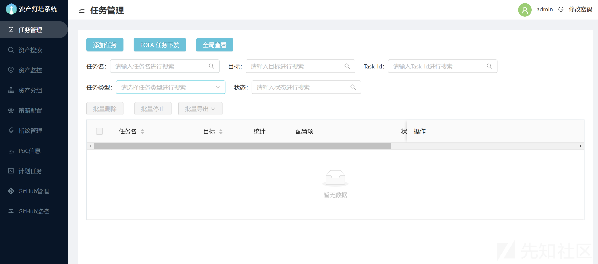

* [shuize](https://github.com/0x727/ShuiZe_0x727)
* [kunyu](https://github.com/knownsec/Kunyu)
* [nemo\_go](https://github.com/hanc00l/nemo_go)
* [ScopeSentry](https://www.scope-sentry.top/guide/y0qsb5ks/#%E5%8D%95%E6%9C%BA%E9%83%A8%E7%BD%B2)

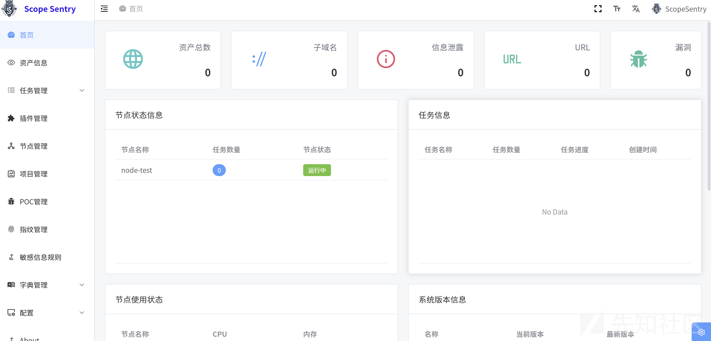

> [1]资产发现阶段：收集出目标主体大部分的资产

## 组织结构收集

### 简介

组织结构收集就是摸清目标有哪些子公司，分别处于整体什么位置，股权分别占多少比重，与主公司的结构关系等等。由于小型目标结构组织简单，是单独存在的，没有收集阻止结构的必要。所以，这个组织结构的收集是针对于比较庞大的目标的，比如大型集团、企业，大型政党单位，大型高校。

### 作用

那么为什么要收集目标的组织结构呢？以hw为例，假设目标是一个大型集团，收集目标的组织结构有以下作用：

* **更全面的收集到目标的所有子公司，从而得到更全的主域名，这意味着有更广的攻击面**
* **摸清了组织结构，可以采用自下而上的打法：A公司防守很严，暴露面少很难突破，那么如果收集了组织结构就可以去找A公司的子公司作为突破口，因为子公司一般没有其主公司安全性高，而且子公司与主公司有些资产（比如办公环境，内部业务环境等等）很有可能处于同一个内网，于是只要拿下了子公司的权限，就有可能通过内网横向移动拿下主公司的权限，从而轻松拿下整个目标**
* **摸清了组织结构，还可以采用自上而下的打法：如果已经拿下了A公司的权限，也收集了组织结构信息，那么还可以进一步攻击A公司的子公司。因为A公司中很有可能就保存了子公司的一些重要敏感数据，密码凭据等等，而且内网也很可能是连通的，也可以尝试内网横向移动，从而扩大渗透成果，爽拿数据分和权限分**

### 收集方法

#### 股权收集法

以华为为例，使用**爱企查**看股权穿透图，收集子公司信息，(更具体的信息需要开会员)

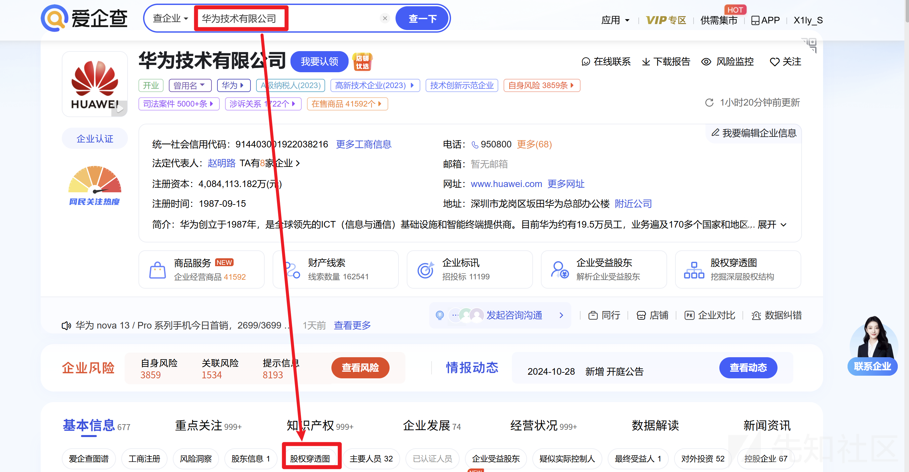

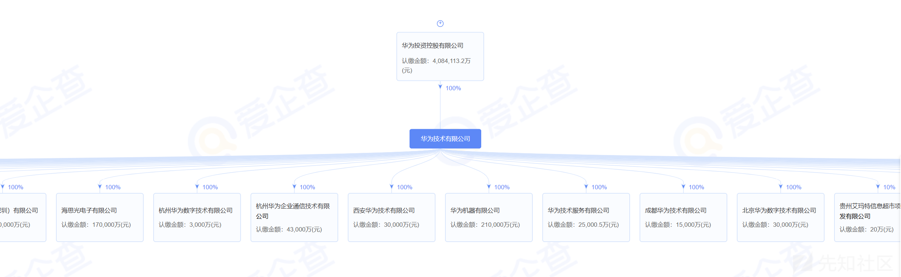

股权占比小于50%的就不用看了，因为关联性已经不太强了

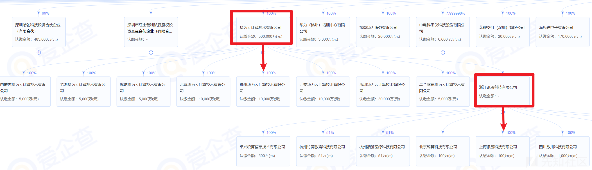

这样我们就能摸清目标在整个主体中处于什么位置，以及与其他公司的关系，获得了更多的子公司名。接下来，只需手动筛选出所有的股权占比大于50%的子公司名字，全部记录下来存为**company.txt**，还有搞清楚目标在整个主体中处于什么位置，组织结构的收集就基本完成了

#### 关键人物收集法

还可以从关键人物出发，去寻找更多子公司信息

比如从华为的法人入手，查看他代表的公司：

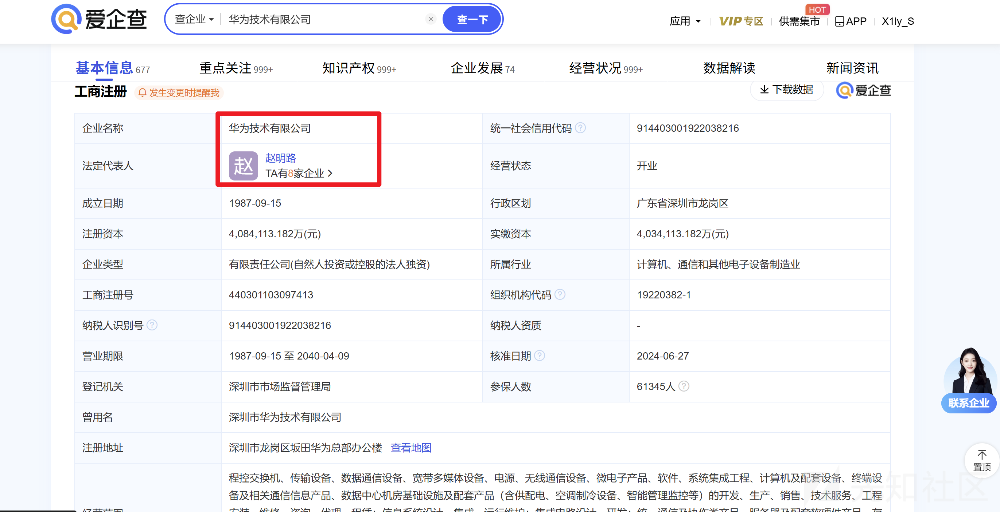

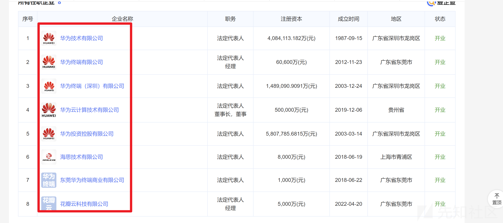

以及从华为的高管入手：

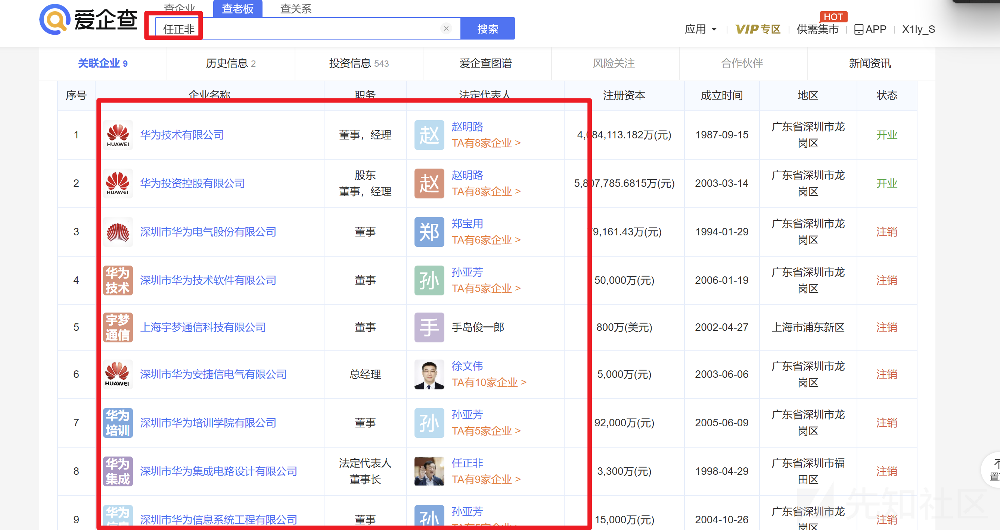

得到的结果能与上面提到的股权收集法互相补充

到此我们就得到了目标集团的所有股权占比较大的子公司名，保存为**company.txt**，后面有用

```
# company.txt 
# 为了便于演示，我就只列举几个

华为技术有限公司
华为投资控股有限公司
深圳市华为电气股份有限公司
深圳市华为技术软件有限公司
......

```

### 工具

* 爱企查：<https://aiqicha.baidu.com/>

## 主域名收集

收集主域名就是利用前面组织结构收集到的子公司名**company.txt** ，进一步分别收集他们公司的主域名，这是环环相扣的，只有组织结构收集收集得越全，收集到的主域名才会越多，攻击面才越广，才越有可能拿下目标

### ICP备案

#### 官网查询接口

在中国想正规搭建网站都是需要ICP备案的，于是我们可以利用官方ICP备案查询公司名，得到其主域名

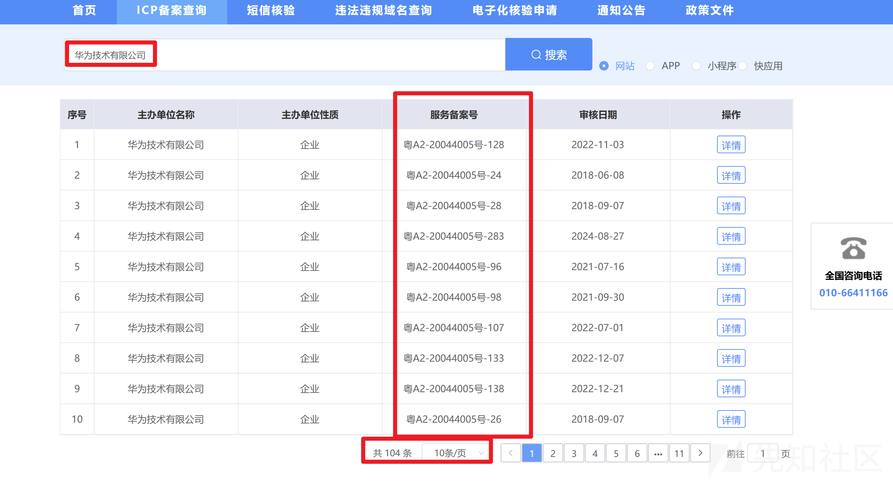

非常的多，点击详情就能看到该公司的主域名

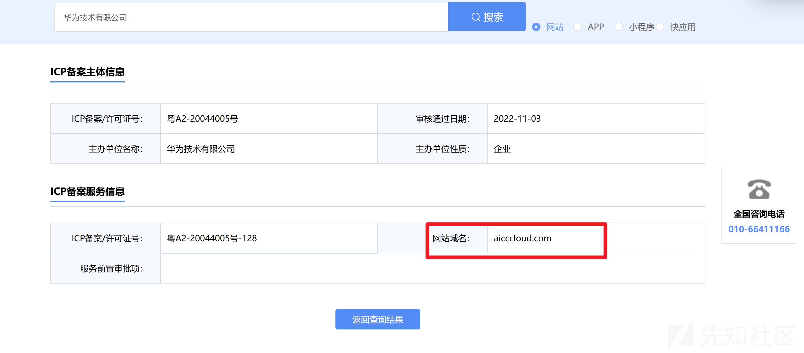

该方法适合于子公司比较少的情况，因为该官网查询接口，有图形汉字验证码，不太好批量提取出子公司的主域名，只能手动复制下来，适合于小型目标

#### 第三方程序查询接口

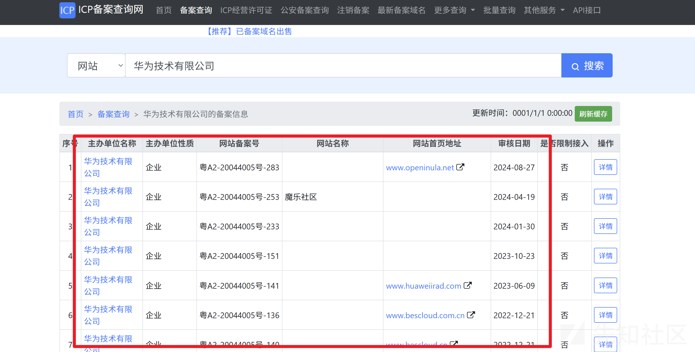

这个第三方程序查询接口好处是无验证码，可以批量提取出所有子公司的主域名，适用于大型目标，但是缺点是没有官网查询接口更新的快

使用icpsearch工具就能批量爬下来了

```
icpsearch -f compoany.txt

```

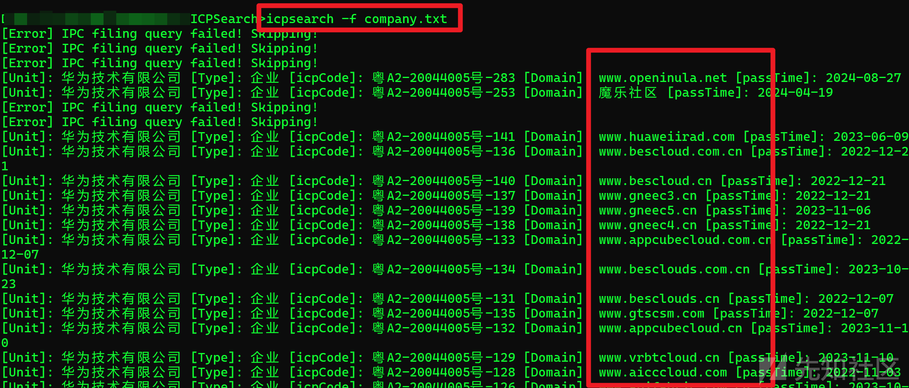

得到的结果再使用Sublime Text正则匹配一下域名就行了，Ctrl+F 输入正则表达式，勾选Find All选中全部，再右键复制全部

```
([a-zA-Z0-9-]+\.)+[a-zA-Z]{2,}

```

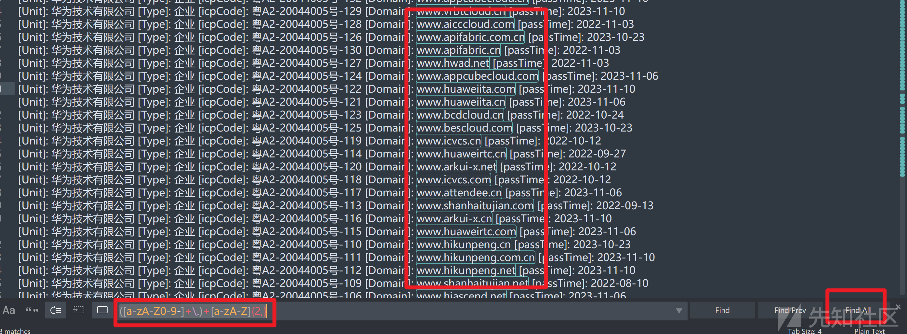

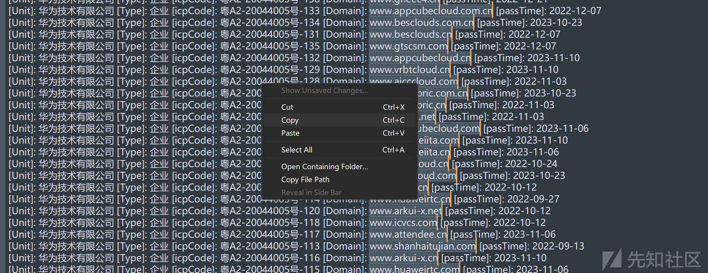

这样就提取出了域名

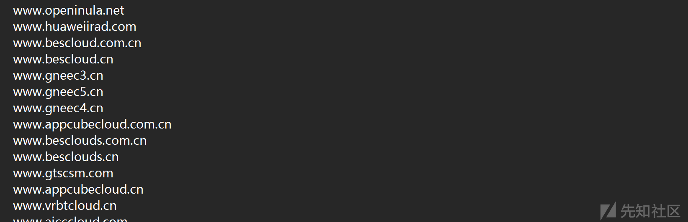

### 小蓝本

使用小蓝本也可以快速收集主域名，只不过也不能一次性的查所有子公司的主域名，不过可以写脚本爬取

来到知识产权，一键获取ICP备案

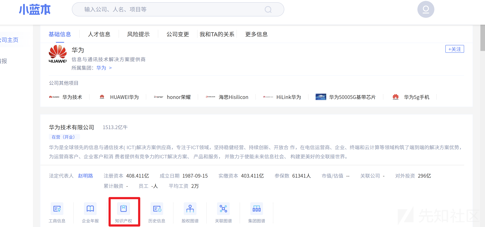

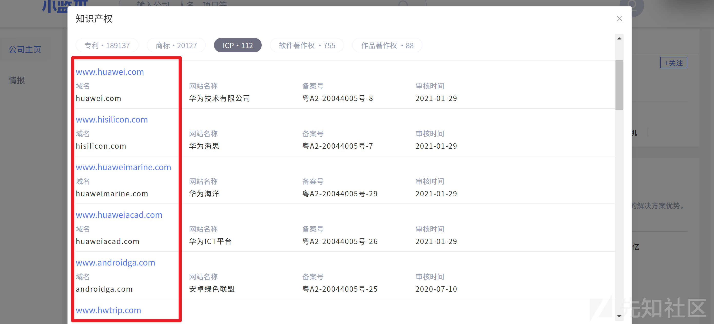

手动复制一下，保存本地，再使用Sublime Text正则提取出主域名

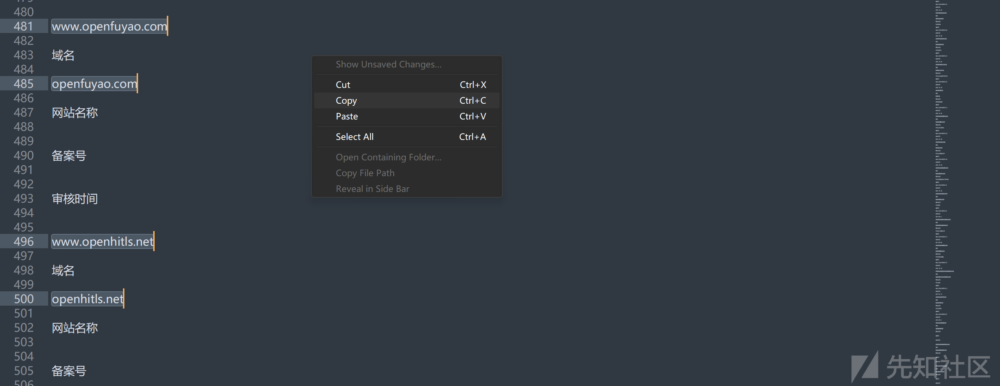

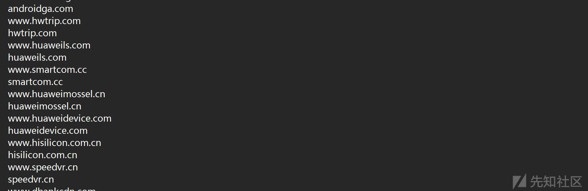

到此我们就通过**company.txt**收集到了很多的子公司的主域名，保存为**domain.txt**，后面有用

```
# domain.txt
androidga.com
www.hwtrip.com
hwtrip.com
www.huaweils.com
huaweils.com
www.smartcom.cc
smartcom
......

```

### 工具

* ICP备案官网：<https://beian.miit.gov.cn/>
* ICP第三方查询：<https://www.beianx.cn/>
* ICP批量爬取工具：<https://github.com/A10ha/ICPSearch>
* Sublmie Text：<https://www.sublimetext.com/>
* 小蓝本：<https://sou.xiaolanben.com/>

## 子域名收集

### 网络测绘引擎

* fofa

```
domain ="主域名" || cert="公用名" || cert="组织名1" ||  || cert="组织名2" || cert="组织名3" ......

```

我习惯使用fofa查询，其他网络测绘搜索引擎也可以

domain是通过域名查，能查到web资产与非web资产，cert是通过证书查，只能查web资产，二者使用" || "结合拼接，会得到更多的子域名资产

#### 综合语法

比如还是以华为为例：huaweiyun.com

```
domain="huaweiyun.com"

```

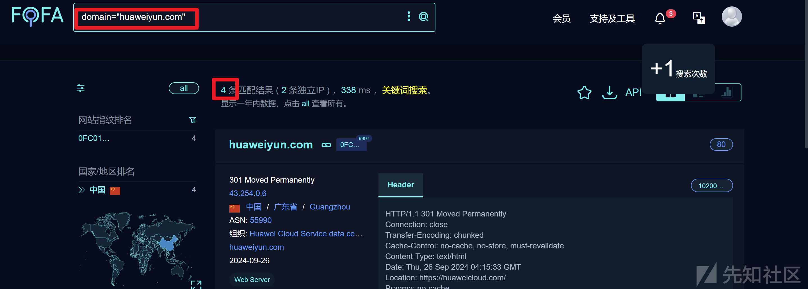

仅仅使用**domain ="主域名"** 能查到4条子域名，如果加上cert证书查询语法呢？

```
domain="huaweiyun.com" || cert="huaweiyun.com"

```

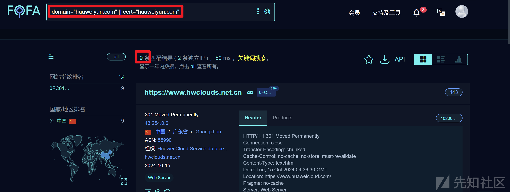

资产直接多了一倍！那么可想而知，如果使用网络测绘引擎收集资产不使用cert查询语法的话，会错过很多的隐蔽资产

那么到这里就结束了吗？并没有

刚才我们只是使用了**domain ="主域名" || cert="公用名"**还没有考虑到其他公用名，和更多的组织名！

**注意！公用名大多数时候就是网站的主域名或子域名，而同一个主域名的资产可能有多个组织名，于是我们都要尽可能多的找出来**

怎么找公用名和组织名呢？我的方法是手动翻找https站点的证书

比如，点击查看几个https站点的证书详情

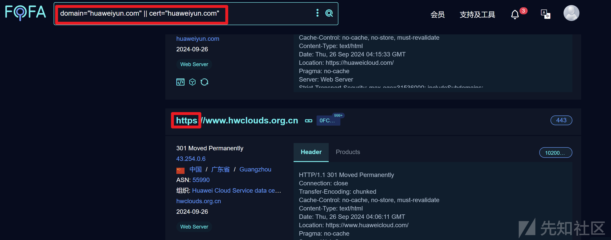

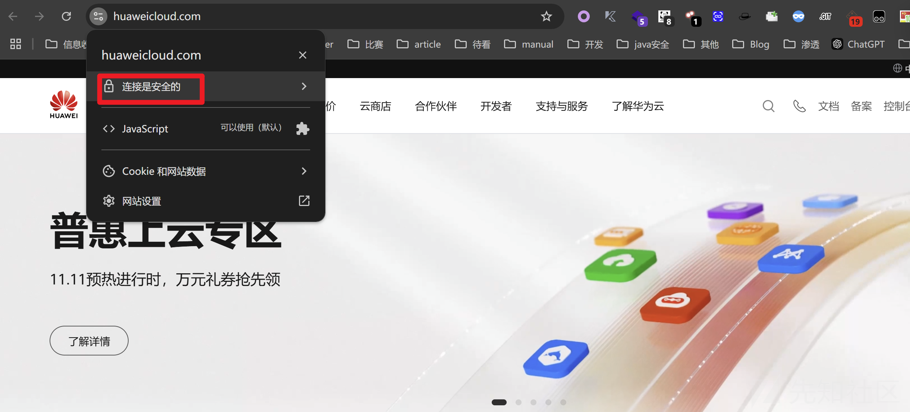

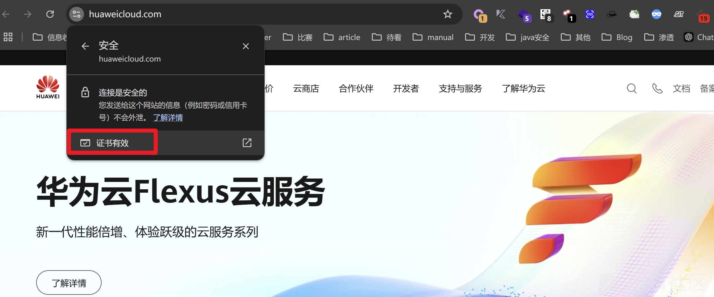

这里就找到了新的公用名和组织名！

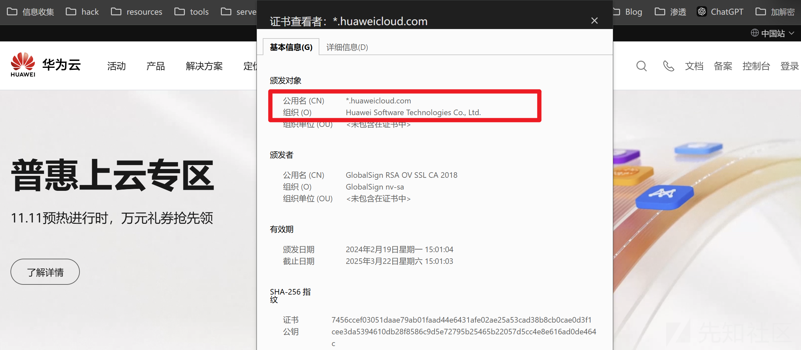

```
huaweicloud.com
Huawei Software Technologies Co., Ltd.

```

继续拼接到fofa的cert语法中去，看看会发生什么？

```
domain="huaweiyun.com" || cert="huaweicloud.com" || cert="Huawei Software Technologies Co., Ltd."

```

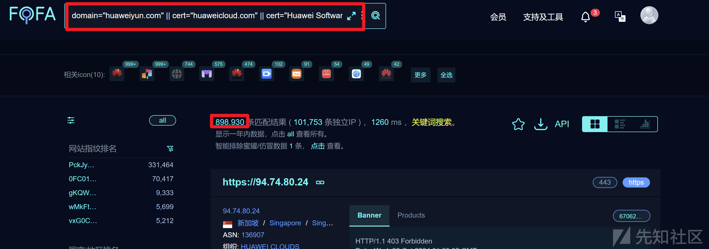

好家伙直接干到了89830条！不得不说是真的很全，但是这么多资产也不方便测试，这里只是说可以用这种cert查询方式收集到更多的资产，扩大攻击面，实际肯定要根据情况而定，要学会灵活变通。像华为这种超级大型企业，资产本身就不少，所以不太适合使用证书查询，因为太多了，更多的适用于资产在几千条以内的中小型企业、政党单位、高校等等

#### 批量

相信师傅注意到了，我们上面不是收集了大量的**domain.txt**吗，但是刚刚演示时只选取了其中一条来查询子域名，如何批量查询**domain.txt**的全部子域名呢？我是这么做的：

写了一个脚本，读取**domain.txt**，直接批量拼接成**domain ="主域名1" || cert="公用名1" || domain ="主域名2" || cert="公用名2" || domain ="主域名3" || cert="公用名3" ||……**这种格式，再丢到fofa去查询

为什么这样拼接呢，就是因为公用名大多数时候就是其主域名或子域名，使用"||"连接就能查到更多的资产了

##### 脚本-join.py

```
python join.py

```

```
# 读取 domain.txt 文件并拼接数据
def read_and_concatenate(file_path):
    try:
        with open(file_path, 'r') as file:
            # 读取文件中的每一行，去掉空格和换行符
            lines = [line.strip() for line in file if line.strip()]

        # 使用 ' || ' 连接每行数据
        result = ' || '.join([f'domain="{line}" || cert="{line}"' for line in lines])

        print(result)
    except FileNotFoundError:
        print(f"文件 {file_path} 未找到。")
    except Exception as e:
        print(f"发生错误: {e}")

# 调用函数并传入文件路径
read_and_concatenate('domain.txt')

```

* 域名太多只演示部分

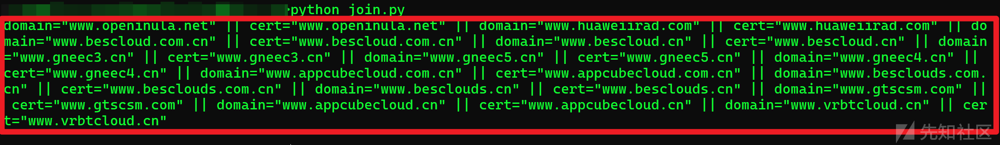

```
domain="www.openinula.net" || cert="www.openinula.net" || domain="www.huaweiirad.com" || cert="www.huaweiirad.com" || domain="www.bescloud.com.cn" || cert="www.bescloud.com.cn" || domain="www.bescloud.cn" || cert="www.bescloud.cn" || domain="www.gneec3.cn" || cert="www.gneec3.cn" || domain="www.gneec5.cn" || cert="www.gneec5.cn" ||domain="www.gneec4.cn" || cert="www.gneec4.cn" ||domain="www.appcubecloud.com.cn"||cert="www.appcubecloud.com.cn" || domain="www.besclouds.com.cn" || cert="www.besclouds.com.cn"||domain="www.besclouds.cn"||cert="www.besclouds.cn" || domain="www.gtscsm.com" || cert="www.gtscsm.com" || domain="www.appcubecloud.cn" || cert="www.appcubecloud.cn"|| domain="www.vrbtcloud.cn" || cert="www.vrbtcloud.cn"

```

但是师傅也发现了这样还缺少通过组织名查询，于是我们还要手动地去翻找https站点的证书，**或者再结合接下来"英文证书查询"方法**，手动复制出公用名+组织名，也拼接到cert语法中。因为大量资产的公用名+组织名都是一致的，所以手动就行了

```
domain="www.openinula.net" || cert="www.openinula.net" || domain="www.huaweiirad.com" || cert="www.huaweiirad.com" || domain="www.bescloud.com.cn" || cert="www.bescloud.com.cn" || domain="www.bescloud.cn" || cert="www.bescloud.cn" || domain="www.gneec3.cn" || cert="www.gneec3.cn" || domain="www.gneec5.cn" || cert="www.gneec5.cn" ||domain="www.gneec4.cn" || cert="www.gneec4.cn" ||domain="www.appcubecloud.com.cn"||cert="www.appcubecloud.com.cn" || domain="www.besclouds.com.cn" || cert="www.besclouds.com.cn"||domain="www.besclouds.cn"||cert="www.besclouds.cn" || domain="www.gtscsm.com" || cert="www.gtscsm.com" || domain="www.appcubecloud.cn" || cert="www.appcubecloud.cn"|| domain="www.vrbtcloud.cn" || cert="www.vrbtcloud.cn" || cert="huaweicloud.com" || cert="Huawei Software Technologies Co., Ltd."

```

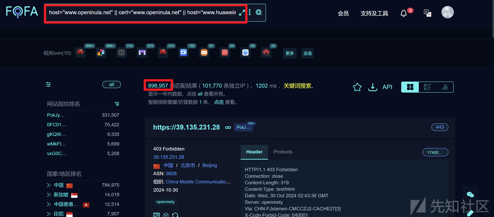

#### 注意

##### all模式开启

使用网络测绘引擎，还需要注意的是，不要忘记开启all模式，因为查询结果默认情况下只有一年内的结果，开启all模式就能查到更多的资产，更有概率发现隐蔽资产！

但是需要开会员，呜呜贵贵~


#### 格式处理

导出fofa结果时有一个问题就是资产格式有点混乱、不够统一，比如这样

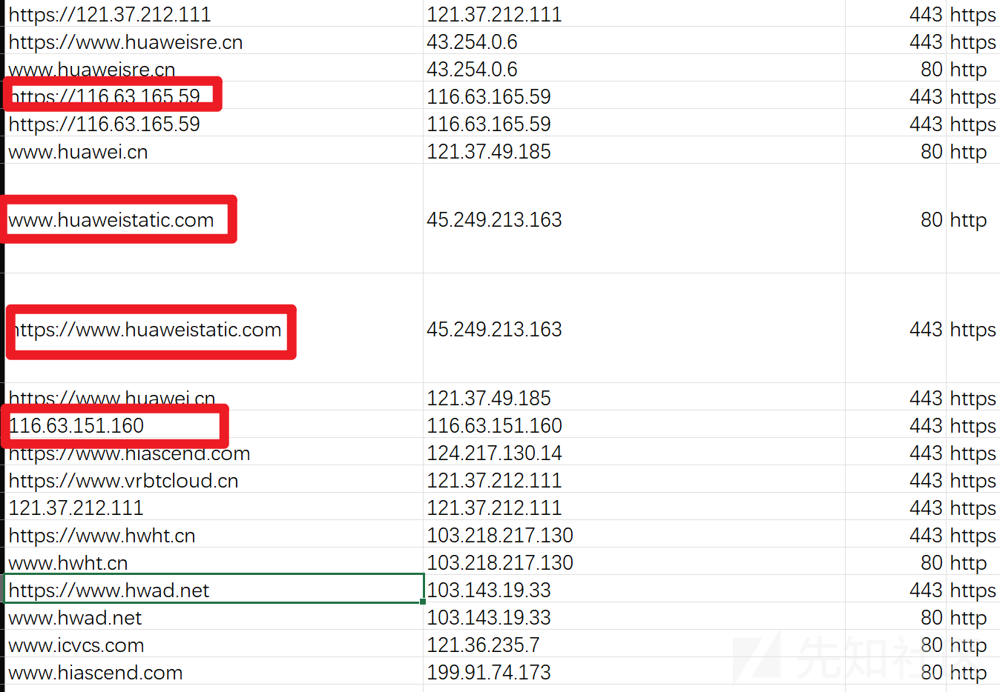

URL列中同时有https+域名的，又有https+ip的，还有不带http协议头的纯域名与纯ip的格式，这样不便于后面分别的信息收集，因为纯域名会用来做c段整理，纯ip用来端口扫描，带协议头的URL用来测活或者爬取js，漏扫等等……于是需要处理格式，把他们分离出来

还是使用脚本处理

##### 脚本-format.py

输入input.txt-格式混乱的url列 ，输出**subdomain-1.txt**-子域名，**url-1.txt**-url。ip就不用分离了，fofa本身能导出格式整齐的ip列

```
python format.py

```

```
import re
import chardet

# 自动检测文件编码
def detect_encoding(filename):
    with open(filename, 'rb') as file:
        result = chardet.detect(file.read())
    return result['encoding']

# 读取文件并处理内容
def process_file(input_file, subdomain_file, url_file):
    encoding = detect_encoding(input_file)

    # 打开input.txt文件并读取每一行
    with open(input_file, 'r', encoding=encoding) as file:
        lines = file.readlines()

    # 准备两个列表来存储不同的输出内容
    subdomains = []
    urls = []

    # 定义一个正则表达式来匹配特定的IP地址URL
    specific_ip_url_pattern = re.compile(r'http[s]?://127\.0\.0\.1(:\d+)?/?')

    # 处理每一行数据
    for line in lines:
        # 去除两端的空格和换行符
        line = line.strip()

        # 检查URL是否是特定的IP地址URL
        if specific_ip_url_pattern.match(line):
            # 如果是，则直接写入url.txt
            urls.append(line)
        else:
            # 检查URL是否基于IP地址，如果是则跳过
            if re.match(r'http[s]?://\d{1,3}(\.\d{1,3}){3}(:\d+)?/?', line):
                continue  # 如果当前行是基于IP的URL，跳过不处理

            # 检查并处理每种情况
            if line.startswith('http://'):
                subdomains.append(line[7:])  # 从'http://'后面开始截取
                urls.append(line)  # 保持原样
            elif line.startswith('https://'):
                subdomains.append(line[8:])  # 从'https://'后面开始截取
                urls.append(line)  # 保持原样
            else:
                subdomains.append(line)  # 没有协议头，直接使用
                urls.append('http://' + line)  # 添加'http://'
                urls.append('https://' + line) # 添加"https://" 

    # 将处理后的数据写入相应的文件
    with open(subdomain_file, 'w', encoding=encoding) as file:
        for subdomain in subdomains:
            file.write(subdomain + '\n')

    with open(url_file, 'w', encoding=encoding) as file:
        for url in urls:
            file.write(url + '\n')

# 调用处理函数
process_file('input.txt', 'subdomain.txt', 'url.txt')

```

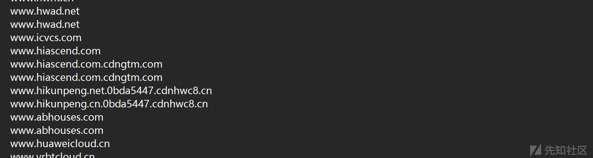

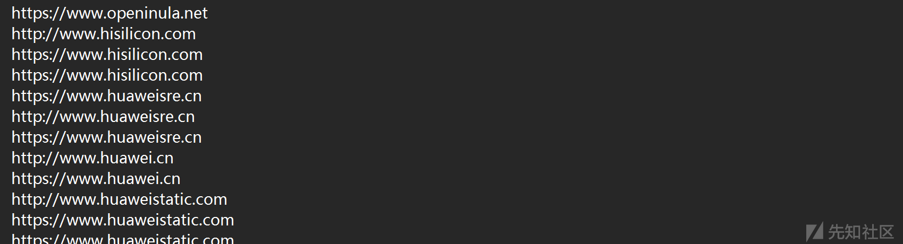

**还有一点需要注意，就是有些站点只能使用https访问，有些又只能使用http访问，有些都可以，而且使用http访问原本是https的站点还有可能绕过waf，于是整理格式生成url.txt时，最好把每个域名都添加上http+https，这样资产更全，但是也可根据实际情况而定，只要http或者只要https的，只需在脚本中注释即可**

```
# 检查并处理每种情况
            if line.startswith('http://'):
                subdomains.append(line[7:])  # 从'http://'后面开始截取
                urls.append(line)  # 保持原样
            elif line.startswith('https://'):
                subdomains.append(line[8:])  # 从'https://'后面开始截取
                urls.append(line)  # 保持原样
            else:
                subdomains.append(line)  # 没有协议头，直接使用
                urls.append('http://' + line)  # 添加'http://'
                #urls.append('https://' + line) # 添加"https://"

```

**不过还好fofa中导出的ip格式是规范的，就不需要处理了，直接复制下来，保存为 ip-1.txt**

到此我们就通过**domain.txt**得到了 **subdomain-1.txt** **url-1.txt ip-1.txt**了保存备用，后面会合并去重

### 英文证书查询

除了fofa中的证书查询，还可以使用crt.sh查询网站查询证书为英文名的资产，这样也能找到很多隐蔽资产！二者可以相互补充，并且这种方式可以得到大量公用名、组织名，也可以手动拼接上述语法中去！

#### 查询方式

##### q模式

```
?q=huawei.com
```

比较精准的模式


##### o模式

```
?o=huawei
```

模糊查询模式

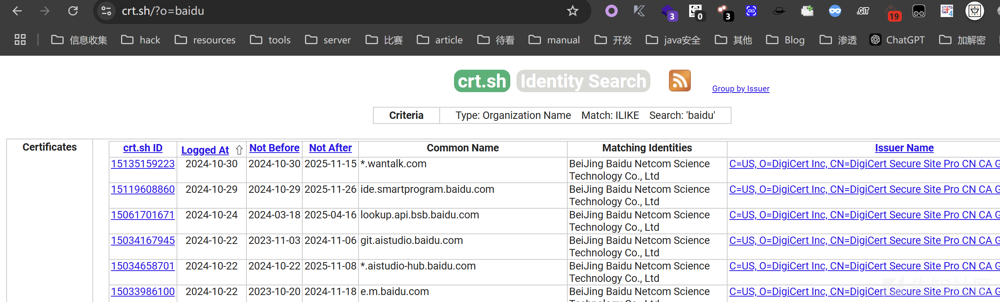

o模式有些情况下查不出来

#### 批量

还是写脚本，批量正则提取一下common name公用名，因为公用名大多数时候就是域名或子域名，于是这种方式也能直接得到许多隐蔽资产，许多挖SRC的大佬就是直接使用crt.sh开怼的！

##### 脚本-crt.sh.py

```
python crt.sh.py

```

```
import re
import requests

def extract_unique_common_names(url):
    try:
        # 自定义 User-Agent 头
        headers = {
            "User-Agent": "Mozilla/5.0 (Windows NT 10.0; Win64; x64) AppleWebKit/537.36 (KHTML, like Gecko) Chrome/114.0.0.0 Safari/537.36"
        }

        # 获取页面内容
        response = requests.get(url, headers=headers)
        response.raise_for_status()  # 检查是否请求成功
        html_content = response.text

        # 提取 <TD> 标签中以 .cn, .com, .org, .net 结尾的内容
        common_names = re.findall(r'<TD.*?>([^<]*\.(?:cn|com|org|net))</TD>', html_content, re.S)

        # 去重处理
        unique_common_names = set(common_names)

        # 输出提取的公用名
        if unique_common_names:
            print("Extracted Unique Common Names:")
            for name in unique_common_names:
                print(name.strip())  # 去掉前后的空格
        else:
            print("No Common Names found.")
    except requests.RequestException as e:
        print(f"Error fetching URL: {e}")

# 调用函数并传入 URL
url = "https://crt.sh/?q=baidu.com"  # 替换为实际的查询目标和模式
extract_unique_common_names(url)

```

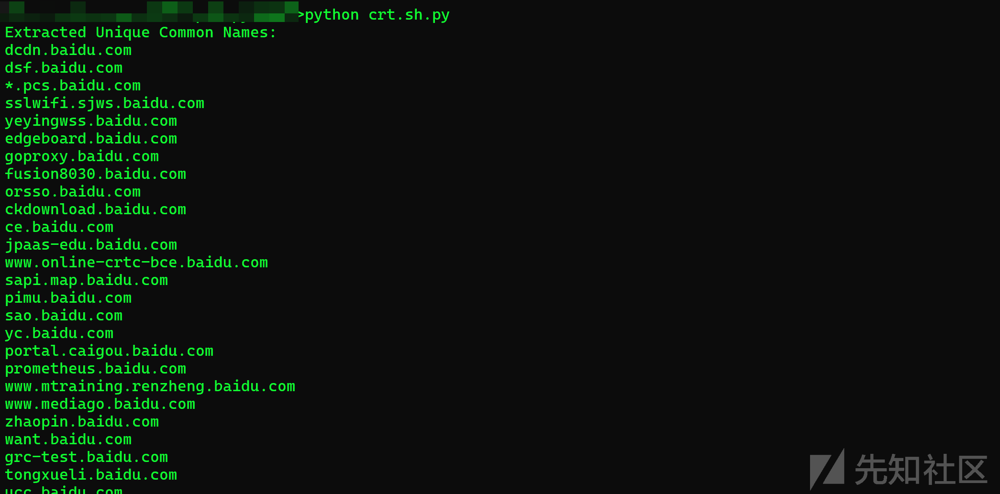

#### 格式处理

还是如法炮制，把这些域名复制下来，使用刚才的格式处理format.txt脚本生成带有协议头的url资产和不带协议头的子域名资产

到此我们又得到了**subdomain-2.txt url-2.txt**

### oneforall

这位更是重量级，从名字都能看出来，这个工具集成了网上提到的所有收集子域名的方式，是的所有！crt.sh查找、VT查找、百度谷歌语法、各种测绘引擎，各种查询接口，子域名爆破，host碰撞，dns域传送，dns查询，子域名接管，fuzz等等一系列的方法！

但是如何最大化利用好oneforall呢？需要进行各种外调api配置，各种模块开启，才能发挥它的最大功效

也就是去config目录，把配置文件中的能配置的api（有些要收费，可以选择不配），都配置一下，各个模块启动一下

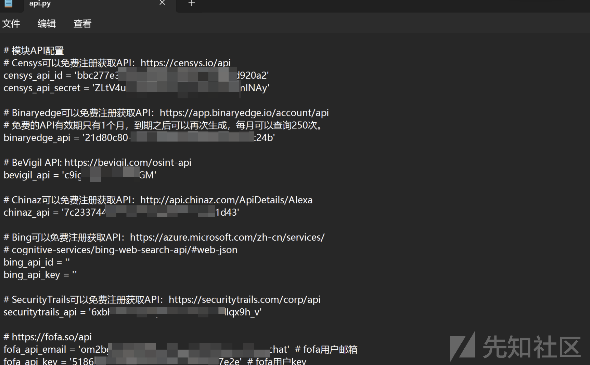

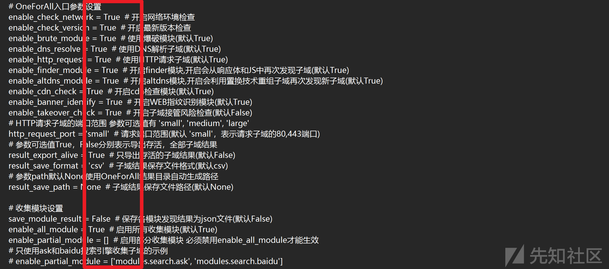

```
python oneforall.py --target huaweiyun.com run
python oneforall.py --targets domain.txt run

```

#### 格式处理

以huaweiyun.com单个目标做演示，实际是对整个domain.txt中的主域名批量找子域名，但是如果太多也可以自由取舍。

oneforall的结果就比较规范了，不需要处理了

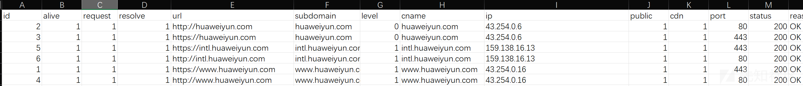

到此我们就又通过**domain.txt**得到了 **subdomain-3.txt** **url-2.txt ip-2.txt**

### 去重

接下来，把**subdomain-1.txt** **url-1.txt ip-1.txt** **subdomain-2.txt** **url-2.txt**  **subdomain-3.txt** **url-3.txt ip-2.txt**分别合并为

**subdomain.txt** **url.txt ip.txt** 再去重就行

这样在收集了子域名的同时，也收集了整理了URL和IP资产，用于接下来的信息收集

### 工具

* FOFA：<https://fofa.info/>
* 英文证书查询：<https://crt.sh/>
* oneforall：<https://github.com/shmilylty/OneForAll>
* 去重：<https://www.iamwawa.cn/quchong.html>

> [2]资产扩展阶段：进一步收集更多隐蔽的资产

## 端口收集

上面收集了大量的主域名，子域名，已经得到了大量初步资产，但是我们都知道一个服务器可以开65535个端口，对于有些不富裕的目标来说，他们往往会在一个服务器上开放多个端口，部署多个web资产，于是端口收集就显得特别重要，这能帮我们进一步打开攻击面，发现更多的比较隐蔽的资产。于是我们对前面收集整理到的**ip.txt**进行全端口扫描！这里就体现了前面为什么要整理好格式了

端口扫描的话，我们使用fscan来做，同时还能进行基础的漏洞扫描和弱口令爆破

```
fscan.exe -hf ip.txt -t 3000 -p 1-65535 -num 100 -np -o result.txt

```


扫描时间比较长，建议放在国外的VPS上后台运行完成

扫描完成之后，fscan的输出格式比较混乱，不便于进行数据整理，于是还可以使用下fscanoutput.py这个脚本，进行扫描结果归类整理

```
python fscanOutput.py result.txt

```

### 工具

* fscan：<https://github.com/shadow1ng/fscan>
* fscanoutput：<https://github.com/ZororoZ/fscanOutput>

## C段收集

但是，我们有时候也不要忘记收集，C段，为什么呢？因为很多大型目标购买ip资产时都是按照C段来买的，比如220.111.222.1/24这个C段可能就是全部属于某一个大型目标的，同时，在一些情况下，有些ip资产不易被常规的收集方法找到，这会导致我们漏掉一些隐蔽的资产。比如有些ip资产既没有证书，也没有配置域名，那么这种情况，我们无脑地去扫描目标的几个C段，探测该C段下，有哪些ip存活，存活的ip又有哪些端口开放……这样就又有可能发现一些更加隐蔽的ip资产，从而发现更多潜在的攻击面！但是如果目标是小型目标，那么不推荐收集C段，因为在同一个C段中，属于该目标的ip资产压根就不多，很容易打偏！

那么怎么收集目标的C段呢？

推荐使用Eeyes根据目标的域名列表，整理目标的C段，这里又用到了前面收集整理的 subdomain.txt

该工具会优先排除架设有CDN的资产，然后再进行C段整理

```
Eeyes -l subdomain.txt

```

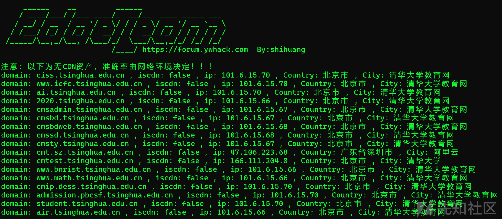

根据整理结果手动选择几个存活ip比较多的C段，保存为c.txt

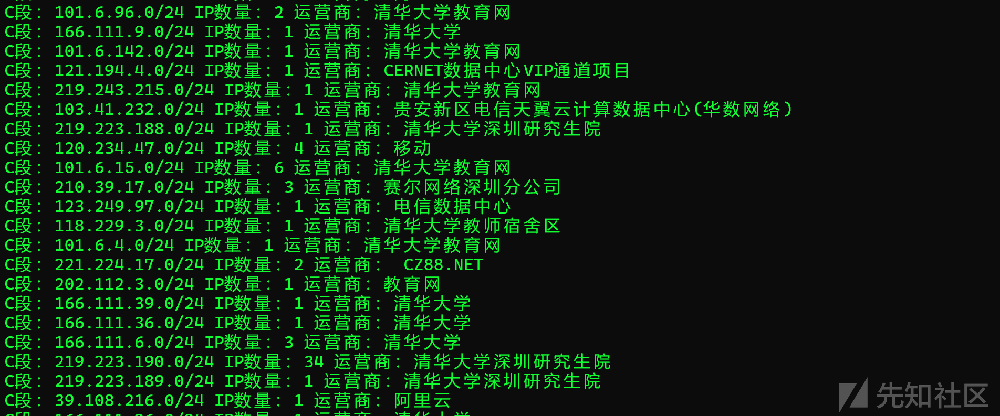

拿到这些C段之后，下一步干什么呢，当然是端口扫描啊，也就是与上面的ip.txt，合并为ip\_c.txt 还是交给fscan全端口扫描

```
fscan.exe -hf ip_c.txt -t 3000 -p 1-65535 -num 100 -np -o result.txt

```

最后，再补充一点，就是有些情况下，资产严格绑定了域名，就是比如域名是test.com:8080，其ip是111.222.333.444:8080，但是访问111.222.333.444:8080是无法访问的，于是为了万无一失，还可以把subdomain.txt也加进去，进行全端口扫描

```
fscan.exe -hf ip_c_subdomain.txt -t 3000 -p 1-65535 -num 100 -np -o result.txt

```

等待fscan扫描完成后，就有可能发现更多的web资产，再把他们合并入url.txt中，这样操作下来，url.txt的资产就更全了！

### 工具

* Eeyes：<https://github.com/EdgeSecurityTeam/Eeyes>

## HOST碰撞

当然，既然是"进一步收集更多隐蔽的资产"，那肯定少不了HOST碰撞。前面不是已经收集整理到了 subdomain.txt 以及 ip\_c.txt 吗，那我们再把subdomain.txt 去批量解析一下域名，记录下无法正常解析的域名，就作为待碰撞的域名字典，ip\_c.txt一般不算太多，于是可以直接全部拿去碰撞，或者手工筛选出几个也是OK的

##### 脚本-domain\_auth.py

```
import socket

def check_domain_resolution(domain):
    try:
        # 尝试获取域名对应的IP地址
        ip = socket.gethostbyname(domain)
        return True
    except socket.gaierror:
        # 如果发生解析错误，说明该域名无法解析
        return False

def main():
    # 读取子域名文件
    input_file = 'subdomain.txt'
    output_file = 'result.txt'

    with open(input_file, 'r') as file:
        domains = [line.strip() for line in file.readlines()]

    # 检查每个域名的解析情况
    unresolved_domains = []
    for domain in domains:
        if not check_domain_resolution(domain):
            print(f"无法解析的域名: {domain}")
            unresolved_domains.append(domain)

    # 将无法解析的域名写入到result.txt
    if unresolved_domains:
        with open(output_file, 'w') as result_file:
            for domain in unresolved_domains:
                result_file.write(f"{domain}\n")
        print(f"解析异常的域名已写入 {output_file}")
    else:
        print("所有域名均能解析")

if __name__ == '__main__':
    main()

```

经过HOST碰撞后，运气好的话直接就撕开口子了，可能发现一些敏感脆弱的资产

具体host碰撞的原理与利用这里不展开讨论，可以看笔者的这一篇文章：[如何HOST碰撞挖掘隐蔽资产](https://x1lys.github.io/2024/12/07/%E5%A6%82%E4%BD%95HOST%E7%A2%B0%E6%92%9E%E6%8C%96%E6%8E%98%E9%9A%90%E8%94%BD%E8%B5%84%E4%BA%A7/)

### 工具

* HostCollision：<https://github.com/pmiaowu/HostCollision>
* Hosts\_scan：<https://github.com/fofapro/Hosts_scan>

> [3]资产梳理阶段：接下来就行测活与指纹识别，便于我们快速梳理攻击面，发现薄弱点

## 测活+指纹识别

目前我们已经得到了经过了整合的url.txt，为了更全一点，我们把之前整理的ip.txt也加入进去，加入之前，先给每一个ip加上http协议头

##### 脚本ipadd.py

```
# 打开输入文件
with open("input.txt", "r") as input_file:
    # 读取文件内容并按行分割
    ip_addresses = input_file.read().splitlines()

# 打开输出文件
with open("output.txt", "w") as output_file:
    # 遍历每个 IP 地址
    for ip in ip_addresses:
        # 添加 http:// 前缀
        http_ip = "http://" + ip
        # 添加 https:// 前缀
        https_ip = "https://" + ip
        # 将结果写入输出文件
        output_file.write(http_ip + "\n")
        output_file.write(https_ip + "\n")

```

```
python ipadd.py

```

然后再次对url.txt进行去重，就得到了**web.txt--经过了多次整理得到的最终的web总资产**

然后，下一步是什么呢？这些大量web资产不一定都可访问，不一定都是存活的，于是我们需要进行存活探测，于是使用一款指纹识别的工具，在指纹识别的同时也就做了存活探测了，而且指纹的识别也对我们快速打点发现漏洞切入点有极大的帮助，识别出指纹，我们就能从大量杂乱无章的资产中，优先地看一些历史漏洞比较多的CMS，或者OA系统的资产，这样就有可能快速发现Nday，一把梭了~

使用TideFInger或者Ehole做指纹识别

```
TideFinger -uf web.txt -nobr -nopoc 
TideFinger -uf web.txt

```

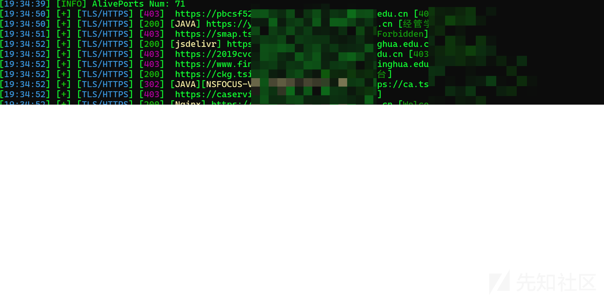

```
ehole.exe finger -l web.txt

```

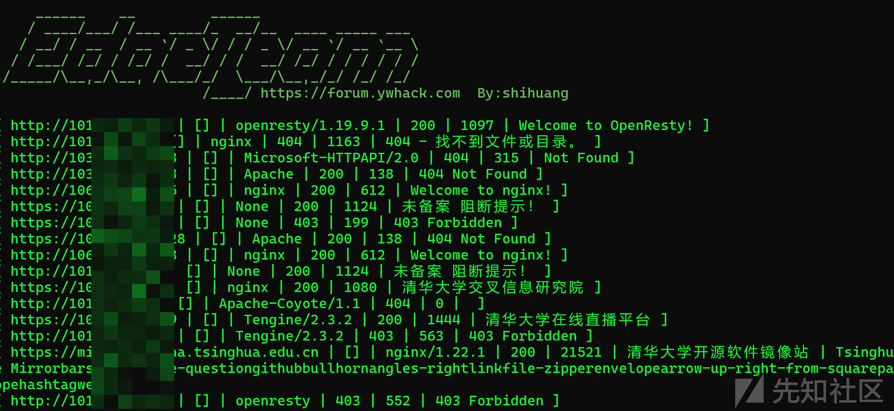

### 工具

* TideFinger：<https://github.com/TideSec/TideFinger_Go>
* Ehole：<https://github.com/EdgeSecurityTeam/EHole>

> [4]自动化扫描阶段：在开始对具体目标开展更详细更有针对性的信息收集前，可以先批量跑一下漏洞扫描器，虽然对一些经常被人测试的SRC目标来说，漏洞几乎无法发现漏洞了，但是不代表漏扫就没用。比如攻防演练时，漏扫还是很重要的，没有扫出nday的目标，就比较难以打穿了，只能要么0day，要么钓鱼了

## 自动化扫描

也没啥好说的，就是用工具就行，这里还是推荐几个最常用的漏洞扫描器

**[Nuclei](https://github.com/projectdiscovery/nuclei)**

```
nuclei.exe -list test.txt -o output.txt

```

**[Afrog](https://github.com/zan8in/afrog)**

```
afrog -T urls.txt
```

**[AWVS](https://www.acunetix.com/)**

```
#批量添加目标
python awvs.py

```

**[Xray](https://github.com/XTLS/Xray-core/releases)**

```
#批量添加目标
python xray.py -r test.txt

# 爬取单个目标
xray.exe webscan --basic-crawler http://xxxx.com/ --html-output  output-a.html

# 监听7777端口，与Brup联动
xray.exe webscan --listen 127.0.0.1:7777 --html-output output-b.html

```

**Goby**

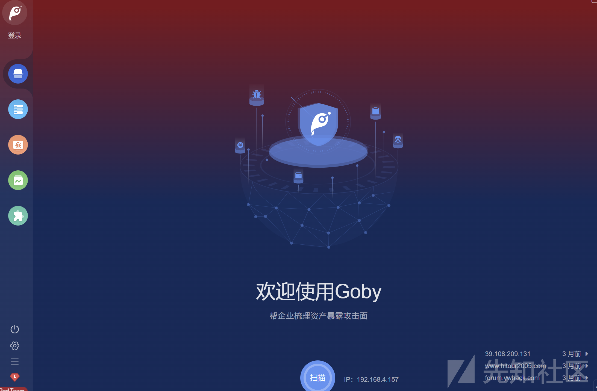

> [5]重点目标针对收集阶段：经过了前面的资产发现与扩展整理阶段，我们已经梳理出了一些重点资产，比如是经典框架系统，CMS，OA系统，有登录框，可注册，SSO系统等等……于是接下来就是对这些重点目标进行针对性的深度信息收集了。为什么把架构搜集放在最前面呢，因为假设目标使用了CDN，反向代理，负载均衡，那我们在没搞清楚架构的情况下，就去渗透测试，端口扫描，内网渗透，那将是毫无意义的或者收效甚微的

## 架构信息

### 反向代理

* **介绍**

反向代理是指代理服务器接收客户端请求，并将请求转发到一个或多个后端服务器上。通过使用反向代理，可以实现负载均衡、安全增强、SSL终止、缓存等功能。例如，当多个后端服务器承载高并发请求时，反向代理可以智能地分发请求，以减少单个服务器的负担，从而提升系统的性能和可用性。

* **识别**

使用 [Wappalyzer](https://www.wappalyzer.com/) 浏览器插件可以帮助识别网站是否使用了反向代理。Wappalyzer会分析网站的架构信息，并显示使用的技术栈、服务器以及潜在的代理信息。

### 负载均衡

* **介绍**

为了防止访问拥塞，减少主服务器的负担，多个负载均衡服务器监听公共网络接口，接收来自客户端的请求，然后将这些请求转发到内网的多个后端服务器端口。负载均衡不仅可以提高访问速度，还能增强系统的容错能力，避免某一个服务器的故障影响整个网站的可用性。

* **识别**

可以使用 **lbd** 工具（Kali Linux自带）来识别负载均衡服务器。该工具通过分析目标服务器的响应特征，帮助判断是否存在负载均衡机制。

### 站库分离

* **介绍**

站库分离是一种将网站前端和数据库后端分离的架构设计。这样，即使攻击者成功入侵了网站服务器，仍然无法直接访问数据库中的敏感数据，因为数据库服务器是独立的。这种分离不仅增强了安全性，还使得网站的维护和扩展变得更加灵活。

### CDN

* **介绍**

为了提升访问体验，在多个地点部署CDN（内容分发网络）服务器，可以自动将用户的请求路由到离其最近的服务器节点，从而就近为用户提供服务。CDN可以有效地提高网站的加载速度和访问稳定性，尤其适用于全球范围内的用户。

* **识别**

可以通过 **多地ping** 工具（[17ce](https://www.17ce.com/)）测试不同地理位置的延迟来识别是否使用了CDN。若目标网站使用CDN，通常在不同区域的访问速度和延迟差异较大。

**绕过方法**:

* 使用 **全球ping**（[ipip.net](https://tools.ipip.net/ping.php)）
* 从子域名入手
* 查找历史DNS解析记录（[IP138](https://site.ip138.com/)）
* 使用接口查询（[Get-site-ip](https://get-site-ip.com/)）
* 使用反向邮件
* **FuckCDN** 工具（[GitHub](https://github.com/Tai7sy/fuckcdn)）
* 使用 **fofa** 搜索引擎
* 利用 **SSRF** 漏洞
* 使用 **phpinfo.php** 探针

### WAF（Web Application Firewall）

* **介绍**

WAF是专门用于防御HTTP请求中的恶意流量的安全防护工具。通过使用WAF，网站能够有效抵御SQL注入、跨站脚本攻击（XSS）等常见Web攻击。

* **识别**

可以使用 [wafw00f](https://github.com/EnableSecurity/wafw00f) 工具来识别目标网站是否使用了WAF。此外，结合视觉分析（[看图识别](https://mp.weixin.qq.com/s/PWkqNsygi-c_S7tW1y_Hxw)）也能帮助识别是否存在WAF。

> 经**架构信息打点**后，可能会遇到绕过挑战，例如绕过CDN、WAF和反向代理等保护机制。在这时，进一步的源码信息收集变得尤为重要。若网站使用CMS，或源码泄露，渗透测试就可以直接上升为白盒测试，或者直接利用现成的漏洞进行攻击，省去了大部分的打点步骤。

## 源码信息

### CMS（内容管理系统）

* 可以使用工具如 **云悉** ([yunsee](https://www.yunsee.cn/)) 和 **360观星** ([360观星](https://fp.shuziguanxing.com/#/)) 来识别目标网站是否使用了特定的CMS系统。通过识别CMS类型，可以帮助渗透测试人员找到已知的漏洞和攻击路径。

### 闭源售卖

* 还可以通过一些渠道（如黑源码网站、Google 搜索和正规源码网站）来寻找潜在的源码泄露，尤其是在闭源项目中，源码泄露能为攻击者提供直接的攻击方式。

### 泄露

* **index of 目录遍历漏洞**
* **githack** ([GitHack](https://github.com/lijiejie/GitHack))
* **svnhack** ([SvnHack](https://github.com/callmefeifei/SvnHack))
* **ds\_store** ([ds\_store\_exp](https://github.com/lijiejie/ds_store_exp))
* **GitHub泄露**
* **网盘泄露**

> 经**源码信息打点**后，若未能收获有价值的信息，接下来只能进行黑盒测试，进一步搜集网站的基本信息。

## 网站基本信息

### 语言

* 可以使用 **Wappalyzer** 工具分析网站所使用的编程语言。

### 数据库

* 使用 **Wappalyzer** 或 **fofa** 进行数据库类型的识别。

### web容器

* 同样，**Wappalyzer** 和 **fofa** 可以帮助识别网站使用的Web容器（如Apache、Nginx等）。

### 操作系统

* 可以通过对目标服务器进行大小写测试和Ping TTL值分析，间接推测目标服务器使用的操作系统。

> 经**网站基本信息打点**后，已经掌握了大部分网站的构成信息。接下来可以进入更深层次的信息挖掘。

## 网站深度信息

### 目录

* **fuff** ([GitHub](https://github.com/ffuf/ffuf))
* **7kbscan** ([7kbscan-WebPathBrute](https://github.com/7kbstorm/7kbscan-WebPathBrute))
* **dirsearch**（Kali自带）

强烈推荐 FUFF 简直是FUZZ神器！

### JS接口

进入API测试

本地浏览器控制台一键下载网站js文件的脚本

##### downloadjs.py

```
// Function to download a file
function downloadFile(filename, content) {
    const blob = new Blob([content], { type: 'application/javascript' });
    const link = document.createElement('a');
    link.href = URL.createObjectURL(blob);
    link.download = filename;
    document.body.appendChild(link);
    link.click();
    document.body.removeChild(link);
}

// Function to fetch external JS file and download it
async function fetchAndDownload(url, defaultFilename) {
    try {
        const response = await fetch(url);
        const content = await response.text();
        const filename = url.split('/').pop() || defaultFilename;
        downloadFile(filename, content);
        console.log(`Downloaded external JS file: ${filename}`);
    } catch (error) {
        console.error(`Failed to download ${url}: ${error}`);
    }
}

// Function to download all JavaScript code found in the document
async function downloadAllJS() {
    // Collect all <script> elements in the document
    const scripts = Array.from(document.querySelectorAll('script'));
    let inlineCounter = 1;

    for (const script of scripts) {
        if (script.src) {
            // Case 2: External JS file
            await fetchAndDownload(script.src, `external-script-${inlineCounter}.js`);
        } else if (script.textContent) {
            // Case 1 & 3: Inline JS code (could include Webpack bundled code)
            const filename = `inline-script-${inlineCounter}.js`;
            downloadFile(filename, script.textContent);
            console.log(`Downloaded inline JS as: ${filename}`);
            inlineCounter++;
        }
    }
}

// Run the function to download all JS files
downloadAllJS();

```

提取js接口的脚本

##### findapi.py

```
import json
import re
import requests
import sys
import os

headers = {
    "User-Agent": "Mozilla/5.0 (X11; Linux x86_64) AppleWebKit/537.36 (KHTML, like Gecko) Chrome/76.0.3809.132 Safari/537.36Mozilla/5.0 (X11; Linux x86_64) AppleWebKit/537.36 (KHTML, like Gecko) Chrome/77.0.3865.90 Safari/537.36"}

fileurl = sys.argv[1]

# 根据传入的文件名确定目录名
filemkdir = fileurl.split('_')[0]

# 确保目录存在
if not os.path.exists(filemkdir):
    os.makedirs(filemkdir)

# 获取路径
paths = []
for dirpath, dirnames, filenames in os.walk(filemkdir):
    for file in filenames:
        file_path = os.path.join(dirpath, file)
        try:
            with open(file_path, "r", encoding='gb18030', errors='ignore') as f2:
                for line in f2:
                    line = line.strip('\n').strip('\t')
                    p = re.findall(r'''(['"]\/[^][^>< \)\(\{\}]*?['"])''', line)
                    if p:
                        for path in p:
                            path = path.replace(':"', "").replace('"', "")
                            paths.append(file + "---" + path)
        except FileNotFoundError:
            print(f"File not found: {file_path}")
        except Exception as e:
            print(f"Error reading file {file_path}: {e}")

# 写入提取到的路径
output_file = fileurl + '_path.txt'
with open(output_file, "a+", encoding='gb18030', errors='ignore') as output:
    for var in sorted(set(paths)):
        output.write(var + '\n')

```

* **JSfinder**
* **packer-fuzzer**
* **URLfinder**

### 快照

* **网站时光机** ([Wayback Machine](https://web.archive.org/))

### 插件信息

* **Wappalyzer** 可以帮助识别网站中所用的插件信息。

### 第三方接口信息

* **Wappalyzer** 可以识别第三方接口信息，例如支付接口、社交登录等。

### 旁站

* 使用 [旁站](https://www.webscan.cc/) 工具分析潜在的旁站资源。

### 端口服务

* **nmap**（Kali自带）可以扫描网站开放的端口，并进一步识别服务信息。
* **railgun**（推荐，速度快）

| **端口号** | **服务** | **攻击方式** | **常见漏洞** |
| --- | --- | --- | --- |
| **21** | FTP | 弱口令爆破、匿名登录、目录遍历 | 未授权访问、FTP暴露敏感文件 |
| **22** | SSH | 弱口令攻击、公私钥猜测、利用旧版本漏洞 | CVE-2018-15473 (用户名枚举漏洞) |
| **23** | Telnet | 弱口令爆破、明文通信窃听 | 未授权访问、会话劫持 |
| **25** | SMTP | 邮件伪造、开放中继测试 | 未授权中继、CVE-2015-0235 (GHOST 漏洞) |
| **53** | DNS | DNS 缓存中毒、域传送漏洞 | DNS 放大攻击、未授权域传送 |
| **80** | HTTP | SQL 注入、XSS、CSRF、路径穿越 | Web 应用漏洞，如 SQLi、CVE-2021-12345（假设 Web 服务漏洞） |
| **110** | POP3 | 弱口令攻击、邮件劫持 | 未授权访问、明文传输 |
| **143** | IMAP | 邮件劫持、弱口令攻击 | 未授权访问 |
| **443** | HTTPS | SSL/TLS 漏洞利用 (如 Heartbleed)、中间人攻击 | Heartbleed (CVE-2014-0160) |
| **3306** | MySQL | 弱口令攻击、SQL 注入 | 未授权访问、CVE-2012-2122 (MySQL 身份验证绕过漏洞) |
| **3389** | RDP | 弱口令爆破、会话劫持、远程桌面协议利用 | CVE-2019-0708 (BlueKeep) |
| **6379** | Redis | 未授权访问、配置文件写入攻击 | 未授权访问，RCE（写 SSH 公钥） |
| **8080** | HTTP Proxy/Tomcat | 未授权访问、弱口令爆破、路径穿越 | Apache Tomcat CVE-2017-12615 (PUT 文件上传漏洞) |
| **445** | SMB | SMB 漏洞利用 (如 EternalBlue)、弱口令攻击 | EternalBlue (CVE-2017-0144)、SMBRelay |
| **135** | RPC/DCOM | RPC 漏洞利用 | CVE-2003-0352 (MS03-026 RPC 漏洞) |
| **1433** | MSSQL | 弱口令攻击、数据库注入 | 未授权访问，CVE-2019-1068 (SQL Server RCE) |
| **1521** | Oracle DB | 弱口令爆破、TNS 协议漏洞利用 | CVE-2012-1675 (TNS Listener 泄漏漏洞) |
| **2049** | NFS | 未授权访问、敏感数据读取 | NFS 配置错误，导致敏感数据暴露 |
| **5060** | SIP | SIP 协议劫持、放大攻击 | 未授权访问，SIP 劫持导致话费损失 |
| **11211** | Memcached | Memcached 放大攻击 | Memcached 未授权访问导致流量放大攻击 |

> 经**网站具体信息打点后**，基本上已经掌握了大部分的信息。若幸运的话，可能已经发现了漏洞，或者找到了攻击路径。如果还没有突破，可以考虑社工信息收集，但其成功几率相对较小。

## 网盘信息

有时候网盘信息也有可能泄露敏感信息……

这里我把github也归类为"网盘"

* Github语法

利用Github语法检索敏感信息

```
in:name test              #仓库标题搜索含有关键字
in:descripton test         #仓库描述搜索含有关键字
in:readme test             #Readme文件搜素含有关键字
stars:>3000 test           #stars数量大于3000的搜索关键字
stars:1000..3000 test      #stars数量大于1000小于3000的搜索关键字
forks:>1000 test           #forks数量大于1000的搜索关键字
forks:1000..3000 test      #forks数量大于1000小于3000的搜索关键字
size:>=5000 test           #指定仓库大于5000k(5M)的搜索关键字
pushed:>2019-02-12 test    #发布时间大于2019-02-12的搜索关键字
created:>2019-02-12 test   #创建时间大于2019-02-12的搜索关键字
user:test                  #用户名搜素
license:apache-2.0 test    #明确仓库的 LICENSE 搜索关键字
language:java test         #在java语言的代码中搜索关键字
user:test in:name test     #组合搜索,用户名test的标题含有test的

site:Github.com smtp
site:Github.com smtp @qq.com
site:Github.com smtp @126.com
site:Github.com smtp @163.com
site:Github.com smtp @sina.com.cn
site:Github.com smtp password
site:Github.com String password smtp
site:Github.com smtp @baidu.com

site:Github.com sa password
site:Github.com root password
site:Github.com User ID=’sa’;Password
site:Github.com inurl:sql

site:Github.com svn
site:Github.com svn username
site:Github.com svn password
site:Github.com svn username password

site:Github.com password
site:Github.com ftp ftppassword
site:Github.com 密码
site:Github.com 内部

```

Github监控

* 云绘监控：<https://github.yhuisec.com/>

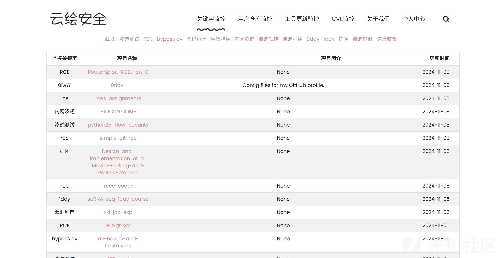

* 凌风云
* gitlab
* 码云
* 语雀
* 其他网盘

### 工具

* gitdorks\_go：<https://github.com/damit5/gitdorks_go>
* GitDorker：<https://github.com/obheda12/GitDorker>

## 社工信息

社工信息收集主要依赖人工去查找，目标是找出与目标相关的域名服务商、服务器供应商、网站管理员和开发人员等信息。

善用：

* goole语法

```
PHP后缀参数

site:baidu.com ext:php inurl:?
openbugbounty关于该域名的报告

site:openbugbounty.org inurl:reports intext:"baidu.com"
敏感信息后缀

site:"baidu.com" ext:log | ext:txt | ext:conf | ext:cnf | ext:ini | ext:env | ext:sh | ext:bak | ext:backup | ext:swp | ext:old | ext:~ | ext:git | ext:svn | ext:htpasswd | ext:htaccess
易受XSS攻击的参数

inurl:q= | inurl:s= | inurl:search= | inurl:query= | inurl:keyword= | inurl:lang= inurl:& site:baidu.com
开放重定向参数

inurl:url= | inurl:return= | inurl:next= | inurl:redirect= | inurl:redir= | inurl:ret= | inurl:r2= | inurl:page= inurl:& inurl:http site:baidu.com
sql报错参数

inurl:id= | inurl:pid= | inurl:category= | inurl:cat= | inurl:action= | inurl:sid= | inurl:dir= inurl:& site:baidu.com
SSRF易发参数

inurl:http | inurl:url= | inurl:path= | inurl:dest= | inurl:html= | inurl:data= | inurl:domain= | inurl:page= inurl:& site:baidu.com
LFI常见参数

inurl:include | inurl:dir | inurl:detail= | inurl:file= | inurl:folder= | inurl:inc= | inurl:locate= | inurl:doc= | inurl:conf= inurl:& site:baidu.com
RCE常见参数

inurl:cmd | inurl:exec= | inurl:query= | inurl:code= | inurl:do= | inurl:run= | inurl:read= | inurl:ping= inurl:& site:baidu.com
敏感关键字

inurl:config | inurl:env | inurl:setting | inurl:backup | inurl:admin | inurl:php site:baidu.com
敏感参数

inurl:email= | inurl:phone= | inurl:password= | inurl:secret= inurl:& site:baidu.com
API文档

inurl:apidocs | inurl:api-docs | inurl:swagger | inurl:api-explorer site:"baidu.com"
代码泄露

site:pastebin.com "baidu.com"
site:jsfiddle.net "baidu.com"
site:codebeautify.org "baidu.com"
site:codepen.io "baidu.com"
云存储

site:s3.amazonaws.com "baidu.com"
site:blob.core.windows.net "baidu.com"
site:googleapis.com "baidu.com"
site:drive.google.com "baidu.com"
site:dev.azure.com "baidu.com"
site:onedrive.live.com "baidu.com"
site:digitaloceanspaces.com "baidu.com"
site:sharepoint.com "baidu.com"
site:s3-external-1.amazonaws.com "baidu.com"
site:s3.dualstack.us-east-1.amazonaws.com "baidu.com"
site:dropbox.com/s "baidu.com"
site:box.com/s "baidu.com"
site:docs.google.com inurl:"/d/" "baidu.com"
JFrog 软件工件管理工具

site:jfrog.io "baidu.com"
Firebase

site:firebaseio.com "baidu.com"
文件上传点

site:baidu.com ”choose file”
漏洞赏金计划和漏洞披露计划

"submit vulnerability report" | "powered by bugcrowd" | "powered by hackerone"
site:*/security.txt "bounty"
Apache服务器状态暴露

site:*/server-status apache
WordPress

inurl:/wp-admin/admin-ajax.php
Drupal

intext:"Powered by" & intext:Drupal & inurl:user
Joomla

site:*/joomla/login

```

* 百度
* 各种社交媒体
* 甚至是可联网的搜索的AI

> 网站资产信息打点到此为止，但我们仍可以对目标旗下的小程序、APP进行进一步的信息搜集。

## 小程序信息

小程序和APP的信息收集方法不多赘述，简单提及如下：

* 使用安卓模拟器或 **Burp Suite** 等抓包工具分析出Web资产，然后重复上述信息收集步骤。
* 反编译源码，查找泄露信息，提取接口、JS逆向签名、加密算法等信息。

## APP信息

### 外在

* 使用安卓模拟器和 **Burp Suite** 抓包工具分析Web资产，重复信息收集步骤。

### 内在

* **查壳工具** 查找壳（[apkscan](https://github.com/itsmenaga/apkscan)）
* **安卓信息提取器**（[AppInfoScanner](https://github.com/kelvinBen/AppInfoScanner)）
* **安卓修改大师**（[APKEditor](https://www.apkeditor.cn/)）进行反编译

信息收集是灵活的，不必局限于某一固定的思路。关键是学习如何通过一层层剥茧收集目标信息，分析他人收集信息的思维方式，而不仅仅是手段。

> 本文略讲了信息收集的冰山一角，侧重点在资产发现与扩展和整理上，重点资产针对性深度收集部分比较简略。但其实信息搜集的艺术远不止此，笔者也技术浅薄，仍需多多学习，如有不对之处还请师傅们斧正！
