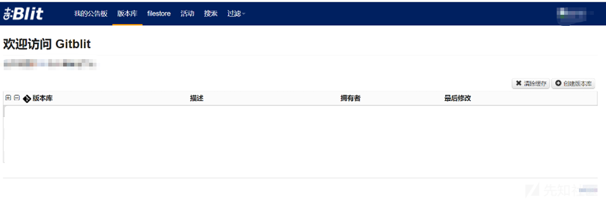
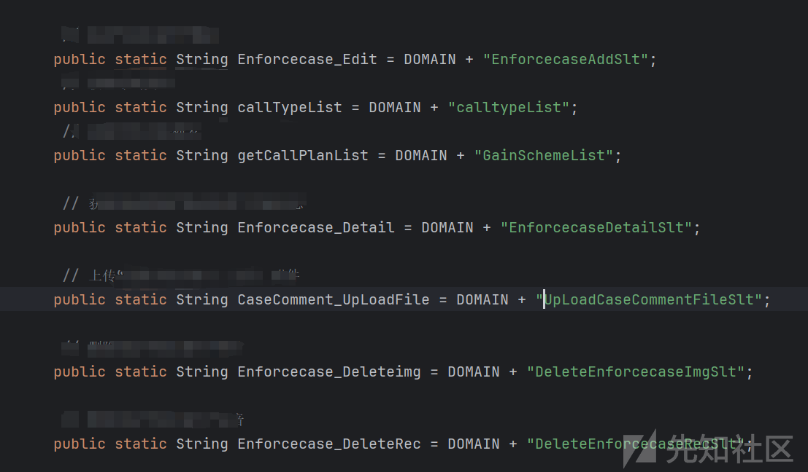
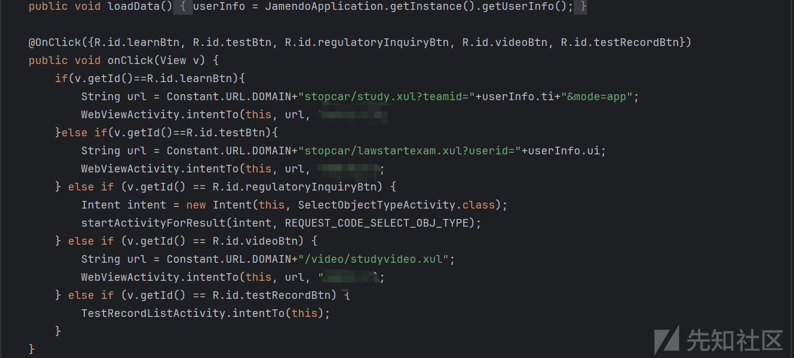
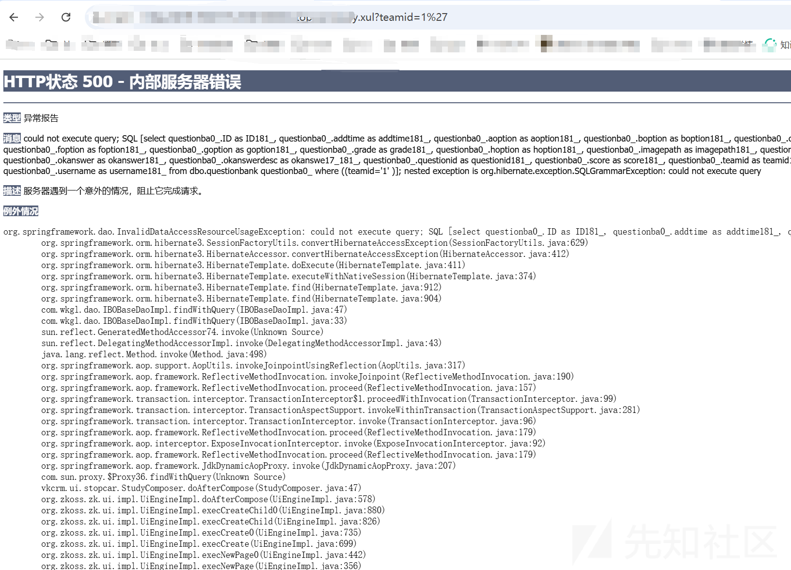
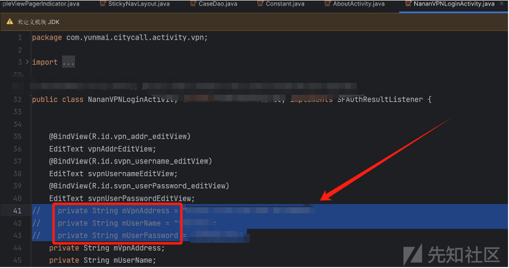
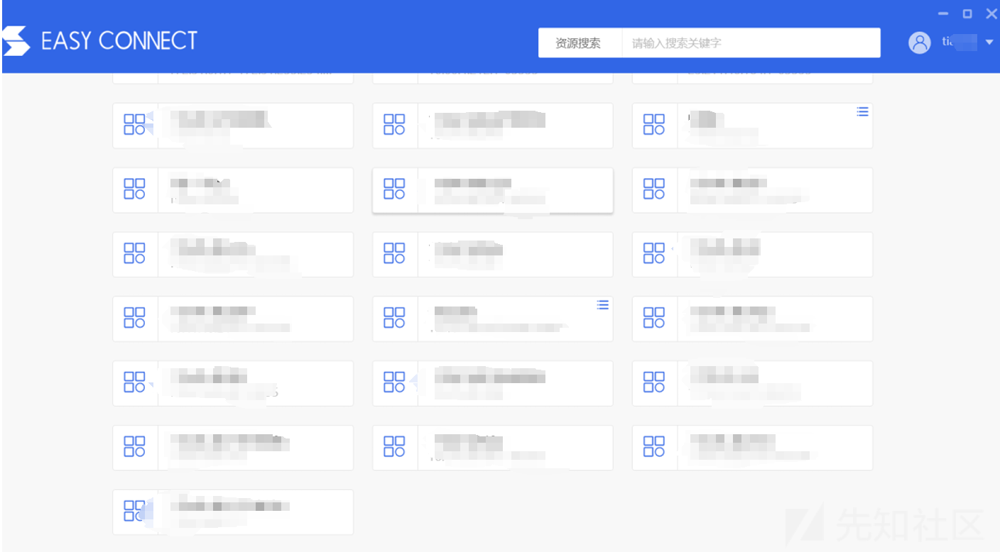
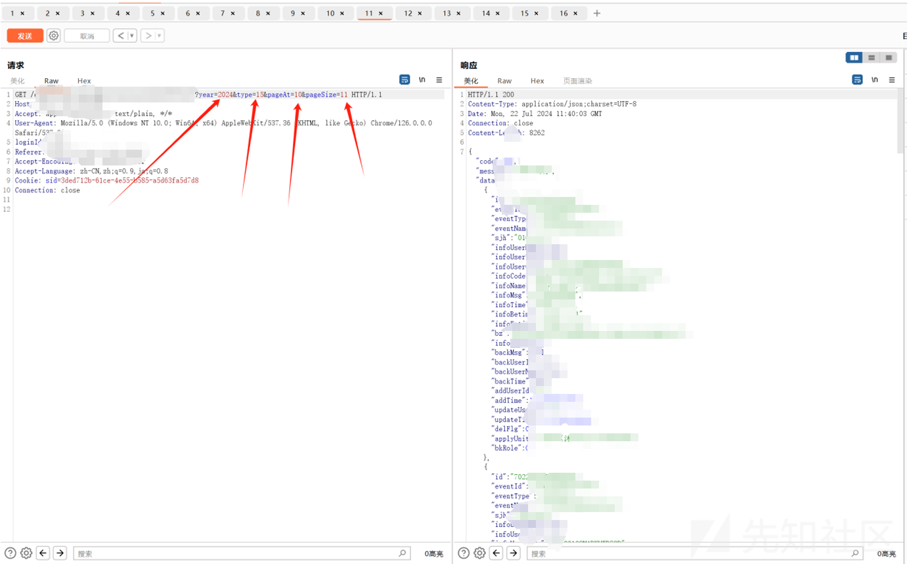
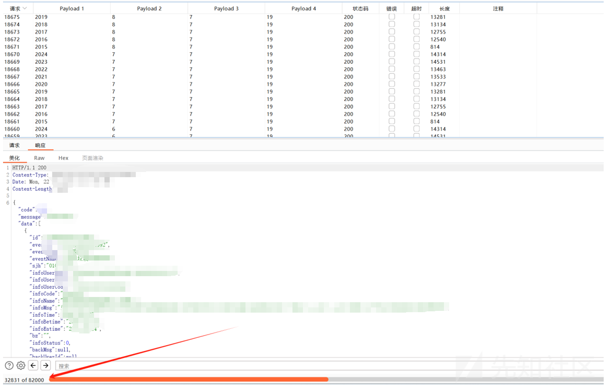
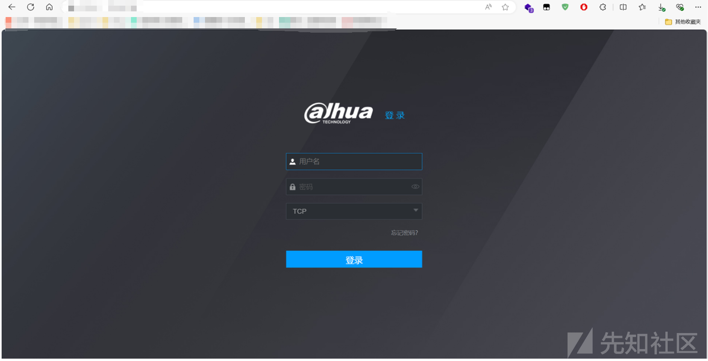

# 某渗透中代码审计到内网遨游-先知社区

> **来源**: https://xz.aliyun.com/news/16272  
> **文章ID**: 16272

---

本文章中所有内容仅供学习交流，严禁用于商业用途和非法用途，否则由此产生的一切后果均与文章作者无关。

### 前言

在今年的某次HW中通过巧妙的信息收集，成功拿下该站的四套源码。话多说直接开始下面就直接分享。

### 信息收集

首先在攻防演练中拿到一个系统，需要先找出他的敏感资产。比如医院，就可以对他的小程序或者是OA进行下手。小程序重要挖一些逻辑的信息泄露。OA的话如果师傅有day的话直接用day打，没有的话也不要灰心，可以进行一些收集账号如(测试账号，管理员默认账号等)还可以用一些OA的漏扫工具进行一些测试。因为运气不好没有分到一些医院或者是学校的靶标。

分享一个打点思路：当拿到一个系统之后我的思路是直接使用fofa，hunter等测绘。拿到主域名将资产全部导出进行一个资产梳理如（判断存活可使用httpx工具，将敏感资产进行筛选使用ehole等）在进行一个打点。  
工具地址：

```
https://github.com/projectdiscovery/httpx/  ##httpx
https://github.com/EdgeSecurityTeam/EHole   ##Ehole
```

进行到这一步大家是不是已经迫不及待开始测试了，当然可以更细节一点。将你需要测试的目标进行一个资产归属的查询。这里也推荐一个非常好用的工具，不管在攻防演练还是挖掘src中都可以使用密探（集成了dirsearch、JSFinder、fofaviewer、FindSomeThing、SuperSearchPlus 等工具）。在测试之前把地址放进工具跑一下有意象不到的收获。  
工具地址：

```
https://github.com/kkbo8005/mitan
```

### 案例

我也是根据以上测试思路进行的测试。首选拿到靶标以后我通过以上工具进行了检测筛选出了旁站使用密探对该目标进行信息收集。这里也是开局一个登录框，但奈何本人实力不够没有利用出来。  
  
只好另想办法打开工具查看是否有一些可以进一步利用的信息。看见一个备案号灵机一动去hunter继续收集。  
  
在翻找过程中找到了gitbilt平台，这个可是一个好东西存源码的地方。使用nday测试半天没有结果。后来没有办法了进行手动弱口令直接就进去了，还能说什么弱口令永远的神。这里直接码死太敏感了。  


#### 代码审计

直接黑盒白盒一起冲，拿到源码后进行审计。我先进行Upload功能搜索发现了一个静态变UpLoadCaseCommentFileSl定义了文件上传相关的功能接口地址。很可能就上传相关的文件处理逻辑有关。后进行黑盒测试但是最终没能利用出来。  


##### SQL注入

查看业务功能，锁定相应的逻辑层全局进行搜索搜索userInfo的获取方式，查找其具体实现，调用了JamendoApplication.getInstance().getUserInfo() 的定义确认userInfo对象的初始化过程。userInfo.ti 和 userInfo.ui由外部输入传入。里面的teamid是外部可控的。  
  
进行拼接路径，后直接一个单引用成功报错。  


#### 审计中的惊喜

该源码中居然写入了vpn登录口，并将vpn测试账号一起写入了源码中这个不就直接打内网了嘛太幸福了呀  


#### 内网

拿到账号进入看见这个段差点没吓到我太多了。推荐一个方法网段太多无法确定的时候。可以使用fscan，这里可以参考一个这条命令 fscan.exe -hf ip.txt -np -pa 3389 -nopoc。其中举例为3389端口然后自由发挥,扫描完成后在内网中发现了xx管理库。  
  
该站点有四个功能点随后进行测试  
  
抓个包查看数据包我的天又是id 直接遍历，有一个细节点这个系统数据特别多，有四个点可以遍历，每一个点遍历都会刷新数据。  
  
还是使用万能的burp来fuzz 添加四个payload进行交叉爆破。  
  
太大了根本跑不完溜了溜了直接交数据分了。然后就是进行内网的资产整理找一些监控或者机器，下面是大华的设备。这里也分享一个大华的漏扫工具也是非常好用。<https://github.com/MInggongK/dahuaExploitGUI>  


### 总结：

在本次的测试中还是算成功，美中不足的地方就是在代码审计方面，没有审出洞有亿点可惜，sql注入没有完全演示出来用ghauri直接就跑出来了比较容易。
