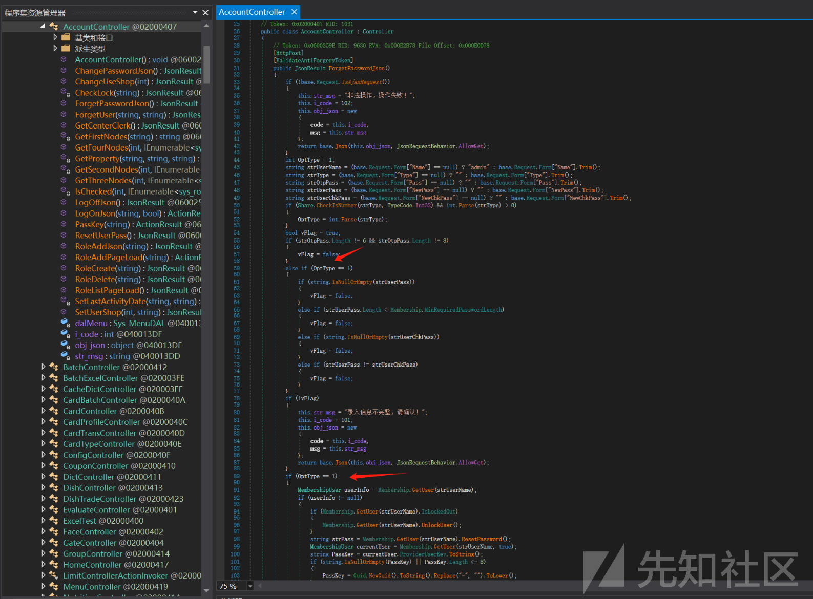
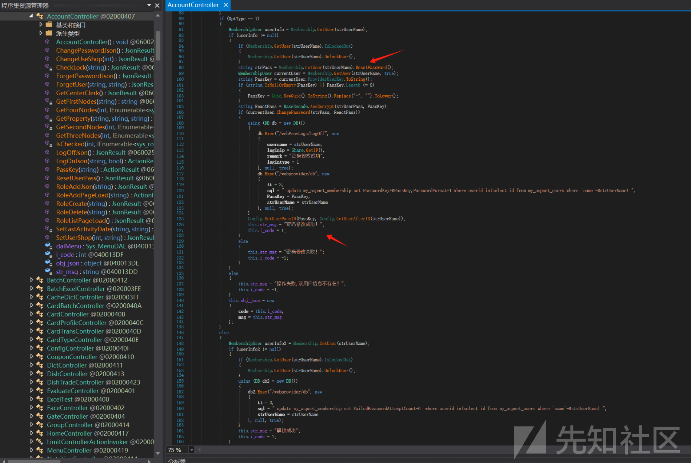
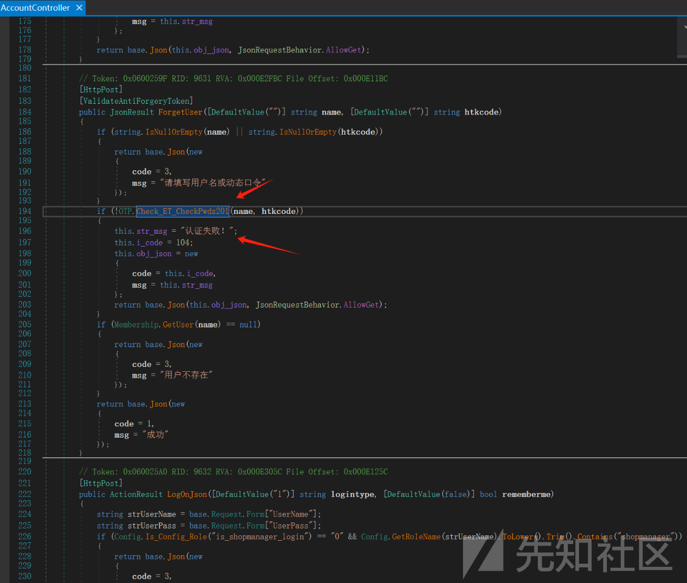
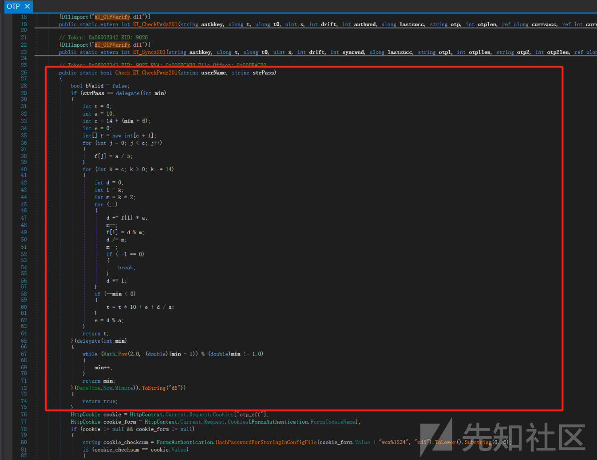
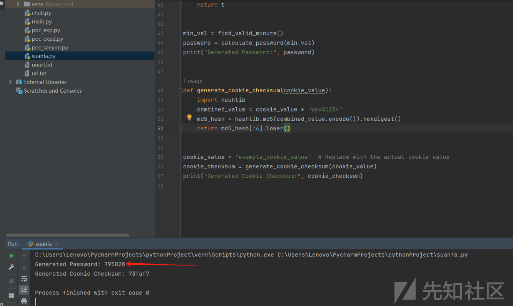
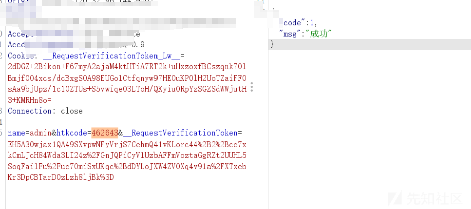
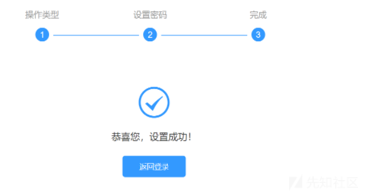

# 某系统审计权限绕过-CVE-2024-9554-先知社区

> **来源**: https://xz.aliyun.com/news/16282  
> **文章ID**: 16282

---

任意用户密码重置  
漏洞位置  
首先看忘记密码位置



  
看了下逻辑，不需要旧密码，只要符合otp长度6位或者8位，用户存在，并且全部填写，就可以修改用户  
当随便输入动态otp时候

  
会报104  
那么想办法绕过104，如下是逻辑位置

  
可以看到Check\_ET\_CheckPwdz201函数进行了检测  
跟入该函数  
  
可以看到有算法，可能看着有点不舒服实际结构就是

```
int initialMin = DateTime.Now.Minute;  // 获取当前的分钟数
int min = delegate (int min)
{
    while (Math.Pow(2.0, (double)(min - 1)) % (double)min != 1.0)
    {
        min++;
    }
    return min;
}(initialMin);  // 将当前分钟数传递给匿名函数

```

min 的初始值是 DateTime.Now.Minute。  
第一个匿名函数用于修改 min 使其满足特定条件。  
第二个匿名函数使用修改后的 min 进行一系列计算，生成一个整数 t。  
将生成的整数 t 转换为 6 位数字的字符串格式，并与输入的密码进行比较。  
根据c#代码转成python代码进行生成，如下  
任意用户密码重置，只要有存在的用户就可以  
使用脚本生成otp



  
这部说明otp绕过成功，之后就可以随便修改密码了  
可能有的界面不一样，但是otp生成方法一样，都可以成功


