# 代码审计-某物联网系统RCE-先知社区

> **来源**: https://xz.aliyun.com/news/16285  
> **文章ID**: 16285

---

**Author：Ha1ey**

全局搜索找到代码中有一处关于`newInstance`实例化方法的调用，位于`jetlinks-supports-1.2.3-SNAPSHOT.jar!/org/jetlinks/supports/protocol/management/jar/JarProtocolSupportLoader.class`类的`lookupProvider`方法中

代码如下：


不难发现`providerType.getDeclaredConstructor().newInstance()`在这个位置有一处调用构造方法实例化返回一个`ProtocolSupportProvider`对象。

向上找到`org.jetlinks.community.protocol.AutoDownloadJarProtocolSupportLoader#load`这个方法有两处调用，一处是`location`参数是`http`形式的

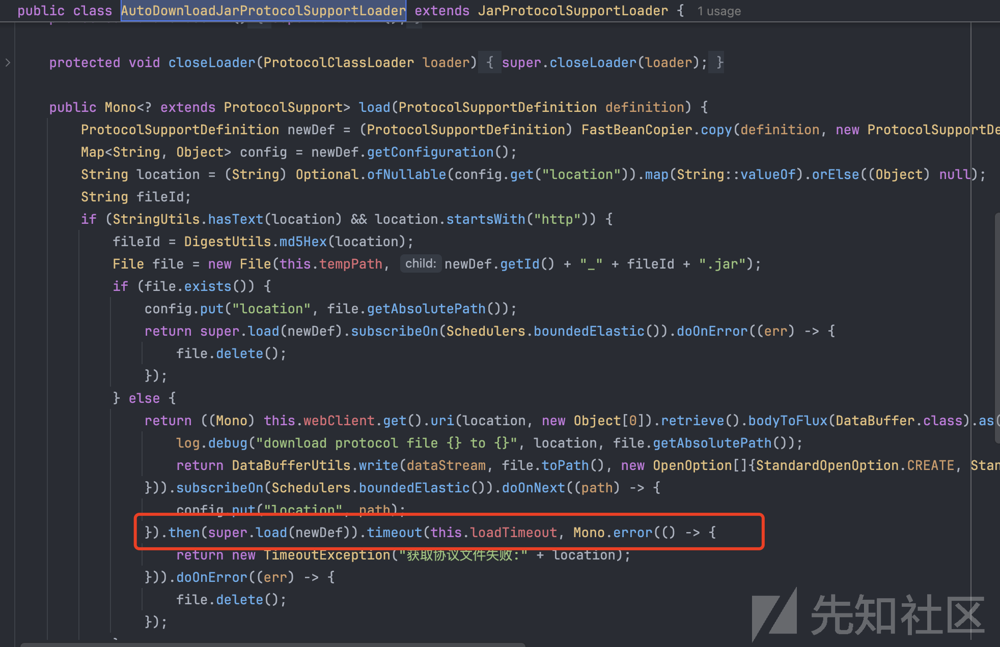

另一处则是参数为fileid指定的文件：

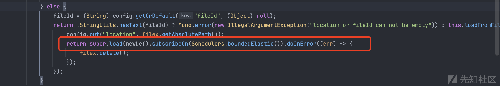

最后定位到入口点`org.jetlinks.community.device.web.ProtocolSupportController#convertToDetail`，web根路径是/api，所以对应的路由是`/api/protocol/convert`

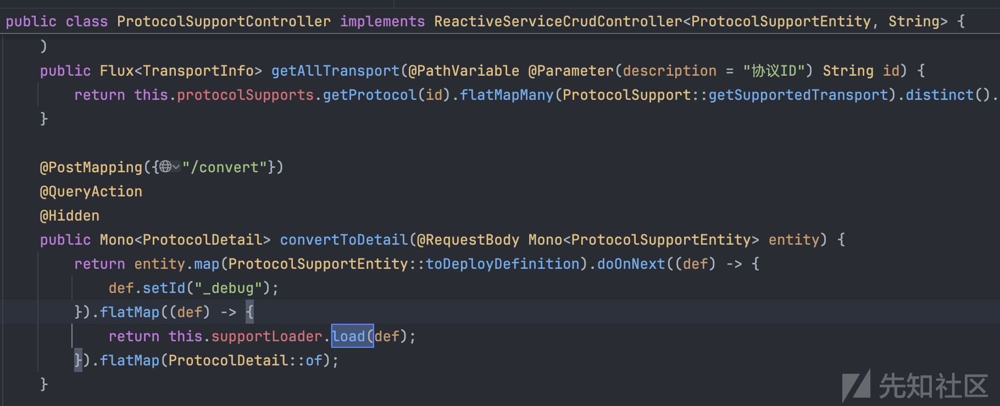

后面动态调试一下求证一下前面的猜想

断点放在`org.jetlinks.community.device.web.ProtocolSupportController#convertToDetail`方法中，会调用到`org.jetlinks.community.protocol.SpringProtocolSupportLoader#load`这个方法

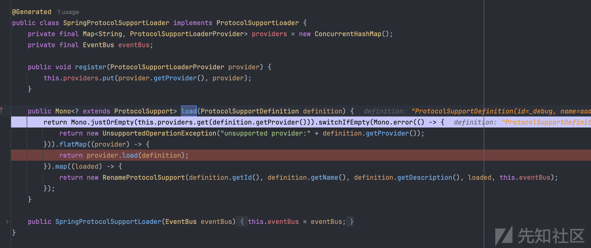

再往下就到了我们关注的`org.jetlinks.community.protocol.AutoDownloadJarProtocolSupportLoader#load`这个load方法，这个方法有两部分加载方式，首先看第一种

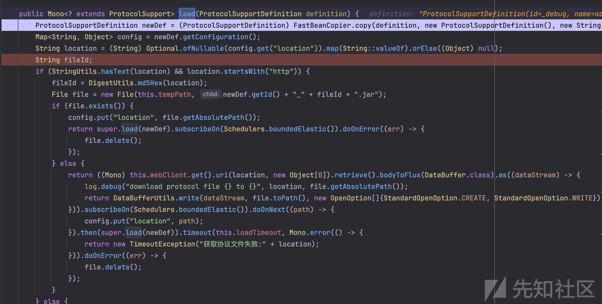

获取参数`location`的值，判断是否是http，把值md5后找一下临时目录中的jar包，如果存在就直接调用`org.jetlinks.supports.protocol.management.jar.JarProtocolSupportLoader#load`方法处理，如果文件不存在，就从指定的url下载jar包到本地，然后在调用`load`去加载，

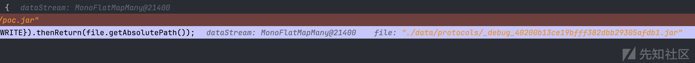

另一种则是通过我们指定fileId参数去指定加载目标本地的一个jar包。

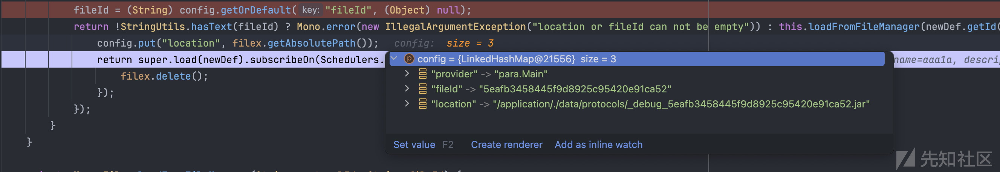

上述两种获取jar的方式最后都会走到`org.jetlinks.supports.protocol.management.jar.JarProtocolSupportLoader#load`这里主要是获取一个classloader

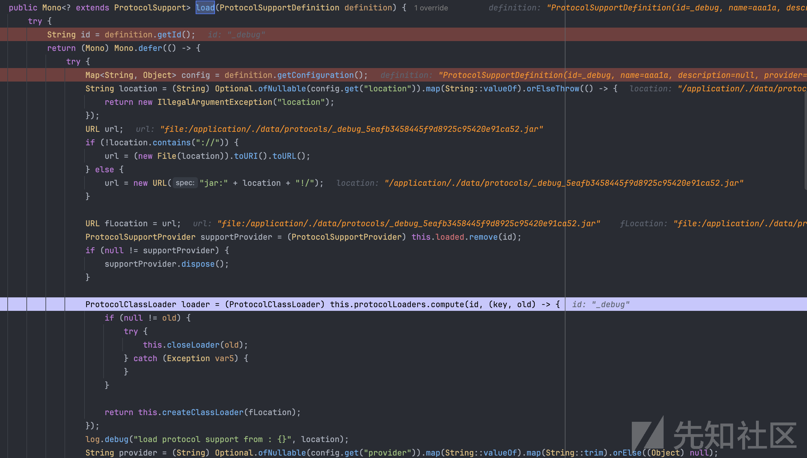

最后调用sink点

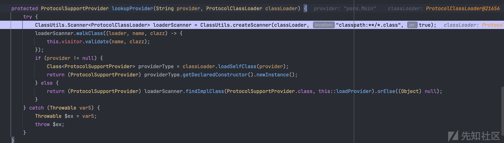

`org.jetlinks.supports.protocol.management.jar.JarProtocolSupportLoader#lookupProvider`方法中有一处

```
loaderScanner.walkClass((loader, name, clazz) -> {
                this.visitor.validate(name, clazz);
            });

```

这里调用ASM去检查了我们jar包的classname是否包含`com.google`、`org.apache`、`cn.hutool`这几个包名

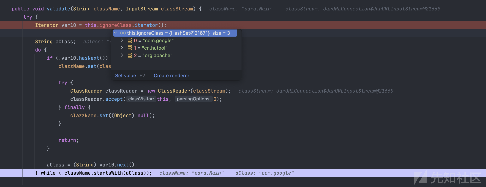

如果不是以上述包名开头的类，就检查方法调用的黑名单  
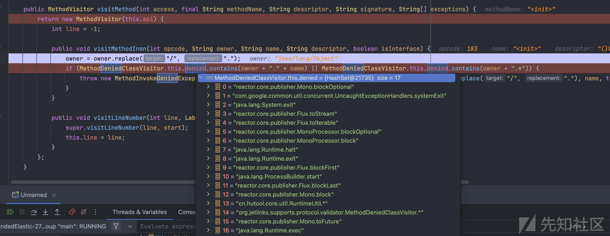

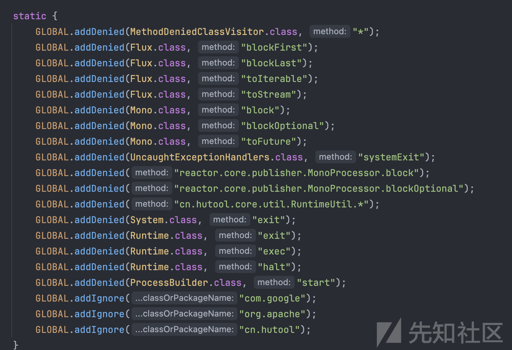

这里很好绕过，可以直接使用反射加载字节码的方式进行恶意类加载。

**两种加载恶意jar的方式**

第一种；

利用系统自带的upload接口去上传一个jar，拿到id

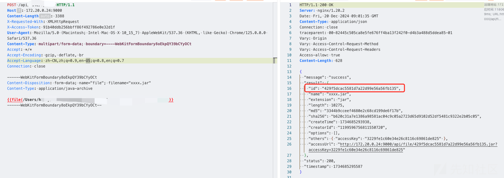

然后进行加载

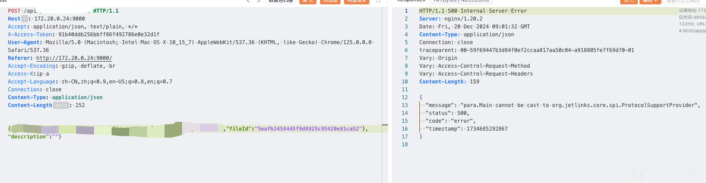

第二种：

直接出网远程加载一个jar

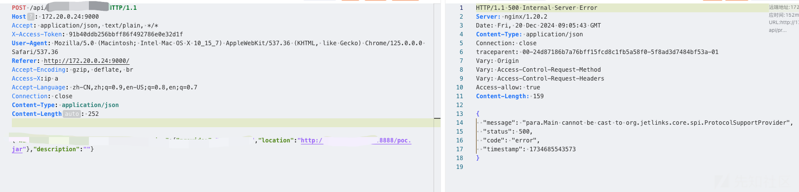

**本文章仅供学习交流使用，文中所涉及的技术、思路和工具仅供以安全为目的的学习交流使用，任何人不得将其用于非法用途以及盈利等目的，否则后果自行承担！**
